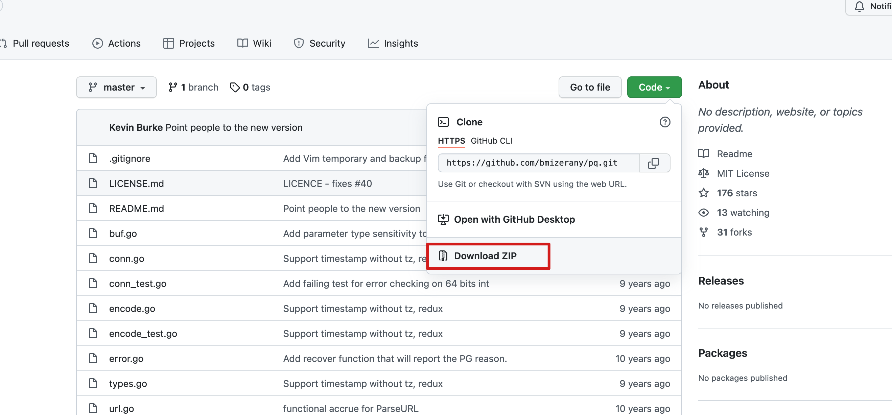

# go 语言连接 Mogdb

本文出处：[https://www.modb.pro/db/388092](https://www.modb.pro/db/388092)

## 1.环境介绍

```
[root@mogdb-kernel-0004 src]# go version 				//yum安装的go go version go1.16.13 linux/amd64 [root@mogdb-kernel-0004 src]# cat /etc/redhat-release CentOS Linux release 7.6.1810 (Core)
```

## 2.获取 pg 驱动

```
https://github.com/bmizerany/pq 支持database/sql驱动，纯Go写的 https://github.com/jbarham/gopgsqldriver 支持database/sql驱动，纯Go写的 https://github.com/lxn/go-pgsql 支持database/sql驱动，纯Go写的
```

### (1)自动下载驱动包

```
go get github.com/bmizerany/pq go get github.com/jbarham/gopgsqldrive go get github.com/lxn/go-pgsql 注:3选1即可，但因为网络原因，大概率不能自动下载下来，所以我也会介绍手动安装驱动包
```

### (2)手动安装驱动包

github 上手动下载驱动包，将其上 golang 安装目录的 src 文件夹下解压，

```
[root@mogdb-kernel-0004 src]# ll pq-master.zip
-rw-r--r-- 1 root root 17412 Mar 31 09:45 pq-master.zip
[root@mogdb-kernel-0004 src]# pwd
/usr/lib/golang/src
[root@mogdb-kernel-0004 src]# tree pq-master
pq-master
├── buf.go
├── conn.go
├── conn_test.go
├── encode.go
├── encode_test.go
├── error.go
├── LICENSE.md
├── README.md
├── types.go
├── url.go
└── url_test.go
0 directories, 11 files

复制
```



我选择的是 github.com/bmizerany/pq 这个驱动，所以需要在 src 下建立 github.com/bmizerany/pq 文件夹

```
[root@mogdb-kernel-0004 src]# mkdir -p github.com/bmizerany/pq
[root@mogdb-kernel-0004 src]# cd github.com/bmizerany/pq/
[root@mogdb-kernel-0004 pq]# mv /usr/lib/golang/src/pq-master/* ./       //将pq-master启动包移动到github.com/bmizerany/pq下
[root@mogdb-kernel-0004 pq]# pwd
/usr/lib/golang/src/github.com/bmizerany/pq
[root@mogdb-kernel-0004 pq]# ll
total 72
-rw-r--r-- 1 root root  1295 Nov 29  2013 buf.go
-rw-r--r-- 1 root root 12225 Nov 29  2013 conn.go
-rw-r--r-- 1 root root  7939 Nov 29  2013 conn_test.go
-rw-r--r-- 1 root root  2428 Nov 29  2013 encode.go
-rw-r--r-- 1 root root  3417 Nov 29  2013 encode_test.go
-rw-r--r-- 1 root root  1757 Nov 29  2013 error.go
-rw-r--r-- 1 root root  1058 Nov 29  2013 LICENSE.md
-rw-r--r-- 1 root root  2844 Nov 29  2013 README.md
-rw-r--r-- 1 root root 16426 Nov 29  2013 types.go
-rw-r--r-- 1 root root  1242 Nov 29  2013 url.go
-rw-r--r-- 1 root root  1181 Nov 29  2013 url_test.go
[root@mogdb-kernel-0004 pq]# go install github.com/bmizerany/pq 				//手动安装，没有任何信息报出，及说明安装完成
[root@mogdb-kernel-0004 pq]#

复制
```

## 3.创建简单测试表

```
//创建用户 openGauss=# create database test_db; CREATE DATABASE openGauss=# create user test_usr password 'test@123'; NOTICE:  The encrypted password contains MD5 ciphertext, which is not secure. CREATE ROLE openGauss=# alter user test_usr sysadmin; ALTER ROLE //连接用户创建表 [omm@mogdb-kernel-0004 ~]$ gsql -d test_db -p 26000 -r -U test_usr -W test@123 gsql ((MogDB 2.1.0 build 56189e20) compiled at 2022-01-07 18:47:53 commit 0 last mr  ) Non-SSL connection (SSL connection is recommended when requiring high-security) Type "help" for help. test_db=> create table student(id int,name varchar(20)); CREATE TABLE
```

## 4.编写 go 文件

```
package main import ( "database/sql" "fmt"        "log" _ "github.com/bmizerany/pq" ) //数据库相关信息 const ( host     = "172.16.0.XXX" port     = 26000 user     = "test_usr" password = "test@123" dbname   = "test_db" ) //连接数据库 func connectDB() *sql.DB{ psqlInfo := fmt.Sprintf("host=%s port=%d user=%s "+ 	"password=%s dbname=%s sslmode=disable", 	host, port, user, password, dbname) 	db, err := sql.Open("postgres", psqlInfo) if err != nil { 	panic(err) } 	err = db.Ping() if err != nil { 	panic(err) } fmt.Println("Successfully connected!") return db } //向表里插入数据 func insertUser(db *sql.DB)  { stmt,err := db.Prepare("insert into student(id,name) values($1,$2)") if err != nil { 	log.Fatal(err) } _,err = stmt.Exec(1,"mgr") 	if err != nil { 	log.Fatal(err) }else { 		fmt.Println("insert into student success!") } } //查询数据 func query(db *sql.DB){ var id,name string rows,err:=db.Query(" select * from student where id=$1","1") if err!= nil{ 	fmt.Println(err) } defer rows.Close() 	for rows.Next(){ 	err:= rows.Scan(&id,&name) 		if err!= nil{ 		fmt.Println(err) 	} } 	err = rows.Err() if err!= nil{ 	fmt.Println(err) } 	fmt.Println(id,name) } func main()  { db:=connectDB() insertUser(db)        query(db) }
```

## 5.测试连接

```
[root@mogdb-kernel-0004 src]# go run conn.go
Successfully connected!
insert into student success!
1 mgr
测试成功
```
