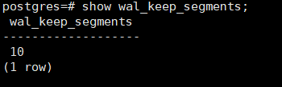
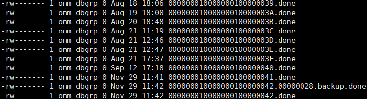
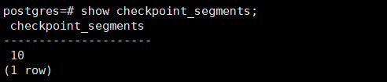

# mogdb 里 xlog 相关的几个参数

本文出处：[https://www.modb.pro/db/181467](https://www.modb.pro/db/181467)

## 一、什么是 xlog

xlog 是记录的 Postgresql 的 WAL 信息，也就是一些事务日志信息(transaction log)，默认单个大小是 16M，源码安装的时候可以更改其大小。这些信息通常名字是类似’000000010000000000000013’这样的文件，这些日志会在定时回滚恢复(PITR)，流复制(Replication Stream)以及归档时能被用到，这些日志是非常重要的，记录着数据库发生的各种事务信息，不得随意删除或者移动这类日志文件，不然你的数据库会有无法恢复的风险。
当你的归档或者流复制发生异常的时候，事务日志会不断地生成，有可能会造成你的磁盘空间被塞满，最终导致 DB 挂掉或者起不来。遇到这种情况不用慌，可以先关闭归档或者流复制功能，备份 pg_xlog 日志到其他地方，但请不要删除。然后删除较早时间的的 pg_xlog，有一定空间后再试着启动 Postgres。

## 二、影响 xlog 保留的参数

#### 1、wal_keep_segments

参数说明：Xlog 日志文件段数量。设置“pg_xlog”目录下保留事务日志文件的最小数目，备机通过获取主机的日志进行流复制。

取值范围：整型，2 ~ INT_MAX

默认值：16

**设置建议：**

- 当服务器开启日志归档或者从检查点恢复时，保留的日志文件数量可能大于 wal_keep_segments 设定的值。
- 如果此参数设置过小，则在备机请求事务日志时，此事务日志可能已经被产生的新事务日志覆盖，导致请求失败，主备关系断开。
- 当双机为异步传输时，以 COPY 方式连续导入 4G 以上数据需要增大 wal_keep_segments 配置。以 T6000 单板为例，如果导入数据量为 50G，建议调整参数为 1000。您可以在导入完成并且日志同步正常后，动态恢复此参数设置。
- 若 synchronous_commit 级别小于 LOCAL_FLUSH，重建备机时，建议调大改参数为 1000，避免重建过程中，主机日志回收导致重建失败。

该参数控制 pg_xlog 目录下的 xlog 日志问价最小保留数量，默认值为 16 个，生产业务环境推荐值为 1024。

#### 2、max_size_for_xlog_prune

参数说明：在 enable_xlog_prune、synchronous_commit 都打开时生效，若有备机断连且 xlog 日志大小大于此阈值，则回收日志。

取值范围：整型，0 ～ 2147483647‬，单位为 KB

默认值：2147483647‬，单位 KB

这个参数主要是控制在备库和主库的日志断联无法正常追赶上主库 xlog 日志时，主库的 xlog 总大小超过这个参数设置的值时，则回收最旧的 xlog 日志，前提需要设置 enable_xlog_prune、synchronous_commit 为 on。

#### archive_mode

参数说明：表示是否进行归档操作。

当 wal_level 设置成 minimal 时，archive_mode 参数无法使用。

取值范围: 布尔型

- on 表示进行归档。
- off 表示不进行归档。

该参数为控制是否打开数据库的归档模式，打开后会对数据库的 xlog 进行归档，归档完成后会记录在 pg_xlog 目录下的 archive_status 目录中记录 xlog 的归档状态为成功，格式为 xlogname.done，并清除归档成功的 xlog。

想要归档正常进行还需要确保归档目录存在且磁盘空间充足。涉及到的参数为 archive_dest。

#### 3、archive_dest

参数说明：由管理员设置的用于归档 WAL 日志的目录，建议归档路径为绝对路径。

该参数属于 SIGHUP 类型参数，请参考表 1 中对应设置方法进行设置。

- 当 archive_dest 和 archive_command 同时配置时，WAL 日志优先保存到 archive_dest 所设置的目录中，archive_command 配置的命令不生效。
- 字符串中如果是相对路径为相对于数据目录的。

取值范围：字符串

默认值：空字符串

该参数设置归档日志存放的目录，需要确保目录存在且数据库所对应的系统用户有该目录的相关权限，并且有充足的空间，否则即使打开了归档模式也不能正常的进行归档，xlog 也无法正常清理，然后导致 xlog 堆积，最后导致数据库挂掉。

#### checkpoint_segments

参数说明：设置 checkpoint_timeout 周期内所保留的最少 WAL 日志段文件数量。每个日志文件大小为 16MB。

该参数属于 SIGHUP 类型参数，请参考表 1 中对应设置方法进行设置。

取值范围：整型，最小值 1

提升此参数可加快大数据的导入速度，但需要结合 checkpoint_timeout、shared_buffers 这两个参数统一考虑。这个参数同时影响 WAL 日志段文件复用数量，通常情况下 pg_xlog 文件夹下最大的复用文件个数为 2 倍的 checkpoint_segments 个，复用的文件被改名为后续即将使用的 WAL 日志段文件，不会被真正删除。

默认值：64

该参数控制在 checkpoint_timout 周期内 xlog 的最小保存数量，checkpoint_timeout 参数的默认值是 15min。
