# openEuler20.03 操作系统上安装部署 MogDB2.1.1

本文出处：[https://www.modb.pro/db/378319](https://www.modb.pro/db/378319)

## openEuler 操作系统上安装 mogdb：

---

下载 openEuler 镜像文件：openEuler-20.03-LTS-x86_64-dvd.iso
可以到各镜像源网站下载：
例如：清华源下载地址：[https://mirrors.tuna.tsinghua.edu.cn/openeuler/openEuler-20.03-LTS/ISO/x86_64/openEuler-20.03-LTS-x86_64-dvd.iso](https://mirrors.tuna.tsinghua.edu.cn/openeuler/openEuler-20.03-LTS/ISO/x86_64/openEuler-20.03-LTS-x86_64-dvd.iso)

### 一、euler 虚拟机部署：

openEuler20.03LTS 内核基于 Linux Kernel 4.19

#### （1）在 vmware 软件上新建一个虚拟机：

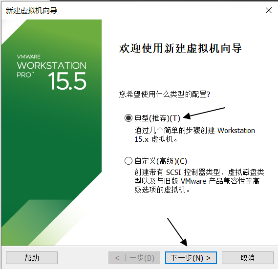

然后选择稍后安装,这里图片就略过了。
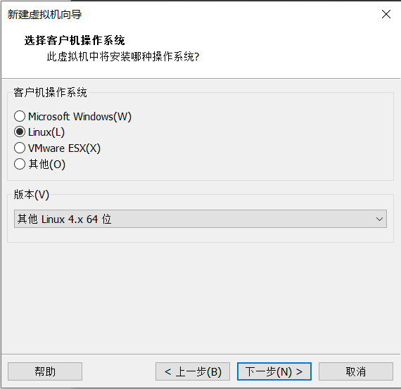

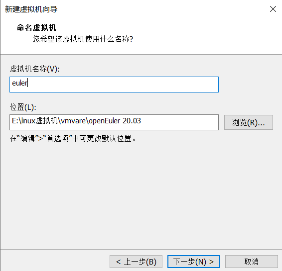

配置虚拟机磁盘大小，并拆分为多个小文件：
   磁盘：50G    内存：2G   1 个处理器 2 核
   网络连接：NAT 模式
配置 CD/DVD:
   使用 ISO 镜像文件，然后选择 openEuler 操作系统镜像文件的位置（图片略过）

### 二、启动 euler 系统

（1）启动 euler，选择 Install openEuler 20.03-LTS,然后回车：
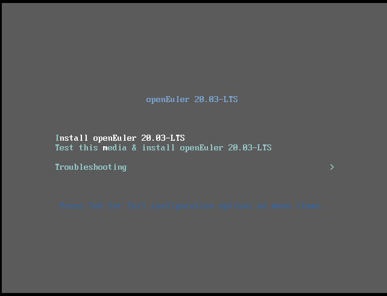

（2）选择系统语言，这里暂时选择中文，方便安装，然后点击继续：
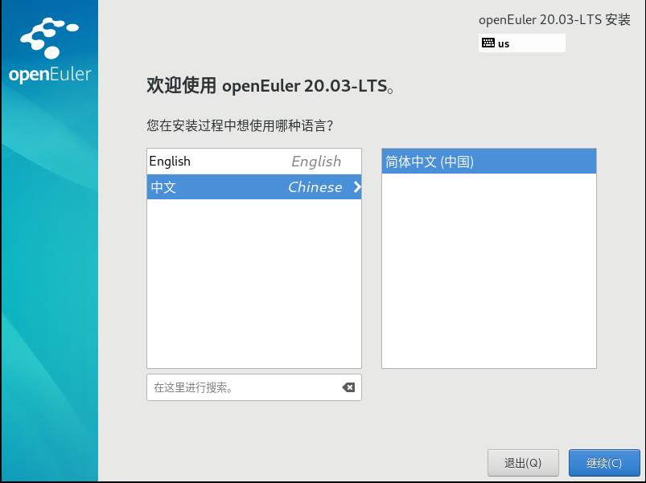

（3）进入配置主界面
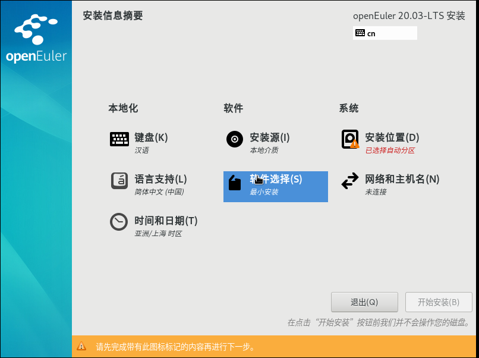

1）配置软件：软件选择——>最小安装——>标准，点击完成回到主界面：


2）配置系统网络和主机名配置：
配置网卡 ens33,配置如下，然后保存:
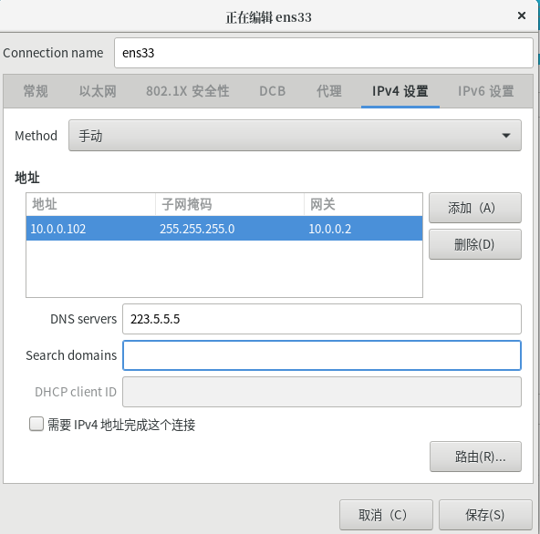

配置主机名为：EulerMog,点击应用，然后点击完成，最终配置如下：
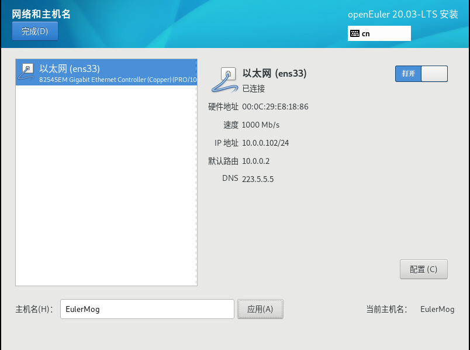

3）配置分区：系统，安装位置，选择自定义分区，点击完成之后，选择标准分区：
/boot   1024M
/   40G
swap   2G
/data   7G
然后点击完成。新建的分区文件系统类型默认为 ext4.那就默认吧！！
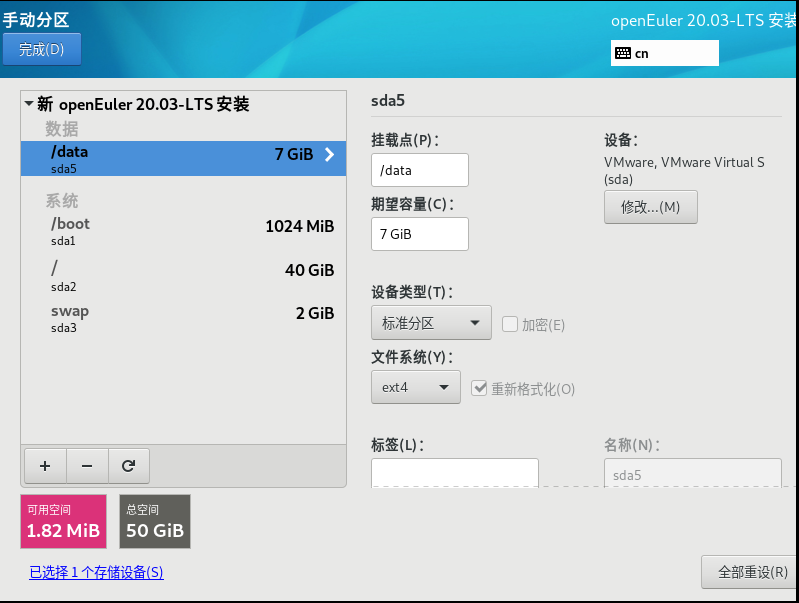

（4）开始安装，设置 root 用户密码，有密码复杂读校验：
Ysyx3579(一上一下，还比较好记)，
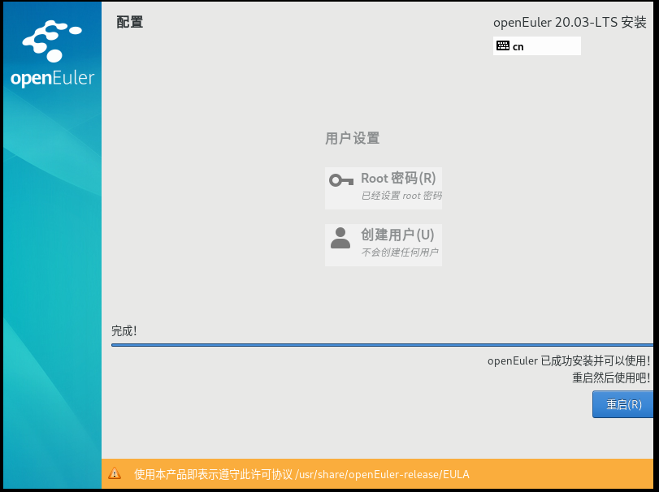

其实安装和 centOS 挺像的，完全可以将安装 centos 的方法放在这里，只是 euler 在配置 root 用户的密码时要求挺严格的，而且长度不少于 8 个字符，弱密码完全通不过。不像 centos，我给它 123456，照样配置。
好的，重启一下就可以使用 euler 系统了。
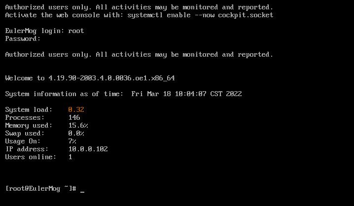

这是，登录之后 euler 系统的界面，毕竟是最小化安装，就不要幻想图形界面了。不过还好，欢迎你之后，还将系统的一些基本信息告知主人。还算细心的啦。

### 三、配置主机

#### 1.查看网络连通性。很不错，可以上网的：

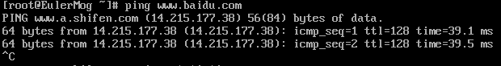

#### 2.查看 ssh 服务是否开启，可以使用 systemctl 进行服务进程的管理

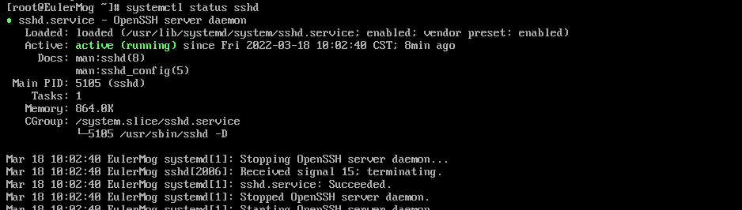

#### 3.ssh 服务是开启的，那么就可以尝试使用 xshell 进行远程连接：

在 xshell 中新建一个会话：
连接：
   名称：euler （随便写）
   协议：ssh
   主机：10.0.0.102
   端口号：22
连接——>用户身份验证
   用户名：root
   密码：Ysyx3579
然后连接，连接成功：
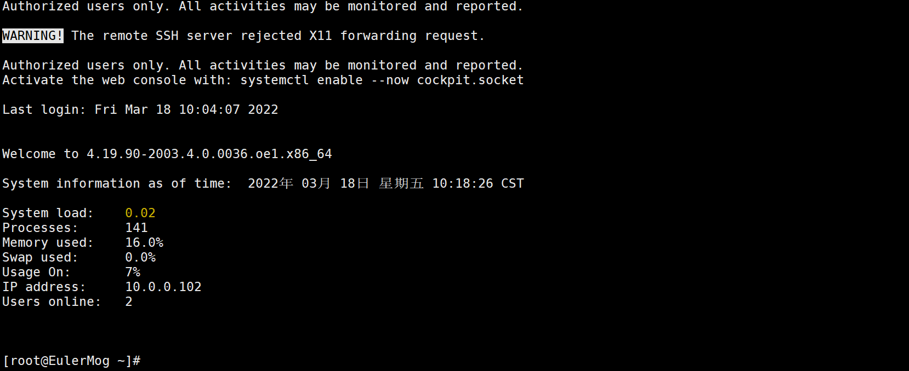

#### 4.修改系统的字符集为英文字符集，en_US.UTF-8

```
[root@EulerMog ~]# localectl set-locale LANG="en_US.UTF-8" #并不会及时生效，需要重新连接
```

#### 5.查看系统基本信息

```
#查看内核信息   [root@EulerMog yum.repos.d]# uname -a   Linux EulerMog 4.19.90-2003.4.0.0036.oe1.x86_64 #1 SMP Mon Mar 23 19:10:41 UTC 2020 x86_64 x86_64 x86_64 GNU/Linux   #查看euler发行版本信息   [root@EulerMog yum.repos.d]# cat /etc/os-release   NAME=“openEuler”   VERSION=“20.03 (LTS)”   ID=“openEuler”   VERSION_ID=“20.03”   PRETTY_NAME=“openEuler 20.03 (LTS)”   ANSI_COLOR=“0;31”
```

#### 6.euler 系统使用 dnf 管理 rpm 软件包，也可以使用 yum：

```
#配置/etc/dnf/dnf.conf   [root@EulerMog dnf]# vim dnf.conf   [main]   gpgcheck=1   installonly_limit=3   clean_requirements_on_remove=True   best=True   skip_if_unavailable=False   [repository]   name=openEuler1   baseurl=https://repo.openeuler.org/openEuler-20.03-LTS/OS/x86_64/   #或者配置/etc/yum.repos.d/目录，在下面创建.repo结尾的文件   [root@EulerMog yum.repos.d]# vim openEuler_x86_64.repo   [OS]   name=openEuler-OS   baseurl=https://repo.openeuler.org/openEuler-20.03-LTS/OS/x86_64/   enabled=1   gpgcheck=0   [epol]   name=openEuler-Epol   baseurl=https://repo.openeuler.org/openEuler-20.03-LTS/EPOL/x86_64/   enabled=1   gpgcheck=0
```

#### 7.查看 python 的版本信息，安装了 python3

```
[root@EulerMog ~]# python --version   Python 2.7.16   [root@EulerMog ~]# python3 --version   Python 3.7.4
```

#### 8.关闭防火墙

```
[root@EulerMog ~]# systemctl stop firewalld   [root@EulerMog ~]# systemctl disable firewalld   Removed /etc/systemd/system/dbus-org.fedoraproject.FirewallD1.service.   Removed /etc/systemd/system/multi-user.target.wants/firewalld.service.
```

#### 9.关闭 selinux 服务

```
[root@EulerMog ~]# getenforce   Enforcing   [root@EulerMog ~]# setenforce 0   [root@EulerMog ~]# getenforce   Permissive   [root@EulerMog ~]# vim /etc/selinux/config   SELINUX=disabled   或者   [root@EulerMog ~]# sed -i ‘/^SELINUX=/cSELINUX=disabled’ /etc/selinux/config
```

#### 10.修改命令提示符

```
[root@EulerMog ~]# vim /etc/profile   export PS1=’[\e[32;1m\u@\e[34;1m\h \e[35;1m\w\e[0m]\$ ’
```

#### 11.时间同步

```
#安装ntp软件包   dnf install ntp   #时间同步   ntpdate ntp1.aliyun.com   18 Mar 12:55:31 ntpdate\[17928\]: step time server 120.25.115.20 offset 135.948956 sec   #设置定时任务   crontab -e   #time sync from aliyun   */5 * * * * /usr/sbin/ntpdate ntp1.aliyun.com   crontab -l   #time sync from aliyun   */5 * * * * /usr/sbin/ntpdate ntp1.aliyun.com
```

#### 12.关闭 RemoveIPC，centos 默认是关闭的(root 用户操作)

```
#修改/etc/systemd/logind.conf文件中的“RemoveIPC”值为“no”。   vim /etc/systemd/logind.conf   RemoveIPC=no #修改/usr/lib/systemd/system/systemd-logind.service文件中的“RemoveIPC”值为“no”  #注意该文件中没有这个参数，需要自己添加  vim /usr/lib/systemd/system/systemd-logind.service   RemoveIPC=no #重新加载配置参数   systemctl daemon-reload   systemctl restart systemd-logind.service #检查修改是否生效   loginctl show-session | grep RemoveIPC   RemoveIPC=no   systemctl show systemd-logind | grep RemoveIPC   RemoveIPC=no
```

#### 13.动态关闭使用透明大页，openEuler 默认是关闭的，如果没有关闭，请关闭

```
 cat /sys/kernel/mm/transparent_hugepage/enabled   [always] madvise never   echo never >/sys/kernel/mm/transparent_hugepage/enabled
```

### 三、安装部署 mogdb2.1.1

单实例部署：

1. 下载安装包 MogDB-2.1.1-openEuler-x86_64.tar （root 用户操作）
   先下载到 windows 平台，然后上传到虚拟机，或者使用 wget 命令下载
   mogdb 安装包下载地址：https://www.mogdb.io/downloads/mogdb/
   然后根据自己的需要选择相应的版本和操作系统。
   （1）创建放置安装包的目录:

```
mkdir -p /opt/software/mogdb #修改目录权限 chmod -R 755 /opt/software/
```

(2) 进入到刚刚创建的目录中

```
cd /opt/software/mogdb  wget https://cdn-mogdb.enmotech.com/mogdb-media/2.1.1/MogDB-2.1.1-openEuler-x86_64.tar  #查看安装包的大小  du -sh MogDB-2.1.1-openEuler-x86_64.tar   117M MogDB-2.1.1-openEuler-x86_64.tar
```

2. 创建单节点配置文件

```
[root@EulerMog /opt/software/mogdb]# vi clusterconfig.xml
<?xml version="1.0" encoding="UTF-8"?>
<ROOT>
    <!-- MogDB整体信息 -->
    <CLUSTER>
        <PARAM name="clusterName" value="dbCluster" />
        <PARAM name="nodeNames" value="EulerMog" />
        <PARAM name="backIp1s" value="10.0.0.102"/>
        <PARAM name="gaussdbAppPath" value="/opt/mogdb/app" />
        <PARAM name="gaussdbLogPath" value="/var/log/mogdb" />
        <PARAM name="gaussdbToolPath" value="/opt/mogdb/tools" />
        <PARAM name="corePath" value="/opt/mogdb/corefile"/>
        <PARAM name="clusterType" value="single-inst"/>
    </CLUSTER>

    <!-- 每台服务器上的节点部署信息 -->
    <DEVICELIST>
        <!-- node1上的节点部署信息 -->
        <DEVICE sn="1000001">
            <PARAM name="name" value="EulerMog"/>
            <PARAM name="azName" value="AZ1"/>
            <PARAM name="azPriority" value="1"/>
            <!-- 如果服务器只有一个网卡可用，将backIP1和sshIP1配置成同一个IP -->
            <PARAM name="backIp1" value="10.0.0.102"/>
            <PARAM name="sshIp1" value="10.0.0.102"/>

            <!--dbnode-->
            <PARAM name="dataNum" value="1"/>
            <PARAM name="dataPortBase" value="26000"/>
            <PARAM name="dataNode1" value="/mogdb/data/db1"/>
        </DEVICE>
    </DEVICELIST>
</ROOT>
```

只需要修改 nodeNames 主机名和 ip 地址，其他保持默认配置即可。

3. 安装基础环境包

```
[root@EulerMog /opt/software/mogdb]# yum install -y libaio-devel gcc gcc-c++ zlib-devel
```

4. 在安装包所在的路径下依次解压安装包：

```
[root@EulerMog /opt/software/mogdb]# tar -xf MogDB-2.1.0-openEuler-x86_64.tar   [root@EulerMog /opt/software/mogdb]# tar -zxvf MogDB-2.1.0-openEuler-64bit-om.tar.gz
```

5. 进入到工具脚本存放目录下：

```
cd /opt/software/mogdb/script
```

6. 为确保 openssl 版本正确，执行预安装前请加载安装包中 lib 库

```
export LD_LIBRARY_PATH=/opt/software/mogdb/script/gspylib/clib:$LD_LIBRARY_PATH
```

7. 查看主机名.确保通过命令 hostname 执行的结果同配置文件中设置的 nodeNames 一致

```
[root@EulerMog /opt/software/mogdb]# hostname   EulerMog
```

8. 需打开 performance.sh 文件注释#sysctl -w vm.min_free_kbytes=112640 &> /dev/null

```
[root@EulerMog /opt/software/mogdb]# vim /etc/profile.d/performance.sh   #sysctl -w vm.min_free_kbytes=112640 &> /dev/null
```

9. 初始化脚本（会创建相关目录和用户）

```
 /opt/software/mogdb/script/gs_preinstall -U omm -G dbgrp -X /opt/softwar   e/mogdb/clusterconfig.xml   #执行过程中会询问你是否要创建omm操作系统用户，我当然输入了yes，密码为123456   #并创建dbgrp用户组   [root@EulerMog ~]# tail -1 /etc/passwd   omm:x:1000:1000::/home/omm:/bin/bash   [root@EulerMog ~]# tail -1 /etc/group   dbgrp:x:1000:
```

10. 执行安装：

```
#修改安装包所在目录下的lib和script目录的所有者和所属组   chown -R omm.dbgrp /opt/software/mogdb/lib   chown -R omm.dbgrp /opt/software/mogdb/script #切换到omm用户   su - omm   #安装mogdb   /opt/software/mogdb/script/gs_install -X /opt/software/mogdb/clusterconfi   g.xml --gsinit-parameter="–locale=en_US.UTF-8" --gsinit-parameter="–encoding=UTF-8"   #执行过程中会询问数据库密码，这里输入：Test@123
```

11. 检查 mogdb 相关状态

```
#查看mogdb服务监听的地址和端口信息   netstat -lntup | grep mogdb   (Not all processes could be identified, non-owned process info   will not be shown, you would have to be root to see it all.)   tcp 0 0 10.0.0.102:26000 0.0.0.0:* LISTEN 28621/mogdb   tcp 0 0 127.0.0.1:26000 0.0.0.0:* LISTEN 28621/mogdb   tcp 0 0 10.0.0.102:26001 0.0.0.0:* LISTEN 28621/mogdb   tcp 0 0 127.0.0.1:26001 0.0.0.0:* LISTEN 28621/mogdb   tcp6 0 0 ::1:26000 :::* LISTEN 28621/mogdb   tcp6 0 0 ::1:26001 :::* LISTEN 28621/mogdb #查看进程信息：   [omm@EulerMog ~]$ ps -ef | grep mogdb   omm 28621 1 4 14:54 pts/2 00:00:06 /opt/mogdb/app/bin/mogdb -D /mogdb/data/db1   omm 29227 23391 0 14:56 pts/2 00:00:00 grep --color=auto mogdb #查看集群信息   [omm@EulerMog ~]$ gs_om -t status --detail   [ Cluster State ] cluster_state : Normal   redistributing : No   current_az : AZ_ALL [ Datanode State ] node    node_ip         port      instance                state 1 EulerMog 10.0.0.102 26000 6001 /mogdb/data/db1 P Primary Normal
```

12. 连接数据库

```
[omm@EulerMog ~]$ gsql -d postgres -p 26000 -r
gsql ((MogDB 2.1.0 build 56189e20) compiled at 2022-01-07 18:47:34 commit 0 last mr )
Non-SSL connection (SSL connection is recommended when requiring high-security)
Type “help” for help.

openGauss=# \q
#mogdb在安装过程中会自动生成postgres数据库，-d指定要连接的数据库，-p指定数据库端口号
#\q退出工具gsql
```

13. 数据库的启停

启动数据库：

gs_om -t start

停止数据库：

gs_om -t stop

总结：

到此在 openEuler 系统上安装部署 mogdb 就告一段落。与在 centos7.6 上部署，大同小异：

1.openEuler20.03 默认安装了 python3,所以不需要安装部署 python3，而 centos7.6 需要

2.关于 RemoveIPC 参数，centos7.6 是关闭的，openEuler 则是开启的，所以需要配置
