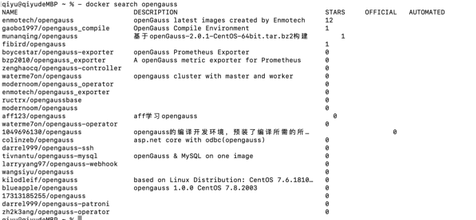
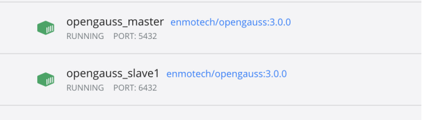
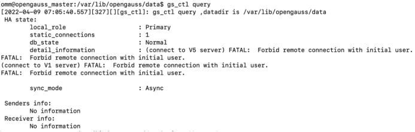
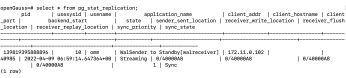
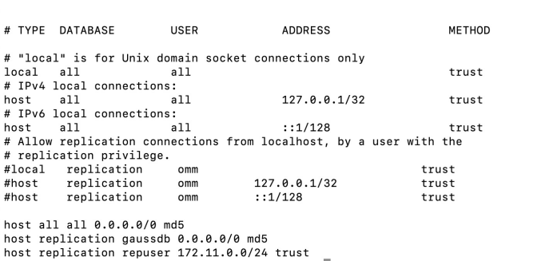
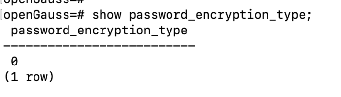
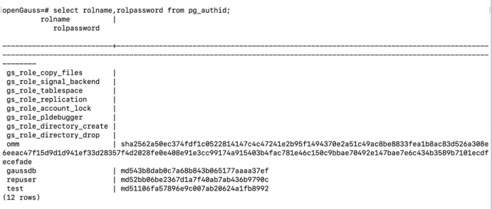
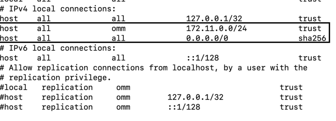

# openGauss 3.0.0 docker 安装

本文出处：[https://www.modb.pro/db/393017](https://www.modb.pro/db/393017)

1. 从 Docker Hub 查找镜像



1. 从镜像仓库中拉取或者更新指定镜像

```
- docker pull enmotech/opengauss
```

1. 使用脚本安装主备，输入版本为 3.0.0

```
#!/bin/bash -e
# Parameters
#!/bin/bash

#set OG_SUBNET,GS_PASSWORD,MASTER_IP,SLAVE_1_IP,MASTER_HOST_PORT,MASTER_LOCAL_PORT,SLAVE_1_HOST_PORT,SLAVE_1_LOCAL_PORT,MASTER_NODENAME,SLAVE_NODENAME

read -p "Please input OG_SUBNET (容器所在网段) [172.11.0.0/24]: " OG_SUBNET
OG_SUBNET=${OG_SUBNET:-172.11.0.0/24}
echo "OG_SUBNET set $OG_SUBNET"

read -p "Please input GS_PASSWORD (定义数据库密码)[Enmo@123]: " GS_PASSWORD
GS_PASSWORD=${GS_PASSWORD:-Enmo@123}
echo "GS_PASSWORD set $GS_PASSWORD"

read -p "Please input MASTER_IP (主库IP)[172.11.0.101]: " MASTER_IP
MASTER_IP=${MASTER_IP:-172.11.0.101}
echo "MASTER_IP set $MASTER_IP"

read -p "Please input SLAVE_1_IP (备库IP)[172.11.0.102]: " SLAVE_1_IP
SLAVE_1_IP=${SLAVE_1_IP:-172.11.0.102}
echo "SLAVE_1_IP set $SLAVE_1_IP"

read -p "Please input MASTER_HOST_PORT (主库数据库服务端口)[5432]: " MASTER_HOST_PORT
MASTER_HOST_PORT=${MASTER_HOST_PORT:-5432}
echo "MASTER_HOST_PORT set $MASTER_HOST_PORT"

read -p "Please input MASTER_LOCAL_PORT (主库通信端口)[5434]: " MASTER_LOCAL_PORT
MASTER_LOCAL_PORT=${MASTER_LOCAL_PORT:-5434}
echo "MASTER_LOCAL_PORT set $MASTER_LOCAL_PORT"

read -p "Please input SLAVE_1_HOST_PORT (备库数据库服务端口)[6432]: " SLAVE_1_HOST_PORT
SLAVE_1_HOST_PORT=${SLAVE_1_HOST_PORT:-6432}
echo "SLAVE_1_HOST_PORT set $SLAVE_1_HOST_PORT"

read -p "Please input SLAVE_1_LOCAL_PORT (备库通信端口)[6434]: " SLAVE_1_LOCAL_PORT
SLAVE_1_LOCAL_PORT=${SLAVE_1_LOCAL_PORT:-6434}
echo "SLAVE_1_LOCAL_PORT set $SLAVE_1_LOCAL_PORT"

read -p "Please input MASTER_NODENAME [opengauss_master]: " MASTER_NODENAME
MASTER_NODENAME=${MASTER_NODENAME:-opengauss_master}
echo "MASTER_NODENAME set $MASTER_NODENAME"

read -p "Please input SLAVE_NODENAME [opengauss_slave1]: " SLAVE_NODENAME
SLAVE_NODENAME=${SLAVE_NODENAME:-opengauss_slave1}
echo "SLAVE_NODENAME set $SLAVE_NODENAME"

read -p "Please input openGauss VERSION [1.1.0]: " VERSION
VERSION=${VERSION:-1.1.0}
echo "openGauss VERSION set $VERSION"

echo "starting  "

docker network create --subnet=$OG_SUBNET opengaussnetwork \
|| {
  echo ""
  echo "ERROR: OpenGauss Database Network was NOT successfully created."
  echo "HINT: opengaussnetwork Maybe Already Exsist Please Execute 'docker network rm opengaussnetwork' "
  exit 1
}
echo "OpenGauss Database Network Created."

docker run --network opengaussnetwork --ip $MASTER_IP --privileged=true \
--name $MASTER_NODENAME -h $MASTER_NODENAME -p $MASTER_HOST_PORT:$MASTER_HOST_PORT -d \
-e GS_PORT=$MASTER_HOST_PORT \
-e OG_SUBNET=$OG_SUBNET \
-e GS_PASSWORD=$GS_PASSWORD \
-e NODE_NAME=$MASTER_NODENAME \
-e REPL_CONN_INFO="replconninfo1 = 'localhost=$MASTER_IP localport=$MASTER_LOCAL_PORT localservice=$MASTER_HOST_PORT remotehost=$SLAVE_1_IP remoteport=$SLAVE_1_LOCAL_PORT remoteservice=$SLAVE_1_HOST_PORT'\n" \
enmotech/opengauss:$VERSION -M primary \
|| {
  echo ""
  echo "ERROR: OpenGauss Database Master Docker Container was NOT successfully created."
  exit 1
}
echo "OpenGauss Database Master Docker Container created."

sleep 30s

docker run --network opengaussnetwork --ip $SLAVE_1_IP --privileged=true \
--name $SLAVE_NODENAME -h $SLAVE_NODENAME -p $SLAVE_1_HOST_PORT:$SLAVE_1_HOST_PORT -d \
-e GS_PORT=$SLAVE_1_HOST_PORT \
-e OG_SUBNET=$OG_SUBNET \
-e GS_PASSWORD=$GS_PASSWORD \
-e NODE_NAME=$SLAVE_NODENAME \
-e REPL_CONN_INFO="replconninfo1 = 'localhost=$SLAVE_1_IP localport=$SLAVE_1_LOCAL_PORT localservice=$SLAVE_1_HOST_PORT remotehost=$MASTER_IP remoteport=$MASTER_LOCAL_PORT remoteservice=$MASTER_HOST_PORT'\n" \
enmotech/opengauss:$VERSION -M standby \
|| {
  echo ""
  echo "ERROR: OpenGauss Database Slave1 Docker Container was NOT successfully created."
  exit 1
}
echo "OpenGauss Database Slave1 Docker Container created."

```

1. 安装成功



1. 安装完成后分别进入主备

```
- docker exec -it opengauss_master bash - docker exec -it opengauss_slave1 bash
```

1. 切换 omm 用户，查看集群状态

发现集群状态异常

```
$ gs_ctl query
```



查看 pg_stat_replication



查看 pg_hba.conf 文件


查看数据库加密方式，为 md5 加密



查看用户密码，omm 的加密方式默认为 sha256



可修改数据库加密方式为 1，或者加密方式为 2，再更新原有 md5 加密方式的用户密码


修改 pg_hba.conf 文件



重新加载

```
gs_ctl reload -D $PGDATA
查看集群状态正常
```

【注】测试过程中发现，本次安装 docker 使用的镜像非企业版，有些企业版独有的功能无法使用，例如逻辑复制
