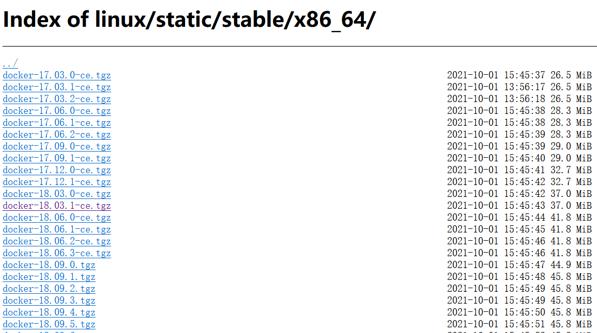
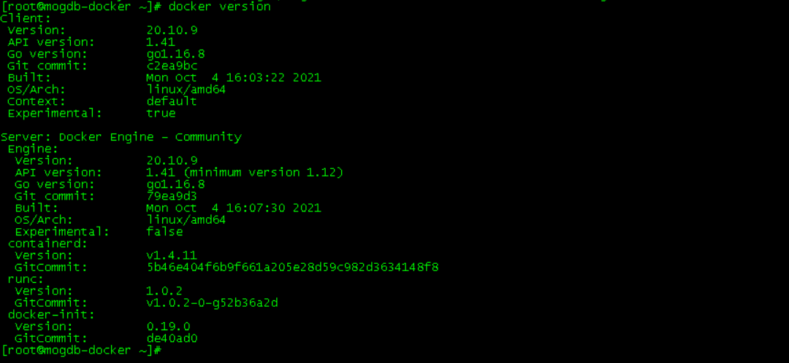
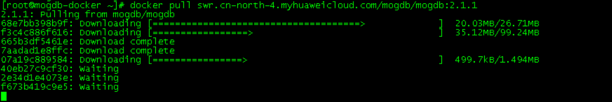
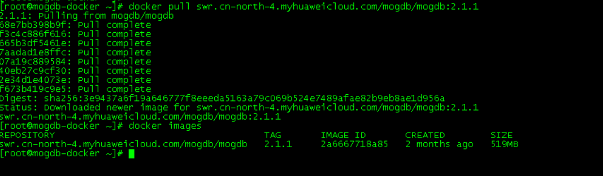
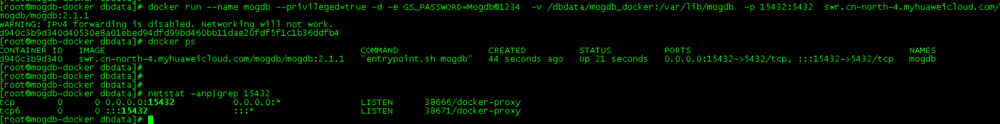
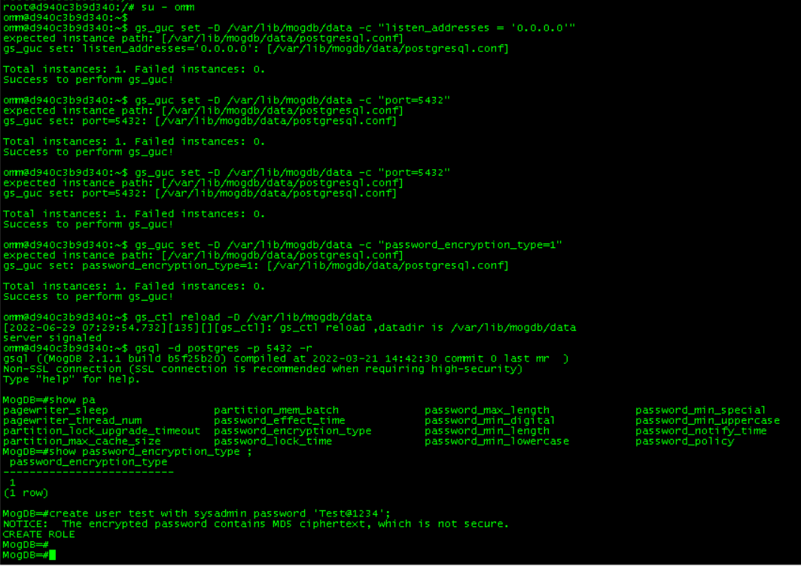
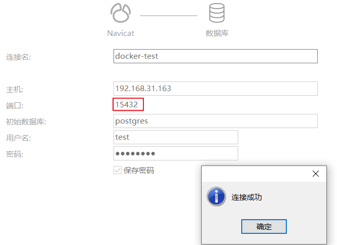
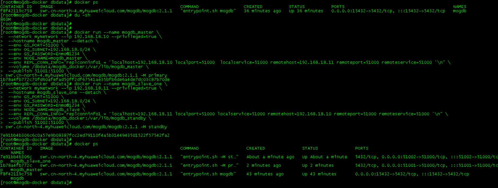
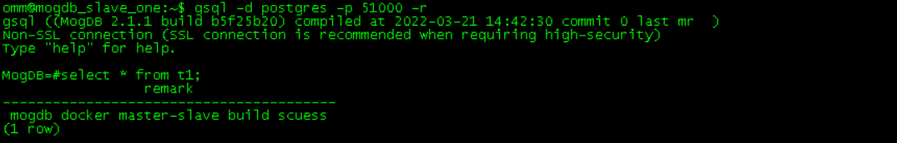

# 使用 VMworkstation 安装 docker 版的 MogDB

本文出处：[https://www.modb.pro/db/425251](https://www.modb.pro/db/425251)

## 1 安装环境

虚拟化版本：VM Workstation 12 Pro
系统版本：Centos 7.6
数据库版本：Mogdb V 2.1.1 - Docker
DOCKER 版本：20.10.9

## 2 安装 docker 工具(二进制)

使用二进制方式安装 docker 软件，也可以直接使用 yum 源方式安装：

### 下载地址

[https://download.docker.com/linux/static/stable/x86_64/](https://download.docker.com/linux/static/stable/x86_64/)


### 解压缩

```
# cd /opt/software # tar -xvf docker-20.10.9.tgz # cp docker/* /usr/bin/ # which docker
```


### 配置 sytemctl 服务

```
# vi /usr/lib/systemd/system/docker.service
##输入以下内容
[Unit]
Description=Docker Application Container Engine
Documentation=https://docs.docker.com
After=network-online.target firewalld.service
Wants=network-online.target

[Service]
Type=notify
ExecStart=/usr/bin/dockerd
ExecReload=/bin/kill -s HUP $MAINPIDLimitNOFILE=infinity
LimitNPROC=infinity
TimeoutStartSec=0
Delegate=yes
KillMode=process
Restart=on-failure
StartLimitBurst=3
StartLimitInterval=60s

[Install]
WantedBy=multi-user.target
##保存
```

### 启动 docker 服务

```
# systemctl daemon-reload
# systemctl start docker.service
# systemctl enable docker.service

# systemctl status docker
# ps -ef|grep docker
# docker version
```



## 搭建数据库

### 拉取 Mogdb docker 镜像

```
# docker pull swr.cn-north-4.myhuaweicloud.com/mogdb/mogdb:2.1.1 # docker images
```





### 单节点数据库

```
##docker run 参数说明
--name       - 容器名称
--privileged - 额外的权限
-d           - 后台运行，并打印容器ID
-e           - 环境参数
  -- GS_PASSWORD ： 设置了MogDB数据库的超级用户omm以及测试用户mogdb的密码。MogDB安装时默认会创建omm超级用户，该用户名暂时无法修改
  -- GS_NODENAME ： 指定数据库节点名称，默认为mogdb
  -- GS_USERNAME ： 指定数据库连接用户名，默认为mogdb。
  -- GS_PORT     ： 指定数据库端口，默认为5432。
-v           - 绑定挂载点
-p           - 映射服务器的port

##创建镜像挂载目录
# mkdir /dbdata/mogdb_docker

##创建单节点容器
# docker run --name mogdb --privileged=true \
-d -e GS_PASSWORD=Mogdb@1234 \
-v /dbdata/mogdb_docker:/var/lib/mogdb \
-p 15432:5432  swr.cn-north-4.myhuaweicloud.com/mogdb/mogdb:2.1.1

# docker ps
```



### 修改数据库登录参数

```
# docker exec -it mogdb bash
##以下为容器操作
su - omm

gs_guc set -D /var/lib/mogdb/data -c "listen_addresses = '0.0.0.0'"
gs_guc set -D /var/lib/mogdb/data -c "port=5432"
gs_guc set -D /var/lib/mogdb/data -h "host     all      all  0.0.0.0/0    md5"
gs_guc set -D /var/lib/mogdb/data -c "password_encryption_type=1"
gs_ctl reload -D /var/lib/mogdb/data

gsql -d postgres -p 5432 -r
create user test with sysadmin password 'Test@1234';
```



容器内使用 gsql 命令进行验证

```
gsql -d postgres -U test -W Test@1234 -h127.0.0.1 -p 5432 -r
```


容器外使用第三方工具链接


### 搭建主从节点数据库

```
##创建虚拟网络
# docker network create --subnet=192.168.18.0/24 myNetwork
# docker network list

##主节点
# docker run --name mogdb_master \
 --network myNetwork --ip 192.168.18.10 --privileged=true \
 --hostname mogdb_master --detach \
 --env GS_PORT=51000 \
 --env OG_SUBNET=192.168.18.0/24 \
 --env GS_PASSWORD=Enmo@1234 \
 --env NODE_NAME=mogdb_master \
 --env REPL_CONN_INFO="replconninfo1 = 'localhost=192.168.18.10 localport=51000  localservice=51000 remotehost=192.168.18.11 remoteport=51000 remoteservice=51000 '\n" \
 --volume /dbdata/mogdb_docker:/var/lib/mogdb_master \
 --publish 51001:51000 \
swr.cn-north-4.myhuaweicloud.com/mogdb/mogdb:2.1.1 -M primary

##从节点
# docker run --name mogdb_slave_one \
 --network myNetwork --ip 192.168.18.11 --privileged=true \
 --hostname mogdb_slave_one --detach \
 --env GS_PORT=51000 \
 --env OG_SUBNET=192.168.18.0/24 \
 --env GS_PASSWORD=Enmo@1234 \
 --env NODE_NAME=mogdb_slave \
 --env REPL_CONN_INFO="replconninfo1 = 'localhost=192.168.18.11 localport=51000 localservice=51000 remotehost=192.168.18.10 remoteport=51000 remoteservice=51000 '\n" \
 --volume /dbdata/mogdb_docker:/var/lib/mogdb_standby \
 --publish 51002:51000 \
swr.cn-north-4.myhuaweicloud.com/mogdb/mogdb:2.1.1 -M standby
```




使用命令验证主从同步

```
##主节点容器操作
# docker exec -it mogdb_master bash

su - omm

gs_guc set -D /var/lib/mogdb/data -c "listen_addresses = '0.0.0.0'"
gs_guc set -D /var/lib/mogdb/data -c "port=51000"
gs_guc set -D /var/lib/mogdb/data -h "host     all      all  0.0.0.0/0    md5"

gs_ctl reload -D /var/lib/mogdb/data

##主库建立测试表
gsql -d postgres -p 51000 -r
create table t1 (remark varchar);
insert into t1 select 'mogdb docker master-slave build scuess';

##从节点容器操作
# docker exec -it mogdb_slave_one bash

gs_guc set -D /var/lib/mogdb/data -c "listen_addresses = '0.0.0.0'"
gs_guc set -D /var/lib/mogdb/data -c "port=51000"
gs_guc set -D /var/lib/mogdb/data -h "host     all      all  0.0.0.0/0    md5"

gs_ctl reload -D /var/lib/mogdb/data

##备库检查测试表
su - omm
gsql -d postgres -p 51000 -r
select * from t1;
```

主节点输出


从节点输出


## docker 常用命令

```
##查看docker镜像
docker image ls

##查看docker网络
docker network ls

##查看正在运行的docker容器信息
docker ps
docker ps -a

##镜像创建新容器
docker run --name docker_name image_name

##启动容器
docker start docker_name

##停止容器
docker stop docker_name

##进入容器
docker attach docker_name
docker exec -it docker_name bash

##查看应用日志
docker logs -f docker_name

##删除容器
docker rm -f docker_name

##上传下载文件
docker cp docker_name:/file_path/file_name /file_path/file_name
docker cp /file_path/file_name docker_name:/file_path/file_name

##修改容器配置
##方法1：将container推入image中，删除并新建container
docker stop con_name
docker commit con_name image_name
docker rm con_name
docker run -d -P --name con_name -p xxx:yyy image_name

##方法2：修改配置文件
docker stop con_name
cd　/var/lib/docker/containers/[container_id]/hostconfig.json
systemctl restart docker
docker start con_name

##帮助
docker --help
docker command --help
```

## 故障问题整理

### 1、故障现象：容器创建时，提示 WARNING: IPv4 forwarding is disabled. Networking will not work.

故障原因：一般由于服务器多块网卡及 network 服务导致
处理方法：systemctl restart network && systemctl restart docker

### 2、故障现象：容器创建时，如果带-v 参数，在容器删除时，无法删除容器文件

故障原因：怀疑跟 docker 缓存处理机制有关
处理方法：手动清理容器挂载目录即可，如果容器创建时，不带-v，则不会出现此问题 3、故障现象：建立 mogdb 容器时，如果设置过多的数据库参数，容器会自动关闭
故障原因：怀疑跟 GS\_\*等一系列参数设置有关
处理方法：mogdb 容器建立后，进入容器，手动修改相关数据库参数
