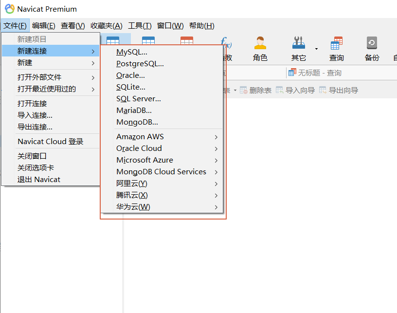
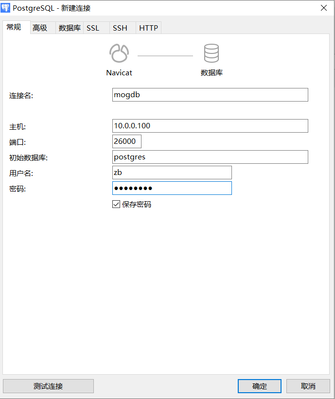
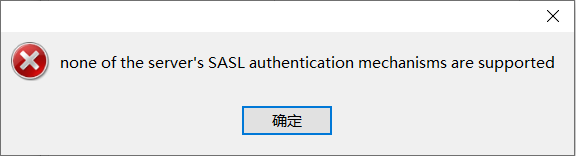

# 关于使用 navicat 连接 mogdb 报错：none of the server's SASL authentication mechanisms are supported

本文出处：<https://www.modb.pro/db/393744>

### 一、前提条件

默认已经安装好 navicat，我这里使用的版本是 Navicat Premium 15，关于它的安装破解网上有很多资源。

虚拟机 IP:10.0.0.100
虚拟机使用 NAT 网络模式
宿主机与其通讯的虚拟 IP 为：10.0.0.1

navicat，工作界面简洁，可以支持多种类型的数据库连接，如下：


### 二、mogdb 数据库端准备

#### 1.启动数据库

```
su - omm gs_om -t start
```

注：此后各步操作均在 mogdb 数据库初始用户对应的操作系统用户 omm 下操作

#### 2.创建远程连接用户

```
#本地连接数据库 gsql -d postgres -p 26000 -r #创建用户 create user zb password 'geet@123'; #授予用户管理员权限（如果需要） grant all privileges to zb;
```

#### 3.配置客户端接入认证

```
gs_guc reload -N all -I all -h 'host all zb 10.0.0.1/24 sha256'
```

#### 4.配置 navicat 客户端：

依次点击：文件——>新建连接——>PostgreSQL，
然后配置相应的连接名（可随意命名），主机（填写数据库服务所在主机的 IP）、端口号（数据库服务监听的端口号）、初始数据库（建立连接使用的数据库）、用户名、密码，如下所示：


#### 5.点击测试连接，报错：



网上没找到（真的），通过询问我的有点牛的吴导师，问题原因：navicat 暂不支持 sha256 的加密方法，应改改为 md5，虽然最终问题简单，但是其中细节还是挺多的，因为大脑发热的我，将客户端认证方式改为 md5 就处处碰壁。废话不多说，直接开搞

### 三、解决连接失败的问题：

#### 1.重写重新编辑客户端认证策略

```
gs_guc reload -N all -I all -h 'host all zb 10.0.0.1/24 md5'
```

#### 2.修改密码加密类型为 MD5（默认时 sha256）

```
gs_guc reload -N all -I all -c 'password_encryption_type=0' #检查配置是否生效 grep encry /mogdb/data/db1/postgresql.conf password_encryption_type = 0		#Password storage type, 0 is md5 for PG, 1 is sha256 + md5, 2 is sha256 only #最保险的方法还是登录数据库show一下参数值： openGauss=# show password_encryption_type; password_encryption_type  -------------------------- 0 (1 row)
```

#### 3.修改 zb 用户的密码

注：这一步一定要做，否则会导致你远程连接失败，报如下错:

```
gsql -U zb -W geet@123 -h 10.0.0.100 -p 26000 gsql: FATAL:  Invalid username/password,login denied. FATAL:  Invalid username/password,login denied.
```

因为该用户之前的密码仍让使用 sha256 进行加密处理，现在你将加密方式改为 MD5，系统就会将你输入的密码使用 md5 加密，然后和使用 sha256 加密的原密码进行比对，肯定会失败呀，所以我们需要修改密码，再次修改的新密码将会使用新设置的 md5 算法进行加密,可以通过如下方式查看指定用户目前的密码加密方式：

```
openGauss=# select rolpassword from pg_authid where rolname='zb';                                                                                                    rolpassword                                                                                                     ----------------------------------------------------------------------------------------------------------------------------------------- -------------------------------------------------------------------------- sha25681805918aa95cf71b044259200ed05a4f63d7a772598be210165d0a690c75319986666b3b0bb25f913e59f82a12fd5f927c141680ba82548a0ca5829267d612b4b 6ded866a4bbcce1d26a2a202df6c268765d558fecc52e7a3abfa1c2ab204ececdfecefade (1 row)
```

修改用户的密码:

```
openGauss=# alter user zb password 'haha@123';
NOTICE:  The encrypted password contains MD5 ciphertext, which is not secure.
ALTER ROLE
#再次查看用户加密后的密码：
openGauss=# select rolpassword from pg_authid where rolname='zb';
             rolpassword
-------------------------------------
 md57a6066121212b4ce59015d2ca59e5fc9
(1 row)

#可以发现使用MD5对密码进行加密，加密串明显变短了很多，存在安全隐患问题。
注：使用超级管理员用户omm修改用户密码时，可以不用输入旧密码，就可以修改用户密码4.再次配置navicat连接：点击测试连接后，成功连接mogdb，如下所示：
到此问题就解决了！！！
```
