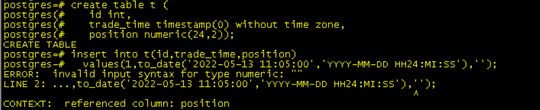
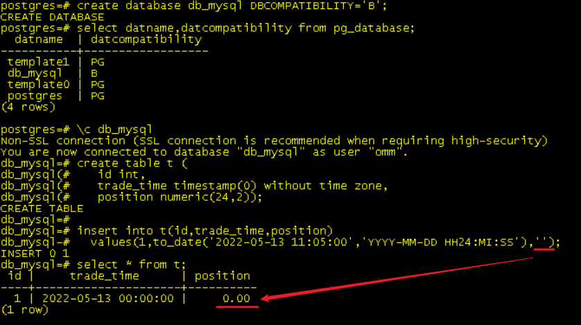
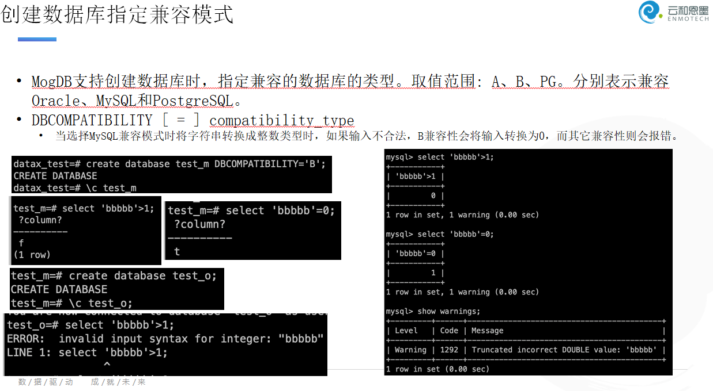

# 兼容模式下导致数值类型发生隐式转换，SQL 在生产上无法正常使用案例

本文出处：[https://www.modb.pro/db/403148](https://www.modb.pro/db/403148)

基于 MogDB 版本 V2.0.1

## 问题现象

厂商研发描述 Insert SQL 在生产上无法执行，而测试环境中同版本的数据库该 SQL 可以正常运行。

检查 SQL 后，发现是很简单的 insert into values 语句，故障点是将 ‘’ 值插入到了 numeric 数据类型的字段中，提示“invalid input syntax for type numeric”，中断 SQL 执行。一切都很正常。

但是之后跟研发沟通后，在研发的测试环境中， ‘’ 还就真的插入到了 numeric 中，而且语句也是简单 insert into values，没有做任何数据类型转换。

## 场景复原

模拟现场如下：

```
create table t (
   id int,
   trade_time timestamp(0) without time zone,
   position numeric(24,2));

insert into t(id,trade_time,position)
  values(1,to_date('2022-05-13 11:05:00','YYYY-MM-DD HH24:MI:SS'),'');

ERROR:  invalid input syntax for type numeric: ""
LINE 2: ...,to_date('2022-05-13 11:05:00','YYYY-MM-DD HH24:MI:SS'),'');
                                                                   ^
CONTEXT:  referenced column: position
```



## 处理思路

第一思路是是否发生了自动或者隐式转换，但是翻了整个手册，还是没有发现线索，由于应用还在测试，问题不是很急，当天下午就处理别的问题了，在下班的时候重新复盘一下故障现象（不得不说上下班真的是头脑风暴的好时间啊），对将这种字符当做数值型处理隐约有些熟悉，回家闷头翻书，果然发现，在 Mysql 数据库中，对于一个 numeric 类型字段，当传入一个字符串时，会自动转换为 0。

对应到 Mogdb 数据库，Mogdb 数据库本身支持多数据库兼容模式，兼容模式包括 Oracle，MySQL,PostgreSQL。由于测试环境的 Mogdb 数据库都是 PG 兼容模式，形成了了思维惯性。一直以为故障时由于发生隐式转换导致的。

在测试环境下，重新建立了一个 MySQL 兼容库，验证了一下，确认’'可以被插入到 numeric 字段中，并显示为 0。

## 场景复现

```
create database db_mysql DBCOMPATIBILITY='B';

select datname,datcompatibility from pg_database;

\c db_mysql
create table t (
   id int,
   trade_time timestamp(0) without time zone,
   position numeric(24,2));
insert into t(id,trade_time,position)
  values(1,to_date('2022-05-13 11:05:00','YYYY-MM-DD HH24:MI:SS'),'');

select * from t;

```



## 总结

正好昨天杨明翰杨老师的恩墨直播培训提到了这里，杨老师的分析更加清晰，截图奉上：


