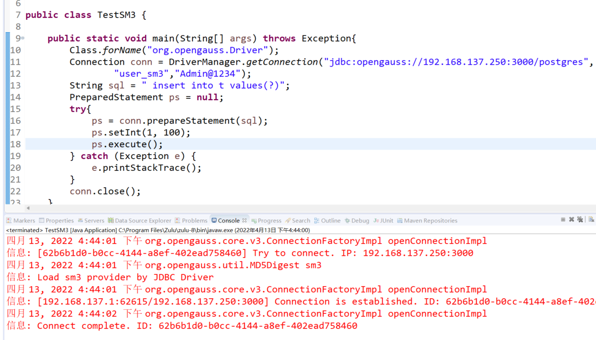

# 使用 openGauss jdbc 3.0 测试国密 SM3 用户认证

本文出处：https://www.modb.pro/db/393728

openGauss 现在支持四种用户认证方式，通过 postgresql.conf 文件中的参数 password_encryption_type 确定，认证方式与该参数的对应关系如下表所示：

| 认证方式   | 参数                       |
| ---------- | -------------------------- |
| md5        | password_encryption_type=0 |
| sha256+md5 | password_encryption_type=1 |
| sha256     | password_encryption_type=2 |
| sm3        | password_encryption_type=3 |

### 配置 SM3 认证方式

在 postgresql.conf 文件中配置 password_encryption_type=3，并重启数据库使该参数生效。

```
openGauss=# show password_encryption_type; password_encryption_type
--------------------------
3
(1 row)
```

创建用户

```
openGauss=# create user user_sm3 password 'Admin@1234';
CREATE ROLE
```

检查数据库存储的密文

```
openGauss=# select rolname,rolpassword from pg_authid where rolname='user_sm3';
-[ RECORD 1 ]---------------------------------------------------------------------------------------------------------------------------------------------------------------------------------------------------------------
rolname     | user_sm3
rolpassword | sm35235899e0406d85e4e086db4db7025d53acddb10b86d9988d7b2a1bc250322365df5fcbffc508287f1ef3205a81f8d63f43b87b16235ce7c582a0b6fa226154d7d038a0a9c2bd85aed2a9273cdd55864a481e967b62c63579441c1b03f6c550becdfecefade

```

pg_hba.conf 文件中配置认证方式为 SM3

```
host    all             user_sm3        0/0            sm3


```

通过 gsql 进行测试可正常连接

```
[omm@mogdb ~]$ gsql -Uuser_sm3 -p3000 -h192.168.137.250  postgres -r --password='Admin@1234'
gsql ((openGauss 3.0.0 build 02c14696) compiled at 2022-04-01 18:12:34 commit 0 last mr  )
Non-SSL connection (SSL connection is recommended when requiring high-security)
Type "help" for help.

openGauss=>

```

### 使用 openGauss-jdbc 3.0 进行连接测试

需要先下载 bcprov-jdk15on 依赖包，下载链接如下：
https://mvnrepository.com/artifact/org.bouncycastle/bcprov-jdk15on
选择最新版本即可。

将 bcprov-jdk15on 和 opengauss-jdbc 3.0jar 包直接导入工程或使用 maven 方式

```
<groupId>org.opengauss</groupId>
<artifactId>opengauss-jdbc</artifactId>

<groupId>org.bouncycastle</groupId>
<artifactId>bcprov-jdk15on</artifactId>
<version>1.70</version>

```

使用下面的 java 代码进行测试

```
java
	public static void main(String[] args) throws Exception{
	    Class.forName("org.opengauss.Driver");
	    Connection conn = DriverManager.getConnection("jdbc:opengauss://192.168.137.250:3000/postgres",
	    		"user_sm3","Admin@1234");
	    String sql = " insert into t values(?)";
        PreparedStatement ps = null;
        try{
        	ps = conn.prepareStatement(sql);
        	ps.setInt(1, 100);
        	ps.execute();
        } catch (Exception e) {
            e.printStackTrace();
        }
        conn.close();
	}

```

运行结果测试正常


