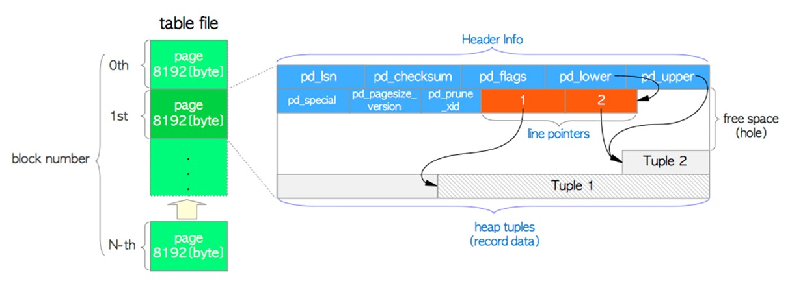
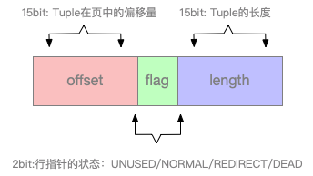

# openGauss 存储结构浅析-relation heappage<a name="ZH-CN_TOPIC_0000001072842421"></a>

## Page 整体布局<a name="section8940132363717"></a>

openGauss 基于 pg9.2 开发,在存储数据结构上基本上沿用 PG 的数据结构，并稍微修改。整体布局上这里盗了一张 PG 的图，进行介绍。



这张 page 结构图中少了在 page 尾部的 special space 数据区，一般存放与索引相关的特定数据，table relation 没有该区域。

整理布局分为 4 个部分：

1、PageHeaderData/HeapPageHeaderData 页面头/heap 页面头数据。

2、linp array,行指针数组。

3、free space 空闲空间。

4、tuple 数据，行数据。

5、special space，在页面尾部，通过 pagehead 中的 pd_special 指向该区域, 一般存放与索引相关的特定数据，table relation page 该区域为空，这张图没画出来。

下面逐个介绍：

## HeapPageHeaderData<a name="section7396185133913"></a>

```
./src/include/storage/bufpage.h
typedef struct {
    /* XXX LSN is member of *any* block, not only page-organized ones */
    PageXLogRecPtr pd_lsn;    /* LSN: next byte after last byte of xlog
                               * record for last change to this page */
    uint16 pd_checksum;       /* checksum */
    uint16 pd_flags;          /* flag bits, see below */
    LocationIndex pd_lower;   /* offset to start of free space */
    LocationIndex pd_upper;   /* offset to end of free space */
    LocationIndex pd_special; /* offset to start of special space */
    uint16 pd_pagesize_version;
    ShortTransactionId pd_prune_xid;           /* oldest prunable XID, or zero if none */
    TransactionId pd_xid_base;                 /* base value for transaction IDs on page */
    TransactionId pd_multi_base;               /* base value for multixact IDs on page */
    ItemIdData pd_linp[FLEXIBLE_ARRAY_MEMBER]; /* beginning of line pointer array */
} HeapPageHeaderData;
disk page organization
space management information generic to any page
	pd_lsn		- identifies xlog record for last change to this page.
	pd_checksum	- page checksum, if set.
	pd_flags	- flag bits.
	pd_lower	- offset to start of free space.
	pd_upper	- offset to end of free space.
	pd_special	- offset to start of special space.
	pd_pagesize_version - size in bytes and page layout version number.
	pd_prune_xid - oldest XID among potentially prunable tuples on page.
```

pg 的 PageHeaderData 为 20 字节,openGauss 的 HeapPageHeaderData 在此基础上增加了两个 8 字节数据项，pd_xid_base，pd_multi_base。这也说明 opengauss 把事物 ID 从 4 字节扩到了 8 字节。

空闲空间起始位置：

- pd_lower 指向 freespace 开始，也就是 linp array 结尾处。
- pd_upper 执行 freespace 结束，也就是 tuple data 开始处。

## linp array<a name="section1358104635615"></a>



```
typedef struct ItemIdData {
    unsigned lp_off : 15, /* offset to tuple (from start of page) */
        lp_flags : 2,     /* state of item pointer, see below */
        lp_len : 15;      /* byte length of tuple */
} ItemIdData;

lp_flags
define LP_UNUSED 0   /* unused (should always have lp_len=0) */
define LP_NORMAL 1   /* used (should always have lp_len>0) */
define LP_REDIRECT 2 /* HOT redirect (should have lp_len=0) */
define LP_DEAD 3     /* dead, may or may not have storage */
```

- 每个行指针大小为 4 字节，也就是 32bit。
- 低 15 位为 lp_off,tuple 起始位置在页面内的偏移量。
- 中间 2 位为 lp_flags,标志信息。

  - LP_UNUSED 0 未使用,lp_len=0
  - LP_NORMAL 1 正常状态，lp_len\>0
  - LP_REDIRECT 2 发生 HOT 时，执行行新的位置，lp_len=0
  - LP_DEAD 3 行为 dead

- lp_len tuple 占用空间长度。
- 计算 linp 数组在 heappageheader 之后，结束于 pd_lower 计算 linp 指针的个数，（pd_lower-linp 开始位置\)/4。

## freespace 空闲空间<a name="section16631141769"></a>

页面内的空闲空间。

linp 从 pd_lower 处往后增长。

tuple data 从尾部，也就是 pd_upper 往前增长。

## tuple data<a name="section138401659714"></a>

tuple 数据，也是页面最重要的部分,由 tuple header+tuple data 组成。

tuple header

- Tuple 头部是由 23byte 固定大小的前缀和可选的 NullBitMap 构成。


- t_xmin：代表插入此元组的事务 xid；
- t_xmax：代表更新或者删除此元组的事务 xid，如果该元组插入后未进行更新或者删除，t_xmax=0；
- t_cid：command id，代表在当前事务中，已经执行过多少条 sql，例如执行第一条 sql 时 cid=0，执行第二条 sql 时 cid=1；
- t_ctid：待研究，在 pg 中为 update 后旧版本指向新 tuple 的指针。
- t_infomask 标志位，记录各种信息，如是否存在 null 列，是否有变长列，是否有 OID 列等。
- 如果有允许为空的列，则存在 null bitmap,可以通过 t_infomask 判断 t_infomask&0x0001, bitmap 的大小与列个数有关。
- t_hoff 记录 header 的大小，包含 null bitmap,padding。
- tuple header 后会有 padding,使 tuple header 的大小为 8 的整数倍。

  ```
  typedef struct HeapTupleHeaderData {
      union {
          HeapTupleFields t_heap;
          DatumTupleFields t_datum;
      } t_choice;
      ItemPointerData t_ctid; /* current TID of this or newer tuple */
      /* Fields below here must match MinimalTupleData! */
      uint16 t_infomask2; /* number of attributes + various flags */
      uint16 t_infomask; /* various flag bits, see below */
      int8 t_hoff; /* sizeof header incl. bitmap, padding */
      /* ^ - 23 bytes - ^ */
      bits8 t_bits[FLEXIBLE_ARRAY_MEMBER]; /* bitmap of NULLs -- VARIABLE LENGTH */
      /* MORE DATA FOLLOWS AT END OF STRUCT */
  } HeapTupleHeaderData;

  typedef struct HeapTupleFields {
      ShortTransactionId t_xmin; /* inserting xact ID */
      ShortTransactionId t_xmax; /* deleting or locking xact ID */
      union {
          CommandId t_cid;           /* inserting or deleting command ID, or both */
          ShortTransactionId t_xvac; /* old-style VACUUM FULL xact ID */
      } t_field3;
  } HeapTupleFields;

  /*
   * information stored in t_infomask:
   */
  #define HEAP_HASNULL 0x0001          /* has null attribute(s) */
  #define HEAP_HASVARWIDTH 0x0002      /* has variable-width attribute(s) */
  #define HEAP_HASEXTERNAL 0x0004      /* has external stored attribute(s) */
  #define HEAP_HASOID 0x0008           /* has an object-id field */
  #define HEAP_COMPRESSED 0x0010       /* has compressed data */
  #define HEAP_COMBOCID 0x0020         /* t_cid is a combo cid */
  #define HEAP_XMAX_EXCL_LOCK 0x0040   /* xmax is exclusive locker */
  #define HEAP_XMAX_SHARED_LOCK 0x0080 /* xmax is shared locker */
  /* if either LOCK bit is set, xmax hasn't deleted the tuple, only locked it */
  #define HEAP_IS_LOCKED (HEAP_XMAX_EXCL_LOCK | HEAP_XMAX_SHARED_LOCK)
  #define HEAP_XMIN_COMMITTED 0x0100 /* t_xmin committed */
  #define HEAP_XMIN_INVALID 0x0200   /* t_xmin invalid/aborted */
  #define HEAP_XMIN_FROZEN (HEAP_XMIN_INVALID | HEAP_XMIN_COMMITTED)
  #define HEAP_XMAX_COMMITTED 0x0400 /* t_xmax committed */
  #define HEAP_XMAX_INVALID 0x0800   /* t_xmax invalid/aborted */
  #define HEAP_XMAX_IS_MULTI 0x1000  /* t_xmax is a MultiXactId */
  #define HEAP_UPDATED 0x2000        /* this is UPDATEd version of row */
  #define HEAP_MOVED_OFF                          \
      0x4000 /* moved to another place by pre-9.0 \
              * VACUUM FULL; kept for binary      \
              * upgrade support */
  #define HEAP_MOVED_IN                             \
      0x8000 /* moved from another place by pre-9.0 \
              * VACUUM FULL; kept for binary        \
              * upgrade support */
  #define HEAP_MOVED (HEAP_MOVED_OFF | HEAP_MOVED_IN)

  #define HEAP_XACT_MASK 0xFFE0 /* visibility-related bits */

  /*
   * information stored in t_infomask2:
   */
  #define HEAP_NATTS_MASK 0x07FF /* 11 bits for number of attributes */
  /* bits 0x1800 are available */
  #define HEAP_HAS_REDIS_COLUMNS 0x2000 /* tuple has hidden columns added by redis */
  #define HEAP_HOT_UPDATED 0x4000 /* tuple was HOT-updated */
  #define HEAP_ONLY_TUPLE 0x8000  /* this is heap-only tuple */

  #define HEAP2_XACT_MASK 0xC000 /* visibility-related bits */
  ```

**tuple data**

1、tuple data 有多个列（属性）组成。

2、每个属性的长度分定长与变长。

3、每个属性有不同的字节对齐。

4、每个属性有不同的存储策略。

5、tuple data 中不存储 null 值。

6、起始位置 8 字节对齐。

**变长类型（typlen = -1）存储策略**

- PLAN 避免压缩和行外存储
- EXTENDED 允许压缩和行外存储，大多数可以 TOAST 的数据类型的默认策略
- EXTERNAL 允许行外存储，但不许压缩
- MAIN 允许压缩，尽量不使用行外存储

参考 pg_type.typstorage

- p: Value must always be stored plain.
- e: Value can be stored in a “secondary” relation \(if relation has one, see pg_class.reltoastrelid\).
- m: Value can be stored compressed inline.
- x: Value can be stored compressed inline or stored in “secondary” storage.

**对齐（起始地址需要是某个长度的整数倍）**

参考 pg_type.typalign

- c = char alignment, i.e., no alignment needed.
- s = short alignment \(2 bytes on most machines\).
- i = int alignment \(4 bytes on most machines\).
- d = double alignment \(8 bytes on many machines, but by no means all\).

```
 typalign | typstorage | count
----------+------------+-------
 c        | p          |     6
 i        | m          |     3
 d        | x          |   269
 s        | p          |     3
 d        | p          |    17
 i        | p          |    39
 i        | x          |    70
(7 rows)
```

通过 pg_type 可以查到各个数据类型数据存储长度，对齐大小，存储策略也可以通过 pg_attribute 去查表上各列的相关属性。如下面 t 表示例：

```
create table  t(id int,id2 bigint,c varchar(100),d date,ts timestamp);
insert into t select i,i,'test'||i,now(),now() from generate_series(1,1000)i;

test=# SELECT a.attname,
test-#   pg_catalog.format_type(a.atttypid, a.atttypmod),attlen,
test-#   (SELECT substring(pg_catalog.pg_get_expr(d.adbin, d.adrelid) for 128)
test(#    FROM pg_catalog.pg_attrdef d
test(#    WHERE d.adrelid = a.attrelid AND d.adnum = a.attnum AND a.atthasdef),
test-#   a.attnotnull, a.attnum,
test-#   (SELECT c.collname FROM pg_catalog.pg_collation c, pg_catalog.pg_type t
test(#    WHERE c.oid = a.attcollation AND t.oid = a.atttypid AND a.attcollation <> t.typcollation) AS attcollation,
test-#   a.attidentity,
test-#   NULL AS indexdef,
test-#   NULL AS attfdwoptions,
test-#   a.attstorage,attalign,
test-#   CASE WHEN a.attstattarget=-1 THEN NULL ELSE a.attstattarget END AS attstattarget, pg_catalog.col_description(a.attrelid, a.attnum)
test-# FROM pg_catalog.pg_attribute a
test-# WHERE a.attrelid = 't'::regclass AND a.attnum > 0 AND NOT a.attisdropped
test-# ORDER BY a.attnum;
attname |         format_type         | attlen | substring | attnotnull | attnum | attstorage | attalign
---------+-----------------------------+--------+-----------+------------+--------+------------+----------
id      | integer                     |      4 |           | f          |      1 | p          | i
id2     | bigint                      |      8 |           | f          |      2 | p          | d
c       | character varying(100)      |     -1 |           | f          |      3 | x          | i
d       | date                        |      4 |           | f          |      4 | p          | i
ts      | timestamp without time zone |      8 |           | f          |      5 | p          | d
(5 rows)

test=# select * from heap_page_items(get_raw_page('t',0));
lp  | lp_off | lp_flags | lp_len |  t_xmin   | t_xmax | t_field3 | t_ctid  | t_infomask2 | t_infomask | t_hoff | t_bits | t_oid |                                       t_data
-----+--------+----------+--------+-----------+--------+----------+---------+-------------+------------+--------+--------+-------+------------------------------------------------------------------------------------
  1 |   8128 |        1 |     64 | 377048720 |      0 |        0 | (0,1)   |           5 |       2306 |     24 |        |       | \x010000000000000001000000000000000d74657374310000e91d000000000000961c1f75bc590200
  2 |   8064 |        1 |     64 | 377048720 |      0 |        0 | (0,2)   |           5 |       2306 |     24 |        |       | \x020000000000000002000000000000000d74657374320000e91d000000000000961c1f75bc590200
  3 |   8000 |        1 |     64 | 377048720 |      0 |        0 | (0,3)   |           5 |       2306 |     24 |        |       | \x030000000000000003000000000000000d74657374330000e91d000000000000961c1f75bc590200
  4 |   7936 |        1 |     64 | 377048720 |      0 |        0 | (0,4)   |           5 |       2306 |     24 |        |       | \x040000000000000004000000000000000d74657374340000e91d000000000000961c1f75bc590200
  5 |   7872 |        1 |     64 | 377048720 |      0 |        0 | (0,5)   |           5 |       2306 |     24 |        |       | \x050000000000000005000000000000000d74657374350000e91d000000000000961c1f75bc590200

                                                                                                                                 0100000000000000 0100000000000000 0d74657374310000 e91d000000000000 961c1f75bc590200
test=# select * from heap_page_item_attrs(get_raw_page('t',0),'t');
lp  | lp_off | lp_flags | lp_len |  t_xmin   | t_xmax | t_field3 | t_ctid  | t_infomask2 | t_infomask | t_hoff | t_bits | t_oid |                                             t_attrs

-----+--------+----------+--------+-----------+--------+----------+---------+-------------+------------+--------+--------+-------+-------------------------------------------------------------------------------------------
------
  1 |   8128 |        1 |     64 | 377048720 |      0 |        0 | (0,1)   |           5 |       2306 |     24 |        |       | {"\\x01000000","\\x0100000000000000","\\x0d7465737431","\\xe91d0000","\\x961c1f75bc590200"
}
  2 |   8064 |        1 |     64 | 377048720 |      0 |        0 | (0,2)   |           5 |       2306 |     24 |        |       | {"\\x02000000","\\x0200000000000000","\\x0d7465737432","\\xe91d0000","\\x961c1f75bc590200"
}
  3 |   8000 |        1 |     64 | 377048720 |      0 |        0 | (0,3)   |           5 |       2306 |     24 |        |       | {"\\x03000000","\\x0300000000000000","\\x0d7465737433","\\xe91d0000","\\x961c1f75bc590200"
}
  4 |   7936 |        1 |     64 | 377048720 |      0 |        0 | (0,4)   |           5 |       2306 |     24 |        |       | {"\\x04000000","\\x0400000000000000","\\x0d7465737434","\\xe91d0000","\\x961c1f75bc590200"
}
  5 |   7872 |        1 |     64 | 377048720 |      0 |        0 | (0,5)   |           5 |       2306 |     24 |        |       | {"\\x05000000","\\x0500000000000000","\\x0d7465737435","\\xe91d0000","\\x961c1f75bc590200"
}
```

**变长类型的存储**

定长数据类型根据 pg_attribute.attlen 对齐后直接存储在 tupledata 中，变长数据类型由于长度不固定，存储时有些特殊。需要在数据中保存长度等信息。pg_attribute.attlen==-1 则为变长类型

1、第一个字节\(va_header\)=0x01，第二个字节 va_tag=18\(VARTAG_INDIRECT\)toast 机制，1 字节 va_header+1 字节 va_tag+4\*4 字节 varatt_external\(toast 指针\)。

```
typedef struct varatt_external {
    int32 va_rawsize;  /* Original data size (includes header) */
    int32 va_extsize;  /* External saved size (doesn't) */
    Oid va_valueid;    /* Unique ID of value within TOAST table */
    Oid va_toastrelid; /* RelID of TOAST table containing it */
} varatt_external;
```

2、short varlena，当长度<=126 时，判断 va_header!=0x01 and va_header&0x01==0x01，第一个字节前 7 位存储大小，最后一位为 0x01。

3、full 4-byte header varlena \(前 4 字节\>\>2\)&0x3FFFFFFF 数据长度。
