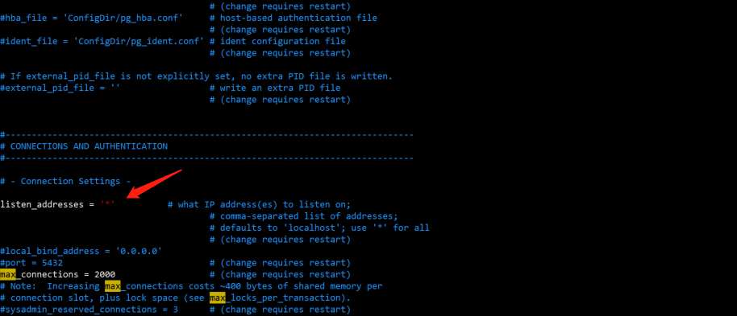
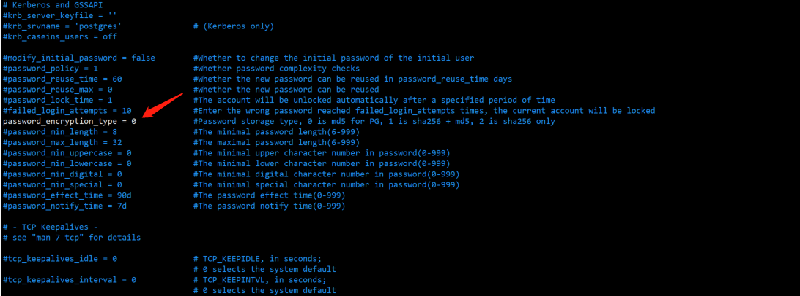
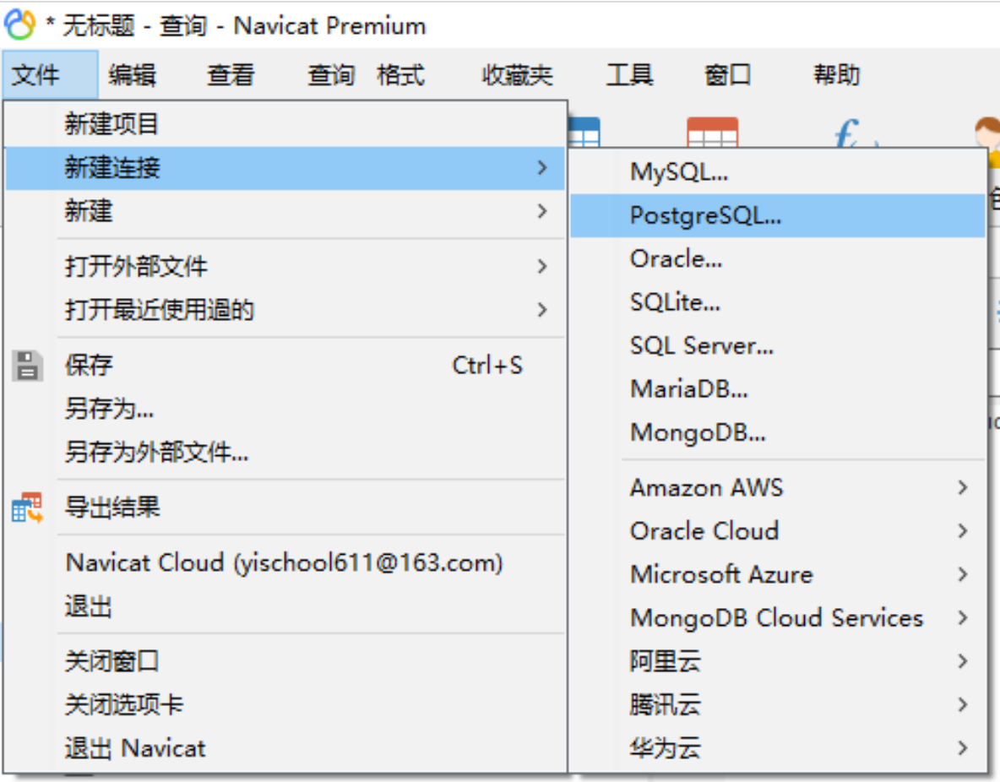
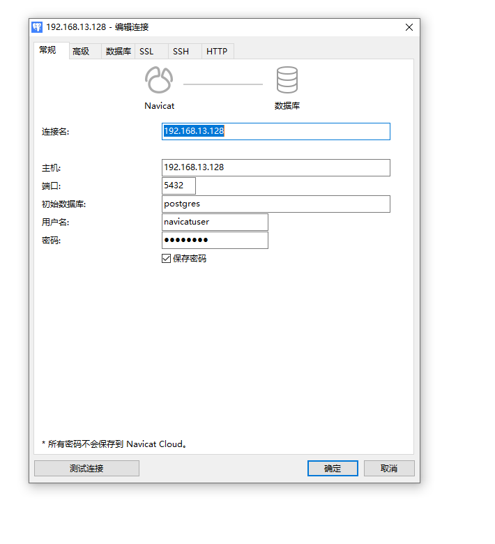
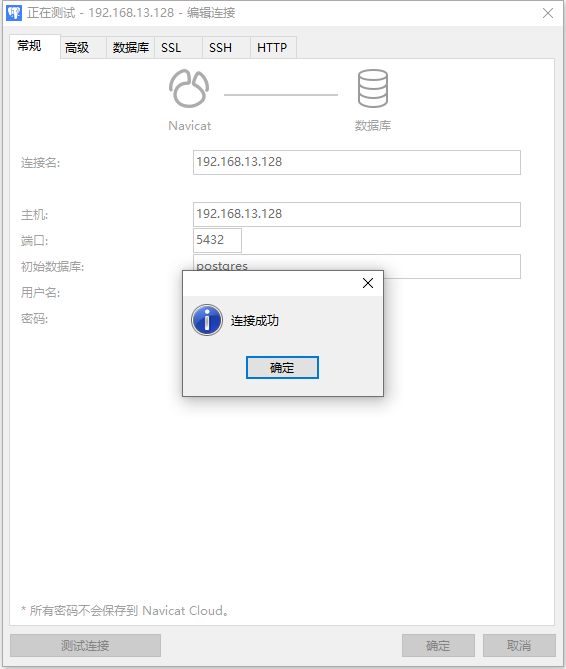

# 使用 navicat 连接 openGauss 数据库

> 由于平时工作中使用 Navicat 比较多，数据库基本通过 Navicat 来管理操作。本文将介绍如何使用 Navicat 进行远程连接

## openGauss 服务设置

主要修改 pg_hba.conf 和 postgresql.conf 两个文件。找到这两个文件所在目录

- 极简版所在目录：`/opt/software/openGauss/data/single_node/`
- 企业版所在目录：`/opt/huawei/install/data/dn`

> 注意：使用普通用户，不要使用 root 用户

### 修改 pg_hba.conf 文件

修改 pg_hba.conf 文件，主要用于添加放行 IP

- 增加 Navicat 所在机器的 IP（如果不考虑安全性，也可以用 0.0.0.0/0 对所有 IP 地址进行开放）
- 修改 trust 替换成 md5 加密方式

```shell
# 1.使用vim打开pg_hba.conf文件
[omm@opengauss openGauss]$ vim /opt/software/openGauss/data/single_node/pg_hba.conf

# 2.加入需要放行的IP，如图所示
# 3.按esc键退出输入模式，输入:wq!退出
```


### 修改 postgresql.conf 文件

修改 postgresql.conf 文件，主要用于修改监听地址和加密方式

```shell
# 1.使用vim打开postgresql.conf文件
[omm@opengauss openGauss]$ vim /opt/software/openGauss/data/single_node/postgresql.conf

# 2.修改监听地址listen_addresses = '*'，如图所示
# 3.修改加密方式password_encryption_type = 0，如图所示
```





### 重启服务

企业版重启命令

```shell
[omm@opengauss openGauss]$ gs_om -t stop
[omm@opengauss openGauss]$ gs_om -t start
```

极简版重启命令

```shell
# 路径为pg_hba.conf和postgresql.conf所在目录
[omm@opengauss openGauss]$ gs_ctl restart -D /opt/software/openGauss/data/single_node/
```

### 创建远程连接角色

由于修改了加密方式，需要对用户之前的密码进行修改；或者创建新用户用于远程连接

```shell
# 使用命令进入数据库
[omm@opengauss openGauss]$ gsql -d postgres -p 5432

# 修改密码方式
alter user test identified by 'openGauss@1234'

# 创建新用户方式
 create user navicatuser password 'openGauss@1234';
```

### 开放端口

```shell
# 查看firewalld状态
[omm@opengauss openGauss]$ systemctl status firewalld

# 把端口加入防火墙
[omm@opengauss openGauss]$ sudo firewall-cmd --zone=public --add-port=5432/tcp --permanent

# 重新加载防火墙
[omm@opengauss openGauss]$ sudo systemctl reload firewalld
```

## Navicat 连接

1. 打开 navicat 点击新建连接选择 postgresSQL 连接



2. 输入 ip、端口号等参数




