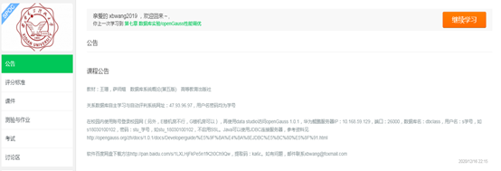
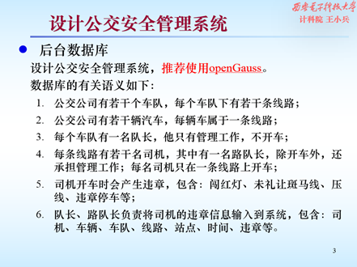
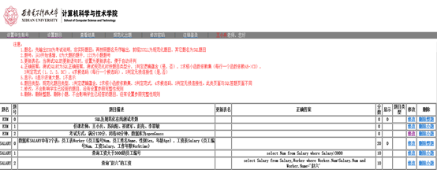
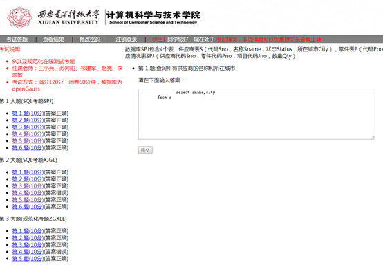

# openGauss 在数据库课程中的应用

为了更好地在高校学生中推广 openGauss 数据库，在西安电子科技大学计算机科学与技术学院教学中，数据库系统课程组将 openGauss 与数据库课程相结合，通过在教学中应用的方法来宣传 openGauss 数据库，并培养学生对 openGauss 数据库的熟练程度，为学生之后使用 openGauss 数据库打下坚实基础。目前主要有以下两种应用方式：

**1.配置 openGauss 数据库供学生日常上机使用**

目前 openGauss 只支持安装在 openEuler 操作系统和 centOS7 操作系统上，且要求内存容量大于 4GB。但由于学生的个人电脑普遍使用 Windows 操作系统，如需安装 openGauss 数据库，需安装 openEuler 的虚拟机且内存要求过大，实现起来较为复杂。

为了方便学生使用，课程组联系学院实验室，在华为提供的鲲鹏服务器上安装了 openGauss 服务器，并为教师和所有选课学生设置了登录账号。为了避免学生误操作造成的一系列后果，课题组设置学生账号角色，赋予连接数据库和访问 pg_roles 表的权限（不设置将无法通过 data studio 远程连接），学生只可以在自己账号默认 schema 下进行表操作。如图 1 课程公告所示，在校园内使用账号登录校园网，再使用 data studio 即可访问到 openGauss 数据库。（使用 data studio 采用非 SSL 方式连接 openGauss 的方法，请参考文章：[Data studio 普通用户采用非 SSL 的方式连接 openGauss](https://www.modb.pro/db/43087)）

**图 1** 课程公告  

为激励学生使用华为 openGauss 数据库，课题组精心设计多个实验题目供学生选择。如图 2 所示，推荐学生使用 openGauss。对完成情况较好的同学，经过验收后记录在案，将来课程总体考核时有加分，并且最后一次课时抽奖，送出华为手环、openGauss 书籍等奖品。

**图 2** 实验题目  

**2.开发基于 openGauss 的在线评判 SQL 及规范化学习系统供学生使用**

SQL 及规范化理论是关系数据库的重要知识点。常规的学习和考核方式，如课堂讲解、平时讨论、卷面考试、上机验收等，由于教学班级人数众多，教师和助教数量偏少，师生比较低的现状造成很难对所有的学生进行有效的辅导。为了解决此类问题，课题组自行设计开发了基于 PHP+Windows+SQL Server 的在线评判 SQL 及规范化学习系统。但由于该系统部署于阿里云服务器上，受限于云服务器的性能和带宽，无法满足全体学生同时访问的需求。

课题组考虑到学院实验室内鲲鹏服务器性能较高，且校园网的带宽较大，可以满足上述需求，决定将该系统迁移至鲲鹏服务器中，基于 PHP+openEuler+openGauss。迁移中存在两个重要技术难点，分别是 PHP 连接数据库的方式变动和 SQL server 数据如何迁移至 openGauss。前者解决办法是将 PHP 中的 mssql 类函数换为 odbc 类函数，后者解决办法请参考文章：[关于迁移 SQL server 到 openGauss 的问题和解决](https://www.modb.pro/db/43084)。PHP 连接 openGauss 的配置过程请参考文章：[PHP+unixODBC+Apache+openGauss 实现数据库的连接](https://www.modb.pro/db/43138)。

通过该系统，如图 3 所示，教师通过教师端可以进行设置考核题目、分配学生账号、查看学生成绩等操作。如图 4 所示，学生通过学生端可以进行在线答题、查看结果等操作。

**图 3** 教师设置 openGauss 在线 SQL 考题  

**图 4** 学生使用 openGauss 在线答题  

