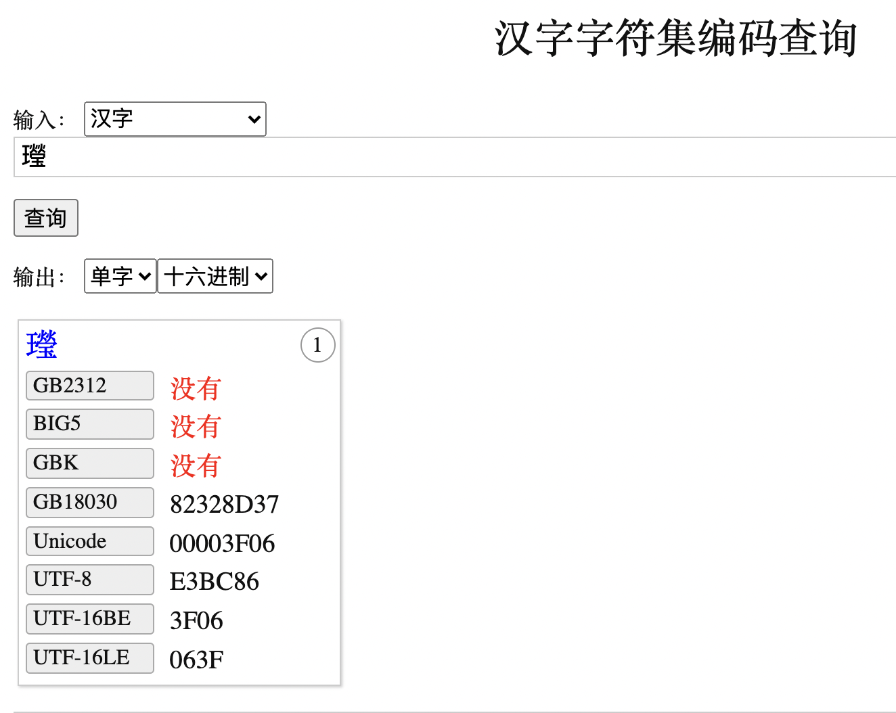
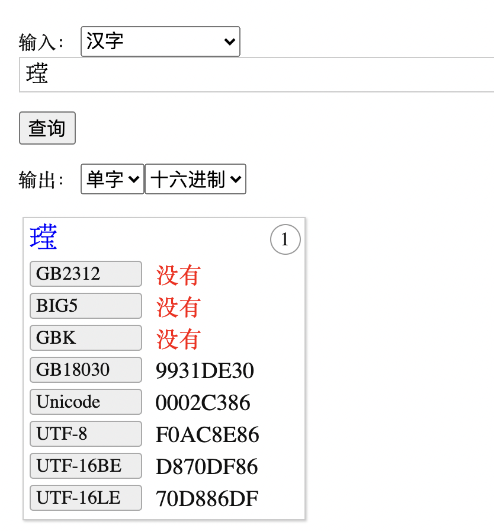
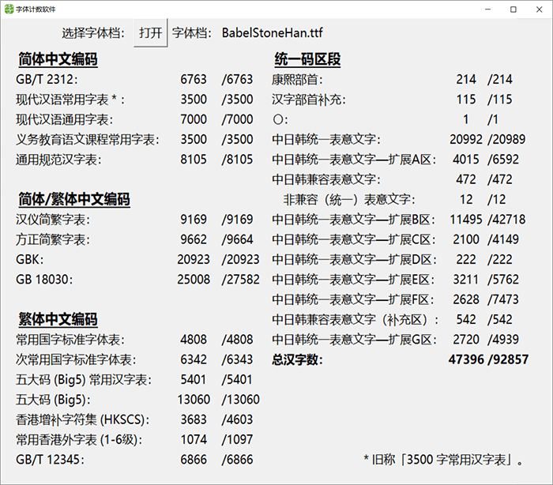

# MogDB/openGauss 对于生僻字的存储和显示：㼆 㱔 䶮 𬎆(王莹)

本文首发于墨天轮：https://www.modb.pro/db/130498

最近在云和恩墨大讲堂的微信群里，有朋友讨论生僻字的存储，其实无论任何数据库，[MogDB](https://www.mogdb.io/)还是 Oracle ，在任何数据库中存储生僻字，其实都和一个因素有关：字符集。

能否正常存储一个字符，首先是要看要**存储的字符在数据库的当前字符集中是否能够表达**。如果包含在数据库字符集中，则能够正常存储。

但是注意，很多时候，本应正常存储的字符，可能在写入过程中，因为环境问题转换错误，丢失了正确的字符，而出现乱码。

标题中出现的生僻字读音：㼆 yíng ，㱔 suǒ，䶮 yǎn

这里面有一个特殊的字：𬎆(王莹) 。注意，如果你的客户端没有支持的字库，则可能无法看到这个字。

我们看一下 MogDB 的表现，我们使用了墨天轮的[实训平台](https://www.modb.pro/databaseInfo)，字符集如下:

```
enmotech=# select * from v$nls_parameters;
      parameter       |           value            |                                 description
----------------------+----------------------------+------------------------------------------------------------------------------
 lc_collate           | en_US.UTF-8                | Shows the collation order locale.
 lc_ctype             | en_US.UTF-8                | Shows the character classification and case conversion locale.
 lc_messages          | en_US.UTF-8                | Sets the language in which messages are displayed.
 lc_monetary          | en_US.UTF-8                | Sets the locale for formatting monetary amounts.
 lc_numeric           | en_US.UTF-8                | Sets the locale for formatting numbers.
 lc_time              | en_US.UTF-8                | Sets the locale for formatting date and time values.
 nls_timestamp_format | DD-Mon-YYYY HH:MI:SS.FF AM | defines the default timestamp format to use with the TO_TIMESTAMP functions.
 NLS_CHARACTERSET     | UTF8                       | Database/Server encoding
(8 rows)
```

生僻字的示范：


如果直接贴代码，不支持的客户端可能就看不到其中的部分汉字：

```
enmotech=# create table mogdb (cname varchar2(10));
CREATE TABLE
enmotech=#
enmotech=# insert into mogdb values('䶮');
INSERT 0 1
enmotech=# insert into mogdb values('㼆');
INSERT 0 1
enmotech=# insert into mogdb values('𬎆');
INSERT 0 1
enmotech=# select cname,dump(cname) from mogdb;
 cname |       dump
-------+-------------------
 䶮   | Len=3 e4,b6,ae
 㼆   | Len=3 e3,bc,86
 𬎆  | Len=4 f0,ac,8e,86
(3 rows)

enmotech=#
```

我们来进一步解释一下。在很多人的认知里，通常 ”㼆“更容易被正确存入数据库中，E3 BC 86 正是其在 UTF8 字符集下的正确编码。查看字符编码的网站：https://www.qqxiuzi.cn/bianma/zifuji.php



而所谓的生僻字，其实是在 Unicode 统一编码标准中，在后期加入的，以支持更多的字符。

在 Unicode 中，汉字被划分为以下几个区，以 Windows 为例给出了支持版本：

基本区：20902 字。

扩展 A 区：6582 字。（Windows XP 原生支持至此）

扩展 B 区：42711 字。（Windows Vista 和 Windows 7 原生支持至此）

扩展 C 区：4149 字。

扩展 D 区：222 字。（Windows 8、Windows 8.1 和 Windows 10 的早期版本支持至此）

扩展 E 区：5762 字。（Windows 10 创意者更新中提供了部分支持）

扩展 F 区：7473 字。（不受支持）

㼆 字位于 A 区，而其简化形态 “王莹”则是位于 E 区，大部分系统并不支持。



也就是说，这个字的[编码：U+2C386](http://yedict.com/zscontent.asp?uni=2C386) 已经给出，但是对于客户端，如果不支持这个显示，则无法正常展示出来。

所以对于一个字符的支持，是包括数据库和客户端两部分的。现在有些输入法可以打出这些生僻字，但是系统不一定能够支持，也就给使用带来了很多麻烦。


在一些字典上这个字是存在的：


对于上面所展示的“王莹”，已经分配了编码，其 UTF-8 编码是 **F0AC8E86** ，只要我们将这个编码存入数据库（字符集如果是 AL32UTF8，可以直接存储），剩下的就是看客户端是否支持，如果支持，则查询后可以正常显示，如果不支持则将无法显示，出现一个替代符号或者乱码。

在一些[字体网站](https://www.maoken.com/)上，你可以找到支持了各种扩展字体的字库文件，安装之后，就能够展示这些生僻的汉字了。

例如，[巴贝斯通汉](https://www.maoken.com/freefonts/2803.html) 就支持了这些扩展区域的字符。



如果你在客户端安装了这个字体，那么如下[一个网页](https://unicode-table.com/en/2C386/)，你将能够看到这个汉字“王莹”，我在这里包含了这个字“𬎆”，没有字体支持你就看不到：


理解清楚了字符集，也就能够找到了应对特殊字符的解决方案。

其实很多生僻字都是用在名字中的，没有受过名字的苦，不足以谈人生。我看到很多人在这个事情上遭受的磨难，为了名字能够正常出现，很多网友是穷尽了心力：


所以，我们的 IT 从业者，将数据库设计好、规划好，就是造福社会和人民了。大家加油！
