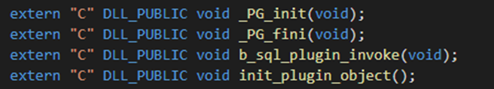
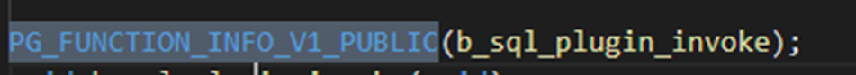
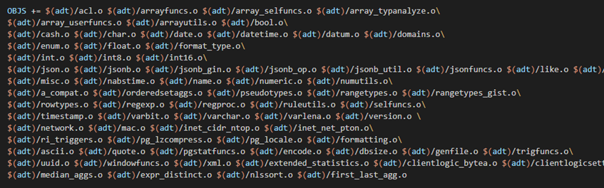
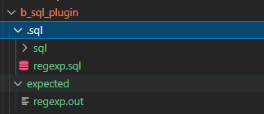
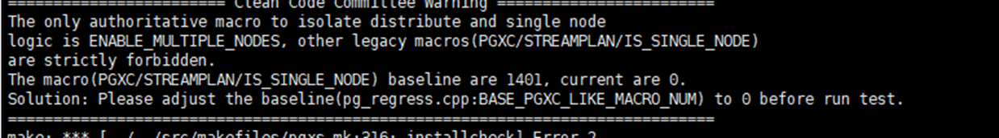
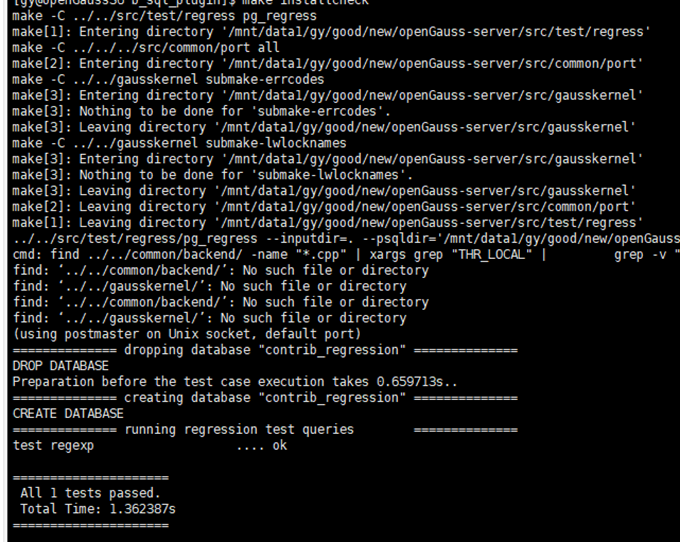

---
title: 'SQL引擎插件开发指导'
date: '2022-11-2'
category: 'blog'
tags: ['SQL引擎插件开发指导']
archives: '2022-11-2'
author: 'ganyang'
summary: 'SQL引擎插件开发指导'
img: '/zh/blogs/xiteming/title/img1.png'
times: '17:00'
---

# **开发流程**

① 在 openGauss 社区 Plugin 仓进行兼容性相关开发(https://gitee.com/opengauss/Plugin)

② 通过 fastcheck 自测以及 CI 门禁

③ 提供 checkin 测试报告和开发文档并通过 SIG 组评审

# **开发要点**

## 开放接口函数 DLL_PUBLIC PG_FUNCTION_INFO_V1_PUBLIC 统一管理

为了避免插件与内核同名函数所产生的符号冲突，我们在 makefile 中使用-fvisibility=hidden 参数，使得插件函数不会注册进符号表进而避免，但是这样内核就无法调用其中的函数，因此对于需要开放给内核调用的接口函数，我们需要添加一个 DLL_PUBLIC 关键字将其注册进符号表，还需用 PG_FUNCTION_INFO_V1_PUBLIC 添加函数，来避免 API 版本报错。

因此后续考虑使用一个头文件统一管理需要开放的接口函数。

如果写在 builtin 中的函数或者有同名重载函数需要开放或者供内部引用，extern 后面不能加“C”。





## Makefile 需要添加相对应.o

对于新增的 cpp 文件，需要在其对应模块的 makefile 和主目录下的 makefile 中分别添加其.o 文件来生成 so，使得其中函数能在插件中调用。



## 新增 HOOK

对于新增的模块如果不在内核现存 hook 的引擎部分需要在内核加新的 hook。

## 新增代码添加 DOLPHIN 宏

对于内核已有的文件进行的改动，需要添加相应的 DOLPHIN 宏
添加：
#ifdef DOLPHIN
新增内容
#endif

修改：
#ifdef DOLPHIN
修改内容
#else
原内容
#endif

删除：
#ifndef DOLPHIN
删除内容
#endif

## 插件安装、使用方法

当前 dolphin 插件支持自动加载，只需要在安装好插件文件后，只需要创建 B 库并使用初始用户连接 B 库即可加载。

### 编译安装

1. 编译安装 openGauss。

2. 将 dolphin 源码拷贝到 openGauss 源码 contrib 目录下。

3. 进去 dolphin 目录执行 make install。

4. 创建 B 库并使用初始用户连接 B 库。

### OM 安装

1. om 安装的 openGauss。

2. 拷贝插件所需文件：
   dolphin.so 路径： app/lib/postgresql/。
   dolphin.control 和 dolphin--1.0.sql 路径 app/share/postgresql/extension。

3. 创建 B 库并使用初始用户连接 B 库。

## fastcheck 自测方法

将测试用的.sql 文件放入 sql 文件夹 预期结果放入 expected 文件夹。注意使用 LF 行尾序列避免格式问题。


通过 make installcheck p=xxx 或者 make check p=xxx 命令就能进行自测,如提示变量值不对需要手动修改 pg_regress.cpp 中相应值。
其中 installcheck 是使用现有的数据库，因此需要保证端口号 p 与当前开启的数据库一致，check 则是会编译一个临时数据库用于测试，可以避免现有数据库的一些数据对结果产生的干扰，但速度会稍慢。




memcheck:memcheck 并不是一个新的 check，只是编译 openGauss 时，编译一个 memcheck 版的，然后通过跑 fastcheck 来发现代码中的内存问题。
编译方式和编译普通的 openGauss 基本一致，只是在 configure 时，添加一个 --enable-memory-check 参数，编译出来的就是 memcheck 版本的 openGauss。
./configure --gcc-version=7.3.0 CC=g++ CFLAGS='-O0' --prefix=$GAUSSHOME --3rd=$BINARYLIBS --enable-debug --enable-cassert --enable-thread-safety --with-readline --without-zlib --enable-memory-check
installcheck 需要自己设置 asan option
export HOME=~
ulimit -v unlimited
export ASAN_OPTIONS=detect_leaks=1:halt_on_error=0:alloc_dealloc_mismatch=0:log_path=$HOME/memchk/memcheck
设置完环境变量后，正常跑 fastcheck 即可，跑完后，会在 $HOME/memchk/memcheck 路径下生成文件名为 runlog.xxx 的 memcheck 报告。根据 memcheck 报告分析是否有内存问题。如何分析 memcheck 报告可自行网上搜索 memcheck 报告分析、asan 报告分析等关键字。

## 升级

1230 后续新增的写在 SQL 中的函数、类型等均需要同步写到升级脚本中。

## 新增函数

需要覆盖内核函数的在插件的 builtin.ini 中进行修改，builtin.ini 指导：(https://mp.weixin.qq.com/s/UWHwhI4jHK6nxPSYeJPVfg)

其他新增函数均通过 create function 的方式来实现。

下面提供一些模板样例用于参考：

```sql

--对于可变长度可变类型的函数sql

create or replace function pg_catalog.gs_interval(variadic arr "any") returns int language C immutable as '$libdir/dolphin', 'gs_interval';

--CREATE TYPE

DROP TYPE IF EXISTS pg_catalog.year CASCADE;

DROP TYPE IF EXISTS pg_catalog._year CASCADE;

CREATE TYPE pg_catalog.year;

CREATE OR REPLACE FUNCTION pg_catalog.year_in (cstring) RETURNS year LANGUAGE C STABLE STRICT as '$libdir/whale', 'year_in';

CREATE OR REPLACE FUNCTION pg_catalog.year_out (year) RETURNS cstring LANGUAGE C STABLE STRICT as '$libdir/whale', 'year_out';

CREATE OR REPLACE FUNCTION pg_catalog.yeartypmodin (cstring[]) RETURNS integer LANGUAGE C IMMUTABLE STRICT as '$libdir/whale', 'yeartypmodin';

CREATE OR REPLACE FUNCTION pg_catalog.yeartypmodout (integer) RETURNS cstring LANGUAGE C IMMUTABLE STRICT as '$libdir/whale', 'yeartypmodout';

CREATE TYPE pg_catalog.year (input=year_in, output=year_out, internallength=2, passedbyvalue, alignment=int2, TYPMOD_IN=yeartypmodin, TYPMOD_OUT=yeartypmodout);


--CREATE OPERATOR

CREATE OPERATOR pg_catalog.=(leftarg = year, rightarg = year, procedure = year_eq, restrict = eqsel, join = eqjoinsel, MERGES);


CREATE OPERATOR pg_catalog.<>(leftarg = year, rightarg = year, procedure = year_ne, restrict = neqsel, join = neqjoinsel);


--ADD PG_OPFAMILY

CREATE OR REPLACE FUNCTION Insert_pg_opfamily_temp(

IN imethod integer,

IN iname text,

IN inamespace integer,

IN iowner integer

)

RETURNS void

AS $$

DECLARE

 row_name record;

 query_str_nodes text;

BEGIN

 query_str_nodes := 'select * from dbe_perf.node_name';

 FOR row_name IN EXECUTE(query_str_nodes) LOOP

   insert into pg_catalog.pg_opfamily values (imethod, iname, inamespace, iowner);

 END LOOP;

 return;

END; $$

LANGUAGE 'plpgsql';

select Insert_pg_opfamily_temp(403, 'year_ops', 11, 10);

DROP FUNCTION Insert_pg_opfamily_temp();


--ADD PG_CAST

DROP CAST IF EXISTS (integer AS year) CASCADE;

CREATE CAST(integer AS year) WITH FUNCTION int32_year(integer) AS IMPLICIT;


DROP CAST IF EXISTS (integer AS date) CASCADE;

CREATE CAST(integer AS date) WITH FUNCTION int32_b_format_date(integer);


--ADD PG_OPCLASS

CREATE OR REPLACE FUNCTION Insert_pg_opclass_temp(

IN icmethod integer,

IN icname text,

IN icnamespace integer,

IN icowner integer,

IN icfamily integer,

IN icintype integer,

IN icdefault boolean,

IN ickeytype integer

)

RETURNS void

AS $$

DECLARE

 row_name record;

 query_str_nodes text;

BEGIN

 query_str_nodes := 'select * from dbe_perf.node_name';

 FOR row_name IN EXECUTE(query_str_nodes) LOOP

   insert into pg_catalog.pg_opclass values (icmethod, icname, icnamespace, icowner, icfamily, icintype, icdefault, ickeytype);

 END LOOP;

 return;

END; $$

LANGUAGE 'plpgsql';


create or replace function insert_year(

IN opcmethod integer,

IN opcname character,

IN opcnamespace integer,

IN opcowner integer,

IN opcfamilyname character,

IN opcintypename character,

IN opcdefault boolean,

IN opckeytype integer

)

returns void

AS $$

DECLARE

 opfamily integer;

 opcintype integer;

BEGIN

select oid into opfamily from pg_opfamily where opfname = opcfamilyname;

select oid into opcintype from pg_type where typname = opcintypename;

 perform Insert_pg_opclass_temp(opcmethod, opcname, opcnamespace, opcowner, opfamily, opcintype, opcdefault, opckeytype);

 return;

END;

$$ LANGUAGE 'plpgsql';


select insert_year(403, 'year_ops', 11, 10, 'year_ops', 'year', true, 0);


DROP FUNCTION insert_year;

DROP FUNCTION Insert_pg_opclass_temp();


-- add pg_amproc


CREATE OR REPLACE FUNCTION Insert_pg_amproc_temp(

IN iprocfamily  oid,

IN iproclefttype oid,

IN iprocrighttype oid,

IN iprocnum    smallint,

IN iproc     regproc

)

RETURNS void

AS $$

DECLARE

 row_name record;

 query_str_nodes text;

BEGIN

 query_str_nodes := 'select * from dbe_perf.node_name';

 FOR row_name IN EXECUTE(query_str_nodes) LOOP

   insert into pg_catalog.pg_amproc values (iprocfamily, iproclefttype, iprocrighttype, iprocnum, iproc);

 END LOOP;

 return;

END; $$

LANGUAGE 'plpgsql';


create or replace function insert_year(

IN opfamily     character,

IN left_type   character,

IN right_type   character,

IN funcname     character,


)

returns void

AS $$

DECLARE

 opfamilyoid integer;

 left_typeoid integer;

right_typeoid integer;

amprocnum integer;

func integer;

BEGIN


select oid into opfamilyoid from pg_opfamily where opfname = opcfamilyname;

select oid into left_type from pg_type where typname = left_type;

select oid into right_typeoid from pg_type where typname = right_type;

select oid into func from pg_proc where typname = funcname;

 perform Insert_pg_amproc_temp(opfamilyoid, left_typeoid, right_typeoid, amprocnum, func);

 return;

END;

$$ LANGUAGE 'plpgsql';


select insert_year('year_ops'，'year'，'year'，1，'year_cmp');

select insert_year('year_ops'，'year'，'year'，2，' year_sortsupport ');

DROP FUNCTION insert_year();

DROP FUNCTION Insert_pg_amproc_temp();


-- add pg_amop


CREATE OR REPLACE FUNCTION Insert_pg_amop_temp(

IN iopfamily   integer,

IN ioplefttype  integer,

IN ioprighttype integer,

IN iopstrategy  integer,

IN ioppurpose  character,

IN iopopr    integer,

IN iopmethod   integer,

IN iopsortfamily integer

)

RETURNS void

AS $$

DECLARE

 row_name record;

 query_str_nodes text;

BEGIN

 query_str_nodes := 'select * from dbe_perf.node_name';

 FOR row_name IN EXECUTE(query_str_nodes) LOOP

   insert into pg_catalog.pg_amop values (iopfamily, ioplefttype, ioprighttype, iopstrategy, ioppurpose, iopopr, iopmethod, iopsortfamily);

 END LOOP;

 return;

END; $$

LANGUAGE 'plpgsql';


create or replace function insert_year(

 IN opfamily     character,

 IN iopstrategy   integer,

 IN left_type    character,

 IN right_type   character,

 IN iopopr     character

)

returns void

AS $$

DECLARE

 opfamilyoid integer;

 leftoid integer;

 rightoid integer;

 opoproid integer;

BEGIN

 select oid into opfamilyoid from pg_opfamily where opfname = opfamily;

 select oid into leftoid from pg_type where typname = left_type;

 select oid into rightoid from pg_type where typname = right_type;

 select oid into opoproid from pg_operator where oprname = iopopr and oprleft = leftoid and oprright = rightoid;

 perform Insert_pg_amop_temp(opfamilyoid, leftoid, rightoid, iopstrategy, 's', opoproid, 403, 0);

 return;

END;

$$ LANGUAGE 'plpgsql';


select insert_year('year_ops', 1, 'year', 'year', '<');

select insert_year('year_ops', 2, 'year', 'year', '<=');

drop function Insert_pg_amop_temp();
```

# 终结符与非终结符相关

由于要开发表名、用户名大小写敏感且不影响其他的对象名，需要对一些终结符与非终结符进行改造，这种改造会与原 openGauss 产生一定的差异，容易引起后续开发者在开发过程中产生一定的不适应，因此发布文档对这些被改造的终结符、非终结符进行描述。

（详情见 PR：[https://gitee.com/opengauss/Plugin/pulls/238](https://gitee.com/opengauss/Plugin/pulls/238)）

## 终结符

### IDENT

IDENT 终结符是一个用于表示对象名称的字符串类型终结符。

在原来词法分析中，如果词法分析匹配到一个非关键字的标识符，就会将该字符串进行转小写、截断的操作，并将处理完成后的字符串绑定到 yylval 的 str 字段中，并借此传递到语法解析层面。

现在，如果词法分析匹配到一个非关键字的标识符，将不会进行转小写的操作，而是直接经历截断操作，并绑定到 yylval 的 str 中进行传递。

因此，如果在开发的过程中使用到这个终结符，可以通过如下所示的方法将其转换为小写：

```
normal_ident:		IDENT							{ $$ = downcase_str($1, is_quoted()); };
```

这里新建了一个名为 downcase_str 的函数对字符串类型的标识符进行小写转换，其实际的内容为：

```
#define is_quoted()  pg_yyget_extra(yyscanner)->core_yy_extra.ident_quoted
static char* downcase_str(char* ident, bool is_quoted)
{
	if (ident == NULL || is_quoted) {
		return ident;
	}
	int i;
	bool enc_is_single_byte = (pg_database_encoding_max_length() == 1);
	int len = strlen(ident);
	for (i = 0; i < len; i++) {
		ident[i] = (char)GetLowerCaseChar((unsigned char)ident[i], enc_is_single_byte);
	}

	return ident;
}
```

其中，is_quoted 表示该字符串是否为引用，true 则为引用，不进行强制转小写操作，false 则为非引用，会进行转小写的操作。由于 is_quoted()返回的内容是一个全局的变量，在同一个语句中前一个词的 pg_yyget_extra(yyscanner)->core_yy_extra.ident_quoted 会被后一个词覆盖，导致没有办法得到正确的结果。因此在使用的过程中，更推荐用 normal_ident 对 IDENT 进行替换，其内容如下所示：

```
normal_ident:		IDENT							{ $$ = downcase($1); };
```

这样的话就能够保证每次获取到的 ident_quoted 就是当前 IDENT 的，从而能够正确地识别该词是否被引用。

### 关键字

关键字在词法分析时是和 IDENT 终结符一起处理的，因为两者都能被同一个正则表达式匹配。

由于非保留关键字可以当做表名进行使用，所以也对关键字进行了大小写敏感处理，如果需要用到对应关键字的值，则需要对关键字进行转小写操作，如下所示：

```
ColId:		IDENT									{ $$ = downcase_str($1, is_quoted()); }
			| unreserved_keyword					{ $$ = downcase_str(pstrdup($1), is_quoted()); }
			| col_name_keyword						{ $$ = downcase_str(pstrdup($1), is_quoted()); }
```

可以看到，在 ColId 中，对 unreserved_keyword 和 col_name_keyword 的返回值都进行了转小写的处理，用于适配原来关键字的字符串必为小写的行为。值得注意的是，关键字其实并不会被引用，所以进行转换时可以让关键字的 is_quoted 直接置为 false，如下所示：

```
ColId:		IDENT									{ $$ = downcase($1); }
			| unreserved_keyword					{ $$ = downcase_str(pstrdup($1), false); }
			| col_name_keyword						{ $$ = downcase_str(pstrdup($1), false); }
		;
```

## 非终结符

由于有些非终结符可以表示不同对象的标识符，所以对于非终结符，一般用替换的方式进行处理。

在替换的过程中可能会出现 IDENT 中所说的情况，在同一个语句中前一个词的 pg_yyget_extra(yyscanner)->core_yy_extra.ident_quoted 会被后一个词覆盖，所以使用了一个新的结构体去保留非关键字的值以及引用情况，如下所示：

```
typedef struct DolphinString
{
	Node* node;
	char* str;
	bool is_quoted;
} DolphinString;
```

node 用来保存节点（主要是 Value 或者 A_Indices 类型的结点），str 用于保存字符串的值，is_quoted（保存非 Value 类型的时候会直接置为 false）则表示该词是否被引用。如果要生成一个 DolphinString 结点，可以通过以下函数生成：

```
static DolphinString* MakeDolphinString(char* str, Node* node, bool is_quoted)
{
	DolphinString* result = (DolphinString*)palloc(sizeof(DolphinString));
	result->str = str;
	result->node = node;
	result->is_quoted = is_quoted;
	return result;
}

static inline DolphinString* MakeDolphinStringByChar(char* str, bool is_quoted)
{
	return MakeDolphinString(str, (Node*)makeString(str), is_quoted);
}

static inline DolphinString* MakeDolphinStringByNode(Node* node, bool is_quoted)
{
	return MakeDolphinString(IsA(node, Value) ? strVal(node) : NULL, node, is_quoted);
}
```

具体的使用方法如下所示：

```
dolphin_indirection_el:
			'.' DolphinColLabel
				{
					$$ = $2;
				}
			| ORA_JOINOP
				{
					$$ = MakeDolphinStringByNode((Node *) makeString("(+)"), false);
				}
			| '.' '*'
				{
					$$ = MakeDolphinStringByNode((Node *) makeNode(A_Star), false);
				}
			| '[' a_expr ']'
				{
					A_Indices *ai = makeNode(A_Indices);
					ai->lidx = NULL;
					ai->uidx = $2;
					$$ = MakeDolphinStringByNode((Node *) ai, false);
				}
			| '[' a_expr ':' a_expr ']'
				{
					A_Indices *ai = makeNode(A_Indices);
					ai->lidx = $2;
					ai->uidx = $4;
					$$ = MakeDolphinStringByNode((Node *) ai, false);
				}
			| '[' a_expr ',' a_expr ']'
				{
					A_Indices *ai = makeNode(A_Indices);
					ai->lidx = $2;
					ai->uidx = $4;
					$$ = MakeDolphinStringByNode((Node *) ai, false);
				}
		;
```

### 替换情况

前面已经说了，针对非终结符一般采用在特定语法进行替换的方式实现区分，这里主要介绍一下新建的非终结符及其替换方案。

#### ColId -> DolphinColId

主要用于替换 ColId，为 DolphinString 类型的非终结符，定义如下所示：

```
DolphinColId:		IDENT							{ $$ = MakeDolphinStringByChar($1, is_quoted()); }
					| unreserved_keyword			{ $$ = MakeDolphinStringByChar(pstrdup($1), is_quoted()); }
					| col_name_keyword				{ $$ = MakeDolphinStringByChar(pstrdup($1), is_quoted()); }
		;
```

#### ColLabel -> DolphinColLabel

用于替换 DolphinColLabel，为 DolphinString 类型的非终结符，定义如下所示：

```
DolphinColLabel:	IDENT									{ $$ = MakeDolphinStringByChar($1, is_quoted()); }
					| unreserved_keyword					{ $$ = MakeDolphinStringByChar(pstrdup($1), is_quoted()); }
					| col_name_keyword						{ $$ = MakeDolphinStringByChar(pstrdup($1), is_quoted()); }
					| type_func_name_keyword				{ $$ = MakeDolphinStringByChar(pstrdup($1), is_quoted()); }
					| reserved_keyword
						{
							/* ROWNUM can not be used as alias */
							if (DolphinObjNameCmp($1, "rownum", is_quoted())) {
								const char* message = "ROWNUM cannot be used as an alias";
								InsertErrorMessage(message, u_sess->plsql_cxt.plpgsql_yylloc);
								ereport(errstate,
									(errcode(ERRCODE_SYNTAX_ERROR),
										errmsg("ROWNUM cannot be used as an alias"),
												parser_errposition(@1)));
							}
							$$ = MakeDolphinStringByChar(pstrdup($1), is_quoted());
						}
		;
```

#### indirection_el -> dolphin_indirection_el

用于在 dolphin_indirection 中对 indirection_el 进行替换，其为 DolphinString 类型，定义如下所示：

```
dolphin_indirection_el:
			'.' DolphinColLabel
				{
					$$ = $2;
				}
			| ORA_JOINOP
				{
					$$ = MakeDolphinStringByNode((Node *) makeString("(+)"), false);
				}
			| '.' '*'
				{
					$$ = MakeDolphinStringByNode((Node *) makeNode(A_Star), false);
				}
			| '[' a_expr ']'
				{
					A_Indices *ai = makeNode(A_Indices);
					ai->lidx = NULL;
					ai->uidx = $2;
					$$ = MakeDolphinStringByNode((Node *) ai, false);
				}
			| '[' a_expr ':' a_expr ']'
				{
					A_Indices *ai = makeNode(A_Indices);
					ai->lidx = $2;
					ai->uidx = $4;
					$$ = MakeDolphinStringByNode((Node *) ai, false);
				}
			| '[' a_expr ',' a_expr ']'
				{
					A_Indices *ai = makeNode(A_Indices);
					ai->lidx = $2;
					ai->uidx = $4;
					$$ = MakeDolphinStringByNode((Node *) ai, false);
				}
		;
```

#### index_name -> dolphin_index_name

这个替换主要是用于解决 CLUSTER 语法中索引名和表名的语法冲突，仍为字符串类型，定义如下所示：

```
dolphin_index_name: DolphinColId					{ $$ = downcase_str($1->str, $1->is_quoted); };
```

#### func_name -> dolphin_func_name

该替换主要用于处理 a_expr 处的语法冲突，类型与 func_name 一样为 list 类型，定义如下所示：

```
dolphin_func_name:	type_function_name
						{ $$ = list_make1(makeString($1)); }
					| DolphinColId dolphin_indirection
						{
							$$ = check_func_name(lcons(makeString(downcase_str($1->str, $1->is_quoted)),
													GetNameListFromDolphinString($2)), yyscanner);
						}
		;
```

#### qualified_name -> dolphin_qualified_name

该替换主要用于区分表名和索引名、快照名以及序列名等的标识符，相较于 qualified_name，拥有大小写敏感的特性，且会根据是否开启大小写敏感、对应标识符是否引用、对应标识符是否为表名这几种情况决定是否对标识符进行小写转换，定义如下所示：

```
dolphin_qualified_name:
			DolphinColId
				{
					$$ = makeRangeVar(NULL, GetDolphinObjName($1->str, $1->is_quoted), @1);
				}
			| DolphinColId dolphin_indirection
				{
					check_dolphin_qualified_name($2, yyscanner);
					$$ = makeRangeVar(NULL, NULL, @1);
					const char* message = "improper qualified name (too many dotted names)";
					DolphinString* first = NULL;
					DolphinString* second = NULL;
					switch (list_length($2))
					{
						case 1:
							$$->catalogname = NULL;
							$$->schemaname = downcase_str($1->str, $1->is_quoted);
							first = (DolphinString*)linitial($2);
							$$->relname = strVal(first->node);
							break;
						case 2:
							$$->catalogname = downcase_str($1->str, $1->is_quoted);
							first = (DolphinString*)linitial($2);
							second = (DolphinString*)lsecond($2);
							$$->schemaname = downcase_str(strVal(first->node), first->is_quoted);
							$$->relname = strVal(second->node);
							break;
						default:
							InsertErrorMessage(message, u_sess->plsql_cxt.plpgsql_yylloc);
							ereport(errstate,
									(errcode(ERRCODE_SYNTAX_ERROR),
									 errmsg("improper qualified name (too many dotted names): %s",
											NameListToString(lcons(makeString($1->str), GetNameListFromDolphinString($2)))),
									 parser_errposition(@1)));
							break;
					}
				}
		;
```

get_dolphin_obj_name 会根据 lower_case_table_names 是否为 0 决定需不需要调用小写转换函数，如果为 0，则表示大小写敏感，不需要转小写，>0 则大小写不敏感，需要调用小写转换函数。

#### name_list -> dolphin_name_list

用于替换 name_list，为 list 类型，仅在 drop user 语法中替换使用，定义为：

```
dolphin_name_list:	RoleId
					{ $$ = list_make1(makeString($1)); }
			| dolphin_name_list ',' RoleId
					{ $$ = lappend($1, makeString($3)); }
		;
```

#### qualified_name_list -> dolphin_qualified_name_list

用于替换 qualified_name_list ，是 dolphin_qualified_name 的链表，为 list 类型，定义如下所示：

```
dolphin_qualified_name_list:
			dolphin_qualified_name										{ $$ = list_make1($1); }
			| dolphin_qualified_name_list ',' dolphin_qualified_name	{ $$ = lappend($1, $3); }
		;
```

#### any_name -> dolphin_any_name

仅用于在 COMMENT 语法中替换 any_name，为 list 类型，定义如下所示：

```
dolphin_any_name:	DolphinColId						{ $$ = list_make1(makeString(GetDolphinObjName($1->str, $1->is_quoted))); }
			| DolphinColId dolphin_attrs
			{
				List* list = $2;
				List* result = list_make1(makeString(downcase_str($1->str, $1->is_quoted)));
				ListCell * cell = NULL;
				int length = list_length($2);
				int count = 1;
				foreach (cell, list) {
					DolphinString* dolphinString = (DolphinString*)lfirst(cell);
					Value* value = (Value*)(dolphinString->node);
					char* str = strVal(value);
					bool is_quoted = dolphinString->is_quoted;
					if (length == 1 && count == 1) {
						/* schema_name.table_name */
						result = lappend(result, makeString(GetDolphinObjName(str, is_quoted)));
					} else if (count == 2) {
						/* category_name.schema_name.table_name */
						result = lappend(result, makeString(GetDolphinObjName(str, is_quoted)));
					} else {
						/* other_names */
						result = lappend(result, makeString(downcase_str(str, is_quoted)));
					}
					count++;
				}
				$$ = result;
			}
		;
```

#### any_name_list -> dolphin_any_name_list

仅用于在 drop table 语句中对 any_name_list 进行替换，为 dolphin_any_name 的链表，定义如下所示：

```
dolphin_any_name_list:
			dolphin_any_name										{ $$ = list_make1($1); }
			| dolphin_any_name_list ',' dolphin_any_name			{ $$ = lappend($1, $3); }
		;
```

#### attrs -> dolphin_attrs

用于在 dolphin_any_name 中对 attrs 进行替换，为 list 类型，定义如下所示：

```
dolphin_attrs:		'.' DolphinColLabel
						{ $$ = list_make1($2); }
					| dolphin_attrs '.' DolphinColLabel
						{ $$ = lappend($1, $3); }
		;
```

#### indirection -> dolphin_indirection

用于对 dolphin_qualified_name 以及 dolphin_func_name 中的 indirection 进行替换，类型为 list，定义如下所示：

```
dolphin_indirection:
			dolphin_indirection_el									{ $$ = list_make1($1); }
			| dolphin_indirection dolphin_indirection_el			{ $$ = lappend($1, $2); }
		;
```

#### alias_clause -> dolphin_alias_clause

用于对表别名进行替换，类型为 alias 类型，定义如下所示：

```
dolphin_alias_clause:
			AS DolphinColId '(' name_list ')'
				{
					$$ = makeNode(Alias);
					$$->aliasname = GetDolphinObjName($2->str, $2->is_quoted);
					$$->colnames = $4;
				}
			| AS DolphinColId
				{
					$$ = makeNode(Alias);
					$$->aliasname = GetDolphinObjName($2->str, $2->is_quoted);
				}
			| DolphinColId '(' name_list ')'
				{
					$$ = makeNode(Alias);
					$$->aliasname = GetDolphinObjName($1->str, $1->is_quoted);
					$$->colnames = $3;
				}
			| DolphinColId
				{
					$$ = makeNode(Alias);
					$$->aliasname = GetDolphinObjName($1->str, $1->is_quoted);
				}
		;
```
