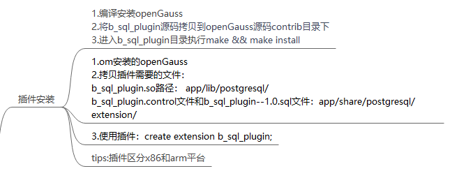

---
title: 'SQL引擎插件开发指导'
date: '2022-08-12'
category: 'blog'
tags: ['SQL引擎插件开发指导']
archives: '2022-08-12'
author: 'ganyang'
summary: 'SQL引擎插件开发指导'
img: '/zh/blogs/xiteming/title/img1.png'
times: '15:00'
---

# **开发流程**

① 在 openGauss 社区 Plugin 仓进行兼容性相关开发(https://gitee.com/opengauss/Plugin)

② 通过 fastcheck 自测以及 CI 门禁

③ 提供 checkin 测试报告和开发文档并通过 SIG 组评审

# **开发要点**

## 开放接口函数 DLL_PUBLIC PG_FUNCTION_INFO_V1_PUBLIC 统一管理

为了避免插件与内核同名函数所产生的符号冲突，我们在 makefile 中使用-fvisibility=hidden 参数，使得插件函数不会注册进符号表进而避免，但是这样内核就无法调用其中的函数，因此对于需要开放给内核调用的接口函数，我们需要添加一个 DLL_PUBLIC 关键字将其注册进符号表，还需用 PG_FUNCTION_INFO_V1_PUBLIC 添加函数，来避免 API 版本报错。

因此后续考虑使用一个头文件统一管理需要开放的接口函数。

如果写在 builtin 中的函数或者有同名重载函数需要开放或者供内部引用，extern 后面不能加“C”。


## Makefile 需要添加相对应.o

对于新增的 cpp 文件，需要在其对应模块的 makefile 和主目录下的 makefile 中分别添加其.o 文件来生成 so，使得其中函数能在插件中调用。


## 新增 HOOK

对于新增的模块如果不在内核现存 hook 的引擎部分需要在内核加新的 hook。

## 插件安装、使用方法

将 whale 文件夹放入数据库的 contrib 目录下，并使用 make -sj && make install -sj 完成编译安装，随后创建一个 B 兼容性的数据库，随后插件会自动完成加载，之后即可使用。




## fastcheck 自测方法

将测试用的.sql 文件放入 sql 文件夹 预期结果放入 expected 文件夹。注意使用 LF 行尾序列避免格式问题。


通过 make installcheck p=xxx 或者 make check p=xxx 命令就能进行自测,如提示变量值不对需要手动修改 pg_regress.cpp 中相应值。
其中 installcheck 是使用现有的数据库，因此需要保证端口号 p 与当前开启的数据库一致，check 则是会编译一个临时数据库用于测试，可以避免现有数据库的一些数据对结果产生的干扰，但速度会稍慢。


memcheck:memcheck 并不是一个新的 check，只是编译 openGauss 时，编译一个 memcheck 版的，然后通过跑 fastcheck 来发现代码中的内存问题。
编译方式和编译普通的 openGauss 基本一致，只是在 configure 时，添加一个 --enable-memory-check 参数，编译出来的就是 memcheck 版本的 openGauss。
./configure --gcc-version=7.3.0 CC=g++ CFLAGS='-O0' --prefix=$GAUSSHOME --3rd=$BINARYLIBS --enable-debug --enable-cassert --enable-thread-safety --with-readline --without-zlib --enable-memory-check
installcheck 需要自己设置 asan option
export HOME=~
ulimit -v unlimited
export ASAN_OPTIONS=detect_leaks=1:halt_on_error=0:alloc_dealloc_mismatch=0:log_path=$HOME/memchk/memcheck
设置完环境变量后，正常跑 fastcheck 即可，跑完后，会在 $HOME/memchk/memcheck 路径下生成文件名为 runlog.xxx 的 memcheck 报告。根据 memcheck 报告分析是否有内存问题。如何分析 memcheck 报告可自行网上搜索 memcheck 报告分析、asan 报告分析等关键字。

## 升级

930 为第一次正式版本，后续新增的写在 SQL 中的函数、类型等均需要同步写到升级脚本中。

## 新增函数

将与新类型无关的新方法添加到插件的 builtin.ini 中，builtin.ini 指导：(https://mp.weixin.qq.com/s/UWHwhI4jHK6nxPSYeJPVfg)
而由于插件内部不附带 pg_type.h

因此在创建新的兼容类型时，无法和之前内核开发一样直接写在头文件中，而是需要通过 sql 语句来 create type，由于这样生成的类型 OID 是随机的，因此对于和该类型相关联的方法、CAST、操作符等均需要在 SQL 语句中生成，且 SQL 中调用的新增函数必须按上述开放接口函数，同时建议除了需要覆盖内核同名函数外，尽可能不要在 builtin.ini 中开发新函数，而是使用 sql，因为这样可以避免和未来内核开发的函数 OID 冲突。

下面提供一些模板样例用于参考：

```

--对于可变长度可变类型的函数sql

create or replace function pg_catalog.gs_interval(variadic arr "any") returns int language C immutable as '$libdir/dolphin', 'gs_interval';

--CREATE TYPE

DROP TYPE IF EXISTS pg_catalog.year CASCADE;

DROP TYPE IF EXISTS pg_catalog._year CASCADE;

CREATE TYPE pg_catalog.year;

CREATE OR REPLACE FUNCTION pg_catalog.year_in (cstring) RETURNS year LANGUAGE C STABLE STRICT as '$libdir/whale', 'year_in';

CREATE OR REPLACE FUNCTION pg_catalog.year_out (year) RETURNS cstring LANGUAGE C STABLE STRICT as '$libdir/whale', 'year_out';

CREATE OR REPLACE FUNCTION pg_catalog.yeartypmodin (cstring[]) RETURNS integer LANGUAGE C IMMUTABLE STRICT as '$libdir/whale', 'yeartypmodin';

CREATE OR REPLACE FUNCTION pg_catalog.yeartypmodout (integer) RETURNS cstring LANGUAGE C IMMUTABLE STRICT as '$libdir/whale', 'yeartypmodout';

CREATE TYPE pg_catalog.year (input=year_in, output=year_out, internallength=2, passedbyvalue, alignment=int2, TYPMOD_IN=yeartypmodin, TYPMOD_OUT=yeartypmodout);


--CREATE OPERATOR

CREATE OPERATOR pg_catalog.=(leftarg = year, rightarg = year, procedure = year_eq, restrict = eqsel, join = eqjoinsel, MERGES);


CREATE OPERATOR pg_catalog.<>(leftarg = year, rightarg = year, procedure = year_ne, restrict = neqsel, join = neqjoinsel);


--ADD PG_OPFAMILY

CREATE OR REPLACE FUNCTION Insert_pg_opfamily_temp(

IN imethod integer,

IN iname text,

IN inamespace integer,

IN iowner integer

)

RETURNS void

AS $$

DECLARE

 row_name record;

 query_str_nodes text;

BEGIN

 query_str_nodes := 'select * from dbe_perf.node_name';

 FOR row_name IN EXECUTE(query_str_nodes) LOOP

   insert into pg_catalog.pg_opfamily values (imethod, iname, inamespace, iowner);

 END LOOP;

 return;

END; $$

LANGUAGE 'plpgsql';

select Insert_pg_opfamily_temp(403, 'year_ops', 11, 10);

DROP FUNCTION Insert_pg_opfamily_temp();


--ADD PG_CAST

DROP CAST IF EXISTS (integer AS year) CASCADE;

CREATE CAST(integer AS year) WITH FUNCTION int32_year(integer) AS IMPLICIT;


DROP CAST IF EXISTS (integer AS date) CASCADE;

CREATE CAST(integer AS date) WITH FUNCTION int32_b_format_date(integer);


--ADD PG_OPCLASS

CREATE OR REPLACE FUNCTION Insert_pg_opclass_temp(

IN icmethod integer,

IN icname text,

IN icnamespace integer,

IN icowner integer,

IN icfamily integer,

IN icintype integer,

IN icdefault boolean,

IN ickeytype integer

)

RETURNS void

AS $$

DECLARE

 row_name record;

 query_str_nodes text;

BEGIN

 query_str_nodes := 'select * from dbe_perf.node_name';

 FOR row_name IN EXECUTE(query_str_nodes) LOOP

   insert into pg_catalog.pg_opclass values (icmethod, icname, icnamespace, icowner, icfamily, icintype, icdefault, ickeytype);

 END LOOP;

 return;

END; $$

LANGUAGE 'plpgsql';


create or replace function insert_year(

IN opcmethod integer,

IN opcname character,

IN opcnamespace integer,

IN opcowner integer,

IN opcfamilyname character,

IN opcintypename character,

IN opcdefault boolean,

IN opckeytype integer

)

returns void

AS $$

DECLARE

 opfamily integer;

 opcintype integer;

BEGIN

select oid into opfamily from pg_opfamily where opfname = opcfamilyname;

select oid into opcintype from pg_type where typname = opcintypename;

 perform Insert_pg_opclass_temp(opcmethod, opcname, opcnamespace, opcowner, opfamily, opcintype, opcdefault, opckeytype);

 return;

END;

$$ LANGUAGE 'plpgsql';


select insert_year(403, 'year_ops', 11, 10, 'year_ops', 'year', true, 0);


DROP FUNCTION insert_year;

DROP FUNCTION Insert_pg_opclass_temp();


-- add pg_amproc


CREATE OR REPLACE FUNCTION Insert_pg_amproc_temp(

IN iprocfamily  oid,

IN iproclefttype oid,

IN iprocrighttype oid,

IN iprocnum    smallint,

IN iproc     regproc

)

RETURNS void

AS $$

DECLARE

 row_name record;

 query_str_nodes text;

BEGIN

 query_str_nodes := 'select * from dbe_perf.node_name';

 FOR row_name IN EXECUTE(query_str_nodes) LOOP

   insert into pg_catalog.pg_amproc values (iprocfamily, iproclefttype, iprocrighttype, iprocnum, iproc);

 END LOOP;

 return;

END; $$

LANGUAGE 'plpgsql';


create or replace function insert_year(

IN opfamily     character,

IN left_type   character,

IN right_type   character,

IN funcname     character,


)

returns void

AS $$

DECLARE

 opfamilyoid integer;

 left_typeoid integer;

right_typeoid integer;

amprocnum integer;

func integer;

BEGIN


select oid into opfamilyoid from pg_opfamily where opfname = opcfamilyname;

select oid into left_type from pg_type where typname = left_type;

select oid into right_typeoid from pg_type where typname = right_type;

select oid into func from pg_proc where typname = funcname;

 perform Insert_pg_amproc_temp(opfamilyoid, left_typeoid, right_typeoid, amprocnum, func);

 return;

END;

$$ LANGUAGE 'plpgsql';


select insert_year('year_ops'，'year'，'year'，1，'year_cmp');

select insert_year('year_ops'，'year'，'year'，2，' year_sortsupport ');

DROP FUNCTION insert_year();

DROP FUNCTION Insert_pg_amproc_temp();


-- add pg_amop


CREATE OR REPLACE FUNCTION Insert_pg_amop_temp(

IN iopfamily   integer,

IN ioplefttype  integer,

IN ioprighttype integer,

IN iopstrategy  integer,

IN ioppurpose  character,

IN iopopr    integer,

IN iopmethod   integer,

IN iopsortfamily integer

)

RETURNS void

AS $$

DECLARE

 row_name record;

 query_str_nodes text;

BEGIN

 query_str_nodes := 'select * from dbe_perf.node_name';

 FOR row_name IN EXECUTE(query_str_nodes) LOOP

   insert into pg_catalog.pg_amop values (iopfamily, ioplefttype, ioprighttype, iopstrategy, ioppurpose, iopopr, iopmethod, iopsortfamily);

 END LOOP;

 return;

END; $$

LANGUAGE 'plpgsql';


create or replace function insert_year(

 IN opfamily     character,

 IN iopstrategy   integer,

 IN left_type    character,

 IN right_type   character,

 IN iopopr     character

)

returns void

AS $$

DECLARE

 opfamilyoid integer;

 leftoid integer;

 rightoid integer;

 opoproid integer;

BEGIN

 select oid into opfamilyoid from pg_opfamily where opfname = opfamily;

 select oid into leftoid from pg_type where typname = left_type;

 select oid into rightoid from pg_type where typname = right_type;

 select oid into opoproid from pg_operator where oprname = iopopr and oprleft = leftoid and oprright = rightoid;

 perform Insert_pg_amop_temp(opfamilyoid, leftoid, rightoid, iopstrategy, 's', opoproid, 403, 0);

 return;

END;

$$ LANGUAGE 'plpgsql';


select insert_year('year_ops', 1, 'year', 'year', '<');

select insert_year('year_ops', 2, 'year', 'year', '<=');

drop function Insert_pg_amop_temp();
```
