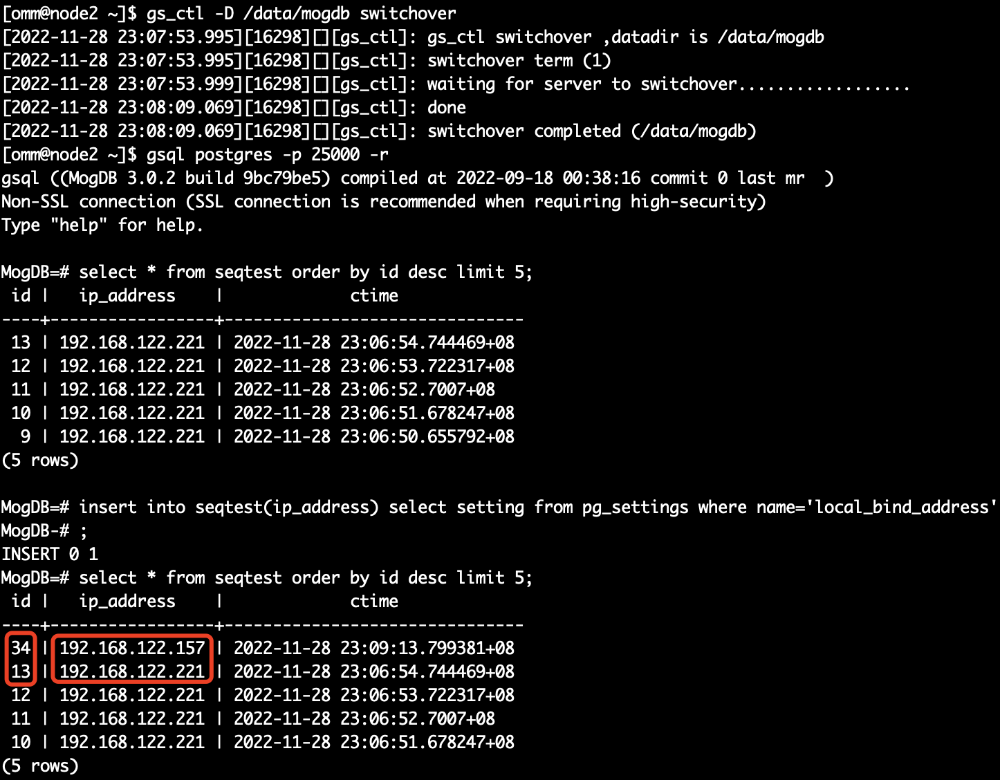
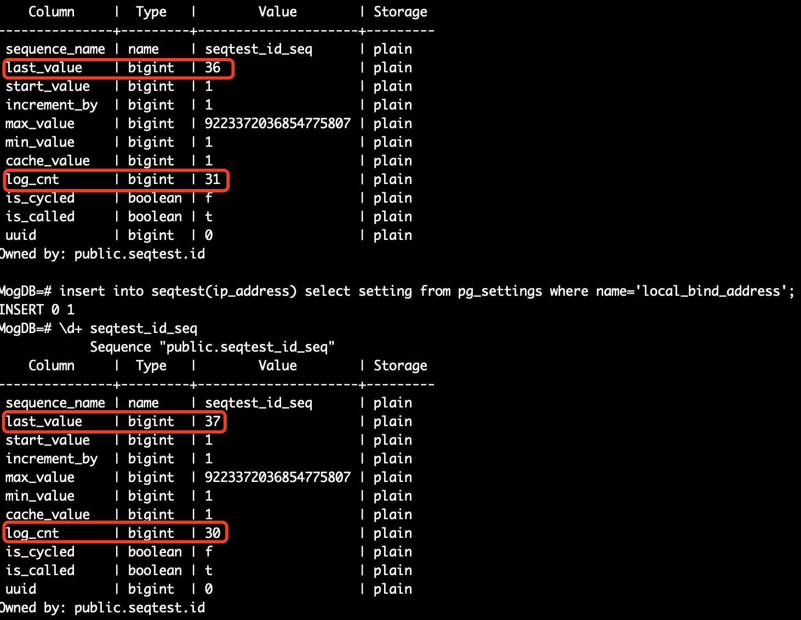
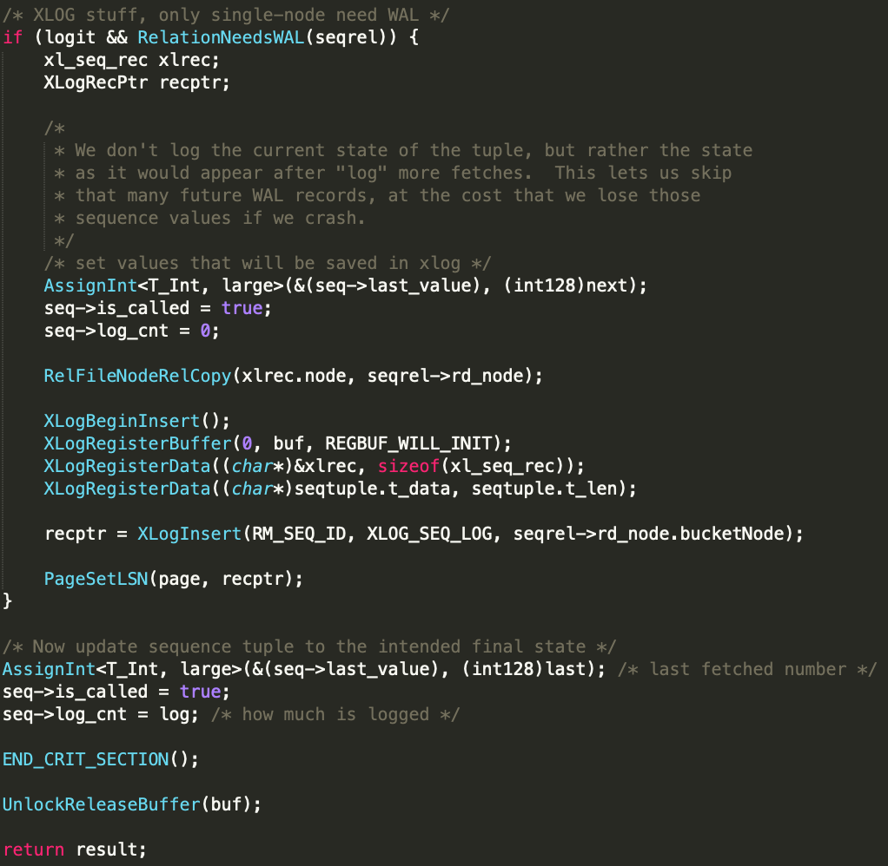
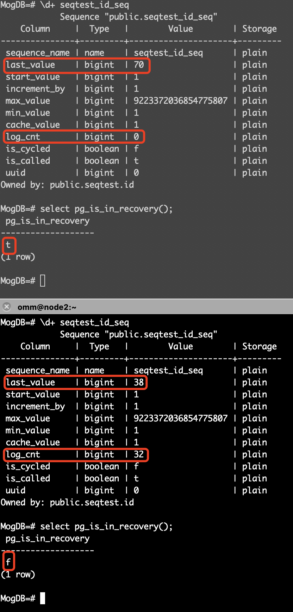

本文出处：[https://www.modb.pro/db/569272](https://www.modb.pro/db/569272)

### 背景

今天在客户现场做高可用切换测试，为了验证数据库节点角色切换后无数据丢失，我单独创建一张使用了自增 sequence 的表，通过 vip 方式访问数据库，并 1s 插入一条数据。

因为数据库本身是通过 benchmarksql 工具加压的，数据库服务器的 CPU 使用率达到 70%，所以如果这张表的序列是连续的，且切换时间与数据插入时间对的上，那就可以认定数据无丢失，但当我切换数据库角色后，神奇的现象出现了，切换时间是对的上的，但序列却是跳跃的。

### 复现

#### 准备测试表

```
MogDB=# create table seqtest(id serial,ip_address varchar(32),ctime timestamptz default now());
NOTICE:  CREATE TABLE will create implicit sequence "seqtest_id_seq" for serial column "seqtest.id"
CREATE TABLE
MogDB=# \d+ seqtest
                                                        Table "public.seqtest"
   Column   |           Type           |                      Modifiers                       | Storage  | Stats target | Description
------------+--------------------------+------------------------------------------------------+----------+--------------+-------------
 id         | integer                  | not null default nextval('seqtest_id_seq'::regclass) | plain    |              |
 ip_address | character varying(32)    |                                                      | extended |              |
 ctime      | timestamp with time zone | default now()                                        | plain    |              |
Has OIDs: no
Options: orientation=row, compression=no

MogDB=# \d+ seqtest_id_seq
            Sequence "public.seqtest_id_seq"
    Column     |  Type   |        Value        | Storage
---------------+---------+---------------------+---------
 sequence_name | name    | seqtest_id_seq      | plain
 last_value    | bigint  | 1                   | plain
 start_value   | bigint  | 1                   | plain
 increment_by  | bigint  | 1                   | plain
 max_value     | bigint  | 9223372036854775807 | plain
 min_value     | bigint  | 1                   | plain
 cache_value   | bigint  | 1                   | plain
 log_cnt       | bigint  | 0                   | plain
 is_cycled     | boolean | f                   | plain
 is_called     | boolean | f                   | plain
 uuid          | bigint  | 0                   | plain
Owned by: public.seqtest.id

MogDB=#
```

#### 准备测试脚本

这个脚本可以放到脚本里，也可以直接终端显示日志

```
while true; do gsql -h 192.168.xxx.xxx postgres -Uur -Wu@123456 -p 25000 -c "insert into seqtest(ip_address) select setting from pg_settings where name='local_bind_address'"; sleep 1s ; done
```

#### 切换测试

当我们把数据库角色切换后，会发现序列的 id 值由 13 直接跳到了 34


### 原理

#### 问题分析

当在现场出现这种情况后，想到了以下几种可能：

- 有连接再消耗序列 id，但是数据没有写入成功，因为即使事务回滚序列也不会回滚
- 序列本身有 cache，有 cache 序列不连续是正常的
- 数据库序列自身设计，需要查看源码

有了这三个方向后，开始再次进行测试，但很快前两种可能就排除了，因为在数据库切换过程中，vip 被卸载掉了，数据库不可用，不存在有连接继续消耗序列；序列本身的 cache_value = 1，所以不存在缓存的问题。

但是在查看序列结构的时候，发现了一个之前没有注意的字段：log_cnt，有意思的是随着序列值增加，这个值减少，当减少到 0 后会从 32 开始继续减少，以此循环。


那序列不连续会不会与这个 log_cnt 有关系呢？

#### 查看源码

在源码 src/gausskernel/optimizer/commands/sequence/sequence.cpp 中找到了 log_cn 的相关信息



从这段内容我们可以看到序列会给未来的 wal records 分配一些"log"，是因为每产生 32 个序列值才记一次 WAL，这相当于对序列做了全局缓存，这也是为什么 sequence 生成速度快的原因。当数据库 crash 的时候，这些"log" 会被跳过，而这些"log"的数量由 log_cn 来计数。数据库 switchover 只是切换数据库角色并没有 crash，角色切换后，最新的序列值应该是 last_value + log_cnt，那切换之前主备的当前序列值是多少呢？



原因找到了，我们知道备库是一个只读节点，不能进行数据库写入，虽然主备之间的数据保持一致，但是序列值却不一样，备库序列的 last_value 值永远等于主库的 last_value + log_cnt，这也就很好的说明为啥角色切换后序列会跳 log_cnt 了，因为这部分 buffer，备库已经提前做加法了。

### 总结

- MogDB/openGauss 的序列的 cache 不是只有 cache_value，还有 log_cn。
- 备库的序列值永远大于主库的序列值（备库 last_value = 主库 last_value + log_cnt），但备库不可进行数据写入。
