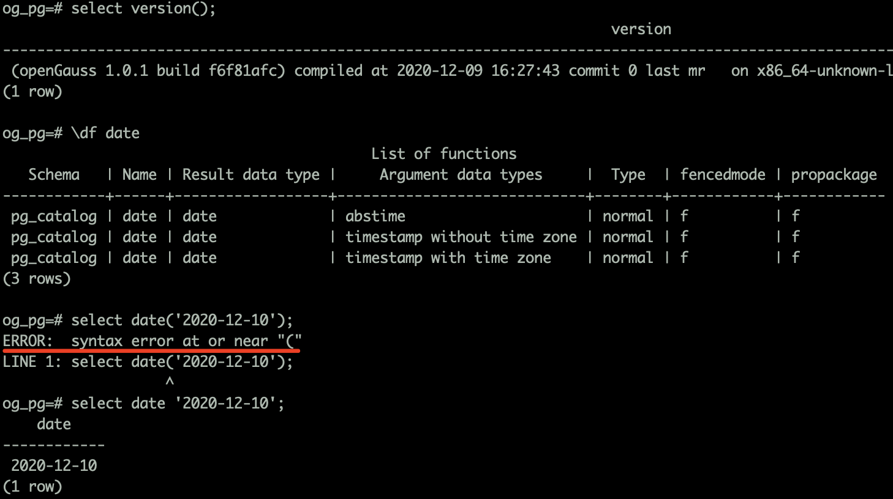
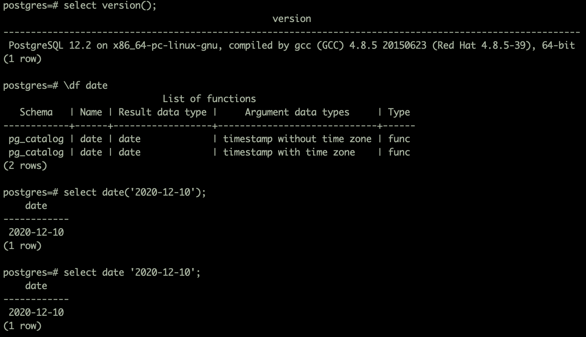
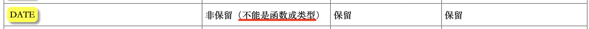

# PostgreSQL 与 openGauss 之关键字

日常数据库运维的过程中可能对数据库关键字关注点并不是很高，但在程序开发的过程中，数据库对象建模要尽可能的避开数据库关键字的使用，否则在后续开发过程中需要用到各种转译的方法来将关键字转换为普通字符，会非常的麻烦。最近在 openGauss 上执行 date 函数后报语法错误，经查询 openGauss 是支持 date 函数的，但却用不了，真对这个问题，分别在 PostgreSQL12.2 数据库和 openGauss（1.0.1）数据库进行问题复现并问题分析。

在 openGauss 执行结果如下：

在 PostgreSQL 执行 date 函数结果如下：

经调查发现是 date 关键字的问题。

在 openGauss 的关键字列表中,虽然不是保留关键字，但是不允许是函数或者类型。

在 PostgreSQL 的关键字列表中，是一个普通字符。

由此问题进行深入思考，对比 PostgreSQL 与 openGauss 数据库中哪些关键字做了差异化说明，避免在日常使用中再次遇到类似问题。

<table><thead ><tr id="row8493103115414"><th class="cellrowborder"  width="33.33333333333333%" id="mcps1.1.4.1.1">&nbsp;&nbsp;</th>
<th class="cellrowborder"  width="33.33333333333333%" id="mcps1.1.4.1.2">
PostgreSQL

</th>
<th class="cellrowborder"  width="33.33333333333333%" id="mcps1.1.4.1.3">
openGauss

</th>
</tr>
</thead>
<tbody><tr id="row0494183110547"><td class="cellrowborder"  width="33.33333333333333%" headers="mcps1.1.4.1.1 ">
DATE

</td>
<td class="cellrowborder"  width="33.33333333333333%" headers="mcps1.1.4.1.2 ">
-

</td>
<td class="cellrowborder"  width="33.33333333333333%" headers="mcps1.1.4.1.3 ">
非保留（不能是函数或类型）

</td>
</tr>
<tr id="row5495731105416"><td class="cellrowborder"  width="33.33333333333333%" headers="mcps1.1.4.1.1 ">
IS

</td>
<td class="cellrowborder"  width="33.33333333333333%" headers="mcps1.1.4.1.2 ">
reserved (can be function or type)

</td>
<td class="cellrowborder"  width="33.33333333333333%" headers="mcps1.1.4.1.3 ">
保留

</td>
</tr>
<tr id="row949573115544"><td class="cellrowborder"  width="33.33333333333333%" headers="mcps1.1.4.1.1 ">
ISNULL

</td>
<td class="cellrowborder"  width="33.33333333333333%" headers="mcps1.1.4.1.2 ">
reserved (can be function or type)

</td>
<td class="cellrowborder"  width="33.33333333333333%" headers="mcps1.1.4.1.3 ">
非保留

</td>
</tr>
<tr id="row249713317542"><td class="cellrowborder"  width="33.33333333333333%" headers="mcps1.1.4.1.1 ">
LATERAL

</td>
<td class="cellrowborder"  width="33.33333333333333%" headers="mcps1.1.4.1.2 ">
reserved

</td>
<td class="cellrowborder"  width="33.33333333333333%" headers="mcps1.1.4.1.3 ">
-

</td>
</tr>
<tr id="row249715314543"><td class="cellrowborder"  width="33.33333333333333%" headers="mcps1.1.4.1.1 ">
MAXVALUE

</td>
<td class="cellrowborder"  width="33.33333333333333%" headers="mcps1.1.4.1.2 ">
non-reserved

</td>
<td class="cellrowborder"  width="33.33333333333333%" headers="mcps1.1.4.1.3 ">
保留

</td>
</tr>
<tr id="row14498231145413"><td class="cellrowborder"  width="33.33333333333333%" headers="mcps1.1.4.1.1 ">
NUMBER

</td>
<td class="cellrowborder"  width="33.33333333333333%" headers="mcps1.1.4.1.2 ">
-

</td>
<td class="cellrowborder"  width="33.33333333333333%" headers="mcps1.1.4.1.3 ">
非保留（不能是函数或类型）

</td>
</tr>
<tr id="row4498133117544"><td class="cellrowborder"  width="33.33333333333333%" headers="mcps1.1.4.1.1 ">
PROCEDURE

</td>
<td class="cellrowborder"  width="33.33333333333333%" headers="mcps1.1.4.1.2 ">
non-reserved

</td>
<td class="cellrowborder"  width="33.33333333333333%" headers="mcps1.1.4.1.3 ">
保留

</td>
</tr>
<tr id="row1430554415416"><td class="cellrowborder"  width="33.33333333333333%" headers="mcps1.1.4.1.1 ">
TABLESAMPLE

</td>
<td class="cellrowborder"  width="33.33333333333333%" headers="mcps1.1.4.1.2 ">
reserved (can be function or type)

</td>
<td class="cellrowborder"  width="33.33333333333333%" headers="mcps1.1.4.1.3 ">
-

</td>
</tr>
<tr id="row153071444185415"><td class="cellrowborder"  width="33.33333333333333%" headers="mcps1.1.4.1.1 ">
XMLNAMESPACES

</td>
<td class="cellrowborder"  width="33.33333333333333%" headers="mcps1.1.4.1.2 ">
non-reserved (cannot be function or type)

</td>
<td class="cellrowborder"  width="33.33333333333333%" headers="mcps1.1.4.1.3 ">
-

</td>
</tr>
<tr id="row13072443542"><td class="cellrowborder"  width="33.33333333333333%" headers="mcps1.1.4.1.1 ">
XMLTABLE

</td>
<td class="cellrowborder"  width="33.33333333333333%" headers="mcps1.1.4.1.2 ">
non-reserved (cannot be function or type)

</td>
<td class="cellrowborder"  width="33.33333333333333%" headers="mcps1.1.4.1.3 ">
-

</td>
</tr>
</tbody>
</table>

通过对比两个数据库的保留关键字，在 openGauss 中"date"和"number" 虽然不是保留关键字，但是不可用于函数或类型操作，"isnull"和"LATERAL"变为非保留关键字，"maxvalue"和"procedure"变为保留关键字，“TABLESAMPLE”、“XMLNAMESPACES"及"XMLTABLE”不再做限制。
