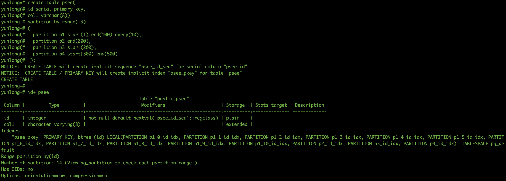
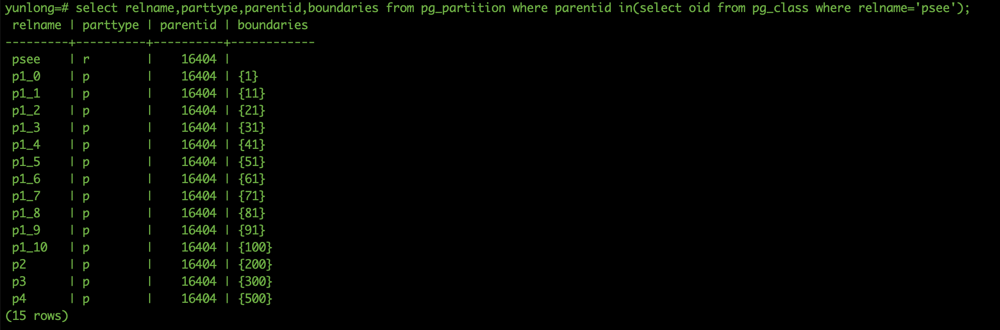
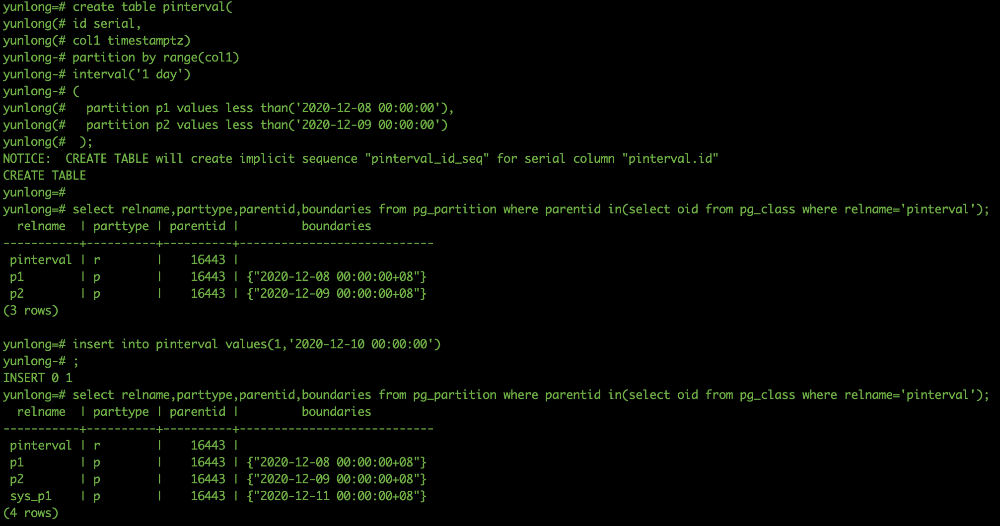
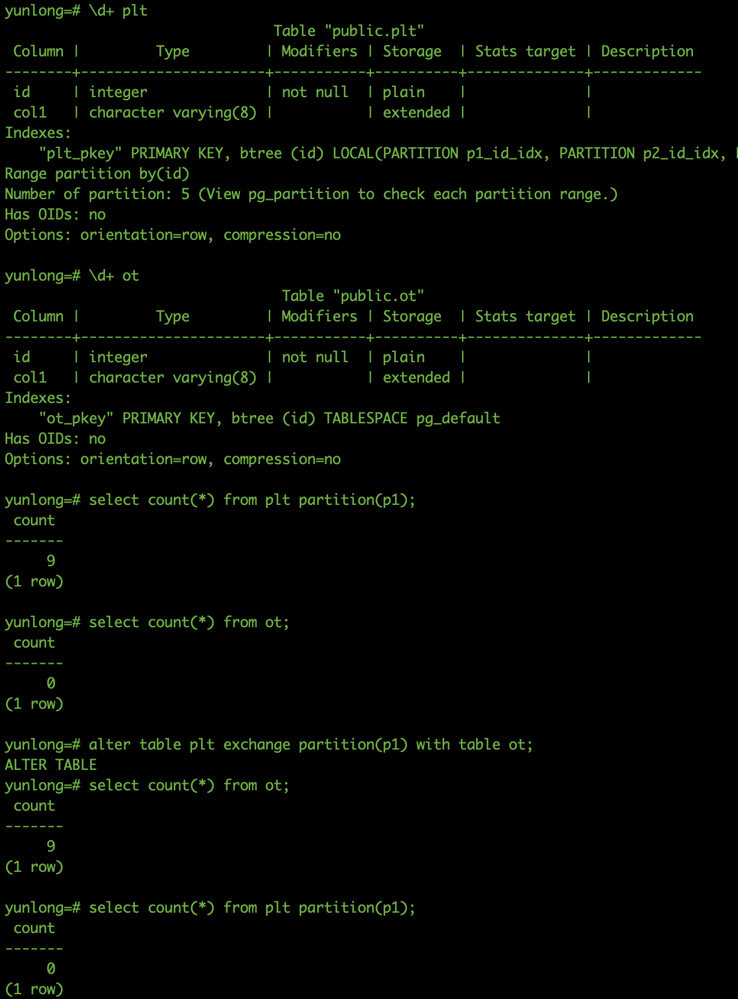

# openGauss 分区表<a name="ZH-CN_TOPIC_0000001071348602"></a>

## 概述<a name="section62442111132"></a>

openGauss 是基于 PostgreSQL9.2.4 的内核开发的，在 PostgreSQL10 之前要达到实现分区表的效果可以有两种方式，一种是使用继承的触发器函数来实现，一种是安装 pg_pathman 的插件来实现，直到 PostgreSQL10 才引入了 partition 的语法；而 opengauss 从开源发布就可以直接使用 partition 的方式来创建分区表，行存表支持范围分区和间隔分区，列存表支持范围分区。

PostgreSQL 分区表历程：

- 10.0 之前：通过 inherit 方式 或 插件 来实现 10.0 添加 partition 语法，支持范围和列表分区。
- 11.0 增加了 default 分区，支持 hash 分区，支持并行创建分区索引。
- 12.0 分区表功能增强，如：提高 insert 和 copy 操作，ATTACH PARTITION 操作不阻塞 query，增加/dP 命令查看分区，pg_indexes 查看分区索引等。
- 13.0 支持 row_level 触发器，支持分区表的逻辑订阅发布。

## 分区限制及特点<a name="section1269814253153"></a>

**PostgreSQL（12）**

1.  主键约束或唯一约束必须要包含分区字段。
2.  支持范围分区、列表分区、hash 分区，支持多级分区。
3.  可通过 ATTACH PARTITION 和 DETACH PARTITION 命令来挂载和卸载分区。
4.  增加 default 分区预防超过分区范围的数据插入报错。
5.  可以直接去查询某个分区表的数据。
6.  分区表的 CHECK 约束和 NOT NULL 约束总是会被其所有的分区所继承。
7.  只要分区表中不存在分区，则支持使用 ONLY 仅在分区表上增加或者删除约束。
8.  分区不能有在父表中不存在的列
9.  分区也可以是外部表，不过它们有一些普通表没有的限制。

**openGauss**

1.  主键约束或唯一约束必须要包含分区字段。
2.  分区表表名只能在 pg_partition 视图中查看，在 pg_tables 和 pg_stat_all_tables 中无法查到。
3.  分区表索引在 opengauss 里分 local 和 global，默认是 global。
4.  分区个数不能超过 32767。
5.  选择分区使用 PARTITION FOR\(\)，括号里指定值个数应该与定义分区时使用的列个数相同，并且一一对应。
6.  Value 分区表不支持相应的 Alter Partition 操作。
7.  列存分区表不支持切割分区
8.  间隔分区表不支持添加分区。

## 操作<a name="section34912691911"></a>

**创建分区表**

语法：PARTITION BY RANGE\(partition_key\)

从句是 VALUE LESS THAN 的语法格式，范围分区策略的分区键最多支持 4 列。

```
PARTITION partition_name VALUES LESS THAN ( { partition_value | MAXVALUE } )
· 每个分区都需要指定一个上边界。
· 分区上边界的类型应当和分区键的类型一致。
· 分区列表是按照分区上边界升序排列的，值较小的分区位于值较大的分区之前。
yunlong=# create table plt(
yunlong(# id serial primary key,
yunlong(# col1 varchar(8))
yunlong-# partition by range(id)
yunlong-# (
yunlong(#   partition p1 values less than(10),
yunlong(#   partition p2 values less than(20),
yunlong(#   partition p3 values less than(30),
yunlong(#   partition p4 values less than(maxvalue)
yunlong(#  );
NOTICE:  CREATE TABLE will create implicit sequence "plt_id_seq" for serial column "plt.id"
NOTICE:  CREATE TABLE / PRIMARY KEY will create implicit index "plt_pkey" for table "plt"
CREATE TABLE
```


从句是 START END 的语法格式，范围分区策略的分区键仅支持 1 列。

```
PARTITION partition_name {START (partition_value) END (partition_value) EVERY (interval_value)} | {START (partition_value) END (partition_value|MAXVALUE)} | {START(partition_value)} | {END (partition_value | MAXVALUE)}
· 在创建分区表若第一个分区定义含START值，则范围（MINVALUE，START）将自动作为实际的第一个分区。
· START END语法需要遵循以下限制：
·· 每个partition_start_end_item中的START值（如果有的话，下同）必须小于其END值；
·· 相邻的两个partition_start_end_item，第一个的END值必须等于第二个的START值；
·· 每个partition_start_end_item中的EVERY值必须是正向递增的，且必须小于（END-START）值；
·· 每个分区包含起始值，不包含终点值，即形如：[起始值，终点值)，起始值是MINVALUE时则不包含；
·· 一个partition_start_end_item创建的每个分区所属的TABLESPACE一样；
·· partition_name作为分区名称前缀时，其长度不要超过57字节，超过时自动截断；
·· 在创建、修改分区表时请注意分区表的分区总数不可超过最大限制（32767）；
· 在创建分区表时START END与LESS THAN语法不可混合使用。
· 即使创建分区表时使用START END语法，备份（gs_dump）出的SQL语句也是VALUES LESS THAN语法格式。
 . end分区不能紧接着单一start分区，否则会报错
yunlong=# create table psee(
yunlong(# id serial primary key,
yunlong(# col1 varchar(8))
yunlong-# partition by range(id)
yunlong-# (
yunlong(#   partition p1 start(1) end(100) every(10),
yunlong(#   partition p2 start(100),
yunlong(#   partition p3 end(200),
yunlong(#   partition p4 start(200) end(300)
yunlong(#  );
NOTICE:  CREATE TABLE will create implicit sequence "psee_id_seq" for serial column "psee.id"
ERROR:  partition "p3" is an invalid definition clause.
HINT:  Do not use a single END after a single START.

yunlong=# create table psee(
yunlong(# id serial primary key,
yunlong(# col1 varchar(8))
yunlong-# partition by range(id)
yunlong-# (
yunlong(#   partition p1 start(1) end(100) every(10),
yunlong(#   partition p2 end(200),
yunlong(#   partition p3 start(200),
yunlong(#   partition p4 start(300) end(500)
yunlong(#  );
NOTICE:  CREATE TABLE will create implicit sequence "psee_id_seq" for serial column "psee.id"
NOTICE:  CREATE TABLE / PRIMARY KEY will create implicit index "psee_pkey" for table "psee"
CREATE TABLE
```





从句指定了 INTERVAL 子句的语法格式，范围分区策略的分区键仅支持 1 列。

```
INTERVAL ('interval_expr') [ STORE IN (tablespace_name [, ... ] ) ]
· 列存表不支持间隔分区
· interval_expr：自动创建分区的间隔，例如：1 day、1 month。
· STORE IN (tablespace_name [, ... ] )：指定存放自动创建分区的表空间列表，如果有指定，则自动创建的分区从表空间列表中循环选择使用，否则使用分区表默认的表空间。

yunlong=# create table pinterval(
yunlong(# id serial,
yunlong(# col1 timestamptz)
yunlong-# partition by range(col1)
yunlong-# interval('1 day')
yunlong-# (
yunlong(#   partition p1 values less than('2020-12-08 00:00:00'),
yunlong(#   partition p2 values less than('2020-12-09 00:00:00')
yunlong(#  );
NOTICE:  CREATE TABLE will create implicit sequence "pinterval_id_seq" for serial column "pinterval.id"
CREATE TABLE
```



**删除分区**

alter table plt drop partition p4;


**添加分区**

alter table plt add partition p4 values less than\(50\),add partition p5 values less than\(maxvalue\);


**数据转移**

进行交换的普通表和分区必须满足如下条件：

- 普通表和分区的列数目相同，对应列的信息严格一致，包括：列名、列的数据类型、列约束、列的 Collation 信息、列的存储参数、列的压缩信息等。
- 普通表和分区的表压缩信息严格一致。
- 普通表和分区的分布列信息严格一致。
- 普通表和分区的索引个数相同，且对应索引的信息严格一致。
- 普通表和分区的表约束个数相同，且对应表约束的信息严格一致。
- 普通表不可以是临时表。




**查询分区**

查看子分区

```
select relname,parttype,parentid,boundaries from pg_partition where parentid in(select oid from pg_class where relname='xxx');
```

查看单独分区内的数据

```
select * from relname partition(partition_name);
```
