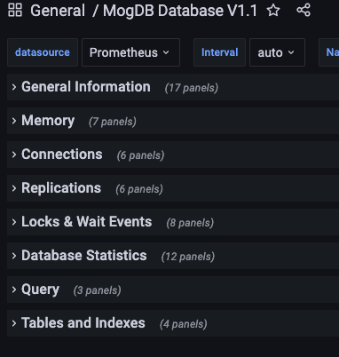
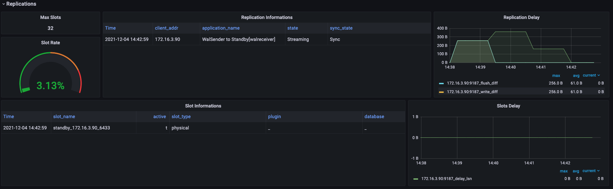
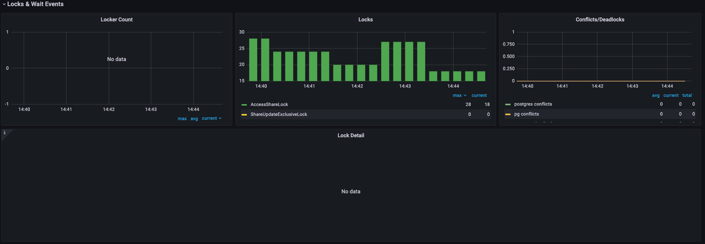
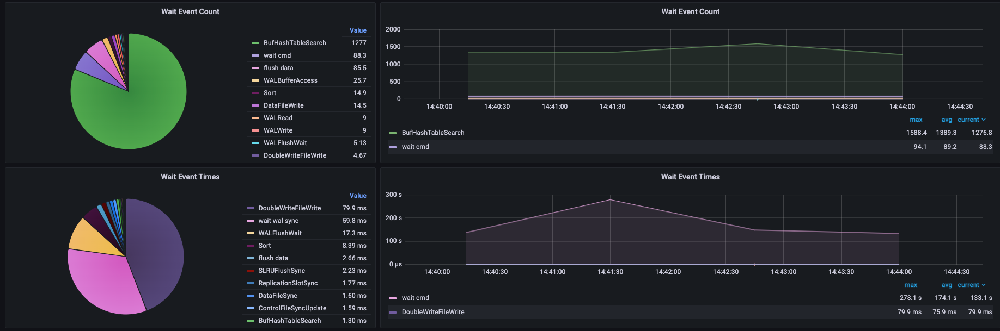

# 配置 MogDB/openGauss 的 grafana 的 dashboard

本文出处：[https://www.modb.pro/db/188684](https://www.modb.pro/db/188684)

### 概述

我们已经介绍了[prometheus + grafana + opengauss_exporter](https://www.modb.pro/db/173483)完成对 MogDB/openGauss 数据库的监控,但这只是第一步，我们还需要通过 grafana 的 dashboard 查看各个关注的指标项，本文主要介绍 dashboard 的配置

### 监控指标汇总

数据源选择的是 prometheus，主要关注的监控指标分为：基础信息、内存信息、连接信息、复制信息、锁及等待事件、统计信息、query 信息以及数据库对象

#### 基础信息

基础信息是运维人员比较关注的，有变化第一时间可以看到的信息，比如实例 IP、数据库版本、数据库运行时间、exporter 状态、exporter 运行时间等等

#### 内存信息

展示数据库内存总体使用情况，按会话状态分组占用内存情况，内存上下文占用内存情况以及占用内存最多的 session 及 sql 文本

#### 连接信息

连接数总体使用情况，各状态连接使用情况以及各应用连接数

#### 复制信息

复制槽使用占比、复制槽延时、备节点信息及主备之间的延迟

#### 锁及等待事件

锁阻塞源信息，锁阻塞详情，锁类型分布情况，锁冲突及死锁检测，等待事件汇总及等待时间汇总信息

#### 统计信息

#### query 信息

#### 数据库对象

### json 文件下载地址

[exporter 监控单数据库实例](https://www.modb.pro/download/272899)
[exporter 监控多数据库实例](https://www.modb.pro/download/293587)
