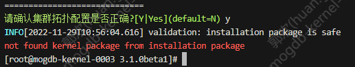
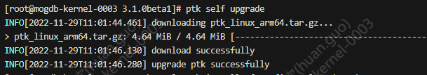
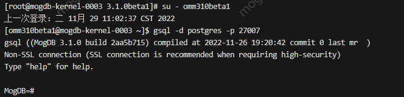

# PTK 安装 MogDB 3.1 过程和报错解决方法

安装系统：openEuler arm64

1.将安装包 MogDB-3.1.0-openEuler-arm64.tar.gz 上传至/opt/3.1.0beta1 2.编辑配置文件

```
#config.yaml
global:
  cluster_name: mogdb310beta1
  user: omm310beta1
  group: omm310beta1
  base_dir: /opt/mogdb3.1.0beta1
db_servers:
  - host: 127.0.0.1
    db_port: 27007
```

3.进行系统检查

```
ptk checkos -f config.yaml
```

4.执行安装

```
ptk install -f config.yaml --pkg ./MogDB-3.1.0-openEuler-arm64.tar.gz
```

**此时遇到以下报错：**


**报错原因**：经过咨询，报错是因为 ptk 版本太低，MogDB 3.1 包目录结构有所变化。
**解决办法**：升级 ptk 到 0.5 以上

```
ptk self upgrade
```



ptk 升级成功后，再次执行 ptk install 命令进行安装即可。安装结束后即可登录 MogDB 3.1.0 体验 beta 版功能。



更多信息请参考以下页面：[https://docs.mogdb.io/zh/ptk/v0.5/quick-start](https://docs.mogdb.io/zh/ptk/v0.5/quick-start)
