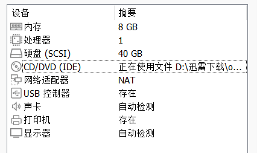
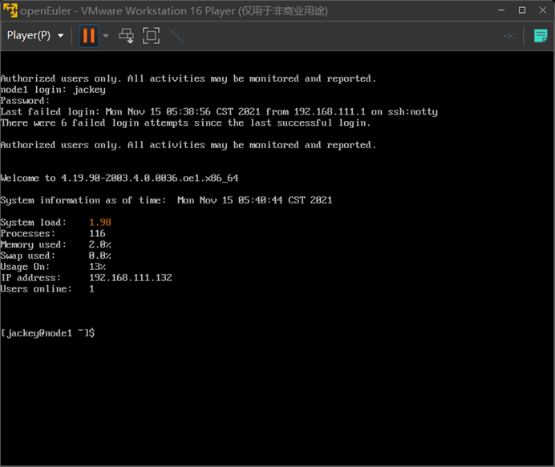
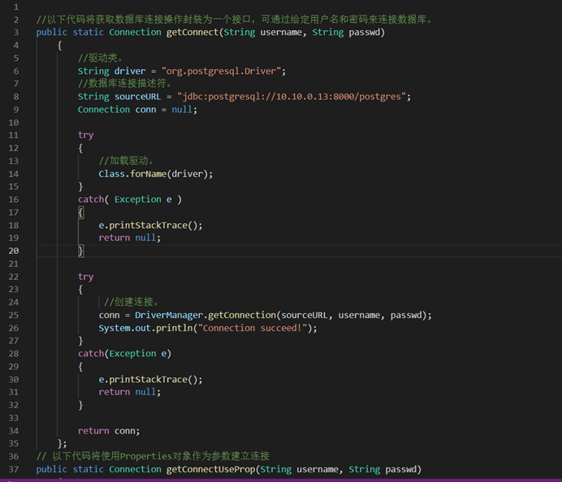
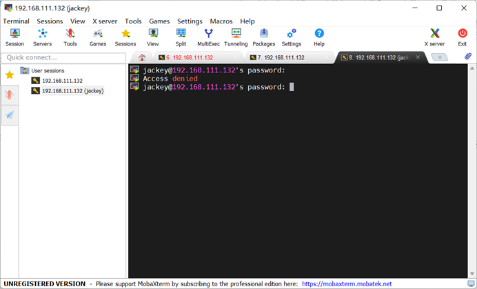

# 开源数据库 OpenGauss 的安装和运行

## 安装环境

### OpenGauss 版本

openGauss-2.1.0-openEuler-64bit
下载地址：

```
https://opengauss.obs.cn-south-1.myhuaweicloud.com/2.0.1/x86/openGauss-2.1.0-openEuler-64bit.tar.bz2

```

### 虚拟机信息

虚拟机软件：VMware Workstation 16 Player
虚拟机软件版本：16.1.2 build-17966106
虚拟机配置信息：内存 8GB、处理器 1 核、硬盘 40GB



### 操作系统信息

openEuler-20.03-LTS
下载链接：

```
https://mirror.iscas.ac.cn/openeuler/openEuler-20.03-LTS/ISO/x86_64/openEuler-20.03-LTS-x86_64-dvd.iso

```

## 安装详细步骤

首先需要说明，这一块儿大部分都没有截图，因为安装 OpenGauss 已经是很久以前的事情了，下面有的截图也只是后面补截取的。

### 虚拟机准备

本次实验我选择了 VMware Workstation 16 Player 软件搭建虚拟机，在虚拟机器的准备中，和一般部署虚拟机的操作没有什么区别，资源设定如下：
内存 8GB
硬盘 40GB
处理器内核数量 1 个

### 安装 openEuler

这里也就是下载好 openeuler 的完整镜像之后在 VM 中正常安装即可，安装过程中是有详细的引导的，需要自行操作基本只有分区设置（自动分区）和地区设置，以及用户和密码的设置。
安装完成后以预设用户登录即可。
需要说明的是，我选择了使用无图形界面的 openEuler，并通过 SSH 连接的方式在 MobaXterm 软件中对服务器（也就是部署好 openEuler 的虚拟机）进行操作。



### 系统环境配置

1. **关闭防火墙**

```
[root@node1 ~]# systemctl disable firewalld.service
[root@node1 ~]# systemctl stop firewalld.service
```

2. **关闭 selinux**

```
[root@node1 ~]# sed -i 's/SELINUX=enforcing/SELINUX=disabled/g' /etc/selinux/config
```

3. **设置字符集**

```
[root@node1 ~]#cat >> /etc/profile <<EOF
export LANG=en_US.UTF-8
EOF
```

4. **修改地区和时区**

```
[root@node1 ~]# cp /etc/share/zoneinfo/Asia/Shanghai /etc/localtime
```

5. **关闭交换内存**

```
[root@node1 ~]# swapoff -a
```

6. **设置网卡 MTU 值**
   推荐值是 8192 虚拟机环境是 1500 可以不修改

```
[root@node1 ~]# ifconfig | grep ens33
   ens33: flags=4163<UP,BROADCAST,RUNNING,MULTICAST> mtu 1500
```

7. **设置 root 为远程用户**
   去掉 sshd_config 文件（这个文件是关于 ssh 链接的配置）中 PermitRootLogin 的注释符#并把 no 改为 yes

```
[root@node1 ~]# vim /etc/ssh/sshd_config
   PermitRootLogin yes
```

8. **操作系统参数设置**

```
[root@node1 ~]# cat >> /etc/sysctl.conf <<EOF
   net.ipv4.tcp_retrises1=5
   net.ipv4.tcp_syn_retries=5
   net.sctp.path_max_retrans=10
   net.sctp.max_init_retransmits=10
EOF
[root@node1 ~]# echo "* soft nofile 1000000" >> /etc/security/limits.conf
[root@node1 ~]# echo "* hard nofile 1000000" >> /etc/security/limits.conf
[root@node1 ~]# echo "* soft nprc 60000" >> /etc/security/limits.d/90-nproc.conf
```

9. **修改主机名**

```
[root@node1 ~]# echo "node1" > /etc/hostname
[root@node1 ~]# echo "192.168.111.132 node1" >>/etc/hosts
```

10. **重启**

```
[root@node1 ~]# reboot
```

### 安装 openGauss

1. **创建配置文件**

```
[root@node1 ~]# vim /opt/clusterconfig.xml
```

以下为预先编辑好的配置文件内容，我通过 WinSCP 直接进行了修改和覆盖（最开始做实验的时候是 XShell 配合着 WinSCP 用的）。


 2. **下载安装包（1.0.0 版本）**

下载地址

```
https://opengauss.obs.cn-south-1.myhuaweicloud.com/2.0.1/x86/openGauss-2.1.0-openEuler-64bit.tar.bz2
```

下载完之后提前传到虚拟机中并记录好路径。 3. **创建用户组和目录**

```
[root@node1 ~]# groupadd dbgrp
[root@node1 ~]# useradd -g dbgrp -d /home/omm -m -s /bin/bash omm
[root@node1 ~]# echo "omm" | passwd --stdin omm
[root@node1 ~]# mkdir -p /opt/software/openGauss
[root@node1 ~]# chmod 755 -R /opt/software
[root@node1 ~]# chown -R omm:dbgrp /opt/software/openGauss
```

4. **解压安装包到指定目录**

```
[root@node1 ~]# tar -xvf /mnt/hgfs/share/ openGauss-2.1.0-openEuler-64bit.tar.bz2 /opt/software/openGauss
```

5. **设置 lib 库**

```
[root@node1 ~]# vim /etc/profile
   export LD_LIBRARY_PATH=/opt/software/openGauss/script/gspylib/clib:$LD_LIBRARY_PATH
```

6. **预安装**

```
[root@node1 ~]# cd /opt/software/script
[root@node1 ~]# python3 gs_preinstall -U omm -G dbgrp -X /opt/clusterconfig.xml
```

之后初始化过程中需要进行交互，具体而言：
遇到[yes/no]，就选 yes；
让输入 root 密码，就输入 root 密码；
让输入 omm 密码，就输入 omm 密码。
Ps：如果在预安装失败 就执行 gs_checkos -i A -h node1 --detail 命令 查看失败原因 7. **安装 openGauss**

```
[root@node1 ~]# su - omm
[omm@node1 ~]# gs_install -X /opt/clusterconfig.xml
```

执行的时候需要设置初始密码，复杂度要求和 openEuler 系统一样比较高，要至少三种字符和最少 8 个字符。 8. **重启数据库**

```
[root@node1 ~]# su - omm
[omm@node1 ~]# gs_ctl start -D "/opt/huawei/install/data/db1"
```

9. **登录数据库**

```
[root@node1 ~]# gsql -d postgres -p 26000
```

### 基本数据库操作验证

1. **启停数据库**

```
[root@node1 ~]#gs_ctl start -D /opt/huawei/install/data/db1/
[root@node1 ~]#gs_ctl stop -D /opt/huawei/install/data/db1/
```

2. **切换 omm 系统用户登录数据库**

```
[root@node1 ~]#gs_guc set -N all -I all -h "host all jack 192.168.111.132/32 sha256"
[root@node1 ~]#gsql -d postgres -p 26000
```

3. **创建用户并赋予用户管理权限**

   i. 创建用户 jack 并设置密码为 jack@123

   ```
   [root@node1 ~]#create user jackey identified by '123321jackey.';
   ```

   ii. 默认用户没有创建数据库表权限需要修改其权限

   ```
   [root@node1 ~]#ALTER ROLE gaussadmin SYSADMIN;
   ```

### 通过 JDBC 执行 SQL

1. **JDBC 包与驱动类**

   在 linux 服务器端源代码目录下执行 build.sh，获得驱动 jar 包 postgresql.jar，包位置在源代码目录下。从发布包中获取，包名为 openGauss-x.x.x-操作系统版本号-64bit-Jdbc.tar.gz。

   驱动包与 PostgreSQL 保持兼容，其中类名、类结构与 PostgreSQL 驱动完全一致，曾经运行于 PostgreSQL 的应用程序可以直接移植到当前系统使用。

   就驱动类而言，在创建数据库连接之前，需要加载数据库驱动类“org.postgresql.Driver”。

2. **加载驱动**

   在创建数据库连接之前，需要先加载数据库驱动程序。加载驱动有两种方法：

   i. 在代码中创建连接之前任意位置隐含装载：Class.forName(“org.postgresql.Driver”);
   ii. 在 JVM 启动时参数传递：java -Djdbc.drivers=org.postgresql.Driver jdbctest

3. **连接数据库**

   在创建数据库连接之后，才能使用它来执行 SQL 语句操作数据。JDBC 提供了三个方法，用于创建数据库连接。

   i. DriverManager.getConnection(String url);
   ii. DriverManager.getConnection(String url, Properties info);
   iii. DriverManager.getConnection(String url, String user, String password);

4. **示例：基于 openGauss 提供的 JDBC 接口连接数据库。**

   
   

## 遇到的问题和解决办法

1. **通过 SSH 连接虚拟机进行操作时提示 access denied 无法成功连接**

   

   这个问题很早就出现过，我最开始考虑的自然是密码输错了，后来查阅资料发现是前面提到过的 sshd_config 文件的配置有问题，主要是这几个点：

   UsePAM yes #需要打开
   PasswordAuthentication yes #需要打开
   ChallengeResponseAuthentication no #需要打开

   在修改之后自然也就得到了解决，能够顺利进行下去。

   但是值得一说的是，最近写报告的时候想着要截图放报告里，结果发现又连接不上了，还是同样的 SSH 访问提示 access denied 拒绝访问，我首先就检查了/etc/ssh/sshd_config 文件，发现 UsePAM yes 变成了 UsePAM no，据网上的说法是和修改过系统密码有关，总之我是把 no 又改回了 yes，但是这次却无法解决问题，直到目前我也无法重新通过 SSH 连上虚拟机。

2. **用户组部署出错**

   如前面所说，数据库安装完成后，默认生成名称为 postgres 的数据库。第一次连接数据库时，通过 gsql -d postgres -p 26000 命令（其中 postgres 为需要连接的数据库名称，26000 为数据库主节点的端口号，即 XML 配置文件中的 dataPortBase 的值）就可以连接到此数据库。

   如果成功连接则会显示类似如下的信息。

```
gsql ((openGauss x.x.x build 290d125f) compiled at 2021-03-08 02:59:43 commit 2143 last mr 131
Non-SSL connection (SSL connection is recommended when requiring high-security)
Type "help" for help.
```

但我当时多次尝试后其实并没有成功，所以我参考了 opengauss 松鼠会的技术人员撰写的安装脚本，对照着修改了用户组部署那一部分的内容，最后问题得到了解决，能够正常安装完成并得到上述信息验证。

## References & Thanks

<https://developer.huaweicloud.com/hero/forum.php?mod=viewthread&tid=121436>;
<https://opengauss.org/zh/docs/2.1.0/docs/installation/installation.html>.
