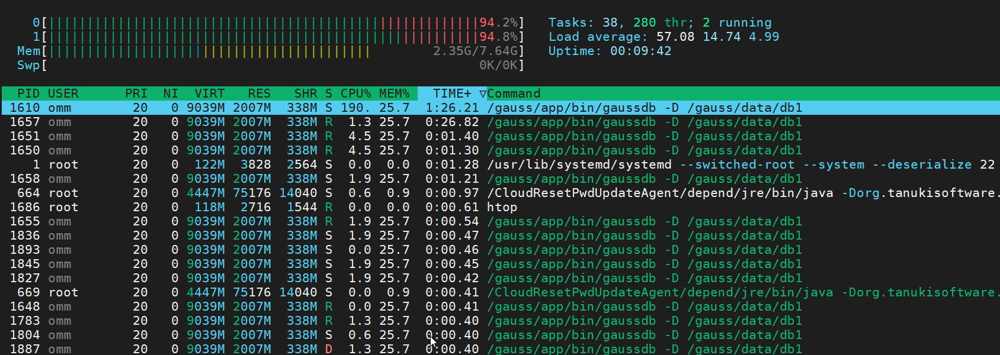
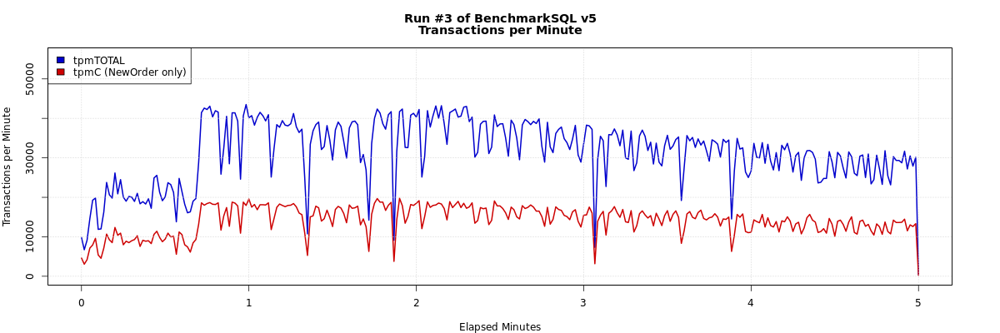
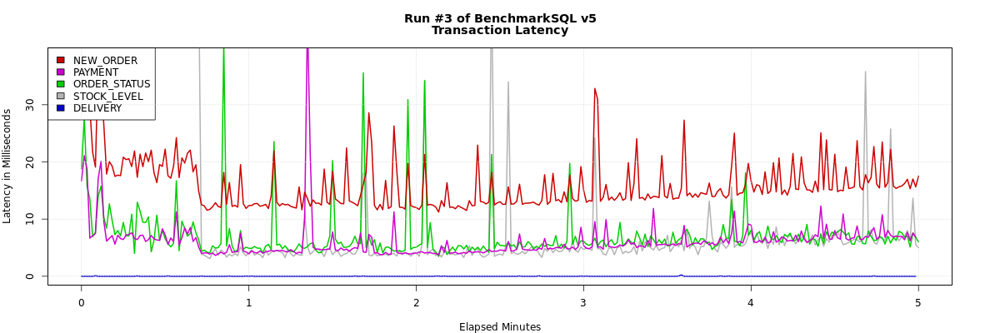
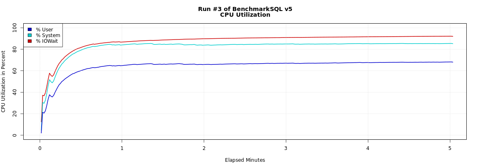
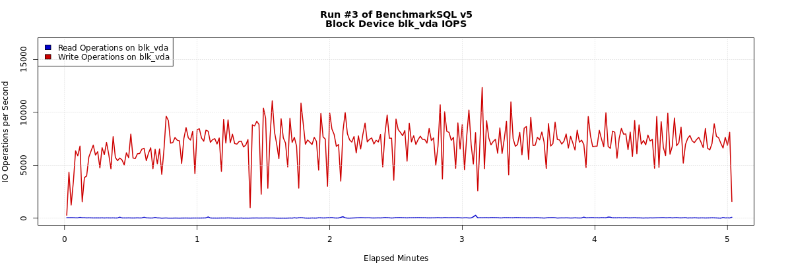

# BenchmarkSQL 性能测试<a name="ZH-CN_TOPIC_0000001085018737"></a>

**实验环境**

<a name="table890665312403"></a>

<table><thead ><tr id="row3907195364017"><th class="cellrowborder"  width="33.33333333333333%" id="mcps1.1.4.1.1">&nbsp;&nbsp;</th>
<th class="cellrowborder"  width="33.33333333333333%" id="mcps1.1.4.1.2"><p id="p39072532406"><a name="p39072532406"></a><a name="p39072532406"></a>描述</p>
</th>
<th class="cellrowborder"  width="33.33333333333333%" id="mcps1.1.4.1.3"><p id="p390718532403"><a name="p390718532403"></a><a name="p390718532403"></a>备注</p>
</th>
</tr>
</thead>
<tbody><tr id="row1890745364016"><td class="cellrowborder"  width="33.33333333333333%" headers="mcps1.1.4.1.1 "><p id="p1290812531401"><a name="p1290812531401"></a><a name="p1290812531401"></a><strong id="b175933220427"><a name="b175933220427"></a><a name="b175933220427"></a>操作系统</strong></p>
</td>
<td class="cellrowborder"  width="33.33333333333333%" headers="mcps1.1.4.1.2 "><p id="p19908953174014"><a name="p19908953174014"></a><a name="p19908953174014"></a>CentOS 7.6</p>
</td>
<td class="cellrowborder"  width="33.33333333333333%" headers="mcps1.1.4.1.3 "><p id="p20908453154016"><a name="p20908453154016"></a><a name="p20908453154016"></a>-</p>
</td>
</tr>
<tr id="row590835310407"><td class="cellrowborder"  width="33.33333333333333%" headers="mcps1.1.4.1.1 "><p id="p13908953194011"><a name="p13908953194011"></a><a name="p13908953194011"></a><strong id="b193721644215"><a name="b193721644215"></a><a name="b193721644215"></a>openGauss版本</strong></p>
</td>
<td class="cellrowborder"  width="33.33333333333333%" headers="mcps1.1.4.1.2 "><p id="p190895317406"><a name="p190895317406"></a><a name="p190895317406"></a>1.1.0</p>
</td>
<td class="cellrowborder"  width="33.33333333333333%" headers="mcps1.1.4.1.3 "><p id="p29094534404"><a name="p29094534404"></a><a name="p29094534404"></a>-</p>
</td>
</tr>
<tr id="row1790919537407"><td class="cellrowborder"  width="33.33333333333333%" headers="mcps1.1.4.1.1 "><p id="p0909195317403"><a name="p0909195317403"></a><a name="p0909195317403"></a><strong id="b14800183115429"><a name="b14800183115429"></a><a name="b14800183115429"></a>BenchmarkSQL主机</strong></p>
</td>
<td class="cellrowborder"  width="33.33333333333333%" headers="mcps1.1.4.1.2 "><p id="p090965319402"><a name="p090965319402"></a><a name="p090965319402"></a>1c/4G/40GB</p>
</td>
<td class="cellrowborder"  width="33.33333333333333%" headers="mcps1.1.4.1.3 "><p id="p1290915312406"><a name="p1290915312406"></a><a name="p1290915312406"></a>192.168.0.10 (华为云ECS服务器)</p>
</td>
</tr>
<tr id="row590935319406"><td class="cellrowborder"  width="33.33333333333333%" headers="mcps1.1.4.1.1 "><p id="p19909185374015"><a name="p19909185374015"></a><a name="p19909185374015"></a><strong id="b39134311427"><a name="b39134311427"></a><a name="b39134311427"></a>openGauss DB主机</strong></p>
</td>
<td class="cellrowborder"  width="33.33333333333333%" headers="mcps1.1.4.1.2 "><p id="p7910135318409"><a name="p7910135318409"></a><a name="p7910135318409"></a>2c/8G/40GB</p>
</td>
<td class="cellrowborder"  width="33.33333333333333%" headers="mcps1.1.4.1.3 "><p id="p5910105374014"><a name="p5910105374014"></a><a name="p5910105374014"></a>192.168.0.11 (华为云ECS服务器||未做任何调优)</p>
</td>
</tr>
</tbody>
</table>

**TPC-C 标准测试模拟了 5 种事务处理**

**1．新订单（New-Order）**

事务内容：对于任意一个客户端,从固定的仓库随机选取 5-15 件商品,创建新订单.其中 1%的订单要由假想的用户操作失败而回滚。

主要特点：中量级、读写频繁、要求响应快。

**2．支付操作\(Payment\)**

事务内容：对于任意一个客户端,从固定的仓库随机选取一个辖区及其内用户,采用随机的金额支付一笔订单,并作相应历史纪录。

主要特点：轻量级，读写频繁，要求响应快。

**3．订单状态查询\(Order-Status\)**

事务内容：对于任意一个客户端,从固定的仓库随机选取一个辖区及其内用户,读取其最后一条订单,显示订单内每件商品的状态。

主要特点：中量级，只读频率低，要求响应快。

**4．发货\(Delivery\)**

事务内容：对于任意一个客户端,随机选取一个发货包,更新被处理订单的用户余额,并把该订单从新订单中删除。

主要特点：1-10 个批量，读写频率低，较宽松的响应时间。

**5．库存状态查询\(Stock-Level\)**

事务内容：对于任意一个客户端,从固定的仓库和辖区随机选取最后 20 条订单,查看订单中所有的货物的库存,计算并显示所有库存低于随机生成域值的商品数量。

主要特点：重量级,只读频率低,较宽松的响应时间。

**E-R 模型**


**每个 Warehouse 数据量约为：76823.04KB**

**TPC-C 测试指标**

TPC-C 测试的结果主要有两个指标，即流量指标（Throughput,简称 tpmC\)和性价比（Price/Performance,简称 Price/tpmC\)。

- **流量指标\(Throughput,简称 tpmC\)：** 按照 TPC 组织的定义，流量指标描述了系统在执行支付操作、订单状态查询、发货和库存状态查询这 4 种交易的同时，每分钟可以处理多少个新订单交易。所有交易的响应时间必须满 足 TPC-C 测试规范的要求，且各种交易数量所占的比例也应该满足 TPC-C 测试规范的要求。在这种情况下，流量指标值越大说明系统的联机事务处理能力越高。
- **性价比（Price/Performance,简称 Price/tpmc\)：** 即测试系统的整体价格与流量指标的比值，在获得相同的 tpmC 值的情况下，价格越低越好。

作为一名数据库的使用者，从个人角度出发，做 TPC-C 测试的目的主要有两点：

1.  学习一款数据库仅仅做功能性演示是远远不够的，如果能够贴近生产环境进行实际操作那是最好不过了，而 TPC-C 可以提供类似这样的环境。
2.  作为一名数据库管理者，交付的每一套生产环境都是自己的“艺术品”，在交付前自己的“艺术品”表现概况如何？怎样才能让这个“艺术品”更优？TPC-C 测试结果可以告诉我们这些。

    根据官方文档介绍的测试环境，本文中涉及的 TPC-C 测试将使用 BenchmarkSQL5.0 软件实现。

    BenchmarkSQL 是一款基于 JDBC 实现的类似于 OLTP 的 TPC-C 标准测试工具，目前支持的数据库如：PostgreSQL、Oracle 等。由于 openGauss 的接口与 PostgreSQL 兼容性较好，所以也可以使用该工具对 openGauss 数据库进行 TPC-C 测试。

**相关软件下载地址**

**benchmarksql-5.0 下载地址：** https://udomain.dl.sourceforge.net/project/benchmarksql/benchmarksql-5.0.zip

**htop 下载地址：** https://github.com/htop-dev/htop/releases

**R 语言下载地址：** https://mirror.bjtu.edu.cn/cran/src/base/R-3/R-3.6.3.tar.gz

## 配置 BenchmarkSQL 主机<a name="section9392592475"></a>

**根据官方文档，安装必要的软件包**

- 配置 YUM 源\(若仅使用华为云内网的 YUM 源\(http://mirrors.myhuaweicloud.com/repo/CentOS-Base-7.repo\)，会造成软件版本依赖问题

```
## 配置华为YUM源
mkdir -p /etc/yum.repos.d/repo_bak/
mv /etc/yum.repos.d/*.repo /etc/yum.repos.d/repo_bak/
wget -O /etc/yum.repos.d/CentOS-Base.repo https://repo.huaweicloud.com/repository/conf/CentOS-7-reg.repo

## 配置Epel源
yum remove  -y  epel-release
yum install -y  https://repo.huaweicloud.com/epel/epel-release-latest-7.noarch.rpm
cd /etc/yum.repos.d/
rm -rf epel-testing.repo

sed -i "s/#baseurl/baseurl/g" /etc/yum.repos.d/epel.repo
sed -i "s/mirrorlist/#mirrorlist/g" /etc/yum.repos.d/epel.repo
sed -i "s@http://download.fedoraproject.org/pub@https://repo.huaweicloud.com@g" /etc/yum.repos.d/epel.repo

## 顺刷新缓存
yum clean all
yum makecache
yum repolist all
```

- 安装依赖软件包

```
yum install gcc glibc-headers gcc-c++ gcc-gfortran readline-devel  libXt-devel pcre-devel libcurl libcurl-devel -y
yum install ncurses ncurses-devel autoconf automake zlib zlib-devel bzip2 bzip2-devel xz-devel -y
yum install java-1.8.0-openjdk  ant  -y
```

- 安装 R 语言\(generateReport.sh 脚本需要\)

```
yum install pango-devel pango libpng-devel cairo cairo-devel       ## 使R语言支持png图片，否则报告生成有问题
wget https://mirror.bjtu.edu.cn/cran/src/base/R-3/R-3.6.3.tar.gz
tar -zxf R-3.6.3.tar.gz
cd R-3.6.3
./configure && make && make install

## 如果需要重新安装，请参考以下步骤 ##
make uninstall
./configure
make
make install
```

- 编译安装 htop\(服务器端和客户端都安装\)

```
unzip htop-3.0.5.zip
cd htop-3.0.5
./autogen.sh && ./configure && make && make install
```

- 检查安装情况\(java/ant/htop\)

```
[root@benchmarksql ~]# ant -version
Apache Ant(TM) version 1.9.4 compiled on November 5 2018
[root@benchmarksql ~]# java -version
openjdk version "1.8.0_262"
OpenJDK Runtime Environment (build 1.8.0_262-b10)
OpenJDK 64-Bit Server VM (build 25.262-b10, mixed mode)
[root@benchmarksql ~]# htop --version
htop 3.0.5
[root@prod ~]# R --version
R version 3.6.3 (2020-02-29) -- "Holding the Windsock"
Copyright (C) 2020 The R Foundation for Statistical Computing
Platform: x86_64-pc-linux-gnu (64-bit)
```

**准备软件**

- 解压软件及 JDBC 驱动

```
[root@benchmarksql ~]# cd /soft/
[root@benchmarksql soft]# ls
benchmarksql-5.0.zip  openGauss-1.1.0-JDBC.tar.gz
[root@benchmarksql soft]# unzip benchmarksql-5.0.zip
[root@benchmarksql soft]# tar -zxvf openGauss-1.1.0-JDBC.tar.gz
[root@benchmarksql soft]# ls
benchmarksql-5.0  benchmarksql-5.0.zip  openGauss-1.1.0-JDBC.tar.gz  postgresql.jar
```

- 替换默认的 postgresql 驱动

```
[root@benchmarksql ~]# cd /soft/benchmarksql-5.0/lib/postgres/
[root@benchmarksql postgres]# mv postgresql-9.3-1102.jdbc41.jar postgresql-9.3-1102.jdbc41.jar.bak
[root@benchmarksql postgres]# mv /soft/postgresql.jar  .
[root@benchmarksql postgres]# ls
postgresql-9.3-1102.jdbc41.jar.bak  postgresql.jar
```

- 使用 ant 编译

```
[root@benchmarksql ~]# cd /soft/benchmarksql-5.0/
[root@benchmarksql benchmarksql-5.0]# ant
Buildfile: /soft/benchmarksql-5.0/build.xml
init:
    [mkdir] Created dir: /soft/benchmarksql-5.0/build
compile:
    [javac] Compiling 11 source files to /soft/benchmarksql-5.0/build
dist:
    [mkdir] Created dir: /soft/benchmarksql-5.0/dist
      [jar] Building jar: /soft/benchmarksql-5.0/dist/BenchmarkSQL-5.0.jar
BUILD SUCCESSFUL
Total time: 2 seconds
```

**配置软件**

- 配置 props 文件\(配置文件切忌多余空格，否则会出现各种错误\)

```
[root@benchmarksql ~]# cd /soft/benchmarksql-5.0/run
[root@benchmarksql run]# vi props.openGauss.1000w
------------------------------------------------------------
db=postgres
driver=org.postgresql.Driver


// 修改连接字符串, 包含IP、端口号、数据库
conn=jdbc:postgresql://192.168.0.11:26000/tpcc1000?prepareThreshold=1&batchMode=on&fetchsize=10


// 设置数据库登录用户和密码。
user=jack
password=gauss@123

warehouses=20        //仓库数，每个Warehouse的数据量大小约为76823.04KB
loadWorkers=4        //用于在数据库中初始化数据的加载进程数量，默认为4 (建议填写CPU核数)
terminals=6          //终端数即：并发客户端数量, 跟服务端最大work数对应，通常设置为CPU线程总数的2～6倍
runTxnsPerTerminal=0 //每个终端(terminal)运行的固定事务数量,当该参数为非0时,runMins参数必须等于零
runMins=5            //要运行指定的分钟,当该参数为非0时,runTxnsPerTerminal必须等于零
limitTxnsPerMin=0    //每分钟总事务数

terminalWarehouseFixed=false //在4.x兼容模式下运行时，设置为True。设置为false以均匀使用整个配置的数据库。

//以下五个值相加之和为100 (45、43、4、4和4的默认百分比与TPC-C规范匹配)
newOrderWeight=45
paymentWeight=43
orderStatusWeight=4
deliveryWeight=4
stockLevelWeight=4

//创建文件夹以收集详细结果数据。
//通过注释取消此内容。
resultDirectory=my_result_%tY-%tm-%td_%tH%tM%tS
osCollectorScript=./misc/os_collector_linux.py
osCollectorInterval=1


//收集OS负载信息。
osCollectorSSHAddr=omm@192.168.0.11
osCollectorDevices=net_eth0 blk_vda
------------------------------------------------------------
```

- 配置 tableCreates.sql 脚本,调整表的表空间分布\(充分利用多块磁盘的 IO\)

```
[root@benchmarksql ~]# cd /soft/benchmarksql-5.0/run/sql.common
[root@benchmarksql sql.common]# vi tableCreates.sql
------------------------------------------------------------
CREATE TABLESPACE tbs1 location '/gauss/data/tbs1';
CREATE TABLESPACE tbs2 location '/gauss/data/tbs2';


create table bmsql_config (
  cfg_name    varchar(30) primary key,
  cfg_value   varchar(50)
);


create table bmsql_warehouse (
  w_id        integer   not null,
  w_ytd       decimal(12,2),
  w_tax       decimal(4,4),
  w_name      varchar(10),
  w_street_1  varchar(20),
  w_street_2  varchar(20),
  w_city      varchar(20),
  w_state     char(2),
  w_zip       char(9)
)WITH (FILLFACTOR=80);


create table bmsql_district (
  d_w_id       integer       not null,
  d_id         integer       not null,
  d_ytd        decimal(12,2),
  d_tax        decimal(4,4),
  d_next_o_id  integer,
  d_name       varchar(10),
  d_street_1   varchar(20),
  d_street_2   varchar(20),
  d_city       varchar(20),
  d_state      char(2),
  d_zip        char(9)
)WITH (FILLFACTOR=80);


create table bmsql_customer (
  c_w_id         integer        not null,
  c_d_id         integer        not null,
  c_id           integer        not null,
  c_discount     decimal(4,4),
  c_credit       char(2),
  c_last         varchar(16),
  c_first        varchar(16),
  c_credit_lim   decimal(12,2),
  c_balance      decimal(12,2),
  c_ytd_payment  decimal(12,2),
  c_payment_cnt  integer,
  c_delivery_cnt integer,
  c_street_1     varchar(20),
  c_street_2     varchar(20),
  c_city         varchar(20),
  c_state        char(2),
  c_zip          char(9),
  c_phone        char(16),
  c_since        timestamp,
  c_middle       char(2),
  c_data         varchar(500)
)WITH (FILLFACTOR=80) tablespace tbs1;


create sequence bmsql_hist_id_seq;


create table bmsql_history (
  hist_id  integer,
  h_c_id   integer,
  h_c_d_id integer,
  h_c_w_id integer,
  h_d_id   integer,
  h_w_id   integer,
  h_date   timestamp,
  h_amount decimal(6,2),
  h_data   varchar(24)
)WITH (FILLFACTOR=80);


create table bmsql_new_order (
  no_w_id  integer   not null,
  no_d_id  integer   not null,
  no_o_id  integer   not null
)WITH (FILLFACTOR=80);


create table bmsql_oorder (
  o_w_id       integer      not null,
  o_d_id       integer      not null,
  o_id         integer      not null,
  o_c_id       integer,
  o_carrier_id integer,
  o_ol_cnt     integer,
  o_all_local  integer,
  o_entry_d    timestamp
)WITH (FILLFACTOR=80);


create table bmsql_order_line (
  ol_w_id         integer   not null,
  ol_d_id         integer   not null,
  ol_o_id         integer   not null,
  ol_number       integer   not null,
  ol_i_id         integer   not null,
  ol_delivery_d   timestamp,
  ol_amount       decimal(6,2),
  ol_supply_w_id  integer,
  ol_quantity     integer,
  ol_dist_info    char(24)
)WITH (FILLFACTOR=80);


create table bmsql_item (
  i_id     integer      not null,
  i_name   varchar(24),
  i_price  decimal(5,2),
  i_data   varchar(50),
  i_im_id  integer
);


create table bmsql_stock (
  s_w_id       integer       not null,
  s_i_id       integer       not null,
  s_quantity   integer,
  s_ytd        integer,
  s_order_cnt  integer,
  s_remote_cnt integer,
  s_data       varchar(50),
  s_dist_01    char(24),
  s_dist_02    char(24),
  s_dist_03    char(24),
  s_dist_04    char(24),
  s_dist_05    char(24),
  s_dist_06    char(24),
  s_dist_07    char(24),
  s_dist_08    char(24),
  s_dist_09    char(24),
  s_dist_10    char(24)
)WITH (FILLFACTOR=80) tablespace tbs2;
------------------------------------------------------------
```

**配置与数据库服务器的 ssh 互信**

```
[root@benchmarksql ~]# ssh-keygen -t rsa
[root@benchmarksql ~]# ssh-copy-id omm@192.168.0.11
```

## 配置 openGauss DB 主机<a name="section13220125485916"></a>

创建数据库及用户

```
postgres=# create user jack with sysadmin identified by 'gauss@123';
CREATE ROLE
postgres=# create database tpcc1000 encoding='UTF-8' owner=jack;
CREATE DATABASE
```

配置 pg_hba.conf

```
[omm@prod ~]$ gs_guc reload -N all -I all -h "host  tpcc1000  jack  192.168.0.10/32  sha256"
```

备份数据目录，测试完毕后可以快速恢复

```
[omm@prod ~]$ gs_ctl stop -D /gauss/data/db1/
[omm@prod ~]$ cp -r /gauss/data/db1  /gauss/data/db1_bak
[omm@prod ~]$ gs_ctl start -D /gauss/data/db1/
```

## BenchmarkSQL 主机发起测试<a name="section456817381023"></a>

1. 导入测试数据

```
[root@benchmarksql ~]# cd /soft/benchmarksql-5.0/run
[root@benchmarksql run]# ./runDatabaseBuild.sh props.openGauss.1000w    ## 执行前，请务必将props.openGauss.1000w文件的所有注释和多余空格删除，否则可能报错
-- ----
-- Extra commands to run after the tables are created, loaded,
-- indexes built and extras created.
-- PostgreSQL version.
-- ----
vacuum analyze;
## 当执行完毕vacuum后，使用ctrl+c手动终止数据载入进程。
```

2. 运行 TPCC 测试

```
[root@benchmarksql ~]# cd /soft/benchmarksql-5.0/run
[root@benchmarksql run]# ./runBenchmark.sh props.openGauss.1000w
## 执行前，请务必将props.openGauss.1000w文件的所有注释和多余空格删除，否则可能报错
## terminals参数设置有大小范围要求，太大会报错：ERROR  jTPCC : Term-00, Invalid number of terminals!y
```

## 查看测试结果<a name="section424663811412"></a>

**runBenchmark.sh 运行结果**

```
14:57:19,609 [Thread-3] INFO   jTPCC : Term-00, Measured tpmC (NewOrders) = 14193.09
14:57:19,609 [Thread-3] INFO   jTPCC : Term-00, Measured tpmTOTAL = 31578.42
14:57:19,609 [Thread-3] INFO   jTPCC : Term-00, Session Start     = 2021-01-19 14:52:19
14:57:19,609 [Thread-3] INFO   jTPCC : Term-00, Session End       = 2021-01-19 14:57:19
14:57:19,609 [Thread-3] INFO   jTPCC : Term-00, Transaction Count = 157899
```

**运行时的 htop 数据**



**html 报告查看**

```
## 检查R语言是否支持png
# R
> capabilities()
       jpeg         png        tiff       tcltk         X11        aqua
      FALSE        TRUE       FALSE       FALSE       FALSE       FALSE
   http/ftp     sockets      libxml        fifo      cledit       iconv
       TRUE        TRUE        TRUE        TRUE        TRUE        TRUE
        NLS     profmem       cairo         ICU long.double     libcurl
       TRUE       FALSE        TRUE        TRUE        TRUE        TRUE

## 生成html报告
[root@benchmarksql run]# ./generateReport.sh my_result_2021-01-19_145218/
Generating my_result_2021-01-19_145218//tpm_nopm.png ... OK
Generating my_result_2021-01-19_145218//latency.png ... OK
Generating my_result_2021-01-19_145218//cpu_utilization.png ... OK
Generating my_result_2021-01-19_145218//dirty_buffers.png ... OK
Generating my_result_2021-01-19_145218//blk_vda_iops.png ... OK
Generating my_result_2021-01-19_145218//blk_vda_kbps.png ... OK
Generating my_result_2021-01-19_145218//net_eth0_iops.png ... OK
Generating my_result_2021-01-19_145218//net_eth0_kbps.png ... OK
Generating my_result_2021-01-19_145218//report.html ... OK        ## HTML报告
[root@benchmarksql ~]# cd /soft/benchmarksql-5.0/run/my_result_2021-01-19_145218
[root@benchmarksql my_result_2021-01-19_145218]# ls
blk_vda_iops.png  cpu_utilization.png  dirty_buffers.png  net_eth0_iops.png  report.html     tpm_nopm.png
blk_vda_kbps.png  data                 latency.png        net_eth0_kbps.png  run.properties
```








