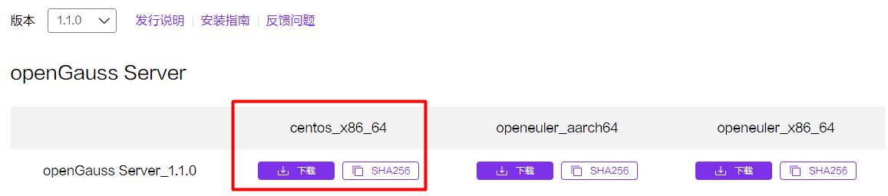
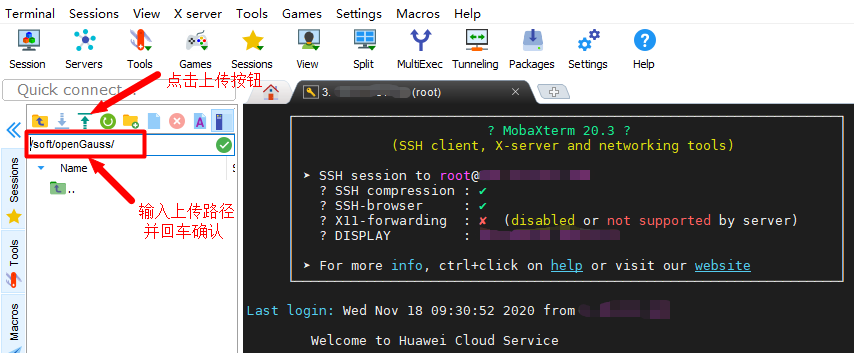
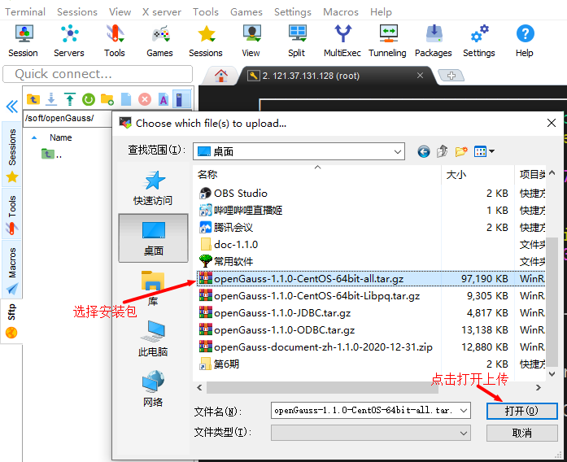
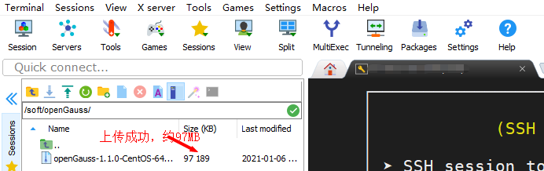

# openGauss1.1.0 主备部署<a name="ZH-CN_TOPIC_0000001116503041"></a>

**openGauss 1.1.0 版本介绍:**

openGauss 1.1.0 定位为 Update 版本，与原来的 1.0.1 版本特性功能保持兼容。主要提供如下功能：

- **继承功能：**

  1. SQL 标准语法、UPSERT、数据类型、XML 类型、表、临时表、全局临时表、外部表、视图、物化视图、索引、外键、Gin 索引、序列、函数、触发器、ROWNUM、聚合函数 median 等基础功能；

  2. 存储过程、存储过程内 commit/rollback、参数的存储过程/函数调用省略\(\)、存储过程调试、自治事务；

  3. 认证、权限管理、网络通信安全和数据库审计等安全特性；

  4. 主备双机、逻辑复制、极致 RTO、备机扩容高可用功能；

  5. 范围分区、全局分区索引、基于范围分区的自动扩展分区；

  6. 全量物理备份、逻辑备份、增量备份和恢复、恢复到指定时间点\(PITR\)；

  7. MOT 内存表、NUMA 化优化高性能能力，并行查询；

  8. 容器化部署、IPv6 协议、postgis 插件等；

  9. AI 能力：参数自调优、慢 SQL 发现。

- **新增特性：**

  LIST 分区和 HASH 分区、DDL 权限授权和回收、级联备机、字符数据类型长度兼容 PG、自动索引推荐、慢 SQL 发现更新、秒级参数推荐、AI 时序预测与异常发现、deepSQL、plpython、备机备份、自治事务重构，并行查询重构、数据类型支持 sysdate、支持增删备机节点、支持多版本 python、在线添加索引、升级工具、安装与 om 工具解耦。

- **处于 beta 测试阶段的特性：** MOT 内存表、并行查询和容器化等特性。
- **该版本的维护周期为半年。**

  当下载并打开 openGauss 1.1.0 的 CHM 官方文档时发现，在安装概述中关于备机数量的描述存在些许错误，这里需要纠正一下：**openGauss 1.1.0 版本目前可以支持 8 台备机+4 台级联备机，至于是否支持 8 台级联备机目前没有看到确切的测试信息。**

## 环境准备<a name="section26891158161315"></a>

**1.1 IP 地址规划**

<a name="table14824155191511"></a>

<table><thead ><tr id="row6826175511155"><th class="cellrowborder" colspan="5"  id="mcps1.1.6.1.1"><p id="p1249519111615"><a name="p1249519111615"></a><a name="p1249519111615"></a><strong id="b137191534171614"><a name="b137191534171614"></a><a name="b137191534171614"></a>IP地址规划</strong></p>
</th>
</tr>
</thead>
<tbody><tr id="row28271655121519"><td class="cellrowborder"  width="20%" headers="mcps1.1.6.1.1 "><p id="p082692413166"><a name="p082692413166"></a><a name="p082692413166"></a><strong id="b188265249165"><a name="b188265249165"></a><a name="b188265249165"></a>主机名</strong></p>
</td>
<td class="cellrowborder"  width="20%" headers="mcps1.1.6.1.1 "><p id="p12827122451619"><a name="p12827122451619"></a><a name="p12827122451619"></a>prod.opengauss.com</p>
</td>
<td class="cellrowborder"  width="20%" headers="mcps1.1.6.1.1 "><p id="p482720249162"><a name="p482720249162"></a><a name="p482720249162"></a>stb1.opengauss.com</p>
</td>
<td class="cellrowborder"  width="20%" headers="mcps1.1.6.1.1 "><p id="p8827142451615"><a name="p8827142451615"></a><a name="p8827142451615"></a>stb2.opengauss.com</p>
</td>
<td class="cellrowborder"  width="20%" headers="mcps1.1.6.1.1 "><p id="p15827624141611"><a name="p15827624141611"></a><a name="p15827624141611"></a>casstb.opengauss.com</p>
</td>
</tr>
<tr id="row9828155531518"><td class="cellrowborder"  width="20%" headers="mcps1.1.6.1.1 "><p id="p108271024171614"><a name="p108271024171614"></a><a name="p108271024171614"></a><strong id="b1482712414165"><a name="b1482712414165"></a><a name="b1482712414165"></a>角色</strong></p>
</td>
<td class="cellrowborder"  width="20%" headers="mcps1.1.6.1.1 "><p id="p382719244165"><a name="p382719244165"></a><a name="p382719244165"></a>Primary</p>
</td>
<td class="cellrowborder"  width="20%" headers="mcps1.1.6.1.1 "><p id="p382792411162"><a name="p382792411162"></a><a name="p382792411162"></a>Standby1</p>
</td>
<td class="cellrowborder"  width="20%" headers="mcps1.1.6.1.1 "><p id="p4827192441617"><a name="p4827192441617"></a><a name="p4827192441617"></a>Standby2</p>
</td>
<td class="cellrowborder"  width="20%" headers="mcps1.1.6.1.1 "><p id="p14827152431619"><a name="p14827152431619"></a><a name="p14827152431619"></a>Cascade Standby</p>
</td>
</tr>
<tr id="row2828145551516"><td class="cellrowborder"  width="20%" headers="mcps1.1.6.1.1 "><p id="p20828424161611"><a name="p20828424161611"></a><a name="p20828424161611"></a><strong id="b7828924141617"><a name="b7828924141617"></a><a name="b7828924141617"></a>IP地址</strong></p>
</td>
<td class="cellrowborder"  width="20%" headers="mcps1.1.6.1.1 "><p id="p182819249166"><a name="p182819249166"></a><a name="p182819249166"></a>192.168.0.11</p>
</td>
<td class="cellrowborder"  width="20%" headers="mcps1.1.6.1.1 "><p id="p7828182411163"><a name="p7828182411163"></a><a name="p7828182411163"></a>192.168.0.12</p>
</td>
<td class="cellrowborder"  width="20%" headers="mcps1.1.6.1.1 "><p id="p19828132415167"><a name="p19828132415167"></a><a name="p19828132415167"></a>192.168.0.13</p>
</td>
<td class="cellrowborder"  width="20%" headers="mcps1.1.6.1.1 "><p id="p1828824191617"><a name="p1828824191617"></a><a name="p1828824191617"></a>192.168.0.14</p>
</td>
</tr>
</tbody>
</table>

**1.2 测试环境硬件配置**

<a name="table52151149197"></a>

<table><thead ><tr id="row1821681481918"><th class="cellrowborder"  width="50%" id="mcps1.1.3.1.1"><p id="p3216161413195"><a name="p3216161413195"></a><a name="p3216161413195"></a>组件</p>
</th>
<th class="cellrowborder"  width="50%" id="mcps1.1.3.1.2"><p id="p9216414101912"><a name="p9216414101912"></a><a name="p9216414101912"></a>配置</p>
</th>
</tr>
</thead>
<tbody><tr id="row52161914101917"><td class="cellrowborder"  width="50%" headers="mcps1.1.3.1.1 "><p id="p1823955131912"><a name="p1823955131912"></a><a name="p1823955131912"></a><strong id="b52391651171917"><a name="b52391651171917"></a><a name="b52391651171917"></a>CPU</strong></p>
</td>
<td class="cellrowborder"  width="50%" headers="mcps1.1.3.1.2 "><p id="p152391551101911"><a name="p152391551101911"></a><a name="p152391551101911"></a>4c</p>
</td>
</tr>
<tr id="row8216121416191"><td class="cellrowborder"  width="50%" headers="mcps1.1.3.1.1 "><p id="p11240195191916"><a name="p11240195191916"></a><a name="p11240195191916"></a><strong id="b424085101915"><a name="b424085101915"></a><a name="b424085101915"></a>内存</strong></p>
</td>
<td class="cellrowborder"  width="50%" headers="mcps1.1.3.1.2 "><p id="p724005161919"><a name="p724005161919"></a><a name="p724005161919"></a>8GB</p>
</td>
</tr>
<tr id="row10216014171916"><td class="cellrowborder"  width="50%" headers="mcps1.1.3.1.1 "><p id="p7240165151919"><a name="p7240165151919"></a><a name="p7240165151919"></a><strong id="b92401514197"><a name="b92401514197"></a><a name="b92401514197"></a>硬盘</strong></p>
</td>
<td class="cellrowborder"  width="50%" headers="mcps1.1.3.1.2 "><p id="p42401751161913"><a name="p42401751161913"></a><a name="p42401751161913"></a>40GB</p>
</td>
</tr>
<tr id="row121719147196"><td class="cellrowborder"  width="50%" headers="mcps1.1.3.1.1 "><p id="p824035114192"><a name="p824035114192"></a><a name="p824035114192"></a><strong id="b182409511192"><a name="b182409511192"></a><a name="b182409511192"></a>网卡速率</strong></p>
</td>
<td class="cellrowborder"  width="50%" headers="mcps1.1.3.1.2 "><p id="p19240451151919"><a name="p19240451151919"></a><a name="p19240451151919"></a>1000Mb</p>
</td>
</tr>
</tbody>
</table>

```
## 检查CPU核数
cat /proc/cpuinfo |grep processor
## 检查内存大小
free -m
## 检查系统版本
cat /etc/redhat-release
```

**1.3 软件依赖包需求**

<a name="table651110256219"></a>

<table><thead ><tr id="row135115257214"><th class="cellrowborder"  width="50%" id="mcps1.1.3.1.1"><p id="p1151219251218"><a name="p1151219251218"></a><a name="p1151219251218"></a>条目</p>
</th>
<th class="cellrowborder"  width="50%" id="mcps1.1.3.1.2"><p id="p65121925172110"><a name="p65121925172110"></a><a name="p65121925172110"></a>要求</p>
</th>
</tr>
</thead>
<tbody><tr id="row125121725192119"><td class="cellrowborder"  width="50%" headers="mcps1.1.3.1.1 "><p id="p09058429211"><a name="p09058429211"></a><a name="p09058429211"></a><strong id="b149059425213"><a name="b149059425213"></a><a name="b149059425213"></a>Linux操作系统</strong></p>
</td>
<td class="cellrowborder"  width="50%" headers="mcps1.1.3.1.2 "><p id="p139053427217"><a name="p139053427217"></a><a name="p139053427217"></a>openEuler 20.3LTS/CentOS 7.6</p>
</td>
</tr>
<tr id="row1551232582111"><td class="cellrowborder"  width="50%" headers="mcps1.1.3.1.1 "><p id="p189051542102119"><a name="p189051542102119"></a><a name="p189051542102119"></a><strong id="b1390517426213"><a name="b1390517426213"></a><a name="b1390517426213"></a>Linux文件系统</strong></p>
</td>
<td class="cellrowborder"  width="50%" headers="mcps1.1.3.1.2 "><p id="p9905114218211"><a name="p9905114218211"></a><a name="p9905114218211"></a>剩余inode个数&gt;15亿</p>
</td>
</tr>
<tr id="row851216251214"><td class="cellrowborder"  width="50%" headers="mcps1.1.3.1.1 "><p id="p99051142152111"><a name="p99051142152111"></a><a name="p99051142152111"></a><strong id="b1390564215217"><a name="b1390564215217"></a><a name="b1390564215217"></a>工具</strong></p>
</td>
<td class="cellrowborder"  width="50%" headers="mcps1.1.3.1.2 "><p id="p79059425214"><a name="p79059425214"></a><a name="p79059425214"></a>java-1.8.0</p>
<p id="p14906184272114"><a name="p14906184272114"></a><a name="p14906184272114"></a>bzip2</p>
</td>
</tr>
<tr id="row15121125152119"><td class="cellrowborder"  width="50%" headers="mcps1.1.3.1.1 "><p id="p3906134213219"><a name="p3906134213219"></a><a name="p3906134213219"></a><strong id="b15906742132111"><a name="b15906742132111"></a><a name="b15906742132111"></a>Python</strong></p>
</td>
<td class="cellrowborder"  width="50%" headers="mcps1.1.3.1.2 "><p id="p17906124212218"><a name="p17906124212218"></a><a name="p17906124212218"></a>openEuler:     支持Python 3.7.x</p>
<p id="p1590694262111"><a name="p1590694262111"></a><a name="p1590694262111"></a>CentOS 7.6：支持Python 3.6.x</p>
</td>
</tr>
<tr id="row205121625142120"><td class="cellrowborder"  width="50%" headers="mcps1.1.3.1.1 "><p id="p6906124214217"><a name="p6906124214217"></a><a name="p6906124214217"></a><strong id="b7906144282115"><a name="b7906144282115"></a><a name="b7906144282115"></a>其他依赖软件包</strong></p>
</td>
<td class="cellrowborder"  width="50%" headers="mcps1.1.3.1.2 "><p id="p490674215215"><a name="p490674215215"></a><a name="p490674215215"></a>libaio-devel &gt;= 0.3.109-13</p>
<p id="p7906184212213"><a name="p7906184212213"></a><a name="p7906184212213"></a>flex &gt;= 2.5.31</p>
<p id="p29061242162111"><a name="p29061242162111"></a><a name="p29061242162111"></a>bison &gt;= 2.7.4</p>
<p id="p119061642172115"><a name="p119061642172115"></a><a name="p119061642172115"></a>ncurses-devel &gt;= 5.9-13.20130511</p>
<p id="p99061042182118"><a name="p99061042182118"></a><a name="p99061042182118"></a>glibc-devel &gt;= 2.17-111</p>
<p id="p790694220210"><a name="p790694220210"></a><a name="p790694220210"></a>patch &gt;= 2.7.1-10</p>
<p id="p1906124242110"><a name="p1906124242110"></a><a name="p1906124242110"></a>lsb_release &gt;= 4.1</p>
<p id="p129063421219"><a name="p129063421219"></a><a name="p129063421219"></a>readline-devel &gt;= 7.0-13</p>
</td>
</tr>
</tbody>
</table>

**1.4 配置 YUM 源并安装依赖软件包**

```
## 配置华为YUM源
mkdir /etc/yum.repos.d/bak
mv /etc/yum.repos.d/*.repo  /etc/yum.repos.d/bak/
wget -O /etc/yum.repos.d/CentOS-Base.repo https://repo.huaweicloud.com/repository/conf/CentOS-7-reg.repo
## curl -o /etc/yum.repos.d/CentOS-Base.repo http://mirrors.myhuaweicloud.com/repo/CentOS-Base-7.repo   华为云内网可以使用该YUM源
yum clean all

## 使用华为YUM源安装依赖的软件包
yum install -y lksctp*
yum install -y java-1.8.0-openjdk* psmisc bzip2 python3
yum install -y libaio-devel flex bison ncurses-devel glibc-devel patch redhat-lsb-core

## 检查软件包的安装情况
rpm -qa java-1.8.0-openjdk psmisc bzip2 libaio-devel flex bison ncurses-devel glibc-devel patch redhat-lsb-core lksctp-tools* python3

## 检查SCTP驱动是否支持
checksctp
```

## 操作系统配置\(所有节点操作\)<a name="section55091854192518"></a>

**2.1 编辑 Hosts 文件**

```
## 检查主机名和IP地址
hostname && ifconfig |grep broadcast|awk '{print $2}'

## 添加Hosts解析
cat >> /etc/hosts <<EOF
192.168.0.11 prod.opengauss.com   #Gauss OM IP Hosts Mapping
192.168.0.12 stb1.opengauss.com   #Gauss OM IP Hosts Mapping
192.168.0.13 stb2.opengauss.com   #Gauss OM IP Hosts Mapping
192.168.0.14 casstb.opengauss.com #Gauss OM IP Hosts Mapping
EOF

cat /etc/hosts
```

**2.2 关闭防火墙**

```
systemctl status firewalld
systemctl disable firewalld.service
systemctl stop firewalld.service
```

**2.3 关闭 SELinux\(重启操作系统生效\)**

```
sed -i '/SELINUX=/d' /etc/selinux/config
echo "SELINUX=disabled" >> /etc/selinux/config
cat /etc/selinux/config|grep -v ^#|grep -v '^$'
```

**2.4 修改字符集参数**

```
echo "export LANG=en_US.UTF-8"  >>  ~/.bash_profile
source ~/.bash_profile
env|grep LANG
```

**2.5 设置时区并统一主机时间\(建议生产环境开启 NTP 服务同步时间\)**

```
rm -fr /etc/localtime
ln -s /usr/share/zoneinfo/Asia/Shanghai /etc/localtime
ll /etc/localtime
```

**2.6 关闭 SWAP\(可选\)**

关闭 swap 操作在 1.0.0 文档中是必选项，目的是为了尽量减少 swap 分区对 openGauss 数据库的性能影响，让数据库自己判断数据的冷热程度，对内存数据进行换入换出操作。 但由于后期大家做实验时的物理机内存都比较小，很容易出现因为内存不足而导致数据库 crash 的现象，在交流群里进行一番争议和讨论后，在 1.0.1 版本的文档中已经将关闭 swap 的操作变为可选项，建议在大内存\(128GB 以上\)的操作系统中关闭 swap 选项，小内存的操作系统建议打开 swap 选项，以保证数据库的稳定性。

```
## 修改分区表文件，删除SWAP挂载信息
cp /etc/fstab  /etc/fstab.bak
sed -i '/swap/s/^/#/' /etc/fstab
cat /etc/fstab|grep -v ^#|grep -v '^$'

## 关闭swap
swapoff -a
```

**2.7 配置 SSH 服务\(允许 root 登录，关闭 Banner\)**

```
# 允许root登录，关闭登录Banner，配置文件需要重启生效
sed -i '/Banner/s/^/#/'  /etc/ssh/sshd_config
sed -i '/PermitRootLogin/s/^/#/'  /etc/ssh/sshd_config
echo -e "\n" >> /etc/ssh/sshd_config
echo "Banner none " >> /etc/ssh/sshd_config
echo "PermitRootLogin yes" >> /etc/ssh/sshd_config
cat /etc/ssh/sshd_config |grep -v ^#|grep -E 'PermitRootLogin|Banner'
```

**2.8 关闭 RemoveIPC\(CentOS 7.6 已经默认关闭，该步骤可以跳过\)**

```
## 关闭RemoveIPC，CentOS 7.6已经默认关闭，该步骤可以跳过
## sed -i '/^RemoveIPC/d' /etc/systemd/logind.conf
## sed -i '/^RemoveIPC/d' /usr/lib/systemd/system/systemd-logind.service
## echo "RemoveIPC=no"  >> /etc/systemd/logind.conf
## echo "RemoveIPC=no"  >> /usr/lib/systemd/system/systemd-logind.service
## systemctl daemon-reload
## systemctl restart systemd-logind
## loginctl show-session | grep RemoveIPC
## systemctl show systemd-logind | grep RemoveIPC
```

**2.9 关闭透明大页 transparent_hugepage\(官方文档中未提及\)**

Linux 的透明大页功能会降低操作系统的 IO 性能，而且需要一定的 CPU 资源对大页碎片进行整理，在实际生产中也遇到很多案例是因为透明大页的问题导致数据库 Hang 或彻底宕机。所以，有经验的 DBA 在部署数据库时一般都会选择关闭操作系统的透明大页\(THP\)。

在 openGauss 1.1.0 版本的安装部署中，gs_preinstall 脚本会关闭透明大页，但个人认为做的不够彻底，如下：

```
[root@prod ~]# cat /sys/kernel/mm/transparent_hugepage/enabled
always madvise [never]
[root@prod ~]# cat /sys/kernel/mm/transparent_hugepage/defrag
[always] madvise never
```

此处，按照以前常用的关闭透明页操作，手动在 rc.local 中添加了关闭 THP 的操作：

```
[root@prod ~]# vi /etc/rc.d/rc.local
----------------------------------------------------------
if test -f /sys/kernel/mm/transparent_hugepage/enabled; then
echo never > /sys/kernel/mm/transparent_hugepage/enabled
fi
if test -f /sys/kernel/mm/transparent_hugepage/defrag; then
echo never > /sys/kernel/mm/transparent_hugepage/defrag
fi
----------------------------------------------------------
[root@prod ~]# chmod +x /etc/rc.d/rc.local
```

重启系统后，验证 THP 的关闭状态：

```
[root@prod ~]# cat /sys/kernel/mm/transparent_hugepage/enabled
always madvise [never]
[root@prod ~]# cat /sys/kernel/mm/transparent_hugepage/defrag
always madvise [never]
```

**2.10 重启操作系统**

```
reboot
```

**Tips：**

- 用户、用户组、安装目录建议不要提前创建和指定，最好通过 gs_preinstall 脚本自动创建；
- 操作系统资源限制操作不需要手动提前配置，使用 gs_preinstall 脚本自动配置；
- 操作系统内核参数配置操作不需要提前配置，使用 gs_preinstall 脚本自动配置，但有 4 条网络方面的内核参数依然需要手动配置\(详见下文记录\)。

## 预安装 openGauss 软件\(在 Primary 主机执行\)<a name="section198746514362"></a>

**3.1 配置 cluster_config.xml 文件**

```
mkdir -p /soft/openGauss
chmod 775 -R /soft

cat >> /soft/openGauss/cluster_config.xml << EOF
<?xml version="1.0" encoding="UTF-8"?>
<ROOT>
    <!-- openGauss整体信息 -->
    <CLUSTER>
        <!-- 数据库名称 -->
        <PARAM name="clusterName" value="gsCluster" />
        <!-- 数据库节点名称(hostname) -->
        <PARAM name="nodeNames" value="prod.opengauss.com,stb1.opengauss.com,stb2.opengauss.com,casstb.opengauss.com" />
        <!-- 数据库安装目录 与其他路径相互独立-->
        <PARAM name="gaussdbAppPath" value="/gauss/app" />
        <!-- 日志目录 -->
        <PARAM name="gaussdbLogPath" value="/gauss/log" />
        <!-- 临时文件目录 -->
        <PARAM name="tmpMppdbPath" value="/gauss/tmp" />
        <!--数据库工具目录 -->
        <PARAM name="gaussdbToolPath" value="/gauss/om" />
        <!--数据库core文件目录-->
        <PARAM name="corePath" value="/gauss/corefile" />
        <!-- 节点后端通讯IP，与nodeNames对应 -->
        <PARAM name="backIp1s" value="192.168.0.11,192.168.0.12,192.168.0.13,192.168.0.14"/>
    </CLUSTER>
    <!-- 每台服务器上的节点部署信息 -->
    <DEVICELIST>
        <!-- node1上的节点部署信息 -->
        <DEVICE sn="prod.opengauss.com">
            <!-- node1的hostname -->
            <PARAM name="name" value="prod.opengauss.com"/>
            <!-- 节点所在的AZ及AZ优先级 -->
            <PARAM name="azName" value="AZ1"/>
            <PARAM name="azPriority" value="1"/>
            <!-- 若服务器仅有一个网卡，将backIP1和sshIP1配置成同一个IP -->
            <PARAM name="backIp1" value="192.168.0.11"/>
            <PARAM name="sshIp1" value="192.168.0.11"/>
        <!--dbnode-->
        <!--当前主机上需要部署的数据库节点个数-->
        <PARAM name="dataNum" value="1"/>
        <!--DBnode端口号-->
        <PARAM name="dataPortBase" value="26000"/>
        <!--DBnode侦听IP-->
        <PARAM name="dataListenIp1" value="192.168.0.11,192.168.0.12,192.168.0.13,192.168.0.14"/>
        <!--DBnode主节点上数据目录，及备机数据目录-->
        <PARAM name="dataNode1" value="/gauss/data/db1,stb1.opengauss.com,/gauss/data/db1,stb2.opengauss.com,/gauss/data/db1,casstb.opengauss.com,/gauss/data/db1"/>
        <!--DBnode节点上设定同步模式的节点数-->
        <PARAM name="dataNode1_syncNum" value="0"/>
        </DEVICE>

        <DEVICE sn="stb1.opengauss.com">
            <!-- node2的hostname -->
            <PARAM name="name" value="stb1.opengauss.com"/>
            <!-- 节点所在的AZ及AZ优先级 -->
            <PARAM name="azName" value="AZ1"/>
            <PARAM name="azPriority" value="1"/>
            <!-- 若服务器仅有一个网卡，将backIP1和sshIP1配置成同一个IP -->
            <PARAM name="backIp1" value="192.168.0.12"/>
            <PARAM name="sshIp1" value="192.168.0.12"/>
        </DEVICE>
        <DEVICE sn="stb2.opengauss.com">
            <!-- node3的hostname -->
            <PARAM name="name" value="stb2.opengauss.com"/>
            <!-- 节点所在的AZ及AZ优先级 -->
            <PARAM name="azName" value="AZ1"/>
            <PARAM name="azPriority" value="1"/>
            <!-- 若服务器仅有一个网卡，将backIP1和sshIP1配置成同一个IP -->
            <PARAM name="backIp1" value="192.168.0.13"/>
            <PARAM name="sshIp1" value="192.168.0.13"/>
        </DEVICE>
        <DEVICE sn="casstb.opengauss.com">
            <!-- node4的hostname -->
            <PARAM name="name" value="casstb.opengauss.com"/>
            <!-- 节点所在的AZ及AZ优先级 -->
            <PARAM name="azName" value="AZ1"/>
            <PARAM name="azPriority" value="1"/>
            <!-- 若服务器仅有一个网卡，将backIP1和sshIP1配置成同一个IP -->
            <PARAM name="backIp1" value="192.168.0.14"/>
            <PARAM name="sshIp1" value="192.168.0.14"/>
            <!-- node1是否为级联备, on表示该实例为级联备，另外级联备机在相同的AZ里需要配有备机 -->
            <PARAM name="cascadeRole" value="on"/>
        </DEVICE>
    </DEVICELIST>
</ROOT>
EOF
cat /soft/openGauss/cluster_config.xml
```

**Tips：**

- 安装目录和数据目录必须为空或者不存在，否则可能导致安装失败；
- 部分的配置取消了 openGauss 的类型参数配置：name=“clusterType” value=“single-inst”；
- 部分在官方文档的示例中，将节点唯一识别号 sn 由原来的纯数字示例改为主机名示例，即 sn=hostname；
- 部分增加了级联参数 cascadeRole；
- 部分的 dataListenIp1 参数，在 openGauss 1.0.0 时会报错，官方文档示例中也已经删除该参数，但在 1.1.0 版本中，该参数可以正确无误地运行。

**3.2 上传并解压安装包**

[openGauss 软件下载地址](https://opengauss.org/zh/download/) https://opengauss.org/zh/download/



使用远程终端 MobaXterm 将软件包上传至 Primary 服务器：







解压数据库安装包:

```
cd /soft/openGauss
tar -zxvf openGauss-1.1.0-CentOS-64bit-all.tar.gz
```

**3.3 交互式安装**

由于 openGauss 1.1.0 的软件包将 om 工具和 openGauss-server 分离，此处的安装步骤稍微有一点差别，多一步解压 om 工具压缩包的操作。

gs_preinstall 脚本会自动创建用户、用户组和安装目录，并授予目录正确的权限。

解压 om 软件包

```
cd /soft/openGauss/
tar -xvf openGauss-1.1.0-CentOS-64bit-om.tar.gz
```

加载环境变量

```
export LD_LIBRARY_PATH=/soft/openGauss/script/gspylib/clib:$LD_LIBRARY_PATH
```

执行交互式安装脚本

```
cd /soft/openGauss/script
[root@prod script]# ./gs_preinstall -U omm -G dbgrp -X /soft/openGauss/cluster_config.xml
Parsing the configuration file.
Successfully parsed the configuration file.
Installing the tools on the local node.
Successfully installed the tools on the local node.
Are you sure you want to create trust for root (yes/no)? yes
Please enter password for root.
Password:
Creating SSH trust for the root permission user.
Checking network information.
All nodes in the network are Normal.
Successfully checked network information.
Creating SSH trust.
Creating the local key file.
Successfully created the local key files.
Appending local ID to authorized_keys.
Successfully appended local ID to authorized_keys.
Updating the known_hosts file.
Successfully updated the known_hosts file.
Appending authorized_key on the remote node.
Successfully appended authorized_key on all remote node.
Checking common authentication file content.
Successfully checked common authentication content.
Distributing SSH trust file to all node.
Successfully distributed SSH trust file to all node.
Verifying SSH trust on all hosts.
Successfully verified SSH trust on all hosts.
Successfully created SSH trust.
Successfully created SSH trust for the root permission user.
Setting pssh path
Successfully set core path.
Distributing package.
Begin to distribute package to tool path.
Successfully distribute package to tool path.
Begin to distribute package to package path.
Successfully distribute package to package path.
Successfully distributed package.
Are you sure you want to create the user[omm] and create trust for it (yes/no)? yes
Please enter password for cluster user.
Password:
Please enter password for cluster user again.
Password:
Successfully created [omm] user on all nodes.
Preparing SSH service.
Successfully prepared SSH service.
Installing the tools in the cluster.
Successfully installed the tools in the cluster.
Checking hostname mapping.
Successfully checked hostname mapping.
Creating SSH trust for [omm] user.
Checking network information.
All nodes in the network are Normal.
Successfully checked network information.
Creating SSH trust.
Creating the local key file.
Successfully created the local key files.
Appending local ID to authorized_keys.
Successfully appended local ID to authorized_keys.
Updating the known_hosts file.
Successfully updated the known_hosts file.
Appending authorized_key on the remote node.
Successfully appended authorized_key on all remote node.
Checking common authentication file content.
Successfully checked common authentication content.
Distributing SSH trust file to all node.
Successfully distributed SSH trust file to all node.
Verifying SSH trust on all hosts.
Successfully verified SSH trust on all hosts.
Successfully created SSH trust.
Successfully created SSH trust for [omm] user.
Checking OS software.
Successfully check os software.
Checking OS version.
Successfully checked OS version.
Creating cluster's path.
Successfully created cluster's path.
Setting SCTP service.
Successfully set SCTP service.
Set and check OS parameter.
Setting OS parameters.
Successfully set OS parameters.
Warning: Installation environment contains some warning messages.
Please get more details by "/soft/openGauss/script/gs_checkos -i A -h prod.opengauss.com,stb1.opengauss.com,stb2.opengauss.com,casstb.opengauss.com --detail".
Set and check OS parameter completed.
Preparing CRON service.
Successfully prepared CRON service.
Setting user environmental variables.
Successfully set user environmental variables.
Setting the dynamic link library.
Successfully set the dynamic link library.
Setting Core file
Successfully set core path.
Setting pssh path
Successfully set pssh path.
Set ARM Optimization.
No need to set ARM Optimization.
Fixing server package owner.
Setting finish flag.
Successfully set finish flag.
Preinstallation succeeded.
```

**Tips：**

- 在使用 gs_preinstall 脚本后，limits 资源虽然已经设置，但仍然存在无法动态生效的参数，需要重启系统使之生效；
- 若是共用的环境，需要加入–sep-env-file=ENVFILE 参数分离环境变量，避免与其他用户相互影响。

**3.4 添加 4 条网络内核参数**

由于 pre_install 脚本执行完毕后，再次检查会发现以下网络参数不满足需求，这里提前设置

```
[root@prod ~]# cat >>/etc/sysctl.conf <<EOF
 net.ipv4.tcp_retries1 = 5
 net.ipv4.tcp_syn_retries = 5
 net.sctp.path_max_retrans = 10
 net.sctp.max_init_retransmits = 10
 EOF
```

**3.5 重启所有节点，使内核参数和资源限制参数生效**

```
reboot
```

## 安装验证<a name="section47236511403"></a>

以 root 用户执行脚本，检查操作系统参数：

```
[root@prod ~]# /soft/openGauss/script/gs_checkos -i A -h prod.opengauss.com,stb1.opengauss.com,stb2.opengauss.com,casstb.opengauss.com --detail
Checking items:
    A1. [ OS version status ]                                   : Normal
        [casstb.opengauss.com]
        centos_7.6_64bit
        [stb2.opengauss.com]
        centos_7.6_64bit
        [stb1.opengauss.com]
        centos_7.6_64bit
        [prod.opengauss.com]
        centos_7.6_64bit
    A2. [ Kernel version status ]                               : Normal
        The names about all kernel versions are same. The value is "3.10.0-1160.6.1.el7.x86_64".
    A3. [ Unicode status ]                                      : Normal
        The values of all unicode are same. The value is "LANG=en_US.UTF-8".
    A4. [ Time zone status ]                                    : Normal
        The informations about all timezones are same. The value is "+0800".
    A5. [ Swap memory status ]                                  : Normal
        The value about swap memory is correct.
    A6. [ System control parameters status ]                    : Normal
        All values about system control  parameters are correct.
    A7. [ File system configuration status ]                    : Normal
        Both soft nofile and hard nofile are correct.
    A8. [ Disk configuration status ]                           : Normal
        The value about XFS mount parameters is correct.
    A9. [ Pre-read block size status ]                          : Normal
        The value about Logical block size is correct.
    A10.[ IO scheduler status ]                                 : Normal
        The value of IO scheduler is correct.
    A11.[ Network card configuration status ]                   : Warning
        [stb2.opengauss.com]
BondMode Null
        Warning reason: Failed to obtain the network card speed value. Commands for obtain the network card speed: /sbin/ethtool eth0 | grep 'Speed:'. Error:
        [stb1.opengauss.com]
BondMode Null
        Warning reason: Failed to obtain the network card speed value. Commands for obtain the network card speed: /sbin/ethtool eth0 | grep 'Speed:'. Error:
        [casstb.opengauss.com]
BondMode Null
        Warning reason: Failed to obtain the network card speed value. Commands for obtain the network card speed: /sbin/ethtool eth0 | grep 'Speed:'. Error:
        [prod.opengauss.com]
BondMode Null
        Warning reason: Failed to obtain the network card speed value. Commands for obtain the network card speed: /sbin/ethtool eth0 | grep 'Speed:'. Error:
    A12.[ Time consistency status ]                             : Warning
        [casstb.opengauss.com]
        The NTPD not detected on machine and local time is "2021-01-06 16:29:20".
        [stb1.opengauss.com]
        The NTPD not detected on machine and local time is "2021-01-06 16:29:20".
        [prod.opengauss.com]
        The NTPD not detected on machine and local time is "2021-01-06 16:29:20".
        [stb2.opengauss.com]
        The NTPD not detected on machine and local time is "2021-01-06 16:29:20".
    A13.[ Firewall service status ]                             : Normal
        The firewall service is stopped.
    A14.[ THP service status ]                                  : Normal
        The THP service is stopped.
Total numbers:14. Abnormal numbers:0. Warning numbers:2.
```

**Warning 说明：**

- 网卡告警：由于测试环境使用的华为云实例对网络做了优化，ethtool 工具无法获取网卡速率信息，该告警可以忽略。
- 时间同步告警：测试环境没有配置 NTP 服务器导致该告警，此处的告警可以忽略，但建议在生产环境下最好配置 NTP 服务器。

## 部署安装 openGauss 软件<a name="section81311573412"></a>

执行 openGauss 安装脚本：

```
chmod -R 775 /soft/
chown omm:dbgrp /soft -R
su - omm
gs_install -X /soft/openGauss/cluster_config.xml \
--gsinit-parameter="--encoding=UTF8" \           ## 建议生产环境使用UTF-8编码，否则默认是SQL_ASCII编码
--dn-guc="max_connections=1000" \                ## 以下5条内存参数仅仅是为了使得openGauss能够在4GB内存的机器运行，生产环境请根据实际情况做优化
--dn-guc="max_process_memory=3GB" \
--dn-guc="shared_buffers=128MB" \
--dn-guc="bulk_write_ring_size=128MB" \
--dn-guc="cstore_buffers=16MB"
输出内容：
Parsing the configuration file.
Check preinstall on every node.
Successfully checked preinstall on every node.
Creating the backup directory.
Successfully created the backup directory.
begin deploy..
Installing the cluster.
begin prepare Install Cluster..
Checking the installation environment on all nodes.
begin install Cluster..
Installing applications on all nodes.
Successfully installed APP.
begin init Instance..
encrypt cipher and rand files for database.
Please enter password for database:         ## 系统初始用户omm的密码复杂度要求：大写+小写+数字+特殊字符(任选3类，至少8位)
Please repeat for database:
begin to create CA cert files
The sslcert will be generated in /gauss/app/share/sslcert/om
Cluster installation is completed.
Configuring.
Deleting instances from all nodes.
Successfully deleted instances from all nodes.
Checking node configuration on all nodes.
Initializing instances on all nodes.
Updating instance configuration on all nodes.
Check consistence of memCheck and coresCheck on database nodes.
Successful check consistence of memCheck and coresCheck on all nodes.
Configuring pg_hba on all nodes.
Configuration is completed.
Successfully started cluster.
Successfully installed application.
end deploy..
```

**Tips：**

- 安装过程中会生成 ssl 证书，证书存放路径为\{gaussdbAppPath\}/share/sslcert/om，其中\{gaussdbAppPath\}为集群 openGauss 配置文件中指定的程序安装目录；
- 日志文件路径下会生成两个日志文件：“gs_install-YYYY-MMDD_HHMMSS.log”和“gs_local-YYYY-MM-DD_HHMMSS.log”。

## 检查数据库基本信息<a name="section1670244915484"></a>

```
-- 使用omm用户连接数据库
gsql -d postgres -p 26000 -r

-- 修改初始用户密码
postgres=# alter role omm identified by 'gauss@123' replace 'gauss@2020';   -- 修改初始用户omm密码为gauss@123

-- 查询数据库信息
postgres=# select version();                                                -- 检查数据库版本
                                                                                version
-----------------------------------------------------------------------------------------------------------------------------------------------------------------------
 PostgreSQL 9.2.4 (openGauss 1.1.0 build 392c0438) compiled at 2020-12-31 20:07:42 commit 0 last mr   on x86_64-unknown-linux-gnu, compiled by g++ (GCC) 7.3.0, 64-bit
(1 row)
postgres=# \l                                                               -- 检查数据库清单
                         List of databases
   Name    | Owner | Encoding | Collate | Ctype | Access privileges
-----------+-------+----------+---------+-------+-------------------
 postgres  | omm   | UTF8     | C       | C     |
 template0 | omm   | UTF8     | C       | C     | =c/omm           +
           |       |          |         |       | omm=CTc/omm
 template1 | omm   | UTF8     | C       | C     | =c/omm           +
           |       |          |         |       | omm=CTc/omm
(3 rows)

postgres=# \q                                                               -- 退出gsql客户端
```

## 检查主备状态<a name="section596185613557"></a>

**7.1 主备状态检查**

```
[omm@prod ~]$ gs_om -t status --detail
[   Cluster State   ]
cluster_state   : Normal
redistributing  : No
current_az      : AZ_ALL
[  Datanode State   ]
node                      node_ip         instance                state
----------------------------------------------------------------------------------
1  prod.opengauss.com   192.168.0.11    6001 /gauss/data/db1 P Primary Normal
2  stb1.opengauss.com   192.168.0.12    6002 /gauss/data/db1 S Standby Normal
3  stb2.opengauss.com   192.168.0.13    6003 /gauss/data/db1 S Standby Normal
4  casstb.opengauss.com 192.168.0.14    6004 /gauss/data/db1 C Cascade Normal
```

**7.2 复制连接配置检查**

```
postgres=# show replconninfo1;
                                                                               replconninfo1
---------------------------------------------------------------------------------------------------------------------------------------------------------------------------
 localhost=192.168.0.11 localport=26001 localheartbeatport=26005 localservice=26004 remotehost=192.168.0.12 remoteport=26001 remoteheartbeatport=26005 remoteservice=26004
postgres=# show replconninfo2;
                                                                               replconninfo2
---------------------------------------------------------------------------------------------------------------------------------------------------------------------------
 localhost=192.168.0.11 localport=26001 localheartbeatport=26005 localservice=26004 remotehost=192.168.0.13 remoteport=26001 remoteheartbeatport=26005 remoteservice=26004
postgres=# show replconninfo3;
                                                                               replconninfo3
---------------------------------------------------------------------------------------------------------------------------------------------------------------------------
 localhost=192.168.0.11 localport=26001 localheartbeatport=26005 localservice=26004 remotehost=192.168.0.14 remoteport=26001 remoteheartbeatport=26005 remoteservice=26004

postgres=# show max_wal_senders;
 max_wal_senders
-----------------
 16
```

**7.3 检查日志传送线程状态**

```
-- 在Primary机器检查日志发送线程状态
postgres=# \pset expanded
Expanded display is on.
postgres=# select * from pg_stat_get_wal_senders();
-[ RECORD 1 ]--------------+----------------------------------------
pid                        | 140097998878464
sender_pid                 | 21609
local_role                 | Primary
peer_role                  | Standby
peer_state                 | Normal
state                      | Streaming
catchup_start              | 2021-01-06 16:40:33.679871+08
catchup_end                | 2021-01-06 16:40:33.707802+08
sender_sent_location       | 0/7002380
sender_write_location      | 0/7002380
sender_flush_location      | 0/7002380
sender_replay_location     | 0/7002380
receiver_received_location | 0/7002380
receiver_write_location    | 0/7002380
receiver_flush_location    | 0/7002380
receiver_replay_location   | 0/7002380
sync_percent               | 100%
sync_state                 | Async
sync_priority              | 0
sync_most_available        | Off
channel                    | 192.168.0.11:26001-->192.168.0.12:54854
-[ RECORD 2 ]--------------+----------------------------------------
pid                        | 140097703044864
sender_pid                 | 21718
local_role                 | Primary
peer_role                  | Standby
peer_state                 | Normal
state                      | Streaming
catchup_start              | 2021-01-06 16:40:31.364624+08
catchup_end                | 2021-01-06 16:40:31.364668+08
sender_sent_location       | 0/7002380
sender_write_location      | 0/7002380
sender_flush_location      | 0/7002380
sender_replay_location     | 0/7002380
receiver_received_location | 0/7002380
receiver_write_location    | 0/7002380
receiver_flush_location    | 0/7002380
receiver_replay_location   | 0/7002380
sync_percent               | 100%
sync_state                 | Async
sync_priority              | 0
sync_most_available        | Off
channel                    | 192.168.0.11:26001-->192.168.0.13:48502

-- 在cascade备机(级联备机)检查日志接收线程
postgres=# \pset x
Expanded display is on.
postgres=# select * from pg_stat_get_wal_receiver();
-[ RECORD 1 ]--------------+----------------------------------------
receiver_pid               | 15522
local_role                 | Cascade Standby
peer_role                  | Standby
peer_state                 | Normal
state                      | Normal
sender_sent_location       | 0/7002F88
sender_write_location      | 0/7002F88
sender_flush_location      | 0/7002F88
sender_replay_location     | 0/7002E70
receiver_received_location | 0/7002F88
receiver_write_location    | 0/7002F88
receiver_flush_location    | 0/7002F88
receiver_replay_location   | 0/7002F88
sync_percent               | 100%
channel                    | 192.168.0.14:46818<--192.168.0.12:26001
```

**Tips：** 级联备机会在同一个 AZ 内寻找一台备机获取需要同步的数据，但至于选择同 AZ 内的哪一台备机，具架构师的反馈，这个是随机选择。

**7.4 数据同步测试**

```
-- Primary节点创建测试数据
postgres=# create table test(name varchar(20));
CREATE TABLE
postgres=# insert into test values('This is a test.');
INSERT 0 1
postgres=# select * from test;
      name
-----------------
 This is a test.

-- Cascade Standby节点检查数据
postgres=# select * from test;
      name
-----------------
 This is a test.
```

## 实验环境清理<a name="section943883412116"></a>

**8.1 以 omm 用户卸载数据库**

```
gs_uninstall --delete-data
```

**Tips：** 如果卸载失败请根据“$GAUSSLOG/om/gs_uninstall-YYYY-MM-DD_HHMMSS.log”中的日志信息排查错误。

**8.2 以 root 用户清理环境**

```
su - root
cd /soft/openGauss/script
./gs_postuninstall -U omm -X /soft/openGauss/cluster_config.xml --delete-user --delete-group
```

**8.3 手动清理残留信息**

```
## 手动删除残留的安装目录
rm -fr /gauss
```

**Tips：** 若为环境变量分离的模式安装的集群需删除之前 source 的环境变量分离的 env 参数，清理时需要加入–sep-env-file 参数。
