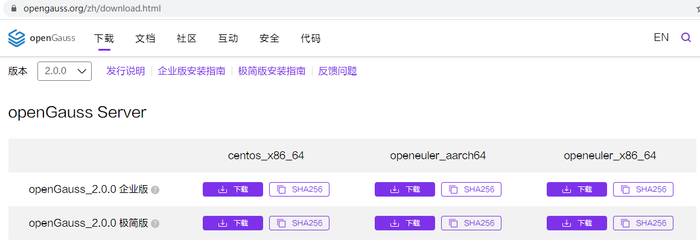

# openGauss2.0.0 主备安装部署<a name="ZH-CN_TOPIC_0000001141902113"></a>

openGauss 2.0.0 于 2021 年 3 月 31 日正式发布，大部分对 openGauss 数据库感兴趣的小伙伴首先想到的应该是先把新版本软件下载下来，搭建一套自己的测试环境，然后再根据官方文档研究研究新特性的使用和原理。

本文基于 openGauss 2.0.0 搭建 1 主+1 备+1 级联备测试环境，并将操作记录共享出来，希望能帮到有需要的小伙伴。

## 2.0.0 版新增特性<a name="section37991328114317"></a>

<a name="table15843113294519"></a>

<table><thead ><tr id="row884453220452"><th class="cellrowborder"  width="50%" id="mcps1.1.3.1.1"><p id="p7845143204513"><a name="p7845143204513"></a><a name="p7845143204513"></a>特性</p>
</th>
<th class="cellrowborder"  width="50%" id="mcps1.1.3.1.2"><p id="p184511321454"><a name="p184511321454"></a><a name="p184511321454"></a>介绍</p>
</th>
</tr>
</thead>
<tbody><tr id="row15845173217453"><td class="cellrowborder"  width="50%" headers="mcps1.1.3.1.1 "><p id="p17742143154615"><a name="p17742143154615"></a><a name="p17742143154615"></a>支持延迟备库</p>
</td>
<td class="cellrowborder"  width="50%" headers="mcps1.1.3.1.2 "><p id="p197421394614"><a name="p197421394614"></a><a name="p197421394614"></a>相对主机，备机可以延迟一段指定的时间后再回放XLOG记录</p>
</td>
</tr>
<tr id="row1284623216458"><td class="cellrowborder"  width="50%" headers="mcps1.1.3.1.1 "><p id="p37473311465"><a name="p37473311465"></a><a name="p37473311465"></a>备机支持逻辑复制</p>
</td>
<td class="cellrowborder"  width="50%" headers="mcps1.1.3.1.2 "><p id="p117474317466"><a name="p117474317466"></a><a name="p117474317466"></a>支持备机逻辑解码，可以减少主机的压力</p>
</td>
</tr>
<tr id="row38461432104514"><td class="cellrowborder"  width="50%" headers="mcps1.1.3.1.1 "><p id="p1274714317468"><a name="p1274714317468"></a><a name="p1274714317468"></a>扩容工具功能增强</p>
</td>
<td class="cellrowborder"  width="50%" headers="mcps1.1.3.1.2 "><p id="p7747193134610"><a name="p7747193134610"></a><a name="p7747193134610"></a>优化了扩容工具，支持不停服在线扩容备机或级联备</p>
</td>
</tr>
<tr id="row3846153215459"><td class="cellrowborder"  width="50%" headers="mcps1.1.3.1.1 "><p id="p16747335468"><a name="p16747335468"></a><a name="p16747335468"></a>灰度升级</p>
</td>
<td class="cellrowborder"  width="50%" headers="mcps1.1.3.1.2 "><p id="p174813304612"><a name="p174813304612"></a><a name="p174813304612"></a>优化升级工具，增加灰度升级能力，支持业务在线升级。目前仅支持从1.1.0版本到2.0.0版本进行灰度升级</p>
</td>
</tr>
<tr id="row1884653294515"><td class="cellrowborder"  width="50%" headers="mcps1.1.3.1.1 "><p id="p12749173164610"><a name="p12749173164610"></a><a name="p12749173164610"></a>备机IO写放大优化</p>
</td>
<td class="cellrowborder"  width="50%" headers="mcps1.1.3.1.2 "><p id="p1774919315463"><a name="p1774919315463"></a><a name="p1774919315463"></a>优化备机IO，平滑备机检查点刷盘的IO量，解决备机IO量大影响查询性能问题</p>
</td>
</tr>
<tr id="row184723244515"><td class="cellrowborder"  width="50%" headers="mcps1.1.3.1.1 "><p id="p19749153164618"><a name="p19749153164618"></a><a name="p19749153164618"></a>WDR诊断报告增加数据库运行指标</p>
</td>
<td class="cellrowborder"  width="50%" headers="mcps1.1.3.1.2 "><p id="p4749131464"><a name="p4749131464"></a><a name="p4749131464"></a>新增“Effective CPU”、“WalWrite NoWait”、“Soft Parse”、“Non-Parse” CPU四个数据库运行指标</p>
</td>
</tr>
<tr id="row984763234517"><td class="cellrowborder"  width="50%" headers="mcps1.1.3.1.1 "><p id="p157491238467"><a name="p157491238467"></a><a name="p157491238467"></a>Data Studio客户端工具特性</p>
</td>
<td class="cellrowborder"  width="50%" headers="mcps1.1.3.1.2 "><a name="ul4421619164610"></a><a name="ul4421619164610"></a><ul id="ul4421619164610"><li>增加pldebugger调试功能</li><li>增加pldebugger调试功能的回滚，在使用Data Studio调试前增加选项来保证调试函数在修改完数据后回退</li><li>支持xml和serial类型，表中增加列，列的类型支持xml和serial(big|normal|small)类型</li><li>支持在Data Studio中创建和展示外表对象</li><li>支持列存表的partial_cluster_key约束</li><li>全局临时表支持DDL的展示和导出</li><li>创建分区表支持LOCAL和GLOBAL标记</li><li>增加MOT表的展示</li></ul>
</td>
</tr>
</tbody>
</table>

软件下载地址：https://opengauss.org/zh/download/



## 测试环境<a name="section2669111210438"></a>

操作系统版本：CentOS7.6.1810 x86_64

硬件配置： \[华为云 ECS\] 2c/8G/40GB

节点信息： \[主节点\] 192.168.0.21 prod

\[备节点\] 192.168.0.22 stb1

\[级联备\] 192.168.0.23 casstb

## 运行环境初始化<a name="section12023434403"></a>

操作系统内核参数配置中，涉及 SCTP 协议的内核参数可以忽略不配置，由于 SCTP 协议在分布式数据库中使用，openGauss 不使用该协议，官方文档也将会删除相关内容。

预安装脚本 gs_preinstall 会完成部分系统的配置，但还需要用户做少许基础配置，示例脚本如下\[仅供参考\]：

```
vi   /root/initial_env.sh
-------------------------------------------------------------------------------------------
#!/bin/bash

##Configure Linux environment For openGauss

## 1.Disable firewalld service
systemctl disable firewalld.service
systemctl stop firewalld.service
echo "Firewalld " `systemctl status firewalld|grep Active`
echo "1.Disable firewalld service completed."
echo -e "\n"

## 2.Disable SELINUX
sed -i '/^SELINUX=/d' /etc/selinux/config
echo "SELINUX=disabled" &gt;&gt; /etc/selinux/config
cat /etc/selinux/config|grep "SELINUX=disabled"
echo "2.Disable SELINUX completed."
echo -e "\n"


## 3.Configure encoding
echo "LANG=en_US.UTF-8" &gt;&gt; /etc/profile
source /etc/profile
echo $LANG
echo "3.Configure encoding completed."
echo -e "\n"

## 4. Configure Timezone
rm -fr /etc/localtime
ln -s /usr/share/zoneinfo/Asia/Shanghai  /etc/localtime
date -R
hwclock
echo "4.Configure Timezone completed."
echo -e "\n"

## 5. Turn off SWAP
sed -i '/swap/s/^/#/' /etc/fstab
swapoff -a
free -m
echo "5.Close swap partition completed."
echo -e "\n"

## optional options,please take care of this
## echo "MTU=8192" &gt;&gt;  /etc/sysconfig/network-scripts/ifcfg-ens34
## For 10GB Ethernet environment , please set rx = 4096、tx = 4096


## 6. Configure SSH Service
sed -i '/Banner/s/^/#/'  /etc/ssh/sshd_config
sed -i '/PermitRootLogin/s/^/#/'  /etc/ssh/sshd_config
echo -e "\n" &gt;&gt; /etc/ssh/sshd_config
echo "Banner none " &gt;&gt; /etc/ssh/sshd_config
echo "PermitRootLogin yes" &gt;&gt; /etc/ssh/sshd_config
cat /etc/ssh/sshd_config |grep -v ^#|grep -E 'PermitRoot|Banner'
echo "6.Configure SSH Service completed."
echo -e "\n"

## 7. Configure YUM and Install Packages
mkdir /etc/yum.repos.d/bak
mv /etc/yum.repos.d/*.repo  /etc/yum.repos.d/bak/
wget -O /etc/yum.repos.d/CentOS-Base.repo https://repo.huaweicloud.com/repository/conf/CentOS-7-reg.repo
yum clean all
yum install -y bzip2 python3
yum install -y libaio-devel flex bison ncurses-devel glibc-devel patch redhat-lsb-core readline-devel
echo "7.Configure YUM and Install Packages completed."
echo -e "\n"

## 8. Close transparent_hugepage
################Only for CentOS [Close transparent_hugepage]#####################
cat &gt;&gt;/etc/rc.d/rc.local&lt;&lt;EOF
if test -f /sys/kernel/mm/transparent_hugepage/enabled; then
   echo never &gt; /sys/kernel/mm/transparent_hugepage/enabled
fi
if test -f /sys/kernel/mm/transparent_hugepage/defrag; then
   echo never &gt; /sys/kernel/mm/transparent_hugepage/defrag
fi
EOF
chmod +x /etc/rc.d/rc.local
echo "8.Close transparent_hugepage completed."
echo -e "\n"
################################################################################

## 9. Configure OS Parameter
cat &gt;&gt; /etc/sysctl.conf &lt;&lt;EOF
net.ipv4.tcp_retries1 = 5
net.ipv4.tcp_syn_retries = 5
net.sctp.path_max_retrans = 10
net.sctp.max_init_retransmits = 10
EOF
sysctl -p

################Only for openEuler[Disable RemoveIPC]#####################
## sed -i '/^RemoveIPC/d' /etc/systemd/logind.conf
## sed -i '/^RemoveIPC/d' /usr/lib/systemd/system/systemd-logind.service
## echo "RemoveIPC=no"  &gt;&gt; /etc/systemd/logind.conf
## echo "RemoveIPC=no"  &gt;&gt; /usr/lib/systemd/system/systemd-logind.service
## systemctl daemon-reload
## systemctl restart systemd-logind
## loginctl show-session | grep RemoveIPC
## systemctl show systemd-logind | grep RemoveIPC
## echo "10.Disable RemoveIPC completed."
## echo -e "\n"
## echo -e "\n"
##########################################################################
-------------------------------------------------------------------------------------------
sh /root/initial_env.sh    ## 执行初始化脚本[SCTP内核参数告警可以忽略]
```

## 配置 XML 文件<a name="section130894973914"></a>

```
# mkdir /soft
# vi /soft/cluster_config.xml
-----------------------------------------------------------------------------
<?xml version="1.0" encoding="UTF-8"?>
<ROOT>
    <!-- openGauss整体信息 -->
    <CLUSTER>
        <PARAM name="clusterName" value="gscluster" />
        <PARAM name="nodeNames" value="prod,stb1,casstb" />
        <PARAM name="gaussdbAppPath" value="/gauss/app" />
        <PARAM name="gaussdbLogPath" value="/gauss/log" />
        <PARAM name="tmpMppdbPath" value="/gauss/tmp"/>
        <PARAM name="gaussdbToolPath" value="/gauss/om" />
        <PARAM name="corePath" value="/gauss/corefile"/>
        <PARAM name="backIp1s" value="192.168.0.21,192.168.0.22,192.168.0.23"/>
    </CLUSTER>

    <!-- 每台服务器上的节点部署信息 -->
    <DEVICELIST>
        <!-- node1上的节点部署信息 -->
        <DEVICE sn="prod">
            <PARAM name="name" value="prod"/>
            <PARAM name="azName" value="AZ1"/>
            <PARAM name="azPriority" value="1"/>
            <!-- 如果服务器只有一个网卡可用，将backIP1和sshIP1配置成同一个IP -->
            <PARAM name="backIp1" value="192.168.0.21"/>
            <PARAM name="sshIp1" value="192.168.0.21"/>
	    <!--dn-->
            <PARAM name="dataNum" value="1"/>
	        <PARAM name="dataPortBase" value="26000"/>
	        <PARAM name="dataNode1" value="/gauss/data/db1,stb1,/gauss/data/db1,casstb,/gauss/data/db1"/>
            <PARAM name="dataNode1_syncNum" value="0"/>
        </DEVICE>

        <!-- node2上的节点部署信息，其中“name”的值配置为主机名称 -->
        <DEVICE sn="stb1">
            <PARAM name="name" value="stb1"/>
            <PARAM name="azName" value="AZ1"/>
            <PARAM name="azPriority" value="1"/>
            <!-- 如果服务器只有一个网卡可用，将backIP1和sshIP1配置成同一个IP -->
            <PARAM name="backIp1" value="192.168.0.22"/>
            <PARAM name="sshIp1" value="192.168.0.22"/>
	</DEVICE>

        <!-- node3上的节点部署信息，其中“name”的值配置为主机名称 -->
        <DEVICE sn="casstb">
            <PARAM name="name" value="casstb"/>
            <PARAM name="azName" value="AZ1"/>
            <PARAM name="azPriority" value="1"/>
            <!-- 如果服务器只有一个网卡可用，将backIP1和sshIP1配置成同一个IP -->
            <PARAM name="backIp1" value="192.168.0.23"/>
            <PARAM name="sshIp1" value="192.168.0.23"/>
            <PARAM name="cascadeRole" value="on"/>
	</DEVICE>
    </DEVICELIST>
</ROOT>
-----------------------------------------------------------------------------
```

## 执行预安装 gs_preinstall<a name="section169881416381"></a>

**1. 解压软件包**

```
cd /soft/
tar -zxvf openGauss-2.0.0-CentOS-64bit-all.tar.gz
tar -zxvf openGauss-2.0.0-CentOS-64bit-om.tar.gz
```

**2. 执行预安装**

```
[root@prod ~]# cd /soft/script
[root@prod script]# ./gs_preinstall -U omm -G dbgrp -X /soft/cluster_config.xml
---------------------------------------------------------------------------------------------
说明：
    gs_preinstall脚本操作和之前版本的操作基本一致，为了增加阅读性，这里就不再重复粘贴脚本输出信息。
    脚本操作内容总结如下：
        1. 解析命令参数和XML文件参数
        2. 本地解压并安装应用软件
        3. 配置集群节点间root用户SSH互信，并设置/etc/hosts解析
        4. 分发软件包至各个节点的指定目录(如：/gauss/app目录)，其他备节点相关目录，脚本会自动创建，无需用户手动提前创建
        5. 创建普通用户(如：omm)及用户组，并建立各节点普通用户的SSH互信[需要用户输入新的用户密码]
        6. 安装集群管理工具(如：OM)
        7. 检查主机名、网络、OS版本及依赖包
        8. 创建集群目录
        9. 设置SCTP服务、系统资源限制、定义系统告警信息和日志速率、操作系统sysctl参数[缺少2个关于tcp重试的参数，需要手动设置]
        10. 设置CRON服务、用户环境变量、动态链接库、Core file路径、ARM优化配置等
        11. 修改目录的属主为数据库运行用户、设置Finish标签，完成openGauss的预安装操作。
---------------------------------------------------------------------------------------------

-- 根据输出提示，使用gs_checkos工具检查操作预安装结果
[root@prod script]# /soft/script/gs_checkos -i A -h prod,stb1,casstb --detail      ## -h指定需要检查的主机名
---------------------------------------------------------------------------------------------
脚本检查内容包括：
     1. OS 版本
     2. Kernel版本
     3. 字符集编码
     4. 时区
     5. SWAP分区关闭状态
     6. sysctl参数配置
     7. 文件系统配置
     8. 磁盘配置状态
     9. 磁盘块预读取参数
     10. 磁盘IO调度策略
     11. 网卡配置 [华为云ECS环境请忽略有关speed的告警]
     12. 时间一致性、NTP服务
     13. 防火墙关闭状态
     14. 透明大页关闭状态
---------------------------------------------------------------------------------------------
[root@prod script]# chown -R omm:dbgrp /soft
```

## 执行安装 gs_install<a name="section2427596368"></a>

```
[root@prod ~]# su - omm
[omm@prod ~]$ gs_install -X /soft/cluster_config.xml
---------------------------------------------------------------------------------------------
从脚本信息能看到来自于自于GaussDB200，吸取了GaussDB200的相关经验。
基本操作内容如下：
    1. 解析命令行参数、对比并检查XML文件和集群静态配置文件
    2. 检查并初始化全局参数
    3. 备份软件目录
    4. 检查预安装的集群节点环境
    5. 调用本地../local/Install.py脚本执行本地数据库安装和集群配置
         本地Install安装大致包含以下步骤：
               1&gt; 查询并初始化全局参数，如：操作系统用户信息、安装路径信息、静态配置文件等；
               2&gt; 解压并拷贝数据库Bin文件
               3&gt; 调用本地脚本InitInstance.py初始化实例[需要用户输入数据库密码]
               4&gt; 创建CA证书文件
               5&gt; 调用本地脚本[ConfigInstance.py]配置数据库实例
               6&gt; 调用本地脚本[CleanInstance.py]清理数据库实例[删除表空间目录、实例目录、xlog目录、socket文件等]
               7&gt; 初始化所有节点的Instance，配置数据库参数和主备集群
               8&gt; 检查CPU、内存等是否满足要求
               9&gt; 配置pg_hba.conf，添加所有集群节点至白名单
               10&gt; 启动集群，完成部署。
---------------------------------------------------------------------------------------------
备注：
    关于Install的第6步操作“CleanInstance”还没看明白其中的原因，很疑惑在Install安装操作却需要执行Clean清理操作，这个希望对代码精通的小伙伴予以解惑，感谢~
    后续有正确的答案会更新该文章，目前仅供大家参考。
```

## 检查数据库信息<a name="section178378815353"></a>

```
[omm@prod ~]$ gsql -d postgres -p 26000 -r
gsql ((openGauss 2.0.0 build 78689da9) compiled at 2021-03-31 21:04:03 commit 0 last mr  )
Non-SSL connection (SSL connection is recommended when requiring high-security)
Type "help" for help.

postgres=# \l
                          List of databases
   Name    | Owner | Encoding  | Collate | Ctype | Access privileges
-----------+-------+-----------+---------+-------+-------------------
 postgres  | omm   | SQL_ASCII | C       | C     |
 template0 | omm   | SQL_ASCII | C       | C     | =c/omm           +
           |       |           |         |       | omm=CTc/omm
 template1 | omm   | SQL_ASCII | C       | C     | =c/omm           +
           |       |           |         |       | omm=CTc/omm

## 说明：
##    openGauss 2.0.0相比于1.1.0版本，不再强制修改初始用户的密码，免去了很多初学者的困扰。
##   openGauss 2.0.0相比于1.1.0版本，又重新开放了gsql的readline功能，可以实现Tab键自动补齐命令，大幅增加了gsql的易用性，这个很不错。

postgres=# select * from dbe_perf.replication_stat;
       pid       | usesysid | usename |       application_name        | client_addr  | client_hostname | client_port |     backend_start         |   state   | sender_sent_location | receiver_write_location | receiver_flush_location | receiver_replay_location | sync_priority | sync_state
-----------------+----------+---------+-------------------------------+--------------+-----------------+-------------+-------------------------------+-----------+----------------------+-------------------------+-------------------------+--------------------------+---------------+------------
 139635524359936 |       10 | omm     | WalSender to Standby[dn_6002] | 192.168.0.22 | stb1            |       42460 | 2021-04-02 09:34:26.351701+08 | Streaming | 0/6002580            | 0/6002580               | 0/6002580               | 0/6002580                |             0 | Async
```

## 检查主备信息<a name="section11679194214349"></a>

```
## 查询集群健康状态
[omm@prod ~]$ gs_om -t status --detail
[   Cluster State   ]

cluster_state   : Normal
redistributing  : No
current_az      : AZ_ALL

[  Datanode State   ]

node      node_ip         instance                state         |
-----------------------------------------------------------------
1  prod   192.168.0.21    6001 /gauss/data/db1 P Primary Normal |
2  stb1   192.168.0.22    6002 /gauss/data/db1 S Standby Normal |
3  casstb 192.168.0.23    6003 /gauss/data/db1 C Cascade Normal

## 查询主备同步信息
[omm@prod ~]$ gs_ctl query -D /gauss/data/db1
[2021-04-02 09:39:46.201][23236][][gs_ctl]: gs_ctl query ,datadir is /gauss/data/db1
 HA state:
        local_role                     : Primary
        static_connections             : 2
        db_state                       : Normal
        detail_information             : Normal

 Senders info:
        sender_pid                     : 22614
        local_role                     : Primary
        peer_role                      : Standby
        peer_state                     : Normal
        state                          : Streaming
        sender_sent_location           : 0/6001FF0
        sender_write_location          : 0/6001FF0
        sender_flush_location          : 0/6001FF0
        sender_replay_location         : 0/6001FF0
        receiver_received_location     : 0/6001FF0
        receiver_write_location        : 0/6001FF0
        receiver_flush_location        : 0/6001FF0
        receiver_replay_location       : 0/6001FF0
        sync_percent                   : 100%
        sync_state                     : Async
        sync_priority                  : 0
        sync_most_available            : Off
        channel                        : 192.168.0.21:26001--&gt;192.168.0.22:42460

## 查询集群节点配置信息
[omm@prod ~]$ gs_om -t view
NodeHeader:
version:301
time:1617327141
nodeCount:3
node:1
azName:AZ1
azPriority:1

node :1
nodeName:prod
ssh channel :
sshChannel 1:192.168.0.21
datanodeCount :1
datanode 1:
datanodeLocalDataPath :/gauss/data/db1
datanodeXlogPath :
datanodeListenIP 1:192.168.0.21
datanodePort :26000
datanodeLocalHAIP 1:192.168.0.21
datanodeLocalHAPort :26001
dn_replication_num: 3
datanodePeer0DataPath :/gauss/data/db1
datanodePeer0HAIP 1:192.168.0.22
datanodePeer0HAPort :26001
datanodePeer1DataPath :/gauss/data/db1
datanodePeer1HAIP 1:192.168.0.23
datanodePeer1HAPort :26001
azName:AZ1
azPriority:1

node :2
nodeName:stb1
ssh channel :
sshChannel 1:192.168.0.22
datanodeCount :1
datanode 1:
datanodeLocalDataPath :/gauss/data/db1
datanodeXlogPath :
datanodeListenIP 1:192.168.0.22
datanodePort :26000
datanodeLocalHAIP 1:192.168.0.22
datanodeLocalHAPort :26001
dn_replication_num: 3
datanodePeer0DataPath :/gauss/data/db1
datanodePeer0HAIP 1:192.168.0.21
datanodePeer0HAPort :26001
datanodePeer1DataPath :/gauss/data/db1
datanodePeer1HAIP 1:192.168.0.23
datanodePeer1HAPort :26001
azName:AZ1
azPriority:1

node :3
nodeName:casstb
ssh channel :
sshChannel 1:192.168.0.23
datanodeCount :1
datanode 1:
datanodeLocalDataPath :/gauss/data/db1
datanodeXlogPath :
datanodeListenIP 1:192.168.0.23
datanodePort :26000
datanodeLocalHAIP 1:192.168.0.23
datanodeLocalHAPort :26001
dn_replication_num: 3
datanodePeer0DataPath :/gauss/data/db1
datanodePeer0HAIP 1:192.168.0.21
datanodePeer0HAPort :26001
datanodePeer1DataPath :/gauss/data/db1
datanodePeer1HAIP 1:192.168.0.22
datanodePeer1HAPort :26001</textarea>
```
