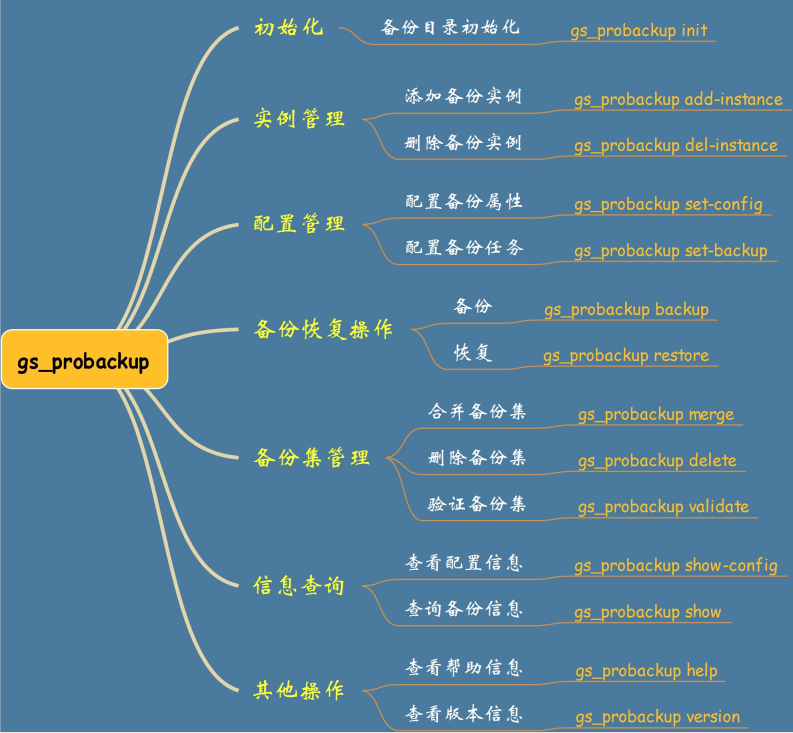

# openGauss 增量备份恢复<a name="ZH-CN_TOPIC_0000001116618875"></a>

openGauss 数据库自 2020 年 6 月 30 日发布以来，很多小伙伴都提到“openGauss 数据库是否有增量备份工具？“这么一个问题。

在 openGauss 1.0.0 版本的时候，关于这个问题的回答往往是：“Sorry…”，openGauss 数据库可以使用 gs_basebackup 工具对数据库进行物理全备份，然后通过对 WAL 日志的备份间接实现数据库的增量备份。

当 openGauss 1.1.0 版本于 2020 年 12 月 31 日发布后，有小伙伴说 openGauss 可以使用 gs_probackup 实现数据库的增量备份。\(实际上该工具应该是在 1.0.1 版本已经发布\)

本人在 openGauss 的《管理员指南》文档中并没有看到该工具，但在《openGauss 工具参考》文档的“系统内部使用的工具”章节看到了该工具的介绍。于是对该工具的使用做了简单测试，并将相关操作总结如下：

- **常见功能：**

  - 可用于备份单机数据库或者主节点数据库，为物理备份；
  - 可备份外部目录的内容，如脚本文件、配置文件、日志文件、dump 文件等；
  - 支持增量备份、定期备份和远程备份； 可设置备份的留存策略。

- **Tips：**

  若要使用 PTRACK 增量备份，需在 postgresql.conf 中手动添加参数“enable_cbm_tracking = on”。

  openGauss 可以动态跟踪页面更改。在每次更新数据页时，openGauss 都会在 PTRACK 位图中进行相应的标记。由于一个页面只需要 PTRACK fork 中的一个位，这样的位图非常小。

  跟踪意味着数据库服务器操作上的一些小开销，但会显著加快增量备份。PTRACK 的另一个优点是它为增量备份提供了页面级的粒度。

- **限制说明：**

  - 备份必须由运行数据库服务器的用户执行；
  - 备份和恢复的数据库服务器的主版本号必须相同；
  - 如果通过 ssh 在远程模式下备份数据库，需要在本地和远程主机安装相同主版本的数据库且建立 SSH 互信；
  - 远程模式下只能执行 add-instance、backup、restore 子命令；
  - 使用 restore 子命令前，应先停止 gaussdb 进程。

- **常见的操作类型：**



## 备份流程示例<a name="section12701340192620"></a>

**1. 打开参数 enable_cbm_tracking,跟踪数据页的变化**

```
mydb=# show enable_cbm_tracking;
 enable_cbm_tracking
---------------------
 off

mydb=# alter system set enable_cbm_tracking=on;
ALTER SYSTEM SET
mydb=# show enable_cbm_tracking;
 enable_cbm_tracking
---------------------
 on
```

**2. 初始化备份目录\(/home/omm/gs_bak2021\)**

```
[omm@prod ~]$ gs_probackup --version
gs_probackup (openGauss 1.1.0 build 392c0438) compiled at 2020-12-31 20:07:42 commit 0 last mr

[omm@prod ~]$ gs_probackup init -B /home/omm/gs_bak2021/
INFO: Backup catalog '/home/omm/gs_bak2021' successfully inited
[omm@prod ~]$ tree -L 3 /home/omm/gs_bak2021/
/home/omm/gs_bak2021/
├── backups
└── wal

2 directories, 0 files

## 对目录的初始化操作实际是在备份目录下创建backups/和wal/子目录，分别用于存放备份文件和WAL文件。
```

**3. 添加备份实例**

- add-instance 语法：

```
gs_probackup add-instance -B backup-path                       ## 备份路径
                          -D pgdata-path                       ## 数据目录路径
                          --instance=instance_name             ## 实例名(自定义)
                          [-E external-directories-paths]      ## 需要备份的其他目录
                          [--remote-proto=protocol]            ## 远程操作的协议(仅支持SSH)
                          [--remote-host=destination]          ## 远程主机IP或主机名
                          [--remote-path=path]                 ## 远程主机的gs_probackup安装目录
                          [--remote-user=username]             ## 远程主机SSH连接的用户
                          [--remote-port=port]                 ## 远程主机SSH连接的端口(默认22)
                          [--ssh-options=ssh_options]          ## SSH命令行参数
                          [--help]                             ## 显示帮助信息
```

- 执行示例：

```
[omm@prod ~]$ gs_probackup add-instance -B /home/omm/gs_bak2021 -D /gauss/data/db1 --instance gs_bak2021_inst
INFO: Instance 'gs_bak2021_inst' successfully inited

[omm@prod ~]$ gs_probackup show -B /home/omm/gs_bak2021/
BACKUP INSTANCE 'gs_bak2021_inst'
=================================================================================================================
 Instance  Version  ID  Recovery Time  Mode  WAL Mode  TLI  Time  Data  WAL  Zratio  Start LSN  Stop LSN  Status
=================================================================================================================
```

**4. 执行一次全量备份**

- backup 语法：

```
gs_probackup backup -B backup-path --instance=instance_name [-D pgdata-path]
    -b backup-mode                                       ## 备份模式：FULL(全量备份)/PTRACK(增量备份)
    [-C]                                                 ## -C指定检查点模式为spread(周期调度)，默认为fast快速完成
    [-S slot-name] [--temp-slot]                         ## -S指定物理复制slot名称(默认pg_probackup_slot) ,--temp-slot为WAL流处理创建临时物理复制slot，确保备份过程中所需的WAL段仍然可用
    [--backup-pg-log]                                    ## 备份日志目录(默认不备份)
    [-j threads_num]                                     ## 并行线程数
    [--progress]                                         ## 显示进度
    [--no-validate]                                      ## 完成备份后跳过自动验证
    [--skip-block-validation]                            ## 关闭块级校验，加快备份速度
    [-E external-directories-paths]                      ## 需要备份的其他目录
    [--no-sync]                                          ## 不将备份文件同步写入磁盘，提升写入性能
    [--note=text]                                        ## 备份的注释
    [--archive-timeout=timeout]                          ## 以秒为单位设置流式处理的超时时间(默认300)
    [--log-level-console=log-level-console]              ## 设置要发送到控制台的日志级别，默认为info，设置off可以关闭
    [--log-level-file=log-level-file]                    ## 设置要发送到日志文件的日志级别，默认off
    [--log-filename=log-filename]                        ## 指定要创建的日志文件的文件名(strftime模式示例：pg_probackup-%u.log),默认pg_probackup.log
    [--error-log-filename=error-log-filename]            ## error日志的日志文件名
    [--log-directory=log-directory]                      ## gs_probackup的日志目录
    [--log-rotation-size=log-rotation-size]              ## gs_probackup的日志大小(默认单位KB,支持KB、MB、GB、TB)，超过阈值后进行循环，默认0(禁用)
    [--log-rotation-age=log-rotation-age]                ## 单个日志文件的最大生命周期(默认单位min,支持ms, s, min, h, d)，默认0表示禁用基于时间的循环
    [--delete-expired]                                   ## 删除不符合pg_probackup.conf配置文件中定义的留存策略的备份
    [--delete-wal]                                       ## 删除不需要的WAL文件
    [--merge-expired]                                    ## 将满足留存策略要求的最旧的增量备份与其已过期的父备份合并
    [--retention-redundancy=retention-redundancy]        ## 留存的完整备份数(默认0,禁用此设置)
    [--retention-window=retention-window]                ## 留存的天数(默认0,禁用此设置)
    [--wal-depth=wal-depth]                              ## 每个时间轴上必须留存的执行PITR能力的最新有效备份数(默认0,禁用此设置)
    [--dry-run]                                          ## 显示所有可用备份的当前状态，不删除或合并过期备份
    [--ttl=interval]                                     ## 从恢复时间开始计算，备份要固定的时间量(支持单位：ms, s, min, h, d(默认为s))
    [--expire-time=time]                                 ## 备份固定失效的时间戳(例如：--expire-time='2020-01-01 00:00:00+03')
    [--compress-algorithm=compress-algorithm][--compress-level=compress-level][--compress]   ## 压缩参数：压缩算法(zlib/pglz/none)/压缩级别(0~9,默认1)/压缩(相当于zlib算法+1压缩级别)
    [-d dbname] [-h host] [-p port] [-U username] [-w] [-W password]                         ## 连接信息：数据库名/主机名/端口/用户/密码
    [--remote-proto=protocol] [--remote-host=destination]
    [--remote-path=path] [--remote-user=username]
    [--remote-port=port] [--ssh-options=ssh_options]
    [--help]
```

- 执行示例：

```
[omm@prod ~]$ gs_probackup backup -B /home/omm/gs_bak2021 --instance gs_bak2021_inst -b full -D /gauss/data/db1 -d mydb -p 26000 --progress \
> --log-directory=/home/omm/gs_bak2021/log  --log-rotation-size=10GB --log-rotation-age=30d  --log-level-file=info  --log-filename=full_20210111.log \
> --retention-redundancy=2 \
> --compress  \
> --note='This is full backup set.'

INFO: Backup start, gs_probackup version: 2.4.2, instance: gs_bak2021_inst, backup ID: QMR0ZE, backup mode: FULL, wal mode: STREAM, remote: false, compress-algorithm: zlib, compress-level: 1
LOG: Backup destination is initialized
WARNING: This openGauss instance was initialized without data block checksums. gs_probackup have no way to detect data block corruption without them. Reinitialize PGDATA with option '--data-checksums'.
INFO: Adding note to backup QMR0ZE: 'This is full backup set.'
LOG: Database backup start
INFO: Cannot parse path "base"
INFO: PGDATA size: 576MB
LOG: started streaming WAL at 0/F000000 (timeline 1)
 check identify system success
 send START_REPLICATION 0/F000000 success
 keepalive message is received
 keepalive message is received
INFO: Start transferring data files
INFO: Progress: (1/1652). Process file "postgresql.conf.bak"
... ...
INFO: Progress: (1652/1652). Process file "base/16388/14815"
INFO: Data files are transferred, time elapsed: 3s
INFO: wait for pg_stop_backup()
 keepalive message is received
INFO: pg_stop backup() successfully executed
LOG: stop_lsn: 0/F0001E0
LOG: Looking for LSN 0/F0001E0 in segment: 00000001000000000000000F
LOG: Found WAL segment: /home/omm/gs_bak2021/backups/gs_bak2021_inst/QMR0ZE/database/pg_xlog/00000001000000000000000F
LOG: Thread [0]: Opening WAL segment "/home/omm/gs_bak2021/backups/gs_bak2021_inst/QMR0ZE/database/pg_xlog/00000001000000000000000F"
LOG: Found LSN: 0/F0001E0
(null): not renaming 000000010000000000000010, segment is not complete.
LOG: finished streaming WAL at 0/10000140 (timeline 1)
LOG: Getting the Recovery Time from WAL
LOG: Thread [0]: Opening WAL segment "/home/omm/gs_bak2021/backups/gs_bak2021_inst/QMR0ZE/database/pg_xlog/00000001000000000000000F"
INFO: Syncing backup files to disk
INFO: Backup files are synced, time elapsed: 1s
INFO: Validating backup QMR0ZE
INFO: Progress: (1/1655). Validate file "postgresql.conf.bak"
... ...
INFO: Progress: (1655/1655). Validate file "database_map"
INFO: Backup QMR0ZE data files are valid
INFO: Backup QMR0ZE resident size: 567MB
INFO: Backup QMR0ZE completed

[omm@prod ~]$ gs_probackup show -B /home/omm/gs_bak2021/

BACKUP INSTANCE 'gs_bak2021_inst'
========================================================================================================================================
 Instance         Version  ID      Recovery Time           Mode  WAL Mode  TLI  Time   Data   WAL  Zratio  Start LSN  Stop LSN   Status
========================================================================================================================================
 gs_bak2021_inst  9.2      QMR0ZE  2021-01-11 10:45:17+08  FULL  STREAM    1/0    9s  551MB  16MB    1.05  0/F000028  0/F0001E0  OK
```

**5. 执行增量备份**

- 创建测试数据 1

```
mydb=# create table incr_bak1(name varchar(50));
CREATE TABLE
mydb=# insert into incr_bak1 values('This is the first change.');
INSERT 0 1
mydb=# select * from incr_bak1;
           name
---------------------------
 This is the first change.
```

- 执行第一次增量备份

```
[omm@prod ~]$ gs_probackup backup -B /home/omm/gs_bak2021 --instance gs_bak2021_inst -b PTRACK -D /gauss/data/db1 -d mydb -p 26000 --progress \
> --log-directory=/home/omm/gs_bak2021/log  --log-rotation-size=10GB --log-rotation-age=30d  --log-level-file=info  --log-filename=incr1_20210111.log \
> --delete-expired --delete-wal \
> --retention-redundancy=2 \
> --compress  \
> --note='This is the first incremental backup set.'
INFO: Backup start, gs_probackup version: 2.4.2, instance: gs_bak2021_inst, backup ID: QMR19V, backup mode: PTRACK, wal mode: STREAM, remote: false, compress-algorithm: zlib, compress-level: 1
LOG: Backup destination is initialized
WARNING: This openGauss instance was initialized without data block checksums. gs_probackup have no way to detect data block corruption without them. Reinitialize PGDATA with option '--data-checksums'.
INFO: Adding note to backup QMR19V: 'This is the first incremental backup set.'
LOG: Database backup start
LOG: Latest valid FULL backup: QMR0ZE
INFO: Parent backup: QMR0ZE
INFO: Cannot parse path "base"
INFO: PGDATA size: 576MB
LOG: Current tli: 1
LOG: Parent start_lsn: 0/F000028
LOG: start_lsn: 0/11000028
INFO: Extracting pagemap of changed blocks
LOG: started streaming WAL at 0/11000000 (timeline 1)
 check identify system success
 send START_REPLICATION 0/11000000 success
 keepalive message is received
 keepalive message is received
INFO: Pagemap successfully extracted, time elapsed: 0 sec
INFO: Start transferring data files
INFO: Progress: (1/1653). Process file "postgresql.conf.bak"
... ...
INFO: Progress: (1653/1653). Process file "base/16388/14737_vm"
INFO: Data files are transferred, time elapsed: 0
 keepalive message is received
INFO: wait for pg_stop_backup()
INFO: pg_stop backup() successfully executed
LOG: stop_lsn: 0/110002F8
LOG: Looking for LSN 0/110002F8 in segment: 000000010000000000000011
LOG: Found WAL segment: /home/omm/gs_bak2021/backups/gs_bak2021_inst/QMR19V/database/pg_xlog/000000010000000000000011
LOG: Thread [0]: Opening WAL segment "/home/omm/gs_bak2021/backups/gs_bak2021_inst/QMR19V/database/pg_xlog/000000010000000000000011"
LOG: Found LSN: 0/110002F8
(null): not renaming 000000010000000000000012, segment is not complete.
LOG: finished streaming WAL at 0/12000140 (timeline 1)
LOG: Getting the Recovery Time from WAL
LOG: Thread [0]: Opening WAL segment "/home/omm/gs_bak2021/backups/gs_bak2021_inst/QMR19V/database/pg_xlog/000000010000000000000011"
INFO: Syncing backup files to disk
INFO: Backup files are synced, time elapsed: 1s
INFO: Validating backup QMR19V
INFO: Progress: (1/1656). Validate file "postgresql.conf.bak"
... ...
INFO: Progress: (1656/1656). Validate file "database_map"
INFO: Backup QMR19V data files are valid
INFO: Backup QMR19V resident size: 289MB
INFO: Backup QMR19V completed
LOG: REDUNDANCY=2
INFO: Evaluate backups by retention
INFO: Backup QMR19V, mode: PTRACK, status: OK. Redundancy: 1/2, Time Window: 0d/0d. Active
INFO: Backup QMR0ZE, mode: FULL, status: OK. Redundancy: 1/2, Time Window: 0d/0d. Active
INFO: There are no backups to merge by retention policy
INFO: There are no backups to delete by retention policy
INFO: There is no WAL to purge by retention policy

[omm@prod gs_bak2021]$ gs_probackup show -B /home/omm/gs_bak2021/

BACKUP INSTANCE 'gs_bak2021_inst'
============================================================================================================================================
 Instance         Version  ID      Recovery Time           Mode    WAL Mode  TLI  Time   Data   WAL  Zratio  Start LSN   Stop LSN    Status
============================================================================================================================================
 gs_bak2021_inst  9.2      QMR19V  2021-01-11 10:51:31+08  PTRACK  STREAM    1/1    5s  273MB  16MB    0.94  0/11000028  0/110002F8  OK
 gs_bak2021_inst  9.2      QMR0ZE  2021-01-11 10:45:17+08  FULL    STREAM    1/0    9s  551MB  16MB    1.05  0/F000028   0/F0001E0   OK
```

- 创建测试数据 2

```
mydb=# create table incr_bak2(name varchar(50));
CREATE TABLE
mydb=# insert into incr_bak2 values('This is the second change.');
INSERT 0 1
mydb=# select * from incr_bak2;
            name
----------------------------
 This is the second change.
```

- 执行第二次增量备份

```
[omm@prod ~]$ gs_probackup backup -B /home/omm/gs_bak2021 --instance gs_bak2021_inst -b PTRACK -D /gauss/data/db1 -d mydb -p 26000 --progress \
> --log-directory=/home/omm/gs_bak2021/log  --log-rotation-size=10GB --log-rotation-age=30d  --log-level-file=info  --log-filename=incr2_20210111.log \
> --delete-expired --delete-wal \
> --retention-redundancy=2 \
> --compress  \
> --note='This is the second incremental backup set.'
INFO: Backup start, gs_probackup version: 2.4.2, instance: gs_bak2021_inst, backup ID: QMR1J4, backup mode: PTRACK, wal mode: STREAM, remote: false, compress-algorithm: zlib, compress-level: 1
LOG: Backup destination is initialized
WARNING: This openGauss instance was initialized without data block checksums. gs_probackup have no way to detect data block corruption without them. Reinitialize PGDATA with option '--data-checksums'.
INFO: Adding note to backup QMR1J4: 'This is the second incremental backup set.'
LOG: Database backup start
LOG: Latest valid FULL backup: QMR0ZE
INFO: Parent backup: QMR19V
INFO: Cannot parse path "base"
INFO: PGDATA size: 576MB
LOG: Current tli: 1
LOG: Parent start_lsn: 0/11000028
LOG: start_lsn: 0/15000028
INFO: Extracting pagemap of changed blocks
LOG: started streaming WAL at 0/15000000 (timeline 1)
 check identify system success
 send START_REPLICATION 0/15000000 success
 keepalive message is received
 keepalive message is received
INFO: Pagemap successfully extracted, time elapsed: 0 sec
INFO: Start transferring data files
INFO: Progress: (1/1654). Process file "postgresql.conf.bak"
... ...(开始传输数据)
INFO: Progress: (1654/1654). Process file "base/16388/15093"
INFO: Data files are transferred, time elapsed: 1s
 keepalive message is received
INFO: wait for pg_stop_backup()
INFO: pg_stop backup() successfully executed
LOG: stop_lsn: 0/150002F8
LOG: Looking for LSN 0/150002F8 in segment: 000000010000000000000015
LOG: Found WAL segment: /home/omm/gs_bak2021/backups/gs_bak2021_inst/QMR1J4/database/pg_xlog/000000010000000000000015
LOG: Thread [0]: Opening WAL segment "/home/omm/gs_bak2021/backups/gs_bak2021_inst/QMR1J4/database/pg_xlog/000000010000000000000015"
LOG: Found LSN: 0/150002F8
(null): not renaming 000000010000000000000016, segment is not complete.
LOG: finished streaming WAL at 0/16000140 (timeline 1)
LOG: Getting the Recovery Time from WAL
LOG: Thread [0]: Opening WAL segment "/home/omm/gs_bak2021/backups/gs_bak2021_inst/QMR1J4/database/pg_xlog/000000010000000000000015"
INFO: Syncing backup files to disk
INFO: Backup files are synced, time elapsed: 1s
INFO: Validating backup QMR1J4
... ...(验证备份有效性)
INFO: Backup QMR1J4 data files are valid
INFO: Backup QMR1J4 resident size: 289MB
INFO: Backup QMR1J4 completed
LOG: REDUNDANCY=2
INFO: Evaluate backups by retention
INFO: Backup QMR1J4, mode: PTRACK, status: OK. Redundancy: 1/2, Time Window: 0d/0d. Active
INFO: Backup QMR19V, mode: PTRACK, status: OK. Redundancy: 1/2, Time Window: 0d/0d. Active
INFO: Backup QMR0ZE, mode: FULL, status: OK. Redundancy: 1/2, Time Window: 0d/0d. Active
INFO: There are no backups to merge by retention policy
INFO: There are no backups to delete by retention policy
INFO: There is no WAL to purge by retention policy

[omm@prod ~]$ gs_probackup show -B /home/omm/gs_bak2021/

BACKUP INSTANCE 'gs_bak2021_inst'
============================================================================================================================================
 Instance         Version  ID      Recovery Time           Mode    WAL Mode  TLI  Time   Data   WAL  Zratio  Start LSN   Stop LSN    Status
============================================================================================================================================
 gs_bak2021_inst  9.2      QMR1J4  2021-01-11 10:57:05+08  PTRACK  STREAM    1/1    5s  273MB  16MB    0.94  0/15000028  0/150002F8  OK
 gs_bak2021_inst  9.2      QMR19V  2021-01-11 10:51:31+08  PTRACK  STREAM    1/1    5s  273MB  16MB    0.94  0/11000028  0/110002F8  OK
 gs_bak2021_inst  9.2      QMR0ZE  2021-01-11 10:45:17+08  FULL    STREAM    1/0    9s  551MB  16MB    1.05  0/F000028   0/F0001E0   OK
```

**6. 模拟“删库”，但不跑路**

```
-- 删除数据库mydb
postgres=# drop database mydb;
DROP DATABASE

-- 删除表t1(数据库postgres)
postgres=# \d
                        List of relations
 Schema | Name | Type  | Owner |             Storage
--------+------+-------+-------+----------------------------------
 public | t1   | table | omm   | {orientation=row,compression=no}
 public | test | table | omm   | {orientation=row,compression=no}

postgres=# drop table t1;
DROP TABLE
postgres=# \d
                        List of relations
 Schema | Name | Type  | Owner |             Storage
--------+------+-------+-------+----------------------------------
 public | test | table | omm   | {orientation=row,compression=no}
```

**7. 增量恢复测试**

- restore 语法：

```
gs_probackup restore -B backup-path --instance=instance_name
                 [-D pgdata-path] [-i backup-id] [-j threads_num] [--progress]
                 [--force]                                 ## 允许从损坏的或无效的备份中恢复数据(慎用)
                 [--no-sync]                               ## 不同步写入磁盘,以提升恢复效率
                 [--no-validate] [--skip-block-validation] ## 跳过备份验证/跳过块级验证(仅做文件级别验证)
                 [--external-mapping=OLDDIR=NEWDIR]        ## 恢复时重新指定目录OLDIR为NEWDIR
                 [-T OLDDIR=NEWDIR]                        ## 与--external-mapping配合使用,重新指定表空间路径(将表空间路径OLDDIR改为NEWDIR)
                 [--skip-external-dirs]                    ## 不恢复备份文件中--external-dirs选项所指定的外部目录
                 [-I incremental_mode]                     ## 增量模式none|checksum|lsn,默认none
                 [--recovery-target-time=time              ## 指定恢复的目标time(只能指定备份信息内的recovery-time) , 备份信息使用gs_probackup show查看
                 |--recovery-target-xid=xid                ## 指定恢复的目标xid(只能指定备份信息内的recovery-xid)
                 |--recovery-target-lsn=lsn                ## 指定恢复的目标lsn(只能指定备份信息内的stop-lsn)
                 |--recovery-target-name=target-name]      ## 指定恢复的目标保存点(只能指定备份信息内的recovery-name)
                 [--recovery-target-inclusive=boolean]     ## true(恢复目标将包括指定的内容) | false(恢复目标将不包括指定的内容),与以上recovery-target配合使用
                 [--remote-proto=protocol] [--remote-host=destination][--remote-path=path] [--remote-user=username][--remote-port=port] [--ssh-options=ssh_options] ## 远程连接信息
                 [--log-level-console=log-level-console]
                 [--log-level-file=log-level-file]
                 [--log-filename=log-filename]
                 [--error-log-filename=error-log-filename]
                 [--log-directory=log-directory]
                 [--log-rotation-size=log-rotation-size]
                 [--log-rotation-age=log-rotation-age]
                 [--help]
## 其他参数介绍参考前面的 gs_probackup backup语法介绍.
```

删除整个数据库目录\(database cluster\)

```
[omm@prod ~]$ gs_ctl stop -D /gauss/data/db1/
[2021-01-11 11:47:39.259][2211][][gs_ctl]: gs_ctl stopped ,datadir is /gauss/data/db1
waiting for server to shut down............. done
server stopped
[omm@prod ~]$ rm -fr /gauss/data/db1/
```

执行全量恢复并验证数据

```
## 全量恢复
[omm@prod ~]$ gs_probackup restore -B /home/omm/gs_bak2021/ --instance=gs_bak2021_inst -D /gauss/data/db1 -i QMR0ZE --progress -j 4    ##  -i指定备份文件ID，QMR0ZE即为全备的ID
LOG: Restore begin.
LOG: check tablespace directories of backup QMR0ZE
LOG: check external directories of backup QMR0ZE
... ...
大致流程：
1. 校验备份集QMR0ZE的有效性
2. 校验备份集QMR0ZE中WAL segments的有效性
3. 开始恢复数据(Restoring the database from backup at 2021-01-11 10:45:14+08)
INFO: Start restoring backup files. PGDATA size: 592MB
LOG: Start thread 1
LOG: Start thread 2
LOG: Start thread 3
LOG: Start thread 4
... ...
INFO: Syncing restored files to disk
INFO: Restored backup files are synced, time elapsed: 5s
INFO: Restore of backup QMR0ZE completed.

## 验证数据正常(全备时刻，不包含表incr_bak1和incr_bak2)
[omm@prod ~]$ gs_ctl start -D /gauss/data/db1
[omm@prod ~]$ gsql -d mydb -p 26000 -r
gsql ((openGauss 1.1.0 build 392c0438) compiled at 2020-12-31 20:07:42 commit 0 last mr  )
Non-SSL connection (SSL connection is recommended when requiring high-security)
Type "help" for help.

mydb=# \d
                                List of relations
 Schema |   Name   |       Type        | Owner |             Storage
--------+----------+-------------------+-------+----------------------------------
 public | dept     | table             | omm   | {orientation=row,compression=no}
 public | emp      | table             | omm   | {orientation=row,compression=no}
 public | mv_emp   | materialized view | omm   |
 public | salgrade | table             | omm   | {orientation=row,compression=no}
 public | seq1     | sequence          | omm   |
 public | v_emp    | view              | omm   |
```

执行全量+第一次增量恢复测试并验证数据\( restore 操作要求数据目录必须为空 \)

```
[omm@prod ~]$ gs_probackup restore -B /home/omm/gs_bak2021/ --instance=gs_bak2021_inst -D /gauss/data/db1 -i QMR19V --progress  ##  -i指定备份文件ID，QMR19V即第一次增备的ID
LOG: Restore begin.
LOG: check tablespace directories of backup QMR19V
LOG: check external directories of backup QMR19V
... ...
大致流程：
1. 校验备份集(QMR0ZE/QMR19V)的有效性;
2. 验证备份集QMR19V中的WAL segments的有效性(本次测试验证的WAL日志是000000010000000000000011);
3. 开始恢复数据库(Restoring the database from backup at 2021-01-11 10:51:31+08)
... ...
INFO: Syncing restored files to disk
INFO: Restored backup files are synced, time elapsed: 5s
INFO: Restore of backup QMR19V completed.

## 验证数据正常(全备+1次增备包含表incr_bak1,但不包含表incr_bak2)
[omm@prod ~]$ gs_ctl start -D /gauss/data/db1/
[omm@prod ~]$ gsql -d mydb -p 26000 -r
gsql ((openGauss 1.1.0 build 392c0438) compiled at 2020-12-31 20:07:42 commit 0 last mr  )
Non-SSL connection (SSL connection is recommended when requiring high-security)
Type "help" for help.

mydb=# \d
                                 List of relations
 Schema |   Name    |       Type        | Owner |             Storage
--------+-----------+-------------------+-------+----------------------------------
 public | dept      | table             | omm   | {orientation=row,compression=no}
 public | emp       | table             | omm   | {orientation=row,compression=no}
 public | incr_bak1 | table             | omm   | {orientation=row,compression=no}
 public | mv_emp    | materialized view | omm   |
 public | salgrade  | table             | omm   | {orientation=row,compression=no}
 public | seq1      | sequence          | omm   |
 public | v_emp     | view              | omm   |

mydb=# select * from incr_bak1;
           name
---------------------------
 This is the first change.
```

执行全量+两次增量恢复测试并验证数据\( restore 操作要求数据目录必须为空 \)

```
[omm@prod ~]$ gs_probackup restore -B /home/omm/gs_bak2021/ --instance=gs_bak2021_inst -D /gauss/data/db1 -i QMR1J4 --progress   ##  -i指定备份文件ID，QMR1J4即第二次增备的ID
LOG: Restore begin.
LOG: check tablespace directories of backup QMR1J4
LOG: check external directories of backup QMR1J4
INFO: Validating parents for backup QMR1J4
WARNING: Process 2449 which used backup QMR0ZE no longer exists
... ...
大致流程：
1. 校验备份集(QMR0ZE/QMR19V/QMR1J4)的有效性;
2. 还原备份集(Restoring the database from backup at 2021-01-11 10:57:04+08)
... ...
INFO: Syncing restored files to disk
INFO: Restored backup files are synced, time elapsed: 4s
INFO: Restore of backup QMR1J4 completed.


## 验证数据正常(全备+2次增备包含表incr_bak1和incr_bak2)
[omm@prod ~]$ gs_ctl start -D /gauss/data/db1/
[omm@prod ~]$ gsql -d mydb -p 26000 -r
gsql ((openGauss 1.1.0 build 392c0438) compiled at 2020-12-31 20:07:42 commit 0 last mr  )
Non-SSL connection (SSL connection is recommended when requiring high-security)
Type "help" for help.

mydb=# \d
                                 List of relations
 Schema |   Name    |       Type        | Owner |             Storage
--------+-----------+-------------------+-------+----------------------------------
 public | dept      | table             | omm   | {orientation=row,compression=no}
 public | emp       | table             | omm   | {orientation=row,compression=no}
 public | incr_bak1 | table             | omm   | {orientation=row,compression=no}
 public | incr_bak2 | table             | omm   | {orientation=row,compression=no}
 public | mv_emp    | materialized view | omm   |
 public | salgrade  | table             | omm   | {orientation=row,compression=no}
 public | seq1      | sequence          | omm   |
 public | v_emp     | view              | omm   |

mydb=# select * from incr_bak1,incr_bak2;
           name            |            name
---------------------------+----------------------------
 This is the first change. | This is the second change.
```

## 其他示例<a name="section1893815159539"></a>

- **备份集详细信息查询**

```
[omm@prod log]$ gs_probackup show -B /home/omm/gs_bak2021/ --instance=gs_bak2021_inst -i QMR0ZE
#Configuration
backup-mode = FULL
stream = true
compress-alg = zlib
compress-level = 1
from-replica = false

#Compatibility
block-size = 8192
xlog-block-size = 8192
checksum-version = 0
program-version = 2.4.2
server-version = 9.2

#Result backup info
timelineid = 1
start-lsn = 0/F000028
stop-lsn = 0/F0001E0
start-time = '2021-01-11 10:45:14+08'
end-time = '2021-01-11 10:45:23+08'
recovery-xid = 16547
recovery-time = '2021-01-11 10:45:17+08'
recovery-name = 'backup QMR0ZE'
data-bytes = 577690814
wal-bytes = 16777216
uncompressed-bytes = 604023922
pgdata-bytes = 604023922
status = OK
note = 'This is full backup set.'
content-crc = 825608417
```

- **删除备份实例**

```
## 语法详见：gs_probackup del-instance --help
gs_probackup del-instance -B /home/omm/gs_bak2021/ -D /gauss/data/db1/ --instance=gs_bak2021_inst
```

- **删除备份集**

```
## 语法详见：gs_probackup delete --help
gs_probackup delete -B /home/omm/gs_bak2021/ --instance=gs_bak2021_inst -i QMR0OF
```

- **合并备份集 \(语法介绍：gs_probackup merge --help\)**

```
[omm@prod ~]$ gs_probackup show -B /home/omm/gs_bak2021/

BACKUP INSTANCE 'gs_bak2021_inst'
============================================================================================================================================
 Instance         Version  ID      Recovery Time           Mode    WAL Mode  TLI  Time   Data   WAL  Zratio  Start LSN   Stop LSN    Status
============================================================================================================================================
 gs_bak2021_inst  9.2      QMR1J4  2021-01-11 10:57:05+08  PTRACK  STREAM    1/1    5s  273MB  16MB    0.94  0/15000028  0/150002F8  OK
 gs_bak2021_inst  9.2      QMR19V  2021-01-11 10:51:31+08  PTRACK  STREAM    1/1    5s  273MB  16MB    0.94  0/11000028  0/110002F8  OK
 gs_bak2021_inst  9.2      QMR0ZE  2021-01-11 10:45:17+08  FULL    STREAM    1/0    9s  551MB  16MB    1.05  0/F000028   0/F0001E0   OK


[omm@prod ~]$ gs_probackup merge -B /home/omm/gs_bak2021/ --instance=gs_bak2021_inst -i QMR1J4 --progress
INFO: Merge started
WARNING: Process 2591 which used backup QMR0ZE no longer exists
WARNING: Process 2591 which used backup QMR19V no longer exists
WARNING: Process 2527 which used backup QMR1J4 no longer exists
INFO: Merging backup QMR1J4 with parent chain
... ...
大致流程：
1. 校验备份集QMR0ZE/QMR19V/QMR1J4
2. 合并备份集QMR1J4和QMR19V至备份集QMR0ZE(合并至全备)
3. 删除备份集QMR19V和QMR1J4(删除增备)
4. 重命名QMR0ZE为QMR1J4 (将原先全备的备份ID重命名为最近的刚被删除的那个增备ID：QMR1J4)
5. 校验新的备份集QMR1J4数据文件是否有效
... ...
INFO: Merge of backup QMR1J4 completed


## 合并结束 (新备份集QMR1J4与原备份集QMR1J4的备份信息相同)
[omm@prod ~]$ gs_probackup show -B /home/omm/gs_bak2021/

BACKUP INSTANCE 'gs_bak2021_inst'
==========================================================================================================================================
 Instance         Version  ID      Recovery Time           Mode  WAL Mode  TLI  Time   Data   WAL  Zratio  Start LSN   Stop LSN    Status
==========================================================================================================================================
 gs_bak2021_inst  9.2      QMR1J4  2021-01-11 10:57:05+08  FULL  STREAM    1/0   10s  829MB  16MB    1.10  0/15000028  0/150002F8  OK
```

- **验证备份集是否有效 \(语法介绍：gs_probackup validate --help\)**

```
[omm@prod database]$ gs_probackup validate -B /home/omm/gs_bak2021/ --instance=gs_bak2021_inst -i QMRGCU
LOG: Validate begin.
INFO: Validating parents for backup QMRGCU
WARNING: Process 2864 which used backup QMR1J4 no longer exists
INFO: Validating backup QMR1J4
INFO: Backup QMR1J4 data files are valid
WARNING: Process 2864 which used backup QMRGCU no longer exists
INFO: Validating backup QMRGCU
INFO: Backup QMRGCU data files are valid
LOG: Thread [1]: Opening WAL segment "/home/omm/gs_bak2021/backups/gs_bak2021_inst/QMRGCU/database/pg_xlog/000000010000000000000019"
INFO: Backup QMRGCU WAL segments are valid
INFO: Backup QMRGCU is valid.
INFO: Validate of backup QMRGCU completed.
```

- **gs_probackup 配置**

```
## 配置文件主要包含2类：
# 1. 备份实例目录下的pg_probackup.conf文件(指定备份时使用的相关参数)
# 2. 备份集目录下的backup.control文件(描述备份集的属性信息)

# 语法：
gs_probackup set-backup -B backup-path --instance=instance_name -i backup-id
             [--note=text]         ## 备份集的注释
             [--ttl=interval]      ## 备份集有效期(单位： 'ms', 's', 'min', 'h', 'd' (默认: s))    -- 与--expire-time互斥
             [--expire-time=time]  ## 备份集的失效日期(如：'2021-10-01 00:00:00+08')               -- 与--ttl互斥

gs_probackup set-config -B backup-path --instance=instance_name
                 [-D pgdata-path] [-E external-directories-paths]
                 [--archive-timeout=timeout]
                 [--retention-redundancy=retention-redundancy]
                 [--retention-window=retention-window]
                 [--wal-depth=wal-depth]
                 [--compress-algorithm=compress-algorithm]
                 [--compress-level=compress-level]
                 [-d dbname] [-h host] [-p port] [-U username]
                 [--log-level-console=log-level-console]
                 [--log-level-file=log-level-file]
                 [--log-filename=log-filename]
                 [--error-log-filename=error-log-filename]
                 [--log-directory=log-directory]
                 [--log-rotation-size=log-rotation-size]
                 [--log-rotation-age=log-rotation-age]
                 [--remote-proto=protocol] [--remote-host=destination]
                 [--remote-path=path] [--remote-user=username]
                 [--remote-port=port] [--ssh-options=ssh_options]
## gs_probackup set-config 的参数均是前面备份时使用的参数，这里就不做详细解释

## 示例：
[omm@prod ~]$ gs_probackup set-backup -B /home/omm/gs_bak2021 --instance=gs_bak2021_inst -i QMRIA3 --note=incr_bak2 --ttl=10d
INFO: Backup QMRIA3 is pinned until '2021-01-21 16:58:52+08'
INFO: Adding note to backup QMRIA3: 'incr_bak2'

[omm@prod ~]$ gs_probackup set-config -B /home/omm/gs_bak2021 --instance=gs_bak2021_inst -D /gauss/data/db1 \
> --retention-redundancy=2 --compress-algorithm=zlib --compress-level=6 \
> --log-filename='pg_probackup-%Y-%m-%d_%H%M%S.log' \
> --log-directory=/home/omm/gs_bak2021 --log-rotation-size=1GB

## 查看配置文件
[omm@prod ~]$ cat /home/omm/gs_bak2021/backups/gs_bak2021_inst/pg_probackup.conf
# Backup instance information
pgdata = /gauss/data/db1
system-identifier = 18020659335453983985
# Logging parameters
log-filename = pg_probackup-%Y-%m-%d_%H%M%S.log
log-directory = /home/omm/gs_bak2021
log-rotation-size = 1GB
# Retention parameters
retention-redundancy = 2
# Compression parameters
compress-algorithm = zlib
compress-level = 6

[omm@prod ~]$ cat /home/omm/gs_bak2021/backups/gs_bak2021_inst/QMRIA3/backup.control
#Configuration
backup-mode = PTRACK
stream = true
compress-alg = none
compress-level = 1
from-replica = false

#Compatibility
block-size = 8192
xlog-block-size = 8192
checksum-version = 0
program-version = 2.4.2
server-version = 9.2

#Result backup info
timelineid = 1
start-lsn = 0/27000028
stop-lsn = 0/270002F8
start-time = '2021-01-11 16:58:51+08'
end-time = '2021-01-11 16:59:00+08'
recovery-xid = 20900
recovery-time = '2021-01-11 16:58:52+08'
expire-time = '2021-01-21 16:58:52+08'
recovery-name = 'backup QMRIA3'
data-bytes = 565410682
wal-bytes = 16777216
uncompressed-bytes = 548633410
pgdata-bytes = 592746818
status = OK
parent-backup-id = 'QMRHIA'
note = 'incr_bak2'
content-crc = 1055823518
```

- **远程连接备份**

```
## Server端用户及权限配置
postgres=# create user rep1 with sysadmin replication identified by 'gauss@123';  --rep1权限：sysadmin+replication
CREATE ROLE
postgres=# \du rep1
                 List of roles
 Role name |      Attributes       | Member of
-----------+-----------------------+-----------
 rep1      | Replication, Sysadmin | {}

[omm@prod ~]$ gs_guc reload -N all -I all -h "host all all 192.168.0.12/32 sha256"    ## 放开客户端对server端的连接
[omm@prod ~]$ gs_guc reload -N all -I all -h "host replication rep1 192.168.0.12/32 sha256"    ## 放开rep1用户对server端的replication权限
[omm@stb1 ~]$ ssh-copy-id 192.168.0.12          ## 配置SSH互信
[omm@stb1 ~]$ ssh-copy-id stb1.opengauss.com    ## 配置SSH互信


## 备份客户端配置
1. SSH互信
[omm@stb1 ~]$ ssh-copy-id 192.168.0.11          ## 配置SSH互信
[omm@stb1 ~]$ ssh-copy-id prod.opengauss.com    ## 配置SSH互信

2. 初始化
[omm@stb1 ~]$ mkdir -p /home/omm/gs_bak/
[omm@stb1 ~]$ gs_probackup init -B /home/omm/gs_bak
INFO: Backup catalog '/home/omm/gs_bak' successfully inited

3. 添加实例
[omm@stb1 ~]$ gs_probackup add-instance -B /home/omm/gs_bak -D /gauss/data/db1 --instance='remote_prod'  \
> --remote-host=192.168.0.11  \       ## 远程Server主机
> --remote-port=22 \		      ## 远程连接端口(默认22端口)
> --remote-proto=ssh \                ## 远程连接协议(默认ssh)
> --remote-path=/gauss/app/bin \      ## 远程Server主机的gs_probackup程序所在目录
> --remote-user=omm                   ## 远程ssh连接所使用的操作系统用户
LOG: Start SSH client process, pid 1714
INFO: Instance 'remote_prod' successfully inited

4. 执行远程备份
[omm@stb1 ~]$ gs_probackup backup -B /home/omm/gs_bak --instance=remote_prod -b full -D /gauss/data/db1 \
> -h 192.168.0.11 -p 26000 -d postgres -U rep1 -W gauss@123 \
> --remote-host=192.168.0.11 --remote-proto=ssh --remote-port=22 --remote-user=omm --remote-path=/gauss/app/bin
INFO: Backup start, gs_probackup version: 2.4.2, instance: remote_prod, backup ID: QMSXKL, backup mode: FULL, wal mode: STREAM, remote: true, compress-algorithm: none, compress-level: 1
LOG: Backup destination is initialized
WARNING: This openGauss instance was initialized without data block checksums. gs_probackup have no way to detect data block corruption without them. Reinitialize PGDATA with option '--data-checksums'.
LOG: Start SSH client process, pid 1751
LOG: Database backup start
LOG: started streaming WAL at 0/2D000000 (timeline 1)
 check identify system success
 send START_REPLICATION 0/2D000000 success
 keepalive message is received
 keepalive message is received
LOG: SSH process 1751 is terminated with status 0
INFO: PGDATA size: 566MB
INFO: Start transferring data files
LOG: Start SSH client process, pid 1756
LOG: Creating page header map "/home/omm/gs_bak/backups/remote_prod/QMSXKL/page_header_map"
 keepalive message is received
LOG: SSH process 1756 is terminated with status 0
INFO: Data files are transferred, time elapsed: 6s
 keepalive message is received
 keepalive message is received
INFO: wait for pg_stop_backup()
INFO: pg_stop backup() successfully executed
LOG: stop_lsn: 0/2D0001E0
LOG: Looking for LSN 0/2D0001E0 in segment: 00000001000000000000002D
LOG: Found WAL segment: /home/omm/gs_bak/backups/remote_prod/QMSXKL/database/pg_xlog/00000001000000000000002D
LOG: Thread [0]: Opening WAL segment "/home/omm/gs_bak/backups/remote_prod/QMSXKL/database/pg_xlog/00000001000000000000002D"
LOG: Found LSN: 0/2D0001E0
(null): not renaming 00000001000000000000002E, segment is not complete.
LOG: finished streaming WAL at 0/2E000140 (timeline 1)
LOG: Getting the Recovery Time from WAL
LOG: Thread [0]: Opening WAL segment "/home/omm/gs_bak/backups/remote_prod/QMSXKL/database/pg_xlog/00000001000000000000002D"
INFO: Syncing backup files to disk
INFO: Backup files are synced, time elapsed: 1s
INFO: Validating backup QMSXKL
INFO: Backup QMSXKL data files are valid
INFO: Backup QMSXKL resident size: 598MB
INFO: Backup QMSXKL completed

[omm@stb1 ~]$ gs_probackup show -B /home/omm/gs_bak/

BACKUP INSTANCE 'remote_prod'
======================================================================================================================================
 Instance     Version  ID      Recovery Time           Mode  WAL Mode  TLI  Time   Data   WAL  Zratio  Start LSN   Stop LSN    Status
======================================================================================================================================
 remote_prod  9.2      QMSXKL  2021-01-12 11:26:52+08  FULL  STREAM    1/0   11s  582MB  16MB    0.97  0/2D000028  0/2D0001E0  OK
[omm@stb1 ~]$ du -sh /home/omm/gs_bak/
602M    /home/omm/gs_bak/
```

## 小结<a name="section139001713319"></a>

1.  使用 gs_probackup 时，需要通过-d 指定备份时连接的数据库，否则默认会使用和当前用户同名的数据库，这样会因为这个数据库不存在而导致报错；
2.  从备份文件看，gs_probackup 工具属于物理备份，虽然备份时需要连接特定的数据库，但是实际上备份的是整个 database cluster；
3.  增量恢复时，gs_probackup 会验证所有所需的全备和增备文件，然后根据全备+增备文件顺序恢复，用户仅需要指定恢复目标\(增备文件 ID/stop lsn 等 recovery_target\)即可；
4.  部分介绍可以参考 pg 的资料https://postgrespro.com/docs/postgrespro/9.6/app-pgprobackup个人感觉gs\_probackup工具和Oracle 的 RMAN 有点相似，但在功能上、灵活程度、备份的可靠性等方面与 RMAN 还是有一些差距的，期待 openGauss 能有所完善。

openGauss 的备份工具目前已有 gs_probackup、gs_backup、gs_basebackup、gs_dump、gs_dumpall，种类较多且适用场景不同，期待内核研发的大佬们将来能对这些工具做适当调整和融合，简化使用的复杂度。

openGauss 文档有部分参数描述不够详细，这个大家可以参考 pg 的文档：https://postgrespro.com/docs/postgrespro/9.6/app-pgprobackup
