# openGauss 的 WDR 报告详细解读

openGauss 数据库自 2020 年 6 月 30 日开源至今已有 10 个月了，在这短短的 10 个月内，openGauss 社区用户下载量已达 13W+、issue 合并 2000+、发行商业版本 6 个。仅 3 月份就有 11 家企业完成 CLA 签署，包括虚谷伟业、云和恩墨、优炫软件、海量数据、柏睿数据、快立方，电信天翼云、东方通、宝兰德、新数科技、深信服，正式加入 openGauss 社区，越来越多的力量参与到社区建设中。4 月 24 日，openGauss 社区理事会筹备会议在深圳大学城召开，邀请到国内著名的数据库技术方向上的多个公司、组织和机构，包括华为、招商银行、中国电信、云和恩墨、海量数据、人大金仓、神舟通用、虚谷伟业、快立方、亚信、超图软件、深信服、哈工大等机构参与，为 openGauss 社区开放治理迈出了新的一步。
openGauss 数据库在经历 1.0.0/1.0.1/1.1.0 三个版本的迭代发布后，于 2021 年 3 月 31 日发布 openGauss 2.0.0 版本，这是 openGauss 社区发布的第一个 Release 版本。深度融合华为在数据库领域多年的经验，结合企业级场景需求，持续构建竞争力特性。
作为一名从 Oracle DBA 转 openGauss 相关工作的“IT 攻城狮”，在遇到性能诊断时念念不忘的还是以前经常使用的 AWR 报告，通过这份报告，DBA 可以较为全面的分析出数据库的性能问题所在范围、为下一步的数据库性能优化和故障诊断提供有力支撑。很高兴在 openGauss 数据库中也看到了类似的功能，那就是 openGauss 的**WDR 报告**。
本文针对 openGauss 2.0.0 的 WDR 报告进行详细解读，帮助大家梳理 WDR 报告的数据来源以及相关含义，以便在 openGauss 数据库的性能诊断工作中游刃有余。关于性能调优操作方法，由于涉及内容较多，这里就不再复述，再写下去就该被老板炒鱿鱼了。openGauss 数据库归根结底，它的本质还是数据库软件，主流的数据库调优方法在 openGauss 数据库中也基本适用，大家仁者见仁、智者见智，根据 WDR 报告结合自己已有的数据库调优方法，完全可以满足 openGauss 绝大多数的性能调优工作。

## 干货内容如下：

### 1. 启用 WDR 报告的 snapshot 收集

```
$ gs_guc reload -N all -I all -c "enable_wdr_snapshot=on"
postgres=# select name,setting from pg_settings where name like '%wdr%';
            name             | setting
-----------------------------+---------
 enable_wdr_snapshot         | on      -- 开启数据库监控快照功能
 wdr_snapshot_interval       | 60      -- 后台Snapshot线程执行监控快照的时间间隔
 wdr_snapshot_query_timeout  | 100     -- 快照操作相关的sql语句的执行超时时间
 wdr_snapshot_retention_days | 8       -- 系统中数据库监控快照数据的保留天数
```

### 2. WDR 信息表

**1> snapshot.snapshot** 【记录当前系统中存储的 WDR 快照信息】

```
postgres=# \d snapshot.snapshot
             Table "snapshot.snapshot"
   Column    |           Type           | Modifiers
-------------+--------------------------+-----------
 snapshot_id | bigint                   | not null    -- WDR快照序列号
 start_ts    | timestamp with time zone |             -- WDR快照的开始时间
 end_ts      | timestamp with time zone |             -- WDR快照的结束时间
```

**2> snapshot.tables_snap_timestamp**【记录所有表的 WDR 快照信息】

```
postgres=# \d snapshot.tables_snap_timestamp
       Table "snapshot.tables_snap_timestamp"
   Column    |           Type           | Modifiers
-------------+--------------------------+-----------
 snapshot_id | bigint                   | not null    -- WDR快照序列号
 db_name     | text                     |             -- WDR snapshot对应的database
 tablename   | text                     |             -- WDR snasphot对应的table
 start_ts    | timestamp with time zone |             -- WDR快照的开始时间
 end_ts      | timestamp with time zone |             -- WDR快照的结束时间
```

### 3. WDR 数据表

说明：WDR 的数据表保存在 snapshot 这个 schema 下以 snap\_开头的表，其数据来源于 dbe_perf 这个 schema 内的视图

```
postgres=# select relname from pg_class where relname like '%snap_%';
----------------------------------------------------------------------------------------------------------------
snapshot.tables_snap_timestamp                      -- 记录所有存储的WDR快照中数据库、表对象、数据采集的开始、结束时间
snapshot.snapshot                                   -- 记录当前系统中存储的WDR快照数据的索引信息、开始、结束时间
snapshot.snapshot_pkey                              -- snapshot.snapshot表的primary key
snapshot.snap_seq                                   -- 序列
snapshot.snap_global_os_runtime                     -- 操作系统运行状态信息
snapshot.snap_global_os_threads                     -- 线程状态信息
snapshot.snap_global_instance_time                  -- 各种时间消耗信息(时间类型见instance_time视图)
snapshot.snap_summary_workload_sql_count            -- 各数据库主节点的workload上的SQL数量分布
snapshot.snap_summary_workload_sql_elapse_time      -- 数据库主节点上workload（业务）负载的SQL耗时信息
snapshot.snap_global_workload_transaction           -- 各节点上的workload的负载信息
snapshot.snap_summary_workload_transaction          -- 汇总的负载事务信息
snapshot.snap_global_thread_wait_status             -- 工作线程以及辅助线程的阻塞等待情况
snapshot.snap_global_memory_node_detail             -- 节点的内存使用情况
snapshot.snap_global_shared_memory_detail           -- 共享内存上下文的使用情况
snapshot.snap_global_stat_db_cu                     -- 数据库的CU命中情况，可以通过gs_stat_reset()进行清零
snapshot.snap_global_stat_database                  -- 数据库的统计信息
snapshot.snap_summary_stat_database                 -- 汇总的数据库统计信息
snapshot.snap_global_stat_database_conflicts        -- 数据库冲突状态的统计信息
snapshot.snap_summary_stat_database_conflicts       -- 汇总的数据库冲突状态的统计信息
snapshot.snap_global_stat_bad_block                 -- 表、索引等文件的读取失败信息
snapshot.snap_summary_stat_bad_block                -- 汇总的表、索引等文件的读取失败信息
snapshot.snap_global_file_redo_iostat               -- Redo(WAL)相关统计信息
snapshot.snap_summary_file_redo_iostat              -- 汇总的Redo(WAL)相关统计信息
snapshot.snap_global_rel_iostat                     -- 数据对象IO统计信息
snapshot.snap_summary_rel_iostat                    -- 汇总的数据对象IO统计信息
snapshot.snap_global_file_iostat                    -- 数据文件IO统计信息
snapshot.snap_summary_file_iostat                   -- 汇总的数据文件IO统计信息
snapshot.snap_global_replication_slots              -- 复制节点的信息
snapshot.snap_global_bgwriter_stat                  -- 后端写进程活动的统计信息
snapshot.snap_global_replication_stat               -- 日志同步状态信息
snapshot.snap_global_transactions_running_xacts     -- 各节点运行事务的信息
snapshot.snap_summary_transactions_running_xacts    -- 汇总各节点运行事务的信息
snapshot.snap_global_transactions_prepared_xacts    -- 当前准备好进行两阶段提交的事务的信息
snapshot.snap_summary_transactions_prepared_xacts   -- 汇总的当前准备好进行两阶段提交的事务的信息
snapshot.snap_summary_statement                     -- SQL语句的全量信息
snapshot.snap_global_statement_count                -- 当前时刻执行的DML/DDL/DQL/DCL语句统计信息
snapshot.snap_summary_statement_count               -- 汇总的当前时刻执行的DML/DDL/DQL/DCL语句统计信息
snapshot.snap_global_config_settings                -- 数据库运行时参数信息
snapshot.snap_global_wait_events                    -- event等待相关统计信息
snapshot.snap_summary_user_login                    -- 用户登录和退出次数的相关信息
snapshot.snap_global_ckpt_status                    -- 实例的检查点信息和各类日志刷页情况
snapshot.snap_global_double_write_status            -- 实例的双写文件的情况
snapshot.snap_global_pagewriter_status              -- 实例的刷页信息和检查点信息
snapshot.snap_global_redo_status                    -- 实例的日志回放情况
snapshot.snap_global_rto_status                     -- 极致RTO状态信息
snapshot.snap_global_recovery_status                -- 主机和备机的日志流控信息
snapshot.snap_global_threadpool_status              -- 节点上的线程池中工作线程及会话的状态信息
snapshot.snap_statement_responsetime_percentile     -- SQL响应时间P80、P95分布信息
snapshot.snap_global_statio_all_indexes             -- 数据库中的每个索引行、显示特定索引的I/O的统计
snapshot.snap_summary_statio_all_indexes            -- 汇总的数据库中的每个索引行、显示特定索引的I/O的统计
snapshot.snap_global_statio_all_sequences           -- 数据库中每个序列的每一行、显示特定序列关于I/O的统计
snapshot.snap_summary_statio_all_sequences          -- 汇总的数据库中每个序列的每一行、显示特定序列关于I/O的统计
snapshot.snap_global_statio_all_tables              -- 数据库中每个表（包括TOAST表）的I/O的统计
snapshot.snap_summary_statio_all_tables             -- 汇总的数据库中每个表（包括TOAST表）的I/O的统计
snapshot.snap_global_stat_all_indexes               -- 数据库中的每个索引行，显示访问特定索引的统计
snapshot.snap_summary_stat_all_indexes              -- 汇总的数据库中的每个索引行，显示访问特定索引的统计
snapshot.snap_summary_stat_user_functions           -- 汇总的数据库节点用户自定义函数的相关统计信息
snapshot.snap_global_stat_user_functions            -- 用户所创建的函数的状态的统计信息
snapshot.snap_global_stat_all_tables                -- 每个表的一行（包括TOAST表）的统计信息
snapshot.snap_summary_stat_all_tables               -- 汇总的每个表的一行（包括TOAST表）的统计信息
snapshot.snap_class_vital_info                      -- 校验相同的表或者索引的Oid是否一致
snapshot.snap_global_record_reset_time              -- 重置（重启，主备倒换，数据库删除）openGauss统计信息时间
snapshot.snap_summary_statio_indexes_name           -- 表snap_summary_statio_all_indexes的索引
snapshot.snap_summary_statio_tables_name            -- 表snap_summary_statio_all_tables的索引
snapshot.snap_summary_stat_indexes_name             -- 表snap_summary_stat_all_indexes的索引
snapshot.snap_class_info_name                       -- 表snap_class_vital_info的索引
(66 rows)
----------------------------------------------------------------------------------------------------------------
```

### 4. WDR 报告创建

#### 4.1 创建 snapshot

```
-- 当开启enable_wdr_snapshot参数时，数据库默认每小时自动执行一次snapshot操作。
-- 当然特定情况下，也可以手动使用函数创建snapshot，如：select create_wdr_snapshot();
postgres=# select * from snapshot.snapshot offset 20;
 snapshot_id |           start_ts            |            end_ts
-------------+-------------------------------+-------------------------------
          21 | 2021-04-21 05:59:09.337877+08 | 2021-04-21 05:59:10.249162+08
          22 | 2021-04-21 06:59:10.3209+08   | 2021-04-21 06:59:11.229808+08
          23 | 2021-04-21 07:59:10.426882+08 | 2021-04-21 07:59:11.340277+08
          24 | 2021-04-21 08:59:10.534251+08 | 2021-04-21 08:59:11.447762+08
          25 | 2021-04-21 09:59:11.448225+08 | 2021-04-21 09:59:26.121124+08
```

#### 4.2 查询数据库节点信息

```
postgres=# select * from pg_node_env;
 node_name |     host     | process | port  | installpath  |     datapath      |          log_directory
-----------+--------------+---------+-------+--------------+-------------------+---------------------------------
 dn_6001   | 192.168.0.99 |    9442 | 26000 | /gaussdb/app | /gaussdb/data/db1 | /gaussdb/log/omm/pg_log/dn_6001
```

#### 4.3 创建 WDR Report[使用 gsql 客户端生成]

```
postgres=# \a \t \o WDR_20210421.html      -- 打开格式化输出，输出WDR报告：WDR_20210421.html
postgres=# select generate_wdr_report(24,25,'all','node','dn_6001');    -- 生成WDR报告
postgres=# \o \a \t                        -- 关闭格式化输出
```

**函数说明：generate_wdr_report()**

```
-- 语法
select generate_wdr_report(begin_snap_id bigint, end_snap_id bigint, report_type cstring, report_scope cstring, node_name cstring);
-- 选项：
begin_snap_id：查询时间段开始的snapshot的id（表snapshot.snaoshot中的snapshot_id）
end_snap_id：  查询时间段结束snapshot的id。默认end_snap_id大于begin_snap_id（表snapshot.snaoshot中的snapshot_id）
report_type：  指定生成report的类型。例如，summary/detail/all，其中：summary[汇总数据]/detail[明细数据]/all[包含summary和detail]
report_scope： 指定生成report的范围，可以为cluster或者node，其中：cluster是数据库级别的信息，node是节点级别的信息。
node_name：    当report_scope指定为node时，需要把该参数指定为对应节点的名称。当report_scope为cluster时，该值可以省略或者指定为空或NULL。node[节点名称]、cluster[省略/空/NULL]
```

### 5. WDR 报告解读

说明：为了使得 WDR 报告内容不空洞，本次在测试环境使用 BenchmarkSQL 对 openGauss 数据库进行压力测试。 本次解读的 WDR 报告样例来自于此时采集的 snapshot 数据。
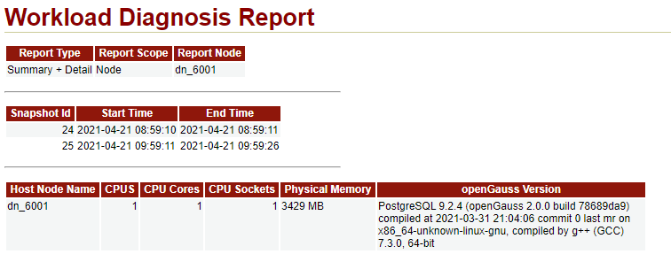

**解读：**
这一部分是 WDR 报告的概况信息，从这一部分我们能得到如下信息：

| 信息分类       | 信息描述                                                                    |
| -------------- | :-------------------------------------------------------------------------- |
| 报告采集类型   | Summary + Detail，即汇总数据+明细数据                                       |
| Snapshot 信息  | 使用 snapshot_id 为 24 和 25 的快照采集 2021-04-21(08:59 ~ 09:59)的运行信息 |
| 硬件配置       | 1\*1c/4g                                                                    |
| 节点名         | dn_6001                                                                     |
| openGauss 版本 | openGauss 2.0.0                                                             |

**相关代码:**

```
第一部分，Report Type/Report Scope/Report Node内容来源于执行generate_wdr_report函数时输入的参数，详见源码“GenReport::ShowReportType(report_params* params)”
第二部分查询SQL：(变量ld-->snapshot_id)
select snapshot_id as "Snapshot Id",
       to_char(start_ts, 'YYYY-MM-DD HH24:MI:SS') as "Start Time",
       to_char(end_ts, 'YYYY-MM-DD HH24:MI:SS')   as "End Time"
from snapshot.snapshot
where snapshot_id = %ld or snapshot_id = %ld;

第三部分查询SQL：(变量ld-->snapshot_id)
select 'CPUS', x.snap_value
from (select * from pg_node_env) t,
     (select * from snapshot.snap_global_os_runtime) x
      where x.snap_node_name = t.node_name
      and  x.snapshot_id = %ld
      and (x.snap_name = 'NUM_CPUS');

select 'CPU Cores', x.snap_value
from (select * from pg_node_env) t,
     (select * from snapshot.snap_global_os_runtime) x
      where x.snap_node_name = t.node_name
      and x.snapshot_id = %ld
      and x.snap_name = 'NUM_CPU_CORES';

select 'CPU Sockets', x.snap_value
from (select * from pg_node_env) t,
     (select * from snapshot.snap_global_os_runtime) x
      where x.snap_node_name = t.node_name
      and  x.snapshot_id = %ld
      and  x.snap_name = 'NUM_CPU_SOCKETS';

select 'Physical Memory', pg_size_pretty(x.snap_value)
from (select * from pg_node_env) t,
     (select * from snapshot.snap_global_os_runtime) x
where x.snap_node_name = t.node_name
and  x.snapshot_id = %ld
and  x.snap_name = 'PHYSICAL_MEMORY_BYTES';

select node_name as "Host Node Name" from pg_node_env;
select version() as "openGauss Version";
```

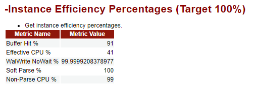

**解读：**
这一部分是实例的效率百分比，目标值是 100%，即越接近 100%，数据库运行越健康。
**Buffer Hit：**&nbsp;&nbsp;&nbsp;&nbsp;&nbsp;即数据库请求的数据在 buffer 中命中的比例，该指标越高代表 openGauss 在 buffer 中查询到目标数据的概率越高，数据读取性能越好。
**Effective CPU：** &nbsp;&nbsp;&nbsp;&nbsp;&nbsp;&nbsp;即有效的 CPU 使用比例，该指标偏小则说明 CPU 的有效使用偏低，处于等待状态的比例可能较高。
**WalWrite NoWait：** 即 WAL 日志写入时不等待的比例，该指标接近 100%，说明 buffer 容量充足，可以满足 WAL 写操作的需求，若指标值偏小则可能需要调大 buffer 容量。
**Soft Parse：** &nbsp;&nbsp;&nbsp;&nbsp;即 SQL 软解析的比例，该指标接近 100%，说明当前执行的 SQL 基本都可以在 Buffer 中找到，若指标值偏小则说明存在大量硬解析，需要分析原因，对 DML 语句进行适度优化。
**Non-Parse CPU：** &nbsp;&nbsp;&nbsp;即非解析占用的 CPU 比例，该指标接近 100%，说明 SQL 解析并没有占用较多的 CPU 时间。
**相关代码：**

```
-- 变量：ld指的是snapshot_id，手动执行以下SQL语句时请自行替换对应的snapshot_id
select
unnest(array['Buffer Hit %%', 'Effective CPU %%', 'WalWrite NoWait %%', 'Soft Parse %%', 'Non-Parse CPU %%']) as "Metric Name",
unnest(array[case when s1.all_reads = 0 then 1 else round(s1.blks_hit * 100 / s1.all_reads) end, s2.cpu_to_elapsd, s3.walwrite_nowait, s4.soft_parse, s5.non_parse]) as "Metric Value"
from
(select (snap_2.all_reads - coalesce(snap_1.all_reads, 0)) as all_reads,
        (snap_2.blks_hit - coalesce(snap_1.blks_hit, 0)) as blks_hit
 from
        (select sum(coalesce(snap_blks_read, 0) + coalesce(snap_blks_hit, 0)) as all_reads,
                coalesce(sum(snap_blks_hit), 0) as blks_hit
         from snapshot.snap_summary_stat_database
         where snapshot_id = %ld) snap_1,
             (select sum(coalesce(snap_blks_read, 0) + coalesce(snap_blks_hit, 0)) as all_reads,
                coalesce(sum(snap_blks_hit), 0) as blks_hit
              from snapshot.snap_summary_stat_database
              where snapshot_id = %ld) snap_2
           ) s1,
          (select round(cpu_time.snap_value * 100 / greatest(db_time.snap_value, 1)) as cpu_to_elapsd
           from
             (select coalesce(snap_2.snap_value, 0) - coalesce(snap_1.snap_value, 0) as snap_value
              from
                (select snap_stat_name, snap_value from snapshot.snap_global_instance_time
                   where snapshot_id = %ld and snap_stat_name = 'CPU_TIME') snap_1,
                (select snap_stat_name, snap_value from snapshot.snap_global_instance_time
                   where snapshot_id = %ld and snap_stat_name = 'CPU_TIME') snap_2) cpu_time,
             (select coalesce(snap_2.snap_value, 0) - coalesce(snap_1.snap_value, 0) as snap_value
              from
                (select snap_stat_name, snap_value from snapshot.snap_global_instance_time
                   where snapshot_id = %ld and snap_stat_name = 'DB_TIME') snap_1,
                (select snap_stat_name, snap_value from snapshot.snap_global_instance_time
                   where snapshot_id = %ld and snap_stat_name = 'DB_TIME') snap_2) db_time
          ) s2,
          (select (bufferAccess.snap_wait - bufferFull.snap_wait) * 100 / greatest(bufferAccess.snap_wait, 1) as walwrite_nowait
           from
             (select coalesce(snap_2.snap_wait) - coalesce(snap_1.snap_wait, 0) as snap_wait
              from
                (select snap_wait from snapshot.snap_global_wait_events
                   where snapshot_id = %ld and snap_event  = 'WALBufferFull') snap_1,
                (select snap_wait from snapshot.snap_global_wait_events
                   where snapshot_id = %ld and snap_event  = 'WALBufferFull') snap_2) bufferFull,
             (select coalesce(snap_2.snap_wait) - coalesce(snap_1.snap_wait, 0) as snap_wait
              from
                (select snap_wait from snapshot.snap_global_wait_events
                   where snapshot_id = %ld and snap_event = 'WALBufferAccess') snap_1,
                (select snap_wait from snapshot.snap_global_wait_events
                   where snapshot_id = %ld and snap_event = 'WALBufferAccess') snap_2) bufferAccess
          ) s3,
          (select round((snap_2.soft_parse - snap_1.soft_parse) * 100 / greatest((snap_2.hard_parse + snap_2.soft_parse)-(snap_1.hard_parse + snap_1.soft_parse), 1)) as soft_parse
           from
             (select sum(snap_n_soft_parse) as soft_parse, sum(snap_n_hard_parse) as hard_parse from snapshot.snap_summary_statement
                where snapshot_id = %ld ) snap_1,
             (select sum(snap_n_soft_parse) as soft_parse, sum(snap_n_hard_parse) as hard_parse from snapshot.snap_summary_statement
                where snapshot_id = %ld ) snap_2
          ) s4,
          (select round((snap_2.elapse_time - snap_1.elapse_time) * 100 /greatest((snap_2.elapse_time + snap_2.parse_time)-(snap_1.elapse_time + snap_1.parse_time), 1)) as non_parse
           from
             (select sum(snap_total_elapse_time) as elapse_time, sum(snap_parse_time) as parse_time from snapshot.snap_summary_statement
                where snapshot_id = %ld ) snap_1,
             (select sum(snap_total_elapse_time) as elapse_time, sum(snap_parse_time) as parse_time from snapshot.snap_summary_statement
                where snapshot_id = %ld ) snap_2
          ) s5;
```

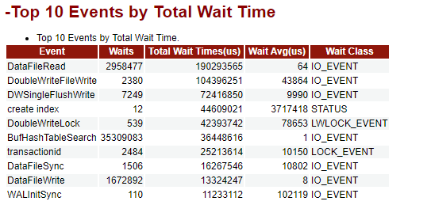

**解读：**
这一部分列出了数据库 Top 10 的等待事件、等待次数、总等待时间、平均等待时间、等待事件类型。
等待事件主要分为等待状态、等待轻量级锁、等待 IO、等待事务锁这 4 类，详见下表所示：

等待状态列表

<!-- -
    <table>
  <thead ><tr>
  <th  width="43.419999999999995%" ><p>wait_status值</p></th>
  <th  width="56.58%" ><p><a name="zh-cn_topic_0237122466_zh-cn_topic_0059777957_aeaf5ce86f70d4b0ca67b8cddb5286be5"></a><a name="zh-cn_topic_0237122466_zh-cn_topic_0059777957_aeaf5ce86f70d4b0ca67b8cddb5286be5"></a><span>含义</span></p></th>
  </tr></thead>
  <tbody>
  <tr>
  <td  width="43.419999999999995%"><p><a name="zh-cn_topic_0237122466_zh-cn_topic_0059777957_a5c9d9db22d7749daa33de691650c318c"></a><a name="zh-cn_topic_0237122466_zh-cn_topic_0059777957_a5c9d9db22d7749daa33de691650c318c"></a>none</p></td>
  <td  width="56.58%"><p><a name="zh-cn_topic_0237122466_zh-cn_topic_0059777957_adc62684b5f3e420d9f357bdec5ccf50f"></a><a name="zh-cn_topic_0237122466_zh-cn_topic_0059777957_adc62684b5f3e420d9f357bdec5ccf50f"></a>没在等任意事件。</p></td>
  </tr>
  <tr>
  <td  width="43.419999999999995%"><p><a name="zh-cn_topic_0237122466_zh-cn_topic_0059777957_zh-cn_topic_0058965581_p384008589204"></a><a name="zh-cn_topic_0237122466_zh-cn_topic_0059777957_zh-cn_topic_0058965581_p384008589204"></a>acquire lock</p></td>
  <td  width="56.58%"><p><a name="zh-cn_topic_0237122466_zh-cn_topic_0059777957_zh-cn_topic_0058965581_p234618079204"></a><a name="zh-cn_topic_0237122466_zh-cn_topic_0059777957_zh-cn_topic_0058965581_p234618079204"></a>等待加锁，要么加锁成功，要么加锁等待超时。</p></td>
  </tr>
  <tr>
  <td  width="43.419999999999995%"><p><a name="zh-cn_topic_0237122466_p20283711135"></a><a name="zh-cn_topic_0237122466_p20283711135"></a>acquire lwlock</p></td>
  <td  width="56.58%"><p><a name="zh-cn_topic_0237122466_p828318115314"></a><a name="zh-cn_topic_0237122466_p828318115314"></a>等待获取轻量级锁。</p></td>
  </tr>
  <tr>
  <td  width="43.419999999999995%"><p><a name="zh-cn_topic_0237122466_p168726179319"></a><a name="zh-cn_topic_0237122466_p168726179319"></a>wait io</p></td>
  <td  width="56.58%"><p><a name="zh-cn_topic_0237122466_p1287381703115"></a><a name="zh-cn_topic_0237122466_p1287381703115"></a>等待IO完成。</p></td>
  </tr>
  <tr>
  <td  width="43.419999999999995%"><p><a name="zh-cn_topic_0237122466_zh-cn_topic_0059777957_zh-cn_topic_0058965581_p148189029200"></a><a name="zh-cn_topic_0237122466_zh-cn_topic_0059777957_zh-cn_topic_0058965581_p148189029200"></a>wait cmd</p></td>
  <td  width="56.58%"><p><a name="zh-cn_topic_0237122466_zh-cn_topic_0059777957_zh-cn_topic_0058965581_p594804239200"></a><a name="zh-cn_topic_0237122466_zh-cn_topic_0059777957_zh-cn_topic_0058965581_p594804239200"></a>等待完成读取网络通信包。</p></td>
  </tr>
  <tr>
  <td  width="43.419999999999995%"><p><a name="zh-cn_topic_0237122466_zh-cn_topic_0059777957_a76eb409a374e4619af37cc49ede604d2"></a><a name="zh-cn_topic_0237122466_zh-cn_topic_0059777957_a76eb409a374e4619af37cc49ede604d2"></a>wait pooler get conn</p></td>
  <td  width="56.58%"><p><a name="zh-cn_topic_0237122466_zh-cn_topic_0059777957_af2d4ba78999846a7be8b466603253173"></a><a name="zh-cn_topic_0237122466_zh-cn_topic_0059777957_af2d4ba78999846a7be8b466603253173"></a>等待pooler完成获取连接。</p></td>
  </tr>
  <tr>
  <td  width="43.419999999999995%"><p><a name="zh-cn_topic_0237122466_zh-cn_topic_0059777957_a445ee1f53901457aa084a6bfea9c38e2"></a><a name="zh-cn_topic_0237122466_zh-cn_topic_0059777957_a445ee1f53901457aa084a6bfea9c38e2"></a>wait pooler abort conn</p></td>
  <td  width="56.58%"><p><a name="zh-cn_topic_0237122466_zh-cn_topic_0059777957_aa5f66579fce24d5a8c78102dca4490c9"></a><a name="zh-cn_topic_0237122466_zh-cn_topic_0059777957_aa5f66579fce24d5a8c78102dca4490c9"></a>等待pooler完成终止连接。</p></td>
  </tr>
  <tr>
  <td  width="43.419999999999995%"><p><a name="zh-cn_topic_0237122466_zh-cn_topic_0059777957_ae5c5cf826a44497caa628dd7810e3a08"></a><a name="zh-cn_topic_0237122466_zh-cn_topic_0059777957_ae5c5cf826a44497caa628dd7810e3a08"></a>wait pooler clean conn</p></td>
  <td  width="56.58%"><p><a name="zh-cn_topic_0237122466_zh-cn_topic_0059777957_a77b4ee97927f4da896cf75d105b6a0f3"></a><a name="zh-cn_topic_0237122466_zh-cn_topic_0059777957_a77b4ee97927f4da896cf75d105b6a0f3"></a>等待pooler完成清理连接。</p></td>
  </tr>
  <tr>
  <td  width="43.419999999999995%"><p><a name="zh-cn_topic_0237122466_p92736598202"></a><a name="zh-cn_topic_0237122466_p92736598202"></a>pooler create conn: [\nodename], total N</p></td>
  <td  width="56.58%"><p><a name="zh-cn_topic_0237122466_p2027355952016"></a><a name="zh-cn_topic_0237122466_p2027355952016"></a>等待pooler建立连接，当前正在与nodename指定节点建立连接，且仍有N个连接等待建立。</p></td>
  </tr>
  <tr>
  <td  width="43.419999999999995%"><p><a name="zh-cn_topic_0237122466_zh-cn_topic_0059777957_zh-cn_topic_0058965581_p496345899214"></a><a name="zh-cn_topic_0237122466_zh-cn_topic_0059777957_zh-cn_topic_0058965581_p496345899214"></a>get conn</p></td>
  <td  width="56.58%"><p><a name="zh-cn_topic_0237122466_zh-cn_topic_0059777957_zh-cn_topic_0058965581_p609787349214"></a><a name="zh-cn_topic_0237122466_zh-cn_topic_0059777957_zh-cn_topic_0058965581_p609787349214"></a>获取到其他节点的连接。</p></td>
  </tr>
  <tr>
  <td  width="43.419999999999995%"><p><a name="zh-cn_topic_0237122466_zh-cn_topic_0059777957_a5d69f9fd31ea4b81a6408e2f4499578b"></a><a name="zh-cn_topic_0237122466_zh-cn_topic_0059777957_a5d69f9fd31ea4b81a6408e2f4499578b"></a>set cmd: [\nodename]</p></td>
  <td  width="56.58%"><p><a name="zh-cn_topic_0237122466_zh-cn_topic_0059777957_a5933bd1ab070408c845cf629a7d92764"></a><a name="zh-cn_topic_0237122466_zh-cn_topic_0059777957_a5933bd1ab070408c845cf629a7d92764"></a>在连接上执行SET/RESET/TRANSACTION BLOCK LEVEL PARA SET/SESSION LEVEL PARA SET，当前正在nodename指定节点上执行。</p></td>
  </tr>
  <tr>
  <td  width="43.419999999999995%"><p><a name="zh-cn_topic_0237122466_zh-cn_topic_0059777957_a4f6c708307664db7b59f4c020e94d18a"></a><a name="zh-cn_topic_0237122466_zh-cn_topic_0059777957_a4f6c708307664db7b59f4c020e94d18a"></a>cancel query</p></td>
  <td  width="56.58%"><p><a name="zh-cn_topic_0237122466_zh-cn_topic_0059777957_a3dbbf28e41994adaa502b18f5830b5c6"></a><a name="zh-cn_topic_0237122466_zh-cn_topic_0059777957_a3dbbf28e41994adaa502b18f5830b5c6"></a>取消某连接上正在执行的SQL语句。</p></td>
  </tr>
  <tr>
  <td  width="43.419999999999995%"><p><a name="zh-cn_topic_0237122466_zh-cn_topic_0059777957_a15ac961dc2134c4e9828c185b0f2923f"></a><a name="zh-cn_topic_0237122466_zh-cn_topic_0059777957_a15ac961dc2134c4e9828c185b0f2923f"></a>stop query</p></td>
  <td  width="56.58%"><p><a name="zh-cn_topic_0237122466_zh-cn_topic_0059777957_ac9a1ff3e709048ecb07b7e280518a8f7"></a><a name="zh-cn_topic_0237122466_zh-cn_topic_0059777957_ac9a1ff3e709048ecb07b7e280518a8f7"></a>停止某连接上正在执行的查询。</p></td>
  </tr>
  <tr>
  <td  width="43.419999999999995%"><p><a name="zh-cn_topic_0237122466_zh-cn_topic_0059777957_a57ab22c9044a4760b6ad8b48ddd06864"></a><a name="zh-cn_topic_0237122466_zh-cn_topic_0059777957_a57ab22c9044a4760b6ad8b48ddd06864"></a>wait node: [\nodename](plevel), total N, [phase]</p></td>
  <td  width="56.58%"><div>
  <a name="zh-cn_topic_0237122466_p577573613228"></a><a name="zh-cn_topic_0237122466_p577573613228"></a>等待接收与某节点的连接上的数据，当前正在等待nodename节点plevel线程的数据，且仍有N个连接的数据待返回。如果状态包含phase信息，则可能的阶段状态有：<a name="zh-cn_topic_0237122466_ul21682503315"></a><a name="zh-cn_topic_0237122466_ul21682503315"></a><ul>
  <li>begin：表示处于事务开始阶段。</li>
  <li>commit：表示处于事务提交阶段。</li>
  <li>rollback：表示处于事务回滚阶段。</li>
  </ul>
  </div></td>
  </tr>
  <tr>
  <td  width="43.419999999999995%"><p><a name="zh-cn_topic_0237122466_zh-cn_topic_0059777957_zh-cn_topic_0058965581_p482561592646"></a><a name="zh-cn_topic_0237122466_zh-cn_topic_0059777957_zh-cn_topic_0058965581_p482561592646"></a>wait transaction sync: xid</p></td>
  <td  width="56.58%"><p><a name="zh-cn_topic_0237122466_zh-cn_topic_0059777957_afeb071f345c843d09e641fc81a86720c"></a><a name="zh-cn_topic_0237122466_zh-cn_topic_0059777957_afeb071f345c843d09e641fc81a86720c"></a>等待xid指定事务同步。</p></td>
  </tr>
  <tr>
  <td  width="43.419999999999995%"><p><a name="zh-cn_topic_0237122466_zh-cn_topic_0059777957_abedc2f63f82543cdb395596a4475ce05"></a><a name="zh-cn_topic_0237122466_zh-cn_topic_0059777957_abedc2f63f82543cdb395596a4475ce05"></a>wait wal sync</p></td>
  <td  width="56.58%"><p><a name="zh-cn_topic_0237122466_zh-cn_topic_0059777957_a6e45ea151ef14fe498557618f4a6281c"></a><a name="zh-cn_topic_0237122466_zh-cn_topic_0059777957_a6e45ea151ef14fe498557618f4a6281c"></a>等待特定LSN的wal log完成到备机的同步。</p></td>
  </tr>
  <tr>
  <td  width="43.419999999999995%"><p><a name="zh-cn_topic_0237122466_zh-cn_topic_0059777957_a6bf3f76247444142bc65d6f2dbe18640"></a><a name="zh-cn_topic_0237122466_zh-cn_topic_0059777957_a6bf3f76247444142bc65d6f2dbe18640"></a>wait data sync</p></td>
  <td  width="56.58%"><p><a name="zh-cn_topic_0237122466_zh-cn_topic_0059777957_a9a929b6c0d1d475da2fe5db9fc3eaa70"></a><a name="zh-cn_topic_0237122466_zh-cn_topic_0059777957_a9a929b6c0d1d475da2fe5db9fc3eaa70"></a>等待完成数据页到备机的同步。</p></td>
  </tr>
  <tr>
  <td  width="43.419999999999995%"><p><a name="zh-cn_topic_0237122466_zh-cn_topic_0059777957_ac50071fce62540ed8fa53c46d4449817"></a><a name="zh-cn_topic_0237122466_zh-cn_topic_0059777957_ac50071fce62540ed8fa53c46d4449817"></a>wait data sync queue</p></td>
  <td  width="56.58%"><p><a name="zh-cn_topic_0237122466_zh-cn_topic_0059777957_ad8cd7b5bf0eb4f9faae734fe48fce47f"></a><a name="zh-cn_topic_0237122466_zh-cn_topic_0059777957_ad8cd7b5bf0eb4f9faae734fe48fce47f"></a>等待把行存的数据页或列存的CU放入同步队列。</p></td>
  </tr>
  <tr>
  <td  width="43.419999999999995%"><p><a name="zh-cn_topic_0237122466_zh-cn_topic_0059777957_ad5c0e89fd8494ac1a2f8998f613bcde6"></a><a name="zh-cn_topic_0237122466_zh-cn_topic_0059777957_ad5c0e89fd8494ac1a2f8998f613bcde6"></a>flush data: [\nodename](plevel), [phase]</p></td>
  <td  width="56.58%"><p><a name="zh-cn_topic_0237122466_zh-cn_topic_0059777957_a82e8b0d491934d26b07c5a7a29571c57"></a><a name="zh-cn_topic_0237122466_zh-cn_topic_0059777957_a82e8b0d491934d26b07c5a7a29571c57"></a>等待向网络中nodename指定节点的plevel对应线程发送数据。如果状态包含phase信息，则可能的阶段状态为wait quota，即当前通信流正在等待quota值。</p></td>
  </tr>
  <tr>
  <td  width="43.419999999999995%"><p><a name="zh-cn_topic_0237122466_zh-cn_topic_0059777957_aa66d733115a948c082dc8a28e36af968"></a><a name="zh-cn_topic_0237122466_zh-cn_topic_0059777957_aa66d733115a948c082dc8a28e36af968"></a>stream get conn: [\nodename], total N</p></td>
  <td  width="56.58%"><p><a name="zh-cn_topic_0237122466_zh-cn_topic_0059777957_a861d2d6d2cdc4257b2e9ad6b5b8d7409"></a><a name="zh-cn_topic_0237122466_zh-cn_topic_0059777957_a861d2d6d2cdc4257b2e9ad6b5b8d7409"></a>初始化stream flow时，等待与nodename节点的consumer对象建立连接，且当前有N个待建连对象。</p></td>
  </tr>
  <tr>
  <td  width="43.419999999999995%"><p><a name="zh-cn_topic_0237122466_zh-cn_topic_0059777957_ab183ab17f90f4d4d9b5a16b5167dada5"></a><a name="zh-cn_topic_0237122466_zh-cn_topic_0059777957_ab183ab17f90f4d4d9b5a16b5167dada5"></a>wait producer ready: [\nodename](plevel), total N</p></td>
  <td  width="56.58%"><p><a name="zh-cn_topic_0237122466_zh-cn_topic_0059777957_a42fe9f0c6cb944ecbe29c1238035f52d"></a><a name="zh-cn_topic_0237122466_zh-cn_topic_0059777957_a42fe9f0c6cb944ecbe29c1238035f52d"></a>初始化stream flow时，等待每个producer都准备好，当前正在等待nodename节点plevel对应线程的producer对象准备好，且仍有N个producer对象处于等待状态。</p></td>
  </tr>
  <tr>
  <td  width="43.419999999999995%"><p><a name="zh-cn_topic_0237122466_zh-cn_topic_0059777957_a5284ae7a66bb4198b923c944465a8ca8"></a><a name="zh-cn_topic_0237122466_zh-cn_topic_0059777957_a5284ae7a66bb4198b923c944465a8ca8"></a>synchronize quit</p></td>
  <td  width="56.58%"><p><a name="zh-cn_topic_0237122466_zh-cn_topic_0059777957_a03722ed898714814844dad8f7257f230"></a><a name="zh-cn_topic_0237122466_zh-cn_topic_0059777957_a03722ed898714814844dad8f7257f230"></a>stream plan结束时，等待stream线程组内的线程统一退出。</p></td>
  </tr>
  <tr>
  <td  width="43.419999999999995%"><p><a name="zh-cn_topic_0237122466_zh-cn_topic_0059777957_ab8c886a1cb7240ddb099e697cf5602e7"></a><a name="zh-cn_topic_0237122466_zh-cn_topic_0059777957_ab8c886a1cb7240ddb099e697cf5602e7"></a>wait stream nodegroup destroy</p></td>
  <td  width="56.58%"><p><a name="zh-cn_topic_0237122466_zh-cn_topic_0059777957_a85f97a0421f949b2ab05128250165d0d"></a><a name="zh-cn_topic_0237122466_zh-cn_topic_0059777957_a85f97a0421f949b2ab05128250165d0d"></a>stream plan结束时，等待销毁stream node group。</p></td>
  </tr>
  <tr>
  <td  width="43.419999999999995%"><p><a name="zh-cn_topic_0237122466_p137674550338"></a><a name="zh-cn_topic_0237122466_p137674550338"></a>wait active statement</p></td>
  <td  width="56.58%"><p><a name="zh-cn_topic_0237122466_p1176715558335"></a><a name="zh-cn_topic_0237122466_p1176715558335"></a>等待作业执行，正在资源负载管控中。</p></td>
  </tr>
  <tr>
  <td  width="43.419999999999995%"><p><a name="zh-cn_topic_0237122466_p1865082892710"></a><a name="zh-cn_topic_0237122466_p1865082892710"></a>analyze: [relname], [phase]</p></td>
  <td  width="56.58%"><p><a name="zh-cn_topic_0237122466_p2065072872717"></a><a name="zh-cn_topic_0237122466_p2065072872717"></a>当前正在对表relname执行analyze。如果状态包含phase信息，则为autovacuum，表示是数据库自动开启AutoVacuum线程执行的analyze分析操作。</p></td>
  </tr>
  <tr>
  <td  width="43.419999999999995%"><p><a name="zh-cn_topic_0237122466_p165012816279"></a><a name="zh-cn_topic_0237122466_p165012816279"></a>vacuum: [relname], [phase]</p></td>
  <td  width="56.58%"><p><a name="zh-cn_topic_0237122466_p10650132810279"></a><a name="zh-cn_topic_0237122466_p10650132810279"></a>当前正在对表relname执行vacuum。如果状态包含phase信息，则为autovacuum，表示是数据库自动开启AutoVacuum线程执行的vacuum清理操作。</p></td>
  </tr>
  <tr>
  <td  width="43.419999999999995%"><p><a name="zh-cn_topic_0237122466_p26501328142718"></a><a name="zh-cn_topic_0237122466_p26501328142718"></a>vacuum full: [relname]</p></td>
  <td  width="56.58%"><p><a name="zh-cn_topic_0237122466_p19651102882715"></a><a name="zh-cn_topic_0237122466_p19651102882715"></a>当前正在对表relname执行vacuum full清理。</p></td>
  </tr>
  <tr>
  <td  width="43.419999999999995%"><p><a name="zh-cn_topic_0237122466_p186511828192716"></a><a name="zh-cn_topic_0237122466_p186511828192716"></a>create index</p></td>
  <td  width="56.58%"><p><a name="zh-cn_topic_0237122466_p26511328192717"></a><a name="zh-cn_topic_0237122466_p26511328192717"></a>当前正在创建索引。</p></td>
  </tr>
  <tr>
  <td  width="43.419999999999995%"><p><a name="zh-cn_topic_0237122466_p16651162872712"></a><a name="zh-cn_topic_0237122466_p16651162872712"></a>HashJoin - [ build hash | write file ]</p></td>
  <td  width="56.58%"><div>
  <a name="zh-cn_topic_0237122466_p146511528162711"></a><a name="zh-cn_topic_0237122466_p146511528162711"></a>当前是HashJoin算子，主要关注耗时的执行阶段。<a name="zh-cn_topic_0237122466_ul10627844133118"></a><a name="zh-cn_topic_0237122466_ul10627844133118"></a><ul>
  <li>build hash：表示当前HashJoin算子正在建立哈希表。</li>
  <li>write file：表示当前HashJoin算子正在将数据写入磁盘。</li>
  </ul>
  </div></td>
  </tr>
  <tr>
  <td  width="43.419999999999995%"><p><a name="zh-cn_topic_0237122466_p1651142818270"></a><a name="zh-cn_topic_0237122466_p1651142818270"></a>HashAgg - [ build hash | write file ]</p></td>
  <td  width="56.58%"><div>
  <a name="zh-cn_topic_0237122466_p165102818277"></a><a name="zh-cn_topic_0237122466_p165102818277"></a>当前是HashAgg算子，主要关注耗时的执行阶段。<a name="zh-cn_topic_0237122466_ul152447611329"></a><a name="zh-cn_topic_0237122466_ul152447611329"></a><ul>
  <li>build hash：表示当前HashAgg算子正在建立哈希表。</li>
  <li>write file：表示当前HashAgg算子正在将数据写入磁盘。</li>
  </ul>
  </div></td>
  </tr>
  <tr>
  <td  width="43.419999999999995%"><p><a name="zh-cn_topic_0237122466_p1465252814278"></a><a name="zh-cn_topic_0237122466_p1465252814278"></a>HashSetop - [build hash | write file ]</p></td>
  <td  width="56.58%"><div>
  <a name="zh-cn_topic_0237122466_p16652192872711"></a><a name="zh-cn_topic_0237122466_p16652192872711"></a>当前是HashSetop算子，主要关注耗时的执行阶段。<a name="zh-cn_topic_0237122466_ul5196135473214"></a><a name="zh-cn_topic_0237122466_ul5196135473214"></a><ul>
  <li>build hash：表示当前HashSetop算子正在建立哈希表。</li>
  <li>write file：表示当前HashSetop算子正在将数据写入磁盘。</li>
  </ul>
  </div></td>
  </tr>
  <tr>
  <td  width="43.419999999999995%"><p><a name="zh-cn_topic_0237122466_p16522280274"></a><a name="zh-cn_topic_0237122466_p16522280274"></a>Sort | Sort - write file</p></td>
  <td  width="56.58%"><p><a name="zh-cn_topic_0237122466_p19652182882719"></a><a name="zh-cn_topic_0237122466_p19652182882719"></a>当前是Sort算子做排序，write file表示Sort算子正在将数据写入磁盘。</p></td>
  </tr>
  <tr>
  <td  width="43.419999999999995%"><p><a name="zh-cn_topic_0237122466_p1965218287273"></a><a name="zh-cn_topic_0237122466_p1965218287273"></a>Material | Material - write file</p></td>
  <td  width="56.58%"><p><a name="zh-cn_topic_0237122466_p16652112842710"></a><a name="zh-cn_topic_0237122466_p16652112842710"></a>当前是Material算子，write file表示Material算子正在将数据写入磁盘。</p></td>
  </tr>
  <tr>
  <td  width="43.419999999999995%"><p><a name="p57723162117"></a><a name="p57723162117"></a>NestLoop</p></td>
  <td  width="56.58%"><p><a name="p577203119214"></a><a name="p577203119214"></a>当前是NestLoop算子。</p></td>
  </tr>
  <tr>
  <td  width="43.419999999999995%"><p><a name="p2881111812229"></a><a name="p2881111812229"></a>wait memory</p></td>
  <td  width="56.58%"><p><a name="p14881718152212"></a><a name="p14881718152212"></a>等待内存获取。</p></td>
  </tr>
  <tr>
  <td  width="43.419999999999995%"><p><a name="p19682162016228"></a><a name="p19682162016228"></a>wait sync consumer next step</p></td>
  <td  width="56.58%"><p><a name="p26821420112219"></a><a name="p26821420112219"></a>Stream算子等待消费者执行。</p></td>
  </tr>
  <tr>
  <td  width="43.419999999999995%"><p><a name="p10661823122212"></a><a name="p10661823122212"></a>wait sync producer next step</p></td>
  <td  width="56.58%"><p><a name="p866113235224"></a><a name="p866113235224"></a>Stream算子等待生产者执行。</p></td>
  </tr>
  </tbody>
  </table> -->

当 wait_status 为 acquire lwlock、acquire lock 或者 wait io 时，表示有等待事件。
正在等待获取 wait_event 列对应类型的轻量级锁、事务锁，或者正在进行 IO。

- 轻量级锁等待事件列表
当 wait_status 值为 acquire lwlock（轻量级锁）时对应的 wait_event 等待事件类型即为轻量级锁等待。
wait_event 为 extension 时，表示此时的轻量级锁是动态分配的锁，未被监控。
<table>
<thead ><tr>
<th  width="38.18%" ><p><span>wait_event类型</span></p></th>
<th  width="61.82%" ><p><a name="zh-cn_topic_0237122466_p120747143414"></a><a name="zh-cn_topic_0237122466_p120747143414"></a><span>类型描述</span></p></th>
</tr></thead>
<tbody>
<tr>
<td  width="38.18%"><p><span><a name="zh-cn_topic_0237122466_p32473256340"></a><a name="zh-cn_topic_0237122466_p32473256340"></a>ShmemIndexLock</span></p></td>
<td  width="61.82%"><p><span><a name="zh-cn_topic_0237122466_p1562515491617"></a><a name="zh-cn_topic_0237122466_p1562515491617"></a>用于保护共享内存中的主索引哈希表。</span></p></td>
</tr>
<tr>
<td  width="38.18%"><p><span><a name="zh-cn_topic_0237122466_p6247425203415"></a><a name="zh-cn_topic_0237122466_p6247425203415"></a>OidGenLock</span></p></td>
<td  width="61.82%"><p><span><a name="zh-cn_topic_0237122466_p13247182553420"></a><a name="zh-cn_topic_0237122466_p13247182553420"></a>用于避免不同线程产生相同的OID。</span></p></td>
</tr>
<tr>
<td  width="38.18%"><p><span><a name="zh-cn_topic_0237122466_p15247182523415"></a><a name="zh-cn_topic_0237122466_p15247182523415"></a>XidGenLock</span></p></td>
<td  width="61.82%"><p><span><a name="zh-cn_topic_0237122466_p1224722514343"></a><a name="zh-cn_topic_0237122466_p1224722514343"></a>用于避免两个事务获得相同的xid。</span></p></td>
</tr>
<tr>
<td  width="38.18%"><p><span><a name="zh-cn_topic_0237122466_p192473257349"></a><a name="zh-cn_topic_0237122466_p192473257349"></a>ProcArrayLock</span></p></td>
<td  width="61.82%"><p><span><a name="zh-cn_topic_0237122466_p42471825123413"></a><a name="zh-cn_topic_0237122466_p42471825123413"></a>用于避免并发访问或修改ProcArray共享数组。</span></p></td>
</tr>
<tr>
<td  width="38.18%"><p><span><a name="zh-cn_topic_0237122466_p11247162563412"></a><a name="zh-cn_topic_0237122466_p11247162563412"></a>SInvalReadLock</span></p></td>
<td  width="61.82%"><p><span><a name="zh-cn_topic_0237122466_p15247172523410"></a><a name="zh-cn_topic_0237122466_p15247172523410"></a>用于避免与清理失效消息并发执行。</span></p></td>
</tr>
<tr>
<td  width="38.18%"><p><span><a name="zh-cn_topic_0237122466_p20247125103416"></a><a name="zh-cn_topic_0237122466_p20247125103416"></a>SInvalWriteLock</span></p></td>
<td  width="61.82%"><p><span><a name="zh-cn_topic_0237122466_p1924742583413"></a><a name="zh-cn_topic_0237122466_p1924742583413"></a>用于避免与其它写失效消息、清理失效消息并发执行。</span></p></td>
</tr>
<tr>
<td  width="38.18%"><p><span><a name="zh-cn_topic_0237122466_p3249132512346"></a><a name="zh-cn_topic_0237122466_p3249132512346"></a>WALInsertLock</span></p></td>
<td  width="61.82%"><p><span><a name="zh-cn_topic_0237122466_p17249132519343"></a><a name="zh-cn_topic_0237122466_p17249132519343"></a>用于避免与其它WAL插入操作并发执行。</span></p></td>
</tr>
<tr>
<td  width="38.18%"><p><span><a name="zh-cn_topic_0237122466_p11249142513340"></a><a name="zh-cn_topic_0237122466_p11249142513340"></a>WALWriteLock</span></p></td>
<td  width="61.82%"><p><span><a name="zh-cn_topic_0237122466_p424952515340"></a><a name="zh-cn_topic_0237122466_p424952515340"></a>用于避免并发WAL写盘。</span></p></td>
</tr>
<tr>
<td  width="38.18%"><p><span><a name="zh-cn_topic_0237122466_p724962523419"></a><a name="zh-cn_topic_0237122466_p724962523419"></a>ControlFileLock</span></p></td>
<td  width="61.82%"><p><span><a name="zh-cn_topic_0237122466_p6249425153417"></a><a name="zh-cn_topic_0237122466_p6249425153417"></a>用于避免pg_control文件的读写并发、写写并发。</span></p></td>
</tr>
<tr>
<td  width="38.18%"><p><span><a name="zh-cn_topic_0237122466_p102491725183419"></a><a name="zh-cn_topic_0237122466_p102491725183419"></a>CheckpointLock</span></p></td>
<td  width="61.82%"><p><span><a name="zh-cn_topic_0237122466_p9249132520343"></a><a name="zh-cn_topic_0237122466_p9249132520343"></a>用于避免多个checkpoint并发执行。</span></p></td>
</tr>
<tr>
<td  width="38.18%"><p><span><a name="zh-cn_topic_0237122466_p724902514340"></a><a name="zh-cn_topic_0237122466_p724902514340"></a>CLogControlLock</span></p></td>
<td  width="61.82%"><p><span><a name="zh-cn_topic_0237122466_p192491625183411"></a><a name="zh-cn_topic_0237122466_p192491625183411"></a>用于避免并发访问或者修改Clog控制数据结构。</span></p></td>
</tr>
<tr>
<td  width="38.18%"><p><span><a name="zh-cn_topic_0237122466_p2249825133418"></a><a name="zh-cn_topic_0237122466_p2249825133418"></a>SubtransControlLock</span></p></td>
<td  width="61.82%"><p><span><a name="zh-cn_topic_0237122466_p52504256348"></a><a name="zh-cn_topic_0237122466_p52504256348"></a>用于避免并发访问或者修改子事务控制数据结构。</span></p></td>
</tr>
<tr>
<td  width="38.18%"><p><span><a name="zh-cn_topic_0237122466_p22501725203416"></a><a name="zh-cn_topic_0237122466_p22501725203416"></a>MultiXactGenLock</span></p></td>
<td  width="61.82%"><p><span><a name="zh-cn_topic_0237122466_p1125002503413"></a><a name="zh-cn_topic_0237122466_p1125002503413"></a>用于串行分配唯一MultiXact id。</span></p></td>
</tr>
<tr>
<td  width="38.18%"><p><span><a name="zh-cn_topic_0237122466_p5250325143414"></a><a name="zh-cn_topic_0237122466_p5250325143414"></a>MultiXactOffsetControlLock</span></p></td>
<td  width="61.82%"><p><span><a name="zh-cn_topic_0237122466_p0250142543414"></a><a name="zh-cn_topic_0237122466_p0250142543414"></a>用于避免对pg_multixact/offset的写写并发和读写并发。</span></p></td>
</tr>
<tr>
<td  width="38.18%"><p><span><a name="zh-cn_topic_0237122466_p025042563412"></a><a name="zh-cn_topic_0237122466_p025042563412"></a>MultiXactMemberControlLock</span></p></td>
<td  width="61.82%"><p><span><a name="zh-cn_topic_0237122466_p102506258340"></a><a name="zh-cn_topic_0237122466_p102506258340"></a>用于避免对pg_multixact/members的写写并发和读写并发。</span></p></td>
</tr>
<tr>
<td  width="38.18%"><p><span><a name="zh-cn_topic_0237122466_p0251925133410"></a><a name="zh-cn_topic_0237122466_p0251925133410"></a>RelCacheInitLock</span></p></td>
<td  width="61.82%"><p><span><a name="zh-cn_topic_0237122466_p6251325173411"></a><a name="zh-cn_topic_0237122466_p6251325173411"></a>用于失效消息场景对init文件进行操作时加锁。</span></p></td>
</tr>
<tr>
<td  width="38.18%"><p><span><a name="zh-cn_topic_0237122466_p19251525173411"></a><a name="zh-cn_topic_0237122466_p19251525173411"></a>CheckpointerCommLock</span></p></td>
<td  width="61.82%"><p><span><a name="zh-cn_topic_0237122466_p625182515340"></a><a name="zh-cn_topic_0237122466_p625182515340"></a>用于向checkpointer发起文件刷盘请求场景，需要串行的向请求队列插入请求结构。</span></p></td>
</tr>
<tr>
<td  width="38.18%"><p><span><a name="zh-cn_topic_0237122466_p92511254346"></a><a name="zh-cn_topic_0237122466_p92511254346"></a>TwoPhaseStateLock</span></p></td>
<td  width="61.82%"><p><span><a name="zh-cn_topic_0237122466_p32511025173418"></a><a name="zh-cn_topic_0237122466_p32511025173418"></a>用于避免并发访问或者修改两阶段信息共享数组。</span></p></td>
</tr>
<tr>
<td  width="38.18%"><p><span><a name="zh-cn_topic_0237122466_p1025152593420"></a><a name="zh-cn_topic_0237122466_p1025152593420"></a>TablespaceCreateLock</span></p></td>
<td  width="61.82%"><p><span><a name="zh-cn_topic_0237122466_p325111254343"></a><a name="zh-cn_topic_0237122466_p325111254343"></a>用于确定tablespace是否已经存在。</span></p></td>
</tr>
<tr>
<td  width="38.18%"><p><span><a name="zh-cn_topic_0237122466_p192510255349"></a><a name="zh-cn_topic_0237122466_p192510255349"></a>BtreeVacuumLock</span></p></td>
<td  width="61.82%"><p><span><a name="zh-cn_topic_0237122466_p11251112510347"></a><a name="zh-cn_topic_0237122466_p11251112510347"></a>用于防止vacuum清理B-tree中还在使用的页面。</span></p></td>
</tr>
<tr>
<td  width="38.18%"><p><span><a name="zh-cn_topic_0237122466_p17251112517348"></a><a name="zh-cn_topic_0237122466_p17251112517348"></a>AutovacuumLock</span></p></td>
<td  width="61.82%"><p><span><a name="zh-cn_topic_0237122466_p14251192519348"></a><a name="zh-cn_topic_0237122466_p14251192519348"></a>用于串行化访问autovacuum worker数组。</span></p></td>
</tr>
<tr>
<td  width="38.18%"><p><span><a name="zh-cn_topic_0237122466_p202521925143417"></a><a name="zh-cn_topic_0237122466_p202521925143417"></a>AutovacuumScheduleLock</span></p></td>
<td  width="61.82%"><p><span><a name="zh-cn_topic_0237122466_p7252152514345"></a><a name="zh-cn_topic_0237122466_p7252152514345"></a>用于串行化分配需要vacuum的table。</span></p></td>
</tr>
<tr>
<td  width="38.18%"><p><span><a name="zh-cn_topic_0237122466_p152521625123412"></a><a name="zh-cn_topic_0237122466_p152521625123412"></a>AutoanalyzeLock</span></p></td>
<td  width="61.82%"><p><span><a name="zh-cn_topic_0237122466_p1425217256347"></a><a name="zh-cn_topic_0237122466_p1425217256347"></a>用于获取和释放允许执行Autoanalyze的任务资源。</span></p></td>
</tr>
<tr>
<td  width="38.18%"><p><span><a name="zh-cn_topic_0237122466_p17252102511342"></a><a name="zh-cn_topic_0237122466_p17252102511342"></a>SyncScanLock</span></p></td>
<td  width="61.82%"><p><span><a name="zh-cn_topic_0237122466_p18252125173413"></a><a name="zh-cn_topic_0237122466_p18252125173413"></a>用于确定heap扫描时某个relfilenode的起始位置。</span></p></td>
</tr>
<tr>
<td  width="38.18%"><p><span><a name="zh-cn_topic_0237122466_p10252102513342"></a><a name="zh-cn_topic_0237122466_p10252102513342"></a>NodeTableLock</span></p></td>
<td  width="61.82%"><p><span><a name="zh-cn_topic_0237122466_p169831520141619"></a><a name="zh-cn_topic_0237122466_p169831520141619"></a>用于保护存放数据库节点信息的共享结构。</span></p></td>
</tr>
<tr>
<td  width="38.18%"><p><span><a name="zh-cn_topic_0237122466_p7252325153414"></a><a name="zh-cn_topic_0237122466_p7252325153414"></a>PoolerLock</span></p></td>
<td  width="61.82%"><p><span><a name="zh-cn_topic_0237122466_p16252425143410"></a><a name="zh-cn_topic_0237122466_p16252425143410"></a>用于保证两个线程不会同时从连接池里取到相同的连接。</span></p></td>
</tr>
<tr>
<td  width="38.18%"><p><span><a name="zh-cn_topic_0237122466_p20252425133413"></a><a name="zh-cn_topic_0237122466_p20252425133413"></a>RelationMappingLock</span></p></td>
<td  width="61.82%"><p><span><a name="zh-cn_topic_0237122466_p1525252553415"></a><a name="zh-cn_topic_0237122466_p1525252553415"></a>用于等待更新系统表到存储位置之间映射的文件。</span></p></td>
</tr>
<tr>
<td  width="38.18%"><p><span><a name="zh-cn_topic_0237122466_p12521625133420"></a><a name="zh-cn_topic_0237122466_p12521625133420"></a>AsyncCtlLock</span></p></td>
<td  width="61.82%"><p><span><a name="zh-cn_topic_0237122466_p925222519348"></a><a name="zh-cn_topic_0237122466_p925222519348"></a>用于避免并发访问或者修改共享通知状态。</span></p></td>
</tr>
<tr>
<td  width="38.18%"><p><span><a name="zh-cn_topic_0237122466_p162527257347"></a><a name="zh-cn_topic_0237122466_p162527257347"></a>AsyncQueueLock</span></p></td>
<td  width="61.82%"><p><span><a name="zh-cn_topic_0237122466_p162528251342"></a><a name="zh-cn_topic_0237122466_p162528251342"></a>用于避免并发访问或者修改共享通知信息队列。</span></p></td>
</tr>
<tr>
<td  width="38.18%"><p><span><a name="zh-cn_topic_0237122466_p325242512347"></a><a name="zh-cn_topic_0237122466_p325242512347"></a>SerializableXactHashLock</span></p></td>
<td  width="61.82%"><p><span><a name="zh-cn_topic_0237122466_p17252182513340"></a><a name="zh-cn_topic_0237122466_p17252182513340"></a>用于避免对于可串行事务共享结构的写写并发和读写并发。</span></p></td>
</tr>
<tr>
<td  width="38.18%"><p><span><a name="zh-cn_topic_0237122466_p2025222513410"></a><a name="zh-cn_topic_0237122466_p2025222513410"></a>SerializableFinishedListLock</span></p></td>
<td  width="61.82%"><p><span><a name="zh-cn_topic_0237122466_p16252142517344"></a><a name="zh-cn_topic_0237122466_p16252142517344"></a>用于避免对于已完成可串行事务共享链表的写写并发和读写并发。</span></p></td>
</tr>
<tr>
<td  width="38.18%"><p><span><a name="zh-cn_topic_0237122466_p02522025143416"></a><a name="zh-cn_topic_0237122466_p02522025143416"></a>SerializablePredicateLockListLock</span></p></td>
<td  width="61.82%"><p><span><a name="zh-cn_topic_0237122466_p192521325113417"></a><a name="zh-cn_topic_0237122466_p192521325113417"></a>用于保护对于可串行事务持有的锁链表。</span></p></td>
</tr>
<tr>
<td  width="38.18%"><p><span><a name="zh-cn_topic_0237122466_p425232513416"></a><a name="zh-cn_topic_0237122466_p425232513416"></a>OldSerXidLock</span></p></td>
<td  width="61.82%"><p><span><a name="zh-cn_topic_0237122466_p1925215255340"></a><a name="zh-cn_topic_0237122466_p1925215255340"></a>用于保护记录冲突可串行事务的结构。</span></p></td>
</tr>
<tr>
<td  width="38.18%"><p><span><a name="zh-cn_topic_0237122466_p17253625103411"></a><a name="zh-cn_topic_0237122466_p17253625103411"></a>FileStatLock</span></p></td>
<td  width="61.82%"><p><span><a name="zh-cn_topic_0237122466_p72537258342"></a><a name="zh-cn_topic_0237122466_p72537258342"></a>用于保护存储统计文件信息的数据结构。</span></p></td>
</tr>
<tr>
<td  width="38.18%"><p><span><a name="zh-cn_topic_0237122466_p1325342523412"></a><a name="zh-cn_topic_0237122466_p1325342523412"></a>SyncRepLock</span></p></td>
<td  width="61.82%"><p><span><a name="zh-cn_topic_0237122466_p92536254343"></a><a name="zh-cn_topic_0237122466_p92536254343"></a>用于在主备复制时保护xlog同步信息。</span></p></td>
</tr>
<tr>
<td  width="38.18%"><p><span><a name="zh-cn_topic_0237122466_p22532258340"></a><a name="zh-cn_topic_0237122466_p22532258340"></a>DataSyncRepLock</span></p></td>
<td  width="61.82%"><p><span><a name="zh-cn_topic_0237122466_p2025312510349"></a><a name="zh-cn_topic_0237122466_p2025312510349"></a>用于在主备复制时保护数据页同步信息。</span></p></td>
</tr>
<tr>
<td  width="38.18%"><p><span><a name="zh-cn_topic_0237122466_p0253152553415"></a><a name="zh-cn_topic_0237122466_p0253152553415"></a>CStoreColspaceCacheLock</span></p></td>
<td  width="61.82%"><p><span><a name="zh-cn_topic_0237122466_p574012310146"></a><a name="zh-cn_topic_0237122466_p574012310146"></a>用于保护列存表的CU空间分配。</span></p></td>
</tr>
<tr>
<td  width="38.18%"><p><span><a name="zh-cn_topic_0237122466_p9253225193412"></a><a name="zh-cn_topic_0237122466_p9253225193412"></a>CStoreCUCacheSweepLock</span></p></td>
<td  width="61.82%"><p><span><a name="zh-cn_topic_0237122466_p1979121021411"></a><a name="zh-cn_topic_0237122466_p1979121021411"></a>用于列存CU Cache循环淘汰。</span></p></td>
</tr>
<tr>
<td  width="38.18%"><p><span><a name="zh-cn_topic_0237122466_p325322533411"></a><a name="zh-cn_topic_0237122466_p325322533411"></a>MetaCacheSweepLock</span></p></td>
<td  width="61.82%"><p><span><a name="zh-cn_topic_0237122466_p82543257341"></a><a name="zh-cn_topic_0237122466_p82543257341"></a>用于元数据循环淘汰。</span></p></td>
</tr>
<tr>
<td  width="38.18%"><p><span><a name="zh-cn_topic_0237122466_p1325452543419"></a><a name="zh-cn_topic_0237122466_p1325452543419"></a>ExtensionConnectorLibLock</span></p></td>
<td  width="61.82%"><p><span><a name="zh-cn_topic_0237122466_p22545253341"></a><a name="zh-cn_topic_0237122466_p22545253341"></a>用于初始化ODBC连接场景，在加载与卸载特定动态库时进行加锁。</span></p></td>
</tr>
<tr>
<td  width="38.18%"><p><span><a name="zh-cn_topic_0237122466_p42544257340"></a><a name="zh-cn_topic_0237122466_p42544257340"></a>SearchServerLibLock</span></p></td>
<td  width="61.82%"><p><span><a name="zh-cn_topic_0237122466_p2254125193420"></a><a name="zh-cn_topic_0237122466_p2254125193420"></a>用于GPU加速场景初始化加载特定动态库时，对读文件操作进行加锁。</span></p></td>
</tr>
<tr>
<td  width="38.18%"><p><span><a name="zh-cn_topic_0237122466_p72551225173418"></a><a name="zh-cn_topic_0237122466_p72551225173418"></a>LsnXlogChkFileLock</span></p></td>
<td  width="61.82%"><p><span><a name="zh-cn_topic_0237122466_p16255192510342"></a><a name="zh-cn_topic_0237122466_p16255192510342"></a>用于串行更新特定结构中记录的主备机的xlog flush位置点。</span></p></td>
</tr>
<tr>
<td  width="38.18%"><p><span><a name="zh-cn_topic_0237122466_p17255122514346"></a><a name="zh-cn_topic_0237122466_p17255122514346"></a>ReplicationSlotAllocationLock</span></p></td>
<td  width="61.82%"><p><span><a name="zh-cn_topic_0237122466_p18255825183414"></a><a name="zh-cn_topic_0237122466_p18255825183414"></a>用于主备复制时保护主机端的流复制槽的分配。</span></p></td>
</tr>
<tr>
<td  width="38.18%"><p><span><a name="zh-cn_topic_0237122466_p5255142593419"></a><a name="zh-cn_topic_0237122466_p5255142593419"></a>ReplicationSlotControlLock</span></p></td>
<td  width="61.82%"><p><span><a name="zh-cn_topic_0237122466_p1725532516341"></a><a name="zh-cn_topic_0237122466_p1725532516341"></a>用于主备复制时避免并发更新流复制槽状态。</span></p></td>
</tr>
<tr>
<td  width="38.18%"><p><span><a name="zh-cn_topic_0237122466_p62557259342"></a><a name="zh-cn_topic_0237122466_p62557259342"></a>ResourcePoolHashLock</span></p></td>
<td  width="61.82%"><p><span><a name="zh-cn_topic_0237122466_p52561425153411"></a><a name="zh-cn_topic_0237122466_p52561425153411"></a>用于避免并发访问或者修改资源池哈希表。</span></p></td>
</tr>
<tr>
<td  width="38.18%"><p><span><a name="zh-cn_topic_0237122466_p2256102513343"></a><a name="zh-cn_topic_0237122466_p2256102513343"></a>WorkloadStatHashLock</span></p></td>
<td  width="61.82%"><p><span><a name="zh-cn_topic_0237122466_p10256172553414"></a><a name="zh-cn_topic_0237122466_p10256172553414"></a>用于避免并发访问或者修改包含<span><a name="text71705215429"></a><a name="text71705215429"></a>数据库主节点</span>的SQL请求构成的哈希表。</span></p></td>
</tr>
<tr>
<td  width="38.18%"><p><span><a name="zh-cn_topic_0237122466_p325619256340"></a><a name="zh-cn_topic_0237122466_p325619256340"></a>WorkloadIoStatHashLock</span></p></td>
<td  width="61.82%"><p><span><a name="zh-cn_topic_0237122466_p11256122517348"></a><a name="zh-cn_topic_0237122466_p11256122517348"></a>用于避免并发访问或者修改用于统计当前<span><a name="text21271352204813"></a><a name="text21271352204813"></a>数据库节点</span>的IO信息的哈希表。</span></p></td>
</tr>
<tr>
<td  width="38.18%"><p><span><a name="zh-cn_topic_0237122466_p14256202515342"></a><a name="zh-cn_topic_0237122466_p14256202515342"></a>WorkloadCGroupHashLock</span></p></td>
<td  width="61.82%"><p><span><a name="zh-cn_topic_0237122466_p6256182533413"></a><a name="zh-cn_topic_0237122466_p6256182533413"></a>用于避免并发访问或者修改Cgroup信息构成的哈希表。</span></p></td>
</tr>
<tr>
<td  width="38.18%"><p><span><a name="zh-cn_topic_0237122466_p125652519346"></a><a name="zh-cn_topic_0237122466_p125652519346"></a>OBSGetPathLock</span></p></td>
<td  width="61.82%"><p><span><a name="zh-cn_topic_0237122466_p8256225173416"></a><a name="zh-cn_topic_0237122466_p8256225173416"></a>用于避免对obs路径的写写并发和读写并发。</span></p></td>
</tr>
<tr>
<td  width="38.18%"><p><span><a name="zh-cn_topic_0237122466_p1025622563420"></a><a name="zh-cn_topic_0237122466_p1025622563420"></a>WorkloadUserInfoLock</span></p></td>
<td  width="61.82%"><p><span><a name="zh-cn_topic_0237122466_p122566255349"></a><a name="zh-cn_topic_0237122466_p122566255349"></a>用于避免并发访问或修改负载管理的用户信息哈希表。</span></p></td>
</tr>
<tr>
<td  width="38.18%"><p><span><a name="zh-cn_topic_0237122466_p16258925173414"></a><a name="zh-cn_topic_0237122466_p16258925173414"></a>WorkloadRecordLock</span></p></td>
<td  width="61.82%"><p><span><a name="zh-cn_topic_0237122466_p11258825183411"></a><a name="zh-cn_topic_0237122466_p11258825183411"></a>用于避免并发访问或修改在内存自适应管理时对<span><a name="text15334847428"></a><a name="text15334847428"></a>数据库主节点</span>收到请求构成的哈希表。</span></p></td>
</tr>
<tr>
<td  width="38.18%"><p><span><a name="zh-cn_topic_0237122466_p14258142543412"></a><a name="zh-cn_topic_0237122466_p14258142543412"></a>WorkloadIOUtilLock</span></p></td>
<td  width="61.82%"><p><span><a name="zh-cn_topic_0237122466_p1025832519341"></a><a name="zh-cn_topic_0237122466_p1025832519341"></a>用于保护记录iostat，CPU等负载信息的结构。</span></p></td>
</tr>
<tr>
<td  width="38.18%"><p><span><a name="zh-cn_topic_0237122466_p825812256349"></a><a name="zh-cn_topic_0237122466_p825812256349"></a>WorkloadNodeGroupLock</span></p></td>
<td  width="61.82%"><p><span><a name="zh-cn_topic_0237122466_p132581425183419"></a><a name="zh-cn_topic_0237122466_p132581425183419"></a>用于避免并发访问或者修改内存中的nodegroup信息构成的哈希表。</span></p></td>
</tr>
<tr>
<td  width="38.18%"><p><span><a name="zh-cn_topic_0237122466_p19258725163411"></a><a name="zh-cn_topic_0237122466_p19258725163411"></a>JobShmemLock</span></p></td>
<td  width="61.82%"><p><span><a name="zh-cn_topic_0237122466_p925811250349"></a><a name="zh-cn_topic_0237122466_p925811250349"></a>用于定时任务功能中保护定时读取的全局变量。</span></p></td>
</tr>
<tr>
<td  width="38.18%"><p><span><a name="zh-cn_topic_0237122466_p12258122514343"></a><a name="zh-cn_topic_0237122466_p12258122514343"></a>OBSRuntimeLock</span></p></td>
<td  width="61.82%"><p><span><a name="zh-cn_topic_0237122466_p9258425123416"></a><a name="zh-cn_topic_0237122466_p9258425123416"></a>用于获取环境变量，如GASSHOME。</span></p></td>
</tr>
<tr>
<td  width="38.18%"><p><span><a name="zh-cn_topic_0237122466_p19258625153412"></a><a name="zh-cn_topic_0237122466_p19258625153412"></a>LLVMDumpIRLock</span></p></td>
<td  width="61.82%"><p><span><a name="zh-cn_topic_0237122466_p1325817253342"></a><a name="zh-cn_topic_0237122466_p1325817253342"></a>用于导出动态生成函数所对应的汇编语言。</span></p></td>
</tr>
<tr>
<td  width="38.18%"><p><span><a name="zh-cn_topic_0237122466_p725942543419"></a><a name="zh-cn_topic_0237122466_p725942543419"></a>LLVMParseIRLock</span></p></td>
<td  width="61.82%"><p><span><a name="zh-cn_topic_0237122466_p2259182513419"></a><a name="zh-cn_topic_0237122466_p2259182513419"></a>用于在查询开始处从IR文件中编译并解析已写好的IR函数。</span></p></td>
</tr>
<tr>
<td  width="38.18%"><p><span><a name="zh-cn_topic_0237122466_p525917257341"></a><a name="zh-cn_topic_0237122466_p525917257341"></a>CriticalCacheBuildLock</span></p></td>
<td  width="61.82%"><p><span><a name="zh-cn_topic_0237122466_p625982519342"></a><a name="zh-cn_topic_0237122466_p625982519342"></a>用于从共享或者本地缓存初始化文件中加载cache的场景。</span></p></td>
</tr>
<tr>
<td  width="38.18%"><p><span><a name="zh-cn_topic_0237122466_p0259132533413"></a><a name="zh-cn_topic_0237122466_p0259132533413"></a>WaitCountHashLock</span></p></td>
<td  width="61.82%"><p><span><a name="zh-cn_topic_0237122466_p2259142516348"></a><a name="zh-cn_topic_0237122466_p2259142516348"></a>用于保护用户语句计数功能场景中的共享结构。</span></p></td>
</tr>
<tr>
<td  width="38.18%"><p><span><a name="zh-cn_topic_0237122466_p926022553413"></a><a name="zh-cn_topic_0237122466_p926022553413"></a>BufMappingLock</span></p></td>
<td  width="61.82%"><p><span><a name="zh-cn_topic_0237122466_p12608252348"></a><a name="zh-cn_topic_0237122466_p12608252348"></a>用于保护对共享缓冲映射表的操作。</span></p></td>
</tr>
<tr>
<td  width="38.18%"><p><span><a name="zh-cn_topic_0237122466_p6260125103411"></a><a name="zh-cn_topic_0237122466_p6260125103411"></a>LockMgrLock</span></p></td>
<td  width="61.82%"><p><span><a name="zh-cn_topic_0237122466_p226013253342"></a><a name="zh-cn_topic_0237122466_p226013253342"></a>用于保护常规锁结构信息。</span></p></td>
</tr>
<tr>
<td  width="38.18%"><p><span><a name="zh-cn_topic_0237122466_p6260225163410"></a><a name="zh-cn_topic_0237122466_p6260225163410"></a>PredicateLockMgrLock</span></p></td>
<td  width="61.82%"><p><span><a name="zh-cn_topic_0237122466_p526082512347"></a><a name="zh-cn_topic_0237122466_p526082512347"></a>用于保护可串行事务锁结构信息。</span></p></td>
</tr>
<tr>
<td  width="38.18%"><p><span><a name="zh-cn_topic_0237122466_p426019253343"></a><a name="zh-cn_topic_0237122466_p426019253343"></a>OperatorRealTLock</span></p></td>
<td  width="61.82%"><p><span><a name="zh-cn_topic_0237122466_p72602255347"></a><a name="zh-cn_topic_0237122466_p72602255347"></a>用于避免并发访问或者修改记录算子级实时数据的全局结构。</span></p></td>
</tr>
<tr>
<td  width="38.18%"><p><span><a name="zh-cn_topic_0237122466_p1026010252347"></a><a name="zh-cn_topic_0237122466_p1026010252347"></a>OperatorHistLock</span></p></td>
<td  width="61.82%"><p><span><a name="zh-cn_topic_0237122466_p2260112516341"></a><a name="zh-cn_topic_0237122466_p2260112516341"></a>用于避免并发访问或者修改记录算子级历史数据的全局结构。</span></p></td>
</tr>
<tr>
<td  width="38.18%"><p><span><a name="zh-cn_topic_0237122466_p72608255344"></a><a name="zh-cn_topic_0237122466_p72608255344"></a>SessionRealTLock</span></p></td>
<td  width="61.82%"><p><span><a name="zh-cn_topic_0237122466_p152601725143410"></a><a name="zh-cn_topic_0237122466_p152601725143410"></a>用于避免并发访问或者修改记录query级实时数据的全局结构。</span></p></td>
</tr>
<tr>
<td  width="38.18%"><p><span><a name="zh-cn_topic_0237122466_p20260825113415"></a><a name="zh-cn_topic_0237122466_p20260825113415"></a>SessionHistLock</span></p></td>
<td  width="61.82%"><p><span><a name="zh-cn_topic_0237122466_p5260225123412"></a><a name="zh-cn_topic_0237122466_p5260225123412"></a>用于避免并发访问或者修改记录query级历史数据的全局结构。</span></p></td>
</tr>
<tr>
<td  width="38.18%"><p><span><a name="zh-cn_topic_0237122466_p1326072543417"></a><a name="zh-cn_topic_0237122466_p1326072543417"></a>CacheSlotMappingLock</span></p></td>
<td  width="61.82%"><p><span><a name="zh-cn_topic_0237122466_p9260425123418"></a><a name="zh-cn_topic_0237122466_p9260425123418"></a>用于保护CU Cache全局信息。</span></p></td>
</tr>
<tr>
<td  width="38.18%"><p><span><a name="zh-cn_topic_0237122466_p1126016250347"></a><a name="zh-cn_topic_0237122466_p1126016250347"></a>BarrierLock</span></p></td>
<td  width="61.82%"><p><span><a name="zh-cn_topic_0237122466_p1026016252345"></a><a name="zh-cn_topic_0237122466_p1026016252345"></a>用于保证当前只有一个线程在创建Barrier。</span></p></td>
</tr>
<tr>
<td  width="38.18%"><p><span><a name="p57821343513"></a><a name="p57821343513"></a>dummyServerInfoCacheLock</span></p></td>
<td  width="61.82%"><p><span><a name="p57821734135115"></a><a name="p57821734135115"></a>用于保护缓存加速openGauss连接信息的全局哈希表。</span></p></td>
</tr>
<tr>
<td  width="38.18%"><p><span><a name="p4274353195211"></a><a name="p4274353195211"></a>RPNumberLock</span></p></td>
<td  width="61.82%"><p><span><a name="p92741453175218"></a><a name="p92741453175218"></a>用于加速openGauss的数据库节点对正在执行计划的任务线程的计数。</span></p></td>
</tr>
<tr>
<td  width="38.18%"><p><span><a name="p18657202914539"></a><a name="p18657202914539"></a>ClusterRPLock</span></p></td>
<td  width="61.82%"><p><span><a name="p1965732915312"></a><a name="p1965732915312"></a>用于加速openGauss的CCN中维护的openGauss负载数据的并发存取控制。</span></p></td>
</tr>
<tr>
<td  width="38.18%"><p><span><a name="p135341179541"></a><a name="p135341179541"></a>CBMParseXlogLock</span></p></td>
<td  width="61.82%"><p><span><a name="p75341617115410"></a><a name="p75341617115410"></a>Cbm 解析xlog时的保护锁</span></p></td>
</tr>
<tr>
<td  width="38.18%"><p><span><a name="p019875565411"></a><a name="p019875565411"></a>RelfilenodeReuseLock</span></p></td>
<td  width="61.82%"><p><span><a name="p151989558547"></a><a name="p151989558547"></a>避免错误地取消已重用的列属性文件的链接。</span></p></td>
</tr>
<tr>
<td  width="38.18%"><p><span><a name="p16155155105810"></a><a name="p16155155105810"></a>RcvWriteLock</span></p></td>
<td  width="61.82%"><p><span><a name="p19155165145816"></a><a name="p19155165145816"></a>防止并发调用WalDataRcvWrite。</span></p></td>
</tr>
<tr>
<td  width="38.18%"><p><span><a name="p14528185115817"></a><a name="p14528185115817"></a>PercentileLock</span></p></td>
<td  width="61.82%"><p><span><a name="p1652817519585"></a><a name="p1652817519585"></a>用于保护全局PercentileBuffer</span></p></td>
</tr>
<tr>
<td  width="38.18%"><p><span><a name="p1542571810117"></a><a name="p1542571810117"></a>CSNBufMappingLock</span></p></td>
<td  width="61.82%"><p><span><a name="p174251118119"></a><a name="p174251118119"></a>保护csn页面</span></p></td>
</tr>
<tr>
<td  width="38.18%"><p><span><a name="p133341162219"></a><a name="p133341162219"></a>UniqueSQLMappingLock</span></p></td>
<td  width="61.82%"><p><span><a name="p15334961128"></a><a name="p15334961128"></a>用于保护uniquesql hash table</span></p></td>
</tr>
<tr>
<td  width="38.18%"><p><span><a name="p573013460178"></a><a name="p573013460178"></a>DelayDDLLock</span></p></td>
<td  width="61.82%"><p><span><a name="p273116463179"></a><a name="p273116463179"></a>防止并发ddl。</span></p></td>
</tr>
<tr>
<td  width="38.18%"><p><span><a name="p15177132691912"></a><a name="p15177132691912"></a>CLOG Ctl</span></p></td>
<td  width="61.82%"><p><span><a name="p9177102631917"></a><a name="p9177102631917"></a>用于避免并发访问或者修改Clog控制数据结构</span></p></td>
</tr>
<tr>
<td  width="38.18%"><p><span><a name="p2521181342020"></a><a name="p2521181342020"></a>Async Ctl</span></p></td>
<td  width="61.82%"><p><span><a name="p552291322017"></a><a name="p552291322017"></a>保护Async buffer</span></p></td>
</tr>
<tr>
<td  width="38.18%"><p><span><a name="p1439115714203"></a><a name="p1439115714203"></a>MultiXactOffset Ctl</span></p></td>
<td  width="61.82%"><p><span><a name="p133935792010"></a><a name="p133935792010"></a>保护MultiXact offet的slru buffer</span></p></td>
</tr>
<tr>
<td  width="38.18%"><p><span><a name="p9426111912211"></a><a name="p9426111912211"></a>MultiXactMember Ctl</span></p></td>
<td  width="61.82%"><p><span><a name="p14426111922110"></a><a name="p14426111922110"></a>保护MultiXact member的slrubuffer</span></p></td>
</tr>
<tr>
<td  width="38.18%"><p><span><a name="p3796201602217"></a><a name="p3796201602217"></a>OldSerXid SLRU Ctl</span></p></td>
<td  width="61.82%"><p><span><a name="p1879651619229"></a><a name="p1879651619229"></a>保护old xids的slru buffer</span></p></td>
</tr>
<tr>
<td  width="38.18%"><p><span><a name="p12780122022517"></a><a name="p12780122022517"></a>ReplicationSlotLock</span></p></td>
<td  width="61.82%"><p><span><a name="p10780192013252"></a><a name="p10780192013252"></a>用于保护ReplicationSlot</span></p></td>
</tr>
<tr>
<td  width="38.18%"><p><span><a name="p201634278269"></a><a name="p201634278269"></a>PGPROCLock</span></p></td>
<td  width="61.82%"><p><span><a name="p13163132713260"></a><a name="p13163132713260"></a>用于保护pgproc</span></p></td>
</tr>
<tr>
<td  width="38.18%"><p><span><a name="p1838711316274"></a><a name="p1838711316274"></a>MetaCacheLock</span></p></td>
<td  width="61.82%"><p><span><a name="p338711139273"></a><a name="p338711139273"></a>用于保护MetaCache</span></p></td>
</tr>
<tr>
<td  width="38.18%"><p><span><a name="p181783132811"></a><a name="p181783132811"></a>DataCacheLock</span></p></td>
<td  width="61.82%"><p><span><a name="p151763132817"></a><a name="p151763132817"></a>用于保护datacache</span></p></td>
</tr>
<tr>
<td  width="38.18%"><p><span><a name="p167953692820"></a><a name="p167953692820"></a>InstrUserLock</span></p></td>
<td  width="61.82%"><p><span><a name="p1879183682811"></a><a name="p1879183682811"></a>用于保护InstrUserHTAB。</span></p></td>
</tr>
<tr>
<td  width="38.18%"><p><span><a name="p202581307577"></a><a name="p202581307577"></a>BadBlockStatHashLock</span></p></td>
<td  width="61.82%"><p><span><a name="p19258133035719"></a><a name="p19258133035719"></a>用于保护global_bad_block_stat hash表。</span></p></td>
</tr>
<tr>
<td  width="38.18%"><p><span><a name="p8243175620019"></a><a name="p8243175620019"></a>BufFreelistLock</span></p></td>
<td  width="61.82%"><p><span><a name="p624314568019"></a><a name="p624314568019"></a>用于保证共享缓冲区空闲列表操作的原子性。</span></p></td>
</tr>
<tr>
<td  width="38.18%"><p><span><a name="p07501515114"></a><a name="p07501515114"></a>CUSlotListLock</span></p></td>
<td  width="61.82%"><p><span><a name="p775005714"></a><a name="p775005714"></a>用于控制列存缓冲区槽位的并发操作。</span></p></td>
</tr>
<tr>
<td  width="38.18%"><p><span><a name="p1847101416120"></a><a name="p1847101416120"></a>AddinShmemInitLock</span></p></td>
<td  width="61.82%"><p><span><a name="p247118148119"></a><a name="p247118148119"></a>保护共享内存对象的初始化。</span></p></td>
</tr>
<tr>
<td  width="38.18%"><p><span><a name="p10197222128"></a><a name="p10197222128"></a>AlterPortLock</span></p></td>
<td  width="61.82%"><p><span><a name="p1623974016213"></a><a name="p1623974016213"></a>保护协调节点更改注册端口号的操作。</span></p></td>
</tr>
<tr>
<td  width="38.18%"><p><span><a name="p166852251524"></a><a name="p166852251524"></a>FdwPartitionCaheLock</span></p></td>
<td  width="61.82%"><p><span><a name="p2068617251423"></a><a name="p2068617251423"></a>HDFS分区表缓冲区的管理锁。</span></p></td>
</tr>
<tr>
<td  width="38.18%"><p><span><a name="p4241028320"></a><a name="p4241028320"></a>DfsConnectorCacheLock</span></p></td>
<td  width="61.82%"><p><span><a name="p8241828829"></a><a name="p8241828829"></a>DFSConnector缓冲区的管理锁。</span></p></td>
</tr>
<tr>
<td  width="38.18%"><p><span><a name="p1812831362512"></a><a name="p1812831362512"></a>DfsSpaceCacheLock</span></p></td>
<td  width="61.82%"><p><span><a name="p102161953151914"></a><a name="p102161953151914"></a>HDFS表空间管理缓冲区的管理锁。</span></p></td>
</tr>
<tr>
<td  width="38.18%"><p><span><a name="p1447016554194"></a><a name="p1447016554194"></a>FullBuildXlogCopyStartPtrLock</span></p></td>
<td  width="61.82%"><p><span><a name="p34701055101913"></a><a name="p34701055101913"></a>用于保护全量Build中Xlog拷贝的操作。</span></p></td>
</tr>
<tr>
<td  width="38.18%"><p><span><a name="p4806804201"></a><a name="p4806804201"></a>DfsUserLoginLock</span></p></td>
<td  width="61.82%"><p><span><a name="p15806140182012"></a><a name="p15806140182012"></a>用于HDFS用户登录以及认证。</span></p></td>
</tr>
<tr>
<td  width="38.18%"><p><span><a name="p8566132482516"></a><a name="p8566132482516"></a>LogicalReplicationSlotPersistentDataLock</span></p></td>
<td  width="61.82%"><p><span><a name="p1556682402515"></a><a name="p1556682402515"></a>用于保护逻辑复制过程中复制槽位的数据。</span></p></td>
</tr>
<tr>
<td  width="38.18%"><p><span><a name="p2265122682512"></a><a name="p2265122682512"></a>WorkloadSessionInfoLock</span></p></td>
<td  width="61.82%"><p><span><a name="p2265102611254"></a><a name="p2265102611254"></a>保护负载管理session info内存hash表访问。</span></p></td>
</tr>
<tr>
<td  width="38.18%"><p><span><a name="p15370192815258"></a><a name="p15370192815258"></a>InstrWorkloadLock</span></p></td>
<td  width="61.82%"><p><span><a name="p163701528192514"></a><a name="p163701528192514"></a>保护负载管理统计信息的内存hash表访问。</span></p></td>
</tr>
<tr>
<td  width="38.18%"><p><span><a name="p48863082516"></a><a name="p48863082516"></a>PgfdwLock</span></p></td>
<td  width="61.82%"><p><span><a name="p38813018257"></a><a name="p38813018257"></a>用于管理实例向Foreign server建立连接。</span></p></td>
</tr>
<tr>
<td  width="38.18%"><p><span><a name="p5253104353515"></a><a name="p5253104353515"></a>InstanceTimeLock</span></p></td>
<td  width="61.82%"><p><span><a name="p1253143103511"></a><a name="p1253143103511"></a>用于获取实例中会话的时间信息。</span></p></td>
</tr>
<tr>
<td  width="38.18%"><p><span><a name="p2014744523514"></a><a name="p2014744523514"></a>XlogRemoveSegLock</span></p></td>
<td  width="61.82%"><p><span><a name="p314774516355"></a><a name="p314774516355"></a>保护Xlog段文件的回收操作。</span></p></td>
</tr>
<tr>
<td  width="38.18%"><p><span><a name="p17981446113517"></a><a name="p17981446113517"></a>DnUsedSpaceHashLock</span></p></td>
<td  width="61.82%"><p><span><a name="p14798194683515"></a><a name="p14798194683515"></a>用于更新会话对应的空间使用信息。</span></p></td>
</tr>
<tr>
<td  width="38.18%"><p><span><a name="p13570153163510"></a><a name="p13570153163510"></a>CsnMinLock</span></p></td>
<td  width="61.82%"><p><span><a name="p35709535358"></a><a name="p35709535358"></a>用于计算CSNmin。</span></p></td>
</tr>
<tr>
<td  width="38.18%"><p><span><a name="p8788125510352"></a><a name="p8788125510352"></a>GPCCommitLock</span></p></td>
<td  width="61.82%"><p><span><a name="p18789165517356"></a><a name="p18789165517356"></a>用于保护全局Plan Cache hash表的添加操作。</span></p></td>
</tr>
<tr>
<td  width="38.18%"><p><span><a name="p1962855773515"></a><a name="p1962855773515"></a>GPCClearLock</span></p></td>
<td  width="61.82%"><p><span><a name="p56281357203511"></a><a name="p56281357203511"></a>用于保护全局Plan Cache hash表的清除操作。</span></p></td>
</tr>
<tr>
<td  width="38.18%"><p><span><a name="p2795125963512"></a><a name="p2795125963512"></a>GPCTimelineLock</span></p></td>
<td  width="61.82%"><p><span><a name="p07951159183510"></a><a name="p07951159183510"></a>用于保护全局Plan Cache hash表检查Timeline的操作。</span></p></td>
</tr>
<tr>
<td  width="38.18%"><p><span><a name="p5454514364"></a><a name="p5454514364"></a>TsTagsCacheLock</span></p></td>
<td  width="61.82%"><p><span><a name="p184545183610"></a><a name="p184545183610"></a>用于时序tag缓存管理。</span></p></td>
</tr>
<tr>
<td  width="38.18%"><p><span><a name="p429911315368"></a><a name="p429911315368"></a>InstanceRealTLock</span></p></td>
<td  width="61.82%"><p><span><a name="p172997333617"></a><a name="p172997333617"></a>用于保护共享实例统计信息hash表的更新操作。</span></p></td>
</tr>
<tr>
<td  width="38.18%"><p><span><a name="p126121158365"></a><a name="p126121158365"></a>CLogBufMappingLock</span></p></td>
<td  width="61.82%"><p><span><a name="p9612758360"></a><a name="p9612758360"></a>用于提交日志缓存管理。</span></p></td>
</tr>
<tr>
<td  width="38.18%"><p><span><a name="p8627177193615"></a><a name="p8627177193615"></a>GPCMappingLock</span></p></td>
<td  width="61.82%"><p><span><a name="p1062715743611"></a><a name="p1062715743611"></a>用于全局Plan Cache缓存管理。</span></p></td>
</tr>
<tr>
<td  width="38.18%"><p><span><a name="p7157236203611"></a><a name="p7157236203611"></a>GPCPrepareMappingLock</span></p></td>
<td  width="61.82%"><p><span><a name="p1662161319423"></a><a name="p1662161319423"></a>用于全局Plan Cache缓存管理。</span></p></td>
</tr>
<tr>
<td  width="38.18%"><p><span><a name="p1715811362368"></a><a name="p1715811362368"></a>BufferIOLock</span></p></td>
<td  width="61.82%"><p><span><a name="p2158193683612"></a><a name="p2158193683612"></a>保护共享缓冲区页面的IO操作。</span></p></td>
</tr>
<tr>
<td  width="38.18%"><p><span><a name="p139802406362"></a><a name="p139802406362"></a>BufferContentLock</span></p></td>
<td  width="61.82%"><p><span><a name="p12980164063616"></a><a name="p12980164063616"></a>保护共享缓冲区页面内容的读取、修改。</span></p></td>
</tr>
<tr>
<td  width="38.18%"><p><span><a name="p1898094015362"></a><a name="p1898094015362"></a>CSNLOG Ctl</span></p></td>
<td  width="61.82%"><p><span><a name="p1998034043618"></a><a name="p1998034043618"></a>用于CSN日志管理。</span></p></td>
</tr>
<tr>
<td  width="38.18%"><p><span><a name="p145954433614"></a><a name="p145954433614"></a>DoubleWriteLock</span></p></td>
<td  width="61.82%"><p><span><a name="p1359444113613"></a><a name="p1359444113613"></a>用于双写的管理操作。</span></p></td>
</tr>
<tr>
<td  width="38.18%"><p><span><a name="p159214125357"></a><a name="p159214125357"></a>RowPageReplicationLock</span></p></td>
<td  width="61.82%"><p><span><a name="p1959201233518"></a><a name="p1959201233518"></a>用于管理行存储的数据页复制。</span></p></td>
</tr>
<tr>
<td  width="38.18%"><p><span><a name="p840812237501"></a><a name="p840812237501"></a>extension</span></p></td>
<td  width="61.82%"><p><span><a name="p1408423105015"></a><a name="p1408423105015"></a>其他轻量锁。</span></p></td>
</tr>
</tbody>
</table>

- IO 等待事件列表
当 wait_status 值为 wait io 时对应的 wait_event 等待事件类型即为 IO 等待事件。
<table>
<thead ><tr>
<th  width="38.07%" ><p><span>wait_event类型</span></p></th>
<th  width="61.92999999999999%" ><p><a name="zh-cn_topic_0237122466_p121251742193618"></a><a name="zh-cn_topic_0237122466_p121251742193618"></a><span>类型描述</span></p></th>
</tr></thead>
<tbody>
<tr>
<td  width="38.07%"><p><span><a name="zh-cn_topic_0237122466_p1652612319363"></a><a name="zh-cn_topic_0237122466_p1652612319363"></a>BufFileRead</span></p></td>
<td  width="61.92999999999999%"><p><span><a name="zh-cn_topic_0237122466_p145277315364"></a><a name="zh-cn_topic_0237122466_p145277315364"></a>从临时文件中读取数据到指定buffer。</span></p></td>
</tr>
<tr>
<td  width="38.07%"><p><span><a name="zh-cn_topic_0237122466_p16527731143610"></a><a name="zh-cn_topic_0237122466_p16527731143610"></a>BufFileWrite</span></p></td>
<td  width="61.92999999999999%"><p><span><a name="zh-cn_topic_0237122466_p16527193117362"></a><a name="zh-cn_topic_0237122466_p16527193117362"></a>向临时文件中写入指定buffer中的内容。</span></p></td>
</tr>
<tr>
<td  width="38.07%"><p><span><a name="zh-cn_topic_0237122466_p19527163120367"></a><a name="zh-cn_topic_0237122466_p19527163120367"></a>ControlFileRead</span></p></td>
<td  width="61.92999999999999%"><p><span><a name="zh-cn_topic_0237122466_p1452718315368"></a><a name="zh-cn_topic_0237122466_p1452718315368"></a>读取pg_control文件。主要在数据库启动、执行checkpoint和主备校验过程中发生。</span></p></td>
</tr>
<tr>
<td  width="38.07%"><p><span><a name="zh-cn_topic_0237122466_p452717318366"></a><a name="zh-cn_topic_0237122466_p452717318366"></a>ControlFileSync</span></p></td>
<td  width="61.92999999999999%"><p><span><a name="zh-cn_topic_0237122466_p20527163111368"></a><a name="zh-cn_topic_0237122466_p20527163111368"></a>将pg_control文件持久化到磁盘。数据库初始化时发生。</span></p></td>
</tr>
<tr>
<td  width="38.07%"><p><span><a name="zh-cn_topic_0237122466_p6527203112367"></a><a name="zh-cn_topic_0237122466_p6527203112367"></a>ControlFileSyncUpdate</span></p></td>
<td  width="61.92999999999999%"><p><span><a name="zh-cn_topic_0237122466_p1652783119365"></a><a name="zh-cn_topic_0237122466_p1652783119365"></a>将pg_control文件持久化到磁盘。主要在数据库启动、执行checkpoint和主备校验过程中发生。</span></p></td>
</tr>
<tr>
<td  width="38.07%"><p><span><a name="zh-cn_topic_0237122466_p15527113119364"></a><a name="zh-cn_topic_0237122466_p15527113119364"></a>ControlFileWrite</span></p></td>
<td  width="61.92999999999999%"><p><span><a name="zh-cn_topic_0237122466_p3527143163611"></a><a name="zh-cn_topic_0237122466_p3527143163611"></a>写入pg_control文件。数据库初始化时发生。</span></p></td>
</tr>
<tr>
<td  width="38.07%"><p><span><a name="zh-cn_topic_0237122466_p25271531153618"></a><a name="zh-cn_topic_0237122466_p25271531153618"></a>ControlFileWriteUpdate</span></p></td>
<td  width="61.92999999999999%"><p><span><a name="zh-cn_topic_0237122466_p105277311366"></a><a name="zh-cn_topic_0237122466_p105277311366"></a>更新pg_control文件。主要在数据库启动、执行checkpoint和主备校验过程中发生。</span></p></td>
</tr>
<tr>
<td  width="38.07%"><p><span><a name="zh-cn_topic_0237122466_p152733183617"></a><a name="zh-cn_topic_0237122466_p152733183617"></a>CopyFileRead</span></p></td>
<td  width="61.92999999999999%"><p><span><a name="zh-cn_topic_0237122466_p1852733133610"></a><a name="zh-cn_topic_0237122466_p1852733133610"></a>copy文件时读取文件内容。</span></p></td>
</tr>
<tr>
<td  width="38.07%"><p><span><a name="zh-cn_topic_0237122466_p952703133619"></a><a name="zh-cn_topic_0237122466_p952703133619"></a>CopyFileWrite</span></p></td>
<td  width="61.92999999999999%"><p><span><a name="zh-cn_topic_0237122466_p145281731183615"></a><a name="zh-cn_topic_0237122466_p145281731183615"></a>copy文件时写入文件内容。</span></p></td>
</tr>
<tr>
<td  width="38.07%"><p><span><a name="zh-cn_topic_0237122466_p1252893119365"></a><a name="zh-cn_topic_0237122466_p1252893119365"></a>DataFileExtend</span></p></td>
<td  width="61.92999999999999%"><p><span><a name="zh-cn_topic_0237122466_p20528031203619"></a><a name="zh-cn_topic_0237122466_p20528031203619"></a>扩展文件时向文件写入内容。</span></p></td>
</tr>
<tr>
<td  width="38.07%"><p><span><a name="zh-cn_topic_0237122466_p17528133116368"></a><a name="zh-cn_topic_0237122466_p17528133116368"></a>DataFileFlush</span></p></td>
<td  width="61.92999999999999%"><p><span><a name="zh-cn_topic_0237122466_p8528143117367"></a><a name="zh-cn_topic_0237122466_p8528143117367"></a>将表数据文件持久化到磁盘</span></p></td>
</tr>
<tr>
<td  width="38.07%"><p><span><a name="zh-cn_topic_0237122466_p4528113133612"></a><a name="zh-cn_topic_0237122466_p4528113133612"></a>DataFileImmediateSync</span></p></td>
<td  width="61.92999999999999%"><p><span><a name="zh-cn_topic_0237122466_p2052813113613"></a><a name="zh-cn_topic_0237122466_p2052813113613"></a>将表数据文件立即持久化到磁盘。</span></p></td>
</tr>
<tr>
<td  width="38.07%"><p><span><a name="zh-cn_topic_0237122466_p1152853143615"></a><a name="zh-cn_topic_0237122466_p1152853143615"></a>DataFilePrefetch</span></p></td>
<td  width="61.92999999999999%"><p><span><a name="zh-cn_topic_0237122466_p125281631183611"></a><a name="zh-cn_topic_0237122466_p125281631183611"></a>异步读取表数据文件。</span></p></td>
</tr>
<tr>
<td  width="38.07%"><p><span><a name="zh-cn_topic_0237122466_p12528731143614"></a><a name="zh-cn_topic_0237122466_p12528731143614"></a>DataFileRead</span></p></td>
<td  width="61.92999999999999%"><p><span><a name="zh-cn_topic_0237122466_p14528193173613"></a><a name="zh-cn_topic_0237122466_p14528193173613"></a>同步读取表数据文件。</span></p></td>
</tr>
<tr>
<td  width="38.07%"><p><span><a name="zh-cn_topic_0237122466_p35287312360"></a><a name="zh-cn_topic_0237122466_p35287312360"></a>DataFileSync</span></p></td>
<td  width="61.92999999999999%"><p><span><a name="zh-cn_topic_0237122466_p1952863123615"></a><a name="zh-cn_topic_0237122466_p1952863123615"></a>将表数据文件的修改持久化到磁盘。</span></p></td>
</tr>
<tr>
<td  width="38.07%"><p><span><a name="zh-cn_topic_0237122466_p252843163619"></a><a name="zh-cn_topic_0237122466_p252843163619"></a>DataFileTruncate</span></p></td>
<td  width="61.92999999999999%"><p><span><a name="zh-cn_topic_0237122466_p1552883115365"></a><a name="zh-cn_topic_0237122466_p1552883115365"></a>表数据文件truncate。</span></p></td>
</tr>
<tr>
<td  width="38.07%"><p><span><a name="zh-cn_topic_0237122466_p6528103163618"></a><a name="zh-cn_topic_0237122466_p6528103163618"></a>DataFileWrite</span></p></td>
<td  width="61.92999999999999%"><p><span><a name="zh-cn_topic_0237122466_p1528131123620"></a><a name="zh-cn_topic_0237122466_p1528131123620"></a>向表数据文件写入内容。</span></p></td>
</tr>
<tr>
<td  width="38.07%"><p><span><a name="zh-cn_topic_0237122466_p195299316365"></a><a name="zh-cn_topic_0237122466_p195299316365"></a>LockFileAddToDataDirRead</span></p></td>
<td  width="61.92999999999999%"><p><span><a name="zh-cn_topic_0237122466_p15291031113612"></a><a name="zh-cn_topic_0237122466_p15291031113612"></a>读取”postmaster.pid”文件。</span></p></td>
</tr>
<tr>
<td  width="38.07%"><p><span><a name="zh-cn_topic_0237122466_p16529153163615"></a><a name="zh-cn_topic_0237122466_p16529153163615"></a>LockFileAddToDataDirSync</span></p></td>
<td  width="61.92999999999999%"><p><span><a name="zh-cn_topic_0237122466_p19529163111365"></a><a name="zh-cn_topic_0237122466_p19529163111365"></a>将”postmaster.pid”内容持久化到磁盘。</span></p></td>
</tr>
<tr>
<td  width="38.07%"><p><span><a name="zh-cn_topic_0237122466_p852923163610"></a><a name="zh-cn_topic_0237122466_p852923163610"></a>LockFileAddToDataDirWrite</span></p></td>
<td  width="61.92999999999999%"><p><span><a name="zh-cn_topic_0237122466_p1852916316365"></a><a name="zh-cn_topic_0237122466_p1852916316365"></a>将pid信息写到”postmaster.pid”文件。</span></p></td>
</tr>
<tr>
<td  width="38.07%"><p><span><a name="zh-cn_topic_0237122466_p55291031183614"></a><a name="zh-cn_topic_0237122466_p55291031183614"></a>LockFileCreateRead</span></p></td>
<td  width="61.92999999999999%"><p><span><a name="zh-cn_topic_0237122466_p1252919318367"></a><a name="zh-cn_topic_0237122466_p1252919318367"></a>读取LockFile文件”%s.lock”。</span></p></td>
</tr>
<tr>
<td  width="38.07%"><p><span><a name="zh-cn_topic_0237122466_p1852963143611"></a><a name="zh-cn_topic_0237122466_p1852963143611"></a>LockFileCreateSync</span></p></td>
<td  width="61.92999999999999%"><p><span><a name="zh-cn_topic_0237122466_p1052983114369"></a><a name="zh-cn_topic_0237122466_p1052983114369"></a>将LockFile文件”%s.lock”内容持久化到磁盘。</span></p></td>
</tr>
<tr>
<td  width="38.07%"><p><span><a name="zh-cn_topic_0237122466_p352923115362"></a><a name="zh-cn_topic_0237122466_p352923115362"></a>LockFileCreateWRITE</span></p></td>
<td  width="61.92999999999999%"><p><span><a name="zh-cn_topic_0237122466_p5529103193611"></a><a name="zh-cn_topic_0237122466_p5529103193611"></a>将pid信息写到LockFile文件”%s.lock”。</span></p></td>
</tr>
<tr>
<td  width="38.07%"><p><span><a name="zh-cn_topic_0237122466_p1252903118368"></a><a name="zh-cn_topic_0237122466_p1252903118368"></a>RelationMapRead</span></p></td>
<td  width="61.92999999999999%"><p><span><a name="zh-cn_topic_0237122466_p1652993119366"></a><a name="zh-cn_topic_0237122466_p1652993119366"></a>读取系统表到存储位置之间的映射文件</span></p></td>
</tr>
<tr>
<td  width="38.07%"><p><span><a name="zh-cn_topic_0237122466_p652923112361"></a><a name="zh-cn_topic_0237122466_p652923112361"></a>RelationMapSync</span></p></td>
<td  width="61.92999999999999%"><p><span><a name="zh-cn_topic_0237122466_p10529031133619"></a><a name="zh-cn_topic_0237122466_p10529031133619"></a>将系统表到存储位置之间的映射文件持久化到磁盘。</span></p></td>
</tr>
<tr>
<td  width="38.07%"><p><span><a name="zh-cn_topic_0237122466_p95291031153618"></a><a name="zh-cn_topic_0237122466_p95291031153618"></a>RelationMapWrite</span></p></td>
<td  width="61.92999999999999%"><p><span><a name="zh-cn_topic_0237122466_p552943116364"></a><a name="zh-cn_topic_0237122466_p552943116364"></a>写入系统表到存储位置之间的映射文件。</span></p></td>
</tr>
<tr>
<td  width="38.07%"><p><span><a name="zh-cn_topic_0237122466_p19529153123612"></a><a name="zh-cn_topic_0237122466_p19529153123612"></a>ReplicationSlotRead</span></p></td>
<td  width="61.92999999999999%"><p><span><a name="zh-cn_topic_0237122466_p16529103133612"></a><a name="zh-cn_topic_0237122466_p16529103133612"></a>读取流复制槽文件。重新启动时发生。</span></p></td>
</tr>
<tr>
<td  width="38.07%"><p><span><a name="zh-cn_topic_0237122466_p6530143113361"></a><a name="zh-cn_topic_0237122466_p6530143113361"></a>ReplicationSlotRestoreSync</span></p></td>
<td  width="61.92999999999999%"><p><span><a name="zh-cn_topic_0237122466_p1530103163610"></a><a name="zh-cn_topic_0237122466_p1530103163610"></a>将流复制槽文件持久化到磁盘。重新启动时发生。</span></p></td>
</tr>
<tr>
<td  width="38.07%"><p><span><a name="zh-cn_topic_0237122466_p35301431123614"></a><a name="zh-cn_topic_0237122466_p35301431123614"></a>ReplicationSlotSync</span></p></td>
<td  width="61.92999999999999%"><p><span><a name="zh-cn_topic_0237122466_p05303319364"></a><a name="zh-cn_topic_0237122466_p05303319364"></a>checkpoint时将流复制槽临时文件持久化到磁盘。</span></p></td>
</tr>
<tr>
<td  width="38.07%"><p><span><a name="zh-cn_topic_0237122466_p14530031173616"></a><a name="zh-cn_topic_0237122466_p14530031173616"></a>ReplicationSlotWrite</span></p></td>
<td  width="61.92999999999999%"><p><span><a name="zh-cn_topic_0237122466_p653023117366"></a><a name="zh-cn_topic_0237122466_p653023117366"></a>checkpoint时写流复制槽临时文件。</span></p></td>
</tr>
<tr>
<td  width="38.07%"><p><span><a name="zh-cn_topic_0237122466_p1530931163615"></a><a name="zh-cn_topic_0237122466_p1530931163615"></a>SLRUFlushSync</span></p></td>
<td  width="61.92999999999999%"><p><span><a name="zh-cn_topic_0237122466_p15530931153611"></a><a name="zh-cn_topic_0237122466_p15530931153611"></a>将pg_clog、pg_subtrans和pg_multixact文件持久化到磁盘。主要在执行checkpoint和数据库停机时发生。</span></p></td>
</tr>
<tr>
<td  width="38.07%"><p><span><a name="zh-cn_topic_0237122466_p14530123114369"></a><a name="zh-cn_topic_0237122466_p14530123114369"></a>SLRURead</span></p></td>
<td  width="61.92999999999999%"><p><span><a name="zh-cn_topic_0237122466_p7530113110365"></a><a name="zh-cn_topic_0237122466_p7530113110365"></a>读取pg_clog、pg_subtrans和pg_multixact文件。</span></p></td>
</tr>
<tr>
<td  width="38.07%"><p><span><a name="zh-cn_topic_0237122466_p8530431113619"></a><a name="zh-cn_topic_0237122466_p8530431113619"></a>SLRUSync</span></p></td>
<td  width="61.92999999999999%"><p><span><a name="zh-cn_topic_0237122466_p753083110367"></a><a name="zh-cn_topic_0237122466_p753083110367"></a>将脏页写入文件pg_clog、pg_subtrans和pg_multixact并持久化到磁盘。主要在执行checkpoint和数据库停机时发生。</span></p></td>
</tr>
<tr>
<td  width="38.07%"><p><span><a name="zh-cn_topic_0237122466_p65301531193611"></a><a name="zh-cn_topic_0237122466_p65301531193611"></a>SLRUWrite</span></p></td>
<td  width="61.92999999999999%"><p><span><a name="zh-cn_topic_0237122466_p175303318366"></a><a name="zh-cn_topic_0237122466_p175303318366"></a>写入pg_clog、pg_subtrans和pg_multixact文件。</span></p></td>
</tr>
<tr>
<td  width="38.07%"><p><span><a name="zh-cn_topic_0237122466_p85309318366"></a><a name="zh-cn_topic_0237122466_p85309318366"></a>TimelineHistoryRead</span></p></td>
<td  width="61.92999999999999%"><p><span><a name="zh-cn_topic_0237122466_p653013111363"></a><a name="zh-cn_topic_0237122466_p653013111363"></a>读取timeline history文件。在数据库启动时发生。</span></p></td>
</tr>
<tr>
<td  width="38.07%"><p><span><a name="zh-cn_topic_0237122466_p853033117364"></a><a name="zh-cn_topic_0237122466_p853033117364"></a>TimelineHistorySync</span></p></td>
<td  width="61.92999999999999%"><p><span><a name="zh-cn_topic_0237122466_p12530143193617"></a><a name="zh-cn_topic_0237122466_p12530143193617"></a>将timeline history文件持久化到磁盘。在数据库启动时发生。</span></p></td>
</tr>
<tr>
<td  width="38.07%"><p><span><a name="zh-cn_topic_0237122466_p953011310360"></a><a name="zh-cn_topic_0237122466_p953011310360"></a>TimelineHistoryWrite</span></p></td>
<td  width="61.92999999999999%"><p><span><a name="zh-cn_topic_0237122466_p1353011315369"></a><a name="zh-cn_topic_0237122466_p1353011315369"></a>写入timeline history文件。在数据库启动时发生。</span></p></td>
</tr>
<tr>
<td  width="38.07%"><p><span><a name="zh-cn_topic_0237122466_p0530193114365"></a><a name="zh-cn_topic_0237122466_p0530193114365"></a>TwophaseFileRead</span></p></td>
<td  width="61.92999999999999%"><p><span><a name="zh-cn_topic_0237122466_p35311631123614"></a><a name="zh-cn_topic_0237122466_p35311631123614"></a>读取pg_twophase文件。在两阶段事务提交、两阶段事务恢复时发生。</span></p></td>
</tr>
<tr>
<td  width="38.07%"><p><span><a name="zh-cn_topic_0237122466_p0531123119366"></a><a name="zh-cn_topic_0237122466_p0531123119366"></a>TwophaseFileSync</span></p></td>
<td  width="61.92999999999999%"><p><span><a name="zh-cn_topic_0237122466_p4531153114361"></a><a name="zh-cn_topic_0237122466_p4531153114361"></a>将pg_twophase文件持久化到磁盘。在两阶段事务提交、两阶段事务恢复时发生。</span></p></td>
</tr>
<tr>
<td  width="38.07%"><p><span><a name="zh-cn_topic_0237122466_p155314314361"></a><a name="zh-cn_topic_0237122466_p155314314361"></a>TwophaseFileWrite</span></p></td>
<td  width="61.92999999999999%"><p><span><a name="zh-cn_topic_0237122466_p25311311365"></a><a name="zh-cn_topic_0237122466_p25311311365"></a>写入pg_twophase文件。在两阶段事务提交、两阶段事务恢复时发生。</span></p></td>
</tr>
<tr>
<td  width="38.07%"><p><span><a name="zh-cn_topic_0237122466_p125311231113612"></a><a name="zh-cn_topic_0237122466_p125311231113612"></a>WALBootstrapSync</span></p></td>
<td  width="61.92999999999999%"><p><span><a name="zh-cn_topic_0237122466_p453133153613"></a><a name="zh-cn_topic_0237122466_p453133153613"></a>将初始化的WAL文件持久化到磁盘。在数据库初始化发生。</span></p></td>
</tr>
<tr>
<td  width="38.07%"><p><span><a name="zh-cn_topic_0237122466_p175311031183612"></a><a name="zh-cn_topic_0237122466_p175311031183612"></a>WALBootstrapWrite</span></p></td>
<td  width="61.92999999999999%"><p><span><a name="zh-cn_topic_0237122466_p165311431113612"></a><a name="zh-cn_topic_0237122466_p165311431113612"></a>写入初始化的WAL文件。在数据库初始化发生。</span></p></td>
</tr>
<tr>
<td  width="38.07%"><p><span><a name="zh-cn_topic_0237122466_p953153163613"></a><a name="zh-cn_topic_0237122466_p953153163613"></a>WALCopyRead</span></p></td>
<td  width="61.92999999999999%"><p><span><a name="zh-cn_topic_0237122466_p75311312369"></a><a name="zh-cn_topic_0237122466_p75311312369"></a>读取已存在的WAL文件并进行复制时产生的读操作。在执行归档恢复完后发生。</span></p></td>
</tr>
<tr>
<td  width="38.07%"><p><span><a name="zh-cn_topic_0237122466_p175311131123613"></a><a name="zh-cn_topic_0237122466_p175311131123613"></a>WALCopySync</span></p></td>
<td  width="61.92999999999999%"><p><span><a name="zh-cn_topic_0237122466_p1653143133620"></a><a name="zh-cn_topic_0237122466_p1653143133620"></a>将复制的WAL文件持久化到磁盘。在执行归档恢复完后发生。</span></p></td>
</tr>
<tr>
<td  width="38.07%"><p><span><a name="zh-cn_topic_0237122466_p05315316368"></a><a name="zh-cn_topic_0237122466_p05315316368"></a>WALCopyWrite</span></p></td>
<td  width="61.92999999999999%"><p><span><a name="zh-cn_topic_0237122466_p1053173153613"></a><a name="zh-cn_topic_0237122466_p1053173153613"></a>读取已存在WAL文件并进行复制时产生的写操作。在执行归档恢复完后发生。</span></p></td>
</tr>
<tr>
<td  width="38.07%"><p><span><a name="zh-cn_topic_0237122466_p14531193173616"></a><a name="zh-cn_topic_0237122466_p14531193173616"></a>WALInitSync</span></p></td>
<td  width="61.92999999999999%"><p><span><a name="zh-cn_topic_0237122466_p185315319368"></a><a name="zh-cn_topic_0237122466_p185315319368"></a>将新初始化的WAL文件持久化磁盘。在日志回收或写日志时发生。</span></p></td>
</tr>
<tr>
<td  width="38.07%"><p><span><a name="zh-cn_topic_0237122466_p753113113363"></a><a name="zh-cn_topic_0237122466_p753113113363"></a>WALInitWrite</span></p></td>
<td  width="61.92999999999999%"><p><span><a name="zh-cn_topic_0237122466_p1153143183611"></a><a name="zh-cn_topic_0237122466_p1153143183611"></a>将新创建的WAL文件初始化为0。在日志回收或写日志时发生。</span></p></td>
</tr>
<tr>
<td  width="38.07%"><p><span><a name="zh-cn_topic_0237122466_p153143113363"></a><a name="zh-cn_topic_0237122466_p153143113363"></a>WALRead</span></p></td>
<td  width="61.92999999999999%"><p><span><a name="zh-cn_topic_0237122466_p11531183111362"></a><a name="zh-cn_topic_0237122466_p11531183111362"></a>从xlog日志读取数据。两阶段文件redo相关的操作产生。</span></p></td>
</tr>
<tr>
<td  width="38.07%"><p><span><a name="zh-cn_topic_0237122466_p15321631133618"></a><a name="zh-cn_topic_0237122466_p15321631133618"></a>WALSyncMethodAssign</span></p></td>
<td  width="61.92999999999999%"><p><span><a name="zh-cn_topic_0237122466_p953210313361"></a><a name="zh-cn_topic_0237122466_p953210313361"></a>将当前打开的所有WAL文件持久化到磁盘。</span></p></td>
</tr>
<tr>
<td  width="38.07%"><p><span><a name="zh-cn_topic_0237122466_p1053233143619"></a><a name="zh-cn_topic_0237122466_p1053233143619"></a>WALWrite</span></p></td>
<td  width="61.92999999999999%"><p><span><a name="zh-cn_topic_0237122466_p95324318361"></a><a name="zh-cn_topic_0237122466_p95324318361"></a>写入WAL文件。</span></p></td>
</tr>
<tr>
<td  width="38.07%"><p><span><a name="zh-cn_topic_0237122466_p1053233143619"></a><a name="zh-cn_topic_0237122466_p1053233143619"></a>WALBufferAccess</span></p></td>
<td  width="61.92999999999999%"><p><span><a name="zh-cn_topic_0237122466_p95324318361"></a><a name="zh-cn_topic_0237122466_p95324318361"></a>WAL Buffer访问（出于性能考虑，内核代码里只统计访问次数，未统计其访问耗时）。</span></p></td>
</tr>
<tr>
<td  width="38.07%"><p><span><a name="zh-cn_topic_0237122466_p1053233143619"></a><a name="zh-cn_topic_0237122466_p1053233143619"></a>WALBufferFull</span></p></td>
<td  width="61.92999999999999%"><p><span><a name="zh-cn_topic_0237122466_p95324318361"></a><a name="zh-cn_topic_0237122466_p95324318361"></a>WAL Buffer满时，写wal文件相关的处理。</span></p></td>
</tr>
<tr>
<td  width="38.07%"><p><span><a name="p98110272568"></a><a name="p98110272568"></a>DoubleWriteFileRead</span></p></td>
<td  width="61.92999999999999%"><p><span><a name="p1981727185619"></a><a name="p1981727185619"></a>双写 文件读取。</span></p></td>
</tr>
<tr>
<td  width="38.07%"><p><span><a name="p0212202915615"></a><a name="p0212202915615"></a>DoubleWriteFileSync</span></p></td>
<td  width="61.92999999999999%"><p><span><a name="p22121929165615"></a><a name="p22121929165615"></a>双写 文件强制刷盘。</span></p></td>
</tr>
<tr>
<td  width="38.07%"><p><span><a name="p47025312568"></a><a name="p47025312568"></a>DoubleWriteFileWrite</span></p></td>
<td  width="61.92999999999999%"><p><span><a name="p77031931195610"></a><a name="p77031931195610"></a>双写 文件写入。</span></p></td>
</tr>
<tr>
<td  width="38.07%"><p><span><a name="p63521133135615"></a><a name="p63521133135615"></a>PredoProcessPending</span></p></td>
<td  width="61.92999999999999%"><p><span><a name="p9352153345615"></a><a name="p9352153345615"></a>并行日志回放中当前记录回放等待其它记录回放完成。</span></p></td>
</tr>
<tr>
<td  width="38.07%"><p><span><a name="p139101934175618"></a><a name="p139101934175618"></a>PredoApply</span></p></td>
<td  width="61.92999999999999%"><p><span><a name="p10910193415617"></a><a name="p10910193415617"></a>并行日志回放中等待当前工作线程等待其他线程回放至本线程LSN。</span></p></td>
</tr>
<tr>
<td  width="38.07%"><p><span><a name="p124831136205614"></a><a name="p124831136205614"></a>DisableConnectFileRead</span></p></td>
<td  width="61.92999999999999%"><p><span><a name="p94841536155615"></a><a name="p94841536155615"></a>HA锁分片逻辑文件读取。</span></p></td>
</tr>
<tr>
<td  width="38.07%"><p><span><a name="p171823397564"></a><a name="p171823397564"></a>DisableConnectFileSync</span></p></td>
<td  width="61.92999999999999%"><p><span><a name="p3182103915620"></a><a name="p3182103915620"></a>HA锁分片逻辑文件强制刷盘。</span></p></td>
</tr>
<tr>
<td  width="38.07%"><p><span><a name="p18700124015564"></a><a name="p18700124015564"></a>DisableConnectFileWrite</span></p></td>
<td  width="61.92999999999999%"><p><span><a name="p670074095617"></a><a name="p670074095617"></a>HA锁分片逻辑文件写入。</span></p></td>
</tr>
</tbody>
</table>

- 事务锁等待事件列表
  当 wait_status 值为 acquire lock（事务锁）时对应的 wait_event 等待事件类型为事务锁等待事件。

| wait_event 类型  | 类型描述              |
| ---------------- | --------------------- |
| relation         | 对表加锁              |
| extend           | 对表扩展空间时加锁    |
| partition        | 对分区表加锁          |
| partition_seq    | 对分区表的分区加锁    |
| page             | 对表页面加锁          |
| tuple            | 对页面上的 tuple 加锁 |
| transactionid    | 对事务 ID 加锁        |
| virtualxid       | 对虚拟事务 ID 加锁    |
| object           | 加对象锁              |
| cstore_freespace | 对列存空闲空间加锁    |
| userlock         | 加用户锁              |
| advisory         | 加 advisory 锁        |

**相关代码：**

```
-- 说明：变量ld-->snapshot_id, 变量s-->node_name
select snap_event as "Event",
       snap_wait  as "Waits",
       snap_total_wait_time as "Total Wait Times(us)",
       round(snap_total_wait_time/snap_wait) as "Wait Avg(us)",
       snap_type as "Wait Class"
from (
  select snap_2.snap_event as snap_event,
	 snap_2.snap_type  as snap_type,
         snap_2.snap_wait - snap_1.snap_wait as snap_wait,
         snap_2.total_time - snap_1.total_time as snap_total_wait_time
  from
        (select snap_event,
		snap_wait,
		snap_total_wait_time as total_time,
		snap_type
         from snapshot.snap_global_wait_events
         where snapshot_id = %ld
	 and snap_event != 'none'
	 and snap_event != 'wait cmd'
         and snap_event != 'unknown_lwlock_event'
	 and snap_nodename = '%s') snap_1,
        (select snap_event,
		snap_wait,
		snap_total_wait_time as total_time,
		snap_type
         from snapshot.snap_global_wait_events
         where snapshot_id = %ld
	 and snap_event != 'none'
	 and snap_event != 'wait cmd'
         and snap_event != 'unknown_lwlock_event'
	 and snap_nodename = '%s') snap_2
  where snap_2.snap_event = snap_1.snap_event
  order by snap_total_wait_time desc limit 10)
where snap_wait != 0;
```

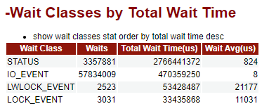

**解读：**

这一部分按照等待类型（STATUS、IO_EVENT、LWLOCK_EVENT、LOCK_EVENT），分类统计等待次数、总等待时间、平均等待时间。
**相关代码：**

```
-- 说明： 变量ld-->snapshot_id, 变量s-->node_name
select
    snap_2.type as "Wait Class",
    (snap_2.wait - snap_1.wait) as "Waits",
    (snap_2.total_wait_time - snap_1.total_wait_time) as "Total Wait Time(us)",
    round((snap_2.total_wait_time - snap_1.total_wait_time) / greatest((snap_2.wait - snap_1.wait), 1)) as "Wait Avg(us)"
from
    (select
        snap_type as type,
        sum(snap_total_wait_time) as total_wait_time,
        sum(snap_wait) as wait from snapshot.snap_global_wait_events
    where snapshot_id = %ld
	and snap_nodename = '%s'
	and snap_event != 'unknown_lwlock_event'
	and snap_event != 'none'
    group by snap_type) snap_2
    left join
    (select
        snap_type as type,
        sum(snap_total_wait_time) as total_wait_time,
        sum(snap_wait) as wait
	from snapshot.snap_global_wait_events
    where snapshot_id = %ld
	and  snap_nodename = '%s'
	and  snap_event != 'unknown_lwlock_event' and snap_event != 'none'
    group by snap_type) snap_1
    on snap_2.type = snap_1.type
    order by "Total Wait Time(us)" desc;
```

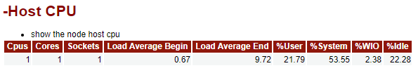

**解读：**
这一部分主机 CPU 的负载情况：CPU 的平均负载、用户使用占比、系统使用占比、IO 等待占比、空闲占比。
**相关 SQL：**

```
select
     snap_2.cpus as "Cpus",
     snap_2.cores as "Cores",
     snap_2.sockets as "Sockets",
     snap_1.load as "Load Average Begin",
     snap_2.load as "Load Average End",
     round(coalesce((snap_2.user_time - snap_1.user_time), 0) / greatest(coalesce((snap_2.total_time - snap_1.total_time), 0), 1)  * 100, 2) as "%User",
     round(coalesce((snap_2.sys_time - snap_1.sys_time), 0)   / greatest(coalesce((snap_2.total_time - snap_1.total_time), 0), 1) * 100, 2)  as "%System",
     round(coalesce((snap_2.iowait_time - snap_1.iowait_time), 0) / greatest(coalesce((snap_2.total_time - snap_1.total_time), 0), 1) * 100, 2) as "%WIO",
     round(coalesce((snap_2.idle_time - snap_1.idle_time), 0) / greatest(coalesce((snap_2.total_time - snap_1.total_time), 0), 1) * 100, 2) as "%Idle"
from
	 (select H.cpus, H.cores, H.sockets, H.idle_time, H.user_time, H.sys_time, H.iowait_time,
	 (H.idle_time + H.user_time + H.sys_time + H.iowait_time) AS total_time, H.load  from
     (select C.cpus, E.cores, T.sockets, I.idle_time, U.user_time, S.sys_time, W.iowait_time, L.load from
     (select snap_value as cpus from snapshot.snap_global_os_runtime
      where (snapshot_id = %ld and snap_node_name = '%s' and snap_name = 'NUM_CPUS')) AS C,
     (select snap_value as cores from snapshot.snap_global_os_runtime
      where (snapshot_id = %ld and snap_node_name = '%s' and snap_name = 'NUM_CPU_CORES')) AS E,
     (select snap_value as sockets from snapshot.snap_global_os_runtime
      where (snapshot_id = %ld and snap_node_name = '%s' and snap_name = 'NUM_CPU_SOCKETS')) AS T,
     (select snap_value as idle_time from snapshot.snap_global_os_runtime
      where (snapshot_id = %ld and snap_node_name = '%s' and snap_name = 'IDLE_TIME')) AS I,
     (select snap_value as user_time from snapshot.snap_global_os_runtime
      where (snapshot_id = %ld and snap_node_name = '%s' and snap_name = 'USER_TIME')) AS U,
     (select snap_value as sys_time from snapshot.snap_global_os_runtime
      where (snapshot_id = %ld and snap_node_name = '%s' and snap_name = 'SYS_TIME')) AS S,
     (select snap_value as iowait_time from snapshot.snap_global_os_runtime
      where (snapshot_id = %ld and snap_node_name = '%s' and snap_name = 'IOWAIT_TIME')) AS W,
     (select snap_value as load from snapshot.snap_global_os_runtime
      where (snapshot_id = %ld and snap_node_name = '%s' and snap_name = 'LOAD')) AS L ) as H ) as snap_2,

     (select H.cpus, H.cores, H.sockets, H.idle_time, H.user_time, H.sys_time, H.iowait_time,
     (H.idle_time + H.user_time + H.sys_time + H.iowait_time) AS total_time, H.load from
     (select C.cpus, E.cores, T.sockets, I.idle_time, U.user_time, S.sys_time, W.iowait_time, L.load from
     (select snap_value as cpus from snapshot.snap_global_os_runtime
      where (snapshot_id = %ld and snap_node_name = '%s' and snap_name = 'NUM_CPUS')) AS C,
     (select snap_value as cores from snapshot.snap_global_os_runtime
      where (snapshot_id = %ld and snap_node_name = '%s' and snap_name = 'NUM_CPU_CORES')) AS E,
     (select snap_value as sockets from snapshot.snap_global_os_runtime
      where (snapshot_id = %ld and snap_node_name = '%s' and snap_name = 'NUM_CPU_SOCKETS')) AS T,
     (select snap_value as idle_time from snapshot.snap_global_os_runtime
      where (snapshot_id = %ld and snap_node_name = '%s' and snap_name = 'IDLE_TIME')) AS I,
     (select snap_value as user_time from snapshot.snap_global_os_runtime
      where (snapshot_id = %ld and snap_node_name = '%s' and snap_name = 'USER_TIME')) AS U,
     (select snap_value as sys_time from snapshot.snap_global_os_runtime
      where (snapshot_id = %ld and snap_node_name = '%s' and snap_name = 'SYS_TIME')) AS S,
     (select snap_value as iowait_time from snapshot.snap_global_os_runtime
      where (snapshot_id = %ld and snap_node_name = '%s' and snap_name = 'IOWAIT_TIME')) AS W,
     (select snap_value as load from snapshot.snap_global_os_runtime
      where (snapshot_id = %ld and snap_node_name = '%s' and snap_name = 'LOAD')) AS L ) as H ) as snap_1 ;
```

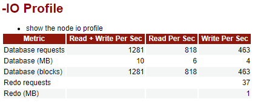

**解读：**
这一部分描述了 openGauss 在快照期间的 IO 负载情况。
**Database requests：** 即每秒 IO 请求次数，包括请求次数总和、读请求次数、写请求次数.
**Database(blocks)：** 即每秒 block 请求数量，包含请求的 block 总和数量、读 block 的数量和写 block 的数量.
**Database(MB):** 即将 block 换算成容量(MB)[如：blocks * 8/1024]，增加数据的可读性。
**Redo requests 和 Redo(MB)** 分别表示每秒 redo 的写请求次数和 redo 写的数据量。
相关代码：

```
-- 由于源码中相关SQL融合了C++程序语法，像我这种不做开发的DBA读起来有些难以理解【如：(phyblkwrt * %d) >> 20 这个段没有很好理解】。
-- 但是依旧不影响我们对这些数据采集方法的理解，相关SQL如下：
-- 两个snapshot_id(24和25)期间，数据块的IO统计信息(数值除以3600即换算成以秒为单位的WDR数据)
postgres=# select
               (snap_2.phytotal - snap_1.phytotal) as phytotal,
               (snap_2.phyblktotal - snap_1.phyblktotal) as phyblktotal,
               (snap_2.phyrds - snap_1.phyrds) as phyrds,
               (snap_2.phyblkrd - snap_1.phyblkrd) as phyblkrd,
               (snap_2.phywrts - snap_1.phywrts) as phywrts,
               (snap_2.phyblkwrt - snap_1.phyblkwrt) as phyblkwrt
           from
               (select (snap_phyrds + snap_phywrts) as phytotal,
                   (snap_phyblkwrt + snap_phyblkrd) as phyblktotal,
                   snap_phyrds as phyrds, snap_phyblkrd as phyblkrd,
                   snap_phywrts as phywrts, snap_phyblkwrt as phyblkwrt
                from snapshot.snap_global_rel_iostat
                where snapshot_id = 24 and snap_node_name = 'dn_6001') snap_1,
               (select (snap_phyrds + snap_phywrts) as phytotal,
                   (snap_phyblkwrt + snap_phyblkrd) as phyblktotal,
                   snap_phyrds as phyrds, snap_phyblkrd as phyblkrd,
                   snap_phywrts as phywrts, snap_phyblkwrt as phyblkwrt
                from snapshot.snap_global_rel_iostat
                where snapshot_id = 25 and snap_node_name = 'dn_6001') snap_2;
 phytotal | phyblktotal | phyrds  | phyblkrd | phywrts | phyblkwrt
----------+-------------+---------+----------+---------+-----------
  4626892 |     4626892 | 2955639 |  2955639 | 1671253 |   1671253

-- 两个snapshot_id(24和25)期间，redo的统计信息(数值除以3600即换算成以秒为单位的WDR数据)
postgres=# select
                (snap_2.phywrts - snap_1.phywrts) as phywrts,
                (snap_2.phyblkwrt - snap_1.phyblkwrt) as phyblkwrt
            from
                (select sum(snap_phywrts) as phywrts, sum(snap_phyblkwrt) as phyblkwrt
                from snapshot.snap_global_file_redo_iostat
                where snapshot_id = 24 and snap_node_name = 'dn_6001') snap_1,
                (select sum(snap_phywrts) as phywrts, sum(snap_phyblkwrt) as phyblkwrt
                from snapshot.snap_global_file_redo_iostat
                where snapshot_id = 25 and snap_node_name = 'dn_6001') snap_2;
 phywrts | phyblkwrt
---------+-----------
  132721 |    509414
```


**解读：**

&nbsp;&nbsp;&nbsp;&nbsp;这一部分描述了节点内存的变化信息,通过这些变化信息，我们可以了解到在两次快照期间，数据库的内存变化情况，作为数据库性能分析或异常分析的参考。数据来源于 snapshot.snap_global_memory_node_detail。
**这部分分别描述了：** 内存的类型 以及 对应的起始大小和终止大小。
**这里没有采集到数据的原因：** 测试环境内存太小，导致启动时将 memory protect 关闭了，从而导致无法查询 dbe_perf.global_memory_node_detail 视图。 而 WDR 的内存统计数据(snapshot.snap_global_memory_node_detail)则来源于该视图。
另外，请确保 disable_memory_protect=off。
关于这部分 Memory Type 常见类型如下：

| Memory 类型             | 说明                           |
| :---------------------- | :----------------------------- |
| max_process_memory      | openGauss 实例所占用的内存大小 |
| process_used_memory     | 进程所使用的内存大小           |
| max_dynamic_memory      | 最大动态内存                   |
| dynamic_used_memory     | 已使用的动态内存               |
| dynamic_peak_memory     | 内存的动态峰值                 |
| dynamic_used_shrctx     | 最大动态共享内存上下文         |
| dynamic_peak_shrctx     | 共享内存上下文的动态峰值       |
| max_shared_memory       | 最大共享内存                   |
| shared_used_memory      | 已使用的共享内存               |
| max_cstore_memory       | 列存所允许使用的最大内存       |
| cstore_used_memory      | 列存已使用的内存大小           |
| max_sctpcomm_memory     | sctp 通信所允许使用的最大内存  |
| sctpcomm_used_memory    | sctp 通信已使用的内存大小      |
| sctpcomm_peak_memory    | sctp 通信的内存峰值            |
| other_used_memory       | 其他已使用的内存大小           |
| gpu_max_dynamic_memory  | GPU 最大动态内存               |
| gpu_dynamic_used_memory | GPU 已使用的动态内存           |
| gpu_dynamic_peak_memory | GPU 内存的动态峰值             |
| pooler_conn_memory      | 链接池申请内存计数             |
| pooler_freeconn_memory  | 链接池空闲连接的内存计数       |
| storage_compress_memory | 存储模块压缩使用的内存大小     |
| udf_reserved_memory     | UDF 预留的内存大小             |

**相关代码：**

```
-- 说明：%s代表node_name，%ld代表snapshot_id
select
    snap_2.snap_memorytype   as "Memory Type",
    snap_1.snap_memorymbytes as "Begin(MB)",
    snap_2.snap_memorymbytes as "End(MB)"
from
    (select snap_memorytype, snap_memorymbytes
     from
     snapshot.snap_global_memory_node_detail
     where (snapshot_id = %ld and snap_nodename = '%s')
     and
    (snap_memorytype = 'max_process_memory'
     or snap_memorytype = 'process_used_memory'
     or snap_memorytype = 'max_shared_memory'
     or  snap_memorytype = 'shared_used_memory'))
    as snap_2
left join
    (select snap_memorytype, snap_memorymbytes
     from
	 snapshot.snap_global_memory_node_detail
	 where (snapshot_id = %ld and snap_nodename = '%s')
	 and (snap_memorytype = 'max_process_memory'
	 or  snap_memorytype = 'process_used_memory'
	 or  snap_memorytype = 'max_shared_memory'
	 or snap_memorytype = 'shared_used_memory'))
    as snap_1
on snap_2.snap_memorytype = snap_1.snap_memorytype;
```

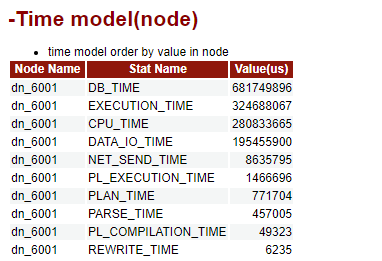

**解读：**
这一部分描述了数据库各种状态所消耗的时间，关于 Stat Name 的解释如下：

| Stat Name           | 说明                              |
| :------------------ | :-------------------------------- |
| DB_TIME             | 作业在多核下的有效时间花销        |
| CPU_TIME            | CPU 的时间花销                    |
| EXECUTION_TIME      | 执行器内的时间花销                |
| PARSE_TIME          | SQL 解析的时间花销                |
| PLAN_TIME           | 生成 Plan 的时间花销              |
| REWRITE_TIME        | SQL 重写的时间花销                |
| PL_EXECUTION_TIME   | plpgsql（存储过程）执行的时间花销 |
| PL_COMPILATION_TIME | plpgsql（存储过程）编译的时间花销 |
| NET_SEND_TIME       | 网络上的时间花销                  |
| DATA_IO_TIME        | IO 上的时间花销                   |

**相关代码：**

```
-- 说明：%s代表node_name，%ld代表snapshot_id
select     t2.snap_node_name as "Node Name",
	   t2.snap_stat_name as "Stat Name",
	   (t2.snap_value - coalesce(t1.snap_value, 0)) as "Value(us)"
from
      (select * from snapshot.snap_global_instance_time
	where snapshot_id = %ld
	and snap_node_name = '%s') t1
right join
      (select * from snapshot.snap_global_instance_time
	where snapshot_id = %ld
	and   snap_node_name = '%s') t2
on t1.snap_stat_name = t2.snap_stat_name
order by "Value(us)"
desc limit 200;
```

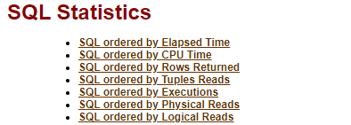
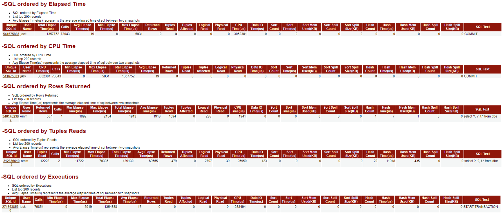
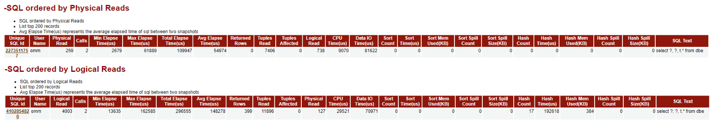

**解读：**

这一部分分别从 SQL 执行时间、SQL 消耗 CPU 的时间、SQL 返回的行数、SQL 扫描的行数、SQL 执行的次数、SQL 物理读的次数、SQL 逻辑读的次数等多维度对两次快照期间的 SQL 执行情况进行统计。
关于表中列的含义，如下所示：

| 列名称                | 备注                                           |
| --------------------- | ---------------------------------------------- |
| Unique SQL Id         | 归一化的 SQL ID, 即 SQL 唯一标识               |
| User Name             | 执行 SQL 的用户                                |
| Logical Read          | 逻辑读，即 Buffer 的块访问次数                 |
| Calls                 | SQL 的调用次数                                 |
| Min Elapse Time(us)   | SQL 在内核中的最小运行时间（单位：微秒）       |
| Max Elapse Time(us)   | SQL 在内核中的最大运行时间（单位：微秒）       |
| Total Elapse Time(us) | SQL 在内核中的总运行时间 （单位：微秒）        |
| Avg Elapse Time(us)   | SQL 在内核中的平均运行时间（单位：微秒）       |
| Returned Rows         | SELECT 返回的结果集行数                        |
| Tuples Read           | SQL 扫描的总行数(包括顺序扫描和随机扫描)       |
| Tuples Affected       | SQL 删除的行数                                 |
| Physical Read         | 物理读，即下盘读取 block 进入 buffer 的次数    |
| CPU Time(us)          | SQL 消耗的 CPU 时间（单位：微秒）              |
| Data IO Time(us)      | IO 上的时间花费（单位：微秒）                  |
| Sort Count            | SQL 排序执行的次数                             |
| Sort Time(us)         | SQL 排序执行的时间（单位：微秒）               |
| Sort Mem Used(KB)     | 排序过程中使用的 work memory 大小（单位：KB）  |
| Sort Spill Count      | 排序过程中发生落盘写文件的次数                 |
| Sort Spill Size(KB)   | 排序过程中发生落盘写文件的大小（单位：KB）     |
| Hash Count            | hash 执行的次数                                |
| Hash Time(us)         | hash 执行的时间（单位：微秒）                  |
| Hash Mem Used(KB)     | hash 过程中使用的 work memory 大小（单位：KB） |
| Hash Spill Count      | hash 过程中发生落盘写文件的次数                |
| Hash Spill Size(KB)   | hash 过程中发生落盘写文件的大小（单位：KB）    |
| SQL Text              | SQL 语句内容                                   |

Tips：Top200 显得有些冗余，多余的 SQL 信息并没有太大用处，反而降低了可读性，希望将来能优化到 Top20。
**相关代码：**

```
-- 由于多个SQL统计信息的SQL语句类似，这里仅列举SQL执行时间的统计SQL，其他的类似。
-- 说明：%s代表node_name，%ld代表snapshot_id
select 	t2.snap_unique_sql_id 												  as "Unique SQL Id",
		t2.snap_user_name 	  												  as "User Name",
		(t2.snap_total_elapse_time - coalesce(t1.snap_total_elapse_time, 0))  as "Total Elapse Time(us)",
		(t2.snap_n_calls - coalesce(t1.snap_n_calls, 0))                      as "Calls",
		round("Total Elapse Time(us)"/greatest("Calls", 1), 0)                as "Avg Elapse Time(us)",
		t2.snap_min_elapse_time 	    				      as "Min Elapse Time(us)",
		t2.snap_max_elapse_time 					      as "Max Elapse Time(us)",
		(t2.snap_n_returned_rows - coalesce(t1.snap_n_returned_rows, 0))      as "Returned Rows",
		((t2.snap_n_tuples_fetched - coalesce(t1.snap_n_tuples_fetched, 0)) +
		(t2.snap_n_tuples_returned - coalesce(t1.snap_n_tuples_returned, 0))) as "Tuples Read",
		((t2.snap_n_tuples_inserted - coalesce(t1.snap_n_tuples_inserted, 0)) +
		(t2.snap_n_tuples_updated - coalesce(t1.snap_n_tuples_updated, 0)) +
		(t2.snap_n_tuples_deleted - coalesce(t1.snap_n_tuples_deleted, 0)))   as "Tuples Affected",
		(t2.snap_n_blocks_fetched - coalesce(t1.snap_n_blocks_fetched, 0))    as "Logical Read",
		((t2.snap_n_blocks_fetched - coalesce(t1.snap_n_blocks_fetched, 0)) -
		(t2.snap_n_blocks_hit - coalesce(t1.snap_n_blocks_hit, 0)))           as "Physical Read",
		(t2.snap_cpu_time - coalesce(t1.snap_cpu_time, 0)) 		      as "CPU Time(us)",
		(t2.snap_data_io_time - coalesce(t1.snap_data_io_time, 0)) 	      as "Data IO Time(us)",
		(t2.snap_sort_count - coalesce(t1.snap_sort_count, 0)) 		      as "Sort Count",
		(t2.snap_sort_time - coalesce(t1.snap_sort_time, 0)) 		      as "Sort Time(us)",
		(t2.snap_sort_mem_used - coalesce(t1.snap_sort_mem_used, 0)) 	      as "Sort Mem Used(KB)",
		(t2.snap_sort_spill_count - coalesce(t1.snap_sort_spill_count, 0))    as "Sort Spill Count",
		(t2.snap_sort_spill_size - coalesce(t1.snap_sort_spill_size, 0))      as "Sort Spill Size(KB)",
		(t2.snap_hash_count - coalesce(t1.snap_hash_count, 0)) 		      as "Hash Count",
		(t2.snap_hash_time - coalesce(t1.snap_hash_time, 0)) 		      as "Hash Time(us)",
		(t2.snap_hash_mem_used - coalesce(t1.snap_hash_mem_used, 0)) 	      as "Hash Mem Used(KB)",
		(t2.snap_hash_spill_count - coalesce(t1.snap_hash_spill_count, 0))    as "Hash Spill Count",
		(t2.snap_hash_spill_size - coalesce(t1.snap_hash_spill_size, 0))      as "Hash Spill Size(KB)",
		LEFT(t2.snap_query, 25) 					      as "SQL Text"
from
		(select * from snapshot.snap_summary_statement where snapshot_id = %ld and snap_node_name = '%s') t1
		right join
		(select * from snapshot.snap_summary_statement where snapshot_id = %ld and snap_node_name = '%s') t2
		on t1.snap_unique_sql_id = t2.snap_unique_sql_id
		and t1.snap_user_id = t2.snap_user_id
		order by "Total Elapse Time(us)"
		desc limit 200;
```

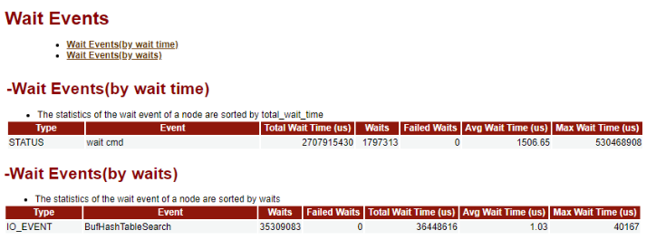

**解读：**
这一部分分别从等待时长、等待次数这两个维度对等待事件进行统计。
表格中列的含义即就是列的英文翻译，这里就不再复述了。
具体的等待事件的介绍详见前文：“Top 10 Events by Total Wait Time”部分的内容，这里也不再复述。
**相关代码：**

```
-- 说明：%s代表node_name，%ld代表snapshot_id，无论从哪个维度统计，基本的SQL语句差异不大，这里仅列举"by wait time"的SQL示例
select     t2.snap_type  as "Type",
	   t2.snap_event as "Event",
	  (t2.snap_total_wait_time - coalesce(t1.snap_total_wait_time, 0)) as "Total Wait Time (us)",
	  (t2.snap_wait - coalesce(t1.snap_wait, 0)) as "Waits",
	  (t2.snap_failed_wait - coalesce(t1.snap_failed_wait, 0)) as "Failed Waits",
	  (case "Waits"
	   when  0 then 0
	   else round("Total Wait Time (us)" / "Waits", 2)
	   end) as "Avg Wait Time (us)",
	   t2.snap_max_wait_time as "Max Wait Time (us)"
from
      (select * from snapshot.snap_global_wait_events
	   where snapshot_id = %ld
	   and snap_nodename = '%s'
	   and snap_event != 'unknown_lwlock_event'
	   and snap_event != 'none') t1
right join
	  (select * from snapshot.snap_global_wait_events
	   where snapshot_id = %ld
	   and snap_nodename = '%s'
	   and snap_event != 'unknown_lwlock_event'
	   and snap_event != 'none') t2
on t1.snap_event = t2.snap_event
order by "Total Wait Time (us)"
desc limit 200;
```

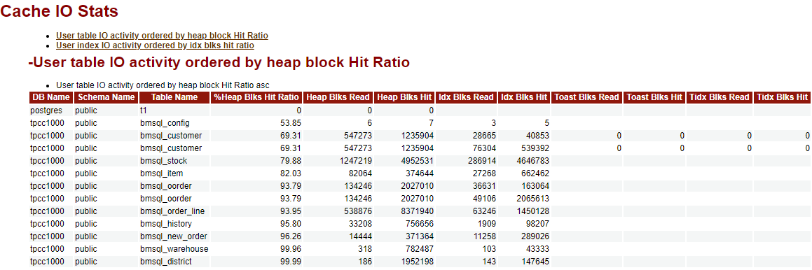

**解读：**
这一部分根据 Heap block 的命中率排序统计用户表的 IO 活动状态。
数据来源于 snapshot.snap_global_statio_all_indexes 表和 snapshot.snap_global_statio_all_tables 表。
该表相关列的介绍如下：

| 列名                 | 描述                                                                   |
| -------------------- | ---------------------------------------------------------------------- |
| DB Name              | 数据库名                                                               |
| Schema Name          | 模式名                                                                 |
| Table Name           | 表名                                                                   |
| %Heap Blks Hit Ratio | 数据块读取缓存命中率=heap_blks_hit/(heap_blks_read+heap_blks_hit)\*100 |
| Heap Blks Read       | 从该表中读取的磁盘块数                                                 |
| Heap Blks Hit        | 此表缓存命中数                                                         |
| Idx Blks Read        | 从表中所有索引读取的磁盘块数                                           |
| Idx Blks Hit         | 表中所有索引命中缓存数                                                 |
| Toast Blks Read      | 此表的 TOAST 表读取的磁盘块数（如果存在）                              |
| Toast Blks Hit       | 此表的 TOAST 表命中缓冲区数（如果存在）                                |
| Tidx Blks Read       | 此表的 TOAST 表索引读取的磁盘块数（如果存在）                          |
| Tidx Blks Hit        | 此表的 TOAST 表索引命中缓冲区数（如果存在）                            |

**相关代码：**

```
-- 说明：%s代表node_name，%ld代表snapshot_id
SELECT table_io.db_name             as "DB Name",
       table_io.snap_schemaname     as "Schema Name",
       table_io.snap_relname        as "Table Name",
       table_io.heap_blks_hit_ratio as "%Heap Blks Hit Ratio",
       table_io.heap_blks_read      as "Heap Blks Read",
       table_io.heap_blks_hit       as  "Heap Blks Hit",
       idx_io.idx_blks_read         as "Idx Blks Read",
       idx_io.idx_blks_hit          as "Idx Blks Hit",
       table_io.toast_blks_read     as "Toast Blks Read",
       table_io.toast_blks_hit      as "Toast Blks Hit",
       table_io.tidx_blks_read      as "Tidx Blks Read",
       table_io.tidx_blks_hit       as  "Tidx Blks Hit"
FROM
       (select t2.db_name, t2.snap_schemaname , t2.snap_relname ,
       (case
       when ((t2.snap_heap_blks_read - coalesce(t1.snap_heap_blks_read, 0)) + (t2.snap_heap_blks_hit - coalesce(t1.snap_heap_blks_hit, 0))) = 0
       then 0
       else round((t2.snap_heap_blks_hit - coalesce(t1.snap_heap_blks_hit, 0))/
         ((t2.snap_heap_blks_read - coalesce(t1.snap_heap_blks_read, 0)) + (t2.snap_heap_blks_hit - coalesce(t1.snap_heap_blks_hit, 0))) * 100, 2)
       end ) as heap_blks_hit_ratio,
         (t2.snap_heap_blks_read - coalesce(t1.snap_heap_blks_read, 0))   as heap_blks_read,
         (t2.snap_heap_blks_hit - coalesce(t1.snap_heap_blks_hit, 0))     as heap_blks_hit,
         (t2.snap_idx_blks_read - coalesce(t1.snap_idx_blks_read, 0))     as idx_blks_read,
         (t2.snap_idx_blks_hit - coalesce(t1.snap_idx_blks_hit, 0))       as idx_blks_hit,
         (t2.snap_toast_blks_read - coalesce(t1.snap_toast_blks_read, 0)) as toast_blks_read,
         (t2.snap_toast_blks_hit - coalesce(t1.snap_toast_blks_hit, 0))   as toast_blks_hit,
         (t2.snap_tidx_blks_read - coalesce(t1.snap_tidx_blks_read, 0))   as tidx_blks_read,
         (t2.snap_tidx_blks_hit - coalesce(t1.snap_tidx_blks_hit, 0))     as tidx_blks_hit from
         (select * from snapshot.snap_global_statio_all_tables
          where snapshot_id = %ld and snap_node_name = '%s'
          and snap_schemaname NOT IN ('pg_catalog', 'information_schema', 'snapshot')
          and snap_schemaname !~ '^pg_toast') t1
        right join
         (select * from snapshot.snap_global_statio_all_tables
          where snapshot_id = %ld
          and snap_node_name = '%s'
          and snap_schemaname NOT IN ('pg_catalog', 'information_schema', 'snapshot')
          and snap_schemaname !~ '^pg_toast') t2
         on t1.snap_relid = t2.snap_relid
         and t2.db_name = t1.db_name
         and t2.snap_schemaname = t1.snap_schemaname )  as table_io
LEFT JOIN
	(select t2.db_name , t2.snap_schemaname , t2.snap_relname,
         (t2.snap_idx_blks_read - coalesce(t1.snap_idx_blks_read, 0)) as idx_blks_read,
         (t2.snap_idx_blks_hit - coalesce(t1.snap_idx_blks_hit, 0))   as idx_blks_hit
         from
         (select * from snapshot.snap_global_statio_all_indexes
          where snapshot_id = %ld
		  and snap_node_name = '%s'
		  and snap_schemaname NOT IN ('pg_catalog', 'information_schema', 'snapshot')
		  and snap_schemaname !~ '^pg_toast') t1
         right join
         (select * from snapshot.snap_global_statio_all_indexes
          where snapshot_id = %ld
          and snap_node_name = '%s'
          and snap_schemaname NOT IN ('pg_catalog', 'information_schema', 'snapshot')
          AND snap_schemaname !~ '^pg_toast') t2
         on t1.snap_relid = t2.snap_relid
         and t2.snap_indexrelid = t1.snap_indexrelid
         and t2.db_name = t1.db_name and t2.snap_schemaname = t1.snap_schemaname) as idx_io
on table_io.db_name = idx_io.db_name
and table_io.snap_schemaname = idx_io.snap_schemaname
and table_io.snap_relname = idx_io.snap_relname
order by "%%Heap Blks Hit Ratio"
asc limit 200;
```

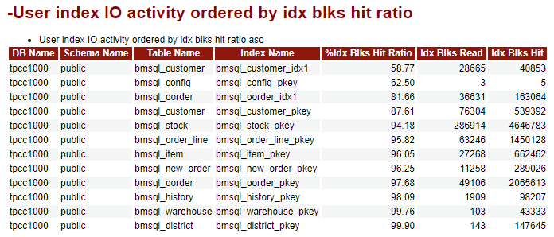

**解读：**
这一部分根据索引缓存命中率，统计用户索引 IO 活动信息。
数据来源于 snapshot.snap_global_statio_all_indexes 表。
相关列信息如下：

| 列名                | 介绍                                                                |
| ------------------- | ------------------------------------------------------------------- |
| DB Name             | 数据库名                                                            |
| Schema Name         | 模式名                                                              |
| Table Name          | 表名                                                                |
| Index Name          | 索引名                                                              |
| %Idx Blks Hit Ratio | 索引缓冲命中率="Idx Blks Hit"/("Idx Blks Hit"+"Idx Blks Read")\*100 |
| Idx Blks Read       | 从索引中读取的磁盘块数                                              |
| Idx Blks Hit        | 索引命中缓存数                                                      |

**相关代码：**

```
-- 说明：%s代表node_name，%ld代表snapshot_id
select t2.db_name           as "DB Name",
	   t2.snap_schemaname   as "Schema Name",
	   t2.snap_relname      as "Table Name",
	   t2.snap_indexrelname as "Index Name",
      (case
       when ((t2.snap_idx_blks_read - coalesce(t1.snap_idx_blks_read, 0)) + (t2.snap_idx_blks_hit - coalesce(t1.snap_idx_blks_hit, 0))) = 0 then 0
	   else
       round((t2.snap_idx_blks_hit - coalesce(t1.snap_idx_blks_hit, 0))/((t2.snap_idx_blks_hit - coalesce(t1.snap_idx_blks_hit, 0)) +
      (t2.snap_idx_blks_read - coalesce(t1.snap_idx_blks_read, 0))) * 100, 2)
	   end)                                                         as "%Idx Blks Hit Ratio",
	  (t2.snap_idx_blks_read - coalesce(t1.snap_idx_blks_read, 0))  as "Idx Blks Read",
      (t2.snap_idx_blks_hit - coalesce(t1.snap_idx_blks_hit, 0))    as "Idx Blks Hit"
from
      (select * from snapshot.snap_global_statio_all_indexes
	   where snapshot_id = %ld
	   and snap_node_name = '%s'
	   and snap_schemaname NOT IN ('pg_catalog', 'information_schema', 'snapshot')
       and snap_schemaname !~ '^pg_toast') t1
right join
	 (select * from snapshot.snap_global_statio_all_indexes
	  where snapshot_id = %ld
	  and snap_node_name = '%s'
	  and snap_schemaname NOT IN ('pg_catalog', 'information_schema', 'snapshot')
      and snap_schemaname !~ '^pg_toast') t2
on t1.snap_relid = t2.snap_relid
and t2.snap_indexrelid = t1.snap_indexrelid
and t2.db_name = t1.db_name
and t2.snap_schemaname = t1.snap_schemaname
order by "%Idx Blks Hit Ratio"
asc limit 200;
```

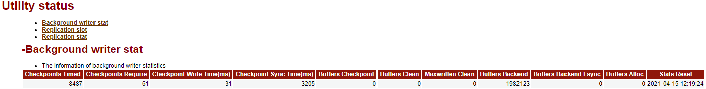

**解读：**
**此处存在缺陷，统计的数据有问题，个人认为 SQL 语句需要修改，详见“相关代码”。**
这一部分描述的是后台写操作的统计信息，数据来源于 snapshot.snap_global_bgwriter_stat 表。
具体内容如下：

| 列名                      | 数据获取相关函数                               | 说明                                                                                |
| ------------------------- | ---------------------------------------------- | ----------------------------------------------------------------------------------- |
| Checkpoints Timed         | pg_stat_get_bgwriter_timed_checkpoints()       | 执行的定期检查点数                                                                  |
| Checkpoints Require       | pg_stat_get_bgwriter_requested_checkpoints()   | 执行的需求检查点数                                                                  |
| Checkpoint Write Time(ms) | pg_stat_get_checkpoint_write_time()            | 检查点操作中，文件写入到磁盘消耗的时间（单位：毫秒）                                |
| Checkpoint Sync Time(ms)  | pg_stat_get_checkpoint_sync_time()             | 检查点操作中，文件同步到磁盘消耗的时间（单位：毫秒）                                |
| Buffers Checkpoint        | pg_stat_get_bgwriter_buf_written_checkpoints() | 检查点写缓冲区数量                                                                  |
| Buffers Clean             | pg_stat_get_bgwriter_buf_written_clean()       | 后端写线程写缓冲区数量                                                              |
| Maxwritten Clean          | pg_stat_get_bgwriter_maxwritten_clean()        | 后端写线程停止清理 Buffer 的次数                                                    |
| Buffers Backend           | pg_stat_get_buf_written_backend()              | 通过后端直接写缓冲区数                                                              |
| Buffers Backend           | Fsync pg_stat_get_buf_fsync_backend()          | 后端不得不执行自己的 fsync 调用的时间数（通常后端写进程处理这些即使后端确实自己写） |
| Buffers Alloc             | pg_stat_get_buf_alloc() 分配的缓冲区数量       |
| Stats Reset               | pg_stat_get_bgwriter_stat_reset_time()         | 这些统计被重置的时间                                                                |

**相关代码：**

```
-- 说明：%s代表node_name，%ld代表snapshot_id
select (snap_2.snap_checkpoints_timed - coalesce(snap_1.snap_checkpoints_timed, 0))         AS "Checkpoints Timed",
       (snap_2.snap_checkpoints_req - coalesce(snap_1.snap_checkpoints_req, 0))             AS "Checkpoints Require",
       (snap_2.snap_checkpoint_write_time - coalesce(snap_1.snap_checkpoint_write_time, 0)) AS "Checkpoint Write Time(ms)",
       (snap_2.snap_checkpoint_sync_time - coalesce(snap_1.snap_checkpoint_sync_time, 0))   AS "Checkpoint Sync Time(ms)",
       (snap_2.snap_buffers_checkpoint - coalesce(snap_1.snap_buffers_checkpoint, 0))       AS "Buffers Checkpoint",
       (snap_2.snap_buffers_clean - coalesce(snap_1.snap_buffers_clean, 0))                 AS "Buffers Clean",
       (snap_2.snap_maxwritten_clean - coalesce(snap_1.snap_maxwritten_clean, 0))           AS "Maxwritten Clean",
       (snap_2.snap_buffers_backend - coalesce(snap_1.snap_buffers_backend, 0))             AS "Buffers Backend",
       (snap_2.snap_buffers_backend_fsync - coalesce(snap_1.snap_buffers_backend_fsync, 0)) AS "Buffers Backend Fsync",
       (snap_2.snap_buffers_alloc - coalesce(snap_1.snap_buffers_alloc, 0))                 AS "Buffers Alloc",
       to_char(snap_2.snap_stats_reset, 'YYYY-MM-DD HH24:MI:SS')                            AS "Stats Reset"
from
       (select * from snapshot.snap_global_bgwriter_stat
	where snapshot_id = %ld
	and snap_node_name = '%s') snap_2
LEFT JOIN
	   (select * from snapshot.snap_global_bgwriter_stat
	    where snapshot_id = %ld
	    and snap_node_name = '%s') snap_1
on snap_2.snapshot_id = snap_1.snapshot_id            --错误点：snap_2.snapshot_id = snap_1.snapshot_id ？ 这其实还是同一个snapshot
and snap_2.snap_node_name = snap_1.snap_node_name
and snap_2.snap_stats_reset = snap_1.snap_stats_reset
limit 200;

-- 统计信息应该是2次snapshot之间的数据，而以上SQL并不能正确输出相关数据。个人觉得可以删除LEFT JOIN连接。
-- 建议修改如下：
select (snap_2.snap_checkpoints_timed - coalesce(snap_1.snap_checkpoints_timed, 0))         AS "Checkpoints Timed",
       (snap_2.snap_checkpoints_req - coalesce(snap_1.snap_checkpoints_req, 0))             AS "Checkpoints Require",
       (snap_2.snap_checkpoint_write_time - coalesce(snap_1.snap_checkpoint_write_time, 0)) AS "Checkpoint Write Time(ms)",
       (snap_2.snap_checkpoint_sync_time - coalesce(snap_1.snap_checkpoint_sync_time, 0))   AS "Checkpoint Sync Time(ms)",
       (snap_2.snap_buffers_checkpoint - coalesce(snap_1.snap_buffers_checkpoint, 0))       AS "Buffers Checkpoint",
       (snap_2.snap_buffers_clean - coalesce(snap_1.snap_buffers_clean, 0))                 AS "Buffers Clean",
       (snap_2.snap_maxwritten_clean - coalesce(snap_1.snap_maxwritten_clean, 0))           AS "Maxwritten Clean",
       (snap_2.snap_buffers_backend - coalesce(snap_1.snap_buffers_backend, 0))             AS "Buffers Backend",
       (snap_2.snap_buffers_backend_fsync - coalesce(snap_1.snap_buffers_backend_fsync, 0)) AS "Buffers Backend Fsync",
       (snap_2.snap_buffers_alloc - coalesce(snap_1.snap_buffers_alloc, 0))                 AS "Buffers Alloc",
       to_char(snap_2.snap_stats_reset, 'YYYY-MM-DD HH24:MI:SS')                            AS "Stats Reset"
from
       (select * from snapshot.snap_global_bgwriter_stat
	where snapshot_id = %ld
	and snap_node_name = '%s') snap_2,
       (select * from snapshot.snap_global_bgwriter_stat
	where snapshot_id = %ld
	and snap_node_name = '%s') snap_1
limit 200;
```

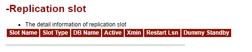

**解读：**[本次实验环境是单机，没有复制槽数据]
这一部分描述的是复制槽的相关信息。数据来源于：snapshot.snap_global_replication_slots 表。
信息内容如下所示：

| 列名          | 描述                                                    |
| ------------- | ------------------------------------------------------- |
| Slot Name     | 复制槽名称                                              |
| Slot Type     | 复制槽类型                                              |
| DB Name       | 数据库名称                                              |
| Active        | 是否为激活状态                                          |
| Xmin          | 事务标识，最早的事务 ID(txid)                           |
| Restart Lsn   | 事务槽开始复制时的 LSN 信息，用来判断哪些事务需要被复制 |
| Dummy Standby | 是否为假备                                              |

**相关代码：**

```
-- 说明：%s代表node_name，%ld代表snapshot_id
SELECT snap_slot_name     as "Slot Name",
       snap_slot_type     as "Slot Type",
       snap_database      as "DB Name",
       snap_active        as "Active",
       snap_x_min         as "Xmin",
       snap_restart_lsn   as "Restart Lsn",
       snap_dummy_standby as "Dummy Standby"
FROM snapshot.snap_global_replication_slots
WHERE snapshot_id = %ld
and snap_node_name = '%s'
limit 200;
```

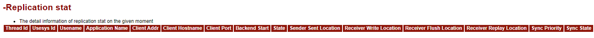

**解读：**[本次实验环境是单机，没有复制槽数据]
这一部分描述事务槽详细的状态信息，数据源于 snapshot.snap_global_replication_stat 表。
信息内容如下所示：

| 列名                     | 描述                                       |
| ------------------------ | ------------------------------------------ |
| Thread Id                | 线程 ID                                    |
| Usesys Id                | 用户 OID                                   |
| Usename                  | 用户名                                     |
| Application Name         | 应用程序名称                               |
| Client Addr              | 客户端地址                                 |
| Client Hostname          | 客户端主机名                               |
| Client Port              | 客户端端口                                 |
| Backend Start            | 程序启动时间                               |
| State                    | 日志复制状态【追赶状态/一直的流状态】      |
| Sender Sent Location     | 日志发送的位置                             |
| Receiver Write Location  | 日志接收端 write 的位置                    |
| Receiver Flush Location  | 日志接收端 flush 的位置                    |
| Receiver Replay Location | 日志接收端 replay 的位置                   |
| Sync Priority            | 同步复制的优先级(0 表示异步复制)           |
| Sync State               | 同步状态【异步复制/同步复制/潜在同步复制】 |

**相关代码：**

```
-- 说明：%s代表node_name，%ld代表snapshot_id
SELECT snap_pid 			as "Thread Id",
       snap_usesysid 			as "Usesys Id",
       snap_usename 			as "Usename",
       snap_application_name 		as "Application Name",
       snap_client_addr 		as "Client Addr",
       snap_client_hostname 		as "Client Hostname",
       snap_client_port 		as "Client Port",
       snap_backend_start 		as "Backend Start",
       snap_state 			as "State",
       snap_sender_sent_location 	as "Sender Sent Location",
       snap_receiver_write_location     as "Receiver Write Location",
       snap_receiver_flush_location     as "Receiver Flush Location",
       snap_receiver_replay_location    as "Receiver Replay Location",
       snap_sync_priority 		as "Sync Priority",
       snap_sync_state 			 as "Sync State"
FROM  snapshot.snap_global_replication_stat
WHERE snapshot_id = %ld
and snap_node_name = '%s' limit 200;
```

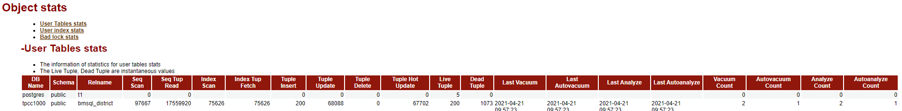

**解读：**
这一部分描述用户表状态的统计信息，数据源于 snapshot.snap_global_stat_all_tables 表。
信息内容如下所示：

| 列名              | 描述                                                                                                                                                                                   |
| ----------------- | -------------------------------------------------------------------------------------------------------------------------------------------------------------------------------------- |
| DB Name           | 数据库名称                                                                                                                                                                             |
| Schema            | 模式名称                                                                                                                                                                               |
| Relname           | 表名称                                                                                                                                                                                 |
| Seq Scan          | 顺序扫描的次数                                                                                                                                                                         |
| Seq Tup Read      | 顺序扫描获取的活跃行数                                                                                                                                                                 |
| Index Scan        | 索引扫描次数                                                                                                                                                                           |
| Index Tup Fetch   | 索引扫描获取的活跃行数                                                                                                                                                                 |
| Tuple Insert      | 插入的行数                                                                                                                                                                             |
| Tuple Update      | 更新的行数                                                                                                                                                                             |
| Tuple Delete      | 删除的行数                                                                                                                                                                             |
| Tuple Hot Update  | HOT(Heap Only Tuple)更新行数备注：HOT 更新指，如果更新后的新行和旧行位于同一个数据块内，则旧行会有一个指针指向新行，这样就不用更新索引了，通过索引访问到旧行数据，进而访问到新行数据。 |
| Live Tuple        | 活跃行数(估值)                                                                                                                                                                         |
| Dead Tuple        | 死行数(估值)                                                                                                                                                                           |
| Last Vacuum       | 最后一次手动 Vacuum 的时间(不包含 VACUUM FULL)                                                                                                                                         |
| Last Autovacuum   | 最后一次 autovacuum 的时间                                                                                                                                                             |
| Last Analyze      | 最后一次手动 Analyze 表的时间                                                                                                                                                          |
| Last Autoanalyze  | 最后一次 autovacuum 线程 Analyze 表的时间                                                                                                                                              |
| Vacuum Count      | 手动 vacuum 的次数(不包含 VACUUM FULL)                                                                                                                                                 |
| Autovacuum Count  | autovacuum 的次数                                                                                                                                                                      |
| Analyze Count     | 手动 Analyze 的次数                                                                                                                                                                    |
| Autoanalyze Count | autovacuum 线程 Analyze 表的次数                                                                                                                                                       |

**相关代码：**

```
-- 说明：%s代表node_name，%ld代表snapshot_id
SELECT 	snap_2.db_name 		as "DB Name",
	snap_2.snap_schemaname 	as "Schema",
	snap_2.snap_relname 	as "Relname",
	(snap_2.snap_seq_scan - coalesce(snap_1.snap_seq_scan, 0)) 		     as "Seq Scan",
	(snap_2.snap_seq_tup_read - coalesce(snap_1.snap_seq_tup_read, 0))           as "Seq Tup Read",
	(snap_2.snap_idx_scan - coalesce(snap_1.snap_idx_scan, 0)) 		     as "Index Scan",
	(snap_2.snap_idx_tup_fetch - coalesce(snap_1.snap_idx_tup_fetch, 0))         as "Index Tup Fetch",
	(snap_2.snap_n_tup_ins - coalesce(snap_1.snap_n_tup_ins, 0)) 		     as "Tuple Insert",
	(snap_2.snap_n_tup_upd - coalesce(snap_1.snap_n_tup_upd, 0)) 		     as "Tuple Update",
	(snap_2.snap_n_tup_del - coalesce(snap_1.snap_n_tup_del, 0)) 		     as "Tuple Delete",
	(snap_2.snap_n_tup_hot_upd - coalesce(snap_1.snap_n_tup_hot_upd, 0)) as "Tuple Hot Update",
	snap_2.snap_n_live_tup 				                             as "Live Tuple",
	snap_2.snap_n_dead_tup 							     as "Dead Tuple",
	to_char(snap_2.snap_last_vacuum, 'YYYY-MM-DD HH24:MI:SS') 		     as "Last Vacuum",
	to_char(snap_2.snap_last_autovacuum, 'YYYY-MM-DD HH24:MI:SS') 		     as "Last Autovacuum",
	to_char(snap_2.snap_last_analyze, 'YYYY-MM-DD HH24:MI:SS') 		     as "Last Analyze",
	to_char(snap_2.snap_last_autoanalyze, 'YYYY-MM-DD HH24:MI:SS') 		     as "Last Autoanalyze",
	(snap_2.snap_vacuum_count - coalesce(snap_1.snap_vacuum_count, 0)) 	     as "Vacuum Count",
	(snap_2.snap_autovacuum_count - coalesce(snap_1.snap_autovacuum_count, 0))   as "Autovacuum Count",
	(snap_2.snap_analyze_count - coalesce(snap_1.snap_analyze_count, 0)) 	     as "Analyze Count",
	(snap_2.snap_autoanalyze_count - coalesce(snap_1.snap_autoanalyze_count, 0)) as "Autoanalyze Count"
FROM
	(SELECT * FROM snapshot.snap_global_stat_all_tables
	 WHERE snapshot_id = %ld
	 and snap_node_name = '%s'
	 and snap_schemaname NOT IN ('pg_catalog', 'information_schema', 'snapshot')
	 AND snap_schemaname !~ '^pg_toast') snap_2
LEFT JOIN
	(SELECT * FROM snapshot.snap_global_stat_all_tables
	 WHERE snapshot_id = %ld
	 and snap_node_name = '%s'
	 and snap_schemaname NOT IN ('pg_catalog', 'information_schema', 'snapshot')
	 AND snap_schemaname !~ '^pg_toast') snap_1
ON snap_2.snap_relid = snap_1.snap_relid
AND snap_2.snap_schemaname = snap_1.snap_schemaname
AND snap_2.snap_relname = snap_1.snap_relname
AND snap_2.db_name = snap_1.db_name
order by snap_2.db_name, snap_2.snap_schemaname
limit 200;
```

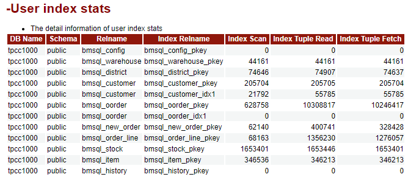

**解读：**
这一部分描述用户索引状态的统计信息，数据源于 snapshot.snap_global_stat_all_indexes 表。
信息内容如下所示：

| 列名              | 描述                     |
| ----------------- | ------------------------ |
| DB Name           | 数据库名称               |
| Schema            | 模式名称                 |
| Relname           | 表名称                   |
| Index Relname     | 索引名称                 |
| Index Scan        | 索引扫描次数             |
| Index Tuple Read  | 索引扫描返回的索引条目数 |
| Index Tuple Fetch | 索引扫描获取的活跃行数   |

**相关代码：**

```
-- 说明：%s代表node_name，%ld代表snapshot_id
SELECT 	snap_2.db_name 			as "DB Name",
	snap_2.snap_schemaname 		as "Schema",
	snap_2.snap_relname 		as "Relname",
	snap_2.snap_indexrelname 	as "Index Relname",
	(snap_2.snap_idx_scan - coalesce(snap_1.snap_idx_scan, 0)) 		as "Index Scan",
	(snap_2.snap_idx_tup_read - coalesce(snap_1.snap_idx_tup_read, 0)) 	as "Index Tuple Read",
	(snap_2.snap_idx_tup_fetch - coalesce(snap_1.snap_idx_tup_fetch, 0)) 	as "Index Tuple Fetch"
FROM
	(SELECT * FROM snapshot.snap_global_stat_all_indexes
	 WHERE snapshot_id = %ld
	 and snap_node_name = '%s'
	 and snap_schemaname NOT IN ('pg_catalog', 'information_schema', 'snapshot')
	 and snap_schemaname !~ '^pg_toast') snap_2
LEFT JOIN
	(SELECT * FROM snapshot.snap_global_stat_all_indexes
	 WHERE snapshot_id = %ld
	 and snap_node_name = '%s'
	 and snap_schemaname NOT IN ('pg_catalog', 'information_schema', 'snapshot')
	 and snap_schemaname !~ '^pg_toast') snap_1
ON snap_2.snap_relid = snap_1.snap_relid
and snap_2.snap_indexrelid = snap_1.snap_indexrelid
and snap_2.snap_schemaname = snap_1.snap_schemaname
and snap_2.snap_relname = snap_1.snap_relname
and snap_2.snap_indexrelname = snap_1.snap_indexrelname
and snap_2.db_name = snap_1.db_name
order by snap_2.db_name, snap_2.snap_schemaname
limit 200;
```

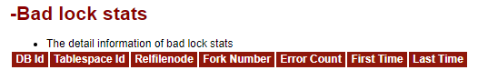

**解读：**
这一部分描述坏块的统计信息，数据源于 snapshot.snap_global_stat_bad_block 表。
信息内容如下所示：

| 列名          | 描述                    |
| ------------- | ----------------------- |
| DB Id         | 数据库 OID              |
| Tablespace Id | 表空间 OID              |
| Relfilenode   | relation 的 filenode 号 |
| Fork Number   | fork 编号               |
| Error Count   | error 数量              |
| First Time    | 坏块第一次出现的时间    |
| Last Time     | 坏块最近一次出现的时间  |

**相关代码：**

```
-- 说明：%s代表node_name，%ld代表snapshot_id
 SELECT snap_2.snap_databaseid 		AS "DB Id",
	snap_2.snap_tablespaceid 	AS "Tablespace Id",
	snap_2.snap_relfilenode 	AS "Relfilenode",
	snap_2.snap_forknum 		AS "Fork Number",
	(snap_2.snap_error_count - coalesce(snap_1.snap_error_count, 0)) AS "Error Count",
	snap_2.snap_first_time 		AS "First Time",
	snap_2.snap_last_time 		AS "Last Time"
FROM
	(SELECT * FROM snapshot.snap_global_stat_bad_block
	 WHERE snapshot_id = %ld
	 and snap_node_name = '%s') snap_2
LEFT JOIN
	(SELECT * FROM snapshot.snap_global_stat_bad_block
	 WHERE snapshot_id = %ld
         and snap_node_name = '%s') snap_1
ON snap_2.snap_databaseid = snap_1.snap_databaseid
and snap_2.snap_tablespaceid = snap_1.snap_tablespaceid
and snap_2.snap_relfilenode = snap_1.snap_relfilenode
limit 200;
```

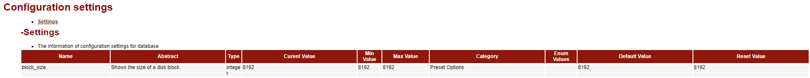

**解读：**
这一部分描述的是数据库参数配置信息，数据源于 snapshot.snap_global_config_settings 表。
信息内容如下所示：

| 列名          | 描述                                    |
| ------------- | --------------------------------------- |
| Name          | 参数名称                                |
| Abstract      | 参数的简单描述                          |
| Type          | 参数类型(bool/enum/integer/real/string) |
| Curent Value  | 参数当前值                              |
| Min Value     | 最小参数值                              |
| Max Value     | 最大参数值                              |
| Category      | 参数逻辑组                              |
| Enum Values   | 参数枚举值                              |
| Default Value | 启动时的默认参数值                      |
| Reset Value   | 重置时的默认参数值                      |

**相关代码：**

```
-- 说明：%s代表node_name，%ld代表snapshot_id
select 	snap_name 		as "Name",
	snap_short_desc as "Abstract",
	snap_vartype 	as "Type",
	snap_setting 	as "Curent Value",
	snap_min_val 	as "Min Value",
	snap_max_val 	as "Max Value",
	snap_category 	as "Category",
	snap_enumvals 	as "Enum Values",
	snap_boot_val 	as "Default Value",
	snap_reset_val  as "Reset Value"
FROM
	snapshot.snap_global_config_settings
	WHERE snapshot_id = %ld
	and snap_node_name = '%s';
```

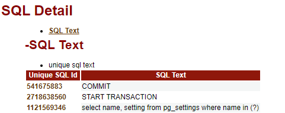

**解读：**
这一部分描述的是 SQL 语句的详细信息，数据来源于 snapshot.snap_summary_statement 表。
**Unique SQL Id：** 即 SQL 的唯一识别 ID
**SQL Text：** 即 SQL 的具体内容。
**相关代码：**

```
-- 说明：%s代表node_name，%ld代表snapshot_id
select 	(t2.snap_unique_sql_id) as "Unique SQL Id",
	(t2.snap_query) 	as "SQL Text"
from
	snapshot.snap_summary_statement t2
	where snapshot_id = %ld
        and snap_node_name = '%s';
```

### 小结：

&nbsp; &nbsp; &nbsp; &nbsp; 关于 openGauss WDR 报告的梳理和解读就到这里，这些内容对于刚刚接触 openGauss 的老 DBA 已经足够了，只要读懂 WDR 报告的数据计算方法和含义即意味着看懂了这份 WDR 报告内容，剩下的数据库优化工作完全可以参照已有的数据库优化经验操作。当然了，“小白”DBA 也完全可以参照网络上大佬们分享的数据库优化案例以及类似 Oracle 等主流数据库的 AWR 报告解读，学习 openGauss 的 WDR 报告，从而执行 openGauss 数据库相关的优化工作。
&nbsp; &nbsp; &nbsp; &nbsp; **以上所有观点仅代表个人，如有不正确之处欢迎大佬们指正。**
