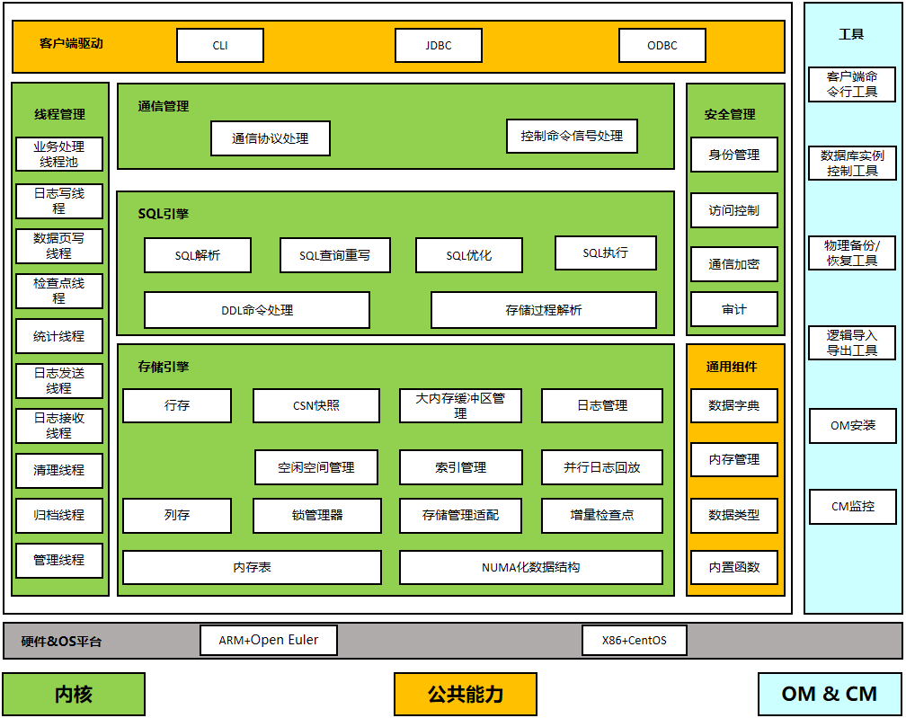
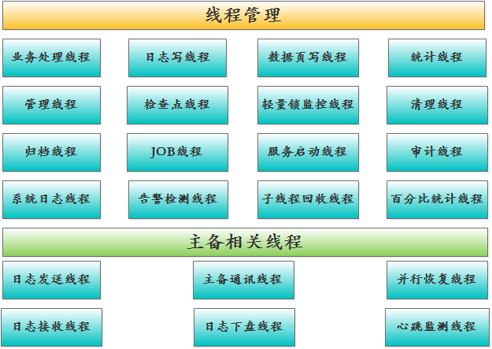
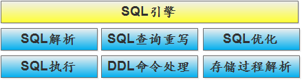
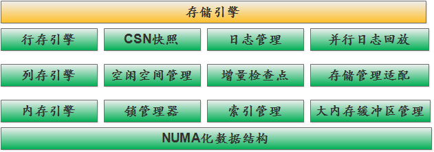
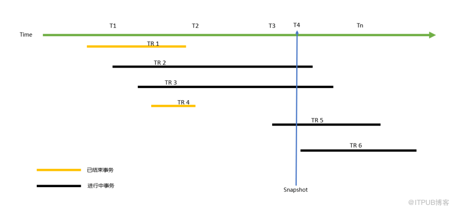
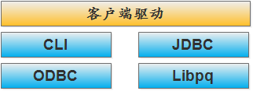
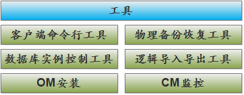
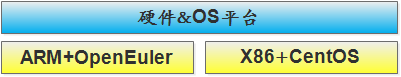

# 浅聊 openGauss 逻辑架构

## 概述

openGauss 数据库是一款由华为主导、各个生态合作伙伴共同建设的开源关系型数据库管理系统，开源发行协议遵从木兰宽松许可证 v2。

openGauss 数据库源于 PostgreSQL-XC 项目，内核源于 Postgres 9.2.4，总代码量约 120W 行，其中内核代码约 95W 行。华为结合企业级场景需求，深度融合其在数据库领域多年的经验，新增或修改了内核代码约 70W 行，内核代码修改比例约占总内核代码量的 74%。保留了原先 PostgreSQL 的接口和公共函数代码\(约 25W 行\)，仅对这些代码做了适当优化，这样也使得 openGauss 与现有的 PG 生态兼容性较好。

总体而言，华为主导的 openGauss 开源项目着重在数据库架构、事务管理、存储引擎、SQL 优化器、以及鲲鹏芯片做了大量优化，以实现其企业级关键价值特性：高性能、高安全、易运维、全开放。

第一次听说 openGauss 的小伙伴本能反应可能是：什么国产数据库？ 那都是外国人的事情！openGauss 应该算是 PostgreSQL 的增强版。

“数据库是外国人的事情” 这个观点适合 20 年前；当武汉达梦、人大金仓、南大通用、神舟通用等传统国产数据库兴起的时候，这个观点应该改为“数据库是中国人可以搞的事情”；2020 年 11 月，PingCAP 宣布完成 D 轮融资 2.7 亿美元，创造了全球数据库历史新的里程碑，其分布式开源数据库 TiDB 目前在国产数据库中排名第一位。同月，阿里宣布山东移动核心系统正式上跑“OceanBase”，使得用户处理效率提升 30%，数据容量由 7TB 压缩为 0.7TB，存储投入成本降低 90%，同时，凭借着 OceanBase、PolarDB、AnalyticDB 等数据库，稳居 Gartner 魔力四象限的领导者地位。同时，华为的 GaussDB 和腾讯的 TDSQL 等数据库也均入选 Gartner 魔力四象限。这些都是国产数据库的突破，标志着国产数据库已经得到了国际认可。随着诸多国产数据库的新闻报道，我们看到了一个又一个国产数据库入驻核心行业\(互联网、金融、电力、政府等等\)的案例，国产数据库已进入百花齐放的时代，“数据库这件事中国人做没有问题”，而且从当前行业发展趋势看，我国的数据库技术正在朝着分布式、云化、以及国产化的道路快速发展，AI4DB、数据库自治等技术也将得到广泛应用，相信在不久的将来，面对数据库的应用场景，国产数据库可以和“外国人”的数据库有相同的话语权。

那么，关于 openGauss，个人认为用“PG 增强版”这个概念替代很不合适。数据库内核是数据库的核心所在，openGauss 的内核修改量高达 74%，这基本上可以算是“脱胎换骨”般的改造，并且从根本上解决了部分 PG 原生架构所带来的缺陷\(如，事务 ID 回卷等\)。由于 PG 的公共函数和接口部分代码做了保留，我们在 openGauss 里面能看到 PG 的影子很正常，但核心技术和发展规划与 PG 有很大不同，否则当初就合并到 PG 社区了。 openGauss 数据库于 2020 年 6 月 30 日对外宣布开源，本人也是在 7 月份开始接触 openGauss 数据库相关资料。作为 DBA 出身的 IT 民工\(本来想说是 IT 工匠，结果发现还不够格，嘿嘿…\)，本能的想先看看数据库的架构介绍，通过架构可以很好的了解数据库的组成模块及相关技术原理，对熟悉 openGauss 数据库有很大帮助，毕竟一个能随心所欲“拆解”数据库的人才是一个优秀的数据库工程师嘛。

在源码包的 doc 目录里面可以找到下面所示的逻辑结构图。

鉴于对这张图比较感兴趣，于是本人参考了部分 PG 文档和 openGauss 文档、结合部分源代码，对逻辑架构图理解如下：

## 内核部分

图中，绿色部分属于 openGauss 数据库的内核部分，该部分总代码量在 95 万行左右，在 PostgreSQL9.2.4 的基础上，华为修改和新增了 70 万行核心代码，着重在架构、事务、存储引擎、优化器以及鲲鹏芯片上做了深度优化。

## 线程管理

最左侧部分属于 openGauss 后台线程部分，通过对该部分的理解，我们可以了解到数据库在运行时，后台都有哪些工作要做。

**业务处理线程**

业务处理线程负责处理客户端请求的任务，当客户端发送连接请求给 postmaster 管理线程后，postmaster 线程会分配相应的业务处理子线程\(命名为 gaussdb\)给客户端使用，后面该客户端的请求和操作由该业务处理子线程负责。当业务处理子线程接收到前端发送过来的查询\(SQL\)后，会使用 openGauss 的 SQL 引擎对 SQL 语句进行词法解析、语法解析、语义解析、查询重写等处理操作，然后使用查询优化器生成最小代价的查询路径计划。SQL 执行器会按照已制定的最优执行计划对 SQL 语句进行执行，并将执行结果反馈给客户端。

**日志写线程**

日志写线程在 openGauss 中被命名为 WalWriter 线程。该线程负责将内存中的预写日志\(WAL\)页数据刷新到预写日志文件中，确保那些已提交的事务都被永久记录，不会丢失。 预写日志\(WAL\)和主流数据库中常见的重做日志功能类似，里面记录了 openGauss 数据文件的变更操作，数据库在执行 SQL 操作时会先将这些变更操作记录在预写日志文件中，然后才定期刷数据至数据文件中。

日志写线程在 postmaster 线程启动后就会启动，当这个线程的刷盘频率无法满足系统需求时，其他常规的后端线程仍然有权限执行预写日志页的刷盘操作。如果日志写线程意外崩溃，则 Postmaster 线程会认为整个 openGauss 后端线程崩溃，此时将调用 SIGQUIT 强制关闭所有后端线程，重置共享内存以恢复后端线程。

**数据页写线程**

数据页写线程在 openGauss 数据库中应该包含两个线程：PageWriter 和 BgWriter。

操作系统数据块大小一般是 4k，数据库一般是 8k/16k/32k，openGauss 默认是 8kb，这样就有可能造成页面断裂问题，一个数据库数据块刷到操作系统的过程中可能发生因宕机而造成块损坏从而导致数据库无法启动的问题。pagewriter 线程负责将脏页数据拷贝至双写\(double-writer\)区域并落盘，然后将脏页转发给 bgwriter 子线程进行数据下盘操作，这样可以防止该现象的发生，因为如果发生数据页"折断"的问题，就会从双写空间里找到完整的数据页进行恢复。

bgwriter 线程\(BgWriter\)主要负责对共享缓冲区的脏页数据进行下盘操作，目的是让数据库线程在进行用户查询时可以很少或者几乎不等待写动作的发生（写动作由后端写线程完成）。这样的机制同样也减少了检查点造成的性能下降。后端写线程将持续的把脏页面刷新到磁盘上，所以在检查点到来的时候，只有少量页面需要刷新到磁盘上。但是这样还是增加了 I/O 的总净负荷，因为以前的检查点间隔里，一个重复弄脏的页面可能只会冲刷一次，而现在一个检查点间隔内，后端写进程可能会写好几次。但在大多数情况下，连续的低负荷要比周期性的尖峰负荷好一些，毕竟数据库稳定十分重要。

如果 bgwriter 的刷盘操作不能保证数据库拥有充足的可用共享缓冲区，那么常规的后端线程仍然有权发出刷盘操作。 bgwriter 线程也是随着 Postmaster 线程启动而启动，我们在执行 recovery 操作的时候也会启动该线程。Postmaster 线程可以调用 SIGTERM 正常关闭，也可以调用 SIGQUIT 强制关闭。如果 bgwriter 线程意外崩溃，则 Postmaster 线程会认为整个 openGauss 后端线程崩溃，此时将调用 SIGQUIT 强制关闭所有后端线程，重置共享内存以恢复后端线程。

**检查点线程**

检查点线程\(Checkpointer\)一般会周期性的发起数据库检查点，检查点\(CHECKPOINT\)是一个事务日志中的点，所有数据文件都在这个点被更新，然后将数据脏页刷新到磁盘的数据文件中，确保数据库一致。 当数据库从崩溃状态恢复后，已经做过 checkpoint 的更改就不再需要从预写日志中恢复，这大大加快了数据库系统 crash 后的恢复速度。 openGauss 的检查点有全量检查点和增量检查点。增量检查点开关打开的时候将不再使用 full_page_writes 防止页面折断，而是依赖双\(double-writer\)特性保护，当增量检查点打开后会小批量分阶段的滚筒式进行脏页刷盘，同时更新 lsn 信息，回收不需要的 xlog 日志。

**统计线程**

统计线程在 openGauss 数据库中被命名为 StatCollector，该线程负责统计 openGauss 数据库的信息，这些信息包括：物理硬件资源使用信息、对象属性及使用信息、SQL 运行信息、会话信息、锁信息、线程信息等，并且将这些收集到的统计信息保存在 pgstat.stat 文件中。这些统计信息经常被用来做性能分析、故障分析、健康检查和状态监控等。

**日志发送线程和日志接收线程**

日志发送线程在 openGauss 中被命名为 WalSender，这个线程主要是在 openGauss 主备环境中，主节点上运行，发送预写日志给备节点。

日志接收线程在 openGauss 中被命名为 WalReceiver，这个线程主要是在 openGauss 主备环境中，备节点上运行，接收预写日志记录。说到主备，还有以下几个线程：

- 主备通讯线程\(RemoteSrv\)
- 日志下盘线程\(WalRcvWriter\) ：将接收到的 WAL records 刷新到备机的 WAL 日志里
- 并行恢复线程\(ParallelRecov\) ：读取 WAL 日志内容，在备机进行并行恢复
- 集群心跳监测线程\(Heartbeater\)

**清理线程**

首先我们说一下为什么需要清理线程呢？

那是因为 openGauss 默认使用 MVCC\(Multi-Version Concurrency Control\)来保证事务的原子性和隔离性。而 MVCC 机制使得数据库的更新和删除记录实际不会被立即删除并释放存储空间，而是标记为历史快照版本，openGauss 使用 MVCC 机制和这些历史快照实现数据的读写不冲突。但是这样会使得操作频繁的表积累大量的过期数据，占用磁盘空间，当扫描查询数据时，需要更多的 IO 消耗，降低查询效率。所以需要一个线程对这些过期数据进行清理，并回收存储空间。

autovacuum 线程就是这个后台清理线程，负责回收表或 B-Tree 索引中已经删除的行所占据的存储空间，这个线程也是由一个发起线程和一个执行线程组成，在 openGauss 中分别被命名为 AutoVacLauncher 和 AutoVacWorker。

当 autovacuum 参数打开后，AutoVacLauncher 线程会由 Postmaster 线程启动，并且会不断地将数据库需要做 vacuum 的对象信息保存在共享内存中，当表上被删除或更新的记录数超过设定的阈值\( 表中\(update,delte 记录\) \>= autovacuum_vacuum_scale_factor\* reltuples\(表上记录数\) + autovacuum_vacuum_threshold \) 时，调用 AutoVacWorker 线程对这个表的存储空间执行回收清理工作。

当需要发起数据库 vacuum 的时候，AutoVacLauncher 线程会在共享内存设置相应的 flag，然后发送信号给 Postmaster 线程，postmaster 线程收到信号后，只知道需要启动一个 AutoVacWorker 子线程连接共享内存，AutoVacWorker 子线程将从共享内存获取待清理的任务信息，并执行对象的清理回收工作。

**归档线程**

归档线程在 openGauss 数据库中被命名为 WalWriter，当数据库归档周期\(archive_timeout\)到达的时候，由 postmaster 调用归档线程\(WalWriter\)，强制切换预写日志，并执行归档操作。

**管理线程**

管理线程也就是指 postmaster 线程，在 openGauss 中被命名为 GaussMaster。

管理线程可以看作是一个消息转发中心，比如说，前端程序发送一个启动信息给管理线程，管理线程根据收到的信息会立即 fork\(\)一个子线程，这个子线程对请求进行身份验证成功后成为后端线程。 管理线程也会参与操作系统方面的操作，比如，启停数据库。但其本身不参与 openGauss 数据库内的基本操作，它只是在必要的时刻启动相应的子线程去完成操作，当某些后台线程 Crash 掉后，管理线程还会负责重置该线程。 管理线程在启动时会创建共享内存和信号量池，但原则上是不会干涉它们。另外，它也不是后端 PGPROC 数组的成员，因此它不参与锁管理器操作也不做共享内存的操作，这样会使其更简单、更可靠。 管理线程几乎都是通过重置共享内存使得单个后端线程从崩溃中恢复过来，如果它对共享内存也做大量操作，那么它很容易与后端线程一起崩溃。

除了图中提到的线程以外，还有一些线程需要简单了解一下：

**轻量锁监控线程**

轻量级锁监控线程在 openGauss 中被命名为 LWLockMonitor，轻量级锁\(LWLock\)主要提供对共享内存的互斥访问，比如 Clog buffer（事务提交状态缓存）、Shared buffers（数据页缓存）、Substran buffer（子事务缓存）等。该轻量级锁监控线程主要检测轻量级锁\(LWLock\)产生的死锁。

**审计线程**

审计线程在 openGauss 数据库中被命名为 Auditor，这个线程使用重定向的方式从管理线程、后台线程以及其他子线程获取审计数据，并保存在审计文件中。审计文件的尺寸和保留时间可以使用 postgresql.conf 配置文件的参数进行配置，如果达到任一个限制，则审计线程会停止对当前审计文件的写入，重新创建一个审计文件，开始写入审计信息。

**系统日志线程**

系统日志线程在 openGauss 数据库中被命名为 SysLogger，和审计线程一样，也是使用重定向的方式捕获管理线程、后台线程以及其他子线程的 stderr 输出，并写入一组日志文件中。可以使用 log_rotation_age 和 log_rotation_size 参数设置日志文件的保留时间的尺寸限制，当达到任一限制时，syslogger 线程将关闭对当前日志文件的写入，重新创建日志文件并执行后续的写入。

**告警检测线程**

告警检测线程在 openGauss 数据库中被命名为 AlarmChecker，是 openGauss 的告警检测线程。

**JOB 线程\(JobScheduler\)**

JOB 线程其实和 autovacuum 一样，也分为调度线程和工作线程。 调度线程 JobScheduler 会根据 pg_job 表里面定义的 JOB 周期，对已经过期的 JOB 进行调用，由 Jobworker 线程执行实际的 JOB 任务。

**百分比统计线程**

百分比统计线程在 openGauss 数据库中被命名为 PercentileJob，该线程根据 percentile 参数设置的值计算 sql 响应时间的百分比信息。目前 openGauss 的 percentile 参数仅支持 80 和 95。

**服务启动线程**

服务启动线程在 openGauss 数据库中被命名为 StartupProcess，主要负责 openGauss 启动时的线程初始化或者执行 recovery 操作。

**子线程回收线程**

子线程回收线程在 openGauss 数据库中被命名为 Reaper，主要负责回收处于 die 状态的子线程。

## 通信管理

**通信协议处理**

这部分主要涉及的是 openGauss 数据库所使用的前端和后端协议，根据连接的状态不同，存在几种不同的子协议，如：启动、查询、函数调用、COPY、终止等。

**控制命令信号处理**

信号是一种软件中断机制，openGauss 数据库线程之间的通讯是离不开这些信号的，比如常见的 SIGTERM、SIGQUIT、SIGCHILD、SIGUSR1、SIGUSR2 等，这些信号在 openGauss 的线程源代码中随处可见。关于通信管理这一部分的技术内容，有兴趣的小伙伴也可以参考 PG 的文档。

## SQL 引擎

SQL 引擎部分包含了整个 SQL 处理流程所需要的模块：

**SQL 解析**

当客户端发送 SQL 语句，服务端业务处理线程接收后，首先会对接收到的 SQL 语句进行解析，这些解析依次包括词法解析\(将用户输入的 SQL 语句拆解成单词\(Token\)序列，并识别出关键字、标识、常量等，确定每个词固有的词性\)、语法解析\(根据 SQL 的标准定义语法规则，使用词法分析中产生的词去匹配语法规则，如果一个 SQL 语句能够匹配一个语法规则，则生成对应的抽象语法树\)、语义解析\(对语法树进行有效检查，检查语法树中对应的表、列、函数、表达式等是否有对应的元数据，将抽象语法树转换为逻辑执行计划\)。

**SQL 查询重写**

当 SQL 语句生成逻辑执行计划后，即到了 SQL 查询重写阶段，利用已有语句特征和关系代数运算\(如，交换律、结合律、分配律等\)来生成更高效的等价语句。

**SQL 优化**

SQL 优化依赖于 SQL 的查询重写，它根据生成的高效等价 SQL 语句，枚举不同的候选执行路径，这些执行路径互相等价但是执行效率不同，经过对他们进行执行代价的计算，最终获得一个最优的执行路径。

这里所说的执行代价比如：处理一条元组的 CPU 代价、加载一个数据页的 IO 代价、如果是分布式数据库，数据元组的传输代价。 至于根据哪些统计信息计算这些代价呢？ 比如：根据表的元组数、字段宽度、NULL 记录比率、distinct 值、MCV 值\(表每一列的高频词汇\)、HB 值\(直方图，不包含 MCV 值\)等表的特征值，以及一定的代价计算模型，计算出每一个执行步骤的不同执行方式的输出元组数和执行代价\(cost\)。

**SQL 执行**

SQL 执行工作由 SQL 执行器完成，而 SQL 执行器在数据库的整个体系结构中起承上启下的作用，上联优化器，下联存储。当 SQL 执行器接收到优化器返回的执行计划树后，遍历整个执行树，根据每个算子的不同特征进行初始化\(比如：HashJoin 这个算子，在初始化阶段会进行 Hash 表的初始化，这个初始化主要是内存分配\)。 初始化完毕后就进入了执行阶段，执行器会对执行树进行迭代遍历，通过从磁盘读取数据，根据执行树的具体逻辑完成查询语义。

最后将是执行器的清理阶段，这里主要是释放内存，清理资源。

**DDL 命令处理**

DDL 的命令也需要执行基本的词法解析、语法解析和语义解析等操作，但是基本不需要做什么优化处理。DDL 命令在被解析完毕后，查询对应的数据字典后就可以开始执行更新操作。

**存储过程解析**

存储过程是一组可以完成特定功能的 SQL 语句集合，经编译后存储在数据库中。存储过程的执行效率比逐条执行的 SQL 语句高很多，因为普通的 sql 语句，每次都会对 SQL 进行解析、编译、执行，而存储过程只是在第一次执行时进行解析、编译、执行，以后都是对结果进行调用。而存储过程解析工作就是在 SQL 引擎模块中完成。

## 存储引擎

**数据库存储引擎主要解决的问题是：**

1.  存储的数据必须保证原子性\(A\)、一致性\(C\)、隔离性\(I\)、持久性\(D\)。
2.  支持高并发读写、高性能读写。
3.  充分发挥硬件的性能，解决数据的高效存储和检索能力。

**行存引擎**

openGauss 的行存引擎是将表按行存储到硬盘分区上，支持高并发读写、低时延。主要面向 OLTP 场景设计，OLTP 即就是在线联机事务处理，它的特点是随机小 IO 操作频繁，数据变化较大，常见于那些交易型事务处理场景，例如：银行交易系统、订货发货系统等。

openGauss 的行存引擎使用 MVCC 多版本并发控制，MVCC 机制在更新的时候并不是就地更新，而是在原有页面中保留上一个版本，转而在这个页面\(如果空间不够则会在新页面中\)中创建一个新的版本进行历史版本的累计与更新。相应的页面中会同时存有不同版本的同一行数据，当拿到不同快照版本的事务时，事务之间对这一条数据的读写互不冲突，有着很好的并发性能，对历史版本的检索可以在页面本身或者临近页面进行，也不需要额外的 CPU 开销和 IO 开销，效率非常高。

**列存引擎**

列存引擎主要面向 OLAP 场景设计，OLAP 即就是在线联机分析处理，常见于分析决策型使用场景，如：某公司决策层想要获得今年某产品在各个区域的销售情况统计信息，这就建议使用列存引擎。 列存引擎的存储基本单位是 CU\(Compression Unit,压缩单元\)，表里面一列的一部分数据组成的压缩数据块就可以称为 CU。 行存引擎是以行为单位来管理，而列存引擎则将整个表按照不同列划分为若干个 CU，以 CU 为单位进行管理。列存有以下优势：

1.  CU 的数据特征一般比较相似，适合压缩且压缩比很高，节省大量的磁盘空间；
2.  在多列表中，如果仅访问少数几个列，在这种场景中可以很大程度减少需要读取的数据量，大幅降低 IO 消耗，提升查询性能；
3.  基于列批量数据向量运算，结合向量化执行引擎，CPU 的缓存命中率比较高，OLAP 性能更好；
4.  列存表同样支持基本的 DML 操作和 MVCC 多版本控制，从使用角度看兼容性比较好，基本对用户是透明的。

**内存引擎**

内存表、也就是指 MOT 内存引擎，作为在 openGauss 中与传统基于磁盘的行存储、列存储并存的一种高性能存储引擎，基于全内存态的数据存储，为 openGauss 提供了高吞吐的实时数据处理分析能力和极低的事务处理延时，在不同的业务负载场景下，可以达到其他引擎事务处理能力的 3\~10 倍。

内存引擎之所以有较强的事务处理能力，并不是简单地因为它是基于内存而非磁盘，更多的是因为它的索引结构以及整体的数据组织都是基于 Masstree 模型实现的，Masstree 架构的乐观并发控制和高效的缓存块利用率使得 openGauss 可以全面地利用内存中可以实现的无锁化数据及索引结构、高效的数据管控、基于 NUMA 架构的内存管控、优化的数据处理算法及事务管理机制等。 需要注意的是，全内存态存储并不代表着内存引擎中处理的数据会因为系统故障而丢失，相反，内存引擎有着与 openGauss 的原有机制相兼容的并行持久化、检查点能力\(CALC 逻辑一致性异步检查点\)，使得内存引擎有着与其他存储引擎相同的容灾能力以及主备副本带来的高可靠能力。

详细的内存引擎关键技术介绍大家可以参考《openGauss 数据库核心技术》这本书。

**CSN 快照**

CSN\(Commit Sequence Number\)即就是待提交事务的序列号\(一个 64 位无符号自增长整数\)，常用于多版本可见性判断和 MVCC 机制，在 openGauss 内部使用 CSN 作为逻辑的时间戳，模拟数据库内部的时序。 openGauss 在 MVCC 机制下，每个事务都有一个单独的事务状态存储区域，记录了该事务的状态信息和 CSN 信息。每个非只读操作都会取得一个事务号\(xid\)，当事务提交的时候 openGauss 会向前推进 CSN，同时，会将当前的 CSN 与事务的 xid 映射关系保存在 CSN log 中。

openGauss 事务启动时会创建一个 CSN 快照，CSN 快照创建的过程大致步骤可以理解为：在事务启动的那一时刻，会遍历当前所有活动的\(还未提交\)事务，记录在一个活动 Transaction 的 ID 数组中；选择所有活跃事务中最小的 TransactionID，记录在 xmin 中，选择所有已提交事务中最大的 TransactionID，加 1 后记录在 xmax 中。

那么：

- 所有事务 ID 小于 xmin 的事务可以被认为已经完成，即事务已提交，其所做的修改对当前快照可见；
- 所有事务 ID 大于或等于 xmax 的事务可以被认为是正在执行，其所做的修改对当前快照不可见；
- 对于事务 ID 处在 \[xmin, xmax\)区间的事务, 需要结合活跃事务列表与事务提交日志 CLOG，判断其所作的修改对当前快照是否可见。

**空闲空间管理**

openGauss 使用 MVCC 多版本并发控制机制，更新和删除操作并不会在页面中删除数据本身，这样在数据库长时间运行后会有大量的历史版本保存在存储空间中，造成空间膨胀。为了解决这一问题，存储引擎内部需要定期对历史数据进行清理，以保证数据库的健康运行。

存储空间的清理分为页面级的清理、表级清理、数据库级清理等。

页面级的清理机制称为 heap_page_prune，这是一种较为轻量化的清理方式，这种机制由页面的空闲空间阈值触发，仅改动页面本身，不改动对应的索引页面，可以很好的解决同一条数据记录的历史遗留版本。

表级别和数据库级别的清理机制称为 vacuum,vacuum 清理机制的触发可以由用户手动触发，也可以根据参数阈值后台自动触发。vacuum 操作除了清理废旧的元组数据以外，还会对索引进行清理以释放存储空间，同时也会更新对应的统计信息。

**锁管理器**

锁管理器对事务并发访问过程中数据库对象的加锁操作进行管理，判断两个事务访问同一个对象的时候加的锁的类型是否相容，是否允许事务在相应对象上加锁。锁管理器对事务并发过程中使用的锁进行记录、追踪和管理。

**大内存缓冲区管理**

大内存缓冲区介于数据存储引擎和外部文件系统之间，常用来同外部文件系统进行 page 页面交换并作缓冲，对内存共享页面的脏页进行 LRU 算法淘汰并刷盘，保证内存使用的高效，减少磁盘的访问。

**索引管理**

索引可以有效提升数据的访问效率，索引管理主要管理的是索引结构，包括索引创建、更改、删除等。

**存储管理适配**

存储管理适配指的就是对存储介质层的管理，对不同的存储介质进行适配封装，对上层数据页面访问屏蔽底层真正存储系统的差异，例如管理 HDD 的使用、管理 SSD 的使用。

**日志管理**

传统数据库一般都采用串行刷日志的设计，因为日志有顺序依赖关系，即：一个事务产生的多条 redo/undo 记录的前后顺序依赖关系很强。

在日志管理这部分，openGauss 主要对日志系统进行了并行设计，采用多个 Log Writer 线程并行写的机制，打散串行刷日志的锁控制瓶颈，充分发挥 SSD 的多通道 IO 处理能力。在做并行日志系统设计时，关键设计点包括以下几点：

1.  整个事务的 WAL 日志不能拆分到多个事务日志共享缓冲区，必须写到一个事务共享缓冲区中；
2.  故障恢复时，并行回放 WAL 日志必须按照 LSN\(日志序列号\)的大小顺序恢复；
3.  每个事务结束前需要保证对应的事务日志 LSN 已经刷盘完成；
4.  事务分配事务日志共享缓冲区时，与 NUMA 架构适配。

**并行日志回放**

并行日志的回放指的是将重做日志中已记录的数据文件变更操作重新应用到系统/页面中的过程，这个过程通常发生在实例故障恢复抑或者是主备实例之间的数据同步过程中的备机实例上\(即主实例的改动需要在备机实例回放重做，以达到主备实例状态一致\)。

openGauss 数据库为了能够充分利用 CPU 多核的特点，加快数据库异常后恢复及备机实例日志回放的速度，在备机的日志回放中使用了多线程并行回放技术。整个并行回放系统由分配模块和回放模块组成，分配模块负责解析日志并分配日志给回放模块，而回放模块负责将解析后的日志进行实际回放操作。

因为事务的提交和操作之间的顺序对于数据一致性至关重要，所以重做日志中每条记录都有一个 64 位无符号整数的日志序列号\(LSN\)。openGauss 为了提升整体并行回放机制的可靠性，会在对每一个页面执行回放动作之前，对事务日志中的 LSN 和页面结构中的 Last_LSN 进行校验，以保证回放过程中数据库系统的一致性。

openGauss 默认有 4 个并行回放线程，当然这个也可以使用参数 recovery_max_workers 调整。

**增量检查点**

数据库中事务对数据文件操作的持久化与事务提交不是同步的，即也就是说，事务提交需要对应的重做日志强制刷盘，但是并不强制要求对应的数据页被刷盘，这样就使得当数据库实例从崩溃状态恢复时，需要对重做日志进行回放，读取所有没有被刷盘的数据页进行恢复，这样就使得日志回放代价较高，故障恢复时间较长。

数据库检查点可以让存储引擎将数据缓冲区中的脏页写入磁盘中，并记录信息到日志文件和控制文件。当数据库实例从崩溃状态恢复时，可以直接从检查点时刻的 LSN 位置开始执行回放，降低数据库的日志回放代价，缩小故障恢复时间。

但由于检查点本身需要将缓冲区的所有脏页刷盘，从而造成每次检查点时刻对数据库实例造成了较大的物理 IO 压力，导致数据库运行性能波动较大，较大的性能波动对于核心业务系统可能造成灾难性故障。为了解决检查点造成的数据库性能波动问题，openGauss 数据库引入了增量检查点机制，默认 1 分钟执行一次。

在增量检查点机制下，会维护一个按照 LSN 顺序递增排列的脏页面队列，定期由 pagewriter 线程对这些队列中的脏页进行刷盘操作，并记录已被刷盘的脏页最新的 LSN\(recLSN\)。当触发增量检查点的时候，并不是等待所有脏页刷盘，而是使用当前脏页队列的 recLSN 作为检查点 LSN 位置，这样的增量检查点使得整个数据库系统 IO 性能更加平滑，且系统故障恢复时间更短。

pagewriter 线程在前面的线程管理部分已经做过基本介绍，当增量检查点机制打开时，不再使用 full_page_writes 防止半页写问题，而是依赖双写\(double-writer\)特性保护。pagewriter 线程将脏数据页拷贝到双写\(double-writer\)区域并落盘，然后将脏页转发给 bgwriter 子线程进行数据下盘操作，这样就防止了数据页"折断"故障的发生。

**NUMA 化数据架构**

1.  openGauss 根据鲲鹏处理器的多核 NUMA 架构特点，做了一系列的相关优化：比如：

    - 采用 NUMA 绑核的方式尽量减少跨核内存访问的时延问题；
    - 为了充分发挥鲲鹏多核算力优势，使用并行日志系统设计、CLog 分区等，大幅提升 OLTP 系统的处理性能。

2.  openGauss 基于鲲鹏芯片所使用的 ARMv8.1 架构，利用 LSE 扩展指令集替代传统的 CAS 指令实现高效的原子操作，从而提升多线程间同步性能，XLog 写入性能等。

## 安全管理

高安全是 openGauss 数据库给企业带来的重要价值之一，为了有效保障用户隐私数据、防止信息泄露，构建了由内而外的数据库安全保护措施。 openGauss 的安全机制充分考虑了数据库可能的接入方，包括 DBA、用户、应用程序以及通过攻击途径连接数据库的攻击者等。

**身份管理**

在身份管理方面，openGauss 使用了一系列的认证机制来实现，通过认证模块限制用户对数据库的访问，通过口令认证、证书认证等机制保障认证过程中的安全，通过黑白名单限制访问 IP，通过数据库属性或用户属性限制连接数。

**访问控制**

在访问控制方面，用户以某个角色登录数据库系统后，通过基于角色的访问控制机制获得相应的数据库资源和对象访问权限，用户每次在访问数据库对象时，均需要使用存取控制机制进行权限校验。为了解决系统管理员用户权限高度集中的问题，openGauss 系统引入了三权分立角色模型，在该模型中，安全管理员负责用户角色的创建，系统管理员对创建的用户进行赋权\(不再拥有创建角色和用户的权限、也不再拥有查看和维护数据库审计日志的权限、同时还不再拥有管理其他用户模式及对象的权限\)，审计管理员则审计所有用户的操作行为。

**通信加密**

用户对对象的访问操作本质上是对数据的管理，包括增加、删除、修改、查询等操作。数据在存储、传输、处理、显示等阶段都会面临信息泄露的风险。 openGauss 提供了数据加密、数据脱敏、加密数据导入导出等机制保障数据的隐私安全。

另外，openGauss 还将引入全程加密技术，数据在客户端进行加密后进入服务端，服务端基于密文场景，对密文进行查询和检索。并且，openGauss 将构建基于可信硬件的可信计算能力，在可信硬件中，完成对数据的解密和计算，计算完毕后再加密返回，构成完整的 openGauss 全程加密方案架构。

**审计**

openGauss 针对用户所关心的行为提供了基础审计能力，审计内容包括事件的发起者、事件的发生时间和事件的内容。openGauss 可以从以下维度做审计：

- 用户的登录、注销审计；
- 数据库启动、停止、恢复审计；
- 用户越权访问、锁定、解锁审计；
- 数据库对象的 DDL、DML 以及函数的操作审计；
- 权限的赋权和回收审计；
- 参数修改审计。

openGauss 将这些审计所产生的内容以二进制格式单独存储于文件中，审计管理员可以通过 pg_query_audit\(\)函数查看审计日志内容。

## 公共能力

橙色部分的代码量大约在 25W 行左右，这一部分主要包含一些接口驱动、公共函数、数据字典等，大部分与 PostgreSQL 兼容，openGauss 对这部分的代码主要做了一些优化改进，这样也使得 openGauss 可以兼容绝大部分 postgreSQL 的应用程序，复用部分 PG 生态。

## 客户端驱动

**CLI**

CLI，这里的 CLI 指的就是 openGauss 自带的 gsql 客户端。

gsql 是 openGauss 提供在命令行下运行的数据库连接工具，可以通过此工具连接服务器并对其进行操作和维护。

gsql 的基本功能包括：连接数据库、执行 SQL 语句、执行元命令。

其中，元命令可以帮助管理员查看数据库对象的信息、查询缓存区信息、格式化 SQL 输出结果，以及连接到新的数据库等。

gsql 还有一些高级特性，比如：变量设置、自定义提示符设置、客户端操作历史记录设置等。

**JDBC**

JDBC\(Java Database Connectivity，Java 数据库连接\)是一种用于执行 SQL 语句的 Java API，可以为多种关系数据库提供统一访问接口，应用程序可基于它操作数据。 openGauss 库提供了对 JDBC 4.0 特性的支持，需要使用 JDK1.8 版本编译程序代码，不支持 JDBC 桥接 ODBC 方式。

**ODBC**

ODBC\(Open Database Connectivity，开放数据库互连\)是由 Microsoft 公司基于 X/OPEN CLI 提出的用于访问数据库的应用程序编程接口。应用程序通过 ODBC 提供的 API 与数据库进行交互，增强了应用程序的可移植性、扩展性和可维护性。openGauss 目前提供对 ODBC 3.5 的支持。注意：当前数据库 ODBC 驱动基于开源版本，对于 tinyint、smalldatetime、nvarchar2 类型，在获取数据类型的时候，可能会出现不兼容。

**Libpq**

openGauss 没有对这个接口在应用程序开发场景下的使用做验证。所以使用这个接口做应用程序开发存在未知风险，所以不推荐用户使用这个接口做应用程序开发。推荐用户使用 ODBC 或 JDBC 接口来替代。

## 通用组件

**数据字典**

数据字典可以看做是数据库的元数据，所谓元数据就是描述数据属性的一些数据。

用户可以通过查询系统表的内容获取数据库相关信息，如：表的属性信息、数据库的属性信息、数据类型的属性信息等。

在 SQL 执行的过程中辅助执行语义的解析。

**内存管理**

内存管理模块负责根据 openGauss 数据库的参数配置，规划数据库各种内存的分配。例如：使用 max_process_memory 参数控制数据库节点可用内存的最大峰值，使用 work_mem 参数控制 SQL 内部排序和 Hash 表写入临时磁盘之前可以使用的内存大小等。

**数据类型**

数据类型支撑了数据库的访问和计算，它定义了数据库中数据的属性。表的每一列都属于一种数据类型，数据库根据数据类型使用对应的函数对数据内容进行操作，例如：openGauss 可对数值型数据进行加、减、乘、除操作等。

**内置函数**

函数是在数据库内定义的子程序，数据库通过内置函数可以实现特定的功能需求，比如：数学计算、数据库管理、数据库信息查询等操作。

## OM&CM

蓝色部分的代码主要是华为自研的客户端和服务器端工具，帮助用户更好地维护 openGauss。

## 工具

**客户端命令行工具**

客户端命令行工具，这里典型的代表就是 gsql,这个在 CLI 部分已经做了简单解释，这就不再重复解释。

**数据库实例控制工具**

openGauss 常见的实例控制工具，例如：

- gaussdb\(启动数据库\)；
- gs_ctl\(启停数据库、加载配置文件、主备状态切换和查询等\)；
- gs_initdb\(初始化数据库实例，生成数据库目录、系统表并创建默认的数据库和模板数据库等\)。

**物理备份/恢复工具**

openGauss 提供了 gs_basebackup 工具做基础的物理备份。

gs_basebackup 的实现目标是对数据库文件进行二进制拷贝，远程执行 gs_basebackup 时，需要使用系统管理员账户。这个工具当前支持热备份模式和压缩格式备份。

数据恢复操作比较简单，因为 gs_basebackup 是对数据库按二进制进行备份，因此恢复时可以直接拷贝替换原有的文件，或者直接在备份的库上启动数据库。

另外，openGauss 还提供了 gs_backup 工具帮助用户备份集群各个节点的二进制应用程序、参数文件\(postgresql.conf\)、客户端认证文件\(pg_hba.conf\)

**逻辑导入导出工具**

在逻辑导入导出工具部分，openGauss 主要向大家提供了 gs_dump 和 gs_dumpall 工具。

gs_dump 工具可以帮助用户以纯文本格式、目录归档格式、tar 归档格式、以及用户自定义格式对一个数据库的对象导出，这些对象包括模式、表、视图等。

gs_dumpall 工具可以以纯文档格式导出 openGauss 数据库的所有数据，包括默认数据库 postgres 的数据、自定义数据库的数据、以及 openGauss 所有数据库公共的全局对象。 在数据库恢复方面，纯文本的备份数据可以直接使用 gsql 工具导入，通过-f 参数指定备份文本即可。

关于其他格式的备份集恢复，可以使用 gs_restore 工具完成。该工具可以将备份文件内容导入数据库中，也可以导入到指定文本文件中，等效于直接使用 gs_dump 导出为纯文本格式。

**OM 安装**

OM 是 openGauss 的运维管理模块（Operation Manager）。提供集群日常运维、配置管理的管理接口、工具。

openGauss 提供了 gs_om 工具帮助大家对 openGauss 数据库实例进行维护，包括启动 openGauss、停止 openGauss、查询 openGauss 状态、生成静态配置文件、刷新动态配置文件、显示帮助信息和显示版本号信息的功能。

**CM 监控**

CM 监控，CM 是集群管理模块\(Cluster Manager\)，由 CM Agent、CM Monitor 和 CM Server 组成。CM 模块这个常见于分布式的 gauss 数据库，负责集群内高可用。管理和监控分布式系统中各个功能单元和物理资源运行情况，确保整个系统稳定运行。但是这个模块在当前的 openGauss 中还没有看到，至于 openGauss 的分布式架构后面会不会发布暂时还不清楚，个人还是比较期待 openGauss 的分布式架构。

**CM 组件：**

CM Agent：负责监控所在主机上主备 GTM、CN、主备 DN 的运行状态并将状态上报给 CM Server。同时负责执行 CM Server 下发的仲裁指令。集群的每台主机上均有 CM Agent 进程。CM Server 会将集群的拓扑信息保存在 ETCD。

OM Monitor：看护 CM Agent 的定时任务，其唯一的任务是在 CM Agent 停止的情况下将 CM Agent 重启。如果 CM Agent 重启不了，则整个主机不可用，需要人工干预。 CM Server：根据 CM Agent 上报的实例状态判定当前状态是否正常，是否需要修复，并下发指令给 CM Agent 执行。

## 硬件&OS 平台

**ARM+openEuler**

ARM+openEuler，这里的 ARM 主要指的就是华为的鲲鹏处理器，目前在鲲鹏处理器上，openGauss 支持的操作系统是 openEuler 和麒麟 V10 这两款 Linux 操作系统，openEuler 是华为发布的开源 Linux 操作系统，支持 x86 架构和鲲鹏 ARM 架构处理器，目前已发布的版本有 openEuler 20.03LTS 和 openEuler 20.09LTS。

**x86+CentOS**

在 x86 平台上，openGauss 目前支持 CentOS 和 openEuler 这两款 Linux 操作系统。

- CetnOS 操作系统推荐版本是 CentOS7.6
- openEuler 操作系统推荐版本是 20.03LTS
