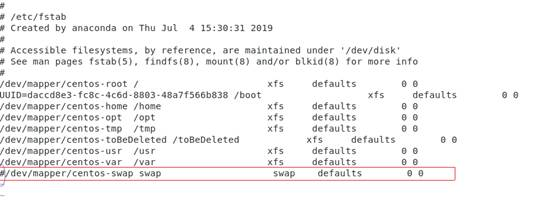
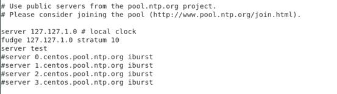
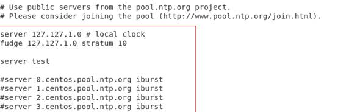
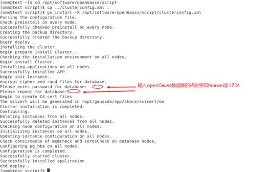
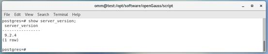
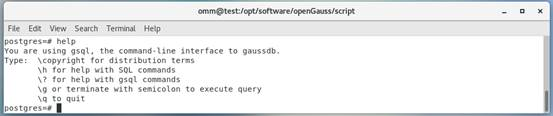
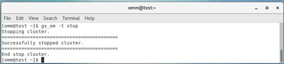
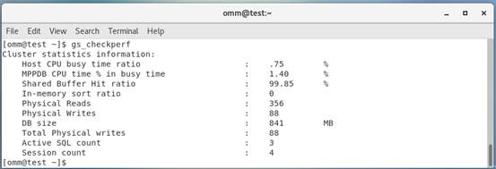

# Step by Step 之：openGauss1.0.1 单机安装指南 v1.2<a name="ZH-CN_TOPIC_0000001084776499"></a>

**在 CentOS7.6 上安装 openGauss 单机版**

## 配置操作系统满足安装要求<a name="section1755515538127"></a>

硬件环境：虚拟机的内存 8GB，4 核心 CPU，900G 磁盘（非必须）

软件环境：CentOS7.6

**关闭防火墙**

\#停止 firewall

```
systemctl stop firewalld.service
```

\#禁止 firewall 开机启动

```
systemctl disable firewalld.service
```

**关闭 SELinux**

```
getenforce
sed -i 's/^SELINUX=.*/SELINUX=disabled/' /etc/selinux/config
setenforce 0
getenforce
```

**修改/etc/hosts**

添加一行

```
cat >>/etc/hosts <<EOF
192.168.0.11 node1
EOF
```

**配置库路径**

```
cat>> /etc/profile<<EOF
export LD_LIBRARY_PATH=/opt/software/openGauss/script/gspylib/clib:$LD_LIBRARY_PATH
EOF
```

**关闭 os 交换区**

编辑/etc/fstab 文件，将交换区的那一行注释掉

```
vi /etc/fstab
```

\*\*\*\*

**临时关闭交换区命令：**

```
swapoff -a
free
```

**配置网络参数**

```
cat>>/etc/sysctl.conf<<EOF
net.ipv4.ip_local_port_range = 26000 65500
net.ipv4.tcp_rmem = 4096 87380 4194304
 net.ipv4.tcp_wmem = 4096 16384 4194304
net.ipv4.conf. ens33.rp_filter = 1
net.ipv4.tcp_fin_timeout=60
net.ipv4.tcp_retries1=5
net.ipv4.tcp_syn_retries=5
net.sctp.path_max_retrans=10
net.sctp.max_init_retransmits=10
EOF
```

<!-- >   -->

**说明：**

> 如果对外工作的网卡万兆网卡 ens33，需要设计最大 MTU 为 8192。
> 虚拟机没有万兆网卡不能配置该项，否则认证报错！

**配置 NTPD（单机可以不用配置）**



```
yum install ntp -y
vi /etc/ntp.conf
```

添加以下一行：

```
restrict 192.168.0.0 mask 255.255.255.0 nomodify notrap
```

添加以下 3 行，并注释掉所有的 server 行：

```
server 127.127.1.0 # local clock
fudge 127.127.1.0 stratum 10

server node1
```



\#启动 ntpd 时间服务器

```
service ntpd start
```

\#开机自启动

```
chkconfig ntpd on
```

或者

```
systemctl enable ntpd.service
```

**设置 root 用户远程登陆**

```
sed -i "s/#Banner none/Banner none/g" /etc/ssh/sshd_config
cat >>/etc/ssh/sshd_config<<EOF
PermitRootLogin yes
EOF

systemctl restart sshd
```

\#检查

```
cat /etc/ssh/sshd_config  | grep PermitRootLogin
PermitRootLogin yes
```

\#检查

```
cat /etc/ssh/sshd_config | grep Banner
Banner none
```

**文件系统参数、系统支持的最大进程数**

```
echo "* soft nofile 1000000" >>/etc/security/limits.conf
echo "* hard nofile 1000000" >>/etc/security/limits.conf
echo "* soft nproc unlimited" >>/etc/security/limits.conf
echo "* hard nproc unlimited" >>/etc/security/limits.conf
```

**安装 python3.6.x**

```
yum install openssl* -y
yum install python3* -y
```

说明：

也可以直接编译安装或者 rpm 包安装。

```
reboot
```

重新启动服务器

**创建安装包的存放目录**

```
mkdir -p /opt/software/openGauss
chmod 755 -R /opt/software
```

**下载 openGauss 数据库软件**

下载地址为：[https://opengauss.org/zh/download/](https://opengauss.org/zh/download/)

**数据库安装包上传至 centos 上**

## 安装 openGauss 单机数据库<a name="section102500328265"></a>

**解压缩 openGauss DBMS 介质**

```
cd /opt/software/openGauss
tar xf openGauss-1.0.1-CentOS-64bit.tar.gz
```

**创建 XML 文件**

```
cat > clusterconfig.xml<<EOF
```

```html
<?xml version="1.0" encoding="UTF-8"?\>

<ROOT\>

<!-- oenGgauss数据库集群的信息 --\>

<CLUSTER\>

<!-- 数据库集群名称 --\>

<PARAM name="clusterName" value="dbCluster" /\>

<!-- 数据库集群节点名称列表 --\>

<PARAM name="nodeNames" value="node1" /\>

<!-- 数据库安装目录--\>

<PARAM name="gaussdbAppPath" value="/opt/gaussdb/app" /\>

  <!-- 日志目录--\>

<PARAM name="gaussdbLogPath" value="/var/log/gaussdb" /\>

  <!-- 临时文件目录--\>

  <PARAM name="tmpMppdbPath" value="/opt/gaussdbi/tmp" /\>

  <!--数据库工具目录--\>

<PARAM name="gaussdbToolPath" value="/opt/gaussdb/wisequery" /\>

  <!--数据库core文件目录--\>

  <PARAM name="corePath" value="/opt/gaussdb/corefile"/\>

  <!-- 数据库集群的节点IP，与数据库集群节点名称列表一一对应 --\>

<PARAM name="backIp1s" value="192.168.0.11"/\>

  <!-- 数据库集群的类型，本例为单实例安装 --\>

<PARAM name="clusterType" value="single-inst"/\>

</CLUSTER\>

<!-- oenGgauss数据库集群的节点信息 --\>

<DEVICELIST\>

<!-- 集群节点1的信息 --\>

<DEVICE sn="1000001"\>

<!-- 节点1的机器名 --\>

<PARAM name="name" value="node1"/\>

<!-- 节点1所在的AZ和AZ优先级 --\>

<PARAM name="azName" value="AZ1"/\>

<PARAM name="azPriority" value="1"/\>

<!-- 节点1的IP，如果节点服务器只有一个网卡，将backIP1和sshIP1配置成同一个IP --\>

<PARAM name="backIp1" value="192.168.0.11"/\>

<PARAM name="sshIp1" value="192.168.0.11"/\>

<!--dbnode--\>

<PARAM name="dataNum" value="1"/\>

<PARAM name="dataPortBase" value="26000"/\>

<PARAM name="dataNode1" value="/opt/gaussdb/data/db1"/\>

</DEVICE\>

</DEVICELIST\>

</ROOT\>

```

EOF

**检查环境变量**

```
echo $LD_LIBRARY_PATH
```


**安装前进行交互式检查**

```
python3 /opt/software/openGauss/script/gs_preinstall -U omm -G dbgrp -X /opt/software/openGauss/clusterconfig.xml
```

查看具体的检查信息

```
/opt/software/openGauss/script/gs_checkos -i A -h node1 --detail
```

**开始安装 openGauss DBMS 和创建数据库**

使用 root 执行如下命令

```
cd /opt/software/openGauss/script
chmod -R 755 /opt/software/openGauss/script
chown -R omm:dbgrp /opt/software/openGauss/script
```

使用 omm 用户安装 openGauss DBMS 和创建 openGauss 数据库

```
su - omm
cd /opt/software/openGauss/script
cp ../clusterconfig.xml .
gs_install -X /opt/software/openGauss/script/clusterconfig.xml
```

<!--   -->

**注意：**

用户需根据提示输入数据库的密码，密码需要具有一定的复杂度，为保证用户正常使用该数据库，请记住输入的数据库密码。此处建议密码设置为 huawei@1234。

（16G 内存创建就不会出错）



【遇到问题】

```
[2020-10-17 08:43:03.575][30109][][gs_ctl]: waiting for server to start...
.0 [BACKEND] LOG:  Begin to start openGauss Database.
2020-10-17 08:43:03.677 5f8a3e17.1 [unknown] 139777756087360 [unknown] 0 dn_6001 DB001 0 [REDO] LOG:  Recovery parallelism, cpu count = 4, max = 4, actual = 4
2020-10-17 08:43:03.677 5f8a3e17.1 [unknown] 139777756087360 [unknown] 0 dn_6001 DB001 0 [REDO] LOG:  ConfigRecoveryParallelism, true_max_recovery_parallelism:4, max_recovery_parallelism:4
2020-10-17 08:43:03.677 5f8a3e17.1 [unknown] 139777756087360 [unknown] 0 dn_6001 00000 0 [BACKEND] LOG:  gaussdb.state does not exist, and skipt setting since it is optional.
2020-10-17 08:43:03.678 5f8a3e17.1 [unknown] 139777756087360 [unknown] 0 dn_6001 00000 0 [BACKEND] LOG:  Transparent encryption disabled.
2020-10-17 08:43:03.687 5f8a3e17.1 [unknown] 139777756087360 [unknown] 0 dn_6001 01000 0 [BACKEND] WARNING:  could not create any HA TCP/IP sockets
2020-10-17 08:43:03.689 5f8a3e17.1 [unknown] 139777756087360 [unknown] 0 dn_6001 00000 0 [BACKEND] LOG:  InitNuma numaNodeNum: 1 numa_distribute_mode: none inheritThreadPool: 0.
2020-10-17 08:43:03.689 5f8a3e17.1 [unknown] 139777756087360 [unknown] 0 dn_6001 01000 0 [BACKEND] WARNING:  Failed to initialize the memory protect for g_instance.attr.attr_storage.cstore_buffers (1024 Mbytes) or shared memory (4215 Mbytes) is larger.
2020-10-17 08:43:03.749 5f8a3e17.1 [unknown] 139777756087360 [unknown] 0 dn_6001 00000 0 [CACHE] LOG:  set data cache  size(805306368)
2020-10-17 08:43:03.776 5f8a3e17.1 [unknown] 139777756087360 [unknown] 0 dn_6001 00000 0 [CACHE] LOG:  set metadata cache  size(268435456)
2020-10-17 08:43:08.569 5f8a3e17.1 [unknown] 139777756087360 [unknown] 0 dn_6001 00000 0 [BACKEND] LOG:  gaussdb: fsync file "/opt/gaussdb/data/db1/gaussdb.state.temp" success
2020-10-17 08:43:08.569 5f8a3e17.1 [unknown] 139777756087360 [unknown] 0 dn_6001 00000 0 [BACKEND] LOG:  create gaussdb state file success: db state(STARTING_STATE), server mode(Normal)
2020-10-17 08:43:08.597 5f8a3e17.1 [unknown] 139777756087360 [unknown] 0 dn_6001 00000 0 [BACKEND] LOG:  max_safe_fds = 978, usable_fds = 1000, already_open = 12
2020-10-17 08:43:08.607 5f8a3e17.1 [unknown] 139777756087360 [unknown] 0 dn_6001 00000 0 [BACKEND] LOG:  user configure file is not found, it will be created.
2020-10-17 08:43:08.657 5f8a3e17.1 [unknown] 139777756087360 [unknown] 0 dn_6001 00000 0 [BACKEND] LOG:  Success to start openGauss Database. If you specify "&", please press any key to exit...
.[2020-10-17 08:43:09.701][30109][][gs_ctl]:  waitpid 30112 failed, exitstatus is 256, ret is 2

[2020-10-17 08:43:09.701][30109][][gs_ctl]: stopped waiting
[2020-10-17 08:43:09.701][30109][][gs_ctl]: could not start server
[2020-10-17 08:43:09.701][30109][][gs_ctl]: Examine the log output.
[omm@node1 script]$ free -g
              total        used        free      shared  buff/cache   available
Mem:              7           0           5           0           2           5
Swap:             0           0           0
[omm@node1 script]$
```

【分析问题】

初始化实例失败

【解决方法】

修改 max_process_memory = 3GB

```
vi /opt/gaussdb/data/db1
```

启动数据库：

```
[omm@node1 db1]$ gs_om -t start
Starting cluster.
=========================================
=========================================
Successfully started.
[omm@node1 db1]$
```

**首次登录数据库**

在 centOS 中，使用 omm 用户执行下面的操作。

登录到数据库，修改数据库的密码：

```
gsql -d postgres -p 26000 -r
gsql ((openGauss 1.0.1 build 13b34b53) compiled at 2020-10-12 02:00:59 commit 0 last mr  )
Non-SSL connection (SSL connection is recommended when requiring high-security)
Type "help" for help.
postgres=#
alter role omm identified by 'Passw0rd@1234' replace 'huawei@1234';
```

检查数据库版本

```
show server_version;
```



SELECT version\(\);

```
(openGauss 1.0.1 build 13b34b53) compiled at 2020-10-12 02:00:59 commit 0 last mr   on x86_64-unknown-l
inux-gnu, compiled by g++ (GCC) 8.2.0, 64-bit
(1 row)
```

查看帮助

help



退出

\\q


## openGauss 的简单维护<a name="section330292643810"></a>

**停止 openGauss 数据库**

```
gs_om -t stop
```



**查看数据库的状态**

gs_om -t status --detail

```
[omm@node1 db1]$ gs_om -t status --detail
[   Cluster State   ]

cluster_state   : Unavailable
redistributing  : No
current_az      : AZ_ALL

[  Datanode State   ]

node     node_ip         instance                      state
---------------------------------------------------------------------------
1  node1 192.168.0.11    6001 /opt/gaussdb/data/db1 P Primary Manually stopped
[omm@node1 db1]$
```

启动 openGauss 数据库

```
gs_om -t start
```


再次查看数据库的状态

```
gs_om -t status --detail
[omm@node1 ~]$ gs_om -t status --detail
[   Cluster State   ]

cluster_state   : Normal
redistributing  : No
current_az      : AZ_ALL

[  Datanode State   ]

node     node_ip         instance                      state
---------------------------------------------------------------------------
1  node1 192.168.0.11    6001 /opt/gaussdb/data/db1 P Primary Normal
[omm@node1 ~]$
```

查看数据库系统的详细信息

gs_om -t status --all \#\#数据库停止状态

```
[omm@node1 db1]$ gs_om -t status --all
-----------------------------------------------------------------------

cluster_state             : Unavailable
redistributing            : No

-----------------------------------------------------------------------
node                      : 1
node_name                 : node1

node                      : 1
instance_id               : 6001
node_ip                   : 192.168.0.11
data_path                 : /opt/gaussdb/data/db1
type                      : Datanode
instance_state            : Down
static_connections        : 0
HA_state                  : Manually stopped
reason                    : Unknown
sender_sent_location      : 0/0
sender_write_location     : 0/0
sender_flush_location     : 0/0
sender_replay_location    : 0/0
receiver_received_location: 0/0
receiver_write_location   : 0/0
receiver_flush_location   : 0/0
receiver_replay_location  : 0/0
sync_state                : Async
-----------------------------------------------------------------------
[omm@node1 db1]$
```

gs_om -t status --all \#\#数据库 nornal 启动状态

```
[omm@node1 db1]$ gs_om -t status --all
-----------------------------------------------------------------------

cluster_state             : Normal
redistributing            : No

-----------------------------------------------------------------------

node                      : 1
node_name                 : node1

node                      : 1
instance_id               : 6001
node_ip                   : 192.168.0.11
data_path                 : /opt/gaussdb/data/db1
type                      : Datanode
instance_state            : Primary
static_connections        : 0
HA_state                  : Normal
reason                    : Normal
sender_sent_location      : 0/0
sender_write_location     : 0/0
sender_flush_location     : 0/0
sender_replay_location    : 0/0
receiver_received_location: 0/0
receiver_write_location   : 0/0
receiver_flush_location   : 0/0
receiver_replay_location  : 0/0
sync_state                : Async

-----------------------------------------------------------------------

[omm@node1 db1]$

```

## 【附录】<a name="section187113295410"></a>

**查看 gs_om 命令的帮助**

\[omm@node1 db1\]$ gs_om --help

```
gs_om is a utility to manage a cluster.

Usage:
  gs_om -? | --help
  gs_om -V | --version
  OLAP scene:
    gs_om -t start [-h HOSTNAME] [-D dataDir] [--time-out=SECS]
                   [--security-mode=MODE] [-l LOGFILE]
    gs_om -t stop [-h HOSTNAME] [-D dataDir]  [--time-out=SECS] [-m MODE]
                  [-l LOGFILE]
    gs_om -t status [-h HOSTNAME] [-o OUTPUT] [--detail] [--all] [-l LOGFILE]
    gs_om -t generateconf -X XMLFILE [--distribute] [-l LOGFILE]
    gs_om -t cert [--cert-file=CERTFILE | --rollback] [-L] [-l LOGFILE]
    gs_om -t kerberos -m [install|uninstall] -U USER [-l LOGFILE]
                         [--krb-server|--krb-client]
    gs_om -t view [-o OUTPUT]
    gs_om -t query [-o OUTPUT]
    gs_om -t refreshconf

General options:
  -t                              Type of the OM command.
  -l                              Path of log file.
  -?, --help                      Show help information for this utility,
  and exit the command line mode.
  -V, --version                   Show version information.

Options for start
  -h                              Name of the host to be started.
  -D                              Path of dn
      --time-out=SECS              Maximum waiting time when start the
                                   cluster or node.
      --security-mode=MODE        database start with security mode: on or off
                                        on: start with security mode
                                        off: start without security mode

Options for stop
  -h                              Name of the host to be shut down.
  -m, --mode=MODE                 Shutdown mode. It can be f (fast),
                                  or i (immediate).
  -D                              Path of dn
    --time-out=SECS              Maximum waiting time when start the cluster
                                 or node.
Options for status
  -h                              Name of the host whose status is to be
                                  queried.
  --az                            Name of the single az whose status is to
                                  be queried.
  -o                              Save the result to the specified file.
      --detail                    Show detailed status information.
      --all                       Show all database node status information.

Options for generating configuration files
  -X                              Path of the XML configuration file.
      --distribute                Distribute the static configuration file
                                  to installation directory of cluster nodes.

Options for cert
      --cert-file                 Path of cert file.
      --rollback                  Perform rollback SSL cert files.
      -L                          local mode.

Options for kerberos
  -m                              Kerberos management mode. It can be
                                  install or uninstall.
  -U                              %s cluster user.
Install options:
  --krb-server                    Execute install for server. This parameter
  only work for install
  --krb-client                    Execute install for client. This parameter
  only work for install


[omm@node1 db1]$
```

**数据库性能监控**

gs_checkperf



End
