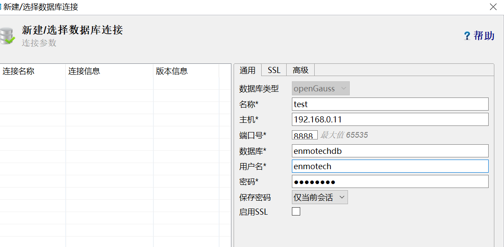
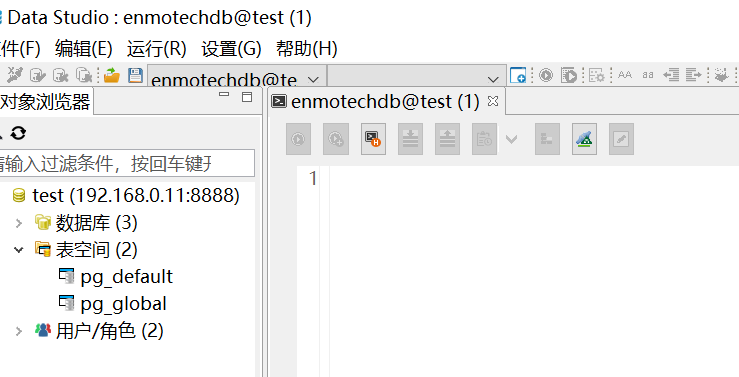

# step by step 系列之：openGauss1.0.1 Docker 版本单机安装指南<a name="ZH-CN_TOPIC_0000001085018735"></a>

## 1.软硬件环境<a name="section15821156154818"></a>

硬件环境：

<a name="table176971054124520"></a>

<table><thead ><tr id="row1524511552455"><th class="cellrowborder"  width="10.45%" id="mcps1.1.5.1.1"><p id="p11245145534517"><a name="p11245145534517"></a><a name="p11245145534517"></a>项目</p>
</th>
<th class="cellrowborder"  width="34%" id="mcps1.1.5.1.2"><p id="p1624517555451"><a name="p1624517555451"></a><a name="p1624517555451"></a>最低配置</p>
</th>
<th class="cellrowborder"  width="41.79%" id="mcps1.1.5.1.3"><p id="p1524685594510"><a name="p1524685594510"></a><a name="p1524685594510"></a>推荐配置</p>
</th>
<th class="cellrowborder"  width="13.76%" id="mcps1.1.5.1.4"><p id="p18246755194519"><a name="p18246755194519"></a><a name="p18246755194519"></a>测试配置</p>
</th>
</tr>
</thead>
<tbody><tr id="row1724610551453"><td class="cellrowborder"  width="10.45%" headers="mcps1.1.5.1.1 "><p id="p82461955134510"><a name="p82461955134510"></a><a name="p82461955134510"></a><strong id="b1324645554510"><a name="b1324645554510"></a><a name="b1324645554510"></a><span>硬盘</span></strong></p>
</td>
<td class="cellrowborder"  width="34%" headers="mcps1.1.5.1.2 "><p id="p5247195520455"><a name="p5247195520455"></a><a name="p5247195520455"></a>用于安装openGauss的硬盘需最少满足如下要求：</p>
<a name="ul1124713552457"></a><a name="ul1124713552457"></a><ul id="ul1124713552457"><li>至少1GB用于安装openGauss的应用程序包。</li><li>每个主机需大约300MB用于元数据存储。</li><li>预留70%以上的磁盘剩余空间用于数据存储。</li></ul>
<p id="p192471355164516"><a name="p192471355164516"></a><a name="p192471355164516"></a></p>
</td>
<td class="cellrowborder"  width="41.79%" headers="mcps1.1.5.1.3 "><p id="p172479556450"><a name="p172479556450"></a><a name="p172479556450"></a>建议系统盘配置为Raid1，数据盘配置为Raid5，且规划4组Raid5数据盘用于安装openGauss。有关Raid的配置方法在本手册中不做介绍。请参考硬件厂家的手册或互联网上的方法进行配置，其中Disk Cache Policy一项需要设置为Disabled，否则机器异常掉电后有数据丢失的风险。</p>
<p id="p1024715515455"><a name="p1024715515455"></a><a name="p1024715515455"></a>openGauss支持使用SSD盘作为数据库的主存储设备，支持SAS接口和NVME协议的SSD盘，以RAID的方式部署使用。</p>
</td>
<td class="cellrowborder"  width="13.76%" headers="mcps1.1.5.1.4 "><p id="p7247855184518"><a name="p7247855184518"></a><a name="p7247855184518"></a><span>900G</span></p>
</td>
</tr>
<tr id="row102485551452"><td class="cellrowborder"  width="10.45%" headers="mcps1.1.5.1.1 "><p id="p1724813554457"><a name="p1724813554457"></a><a name="p1724813554457"></a><strong id="b8248255184514"><a name="b8248255184514"></a><a name="b8248255184514"></a><span>内存</span></strong></p>
</td>
<td class="cellrowborder"  width="34%" headers="mcps1.1.5.1.2 "><p id="p6248205514459"><a name="p6248205514459"></a><a name="p6248205514459"></a>2GB</p>
</td>
<td class="cellrowborder"  width="41.79%" headers="mcps1.1.5.1.3 "><p id="p182481855104519"><a name="p182481855104519"></a><a name="p182481855104519"></a>功能调试32GB以上。</p>
<p id="p15248135574518"><a name="p15248135574518"></a><a name="p15248135574518"></a>性能测试和商业部署时，单实例部署建议128GB以上。</p>
<p id="p162481555104512"><a name="p162481555104512"></a><a name="p162481555104512"></a>复杂的查询对内存的需求量比较高，在高并发场景下，可能出现内存不足。此时建议使用大内存的机器，或使用负载管理限制系统的并发。</p>
</td>
<td class="cellrowborder"  width="13.76%" headers="mcps1.1.5.1.4 "><p id="p6248175518452"><a name="p6248175518452"></a><a name="p6248175518452"></a><span>8G</span></p>
</td>
</tr>
<tr id="row19248135574512"><td class="cellrowborder"  width="10.45%" headers="mcps1.1.5.1.1 "><p id="p16248655104514"><a name="p16248655104514"></a><a name="p16248655104514"></a><strong id="b0248655134511"><a name="b0248655134511"></a><a name="b0248655134511"></a><span>CPU</span></strong></p>
</td>
<td class="cellrowborder"  width="34%" headers="mcps1.1.5.1.2 "><p id="p42491455154510"><a name="p42491455154510"></a><a name="p42491455154510"></a>功能调试最小1×8 核 2.0GHz。</p>
<p id="p1724910552453"><a name="p1724910552453"></a><a name="p1724910552453"></a></p>
</td>
<td class="cellrowborder"  width="41.79%" headers="mcps1.1.5.1.3 "><p id="p624915584519"><a name="p624915584519"></a><a name="p624915584519"></a>性能测试和商业部署时，单实例部署建议1×16核 2.0GHz。</p>
<p id="p1124955524517"><a name="p1124955524517"></a><a name="p1124955524517"></a>CPU超线程和非超线程两种模式都支持。但是，openGauss各节点的设置需保持一致。</p>
</td>
<td class="cellrowborder"  width="13.76%" headers="mcps1.1.5.1.4 "><p id="p1124955514514"><a name="p1124955514514"></a><a name="p1124955514514"></a><span>4</span><span>核</span></p>
</td>
</tr>
<tr id="row10249135517450"><td class="cellrowborder"  width="10.45%" headers="mcps1.1.5.1.1 "><p id="p1249165519457"><a name="p1249165519457"></a><a name="p1249165519457"></a><strong id="b182491855144516"><a name="b182491855144516"></a><a name="b182491855144516"></a><span>网络</span></strong></p>
</td>
<td class="cellrowborder"  width="34%" headers="mcps1.1.5.1.2 "><p id="p3249955114517"><a name="p3249955114517"></a><a name="p3249955114517"></a>300兆以上以太网。</p>
<p id="p624910558452"><a name="p624910558452"></a><a name="p624910558452"></a></p>
</td>
<td class="cellrowborder"  width="41.79%" headers="mcps1.1.5.1.3 "><p id="p122491055104520"><a name="p122491055104520"></a><a name="p122491055104520"></a>建议网卡设置为双网卡冗余bond。有关网卡冗余bond的配置方法在本手册中不做介绍。请参考硬件厂商的手册或互联网上的方法进行配置。</p>
<p id="p7249165564515"><a name="p7249165564515"></a><a name="p7249165564515"></a>openGauss网络如果配置bond，请保证bond模式一致，不一致的bond配置可能导致openGauss工作异常。</p>
</td>
<td class="cellrowborder"  width="13.76%" headers="mcps1.1.5.1.4 "><p id="p72501255144516"><a name="p72501255144516"></a><a name="p72501255144516"></a><span>千兆</span></p>
</td>
</tr>
</tbody>
</table>

软件环境：

**表 1** 软件环境要求

<a name="table19739155454515"></a>

<table><thead ><tr id="row1325010552455"><th class="cellrowborder"  width="25.25%" id="mcps1.2.3.1.1"><p id="p1825005517458"><a name="p1825005517458"></a><a name="p1825005517458"></a>软件类型</p>
</th>
<th class="cellrowborder"  width="74.75%" id="mcps1.2.3.1.2"><p id="p14250205594516"><a name="p14250205594516"></a><a name="p14250205594516"></a>配置描述</p>
</th>
</tr>
</thead>
<tbody><tr id="row32505550457"><td class="cellrowborder"  width="25.25%" headers="mcps1.2.3.1.1 "><p id="p0250355124517"><a name="p0250355124517"></a><a name="p0250355124517"></a>Linux操作系统</p>
</td>
<td class="cellrowborder"  width="74.75%" headers="mcps1.2.3.1.2 "><p id="p52505557459"><a name="p52505557459"></a><a name="p52505557459"></a>openEuler 20.3LTS和CentOS 7.X</p>
</td>
</tr>
<tr id="row1225175512458"><td class="cellrowborder"  width="25.25%" headers="mcps1.2.3.1.1 ">&nbsp;&nbsp;</td>
<td class="cellrowborder"  width="74.75%" headers="mcps1.2.3.1.2 "><p id="p1925117559454"><a name="p1925117559454"></a><a name="p1925117559454"></a>说明：能够安装docker基本没有限制</p>
</td>
</tr>
</tbody>
</table>

## 2.安装、配置 docker<a name="section19282194854916"></a>

安装流程：

先安装 docker 软件，下载数据库 Docker image，启动 Docker，进入数据库，初体验。

**2.1.安装 docker 软件**

```
[root@node1 ~]#
yum -y install docker
```

\#检查 docker 的版本：

```
docker -v
Docker version 1.13.1, build 64e9980/1.13.1
```

**2.2.配置、启动 docker 服务**

对 docker 进行简单设置：

```
systemctl enable docker #开机启动docker
systemctl status docker #查看docker状态

[root@node1 ~]# systemctl enable docker
Created symlink from /etc/systemd/system/multi-user.target.wants/docker.service to /usr/lib/systemd/system/docker.service.
[root@node1 ~]# systemctl status docker
docker.service - Docker Application Container Engine
   Loaded: loaded (/usr/lib/systemd/system/docker.service; enabled; vendor preset: disabled)
   Active: inactive (dead)
     Docs: http://docs.docker.com
[root@node1 ~]#
```

设置 docker 镜像源

\#修改这个文件为如下内容

```
cat>/etc/docker/daemon.json<<EOF
 {
"registry-mirrors": ["https://oinh00fc.mirror.aliyuncs.com"]
}
EOF
```

检查修改情况：

```
 cat /etc/docker/daemon.json
```

\# 检查 Docker 是否启动：

```
systemctl status docker
   docker.service - Docker Application Container Engine
   Loaded: loaded (/usr/lib/systemd/system/docker.service; disabled; vendor preset: disabled)
   Active: inactive (dead)
     Docs: http://docs.docker.com
[root@node1 ~]#
```

\#启动 Docker

```
  systemctl start docker
```

\# 检查启动是否正常：

```
[root@node1 ~]# systemctl status docker
   docker.service - Docker Application Container Engine
   Loaded: loaded (/usr/lib/systemd/system/docker.service; disabled; vendor preset: disabled)
   Active: active (running) since Thu 2020-10-15 09:01:06 CST; 5s ago
     Docs: http://docs.docker.com
 Main PID: 11215 (dockerd-current)
    Tasks: 30
   CGroup: /system.slice/docker.service
           ├─11215 /usr/bin/dockerd-current --add-runtime docker-runc=/usr/libexec/do...
           └─11225 /usr/bin/docker-containerd-current -l unix:///var/run/docker/libco...

Oct 15 09:01:05 node1.localdomain dockerd-current[11215]: time="2020-10-15T09:01:05.0...
Oct 15 09:01:06 node1.localdomain dockerd-current[11215]: time="2020-10-15T09:01:06.0...
Oct 15 09:01:06 node1.localdomain dockerd-current[11215]: time="2020-10-15T09:01:06.1...
Oct 15 09:01:06 node1.localdomain dockerd-current[11215]: time="2020-10-15T09:01:06.1...
Oct 15 09:01:06 node1.localdomain dockerd-current[11215]: time="2020-10-15T09:01:06.1...
Oct 15 09:01:06 node1.localdomain dockerd-current[11215]: time="2020-10-15T09:01:06.2...
Oct 15 09:01:06 node1.localdomain dockerd-current[11215]: time="2020-10-15T09:01:06.2...
Oct 15 09:01:06 node1.localdomain dockerd-current[11215]: time="2020-10-15T09:01:06.2...
Oct 15 09:01:06 node1.localdomain dockerd-current[11215]: time="2020-10-15T09:01:06.2...
Oct 15 09:01:06 node1.localdomain systemd[1]: Started Docker Application Container ...e.
Hint: Some lines were ellipsized, use -l to show in full.
[root@node1 ~]#
```

**2.3. 查找、下载、使用 openGauss Docker 镜像**

2.3.1 查找 opengauss 镜像

```
# docker search opengauss
[root@node1 ~]# docker search opengauss
INDEX       NAME                                    DESCRIPTION                                   STARS     OFFICIAL   AUTOMATED
docker.io   docker.io/enmotech/opengauss            openGauss latest images created by Enmotech   6
docker.io   docker.io/aff123/opengauss              aff学习opengauss                                0
docker.io   docker.io/blueapple/opengauss           opengauss 1.0.0 CentOS 7.8.2003               0
docker.io   docker.io/fibird/opengauss                                                            0
docker.io   docker.io/gaobo1997/opengauss_compile   OpenGauss Compile Environment                 0
docker.io   docker.io/travelliu/opengauss                                                         0
```

2.3.2 获取 docker 镜像

\#docker pull docker.io/enmotech/opengauss

或者 docker pull enmotech/opengauss:1.0.1

```
[root@node1 ~]#  docker pull docker.io/enmotech/opengauss
Using default tag: latest
Trying to pull repository docker.io/enmotech/opengauss ...
latest: Pulling from docker.io/enmotech/opengauss
ac9208207ada: Pull complete
2bedb2e83de5: Pull complete
db7ef826320f: Pull complete
2e41de1b5de7: Pull complete
d528682a66c4: Pull complete
88163b222086: Pull complete
7ea9446096be: Pull complete
2a10ad7221b8: Pull complete
Digest: sha256:d1aa6c3b5062a03b6f8ec3f7bae8a388e027df443a2c992c60e8e909ac91101b
Status: Downloaded newer image for docker.io/enmotech/opengauss:latest
```

或者 docker pull enmotech/opengauss:1.0.1

```
Trying to pull repository docker.io/enmotech/opengauss ...
1.0.1: Pulling from docker.io/enmotech/opengauss
ac9208207ada: Pull complete
2bedb2e83de5: Pull complete
db7ef826320f: Pull complete
2e41de1b5de7: Pull complete
d528682a66c4: Pull complete
88163b222086: Pull complete
7ea9446096be: Pull complete
2a10ad7221b8: Pull complete
Digest: sha256:d1aa6c3b5062a03b6f8ec3f7bae8a388e027df443a2c992c60e8e909ac91101b
Status: Downloaded newer image for docker.io/enmotech/opengauss:1.0.1

[root@node1 ~]#
```

2.3.3 查看镜像

\# docker images

```
[root@node1 ~]#  docker images
REPOSITORY                     TAG                 IMAGE ID            CREATED             SIZE
docker.io/enmotech/opengauss   latest              80711c4eb80a        5 weeks ago         485 MB


#[root@node1 ~]# docker images
REPOSITORY                     TAG                 IMAGE ID            CREATED             SIZE
docker.io/enmotech/opengauss   1.0.1               80711c4eb80a        5 weeks ago         485 MB
[root@node1 ~]#
```

说明：两种 pull 的 tag 内容不一样.

检查 docker 是否启动

\# docker ps

```
CONTAINER ID        IMAGE               COMMAND             CREATED             STATUS              PORTS               NAMES
#
```

没有启动，启动数据库容器

2.3.4 启动数据库容器

这里我们使用 enmotech/opengauss:latest 的镜像。

以下命令使用 opengauss 镜像启动一个容器，参数为以命令行模式进入该容器：

存储数据持久化,从容器外部连接容器数据库，openGauss 的默认侦听启动在容器内的 5432 端口上，如果想要从容器外部访问数据库，则需要在 docker run 的时候指定-p 参数。比如以下命令将允许使用 8888 端口访问容器数据库。

在下面命令正常启动容器数据库之后，可以通过外部的 gsql 进行数据库访问。

\# docker run --name opengaussnet --privileged=true -d -e GS_PASSWORD=Passw0rd@1234 \\

-v /enmotech/opengauss:/var/lib/opengauss \\

-p 8888:5432 enmotech/opengauss:latest

说明：windows 下，C:\\Users\\oldbear2008\>docker run --name opengaussnet --privileged=true -d -e GS_PASSWORD=Passw0rd@1234 -v /enmotech/opengauss:/var/lib/opengauss -p 8888:5432 enmotech/opengauss:latest 05755ccc4abea16bbfff6a361451470069daf2e16c7f551caee3b4bfbd1bbe45

**数据持久化：**

Docker 中 openGauss 的所有数据文件：/var/lib/opengauss 目录 ，存储在宿主机的/enmotech/opengauss 下。

宿主机的/enmotech/opengauss 如果不存在，会自动创建，但是必须是绝对路径。

Docker 对其拥有读写权限。

**网络端口：**

8888：对外访问端口

2.5.5 openGauss 容器数据持久化验证

新开一个窗口检查容器 ID：

```
[root@node1 ~]# docker ps -a
CONTAINER ID        IMAGE                       COMMAND                  CREATED             STATUS              PORTS               NAMES
794d54eaa87c        enmotech/opengauss:latest   "entrypoint.sh gau..."   3 minutes ago       Up 3 minutes        5432/tcp            opengauss
[root@node1 ~]#


[root@node1 ~]# docker exec -it ac74618df201 bash
```

**在容器内部查看数据库目录：**

```
[root@ac74618df201 data]# pwd
/var/lib/opengauss/data
[root@ac74618df201 data]# ls
base           gswlm_userinfo.cfg  pg_copydir    pg_hba.conf    pg_log        pg_serial     pg_twophase      postgresql.conf.lock
gaussdb.state  mot.conf            pg_csnlog     pg_ident.conf  pg_multixact  pg_snapshots  PG_VERSION       postmaster.opts
global         pg_audit            pg_ctl.lock   pg_llog        pg_notify     pg_stat_tmp   pg_xlog          postmaster.pid
gs_profile     pg_clog             pg_errorinfo  pg_location    pg_replslot   pg_tblspc     postgresql.conf
[root@ac74618df201 data]#
```

**在操作系统查看容器数据库的目录：**

再打开一个终端：

```
[root@node1 data]# pwd
/enmotech/opengauss/data
[root@node1 data]# ls
base           gswlm_userinfo.cfg  pg_copydir    pg_hba.conf    pg_log        pg_serial     pg_twophase      postgresql.conf.lock
gaussdb.state  mot.conf            pg_csnlog     pg_ident.conf  pg_multixact  pg_snapshots  PG_VERSION       postmaster.opts
global         pg_audit            pg_ctl.lock   pg_llog        pg_notify     pg_stat_tmp   pg_xlog          postmaster.pid
gs_profile     pg_clog             pg_errorinfo  pg_location    pg_replslot   pg_tblspc     postgresql.conf
[root@node1 data]#
```

可以看到容中的数据存储到操作系统中来了。

完成持存储数据久化。

**存储持久化测试：**

创建表：T1

```
omm=# create table t1(col int);
CREATE TABLE
omm=# \dt
                        List of relations
 Schema | Name | Type  | Owner |             Storage
--------+------+-------+-------+----------------------------------
 public | t1   | table | omm   | {orientation=row,compression=no}
(1 row)

omm=# \q
```

关闭数据库：

```
[omm@ac74618df201 ~]$ cd $GAUSSHOME/bin
[omm@ac74618df201 bin]$ ls
alarmItem.conf    gs_basebackup  gs_initdb     gstrace       kinit     pg_config       retry_errcodes.conf
cluster_guc.conf  gs_ctl         gs_probackup  kadmin.local  klist     pg_controldata  script
dbmind            gs_dump        gs_restore    kadmind       krb5kdc   pg_receivexlog  transfer.py
encrypt           gs_dumpall     gs_tar        kdb5_util     makesgml  pg_recvlogical
gaussdb           gs_guc         gsql          kdestroy      openssl   pg_resetxlog
[omm@ac74618df201 bin]$ gs_ctl stop -D /var/lib/opengauss/data/
[2020-11-14 12:37:36.959][297][][gs_ctl]: gs_ctl stopped ,datadir is -D "/var/lib/opengauss/data"
```

重启 Docker 数据库：

启动容器：

```
[root@node1 ~]# docker start ac74618df201
```

进入容器：

```
docker exec -it ac74618df201 bash

[root@ac74618df201 /]# su - omm
Last login: Sat Nov 14 12:41:56 UTC 2020
[omm@ac74618df201 ~]$ gsql
gsql ((openGauss 1.0.1 build e9da9fb9) compiled at 2020-10-01 13:58:32 commit 0 last mr  )
Non-SSL connection (SSL connection is recommended when requiring high-security)
Type "help" for help.

omm=# \dt
                        List of relations
 Schema | Name | Type  | Owner |             Storage
--------+------+-------+-------+----------------------------------
 public | t1   | table | omm   | {orientation=row,compression=no}
(1 row)

omm=#
```

结论：数据没有丢失，容器持久化验证完毕。

2.5.6 开始体验 opengaussdb 数据库：

```
[root@794d54eaa87c /]# su - omm
[omm@794d54eaa87c ~]$ gsql -r
gsql ((openGauss 1.0.1 build e9da9fb9) compiled at 2020-10-01 13:58:32 commit 0 last mr  )
Non-SSL connection (SSL connection is recommended when requiring high-security)
Type "help" for help.

omm=# \l
                             List of databases
   Name    | Owner | Encoding |  Collate   |   Ctype    | Access privileges
-----------+-------+----------+------------+------------+-------------------
 omm       | omm   | UTF8     | en_US.utf8 | en_US.utf8 |
 postgres  | omm   | UTF8     | en_US.utf8 | en_US.utf8 |
 template0 | omm   | UTF8     | en_US.utf8 | en_US.utf8 | =c/omm           +
           |       |          |            |            | omm=CTc/omm
 template1 | omm   | UTF8     | en_US.utf8 | en_US.utf8 | =c/omm           +
           |       |          |            |            | omm=CTc/omm
(4 rows)

omm=#


```

**在 Docker 容器中，查看后台进程：**

```
[omm@794d54eaa87c ~]$ ps -ef|grep gauss
omm           1      0  3 01:53 ?        00:00:29 gaussdb
omm         277    257  0 02:09 ?        00:00:00 grep --color=auto gauss
[omm@794d54eaa87c ~]$ ps -T -p 1
   PID   SPID TTY          TIME CMD
     1      1 ?        00:00:00 GaussMaster
     1    191 ?        00:00:00 jemalloc_bg_thd
     1    194 ?        00:00:00 GaussMaster
     1    195 ?        00:00:00 SysLogger
     1    196 ?        00:00:00 jemalloc_bg_thd
     1    197 ?        00:00:00 AlarmChecker
     1    198 ?        00:00:00 Reaper
     1    199 ?        00:00:00 jemalloc_bg_thd
     1    200 ?        00:00:00 jemalloc_bg_thd
     1    225 ?        00:00:00 Checkpointer
     1    226 ?        00:00:03 PageWriter
     1    227 ?        00:00:00 PageWriter
     1    228 ?        00:00:00 BgWriter
     1    229 ?        00:00:00 BgWriter
     1    230 ?        00:00:00 WalWriter
     1    231 ?        00:00:00 AutoVacLauncher
     1    232 ?        00:00:00 JobScheduler
     1    233 ?        00:00:00 StatCollector
     1    234 ?        00:00:01 WDRSnapshot
     1    235 ?        00:00:21 PercentileJob
     1    236 ?        00:00:00 Auditor
     1    237 ?        00:00:00 LWLockMonitor
     1    238 ?        00:00:00 WlmCollector
     1    239 ?        00:00:00 WlmMonitor
     1    240 ?        00:00:00 WlmArbiter
[omm@794d54eaa87c ~]$
```

**而在操作系统中，看不到 opengauss：**

```
[root@node1 ~]# ps -ef|grep opengauss
root      12502  10853  0 10:09 pts/1    00:00:00 grep --color=auto opengauss
[root@node1 ~]#
```

检查数据库的状态：

```
[omm@ac74618df201 data]$ gs_ctl query -D /var/lib/opengauss/data/
[2020-11-15 02:48:36.961][145][][gs_ctl]: gs_ctl query ,datadir is -D "/var/lib/opengauss/data"
 HA state:
     local_role                     : Normal
     static_connections             : 0
     db_state                       : Normal
     detail_information             : Normal

 Senders info:
No information
 Receiver info:
No information
[omm@ac74618df201 data]$
```

**在容器内部访问：**

使用新的数据库用户连接：

```
[omm@794d54eaa87c ~]$ gsql -U enmotech -d enmotechdb -W Enm0t3ch -r
gsql ((openGauss 1.0.1 build e9da9fb9) compiled at 2020-10-01 13:58:32 commit 0 last mr  )
Non-SSL connection (SSL connection is recommended when requiring high-security)
Type "help" for help.

enmotech=>
enmotech=> \du
                                         List of roles
 Role name |                               Attributes                               | Member of
-----------+------------------------------------------------------------------------+-----------
 enmotech  | Create DB, Sysadmin                                                    | {}
 gaussdb   |                                                                        | {}
 omm       | Sysadmin, Create role, Create DB, Replication, Administer audit, UseFT | {}

enmotech=>
```

- **Docker 容器数据库基本管理**

Docker 容器数据库如何重新启动

3.1 场景：关闭或重启虚拟机服务器时，如何启动 Docker 容器数据库.

**关闭数据库 ：**

```
gs_ctl stop -D /var/lib/opengauss/data/
```

重启容器所在的虚拟机。

**启动 Docker 数据库：**

启动容器：

```
[root@node1 ~]# docker start ac74618df201
```

进入容器：

```
docker exec -it ac74618df201 bash

[root@ac74618df201 /]# su - omm
Last login: Sat Nov 14 12:41:56 UTC 2020
[omm@ac74618df201 ~]$ gsql -r
gsql ((openGauss 1.0.1 build e9da9fb9) compiled at 2020-10-01 13:58:32 commit 0 last mr  )
Non-SSL connection (SSL connection is recommended when requiring high-security)
Type "help" for help.

omm=# \dt
```

3.2 场景：虚机不关、不重启闭时，如何再次启动 Docker 容器数据库.

直接关闭 Docker，再启动 docker：

接着上次环境，先退出容器：

```
[root@ac74618df201 /]# exit

[root@node1 ~]# docker stop ac74618df201    ##关闭容器
ac74618df201
[root@node1 ~]# docker start ac74618df201    ##重启容器
ac74618df201
[root@node1 ~]# docker exec -it ac74618df201  bash   ##进入容器
[root@ac74618df201 /]# ps -ef|grep gauss                ##检查数据库进程
omm           1      0  6 03:00 ?        00:00:01 gaussdb
root         93     77  0 03:01 ?        00:00:00 grep --color=auto gauss
[root@ac74618df201 /]# su - omm
Last login: Sun Nov 15 02:57:51 UTC 2020
[omm@ac74618df201 ~]$
[omm@ac74618df201 ~]$ gsql -r                    ###登录数据库
gsql ((openGauss 1.0.1 build e9da9fb9) compiled at 2020-10-01 13:58:32 commit 0 last mr  )
Non-SSL connection (SSL connection is recommended when requiring high-security)
Type "help" for help.

omm=#
```

数据库启动，可以进行相关实验测试。

End

- **通过 DS 客户端访问容器内部数据库**

**1）测试环境准备（非必要）：**

创建用户、数据库，并授权给数据库：

```
create user enmotech with password 'Enm0t3ch';
create database enmotechdb owner enmotech;
GRANT ALL PRIVILEGES ON DATABASE enmotechdb to enmotech;
ALTER ROLE enmotech CREATEDB;
GRANT ALL PRIVILEGES TO enmotech;
omm=# create user enmotech with password 'Enm0t3ch';
NOTICE:  The encrypted password contains MD5 ciphertext, which is not secure.
CREATE ROLE
omm=#  create database enmotechdb owner enmotech;
CREATE DATABASE
omm=# GRANT ALL PRIVILEGES ON DATABASE enmotechdb to enmotech;
GRANT
omm=# ALTER ROLE enmotech CREATEDB;
ALTER ROLE
omm=# GRANT ALL PRIVILEGES TO enmotech;
ALTER ROLE
omm=# \q
```

**2）修改数据库访问控制配置文件：**

在 pg_hba.conf 文件中添加远程主机所在的网段，允许远程访问，如下：

```
[omm@ac74618df201 data]$
cat >>/var/lib/opengauss/data/pg_hba.conf<<EOF
host all enmo1 192.168.0.0/24 md5
EOF

[omm@ac74618df201 data]$
```

**3）使用 DS 客户端登录容器数据库：**





END

**附录：**

**参考文档资料：**

Docker 中的环境变量：

```
GAUSSHOME=/usr/local/opengauss
GAUSSDATA=/var/lib/opengauss/data
```

在容器外部访问\(略\)

查看 docker ip：

\[root@node1 \~\]\# ifconfig docker

修改 docker ip：

[https://www.cnblogs.com/zhangyongli2011/p/12981754.html](https://www.cnblogs.com/zhangyongli2011/p/12981754.html)

gsql -d enmotech -U enmotech -W'Enm0t3ch' -h 192.168.1.94 -p 8888

DOcker 容器化：

[https://hub.docker.com/r/enmotech/opengauss](https://hub.docker.com/r/enmotech/opengauss)

菜鸟教程：

[https://www.runoob.com/docker/docker-container-usage.html](https://www.runoob.com/docker/docker-container-usage.html)

墨天轮：docker 安装文档
