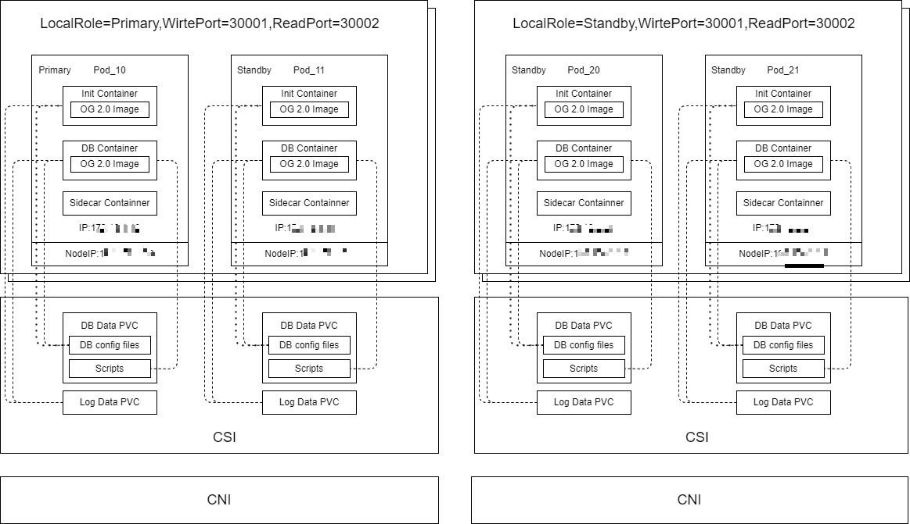
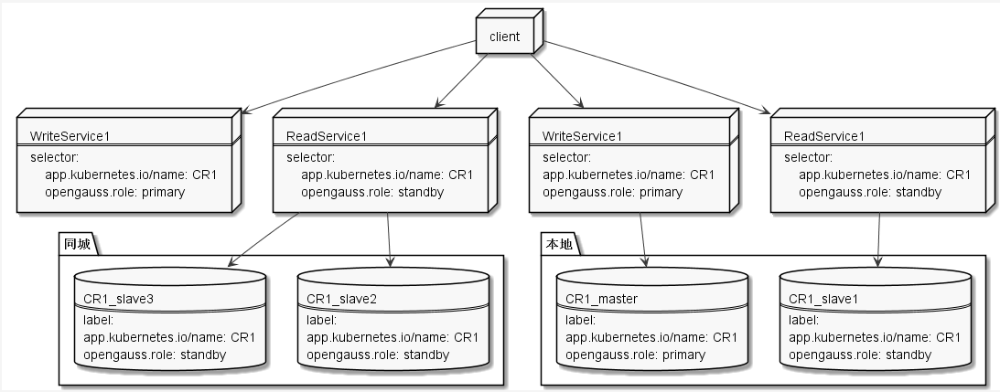
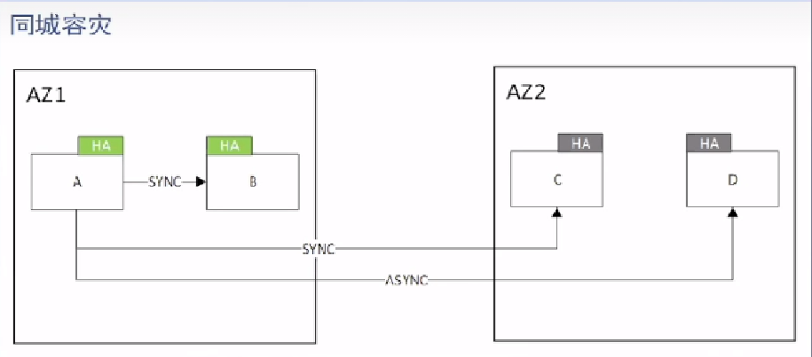
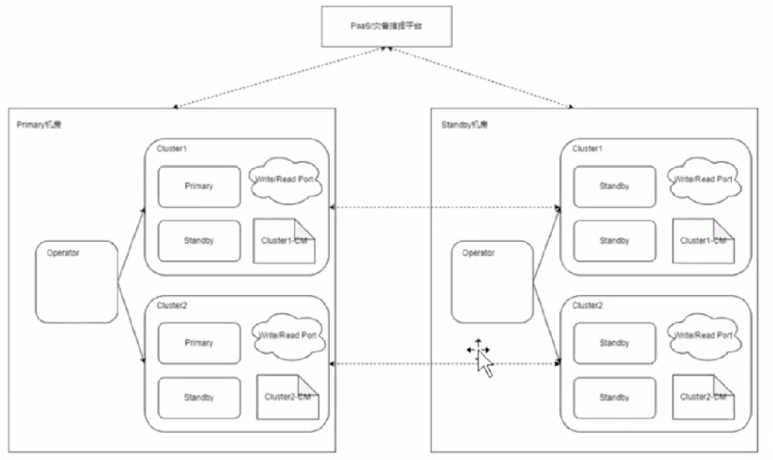
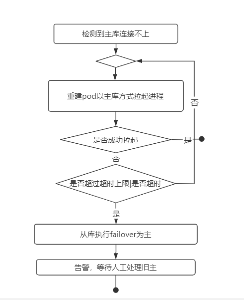

### 介绍

OpenGauss operator 是由 OpenGauss 社区开源的 opeator 项目，目前已在多个实际场景落地。OpenGauss operator 是一个基于 Kubernetes 管理的 OpenGauss 集群安装与维护的工具，其功能主要包括数据库集群的安装部署、维护、拓扑保持、资源升级、水平扩缩容、同城切换等全生命周期管理。

1.整理架构



2.读写分离



读写分离设计是基于 servcie 和 pod 添加 label 实现的 operator 会给 OpenGauss 集群下的主、备 pod 角色添加对应角色的 label。其中角色为主的节点，Pod 的 label 为 primary；角色为备的节点，Pod 的 label 为 standby。然后通过读写 servcie 根据 labels 映射到不同的 pod，其中读 service 会映射到所在 k8s 集群 OpengGauss 集群下所有备节点所在的 Pod，写 service 会映射到所在 k8s 集群 OpengGauss 集群主节点所在的 Pod，客户端通过访问 k8s 集群的任一 Node 的 ip+service 的 Nodeport，从而实现读写分离。

### 使用

1. 资源定义
   创建 crd 属性参考如下

| 属性名称       | 属性类型    | 属性说明                           |
| :------------- | :---------- | :--------------------------------- |
| ReadPort       | Int         | NodePort 读端口                    |
| WritePort      | int         | NodePort 写端口                    |
| DBPort         | int         | OpenGauss 实例端口                 |
| Image          | string      | OpenGauss 镜像地址                 |
| LocalRole      | string      | 集群角色 ：primary /standby        |
| CPU            | string      | OpenGauss 实例 CPU 限额            |
| Storage        | string      | OpenGauss 实例存储限额             |
| Memory         | string      | OpenGauss 实例内存限额             |
| BandWidth      | string      | 带宽                               |
| IpList         | IpNodeEntry | Opengauss 实例的 IP 和工作节点名称 |
| RemoteIpList   | \[]string   | 同城集群的实例 IP 列表             |
| BackupPath     | string      | 本地备份路径                       |
| ArchiveLogPath | string      | 本地归档路径                       |
| HostpathRoot   | string      | 本地存储路径(使用本地存储时填写)   |
| StorageClass   | string      | 存储插件类型                       |
| SidecarImage   | string      | Sidecar 镜像地址                   |
| SidecarCPU     | string      | Sidecar CPU 限额                   |
| SidecarMemory  | string      | Sidecar 内存限额                   |
| SidecarStorage | string      | Sidecar 存储限额                   |
| Maintenance    | bool        | 集群维护模式                       |
| ScriptConfig   | string      | 执行脚本的配置                     |
| FilebeatConfig | string      | Filebeat 配置 CM                   |

2.部署
operator 支持三种部署模式:

- 单节点
- 主从模式，支持一主多从
- 同城部署模式

下图为例，使用一主三从，其中同城机房有一个同步备节点，保证数据准确性。同城部署两个 k8s 集群，分别部署对应 operator。其中本地中心集群需设置 LocalRole 为 primary，同城中心设置 LocalRole 为 standby，本地中心指定 remoteIpList 为同城 ip 节点。





3.扩容、迁移
OpenGauss 集群的扩容是通过修改 CR 的 iplist 属性来实现的，即：

```
iplist:
  - ip: *.*.0.5
    nodename: node1
扩容即新增iplist的一个元素，通过调整OpenGauss的iplist，例如：
iplist:
  - ip: *.*.0.2
    nodename: node2
  - ip: *.*.0.5
    nodename: node1
```

更新配置文件后对集群重新进行部署
kubectl apply -f cluster.yaml

4.诊断、监控

1）集群故障时，operator 支持故障处理。其中本地节点故障发生时（以 primary 为例），故障节点尝试自动拉起，当拉起次数达到上限，会进行节点切换，本地集群不可用时需要手动切换至同城机房。



2）OpenGauss 进程容器中使用通过 sidecar 方式采集 OpenGauss 日志，支持 es 日志采集，定时任务

5.运行维护、升级
operator 支持资源修改已有集群的内存，CPU,带宽，存储容量等大小。其中多节点情况下，升级后会发生主从切换。

6.备份、归档
operator 提供 data,backup 等 volume，支持 gs_basebackup 备份，归档操作

7.资源回收
删除 OpenGauss 集群，只需要执行 k8s 命令删除 cr 即可。需要注意的是，删除 OpenGauss 集群后，该 CR 的 pvc 仍然存在，以防止需要恢复数据。

`kubectl delete opengaussclusters.opengauss.sig -n <namespace name> <cr name>`

项目地址https://gitee.com/opengauss/openGauss-operator
其他参考资料https://www.bilibili.com/video/BV1HB4y1Q7VX/?share_source=copy_web&vd_source=2300d58b192049348b003ca286486fd3
