## 一、Dbeaver 简介

Dbeaver 是一个跨平台的数据库开发者工具，包括 SQL 编程，数据库管理和分析。它支持任意适配 JDBC 驱动的数据库系统。同时该工具也支持一些非 JDBC 的数据源，如 MongoDB, Cassandra, Redis, DynamoDB 等。
⦁ 该工具提供了许多强大的特性，诸如元数据编辑器、SQL 编辑器、富文本数据编辑器、ERD、数据导入/导出/迁移，SQL 执行计划等
⦁ 该工具基于 eclipse 平台开发
⦁ 适配的数据库有 MySQL/MariaDB, PostgreSQL, Greenplum, Oracle, DB2 LUW, Exasol, SQL Server, Sybase/SAP ASE, SQLite, Firebird, H2, HSQLDB, Derby, Teradata, Vertica, Netezza, Informix 等

## 二、Dbeaver 下载

Dbeaver 是一款开源软件，代码托管在 github 上:
源代码下载:[下载](https://github.com/dbeaver/dbeaver).
此处可以直接下载二进制文件:[下载](https://github.com/dbeaver/dbeaver/releases)

## 三、依赖包下载

1. Dbeaver 依赖 jre 1.8 及以上 (请自行下载或前往[链接](https://adoptopenjdk.net/?variant=openjdk8&jvmVariant=hotspot))
   备注:免安装版必须安装 jre, windows installer 版本已经自带 jre

   2.下载 openGauss JDBC 驱动到本地

​ 从 opengauss.org 官网获取:[链接](https://opengauss.org/zh/download.html)

## 四、Dbeaver 配置

### 1. 启动 Dbeaver.exe，并选择菜单->数据库->驱动管理器，在弹出对话框中，选择新建:

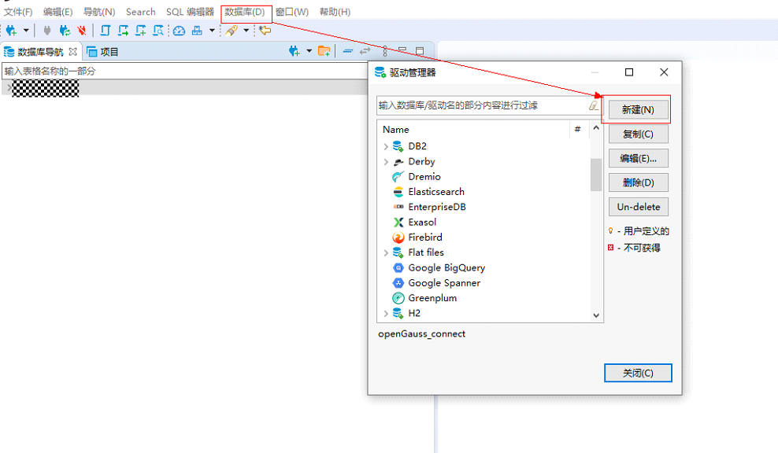

### 2. 添加 JDBC 驱动

#### a. 填写新建驱动名称->选择 JDBC 驱动文件->选择 JDBC Driver 类，如下图：

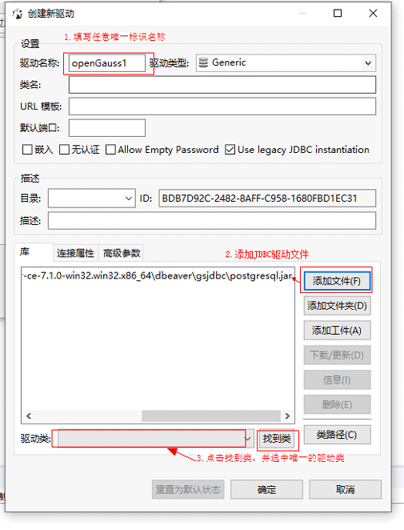

#### b. 填写 URL 模板，值为: jdbc:postgresql://{host}:{port}/{database} ，然后勾选嵌入，其他复选框不选择，然后确认，添加驱动即完成，如下图:

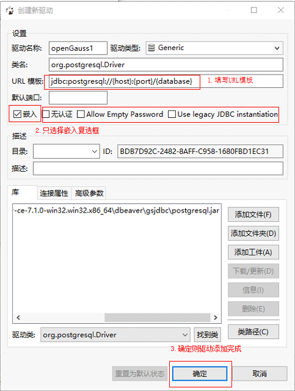

## 五、Dbeaver 连接

### 1. 选择菜单->数据库->新建连接， 在弹出的框中搜索上一步中新建的 JDBC 驱动名,选择后点击下一步,如下图示:

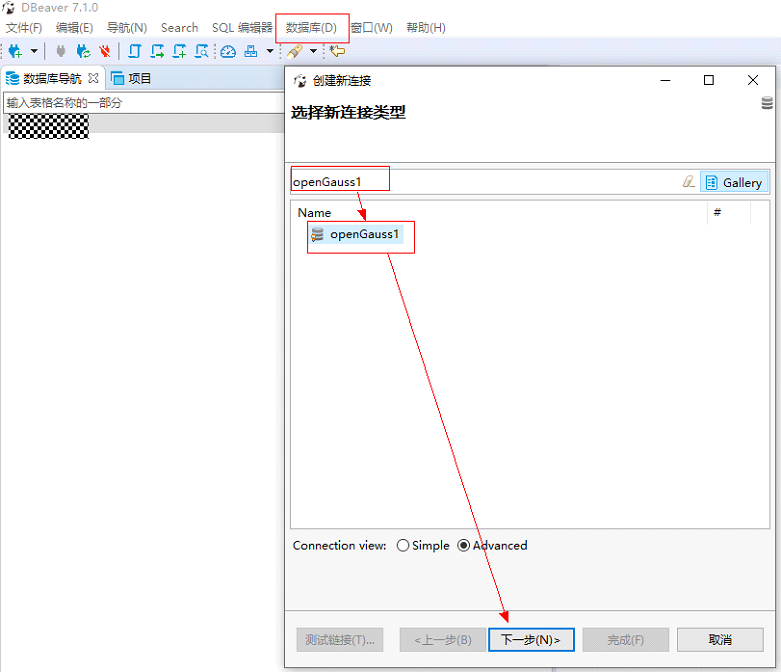

### 2. 在弹出框中填写 openGauss 主机地址、端口、将要连接的数据库以及认证用户名和密码，点击测试链接验证是否可正确连接，如图示：

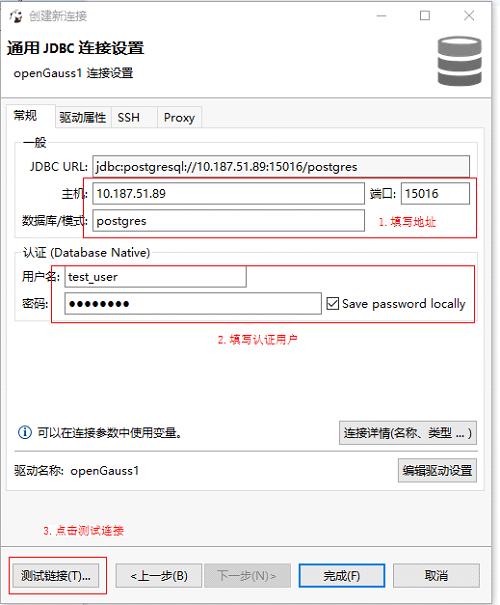

### 3. 测试结果 OK 后点击确认，并点击完成，则连接成功

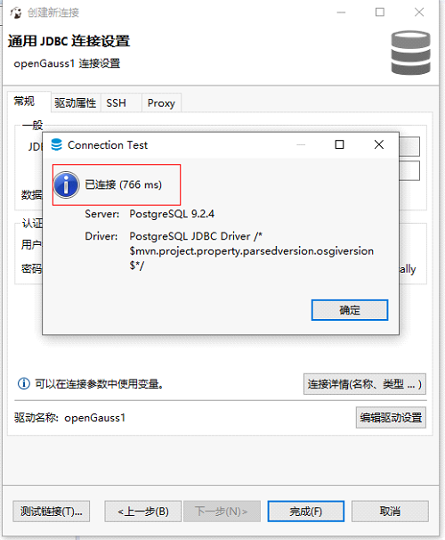

### 4. 左边的导航栏即可见数据库已经连接成功

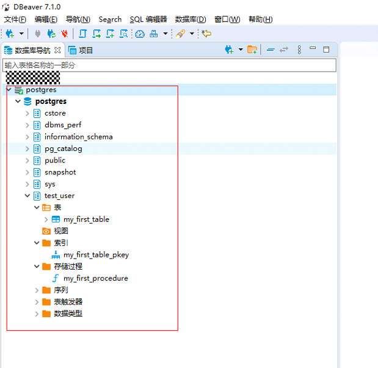

## 六、Dbeaver 使用

SQL 编写:选中要使用的数据库，并按下 F3(或使用菜单->SQL 编辑器->SQL 编辑器)即可打开 SQL 编写器，可以在编辑器中编写 SQL 和执行。

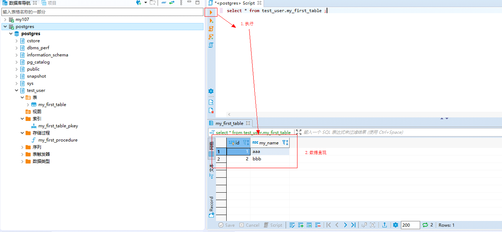

其他功能使用和其他客户端工具相似，请自行探索。

## 七、常见问题

### 1. Javax.xml.bind.DatatypeConverter 转换出错，如下图

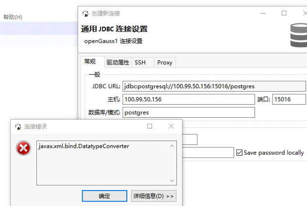

**解决方法 **: 本地安装的 java 版本无 javax.xml.bind\*.jar 这个包， 可以在添加 JDBC 驱动 jar 包时额外增加此包:[链接](https://mvnrepository.com/artifact/javax.xml.bind/jaxb-api/2.2.2)。

也可以使用 maven 下载:

`<!-- https://mvnrepository.com/artifact/javax.xml.bind/jaxb-api --> <dependency> <groupId>javax.xml.bind</groupId> <artifactId>jaxb-api</artifactId> <version>2.2.2</version> </dependency>`

### 2. 提示 No suitable driver found for jdbc:postgresql://xxx

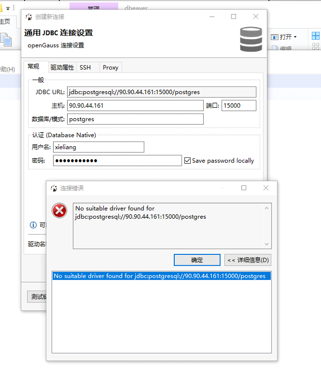

**解决方法**:在添加 JDBC 驱动时不要勾选 ‘Use legacy JDBC instantiation’:

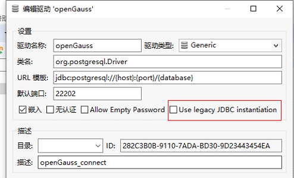
