# 一、 zabbix 简介

zabbix 是一个基于 WEB 界面的提供分布式系统监视以及网络监视功能的企业级的开源解决方案。

zabbix 能监视各种网络参数，保证服务器系统的安全运营；并提供灵活的通知机制以让系统管理员快速定位/解决存在的各种问题。

zabbix 由 2 部分构成，zabbix server 与可选组件 zabbix agent。

zabbix server 可以通过 SNMP，zabbix agent，ping，端口监视等方法提供对远程服务器/网络状态的监视，数据收集等功能，它可以运行在 Linux，Solaris，HP-UX，AIX，Free BSD，Open BSD，OS X 等平台上。

# 二、 zabbix 安装与部署

官网安装教程: [链接](https://www.zabbix.com/cn/download?zabbix=5.0&os_distribution=centos&os_version=7&db=mysql&ws=apache)

也可以自行搜索安装教程。

安装完成后，本身的 server、agent 及 web 服务可以通过下面的命令启动:

重启: `systemctl restart zabbix-server zabbix-agent httpd rh-php72-php-fpm`

开机启动: `systemctl enable zabbix-server zabbix-agent httpd rh-php72-php-fpm`

# 三、 zabbix 配置

## 1. 配置项说明

以下内容为 web+server+2 个 agent(一个是 linux agent，一个是 windows agent)的配置，

其中 web、server 和 agent1 安装在同一台机器上 100.99.112.191 记为 IP1, 配置文件路径/etc/zabbix/

另一台 agent2 安装在 windows 电脑(10.189.44.131)记为 IP2 上。

## 2. server 项配置

ListenPort = 10051 #server 端的监听 IP

SourceIP=IP1 #外部连接 ip,此 ip 配置不正确将导致 web 前端获取 agent2 的数据提示连接不正确

DBUser = zabbix

DBPassword=password

ListenIP=IP1 #server 端侦听 IP,必须使用大网，否则 agent2 无法连接

## 3. web 配置

DB 配置如图示:

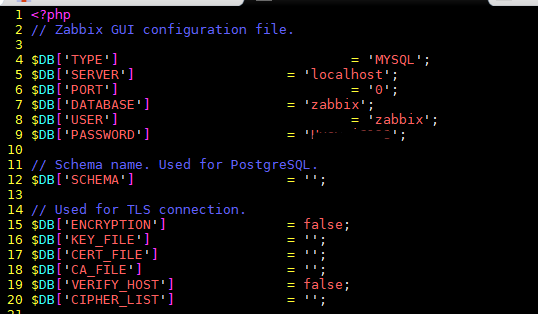

$ZBX_SERVER = IP1 #server 的 ListenIP

$ZBX_SERVER_PORT = 10051 #server 的 ListenPort

$ZBX_SERVER_NAME = zabbix # server 配置的服务名

## 4. agent1 配置(linux agent)

### a. agent 安装

这个 ip 的 agent 已经和 server 一块安装了，不用单独安装

### b.配置项

#SourceIP 不填写

Server=127.0.0.1,IP1 #如果不填写大网 ip，将导致 web 侧不同主机无法互相访问

ServerActive=127.0.0.1 #活动的 server 服务，配置成 127 或 IP1 在 agent1 上都可以正常工作

Hostname=IP1 #这里配置 web 服务所在的 ip

Include=/etc/zabbix/zabbix_agentd.d/\*.conf #增加额外的配置项，如监听项

UnsafeUserParameters=1 #配置 1 表示监听监听项接受用户输入的参数

### c. 自定义监听项 check_opengauss_status

UserParameter=check_opengauss_status[*],/etc/zabbix/script/check_opengauss_status.sh $1

check_opengauss_status.sh 内容:

`#!/bin/bash`
`if [ ! -d $1 ]; then`
`echo "no"`
`exit`
`fi`

`if [ ! -x $1 ]; then`
`echo "no"`
`exit`
`fi`
`gs_ctl status -D $1 | grep "server" | awk 'BEGIN{} {if ($4 =="running") {print "yes"} else {print "no"}} '`

### d. 自定义监听项 check_opengauss

UserParameter=check_opengauss[*],/etc/zabbix/script/check_opengauss.sh $1 $2 $3

check_opengauss.sh 内容:

`#!/bin/bash case $3 in *) source /home/zabbix/env_single gsql -h 100.99.112.191 -U test -p 50301 -d $1 -W $2 -t -c "select sum(pg_database_size(datid)) as total_size from pg_stat_database" ;; esac`

## 5. agent2 配置(windows agent)

### a. 安装 windows 版本 agent

下载 windows 版本的 zabbix agent:[链接](https://www.zabbix.com/cn/download_agents?version=5.0+LTS&release=5.0.9&os=Windows&os_version=Any&hardware=i386&encryption=No+encryption&packaging=Archive#tab:44),并且在 windows 合适的路径解压：

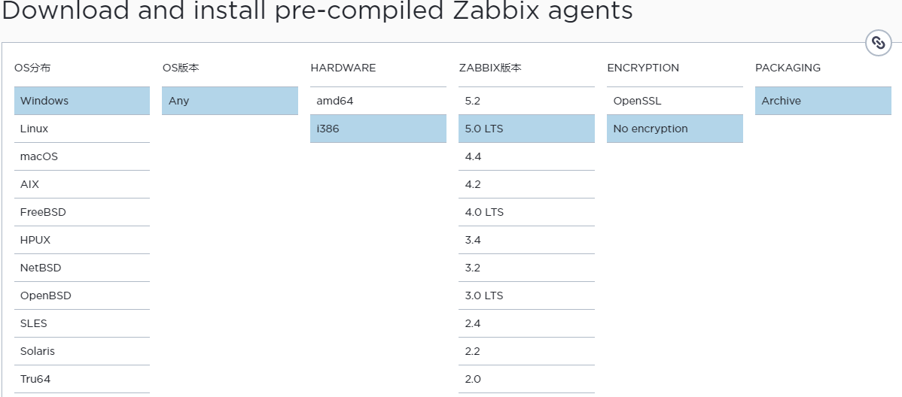

### b 配置项

#SourceIP 不配置

Server=IP2,IP1 #配置两个 ip，这两个 ip 都可以从 agent 获取监听数据

ServerActive=IP1 #配置结果似乎没有生效

Hostname=IP1 #web 服务 ip

Include=D:\software\zabbix_agent-5.0.5-openssl\shell1\\\*.conf #测试用配置

UnsafeUserParameters=1

### c. 自定义监听项 ipconfig

ipconfig.conf 内容:

UserParameter=ipconfig[*],D:\software\zabbix_agent-5.0.5-openssl\shell1\ipconfig.bat

bat 内容，仅回显打印 justtest:

`@echo justtest`

# 四、 zabbix 服务使用

以上配置完成后，即可在 web 服务中使用，其中 agent1 含有被测项 check_opengauss, check_opengauss_status

agent2 中含有 ipconfig 检测项。

#### a. 创建新的主机，本次以 windows IP2(10.189.44.131)为主

进入配置->主机->创建主机，填写信息如下:

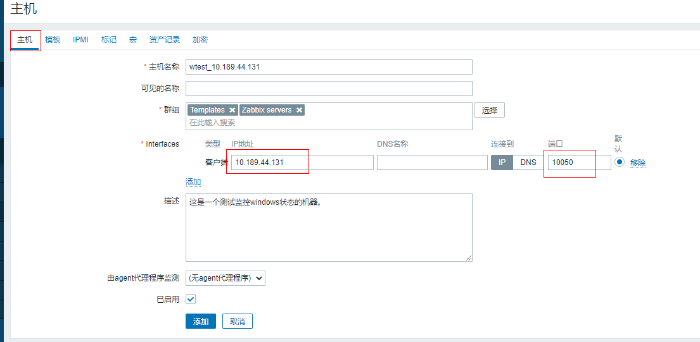

模板填写内容如下,当前仅选择一个 Template OS windows 的模板，用于监听 windows 状态:

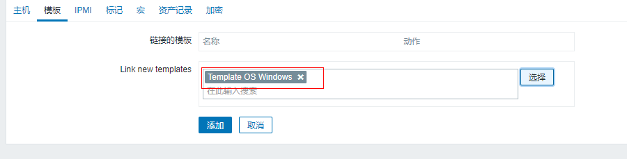

点击添加，完成主机添加，我们看到已经有部分监控项和触发器:

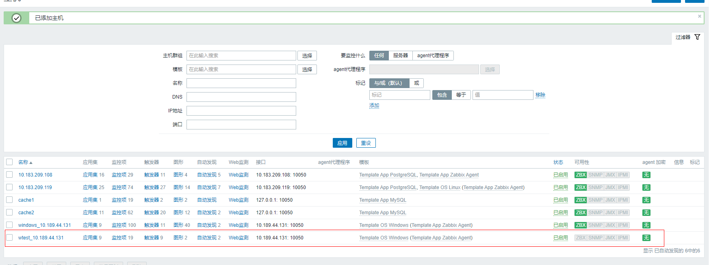

进入监控项，可以看到全部启用了:

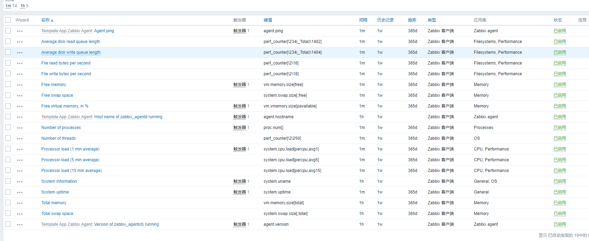

进入菜单 监测->最新数据，可以看到此主机的所有数据都已经有刷新。

#### b. 创建自定义监控项

刚才是系统的监控项，我们可以追加自己的监控项，进入主机->点击监控项->创建监控项,参数如下:

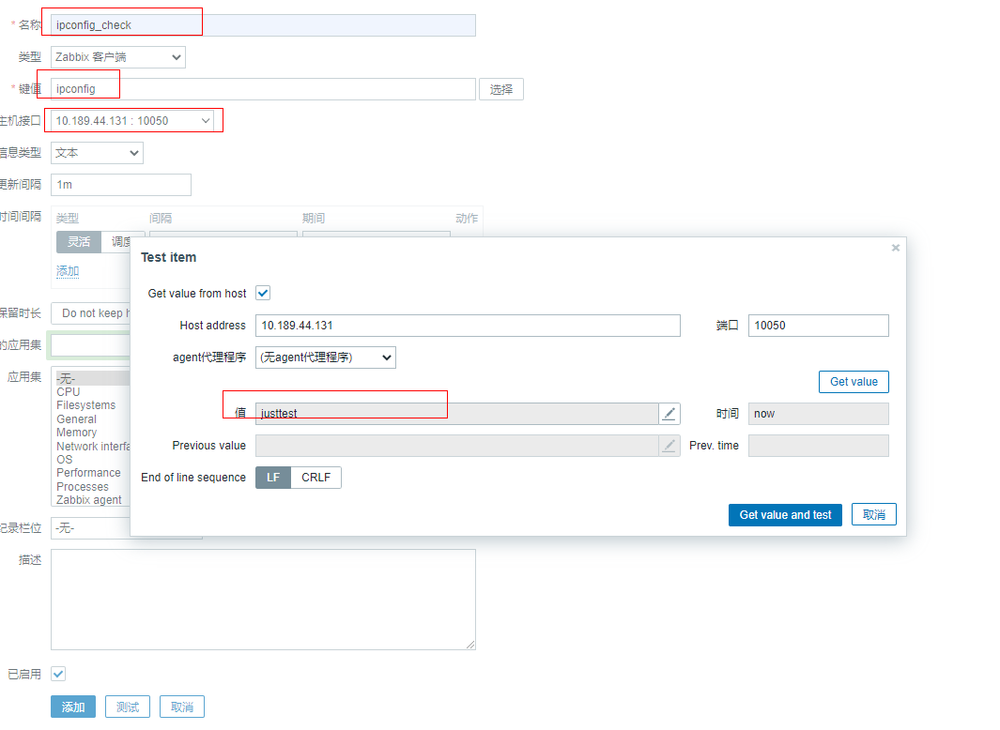

可以看到我们的自定义项值可以正常获取了，点击添加完成此项新增。

#### c. 创建触发器

我们可以在监控项边上的三个点弹出的菜单上选择添加触发器，当满足触发器的规则后，zabbix 会在仪表盘、问题显示问题，同时也可以响应邮件发送动作或其他触发事项。

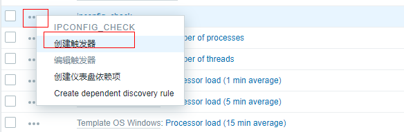

设置触发器表达式，可以查看参考资料:[链接](https://www.zabbix.com/documentation/4.0/zh/manual/config/triggers/trigger)

如本次设置表达式为如果监控项返回的文本中包含 just 则告警为严重：

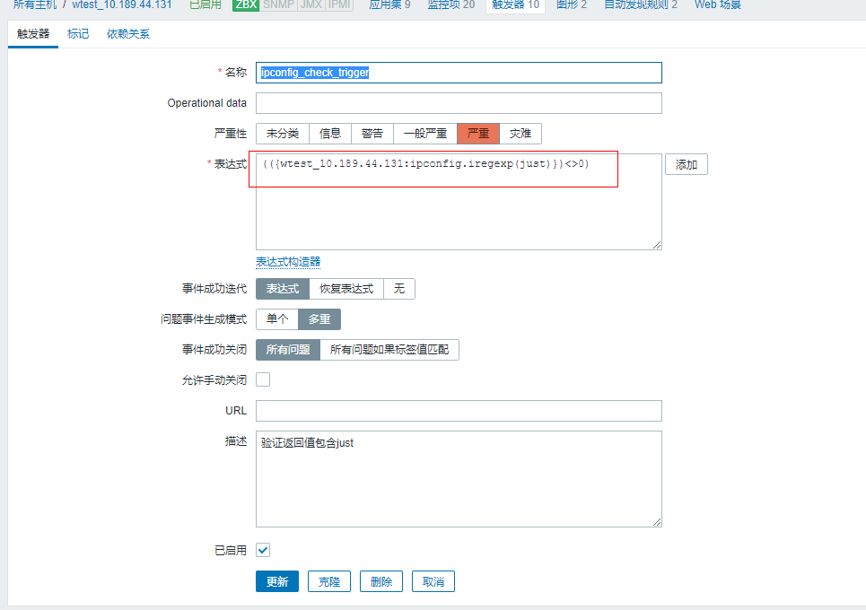

在监测->仪表板上可以看到持续有问题上报和触发:

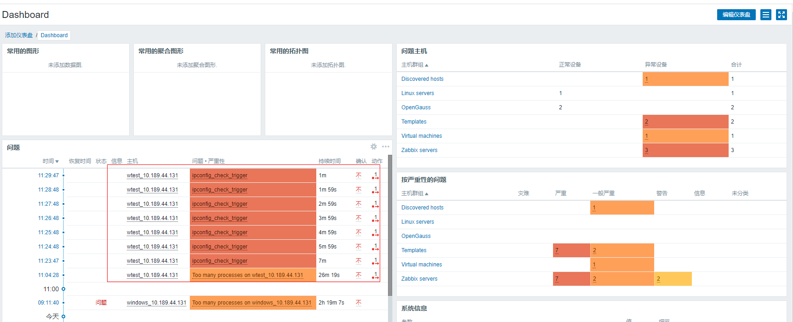

#### d. 创建响应动作

进入配置->动作页面，点击创建动作，现在先在动作页面新增加一个动作，该动作为如果触发器为 ipconfig_check_trigger 时响应，如图示:

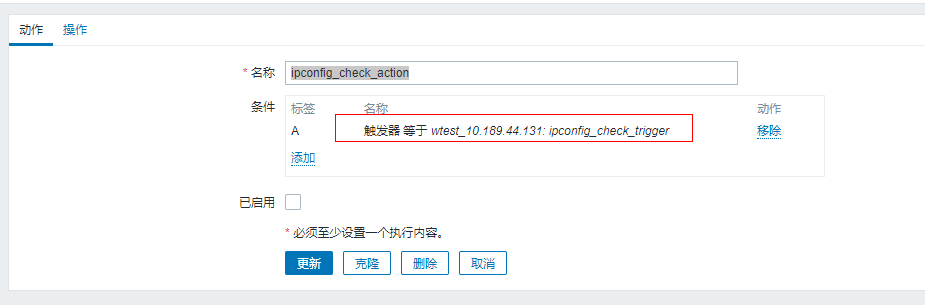

再增加触发此动作时的响应,本图示例为每隔 1h 且此问题处理，则向管理员组和用户组的成员发送邮件:

**请谨慎的处理些规则，如果时间间隔太短或报警数量过多，将导致邮箱爆满**

#### e. 处理邮箱通知配置

选择菜单 管理->报警媒介类型->Email,按照要求配置好邮件 smtp 发送方信息，

继续选择管理->用户来配置接收方,默认只有管理员一个用户，配置上即可:

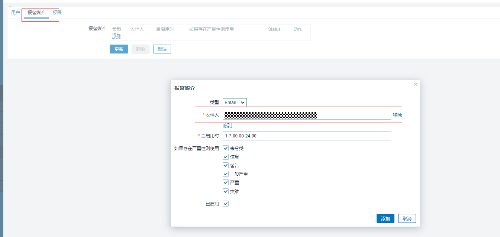

以上步骤即完成从数据获取->触发->响应->通知的全流程。

# 五、zabbix 监听 openGauss

### a. 下载与 openGauss 环境匹配的 agent

可以到官网下载二进制直接解压缩包:[链接](https://www.zabbix.com/cn/download_agents?version=5.0+LTS&release=5.0.9&os=Linux&os_version=3.0&hardware=amd64&encryption=No+encryption&packaging=Archive#tab:44)

本次使用使用环境为 centOS7 x86_64 架构：

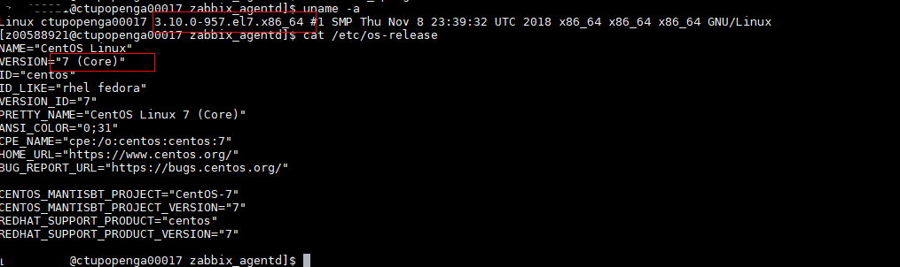

选择的配置如下:

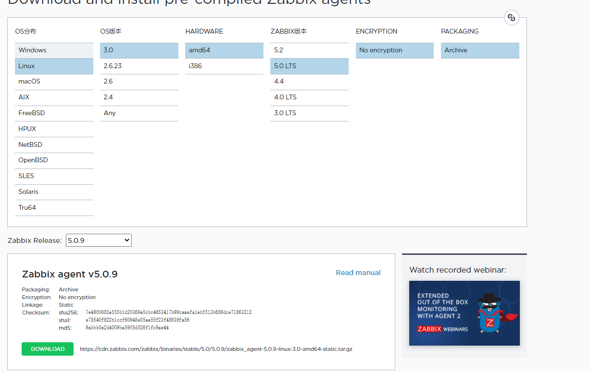

找到合适的位置解压(注意要与 openGauss 安装名相同，并赋予正确的权限)，本次示意为 home 路径为$ZBX_AGENT_HOME,解压后有 3 个目录，分别是 bin、sbin 以及 conf,将 bin 和 sbin 添加到个人环境变量~/.bashrc，方便 zabbix_agentd、zabbix_get、zabbix_sender 可以直接使用。

同时配置个人环境变量加载 openGauss 的环境变量，使 gsql、gs_ctl 等 openGauss 工具直接可用。

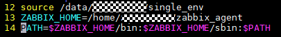

### b. 修改 agent 配置，使其可与 zabbix 正常连接

参考 3.3 agent1 配置文件修改及添加两项 openGauss 的监听项目:check_opengauss 和 check_opengauss_status。

配置完成后即可通过 zabbix_agentd 启动服务，为了简化操作，这里引入 shell 脚本 zabbix_run.sh 来辅助启动它:

它支持-s start|stop|restart 命令来启动我们的 agent 服务,只需要适配第二行的配置文件位置即可，内容如下:

`#!/bin/bash`
`pfurl='zabbix_agentd -c /home/user/zabbix_agent/conf/zabbix_agentd.conf'`
`PID=0`
`kill_zabbix_agentd(){`
`ps ux | awk -r '/zabbix_agentd/{print $2}' | xargs -n1 kill -9`
`}`
`pfstart(){`
`num=ps ux | awk -r '/zabbix_agentd/{print $2}' | wc -l`
`if [ $num != "1" ];then`
`echo "zabbix_agentd is useing"`
`else`
`echo "zabbix_agentd is starting..."`
`$pfurl`
`echo "start done!"`
`fi`
`}`

`if [ "$1" == "-s" ];then`
`if [ "$2" == "stop" ];then`
`echo "zabbix_agentd is stopping...."`
`kill_zabbix_agentd`
`echo "stop done!"`
`elif [ "$2" == "start" ];then`
`pfstart`
`elif [ "$2" == "restart" ];then`
`echo "zabbix_agentd is stopping...."`
`kill_zabbix_agentd`
`echo "stop done!"`
`echo "zabbix_agentd is starting..."`
`$pfurl`
`echo "start done!"`
`fi`
`elif [ "$1" == "--help" ];then`
`echo "zabbix_agentd -s [start/stop/restart]"`
`else`
`pfstart`
`fi`

启动正常连接后，可通过 zabbix_get 获取到数据，如下图示:

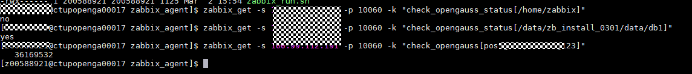

### c. 创建 openGauss 模板

进入配置->模板，点击创建模板，填入模板名称和所属群组(可提前在主机群组中创建)，添加几个通用宏:

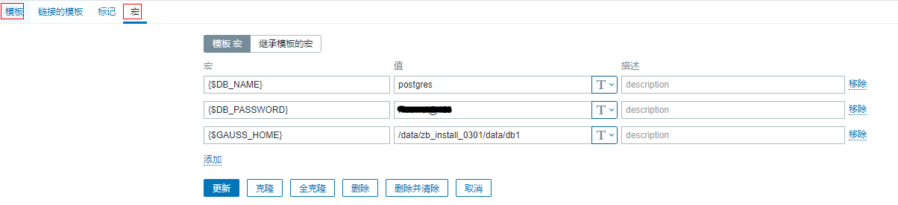

然后再创建 2 个监听项,此处可以引用宏来使不同的 openGauss 数据库引用不同的参数:

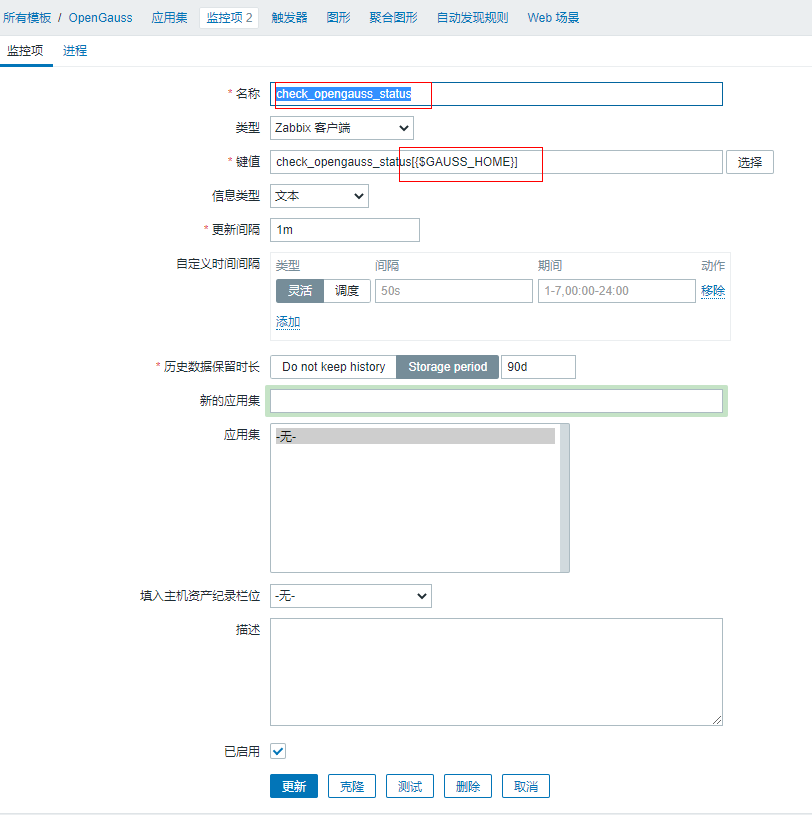

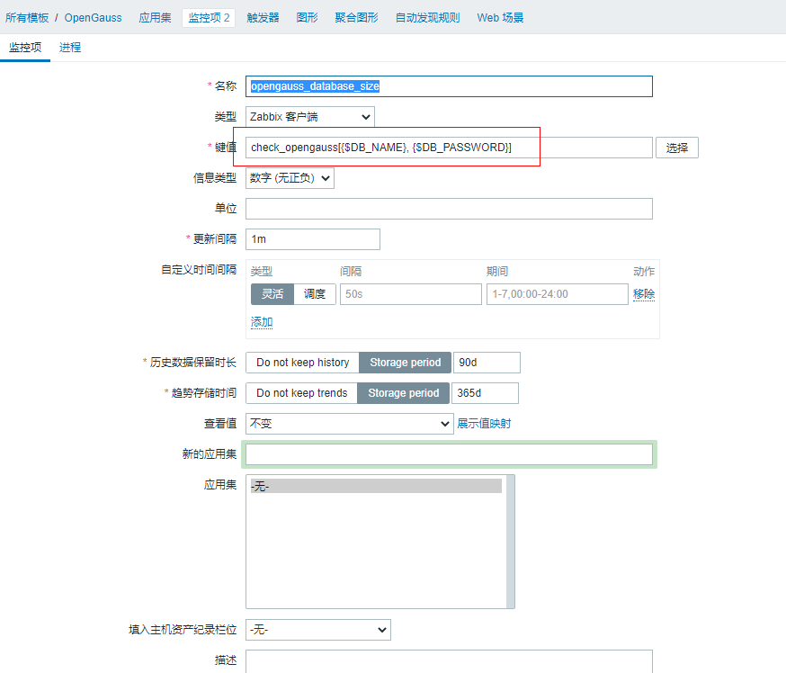

### d. 创建 openGauss 主机

进入配置->主机，点击创建主机，输入主机名称和客户端地址(即 agent 的 ip 和端口)，同时在模板中增加刚才配置的 openGauss 模板，再修改宏对应的值。

**除了 openGauss 模板外，系统还自带有的模板，可以增加 Template OS linux 的模板，那么磁盘、网络、cpu 负载等也就可以完成监控了。**

创建完成后，自动具有模板中的两个监控项:

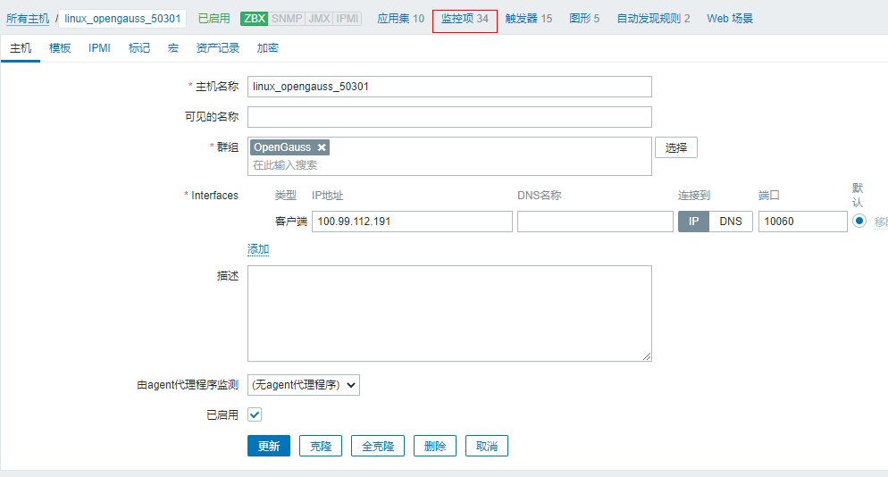

### e. 配置触发器等

参考第四节内容配置,自行添加触发器逻辑即可。

以上便完成了所有的 openGauss 监控，包括 linux 系统资源、gsql 和 gs_ctl 及其返回结果，你可以在脚本中调用其他的命令来扩展更多的监控.当简单的 shell 脚本不能满足我们的要求时，我们可以自行开发代理与 agent 交互来完成更多的监控事项，请自行探索。

### f. 移植 zabbix postgresql 的模板

zabbix 已经支持 postgresql 数据库的监控，其模板名称为 Template App PostgreSQL,现有的监控项没办法直接使用，我们可以从官网下载源代码并自行添加对应的配置项。zabbix github 代码路径: [链接](https://github.com/zabbix/zabbix),对应的 postgresql 监控模板路径为:[链接](https://github.com/zabbix/zabbix/tree/master/templates/db/postgresql),内容如下:

其中配置项 template_db_postgresql.conf 内容如下:

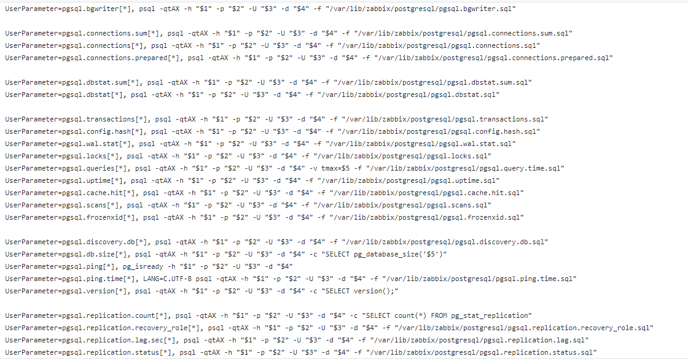

其大多数监控使用 psql 执行 sql 脚本实现，移植其监控项并不复杂，以第一条修改为例:

UserParameter=pgsql.bgwriter[*], gsql -qtAX -h "$1" -p "$2" -U "$3" -d "$4" -W "$5" -f "/home/user/zabbix_agent/conf/zabbix_agentd/opengauss/pgsql.bgwriter.sql"

修点点包括:

- psql 改为 gsql
- 增加-W "$5" 用于增加密码输入(因为 gsql 在本地执行，考虑移除-h/-U/-W 参数也是可行的)
- 修改将要执行的 sql 文件路径，使其路径为正确的地址即可。

由于 postgresql 与 openGauss 存在部分 sql 语句和函数差异，某些监控项需要移植 sql，请自行处理。

以上 agent 的自定义监控项配置后，可以参考第四节内容增加到 Web 监控。

# 六、常见问题

### a. 添加主机报错

**cannot connect to [[10.183.209.119]:10050]: [111] Connection refused**

常见错误原因：

- 防火墙未关闭

[root@ctupopenga00017 ~] systemctl status firewalld.service

[root@ctupopenga00017 ~] systemctl stop firewalld.service

- 用户无权限创建 zabbix_agentd 进程文件

查看 zabbix agent 日志，分析错误原因

[root@ctupopenga00017 ~]# cat /var/log/zabbix/zabbix_agentd.log

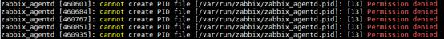

根据提示赋予 zabbix 用户/var/run/zabbix/的 write 权限，然后重启 agent 服务即可

[root@ctupopenga00017 ~]# chmod 755 /var/run/zabbix/

[root@ctupopenga00017 ~]# systemctl restart zabbix_agent.service

- Zabbix agent 配置文件填写错误

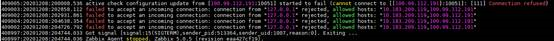

日志提示添加监控使用的 localhost 地址为 127.0.0.1，而 zabbix_agentd.conf 中 Server 填写的地址未包含 127.0.0.1，因此在配置文件中添加 localhost 地址即可

### b. 创建自定义监控项报错

- ZBX_NOTSUPPORTED: Item does not allow parameters.

错误原因：zabbix_agentd.conf 配置文件参数格式填写错误

解决办法：在 zabbix_agentd.conf 中找到 UserParameter 参数，在自定义键值后添加[*]，代表需要传递参数

- 返回值类型不匹配

错误原因：在使用 awk 将筛选出来的值作为返回值时，由于 awk 的机制，会把返回值转换成 string 类型

解决办法：可以使用 awk 的 strtonum 转换成浮点数，在 conf 文件中添加 strtonum 内容，如：UserParameter=service.cpu[*],ps -aux | egrep -v 'grep|tail' | grep $1 | awk '{print strtonum($$3)}'

- ZBX_NOTSUPPORTED: Unsupported item key.

  监控项名称在 agent 侧未配置

- zabbix_get [87767]: Check access restrictions in Zabbix agent configuration

​ Server 路由配置错误，导致 server 无法访问 agent
