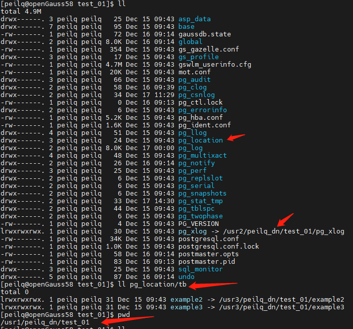

# 一、 性能测试预备知识

在官网的 blog 文章中，详细介绍了如何 tpcc 测试、安装 benchmarksql 和安装数据库,请先阅读它:[BenchmarkSQL 性能测试](https://opengauss.org/zh/blogs/blogs.html?post/jiajunfeng/benchmarksql%E6%80%A7%E8%83%BD%E6%B5%8B%E8%AF%95/)。

# 二、 高性能要求的硬件&软件

本次 openGauss 数据库部署采用 TaiShan 200 服务器(型号 2280) :

- CPU 型号： 鲲鹏 920 6426, 2P 128 核

- 内存数量: 32G \* 24 条
- 网络：10GE 带宽
- 网卡:1822 SP580 25GE
- 硬盘:nvme\* 3 个 容量:7.3T (HWE52P438T0L005N)

软件:

- 操作系统 openEuler 20.03 (LTS)
- 架构 aarch64
- BIOS 关闭 `Support Smmc`,`CPU Prefetching Configuration`,`Die Interleaving`
- 文件系统 xfs 的 blocksize 为 8k
  - `xfs_info $nvme挂载盘`可查看 bsize 是否为 8192,不是则需要重新格式化 nvme 盘
- 修改网络中断绑核 (参考后面的步骤)
- 安装 numa
- 安装 htop

**benchmarksql 的测试环境推荐使用鲲鹏 920 128 核机器，对内存和硬盘无要求，不过它要与数据库在同一子网中，ping 延时稳定在 0.05ms 以内**。

benchmarksql 上需要安装 bisheng JDK，并加入环境变量:[JDK_8u292](https://mirror.iscas.ac.cn/kunpeng/archive/compiler/bisheng_jdk/bisheng-jdk-8u292-linux-aarch64.tar.gz)

# 三、 优化数据库配置

有了硬件和操作系统优化后，数据库也要充分利用硬件资源才能达到最优性能，这些和数据库配置息息相关，即使在同样的机器上，配置不同也可能导致性能差异巨大。

## 1. 磁盘划分

磁盘 IO 通常都会成为整个数据库的瓶颈，openGauss 采用 wal 预写式事务日志来顺序写磁盘以提升 IO 利用率，但是这还不够。在高性能场景下，为了最大化利用磁盘 IO，我们将依赖较少的磁盘写入操作分配到不同的 nvme 盘，这可以使得磁盘可以并发使用，磁盘 IO 利用率大大提升。

在 openGauss 中，默认的数据都写入当前数据库安装路径(以下以`$gauss_home`替 代)，我们可以把 xlog 和热点表编入不同的磁盘以提升磁盘 IO 利用率，在这里我们使用软链接实现，在磁盘划分时请正常退出 openGauss 再操作,`gs_ctl stop -D $gauss_home`。

xlog 映射的路径为`$gauss_home\pg_xlog`, 而热点表 bmsql_customer 和 bmsql_stock 通常放入表空间,对应的路径为`$gauss_home\pg_location`。

**注意:表空间使用相对路径 tb/exampleX 创建, 创表语法:`create tablespace example2 relative location 'tb/example2'`**:

最终磁盘映射情况及 demo 示例如下:

| 磁盘         | 映射路径 | 数据目录                                       | 软链接                             |
| ------------ | -------- | ---------------------------------------------- | ---------------------------------- |
| /dev/nvme0n1 | /usr1    | $gauss_home=/usr1/peilq_dn/test_01             | 不涉及                             |
| /dev/nvme1n1 | /usr2    | /usr2/peilq_dn/test_01/pg_xlog                 | $gauss_home/pg_xlog                |
| /dev/nvme2n1 | /usr3    | /usr3/peilq_dn/test_01/pg_location/tb/example2 | $gauss_home/pg_location/tb/exampe2 |
| /dev/nvme2n1 | /usr3    | /usr3/peilq_dn/test_01/pg_location/tb/example3 | $gauss_home/pg_location/tb/exampe3 |



## 2. 高性能配置

在`$gauss_home/postgresql.conf`追加以下内容,(重复配置以最后一次位置为准):

```
remote_read_mode = non_authentication
replication_type = 1
sync_config_strategy = none_node
recovery_max_workers = 20

max_connections = 4096
allow_concurrent_tuple_update = true
audit_enabled = off
cstore_buffers = 16MB
enable_alarm = off
enable_codegen = false
enable_data_replicate = off
full_page_writes = off
max_files_per_process = 100000
max_prepared_transactions = 2048
shared_buffers = 350GB
use_workload_manager = off
wal_buffers = 1GB
work_mem = 1MB
transaction_isolation = 'read committed'
default_transaction_isolation = 'read committed'
synchronous_commit = off
fsync = on
maintenance_work_mem = 2GB
vacuum_cost_limit = 10000
autovacuum = on
autovacuum_mode = vacuum
autovacuum_max_workers = 20
autovacuum_naptime = 5s
autovacuum_vacuum_cost_delay = 10
update_lockwait_timeout = 20min
enable_mergejoin = off
enable_nestloop = off
enable_hashjoin = off
enable_material = off
wal_log_hints = off
log_duration = off
checkpoint_timeout = 15min
autovacuum_vacuum_scale_factor = 0.1
autovacuum_analyze_scale_factor = 0.02
enable_save_datachanged_timestamp = false
enable_double_write = on
enable_incremental_checkpoint = on
enable_opfusion = on
advance_xlog_file_num = 100
numa_distribute_mode = 'all'
track_activities = off
enable_instr_track_wait = off
enable_instr_rt_percentile = off
track_counts = on
track_sql_count = off
enable_instr_cpu_timer = off
plog_merge_age = 0
session_timeout = 0
enable_instance_metric_persistent = off
enable_logical_io_statistics = off
enable_page_lsn_check = off
enable_user_metric_persistent = off
enable_xlog_prune = off
enable_resource_track = off
instr_unique_sql_count=0

remote_read_mode=non_authentication
wal_level = archive
hot_standby = off
hot_standby_feedback = off
client_min_messages = ERROR
log_min_messages = FATAL
enable_asp = off
enable_bbox_dump = off
bgwriter_flush_after = 32
minimum_pool_size = 200
wal_keep_segments = 1025
enable_bitmapscan = off
enable_seqscan = off
enable_beta_opfusion=on
enable_thread_pool = on
checkpoint_segments=8000
enable_stmt_track=false
bgwriter_thread_num = 1
bgwriter_delay = 5s
incremental_checkpoint_timeout = 5min
thread_pool_attr = '464,4,(cpubind:1-28,32-60,64-92,96-124)'
xloginsert_locks = 16
wal_writer_cpu=0
wal_file_init_num = 20
xlog_idle_flushes_before_sleep = 500000000
pagewriter_sleep = 10ms
```

核心增强配置项:

shared_buffers = 350GB

enable_thread_pool = on

checkpoint_segments=8000

incremental_checkpoint_timeout = 5min

thread_pool_attr = '464,4,(cpubind:1-28,32-60,64-92,96-124)'

wal_writer_cpu=0

相关参数配置说明请参考开发者手册描述:[开发者手册](https://opengauss.org/zh/docs/2.1.0/docs/Developerguide/Developerguide.html)

## 3. 绑核配置

网络中断避免系统随机调度导致的性能损失，所以可以将特定的 CPU 专门用于处理网络中断以提升网络 IO 吞吐量。此脚本 bind_net_irq_12.sh 需在 root 下运行，使用 12 核处理网络中断，它使用的 CPU 核与数据库进程占用的 CPU 核不相交,注意 intf 参数为高性能网卡名,请正确修改之:

```bash
#!/bin/bash
# 网卡名
intf=enp4s0
systemctl stop irqbalance.service
systemctl disable irqbalance.service
ethtool -L $intf combined 12

irq_list=`cat /proc/interrupts | grep $intf | awk {'print $1'} | tr -d ":"`
irq_array_net=($irq_list)

cpu_array_irq=(29 30 31 61 62 63 93 94 95 125 126 127)

for (( i=0;i<12;i++ ))
do
        echo "${cpu_array_irq[$i]}" > /proc/irq/${irq_array_net[$i]}/smp_affinity_list
done

for j in ${irq_array_net[@]}
do
        cat /proc/irq/$j/smp_affinity_list
done
```

可以使用下面的 irq_check.sh 脚本来检查绑核是否生效:

```bash
#!/bin/bash
# 网卡名
intf=enp4s0
# 获取中断号
rx_irq_list=(`cat /proc/interrupts | grep ${intf} | awk -F':' '{print $1}'`)
echo "check irf of net interface ${intf}"

echo "rx"
for rx_irq in ${rx_irq_list[@]}
do
    echo `cat /proc/irq/$rx_irq/smp_affinity_list`
done
```

以上配置完成后，即可通过`numactl -C 0-28,32-60,64-92,96-124 gs_ctl -D $gauss_home start &`来启动数据库。

## 4. benchmarksql 配置

openGauss 已经提供了和 pg 兼容的 jdbc，此驱动可以从 maven 中央仓库下载，坐标是:

```xml
<groupId>org.opengauss</groupId>
<artifactId>opengauss-jdbc</artifactId>
<version>2.0.1-compatibility</version>
```

将 jdbc 放到 benchmarksql/lib/postgres 目录下即可。

jdbc 修改了驱动类为:`org.opengauss.Driver`, 同时识别串改为`jdbc:opengauss://`

对应的 benchmarksql 的 props.og 文件修改如下，注意 conn 连接串中增加的 jdbc 参数,terminal 参数是并发数，当前 150 万 tpmc 经验值为 696:

```
db=postgres
driver=org.opengauss.Driver
conn=jdbc:opengauss://数据库ip:端口/test?loggerLevel=OFF&prepareThreshold=1&fetchsize=10&preparedStatementCacheSizeMiB=0&preparedStatementCacheQueries=0
user=test
password=********

warehouses=1000
loadWorkers=80

terminals=696
//To run specified transactions per terminal- runMins must equal zero
runTxnsPerTerminal=0
//To run for specified minutes- runTxnsPerTerminal must equal zero
runMins=30
//Number of total transactions per minute
limitTxnsPerMin=0

//Set to true to run in 4.x compatible mode. Set to false to use the
//entire configured database evenly.
terminalWarehouseFixed=false

//The following five values must add up to 100
//The default percentages of 45, 43, 4, 4 & 4 match the TPC-C spec
newOrderWeight=45
paymentWeight=43
orderStatusWeight=4
deliveryWeight=4
stockLevelWeight=4

// Directory name to create for collecting detailed result data.
// Comment this out to suppress.
resultDirectory=my_result_%tY-%tm-%td_%tH%tM%tS
osCollectorScript=./misc/os_collector_linux.py
osCollectorInterval=1
//osCollectorSSHAddr=user@dbhost
osCollectorDevices=net_eth0 blk_sda
```

# 四、 数据建仓

openGauss 150 万 tpmc 使用 warehouse 仓数为 1000,大约产生 100G 数据量。

## 1. 数据插入

进入 benchmarksql 所在机器的$benchmark_home/run 目录。

参照第一节中的[BenchmarkSQL 性能测试](https://opengauss.org/zh/blogs/blogs.html?post/jiajunfeng/benchmarksql%E6%80%A7%E8%83%BD%E6%B5%8B%E8%AF%95/)的描述，在`sql.common/tableCreates.sql`中修改对应的表空间创建语句和热点表 bmsql_customer 和 bmsql_stock 使用:

```
create tablespace example2 relative location 'tb/example2';
create tablespace example3 relative location 'tb/example3';

create table bmsql_customer xxx using tablespace example2;
create table bmsql_stock xxx using tablespace example3;
```

同时需要修改`sql.common/indexCreates.sql`,使 bmsql_new_order 的索引也存放在 example2 这个表空间上:

```
alter table bmsql_new_order add constraint bmsql_new_order_pkey
    primary key (no_w_id, no_d_id, no_o_id) using index tablespace example2;
```

在`./runDatabaseBuild.sh props.og`完成数据建仓。

## 2. 数据备份

在 openGauss 高性能环境下完成 1000 仓数据插入约 30 分钟，而性能测试将导致数据及缓存膨胀，所以标准测试前都需要恢复数据。每次都通过数据插入的方式来恢复数据的耗时就变得难以忍受。openGauss 允许备份数据目录的方式来恢复数据。注意备份数据必须停止 openGauss 进程 :`gs_ctl stop -D $gaussdb_home`。

这里提供备份脚本 backup.sh 如下,脚本中的绝对路径请按实际修改,原理就是针对 3 个 nvme 盘创建同路径的.bak 备份路径:

```bash
#!/usr/bin/env bash
if [ -z "$1" ]; then
    echo "first param must set"
    exit
fi
cur_path=$1
bak=".bak"
data_dir="/usr1/peilq_dn/$cur_path"
data_dir_bak="$data_dir$bak"

xlog="/usr2/peilq_dn/$cur_path"
xlog_bak="$xlog$bak"

tb="/usr3/peilq_dn/$cur_path"
tb_bak="$tb$bak"

rm -rf $data_dir_bak
cp -rdf $data_dir $data_dir_bak

rm -rf $xlog_bak
cp -rdf $xlog $xlog_bak

rm -rf $tb_bak
cp -rdf $tb $tb_bak
echo "OVER"
```

使用方式`sh backup.sh test01`。

## 3. 数据恢复

当一轮测试完成后，当前的 openGauss 数据仓库已经被污染，接下来的测试性能会逐渐降低，此时可以通过上节的备份数据来恢复数据仓库。

数据恢复前仍然需要停止数据库，如果测试完成后数据库停止较慢，可以通过`kill -9 $pid`方式强行终止数据库。

数据恢复脚本 recovery.sh 如下，脚本中的绝对路径请按实际修改,原理就是针对 3 个 nvme 盘从同路径的.bak 路径覆盖对应路径:

```bash
#!/usr/bin/env bash
if [ -z "$1" ]; then
    echo "first param must set"
    exit
fi

cur_path=$1
bak=".bak"
data_dir="/usr1/peilq_dn/$cur_path"
data_dir_bak="$data_dir$bak"

xlog="/usr2/peilq_dn/$cur_path"
xlog_bak="$xlog$bak"

tb="/usr3/peilq_dn/$cur_path"
tb_bak="$tb$bak"

rm -rf $data_dir
cp -rdf $data_dir_bak $data_dir

rm -rf $xlog
cp -rdf $xlog_bak $xlog

rm -rf $tb
cp -rdf $tb_bak $tb
echo "OVER"
```

使用方式`sh recovery.sh test01`，恢复时间在 1~2 分钟内。

重新使用`numactl -C 0-28,32-60,64-92,96-124 gs_ctl -D $gauss_home start &`来启动数据库即可。

# 五、 测试验证

进入 benchmarksql 所在机器的$benchmark_home/run 目录。

其中 props.og 中`runMins=30`控制测试时长单位为分钟。

`./runBenchmark.sh props.og`,即可启动测试。

在测试过程中会滚动显示当前的平均事务数和总事务数以及内存使用情况。第一个显示的数字即为平均事务数`Running Average tpmTOTAL:`在完成测试前，该值 \*0.45 即约等于测试结果，所以测试进行 3~5 分钟基本可以判断性能是否在预期之内，当前性能环境第一个值需要在 300 万以上才能满足 150 万要求。

我们可以在测试过程中，在数据库运行的机器上执行 htop 命令，查看 CPU 使用情况：查看绑核是否生效，CPU 是否满载等。

**每次正式测试前，请重置数据。**
