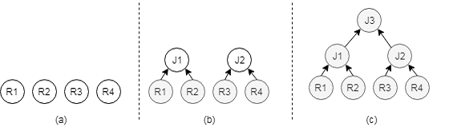
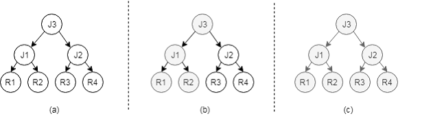

---
title: 'openGauss数据库核心技术-SQL引擎（2）'

date: '2020-07-27'

category: 'blog'
tags: ['openGauss数据库核心技术']

archives: '2020-07'

author: 'kangyang'

summary: '以技术连载的方式陆续介绍openGauss数据库的各项核心技术，包括SQL引擎、优化器、存储引擎、事务处理、数据库安全等。本期开始介绍openGauss SQL引擎技术'

img: '/zh/blogs/kangyang/title/img5.png'

times: '17:30'
---

## 前言

​ 上期我们介绍了 SQL 解析的原理，并介绍了查询优化中查询重写的技术原理，本期将介绍路径搜索、代价计算的技术原理。

## 路径搜索

​ 优化器最核心的问题是针对某个 SQL 语句获得其最优解，这个过程通常需要枚举 SQL 语句对应的解空间，也就是枚举不同的候选的执行路径，这些执行路径互相等价，但是执行效率不同，对解空间中的这些执行路径计算它们的执行代价，最终可以获得一个最优的执行路径。依据候选执行路径的搜索方法的不同，将优化器的结构划分为如下几种模式：

- 自底向上模式：如图 1 所示，自底向上模式会对逻辑执行计划进行拆解，先建立对表的扫描算子，然后由扫描算子构成连接算子，最终堆成一个物理执行计划，在这个过程中，由于物理扫描算子和物理连接算子有多种可能，因此会生成多个物理执行路径，优化器会根据各个执行路径的估算代价选择出代价最低的执行计划，然后转交由执行器负责执行。

  **图 1 自底向上模式**

  

- 自顶向下模式：如图 2 所示，该模式总体是运用面向对象思路，将优化器核心功能对象化，在词法分析、语法分析、语义分析后生成逻辑计划。基于此逻辑计划，应用对象化的优化规则，产生多个待选的逻辑计划，通过采用自顶向下的方法遍历逻辑计划，结合动态规划、代价估算和分支限界技术，获得最优的执行路径。

  **图 2 自顶向下模式**

  

- 随机搜索模式：无论是自底向上模式还是自顶向下模式，在参与连接的表的数量比较多的情况下，都会出现枚举时间过长的问题，一些优化器在表比较多的情况下通过一些随机枚举的方法对路径进行搜索，尝试在随机的解空间中获得次优的执行计划。

​ 目前 MySQL、PostgreSQL 等数据库的优化器采用的是自底向上模式，SQL Server 以及开源的 Calcite、ORCA 则采用了自顶向下模式，其中 Calcite 以良好的扩展性被广泛应用到其他开源项目里包括 Apache Storm、Apache Flink、Apache Kylin、Apache Drill、SQL- Gremlin 等项目。openGauss 采用的是自底向上模式和随机搜索模式相结合的方式。

​ 无论是自顶向下的搜索模式还是自底向上的搜索模式，搜索的过程也都是一个从逻辑执行计划向物理执行计划转变的过程，例如针对每个表可以有不同的扫描算子，而逻辑连接算子也可以转换为多种不同的物理连接算子，下面介绍一下具体的物理算子。

### 单表扫描路径搜索

openGauss 采用的是自底向上的路径搜索方法，因此路径生成总是从单表访问路径开始，对于单表访问路径，一般有两种：

- 全表扫描：对表中的数据逐个访问。
- 索引扫描：借助索引来访问表中的数据，通常需要结合谓词一起使用。

​ 优化器首先根据表的数据量、过滤条件、可用的索引结合代价模型来估算各种不同扫描路径的代价。例如：给定表定义`CREATE TABLE t1(c1 int);`如果表中数据为 1,2,3…100000000 连续的整型值并且在 c1 列上有 B+树索引，那么对于`SELECT * FROM t1 WHERE c1=1;`来说，只要读取 1 个索引页面和 1 个表页面就可以获取到数据。然而对于全表扫描，需要读取 1 亿条数据才能获取同样的结果。在这种情况下索引扫描的路径胜出。

​ 索引扫描并不是在所有情况下都优于全表扫描，它们的优劣取决于过滤条件能够多滤掉多少数据，通常数据库管理系统会采用 B+树来建立索引，如果在选择率比较高的情况下，B+树索引会带来大量的随机 I/O，这会降低索引扫描算子的访问效率。比如`SELECT * FROM t1 WHERE c1>0;`这条语句，索引扫描需要访问索引中的全部数据和表中的全部数据，并且带来巨量的随机 I/O，而全表扫描只需要顺序的访问表中的全部数据，因此在这种情况下，全表扫描的代价更低。

### 多表连接路径搜索

​ 多表路径生成的难点主要在于如何枚举所有的表连接顺序（Join Reorder）和连接算法（Join Algorithm）。假设有两个表 t1 和 t2 做 JOIN 操作，根据关系代数中的交换律原则，可以枚举的连接顺序有 t1 × t2 和 t2 × t1 两种，JOIN 的物理连接算子有 Hash Join、Nested Loop Join、Merge Join 三种类型。这样一来，可供选择的路径有 6 种之多。这个数量随着表的增多会呈指数级增长，因此高效的搜索算法显得至关重要。

​ openGauss 通常采用自底向上的路径搜索方法，首先生成了每个表的扫描路径，这些扫描路径在执行计划的最底层（第一层），在第二层开始考虑两表连接的最优路径，即枚举计算出每两表连接的可能性，在第三层考虑三表连接的最优路径，即枚举计算出三表连接的可能性，直到最顶层为止生成全局最优的执行计划。假设有 4 个表做 JOIN 操作，它们的连接路径生成过程如下：

- 单表最优路径：依次生成{1}，{2}，{3}，{4}单表的最优路径。
- 二表最优路径：依次生成{1 2}，{1 3}，{1 4}，{2 3}，{2 4}，{3 4}的最优路径。
- 三表最优路径：依次生成{1 2 3}，{1 2 4}，{2 3 4}，{1 3 4}的最优路径。
- 四表最优路径：生成{1 2 3 4}的最优路径即为最终路径。

​ 多表路径问题核心为 Join Order，这是 NP（Nondeterministic Polynomially，非确定性多项式）类问题，在多个关系连接中找出最优路径，比较常用的算法是基于代价的动态规划算法，随着关联表个数的增多，会发生表搜索空间膨胀的问题，进而影响优化器路径选择的效率，可以采用基于代价的遗传算法等随机搜索算法来解决。

​ 另外为了防止搜索空间过大，openGauss 采用了三种剪枝策略：

- 尽可能先考虑有连接条件的路径，尽量推迟笛卡尔积。
- 在搜索的过程中基于代价估算对执行路径采用 LowBound 剪枝，放弃一些代价较高的执行路径。
- 保留具有特殊物理属性的执行路径，例如有些执行路径的结果具有有序性的特点，这些执行路径可能在后序的优化过程中避免再次排序。

### 利用物理属性优化

​ 关系的本身可以视为一个集合或者包，这种数据结构对数据的分布没有设定，为了提升计算的性能，我们需要借助一些数据结构或算法来对数据的分布做一些预处理，这些预处理方法或者利用了物理执行路径的物理属性（例如有序性），或者为物理执行路径创建物理属性，总之这些属性经常会在查询优化中发挥巨大的作用。

#### B+树

​ 如果要查询一个表中的数据，最简单的办法自然是将表中的数据全部遍历一遍，但是随着当前数据量的越来越大，遍历表中数据的代价也越来越高，而 B+树就成了我们高效的查询数据的有力武器。

​ 1970 年，R.Bayer 和 E.mccreight 提出了一种适用于外查找的树，它是一种平衡的多叉树，称为 B 树，B 树就是在表的数据上建立一个“目录”，类似于书籍中的目录，这样就能快速的定位到要查询的数据。

​ B+树作为一种数据结构和查询优化器本身没有直接的关系，但是数据库管理系统通常会建立基于 B+树的索引，而在查询优化的过程中，可以通过索引扫描、位图扫描的方法提高查询效率，这都会涉及到这种 B+树类型的索引的使用。

#### Hash 表

​ Hash 表也是一种对数据进行预处理的方法，openGauss 数据库在多个地方使用了 Hash 表或借用了 Hash 表的思想来提升查询效率：

- 借用 Hash 可以实现分组操作，因为 Hash 表天然就有对数据分类的功能。
- 借用 Hash 可以建立 Hash 索引，这种索引适用于等值的约束条件。
- 物理连接路径中 Hash Join 是非常重要的一条路径。

#### 排序

​ 排序也是一种对数据进行预处理的方法，它主要用在以下几个方面：

- 借用排序可以实现分组操作，因为经过排序之后，相同的数据都聚集在一起，因此它可以用来实现分组。
- B 树索引的建立需要借助排序来实现。
- 物理连接路径 Merge Join 路径需要借助排序实现。
- SQL 语言中的 Order By 操作需要借助排序实现。

在数据量比较小时，数据可以全部加载到内存，这时候使用内排序就能完成排序的工作，而当数据量比较大时，则需要使用外排序才能完成排序的工作，因此在计算排序的代价时需要根据数据量的大小以及可使用的内存的大小来决定排序的代价。

#### 物化

​ 物化就是将扫描操作或者连接操作的结果保存起来，如果在中间结果比较大的情况下可能需要将结果写入外存，这会产生 IO 代价，因此这种保存是有代价的。

​ 物化的优点是如果内表可以一次读取多次使用，那么就可以将这个中间结果保存下来多次利用，例如有 t1 表和 t2 表做连接，如果 t2 表作为内表经过扫描之后，只有 5%的数据作为中间结果，其他 95%的数据都被过滤掉了，那么就可以考虑将这 5%的数据物化起来，这样 t1 表的每条元组就只和这 5%的数据进行连接就可以了。
中间结果是否物化主要取决于代价计算的模型，通常物理优化生成物理路径时对物化和不物化两条路径都会计算代价，最终选择代价较低的一个。

## 代价估算

​ 优化器会根据生成的逻辑执行计划枚举出候选的执行路径，要确保执行的高效，需要在这些路径中选择开销最小、执行效率最高的路径。那么如何评估这些计划路径的执行开销就变得非常关键。代价估算就是来完成这项任务的，基于收集的数据统计信息，对不同的计划路径建立代价估算模型，评估给出代价，为路径搜索提供输入。

### 统计信息

​ 统计信息是计算计划路径代价的基石，统计信息的准确度对代价估算模型中行数估算和代价估算起着至关重要的作用，直接影响查询计划的优劣。openGauss 支持使用 Analyze 命令语句来完成对全库、单表、列、相关性多列进行收集统计信息。

​ 由于统计信息直接影响代价计算的准确度，所以统计信息的收集的频率就是一个非常敏感的参数，如果统计信息收集的频率太低，则会导致统计信息的滞后，相反，如果过于频繁的收集统计信息，则会间接影响查询的性能。

​ 通常数据库管理系统会提供手动的收集统计信息的方法，openGauss 支持通过 Analyze 命令来收集统计信息，同时数据库管理系统也会根据数据变化的情况自动决定是否重新收集统计信息，例如当一个表中的数据频繁的更新超过了一个阈值，那么就需要自动更新这个表的统计信息。在查询优化的过程中，如果优化器发现统计信息的数据已经严重滞后，也可以发起统计信息的收集工作。

​ 表级的统计信息通常包括元组的数量（N）、表占有的页面数(B)，而列级的统计信息则主要包括属性的宽度(W)、属性的最大值(Max)、最小值(Min)、高频值(MCV)等等，通常针对每个列会建立一个直方图(H)，将列中的数据按照范围以直方图的方式展示出来，可以更方便的计算选择率。

​ 直方图通常包括等高直方图、等频直方图和多维直方图等等，这些直方图可以从不同的角度来展现数据的分布情况，openGauss 采用的是等高直方图，直方图的每个柱状体都代表了相同的频率。

### 选择率

​ 通过统计信息，代价估算系统就可以了解一个表有多少行数据、用了多少个数据页面、某个值出现的频率等，然后根据这些信息就能计算出一个约束条件（例如 SQL 语句中的 WHERE 条件）能够过滤掉多少数据，这种约束条件过滤出的数据占总数据量的比例称为选择率。

$$
选择率 = 约束条件过滤后的元祖数量/约束条件过滤前的元祖数量
$$

​ 约束条件可以是独立的表达式构成的，也可以是由多个表达式构成的合取范式或析取范式，其中独立的表达式需要根据统计信息计算选择率，合取范式和析取范式则借助概率计算的方法获得选择率。

合取范式：`P(A and B) = P(A) + P(B) – P(AB)`
析取范式：`P(AB) = P(A) × P(B)`

​ 假设要对约束条件 A > 5 AND B < 3 计算选择率，那么首先需要对 A > 5 和 B < 3 分别计算选择率，由于已经有了 A 列和 B 列的统计信息，因此可以根据统计信息计算出 A 列中值大于 5 的数据比例，类似的还可以计算出 B 列的选择率。假设 A>5 的选择率为 0.3，B<3 的选择率为 0.5，那么 A > 5 AND B < 3 的选择率为：

```
P(A>5 and B<3)
= P(A>5) + P(B<3) – P(A>5)×P(B<3)
= 0.3 + 0.5 – 0.3×0.5
= 0.65
```

​ 由于约束条件的多样性，选择率的计算通常会遇到一些困难，例如选择率在计算的过程中通常假设多个表达式之间是相互“独立”的，但实际情况中不同的列之间可能存在函数依赖关系，因此这时候就可能导致选择率计算不准确。

### 代价估算方法

​ openGauss 的优化器是基于代价的优化器，对每条 SQL 语句，openGauss 都会生成多个候选的计划，并且给每个计划计算一个执行代价，然后选择代价最小的计划。
​ 当一个约束条件确定了选择率之后，就可以确定每个计划路径所需要处理的行数，并根据行数可以推算出所需要处理的页面数。当计划路径处理页面的时候，会产生 IO 代价，而当计划路径处理元组的时候（例如针对元组做表达式计算），会产生 CPU 代价，由于 openGauss 是分布式数据库，在 CN 和 DN 之间传输数据（元组）会产生通信的代价，因此一个计划的总体代价可以表示为：

```
总代价 = IO代价 + CPU代价 + 通信代价
```

​ openGauss 把所有顺序扫描一个页面的代价定义为单位 1，所有其它算子的代价都归一化到这个单位 1 上。比如把随机扫描一个页面的代价定义为 4，即认为随机扫描一个页面所需代价是顺序扫描一个页面所需代价的 4 倍。又比如，把 CPU 处理一条元组的代价为 0.01，即认为 CPU 处理一条元组所需代价为顺序扫描一个页面所需代价的百分之一。
​ 从另一个角度来看，openGauss 将代价又分成了启动代价和执行代价，其中：

    总代价 = 启动代价 + 执行代价

- 启动代价
  从 SQL 语句开始执行，到此算子输出第一条元组为止，所需要的代价，称为启动代价。有的算子启动代价很小，比如基表上的扫描算子，一旦开始读取数据页，就可以输出元组，因此启动代价为 0。有的算子的启动代价相对较大，比如排序算子，它需要把所有下层算子的输出全部读取到，并且把这些元组排序之后，才能输出第一条元组，因此它的启动代价比较大。
- 执行代价
  从输出第一条元组开始，至查询结束，所需要的代价，称为执行代价。这个代价中又可以包含 CPU 代价、IO 代价和通信代价，执行代价的大小与算子需要处理的数据量有关，与每个算子完成的功能有关。处理的数据量越大、算子需要完成的任务越重，则执行代价越大。
- 总代价
  代价计算是一个自底向上的过程，首先计算扫描算子的代价，然后根据扫描算子的代价计算连接算子的代价以及 Non-SPJ 算子的代价。

> 注释
>
> 1.  SPJ：关系代数中最基本的 3 个算子：选择（SELECTION）、投影（PROJECTION）、连接（JOIN）:
>     Selection 选择，例如 select xxx from t where xx = 5 里面的 where 过滤条件。
>     Projection 投影，select c from t 里面的取 c 列是投影操作。
>     Join 连接，select xx from t1, t2 where t1.c = t2.c 就是把 t1 t2 两个表做 Join。
> 2.  Non-SPJ: 除 SPJ 算子外的排序（Sort）、聚集（Aggregation）、集合（UNION/EXCEPT）操作等算子。

## 小结

​ 本文主要从 SQL 解析器、查询重写、代价估算、路径搜索等方面讲解了 SQL 引擎各个模块的基本功能和原理，在此基础上大家可以结合具体的 SQL 优化案例分析来进一步加深对优化器优化技术的理解。
