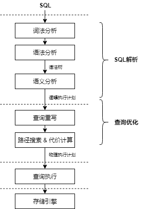
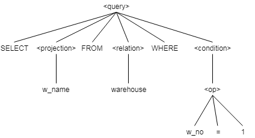
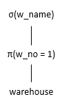
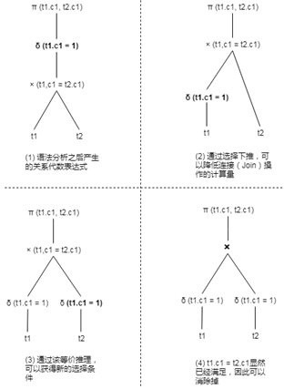

### 前言

    openGauss是高斯数据库系列产品之一，其开源版本已在今年6月30日推出。接下来将以技术连载的方式陆续向大家介绍openGauss数据库的各项核心技术，包括SQL引擎、优化器、存储引擎、事务处理、数据库安全等。本期开始介绍openGauss SQL引擎技术。

    数据库的SQL引擎是数据库重要的子系统之一，它对上负责承接应用程序发送过来的SQL语句，对下则负责指挥执行器运行执行计划。其中优化器作为SQL引擎中最重要、最复杂的模块，被称为数据库的“大脑”，优化器产生的执行计划的优劣直接决定数据库的性能。本文将从SQL语句进入数据库开始，对SQL引擎的各个模块进行全面的说明。

### 1 SQL 引擎概览

---

SQL 引擎是数据库系统重要组成部分，它的主要职责是负责将应用程序输入的 SQL 在当前负载场景下生成高效的执行计划，在 SQL 的高效执行上扮演重要角色。SQL 在 SQL 引擎里执行过程，如图 1 所示。

**图 1 SQL 执行流程**



从图 1 中可以看出，应用程序的 SQL 需要经过 SQL 解析生成逻辑执行计划、经过查询优化生成物理执行计划，然后将物理执行计划转交给查询执行引擎做物理算子的执行操作。

SQL 解析通常包含词法分析、语法分析、语义分析几个子模块。SQL 语言是介于关系演算和关系代数之间一种描述性语言，它吸取了关系代数中一部分逻辑算子的描述，而放弃了关系代数中“过程化”的部分，SQL 解析主要的作用就是将一个 SQL 语句编译成为一个由关系算子组成的逻辑执行计划。

描述语言的特点是规定了需要获取的“WHAT”，而不关心“HOW”，也就是只关注结果而不关注过程，因此 SQL 语言描述性的特点导致查询优化在数据库管理系统中具有非常重要的作用。

查询重写则是在逻辑执行计划的基础上进行等价的关系代数变换，这种优化也可以称为代数优化，虽然两个关系代数式获得的结果完全相同，但是它们的执行代价却可能有很大的差异，这就构成了查询重写优化的基础。

在早期的数据库管理系统中，通常采用基于启发式规则的方法来生成最优的物理执行计划，但是这种基于规则的优化的灵活度不够，常常导致产生一些次优的执行计划，而代价估算的引入，则从根本上解决了基于规则优化的不足。

基于代价的优化器一方面生成“候选”的物理执行路径，另一方面对这些执行路径计算它们的执行代价，这样就建立了执行路径的筛选标准，从而能够通过比较代价而获得最优的物理执行计划。

### 2 SQL 解析

SQL 语句在数据库管理系统中的编译过程符合编译器实现的常规过程，需要进行词法分析、语法分析和语义分析。

- 词法分析：从查询语句中识别出系统支持的关键字、标识符、操作符、终结符等，每个词确定自己固有的词性。
- 语法分析：根据 SQL 语言的标准定义语法规则，使用词法分析中产生的词去匹配语法规则，如果一个 SQL 语句能够匹配一个语法规则，则生成对应的抽象语法树（Abstract Syntax Tree，AST）。
- 语义分析：对语法树（AST）进行有效性检查，检查语法树中对应的表、列、函数、表达式是否有对应的元数据，将抽象语法树转换为逻辑执行计划（关系代数表达式）。

在 SQL 语言标准中，确定了 SQL 语言的关键字以及语法规则信息，SQL 解析器在做词法分析的过程中会将一个 SQL 语句根据关键字信息以及间隔信息划分为独立的原子单位，每个单位以一个词的方式展现，例如如下 SQL 语句：

```
SELECT w_name FROM warehouse WHERE w_no = 1;
```

可以划分的关键字、标识符、操作符、常量等原子单位，如表 1 所示。

**表 1 词法分析的特征**

<table border='1'><thead ><tr id="row60232767"><th class="cellrowborder"  width="37.37373737373738%" id="mcps1.1.3.1.1"><p id="p47015983"><a name="p47015983"></a><a name="p47015983"></a><strong id="b20490669"><a name="b20490669"></a><a name="b20490669"></a>词性</strong></p>
</th>
<th class="cellrowborder"  width="62.62626262626263%" id="mcps1.1.3.1.2"><p id="p49131481"><a name="p49131481"></a><a name="p49131481"></a><strong id="b39530145"><a name="b39530145"></a><a name="b39530145"></a>内容</strong></p>
</th>
</tr>
</thead>
<tbody><tr id="row47825138"><td class="cellrowborder"  width="37.37373737373738%" headers="mcps1.1.3.1.1 "><p id="p48630964"><a name="p48630964"></a><a name="p48630964"></a><strong id="b35025494"><a name="b35025494"></a><a name="b35025494"></a>关键字</strong></p>
</td>
<td class="cellrowborder"  width="62.62626262626263%" headers="mcps1.1.3.1.2 "><p id="p18492804"><a name="p18492804"></a><a name="p18492804"></a><strong id="b32217513"><a name="b32217513"></a><a name="b32217513"></a>SELECT、FROM、WHERE</strong></p>
</td>
</tr>
<tr id="row21522166"><td class="cellrowborder"  width="37.37373737373738%" headers="mcps1.1.3.1.1 "><p id="p65573909"><a name="p65573909"></a><a name="p65573909"></a><strong id="b53294272"><a name="b53294272"></a><a name="b53294272"></a>标识符</strong></p>
</td>
<td class="cellrowborder"  width="62.62626262626263%" headers="mcps1.1.3.1.2 "><p id="p21868813"><a name="p21868813"></a><a name="p21868813"></a><strong id="b62601592"><a name="b62601592"></a><a name="b62601592"></a>w_name、warehouse、w_no</strong></p>
</td>
</tr>
<tr id="row26543418"><td class="cellrowborder"  width="37.37373737373738%" headers="mcps1.1.3.1.1 "><p id="p2533231"><a name="p2533231"></a><a name="p2533231"></a><strong id="b22799085"><a name="b22799085"></a><a name="b22799085"></a>操作符</strong></p>
</td>
<td class="cellrowborder"  width="62.62626262626263%" headers="mcps1.1.3.1.2 "><p id="p34786562"><a name="p34786562"></a><a name="p34786562"></a><strong id="b44643603"><a name="b44643603"></a><a name="b44643603"></a>=</strong></p>
</td>
</tr>
<tr id="row66248115"><td class="cellrowborder"  width="37.37373737373738%" headers="mcps1.1.3.1.1 "><p id="p64497130"><a name="p64497130"></a><a name="p64497130"></a><strong id="b43603258"><a name="b43603258"></a><a name="b43603258"></a>常量</strong></p>
</td>
<td class="cellrowborder"  width="62.62626262626263%" headers="mcps1.1.3.1.2 "><p id="p42202994"><a name="p42202994"></a><a name="p42202994"></a><strong id="b44282627"><a name="b44282627"></a><a name="b44282627"></a>1</strong></p>
</td>
</tr>
</tbody>
</table>

语法分析会根据词法分析获得的词来匹配语法规则，最终生成一个抽象语法树（AST），每个词作为语法树的叶子结点出现，如图 2 所示。

**图 2 抽象语法树**



抽象语法树表达的语义还仅仅限制在能够保证应用的 SQL 语句符合 SQL 标准的规范，但是对于 SQL 语句的内在含义还需要做有效性的检查。

- 检查关系的使用：FROM 子句中出现的关系必须是该查询对应模式中的关系或视图。
- 检查与解析属性的使用：在 SELECT 句中或者 WHERE 子句中出现的各个属性必须是 FROM 子句中某个关系或视图的属性。
- 检查数据类型：所有属性的数据类型必须是匹配的。

在有效性检查的同时，语义分析的过程还是有效性语义绑定（Bind）的过程，通过语义分析的检查，抽象语法树就转换成一个逻辑执行计划，逻辑执行计划可以通过关系代数表达式的形式来表现，如图 3 所示。

**图 3 关系代数表达式**



### 3 查询优化

SQL 语句在编写的过程中，数据库应用开发人员通常会考虑以不同的形式来编写 SQL，来达到提升执行性能的目的，那么为什么还需要查询优化器来对 SQL 进行优化呢？这是因为一个应用程序可能会涉及到大量的 SQL 语句，而且有些 SQL 语句的逻辑极为复杂，数据库开发人员很难面面俱到的写出高性能语句，而查询优化器则具有一些独特的优势：

- 查询优化器和数据库应用程序开发人员之间的信息不对称，查询优化器在优化的过程中会参考数据库统计模块自动产生的统计信息，这些统计信息从各个角度来描述数据的分布情况，查询优化器会综合考虑统计信息中的各种数据，从而能够得到一个比较好的执行方案，而数据库用户一方面无法全面的了解数据的分布情况，另一方面也很难通过统计信息构建一个精确的代价模型来对执行计划进行筛选。

- 查询优化器和数据库应用程序开发人员之间的时效性不同，数据库中的数据瞬息万变，一个在 A 时间点执行性能很高的执行计划，在 B 时间点由于数据内容发生了变化，它的性能可能就很低，查询优化器则随时都能根据数据的变化调整执行计划，而数据库应用程序开发人员则只能手动的调整 SQL 语句，和查询优化器相比，它的时效性比较低。

- 查询优化器和数据库应用程序开发人员的计算能力不同，目前计算机的计算能力已经大幅提高，在执行数值计算方面和人脑相比具有巨大的优势，查询优化器对一个 SQL 语句进行优化时，可以从成百上千个执行方案中选择一个最优方案，而人脑要计算这几百种方案需要的时间要远远长于计算机。

因此，查询优化器是提升查询效率的非常重要的一个手段，虽然一些数据库也提供了人工干预执行计划生成的方法，但是通常而言，查询优化器的优化过程对数据库开发人员是透明的，它自动进行逻辑上的等价变换、自动进行物理执行计划的筛选，极大的提高了数据库应用程序开发人员的“生产力”。

依据优化方法的不同，优化器的优化技术可以分为：

- 基于规则的查询优化（Rule Based Optimization，RBO）：根据预定义的启发式规则对 SQL 语句进行优化。

- 基于代价的查询优化（Cost Based Optimization，CBO）：对 SQL 语句对应的待选执行路径进行代价估算，从待选路径中选择代价最低的执行路径作为最终的执行计划。

- 基于机器学习的查询优化（AI Based Optimization，ABO）：收集执行计划的特征信息，借助机器学习模型获得经验信息，进而对执行计划进行调优，获得最优的执行计划。

在早期的数据库中，查询优化器通常采用启发式规则进行优化，这种优化方式不不够灵活，往往难以获得最优的执行代价，而基于代价的优化则能够针对大多数场景都高效筛选出性能较好的执行计划，但面对用户千人千面，日趋复杂的实际查询场景，普适性的查询优化由于难以捕捉到用户特定的查询需求、数据分布、硬件性能等特征，难以全方位满足实际的优化需求。

近年来 AI 技术，特别是在深度学习领域，发展迅速，基于机器学习的优化器在建模效率、估算准确率和自适应性等方面都有很大优势，有望打破 RBO 和 CBO 基于静态模型的限制，通过对历史经验的不断学习，将目标场景的模式进行抽象化，形成动态的模型，自适应地针对用户的实际场景进行优化。openGauss 采用基于 CBO 的优化技术，另外在 ABO 方面也在进行积极探索。

#### **3.1 查询重写**

查询重写利用已有语句特征和关系代数运算来生成更高效的等价语句，在数据库优化器中扮演关键角色，尤其在复杂查询中，能够在性能上带来数量级的提升，可谓是“立竿见影”的“黑科技”。本节介绍查询重写的基本概念、常见的查询重写技术、查询重写面临的挑战。

##### 查询重写的概念

SQL 语言是丰富多样的，非常的灵活，不同的开发人员依据经验的不同，手写的 SQL 语句也是各式各样，另外还可以通过工具自动生成。SQL 语言是一种描述性语言，数据库的使用者只是描述了想要的结果，而不关心数据的具体获取方式，输入数据库的 SQL 语言很难做到是以最优形式表示的，往往隐含了一些冗余信息，这些信息可以被挖掘用来生成更加高效的 SQL 语句。查询重写就是把用户输入的 SQL 语句转换为更高效的等价 SQL，查询重写遵循两个基本原则：

- 等价性：原语句和重写后的语句，输出结果相同。

- 高效性：重写后的语句，比原语句在执行时间和资源使用上更高效。

##### 关系代数等价变换

查询重写主要是基于关系代数式的等价变换，关系代数的变换通常满足交换律、结合律、分配率、串接率等，如表 2 所示。

**表 2 关系代数等价变换**

<a name="table13886291122"></a>

<table border='1'><tbody><tr id="row192243291224"><td class="cellrowborder"  width="34%"><p id="p142241294218"><a name="p142241294218"></a><a name="p142241294218"></a>等价变换</p>
</td>
<td class="cellrowborder"  width="82.89999999999999%"><p id="p82248294216"><a name="p82248294216"></a><a name="p82248294216"></a>内容</p>
</td>
</tr>
<tr id="row182245291421"><td class="cellrowborder"  width="17.1%"><p id="p1222416296215"><a name="p1222416296215"></a><a name="p1222416296215"></a>交换律</p>
</td>
<td class="cellrowborder"  width="82.89999999999999%"><p id="p62247298218"><a name="p62247298218"></a><a name="p62247298218"></a>A × B == B × A</p>
<p id="p1224142917211"><a name="p1224142917211"></a><a name="p1224142917211"></a>A ⨝B == B ⨝ A</p>
<p id="p122414292211"><a name="p122414292211"></a><a name="p122414292211"></a>A ⨝F B == B ⨝F A &nbsp &nbsp &nbsp		   -- F是连接条件</p>
<p id="p622418299218"><a name="p622418299218"></a><a name="p622418299218"></a>Π p(σF (B)) == σF (Π p(B))   &nbsp &nbsp &nbsp   –- F∈p</p>
</td>
</tr>
<tr id="row822402912213"><td class="cellrowborder"  width="17.1%"><p id="p222414291224"><a name="p222414291224"></a><a name="p222414291224"></a>结合律</p>
</td>
<td class="cellrowborder"  width="82.89999999999999%"><p id="p1224529524"><a name="p1224529524"></a><a name="p1224529524"></a>(A × B) × C==A × (B × C)</p>
<p id="p82247293212"><a name="p82247293212"></a><a name="p82247293212"></a>(A ⨝ B) ⨝ C==A ⨝ (B ⨝ C)</p>
<p id="p112241229829"><a name="p112241229829"></a><a name="p112241229829"></a>(A ⨝F1 B) ⨝F2 C==A ⨝F1 (B ⨝F2 C)  &nbsp &nbsp &nbsp  -- F1和F2是连接条件</p>
</td>
</tr>
<tr id="row16224192912218"><td class="cellrowborder"  width="17.1%"><p id="p222419298219"><a name="p222419298219"></a><a name="p222419298219"></a>分配律</p>
</td>
<td class="cellrowborder"  width="82.89999999999999%"><p id="p4224629128"><a name="p4224629128"></a><a name="p4224629128"></a>σF(A × B) == σF(A) × B -- F ∈ A</p>
<p id="p9224129328"><a name="p9224129328"></a><a name="p9224129328"></a>σF(A × B) == σF1(A) × σF2(B) &nbsp &nbsp &nbsp		-- F = F1 ∪ F2，F1∈A, F2 ∈B</p>
<p id="p2022482911211"><a name="p2022482911211"></a><a name="p2022482911211"></a>σF(A × B) == σFX (σF1(A) × σF2(B)) &nbsp &nbsp &nbsp -- F = F1∪F2∪FX，F1∈A, F2 ∈B</p>
<p id="p1322462918217"><a name="p1322462918217"></a><a name="p1322462918217"></a>Π p,q(A × B) == Π p(A) × Π q(B) &nbsp &nbsp &nbsp -- p∈A，q∈B</p>
<p id="p622420297218"><a name="p622420297218"></a><a name="p622420297218"></a>σF(A × B) == σF1(A) × σF2(B)  &nbsp &nbsp &nbsp -- F = F1 ∪ F2，F1∈A, F2 ∈B</p>
    <p id="p5224122911216"><a name="p5224122911216"></a><a name="p5224122911216"></a>σF(A × B) == σFx (σF1(A) × σF2(B)) &nbsp &nbsp &nbsp -- 其中F = F1∪F2∪Fx，F1∈A, F2 ∈B</p>
</td>
</tr>
<tr id="row72249295212"><td class="cellrowborder"  width="17.1%"><p id="p1522462920218"><a name="p1522462920218"></a><a name="p1522462920218"></a>串接律</p>
</td>
<td class="cellrowborder"  width="82.89999999999999%"><p id="p10225429429"><a name="p10225429429"></a><a name="p10225429429"></a>Π P=p1,p2,…pn(Π Q=q1,q2,…qn(A)) == Π P=p1,p2,…pn(A) -- P ⊆ Q</p>
<p id="p522518297211"><a name="p522518297211"></a><a name="p522518297211"></a>σF1(σF2(A)) == σF1∧F2(A)</p>
</td>
</tr>
</tbody>
</table>

表 2 中的等价变换规则并不能把所有的情况都列举出来，例如，如果对`σF1(σF2(A)) == σF1∧F2(A)`继续推导，那么就可以获得：

```
σF1(σF2(A)) == σF1∧F2(A) == σF2∧F1(A) == σF2(σF1(A))
```

因此，在熟悉了关系代数的操作之后，就可以灵活的利用关系代数的等价关系进行推导，获得更多的等价式。这些等价的变换一方面可以用来根据启发式的规则做优化，这样能保证等价转换之后的关系代数表达式的执行效率能够获得提高而非降低，例如借助分配率可以将一个选择操作下推，这样能降低上层结点的计算量，另一方面还可以用来生成候选的执行计划，候选的执行计划再由优化器根据估算的代价进行筛选。

##### 常见的查询重写技术

介绍下 openGauss 几个关键的查询重写技术：常量表达式化简、子查询优化、选择下推和等价推理等。

1. 常量表达式化简

常量表达式即用户输入 SQL 语句中包含运算结果为常量的表达式，分为算数表达式、逻辑运算表达式、函数表达式，查询重写可以对常量表达式预先计算以提升效率。例如：

**示例 1**：该语句为典型的算数表达式查询重写，经过重写之后，避免了在执行时每条数据都需要进行 1+1 运算。

```
SELECT * FROM t1 WHERE c1 = 1+1;
SELECT * FROM t1 WHERE c1 = 2;
```

**示例 2**：该语句为典型的逻辑运算表达式，经过重写之后，条件永远为 false，可以直接返回 0 行结果，避免了整个语句的实际执行。

```
SELECT * FROM t1 WHERE  1=0  AND a=1;
SELECT * FROM t1 WHERE  false;
```

**示例 3**：该语句包含函数表达式，由于函数的入参为常量，经过重写之后，直接把函数运算结果在优化阶段计算出来，避免了在执行过程中逐条数据的函数调用开销。

```
SELECT * FROM t1 WHERE c1 =  ADD(1,1);
SELECT * FROM t1 WHERE c1 =  2;
```

2. 子查询优化

由于子查询表示的结构更清晰，符合人的阅读理解习惯，用户输入的 SQL 语句往往包含了大量的子查询。子查询有几种分类方法，根据子查询是否可以独立求解，分为相关子查询和非相关子查询。

- 相关子查询：相关子查询是指子查询中有依赖父查询的条件，例如：

  ```
  SELECT * FROM t1 WHERE EXISTS (SELECT t2.c1 FROM t2 WHERE t1.c1=t2.c1);
  ```

​ 语句中子查询依赖父查询传入 t1.c1 的值。

- 非相关子查询：非相关子查询是指子查询不依赖父查询，可以独立求解，例如：

  ```
  SELECT * FROM t1 WHERE EXISTS (SELECT t2.c1 FROM t2);
  ```

  语句中子查询没有依赖父查询的条件。

​ 其中，相关子查询需要父查询执行出一条结果，然后驱动子查询运算，这种嵌套循环的方式执行效率较低。如果能把子查询提升为父查询同级别，那么可以子查询中的表就能和父查询中的表直接做 Join 操作，由于 Join 操作可以有多种实现方法，优化器就可以从多种实现方法中选择最优的一种，就有可能提高查询的执行效率，另外优化器还能够应用 Join Reorder 优化规则对不同的表的连接顺序进行交换，进而有可能产生更好的执行计划。

**示例 4**：该语句为典型的子查询提升重写，重写之后利用 Hash Join 可以提升查询性能。

```
SELECT * FROM t1 WHERE t1.c1 IN (SELECT t2.c1 FROM t2);
SELECT * FROM t1 Semi Join t2 ON t1.c1 = t2.c1;
```

3. 选择的下推和等价推理

选择的下推能够极大的降低上层算子的计算量，从而达到优化的效果，如果选择条件有存在等值操作，那么还可以借助等值操作的特性来实现等价推理，从而获得新的选择条件。

例如，假设有两个表 t1、t2 分别包含\[1,2,3,..100\]共 100 行数据，那么查询语句

```
SELECT t1.c1, t2.c1 FROM t1 JOIN t2 ON t1.c1=t2.c1 WHERE t1.c1=1;
```

则可以通过选择下推和等价推理进行优化，如图 4。

**图 4 查询重写前后对比图**



如图 4-（1）所示，t1、t2 表都需要全表扫描 100 行数据，然后再做 Join，生成 100 行数据的中间结果，最后再做选择操作，最终结果只有 1 行数据。如果利用等价推理，我们可以得到`{t1.c1, t2.c1, 1}`的是互相等价的，从而推导出新的`t2.c1=1`的选择条件，并把这个条件下推到 t2 上，从而得到图 4-（4）重写之后的逻辑计划。可以看到，重写之后的逻辑计划，只需要从基表上面获取 1 条数据即可，Join 时内、外表的数据也只有 1 条，同时省去了在最终结果上的过滤条件，性能大幅提升。

4. 外连接消除

外连接和内连接的主要区别是对于不能产生连接结果的元组需要补 NULL 值，如果 SQL 语句中有过滤条件符合空值拒绝的条件（即会将补充的 NULL 值再过滤掉），则可以直接消除外连接。

**示例 5**：外连接转成内连接之后，便于优化器应用更多的优化规则，提高执行效率。

```
SELECT * FROM t1  FULL JOIN t2 ON t1.c1 = t2.c1 WHERE t1.c2 > 5 AND t2.c3 < 10;
SELECT * FROM t1  INNER JOIN  t2 ON t1.c1 = t2.c2 WHERE t1.c2 > 5 AND t2.c3 < 10;
```

5. DISTINCT 消除

DISTINCT 列上如果有主键约束，则此列不可能为空，且无重复值，因此不需要 DISTINCT 操作，减少计算量。

**示例 6**：c1 列上有的主键属性决定了无需做 DISTINCT 操作。语句如下：

```
CREATE TABLE t1(c1 INT PRIMARY KEY, c2 INT);
SELECT  DISTINCT(c1) FROM t1;
SELECT c1 FROM t1;
```

6. IN 谓词展开

**示例 7**：将 IN 操作符改写成等值的过滤条件，便于借助索引减少计算量。语句如下：

```
SELECT * FROM t1 WHERE  c1 IN (10,20,30);
SELECT * FROM t1 WHERE  c1=10 or c1=20 OR c1=30;
```

7. 视图展开

视图从逻辑上可以简化书写 SQL 的难度，提高查询的易用性，而视图本身是虚拟的，因此在查询重写的过程中，需要对视图展开。

**示例 8**：可以将视图查询重写成子查询的形式，然后再对子查询做简化。语句如下：

```
CREATE VIEW v1 AS (SELECT * FROM t1,t2 WHERE t1.c1=t2.c2);
SELECT * FROM v1;
SELECT * FROM (SELECT * FROM t1,t2 WHERE t1.c1=t2.c2) as v1;
SELECT * FROM t1,t2 WHERE t1.c1=t2.c2;
```
