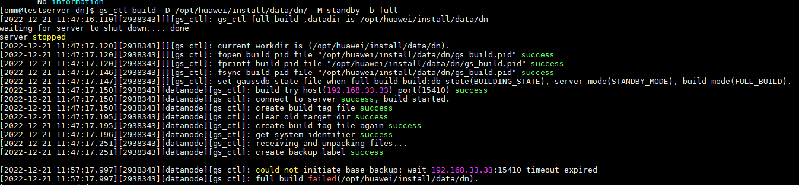
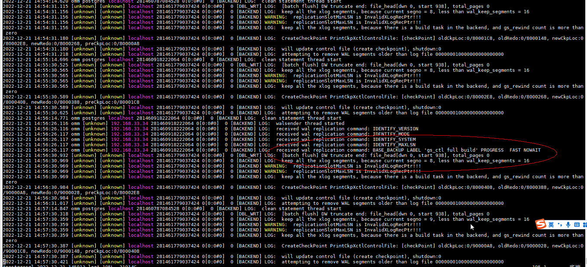
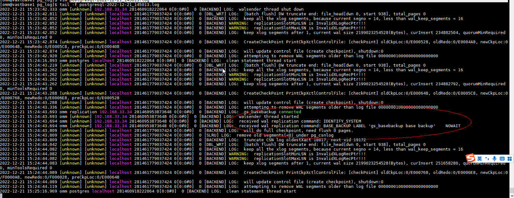

# build 卡在 create backup label success 问题

## 一、问题描述

某局点 POC 测试时，备库 build 时，卡在 reate backup label success，不继续推进，一段时间后超时报错。



数据库日志如下：



## 二，使用 gs_basebackup 工具在备库做备份，同样遇到卡住问题

```
gs_basebackup -D /opt/huawei/install/data/backup -p 15400 -h 192.168.33.33
INFO:  The starting position of the xlog copy of the full build is: 0/19000028. The slot minimum LSN is: 0/0.
[2022-12-21 16:57:39]:gs_basebackup: could not initiate base backup: wait 192.168.33.33:15401 timeout expired
[omm@testserver backup]$ gs_basebackup -D /opt/huawei/install/data/backup -p 15400 -h 192.168.33.33
INFO:  The starting position of the xlog copy of the full build is: 0/1A000028. The slot minimum LSN is: 0/0.
```

日志如下



查看堆栈信息，发现主库已接受到消息，在响应时卡住了。

## 三、排查主备网络问题

由于主备节点 ping 是正常的，也能通过 ssh 互联访问，网络确定正常。考虑到做备份或者 build，都是从主库复制文件到备库，直接执行 scp 复制文件，看是否 OK。

```
[root@vastbase1 package]# scp openGauss-Package-bak_02c14696.tar.gz testserver:/home/omm1/

Authorized users only. All activities may be monitored and reported.
openGauss-Package-bak_02c14696.tar.gz                                                                                            0%    0     0.0KB/s   --:-- ETA
[root@vastbase1 package]# scp openGauss-3.0.0-openEuler-64bit.sha256 testserver:/home/omm1/
Authorized users only. All activities may be monitored and reported.
openGauss-3.0.0-openEuler-64bit.sha256                                                                                         100%   65     1.7KB/s   00:00
[root@vastbase1 package]#
[root@vastbase1 package]#
[root@vastbase1 package]#
[root@vastbase1 package]# scp upgrade_sql.tar.gz testserver:/home/omm1/
Authorized users only. All activities may be monitored and reported.
upgrade_sql.tar.gz
```

发现复制小文件时正常，复制大文件时，直接卡在不动。到这一步基本定位到问题，网络配置有问题。

## 四、处理网络配置

查看网卡配置，发现 mtu 值配置了 4200，超过了交换机的配置，会导致大文件无法传输

```
15: enp135s0f1.33@enp135s0f1: <BROADCAST,MULTICAST,UP,LOWER_UP> mtu 4200 qdisc noqueue state UP group default qlen 1000
    link/ether 0c:42:a1:c6:29:89 brd ff:ff:ff:ff:ff:ff
    inet 192.168.33.34/24 brd 192.168.33.255 scope global noprefixroute enp135s0f1.33
       valid_lft forever preferred_lft forever
    inet6 fe80::e42:a1ff:fec6:2989/64 scope link
       valid_lft forever preferred_lft forever

```

修复配置，修复 MTU 值，在 ifdown,ifup 网卡。

```
vim /etc/sysconfig/network-scripts/ifcfg-enp135s0f1.33
BOOTPROTO=static
IPV4_FAILURE_FATAL=no
NAME=enp135s0f1.33
DEVICE=enp135s0f1.33
ONBOOT=yes
MTU=1500
VLAN=yes
IPADDR=192.168.33.33
NETMASK=255.255.255.0
VLAN_EGRESS_PRIORITY_MAP=0:3,1:3,2:3,3:3,4:3,5:3,6:3,7:3

```

网卡配置修复后，scp 大文件不在卡住，build 与备份都能正常了。
