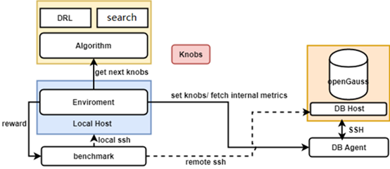

# MogDB AI 特性系列 1_X-Tuner

## 一、概述

X-Tuner 是一款数据库集成的参数调优工具，通过结合深度强化学习和全局搜索算法等 AI 技术，实现在无需人工干预的情况下，获取最佳数据库参数配置。本功能不强制与数据库环境部署到一起，**支持独立部署**，脱离数据库安装环境独立运行。

## 二、使用准备

**前提条件与使用事项**

- 数据库状态正常、客户端能够正常连接、且要求数据库内导入数据，以便调优程序可以执行 benchmark 测试调优效果。
- 使用本工具需要指定登录到数据库的用户身份，要求该登录到数据库上的用户具有足够的权限，以便可以获得充足的数据库状态信息。
- 使用登录到数据库宿主机上的 Linux 用户，需要将$GAUSSHOME/bin 添加到 PATH 环境变量中，即能够直接运行 gsql、gs_guc、gs_ctl 等数据库运维工具。
- Python 版本建议为 Python3.6 及以上，且运行环境中已经安装相应依赖，并能够正常启动调优程序。您可以独立安装一个 python3.6+的环境，无需设置到全局环境变量中。不建议使用 root 用户权限安装本工具，如果以 root 身份安装本完毕工具，使用其他用户身份运行本工具时，需要确保配置文件有读取权限。
- 本工具支持以三种模式运行，其中 tune 和 train 模式要求用户配置好 benchmark 运行环境，并导入数据，本工具将会通过迭代运行 benchmark 来判断修改后的参数是否有性能提升。
- recommend 模式建议在数据库正在执行 workload 的过程中执行，以便获得更准确的实时 workload 信息。
- 本工具默认带有 TPC-C、TPC-H、TPC-DS 以及 sysbench 的 benchmark 运行脚本样例，如果用户使用上述 benchmark 对数据库系统进行压力测试，则可以对上述配置文件进行适度修改或配置。如果需要适配用户自己的业务场景，需要您参照 benchmark 目录中的 template.py 文件编写驱动您自定义 benchmark 的脚本文件。

## 三、原理简介

调优程序是一个独立于数据库内核之外的工具，需要提供数据库及其所在实例的用户名和登录密码信息，以便控制数据库执行 benchmark 进行性能测试；在启动调优程序前，要求用户测试环境交互正常，能够正常跑通 benchmark 测试脚本、能够正常连接数据库。

**X-Tuner 运行模式**

- recommend: 通过用户指定的用户名等信息登录到数据库环境中，获取当前正在运行的 workload 特征信息，根据上述特征信息生成参数推荐报告。报告当前数据库中不合理的参数配置和潜在风险等；输出根据当前正在运行的 workload 行为和特征；输出推荐的参数配置。 该模式是秒级的，不涉及数据库的重启操作，其他模式可能需要反复重启数据库。
- train: 通过用户提供的 benchmark 信息，不断地进行参数修改和 benchmark 的执行。通过反复的迭代过程，训练强化学习模型，以便用户在后面通过 tune 模式加载该模型进行调优。
- tune: 使用优化算法进行数据库参数的调优，当前支持两大类算法，一种是深度强化学习，另一种是全局搜索算法（全局优化算法）。深度强化学习模式要求先运行 train 模式，生成训练后的调优模型，而使用全局搜索算法则不需要提前进行训练，可以直接进行搜索调优。

**X-Tuner 架构图**


- DB 侧：通过 DB_Agent 模块对数据库实例进行抽象，通过该模块可以获取数据库内部的状态信息、当前数据库参数、以及设置数据库参数等。DB 侧包括登录数据库环境使用的 SSH 连接。
- 算法侧：用于调优的算法包，包括全局搜索算法（如贝叶斯优化、粒子群算法等）和深度强化学习（如 DDPG）；
- X-Tuner 主体逻辑模块：通过 Enviroment 模块进行封装，每一个 step 就是一次调优过程。整个调优过程通过多个 step 进行迭代；
- benchmark: 由用户指定的 benchmark 性能测试脚本，用于运行 benchmark 作业，通过跑分结果反映数据库系统性能优劣。

## 四、X-Tuner 安装

### 1. 程序位置

- 源码位置

```
[root@ecs-saving-0008 xtuner]# pwd /root/openGauss-server/src/gausskernel/dbmind/tools/xtuner
```

- 已安装过的数据库

```
[omm@ecs-saving-0001 ~]$ cd $GAUSSHOME/bin/dbmind/xtuner [omm@ecs-saving-0001 xtuner]$ pwd /opengauss/app/1.0.1/bin/dbmind/xtuner
```

### 2. 安装依赖

```
[root@ecs-saving-0008 xtuner]# ls
build  dist  openGauss_xtuner.egg-info  Readme.md  requirements.txt  setup.py  share  test  tuner
[root@ecs-saving-0008 xtuner]# pip3 install --upgrade pip
[root@ecs-saving-0008 xtuner]# pip3 install -r requirements.txt
[root@ecs-saving-0008 xtuner]# cat requirements.txt
tensorflow>=2.2.0
keras-rl2
paramiko
bayesian-optimization
ptable
[root@ecs-saving-0008 xtuner]# pip3 install keras
```

默认网站较慢建议学会科学上网，手动解决依赖。
[Python Package Index](https://pypi.org/)

### 3. 安装 X-Tuner

```
[root@ecs-saving-0008 xtuner]# pwd
/root/openGauss-server/src/gausskernel/dbmind/tools/xtuner
[root@ecs-saving-0008 xtuner]# python3 setup.py install
[root@ecs-saving-0008 xtuner]# gs_xtuner --help
usage: gs_xtuner [-h] [--db-name DB_NAME] [--db-user DB_USER] [--port PORT]
                 [--host HOST] [--host-user HOST_USER]
                 [--host-ssh-port HOST_SSH_PORT] [-f DB_CONFIG_FILE]
                 [-x TUNER_CONFIG_FILE] [-v]
                 {train,tune,recommend}

X-Tuner: a self-tuning tool integrated by openGauss.

positional arguments:
  {train,tune,recommend}
                        Train a reinforcement learning model or tune database
                        by model. And also can recommend best_knobs according
                        to your workload.

optional arguments:
  -h, --help            show this help message and exit
  -f DB_CONFIG_FILE, --db-config-file DB_CONFIG_FILE
                        You can pass a path of configuration file otherwise
                        you should enter database information by command
                        arguments manually. Please see the template file
                        share/server.json.template.
  -x TUNER_CONFIG_FILE, --tuner-config-file TUNER_CONFIG_FILE
                        This is the path of the core configuration file of the
                        X-Tuner. You can specify the path of the new
                        configuration file. The default path is
                        /usr/local/lib/python3.6/site-packages/openGauss_xtune
                        r-2.0.0-py3.6.egg/tuner/xtuner.conf. You can modify
                        the configuration file to control the tuning process.
  -v, --version         show program's version number and exit

Database Connection Information:
  --db-name DB_NAME     The name of database where your workload running on.
  --db-user DB_USER     Use this user to login your database. Note that the
                        user must have sufficient permissions.
  --port PORT           Use this port to connect with the database.
  --host HOST           The IP address of your database installation host.
  --host-user HOST_USER
                        The login user of your database installation host.
  --host-ssh-port HOST_SSH_PORT
                        The SSH port of your database installation host.
```

## 五、文件解读

```
[root@ecs-saving-0008 tools]# pwd
/root/openGauss-server/src/gausskernel/dbmind/tools
[root@ecs-saving-0008 tools]# ls
anomaly_detection  index_advisor  predictor  sqldiag  xtuner
```

**分别为五个 AI 功能，后续文章会逐一介绍。**

- Anomaly-detection：数据库指标采集、预测与异常监控
- Index-advisor：索引推荐
- Predictor: AI 查询时间预测
- SQLdiag: 慢 SQL 发现
- X-Tuner: 参数调优与诊断

```
[root@ecs-saving-0008 benchmark]# pwd /root/openGauss-server/src/gausskernel/dbmind/tools/xtuner/tuner/benchmark __init__.py  Readme.md  sysbench.py  template.py  tpcc.py  tpcds.py  tpch.py
```

**需提前调试好相关程序并生成测试数据**

- benchmark 模拟压力模型，支持 sysbench.py template.py tpcc.py tpcds.py tpch.py
- 在使用 tune 和 train 模式前，用户需要先导入 benchmark 所需数据并检查 benchmark 能否正常跑通，并备份好此时的数据库参数，查询当前数据库参数的方法为：select name, setting from pg_settings;
- 目前 tpcc 测试程序相关代码有问题，暂时手动模拟压力解决。

**配置文件解读**

```
[root@ecs-saving-0008 tuner]# cat xtuner.conf |grep -v ^$|grep -v ^#
[Master]
logfile = log/opengauss_tuner.log
output_tuning_result = tuned_knobs.json
verbose = on
recorder_file = log/recorder.log
tune_strategy = auto  # rl, gop or auto
drop_cache = on  # You must modify the permission of the login user in the /etc/sudoers file and grant the NOPASSWD permission to the user.
used_mem_penalty_term = 1e-9  # Prevent taking up more memory.
[Reinforcement Learning]
rl_algorithm = ddpg  # ddpg, dqn. Not support dqn yet.
rl_model_path = model/rl.model
rl_steps = 100
max_episode_steps = 10
test_episode = 1
[Gloabal Optimization Algorithm]
gop_algorithm = bayes  # bayes, pso
max_iterations = 100
particle_nums = 3  # A larger value indicates higher accuracy but slower speed.
[Benchmark]
benchmark_script = tpcc
benchmark_path = '/opt/benchmarksql-5.0/run'  # If this parameter is blank, the default path in the benchmark script is used.
benchmark_cmd = "./runBenchmark.sh props.og"  # If this parameter is blank, the default cmd in the benchmark script is used.
[Knobs]
scenario = auto  # ap, tp, htap or auto
tuning_list =  # template: share/knobs.json.template
```

- rl_algorithm：用于训练强化学习模型的算法，当前支持设置为 ddpg.
- rl_model_path: 训练后生成的强化学习模型保存路径。
- rl_steps：训练过程的最大迭代步数。
- max_episode_steps：每个回合的最大步数。
- scenario: 明确指定的 workload 类型，如果为 auto 则为自动判断。在不同模式下，推荐的调优参数列表也不一样。
- tuning_list: 用户指定需要调哪些参数，如果不指定，则根据 workload 类型自动推荐应该调的参数列表。
- tune_strategy: 指定选择哪种算法进行调优，支持 rl（使用强化学习模型进行调优）、gop （使用全局搜索算法）以及 aut- （自动选择）。若该参数设置为 rl，则 rl 相关的配置项生效。除前文提到过的 train 模式下生效的配置项外，test_episode 配置项- 生效，该配置项表明调优过程的最大回合数，该参数直接影响了调优过程的执行时间（一般地，数值越大越耗时）。
- gop_algorithm: 选择何种全局搜索算法，支持 bayes 以及 pso.
- max_iterations: 最大迭代轮次，数值越高搜索时间越长，效果往往越好。
- particle_nums: 在 PSO 算法上生效，表示粒子数。
- scenario 与 tuning_list 见上文 train 模式中的描述。
- drop_cache = on 需修改/etc/sudoers 文件 添加如下 username ALL=(ALL) NOPASSWD: ALL

## 六、使用示例

X-Tuner 支持三种模式，分别是获取参数诊断报告的 recommend 模式、训练强化学习模型的 train 模式、以及使用算法进行调优的 tune 模式。上述三种模式可以通过命令行参数来区别，通过配置文件来指定具体的细节。

### 1. 配置数据库连接信息

有两种方式

- a. 通过命令行执行

```
 [root@ecs-saving-0008 xtuner]# gs_xtuner recommend --db-name test1 --db-user test1 --port 26000 --host 192.168.1.XXX --host-user omm -x xtuner.conf
```

- b. json 配置文件

```
[root@ecs-saving-0008 tuner]# cat connection.json  {  "db_name": "test1",  "db_user": "test1",  "host": "192.168.1.xxx",  "host_user": "omm",  "port": 26000,  "ssh_port": 22 } [root@ecs-saving-0008 xtuner]# gs_xtuner recommend -f connection.json -x xtuner.conf
```

### 2. recommend 模式

```

[root@ecs-saving-0008 tuner]# gs_xtuner recommend --db-name test1 --db-user test1 --port 26000 --host 192.168.1.xxx --host-user omm
Please input the password of database:
Please input the password of host:
Start to recommend knobs. Just a moment, please.
******************************************************* Knob Recommendation Report *******************************************************
INFO:
+---------------------------------------+-----------------------+
|                 Metric                |         Value         |
+---------------------------------------+-----------------------+
|             workload_type             |           tp          |
|         dirty_background_bytes        |           0           |
|             temp_file_size            |           0           |
|          current_locks_count          |          0.0          |
|      current_prepared_xacts_count     |          0.0          |
|         average_connection_age        |        0.013457       |
| checkpoint_proactive_triggering_ratio |   0.0413987138263666  |
|         rollback_commit_ratio         |  0.07913229312035018  |
|         fetched_returned_ratio        |   0.3706085439318767  |
|             cache_hit_rate            |   0.9780311156824839  |
|          current_connections          |          1.0          |
|                 uptime                |    1.48835260083333   |
|          search_modify_ratio          |   119.88027537957866  |
|           all_database_size           |    1436801.01171875   |
|            current_free_mem           |        15400044       |
|              os_mem_total             |        16430884       |
|        checkpoint_avg_sync_time       |    2.03215434083601   |
|            read_write_ratio           |   2.1202316810075224  |
|                ap_index               |   2.1987815358313485  |
|             max_processes             |          3010         |
|          track_activity_size          |         3010.0        |
|                used_mem               |      3155124224.0     |
|            write_tup_speed            |    374.211175655672   |
|              os_cpu_count             |           4           |
|  checkpoint_dirty_writing_time_window |         720.0         |
|             read_tup_speed            |    793.422421264566   |
|               block_size              |          8.0          |
|      shared_buffer_toast_hit_rate     |    91.9572192513369   |
|      shared_buffer_heap_hit_rate      |    99.5745962509106   |
|       shared_buffer_idx_hit_rate      |   99.67849101944427   |
|      shared_buffer_tidx_hit_rate      |   99.78536585365853   |
|                 is_hdd                |         False         |
|           enable_autovacuum           |          True         |
|                is_64bit               |          True         |
|              load_average             | [0.26, 0.5375, 0.525] |
+---------------------------------------+-----------------------+
p.s: The unit of storage is kB.
WARN:
[0]. The total size of all databases is less than the memory size. Therefore, it is unnecessary to set shared_buffers to a large value.
[1]. The database runs for a short period of time, and the database description may not be accumulated. The recommendation result may be inaccurate.
[2]. The number of CPU cores is a little small. Please do not run too high concurrency. You are recommended to set max_connections based on the number of CPU cores. If your job does not consume much CPU, you can also increase it.
BAD:
[0]. The value of wal_buffers is too high. Generally, a large value does not bring better performance.
******************************************************** Recommended Knob Settings ********************************************************
+---------------------------+-----------+--------+----------+---------+
|            name           | recommend |  min   |   max    | restart |
+---------------------------+-----------+--------+----------+---------+
|       shared_buffers      |   179600  | 179600 |  206540  |   True  |
|      max_connections      |    100    |   20   |   500    |   True  |
|    effective_cache_size   |   179600  | 179600 | 12323163 |  False  |
|  effective_io_concurrency |    200    |  150   |   250    |  False  |
|        wal_buffers        |    5612   |  2048  |   5612   |   True  |
|      random_page_cost     |    1.0    |  1.0   |   2.0    |  False  |
| default_statistics_target |    100    |   10   |   150    |  False  |
+---------------------------+-----------+--------+----------+---------+


```

在上述报告中，推荐了该环境上的数据库参数配置，并进行了风险提示。报告同时生成了当前 workload 的特征信息，其中有几个特征是比较有参考意义的：

- temp_file_size：产生的临时文件数量，如果该结果大于 0，则表明系统使用了临时文件。使用过多的临时文件会导致性能不佳，如果可能的话，需要提高 work_mem 参数的配置。
- cache_hit_rate：shared_buffer 的缓存命中率，表明当前 workload 使用缓存的效率。
- read_write_ratio：数据库作业的读写比例。
- search_modify_ratio：数据库作业的查询与修改数据的比例。
- ap_index：表明当前 workload 的 AP 指数，取值范围是 0 到 10，该数值越大，表明越偏向于数据分析与检索。
- workload_type：根据数据库统计信息，推测当前负载类型，分为 AP、TP 以及 HTAP 三种类型。
- checkpoint_avg_sync_time：数据库在 checkpoint 时，平均每次同步刷新数据到磁盘的时长，单位是毫秒。
- load_average：平均每个 CPU 核心在 1 分钟、5 分钟以及 15 分钟内的负载。一般地，该数值在 1 左右表明当前硬件比较匹配 workload、在 3 左右表明运行当前作业压力比较大，大于 5 则表示当前硬件环境运行该 workload 压力过大（此时一般建议减少负载或升级硬件）。
  - recommend 模式会读取数据库中的 pg_stat_database 以及 pg_stat_bgwriter 等系统表中的信息，需要登录到数据库上的用户具有足够的权限（建议为管理员权限，可通过 alter user username sysadmin；授予 username 相应的权限）。
  - 由于某些系统表会一直记录统计信息，这可能会对负载特征识别造成干扰，因此建议最好先清空某些系统表的统计信息，运行一段时间的 workload 后再使用 recommend 模式进行诊断，以便获得更准确的结果。清除统计信息的方法为：
  - select pg_stat_reset_shared(‘bgwriter’);
  - select pg_stat_reset();

### 3. train 模式

```
[root@ecs-saving-0008 tuner]# gs_xtuner train  -f connection.json -x xtuner.conf
Please input the password of database:
Please input the password of host:
Start to recommend knobs. Just a moment, please.
WARN: The database may restart several times during tuning, continue or not [yes|no]:yes
2021-01-17 15:48:20,864: Recorder is starting.
2021-01-17 15:48:21.423844: W tensorflow/stream_executor/platform/default/dso_loader.cc:60] Could not load dynamic library 'libcudart.so.11.0'; dlerror: libcudart.so.11.0: cannot open shared object file: No such file or directory
2021-01-17 15:48:21.423910: I tensorflow/stream_executor/cuda/cudart_stub.cc:29] Ignore above cudart dlerror if you do not have a GPU set up on your machine.
Adam
2021-01-17 15:48:24.022924: I tensorflow/compiler/jit/xla_cpu_device.cc:41] Not creating XLA devices, tf_xla_enable_xla_devices not set
2021-01-17 15:48:24.023181: W tensorflow/stream_executor/platform/default/dso_loader.cc:60] Could not load dynamic library 'libcuda.so.1'; dlerror: libcuda.so.1: cannot open shared object file: No such file or directory
2021-01-17 15:48:24.023212: W tensorflow/stream_executor/cuda/cuda_driver.cc:326] failed call to cuInit: UNKNOWN ERROR (303)
2021-01-17 15:48:24.023246: I tensorflow/stream_executor/cuda/cuda_diagnostics.cc:156] kernel driver does not appear to be running on this host (ecs-saving-0008): /proc/driver/nvidia/version does not exist
2021-01-17 15:48:24.023773: I tensorflow/core/platform/cpu_feature_guard.cc:142] This TensorFlow binary is optimized with oneAPI Deep Neural Network Library (oneDNN) to use the following CPU instructions in performance-critical operations:  AVX512F
To enable them in other operations, rebuild TensorFlow with the appropriate compiler flags.
2021-01-17 15:48:24.024250: I tensorflow/compiler/jit/xla_gpu_device.cc:99] Not creating XLA devices, tf_xla_enable_xla_devices not set
2021-01-17 15:48:24.052176: I tensorflow/compiler/mlir/mlir_graph_optimization_pass.cc:196] None of the MLIR optimization passes are enabled (registered 0 passes)
2021-01-17 15:48:24.057462: I tensorflow/core/platform/profile_utils/cpu_utils.cc:112] CPU Frequency: 2600000000 Hz
The list of tuned knobs in the training mode based on the reinforcement learning algorithm must be the same as that in the tuning mode.
/usr/local/lib64/python3.6/site-packages/tensorflow/python/keras/engine/training.py:2325: UserWarning: `Model.state_updates` will be removed in a future version. This property should not be used in TensorFlow 2.0, as `updates` are applied automatically.
  warnings.warn('`Model.state_updates` will be removed in a future version. '
2021-01-17 15:48:50,022: [0] Current reward is -3.256027, knobs: {'shared_buffers': '213807'}.
2021-01-17 15:48:50,022: [0] Best reward is -3.256027, knobs: {'shared_buffers': '213807'}.
2021-01-17 15:48:50,022: [1] Database metrics: [0.5051657050852006, 0.975755080057054, 0.2125].
2021-01-17 15:48:50,023: [1] Benchmark score: -0.103773, used mem: 3152253680 kB, reward: -3.256027.
2021-01-17 15:49:15,193: [1] Current reward is -3.255776, knobs: {'shared_buffers': '228559'}.
2021-01-17 15:49:15,194: [1] Best reward is -3.255776, knobs: {'shared_buffers': '228559'}.
2021-01-17 15:49:15,194: [2] Database metrics: [1.0, 0.9757370052274821, 0.18].
2021-01-17 15:49:15,194: [2] Benchmark score: -0.103286, used mem: 3152489712 kB, reward: -3.255776.
2021-01-17 15:49:40,384: [2] Current reward is -3.256460, knobs: {'shared_buffers': '213646'}.
2021-01-17 15:49:40,384: [2] Best reward is -3.255776, knobs: {'shared_buffers': '228559'}.
2021-01-17 15:49:40,385: [3] Database metrics: [0.49976519522339996, 0.9757370052274821, 0.12].
2021-01-17 15:49:40,385: [3] Benchmark score: -0.104209, used mem: 3152251104 kB, reward: -3.256460.
2021-01-17 15:50:05,542: [3] Current reward is -3.256012, knobs: {'shared_buffers': '220718'}.
2021-01-17 15:50:05,542: [3] Best reward is -3.255776, knobs: {'shared_buffers': '228559'}.
2021-01-17 15:50:05,542: [4] Database metrics: [0.7369851066684556, 0.975755080057054, 0.1075].
2021-01-17 15:50:05,543: [4] Benchmark score: -0.103648, used mem: 3152364256 kB, reward: -3.256012.
2021-01-17 15:50:30,691: [4] Current reward is -3.256337, knobs: {'shared_buffers': '207214'}.
2021-01-17 15:50:30,691: [4] Best reward is -3.255776, knobs: {'shared_buffers': '228559'}.
2021-01-17 15:50:30,691: [5] Database metrics: [0.2840131490674896, 0.975755080057054, 0.0925].
2021-01-17 15:50:30,692: [5] Benchmark score: -0.104188, used mem: 3152148192 kB, reward: -3.256337.
****************************************************************************************************** Knob Recommendation Report ******************************************************************************************************
INFO:
+---------------------------------------+------------------------+
|                 Metric                |         Value          |
+---------------------------------------+------------------------+
|             workload_type             |           ap           |
|         dirty_background_bytes        |           0            |
|             temp_file_size            |           0            |
|          current_locks_count          |          0.0           |
|      current_prepared_xacts_count     |          0.0           |
|         rollback_commit_ratio         |          0.0           |
|            write_tup_speed            |          0.0           |
|         average_connection_age        |        0.012783        |
|                 uptime                |   0.101278143888889    |
|         fetched_returned_ratio        |  0.18264946102405455   |
| checkpoint_proactive_triggering_ratio |   0.195960870937204    |
|             cache_hit_rate            |   0.9871855024265209   |
|          current_connections          |          1.0           |
|            current_free_mem           |        15428064        |
|           all_database_size           |    1589977.01171875    |
|              os_mem_total             |        16430884        |
|        checkpoint_avg_sync_time       |    2.64405175134112    |
|          search_modify_ratio          |       20120500.0       |
|            read_write_ratio           |      201205000.0       |
|             max_processes             |          3010          |
|          track_activity_size          |         3010.0         |
|                used_mem               |      3152427664.0      |
|              os_cpu_count             |           4            |
|             read_tup_speed            |    419.743636679271    |
|                ap_index               |          6.7           |
|  checkpoint_dirty_writing_time_window |         720.0          |
|      shared_buffer_toast_hit_rate     |   76.40449438202248    |
|               block_size              |          8.0           |
|      shared_buffer_tidx_hit_rate      |    94.7103274559194    |
|      shared_buffer_heap_hit_rate      |   99.50838310887633    |
|       shared_buffer_idx_hit_rate      |   99.52046667292409    |
|                 is_hdd                |         False          |
|           enable_autovacuum           |          True          |
|                is_64bit               |          True          |
|              load_average             | [0.255, 0.225, 0.2125] |
+---------------------------------------+------------------------+
p.s: The unit of storage is kB.
WARN:
[0]. The number of CPU cores is a little small. Please do not run too high concurrency. You are recommended to set max_connections based on the number of CPU cores. If your job does not consume much CPU, you can also increase it.
[1]. The total size of all databases is less than the memory size. Therefore, it is unnecessary to set shared_buffers to a large value.
BAD:
[0]. The value of wal_buffers is too high. Generally, a large value does not bring better performance.
****************************************************************************************************** Recommended Knob Settings ******************************************************************************************************
+---------------------------+-----------+--------+----------+---------+
|            name           | recommend |  min   |   max    | restart |
+---------------------------+-----------+--------+----------+---------+
|       shared_buffers      |   198747  | 198747 |  228559  |   True  |
|      max_connections      |    185    |   15   |   370    |   True  |
|    effective_cache_size   |  12323163 | 198747 | 12323163 |  False  |
|  effective_io_concurrency |    200    |  150   |   250    |  False  |
|        wal_buffers        |    6210   |  2048  |   6210   |   True  |
|      random_page_cost     |    1.0    |  1.0   |   2.0    |  False  |
| default_statistics_target |    1000   |  100   |   1000   |  False  |
+---------------------------+-----------+--------+----------+---------+
```

训练完成后，会在配置项 rl_model_path 指定的目录中生成模型文件。

### 4. tune 模式

```
[root@ecs-saving-0008 tuner]# gs_xtuner tune  -f connection.json -x xtuner.conf
Please input the password of database:
Please input the password of host:
Start to recommend knobs. Just a moment, please.
WARN: The database may restart several times during tuning, continue or not [yes|no]:yes
2021-01-17 15:52:56,212: Recorder is starting.
|   iter    |  target   | effect... | random... |
-------------------------------------------------
2021-01-17 15:52:59,473: [0] Current reward is -3.255687, knobs: {'effective_io_concurrency': '172', 'random_page_cost': '1.34'}.
2021-01-17 15:52:59,473: [0] Best reward is -3.255687, knobs: {'effective_io_concurrency': '172', 'random_page_cost': '1.34'}.
2021-01-17 15:52:59,473: [1] Database metrics: [0.22, 0.3400000000000001, 0.9848556082330464, 0.2575].
2021-01-17 15:52:59,474: [1] Benchmark score: -0.103539, used mem: 3152148192 kB, reward: -3.255687.
|  1        | -3.256    |  0.223    |  0.3392   |
2021-01-17 15:53:01,612: [1] Current reward is -3.256332, knobs: {'effective_io_concurrency': '171', 'random_page_cost': '1.02'}.
2021-01-17 15:53:01,613: [1] Best reward is -3.255687, knobs: {'effective_io_concurrency': '172', 'random_page_cost': '1.34'}.
2021-01-17 15:53:01,614: [2] Database metrics: [0.21, 0.020000000000000018, 0.9851427720903616, 0.2575].
2021-01-17 15:53:01,614: [2] Benchmark score: -0.104184, used mem: 3152148192 kB, reward: -3.256332.
|  2        | -3.256    |  0.2139   |  0.01739  |
2021-01-17 15:53:03,664: [2] Current reward is -3.256156, knobs: {'effective_io_concurrency': '226', 'random_page_cost': '1.28'}.
2021-01-17 15:53:03,664: [2] Best reward is -3.255687, knobs: {'effective_io_concurrency': '172', 'random_page_cost': '1.34'}.
2021-01-17 15:53:03,665: [3] Database metrics: [0.76, 0.28, 0.9854192483562304, 0.2575].
2021-01-17 15:53:03,665: [3] Benchmark score: -0.104007, used mem: 3152148192 kB, reward: -3.256156.
|  3        | -3.256    |  0.7578   |  0.2831   |
2021-01-17 15:53:05,681: [3] Current reward is -3.256023, knobs: {'effective_io_concurrency': '200', 'random_page_cost': '1.35'}.
2021-01-17 15:53:05,682: [3] Best reward is -3.255687, knobs: {'effective_io_concurrency': '172', 'random_page_cost': '1.34'}.
2021-01-17 15:53:05,682: [4] Database metrics: [0.5, 0.3500000000000001, 0.9856856227825624, 0.2575].
2021-01-17 15:53:05,682: [4] Benchmark score: -0.103875, used mem: 3152148192 kB, reward: -3.256023.
|  4        | -3.256    |  0.5007   |  0.345    |
2021-01-17 15:53:07,728: [4] Current reward is -3.255765, knobs: {'effective_io_concurrency': '158', 'random_page_cost': '1.29'}.
2021-01-17 15:53:07,728: [4] Best reward is -3.255687, knobs: {'effective_io_concurrency': '172', 'random_page_cost': '1.34'}.
2021-01-17 15:53:07,728: [5] Database metrics: [0.08, 0.29000000000000004, 0.9859424390850301, 0.2575].
2021-01-17 15:53:07,729: [5] Benchmark score: -0.103617, used mem: 3152148192 kB, reward: -3.255765.
|  5        | -3.256    |  0.08186  |  0.2852   |
2021-01-17 15:53:09,892: [5] Current reward is -3.255949, knobs: {'effective_io_concurrency': '163', 'random_page_cost': '1.47'}.
2021-01-17 15:53:09,892: [5] Best reward is -3.255687, knobs: {'effective_io_concurrency': '172', 'random_page_cost': '1.34'}.
2021-01-17 15:53:09,892: [6] Database metrics: [0.13, 0.47, 0.9861902026474977, 0.275].
2021-01-17 15:53:09,892: [6] Benchmark score: -0.103801, used mem: 3152148192 kB, reward: -3.255949.
|  6        | -3.256    |  0.1274   |  0.4671   |
2021-01-17 15:53:12,043: [6] Current reward is -3.256464, knobs: {'effective_io_concurrency': '181', 'random_page_cost': '1.43'}.
2021-01-17 15:53:12,043: [6] Best reward is -3.255687, knobs: {'effective_io_concurrency': '172', 'random_page_cost': '1.34'}.
2021-01-17 15:53:12,043: [7] Database metrics: [0.31, 0.42999999999999994, 0.9864293838414936, 0.275].
2021-01-17 15:53:12,044: [7] Benchmark score: -0.104316, used mem: 3152148192 kB, reward: -3.256464.
|  7        | -3.256    |  0.3105   |  0.4275   |
2021-01-17 15:53:14,118: [7] Current reward is -3.256466, knobs: {'effective_io_concurrency': '164', 'random_page_cost': '1.31'}.
2021-01-17 15:53:14,118: [7] Best reward is -3.255687, knobs: {'effective_io_concurrency': '172', 'random_page_cost': '1.34'}.
2021-01-17 15:53:14,118: [8] Database metrics: [0.14, 0.31000000000000005, 0.9866604210066019, 0.295].
2021-01-17 15:53:14,119: [8] Benchmark score: -0.104318, used mem: 3152148192 kB, reward: -3.256466.
|  8        | -3.256    |  0.138    |  0.3143   |
2021-01-17 15:53:16,193: [8] Current reward is -3.255741, knobs: {'effective_io_concurrency': '185', 'random_page_cost': '1.79'}.
2021-01-17 15:53:16,193: [8] Best reward is -3.255687, knobs: {'effective_io_concurrency': '172', 'random_page_cost': '1.34'}.
2021-01-17 15:53:16,194: [9] Database metrics: [0.35, 0.79, 0.9868837231315075, 0.295].
2021-01-17 15:53:16,194: [9] Benchmark score: -0.103592, used mem: 3152148192 kB, reward: -3.255741.
|  9        | -3.256    |  0.3464   |  0.7892   |
2021-01-17 15:53:18,292: [9] Current reward is -3.255511, knobs: {'effective_io_concurrency': '155', 'random_page_cost': '1.83'}.
2021-01-17 15:53:18,293: [9] Best reward is -3.255511, knobs: {'effective_io_concurrency': '155', 'random_page_cost': '1.83'}.
2021-01-17 15:53:18,293: [10] Database metrics: [0.05, 0.8300000000000001, 0.9870996722701926, 0.295].
2021-01-17 15:53:18,293: [10] Benchmark score: -0.103362, used mem: 3152148192 kB, reward: -3.255511.
|  10       | -3.256    |  0.05099  |  0.8299   |
2021-01-17 15:53:20,388: [10] Current reward is -3.255719, knobs: {'effective_io_concurrency': '183', 'random_page_cost': '1.58'}.
2021-01-17 15:53:20,388: [10] Best reward is -3.255511, knobs: {'effective_io_concurrency': '155', 'random_page_cost': '1.83'}.
2021-01-17 15:53:20,389: [11] Database metrics: [0.33, 0.5800000000000001, 0.9873086257233148, 0.31].
2021-01-17 15:53:20,389: [11] Benchmark score: -0.103571, used mem: 3152148192 kB, reward: -3.255719.
|  11       | -3.256    |  0.332    |  0.5833   |
2021-01-17 15:53:22,476: [11] Current reward is -3.255922, knobs: {'effective_io_concurrency': '224', 'random_page_cost': '1.8'}.
2021-01-17 15:53:22,477: [11] Best reward is -3.255511, knobs: {'effective_io_concurrency': '155', 'random_page_cost': '1.83'}.
2021-01-17 15:53:22,478: [12] Database metrics: [0.74, 0.8, 0.9875109180109677, 0.31].
2021-01-17 15:53:22,478: [12] Benchmark score: -0.103774, used mem: 3152148192 kB, reward: -3.255922.
|  12       | -3.256    |  0.7379   |  0.7979   |
2021-01-17 15:53:24,562: [12] Current reward is -3.256171, knobs: {'effective_io_concurrency': '246', 'random_page_cost': '1.9'}.
2021-01-17 15:53:24,562: [12] Best reward is -3.255511, knobs: {'effective_io_concurrency': '155', 'random_page_cost': '1.83'}.
2021-01-17 15:53:24,562: [13] Database metrics: [0.96, 0.8999999999999999, 0.9877068626597331, 0.325].
2021-01-17 15:53:24,562: [13] Benchmark score: -0.104023, used mem: 3152148192 kB, reward: -3.256171.
|  13       | -3.256    |  0.9551   |  0.9002   |
2021-01-17 15:53:26,676: [13] Current reward is -3.255921, knobs: {'effective_io_concurrency': '199', 'random_page_cost': '1.35'}.
2021-01-17 15:53:26,677: [13] Best reward is -3.255511, knobs: {'effective_io_concurrency': '155', 'random_page_cost': '1.83'}.
2021-01-17 15:53:26,677: [14] Database metrics: [0.49, 0.3500000000000001, 0.9878967538241067, 0.325].
2021-01-17 15:53:26,677: [14] Benchmark score: -0.103773, used mem: 3152148192 kB, reward: -3.255921.
|  14       | -3.256    |  0.4858   |  0.3522   |
2021-01-17 15:53:28,763: [14] Current reward is -3.255747, knobs: {'effective_io_concurrency': '153', 'random_page_cost': '1.83'}.
2021-01-17 15:53:28,764: [14] Best reward is -3.255511, knobs: {'effective_io_concurrency': '155', 'random_page_cost': '1.83'}.
2021-01-17 15:53:28,764: [15] Database metrics: [0.03, 0.8300000000000001, 0.9880808677599346, 0.325].
2021-01-17 15:53:28,764: [15] Benchmark score: -0.103598, used mem: 3152148192 kB, reward: -3.255747.
|  15       | -3.256    |  0.02704  |  0.8322   |
=================================================
2021-01-17 15:53:28,765: The tuning process is complete. The best reward is -3.255511, best knobs are:
{'effective_io_concurrency': '155', 'random_page_cost': '1.83'}.
****************************************************************************************************** Knob Recommendation Report ******************************************************************************************************
INFO:
+---------------------------------------+------------------------+
|                 Metric                |         Value          |
+---------------------------------------+------------------------+
|             workload_type             |           ap           |
|         dirty_background_bytes        |           0            |
|             temp_file_size            |           0            |
|          current_locks_count          |          0.0           |
|      current_prepared_xacts_count     |          0.0           |
|         rollback_commit_ratio         |          0.0           |
|            write_tup_speed            |          0.0           |
|         average_connection_age        |        0.012993        |
|                 uptime                |   0.0202690916666667   |
|         fetched_returned_ratio        |  0.15769242371706166   |
| checkpoint_proactive_triggering_ratio |   0.203501094091904    |
|             cache_hit_rate            |   0.9780674962419049   |
|          current_connections          |          1.0           |
|            current_free_mem           |        15532000        |
|           all_database_size           |    1593746.21484375    |
|              os_mem_total             |        16430884        |
|        checkpoint_avg_sync_time       |    2.64145045326665    |
|             max_processes             |          3010          |
|          track_activity_size          |         3010.0         |
|                used_mem               |      3152148192.0      |
|              os_cpu_count             |           4            |
|                ap_index               |          6.7           |
|      shared_buffer_toast_hit_rate     |   63.41463414634146    |
|  checkpoint_dirty_writing_time_window |         720.0          |
|               block_size              |          8.0           |
|          search_modify_ratio          |       8616900.0        |
|            read_write_ratio           |       86169000.0       |
|      shared_buffer_tidx_hit_rate      |   91.66666666666667    |
|             read_tup_speed            |    917.793974728196    |
|       shared_buffer_idx_hit_rate      |   99.49449740875606    |
|      shared_buffer_heap_hit_rate      |   99.54367629484318    |
|                 is_hdd                |         False          |
|           enable_autovacuum           |          True          |
|                is_64bit               |          True          |
|              load_average             | [0.1125, 0.1625, 0.19] |
+---------------------------------------+------------------------+
p.s: The unit of storage is kB.
WARN:
[0]. The total size of all databases is less than the memory size. Therefore, it is unnecessary to set shared_buffers to a large value.
[1]. The number of CPU cores is a little small. Please do not run too high concurrency. You are recommended to set max_connections based on the number of CPU cores. If your job does not consume much CPU, you can also increase it.
BAD:
[0]. The value of wal_buffers is too high. Generally, a large value does not bring better performance.
****************************************************************************************************** Recommended Knob Settings ******************************************************************************************************
+---------------------------+-----------+--------+----------+---------+
|            name           | recommend |  min   |   max    | restart |
+---------------------------+-----------+--------+----------+---------+
|      random_page_cost     |    1.83   |  1.0   |   2.0    |  False  |
|  effective_io_concurrency |    155    |  150   |   250    |  False  |
|       shared_buffers      |   199218  | 199218 |  229101  |   True  |
|      max_connections      |    184    |   15   |   369    |   True  |
|    effective_cache_size   |  12323163 | 199218 | 12323163 |  False  |
|        wal_buffers        |    6225   |  2048  |   6225   |   True  |
| default_statistics_target |    1000   |  100   |   1000   |  False  |
+---------------------------+-----------+--------+----------+---------+

```
