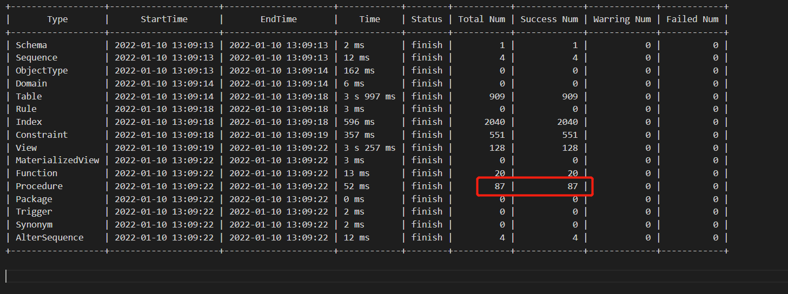
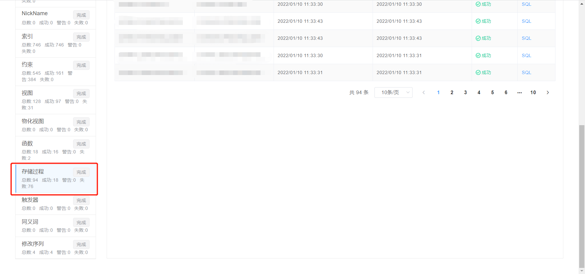
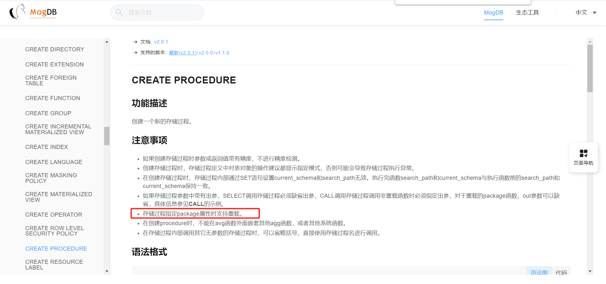

# openGauss MogDB 迁移适配——存储过程重载

本文出处：[https://www.modb.pro/db/235743](https://www.modb.pro/db/235743)

# 1. 异构迁移

在给某金融级客户迁移时遇到了各种各样的兼容性问题，本次迁移涉及到多个存储过程的适配，DB2 到 MogDB，这里做一个简单的整理。

# 2. mtk 迁移

mtk 全称为 The Database Migration Toolkit，是一个云和恩墨自主研发的可以将 Oracle/DB2/MySQL/openGauss 数据库的数据结构，全量数据高速导入到 MogDB 的工具。

逻辑对象统计如下


MTK 截图部分展示


其中两次迁移对比发现存储过程少了 7 个，去源端查询发现有 7 个完全同名的存储过程，即存在存储过程重载现象。

# 3. 函数重载

多个函数具有相同的名称，只要参数不同即可。如果多个函数具有相同的名称，那么我们说这些函数是重载的。当一个函数被调用时，根据输入参数调用确切的函数，存储过程也是一样的原理。

**MogDB 存储过程支持重载功能**



# 4. 存储过程重载操作

- 创建

```
postgres=> create or replace procedure procedure1(p1 text, out p2 text)
postgres-> package
postgres-> as Declare
postgres$> BEGIN
postgres$> p2 = concat('procedure parameter: p1,a');
postgres$> end;
postgres$> /
CREATE PROCEDURE
postgres=> create or replace procedure procedure1(p1 integer, out p2 text)
postgres-> package
postgres-> as Declare
postgres$> BEGIN
postgres$> p2 = concat('procedure parameter: p1,a');
postgres$> end;
postgres$> /
CREATE PROCEDURE
postgres=> \df procedure1
                                               List of functions
 Schema |    Name    | Result data type |   Argument data types   |  Type  | fencedmode | propackage | prokind
--------+------------+------------------+-------------------------+--------+------------+------------+---------
 lee    | procedure1 | text             | p1 integer, OUT p2 text | normal | f          | t          | p
 lee    | procedure1 | text             | p1 text, OUT p2 text    | normal | f          | t          | p
(2 rows)

postgres=>

```

- 删除

```
postgres=> drop procedure procedure1;
ERROR:  function procedure1 asks parameters
postgres=> drop procedure procedure1(text);
DROP PROCEDURE
postgres=> \df procedure1
                                               List of functions
 Schema |    Name    | Result data type |   Argument data types   |  Type  | fencedmode | propackage | prokind
--------+------------+------------------+-------------------------+--------+------------+------------+---------
 lee    | procedure1 | text             | p1 integer, OUT p2 text | normal | f          | t          | p
(1 row)

postgres=> drop procedure procedure1(integer);
DROP PROCEDURE
postgres=> \df procedure1
                                         List of functions
 Schema | Name | Result data type | Argument data types | Type | fencedmode | propackage | prokind
--------+------+------------------+---------------------+------+------------+------------+---------
(0 rows)

```

- 首次创建时不带 package 属性，再使用带 package 属性去重载时会创建失败

```
postgres=> create or replace procedure procedure1(p1 text, out p2 text)
postgres-> as Declare
postgres$> BEGIN
postgres$> p2 = concat('procedure parameter: p1,a');
postgres$> end;
postgres$> /
CREATE PROCEDURE
postgres=> create or replace procedure procedure1(p1 text, out p2 text)
postgres-> package
postgres-> as Declare
postgres$> BEGIN
postgres$> p2 = concat('procedure parameter: p1,a');
postgres$> end;
postgres$> /
ERROR:  Do not allow package function replace not package function.

```

- 当有同名函数存在时创建报错

```
postgres=> CREATE OR REPLACE FUNCTION procedure1(p_timestamp timestamp with time zone)
postgres->  RETURNS integer
postgres->  LANGUAGE sql
postgres->  NOT FENCED NOT SHIPPABLE
postgres-> AS $function$
postgres$>     select (extract('day' from (p_timestamp - '0001-01-01bc'))-365)::integer;
postgres$> $function$;
CREATE FUNCTION
postgres=>
postgres=> create or replace procedure procedure1(p1 text, out p2 text)
postgres-> package
postgres-> as Declare
postgres$> BEGIN
postgres$> p2 = concat('procedure parameter: p1,a');
postgres$> end;
postgres$> /
ERROR:  Do not allow package function replace not package function.

```

# 5. 存储过程修改为函数

```
postgres=> create or replace procedure procedure1(p1 text, out p2 text)
postgres-> package
postgres-> as Declare
postgres$> BEGIN
postgres$> p2 = concat('procedure parameter: p1,a');
postgres$> end;
postgres$> /
CREATE PROCEDURE
postgres=> drop procedure procedure1 (text);
DROP PROCEDURE

postgres=> create or replace function procedure1(p1 text, out p2 text)
postgres-> returns void
postgres-> as $$
postgres$> BEGIN
postgres$> p2 = concat('procedure parameter: p1,a');
postgres$> end;
postgres$> $$
postgres-> language plpgsql;
CREATE FUNCTION

```

## 6.总结

MogDB、openGauss 支持存储过程的重载。删除重载属性的存储过程需要传入相应参数。创建重载属性的存储过程需要在 as 前加上 package 关键字。当同 schema 下有同名的函数或者不带 package 属性的存储过程时，创建重载存储过程会报错。
