# openGauss 常用的客户端连接工具

## Data Studio

**工具介绍**

Data Studio 是一个集成开发环境（ IDE），帮助数据库开发人员便捷地构建应用程序，以图形化界面形式提供数据库关键特性。

Data Studio 还提供 SQL 助手用于在“ SQL 终端”和“ PL/SQLViewer”中执行各种查询/过程/函数

数据库开发人员仅需掌握少量的编程知识，即可使用该工具进行数据库对象操作。Data Studio 提供丰富多样的特性，例如：

- 创建和管理数据库对象
- 执行 SQL 语句/脚本
- 编辑和执行 PL/SQL 语句
- 图形化查看执行计划和开销
- 导出表数据等

创建和管理数据库对象包括：

- 数据库
- 模式
- 函数
- 过程
- 表
- 序列
- 索引
- 视图
- 表空间
- 同义词

Data Studio 下载链接：[https://opengauss.obs.cn-south-1.myhuaweicloud.com/1.0.1/DataStudio_win_64.zip](https://opengauss.obs.cn-south-1.myhuaweicloud.com/1.0.1/DataStudio_win_64.zip)

**Data Studio 需求环境**

- Supported Operating System:

  - Windows 10
  - Windows 7
  - Windows 2016
  - Windows 2012

- Hardware:

  - x86 64-bit
  - 1GB RAM available or greater
  - Minimum 1GB free disk space

- Software:
  - Java 1.8.0_181 or later

**安装 JDK**

JDK 下载链接：[https://www.oracle.com/java/technologies/javase/javase-jdk8-downloads.html](https://www.oracle.com/java/technologies/javase/javase-jdk8-downloads.html)

- 默认下一步即可。

  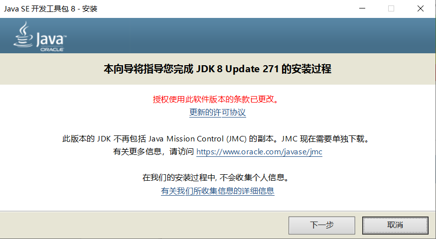

- 点击“更改”，更改安装路径，可自定义安装路径。

  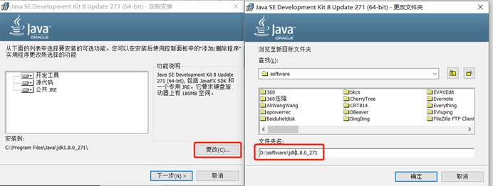

- 等待安装完成，安装完成后直接点击关闭即完成安装。

  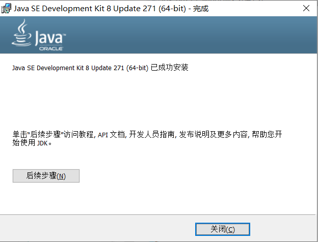

**配置环境变量**

- 在控制面板-\>系统中，点击高级设置。

  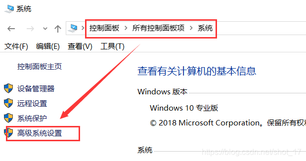

- 在系统属性-\>高级中，点击“环境变量（N）”

  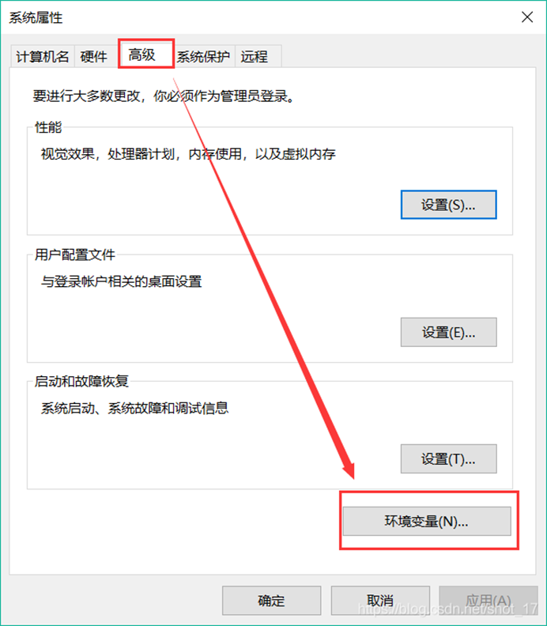

- 在系统变量中，点击“新建（W）”，新建变量名为 JAVA_HOME 的变量，变量值为 jdk 的安装路径。

  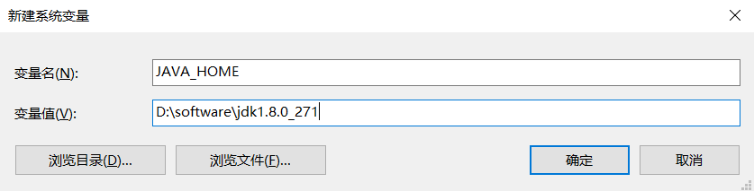

- 在系统变量中，寻找 Path 变量，点击“编辑（I）”，新建 CLASSPATH 变量。

  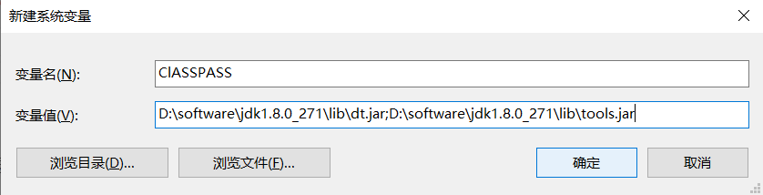

- 编辑环境变量。

  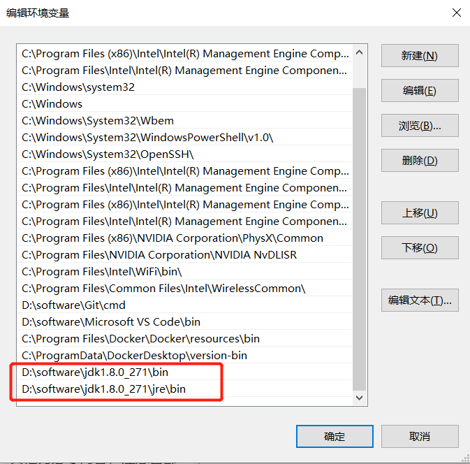

- 检验是否配置成功。

  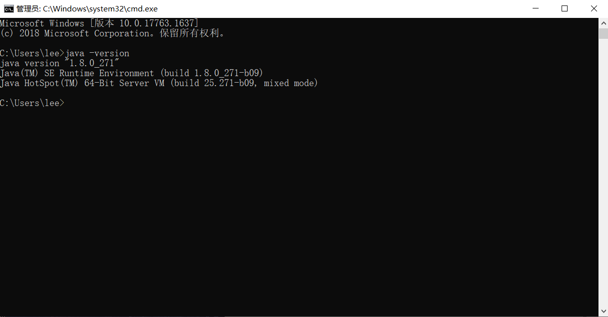

**下载并解压安装包**

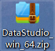

**运行 exe**

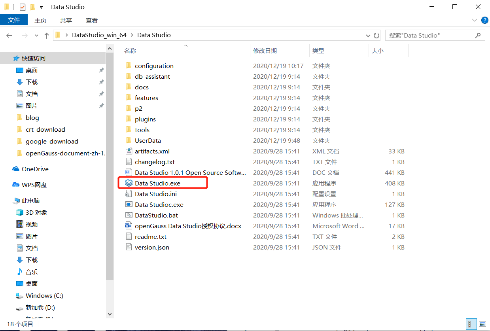

**配置连接串**

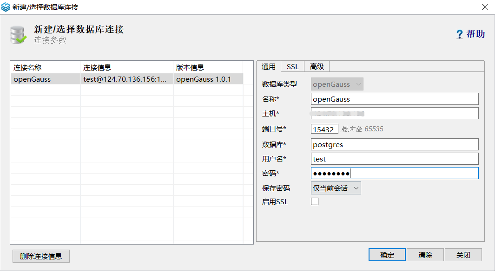

**界面展示**

右侧有语法和操作列表示例。

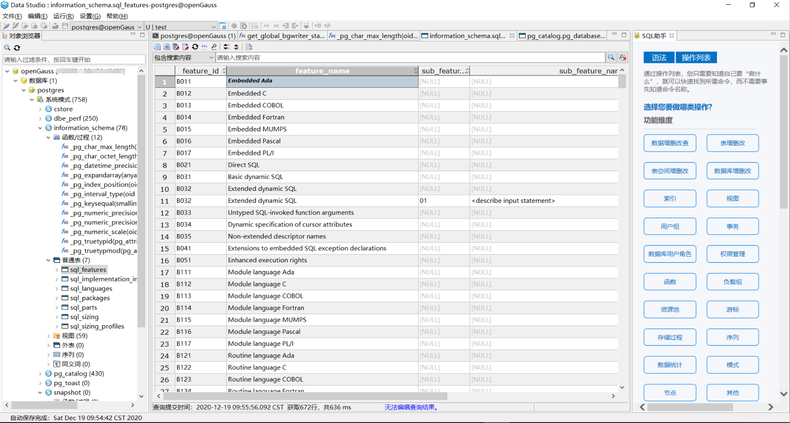

## DBeaver

**工具介绍**

DBeaver is free and open source universal database tool for developers and database administrators.

- Usability is the main goal of this project, program UI is carefully designed and implemented.
- It is free and open-source \(ASL\).
- It is multiplatform.
- It is based on opensource framework and allows writing of various extensions \(plugins\).
- It supports any database having a JDBC driver.
- It may handle any external datasource which may or may not have a JDBC driver.
- There is a set of plugins for different databases and different database management utilities \(e.g. ERD, data transfer, compare, data export/import, mock data generation, etc\).
- It has a great number of features.

DBeaver 下载链接： [https://dbeaver.io/download/](https://dbeaver.io/download/)

**配置连接串**

创建数据库类型时选择 pg 即可。

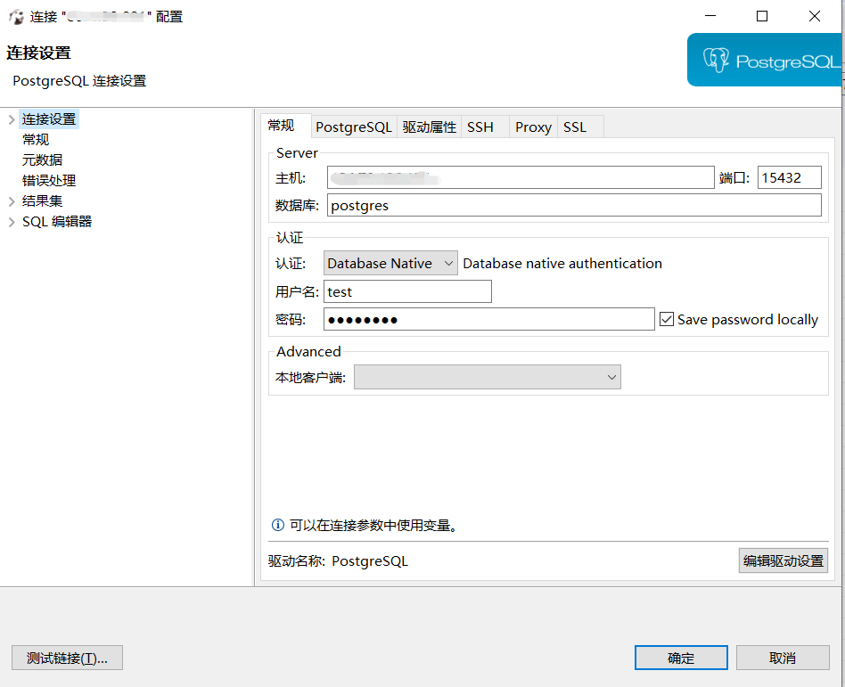

**界面展示**

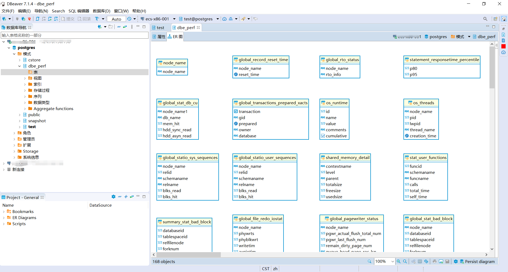

## Navicat

**工具介绍**

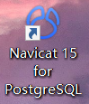

Navicat for PostgreSQL 是一套易于使用的图形化 PostgreSQL 数据库开发工具。从编写简单的 SQL 查询到开发复杂的数据库，Navicat for PostgreSQL 都能迎合大部份用户的需要，包括 PostgreSQL 初学者以及经验丰富的开发人员。它能连接任何本地或远程 PostgreSQL 服务器，并支持 Amazon Redshift、Amazon Aurora、Amazon RDS、Microsoft Azure、阿里云、腾讯云、华为云等云数据库和所有 PostgreSQL 数据库对象。

Navicat 下载链接：[http://www.navicat.com.cn/download/navicat-for-postgresql](http://www.navicat.com.cn/download/navicat-for-postgresql)

**配置连接串**

创建数据库类型时选择 pg 即可。

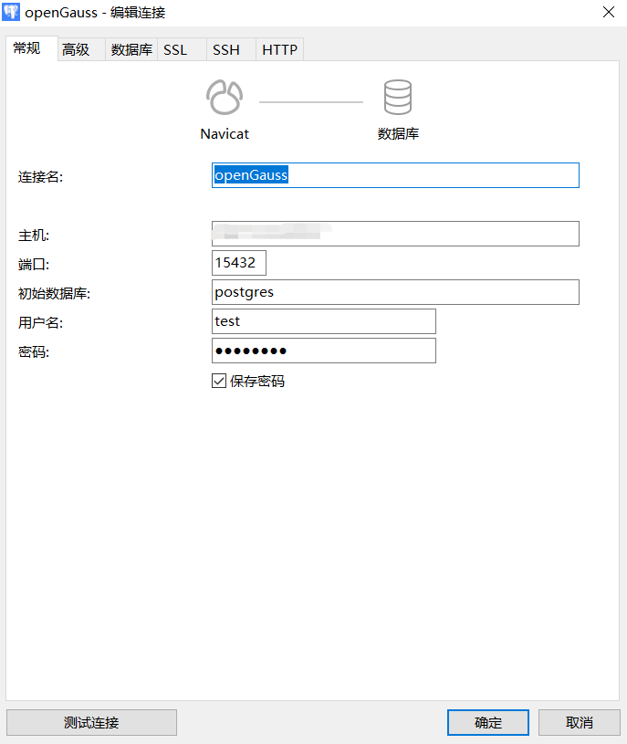

**界面展示**

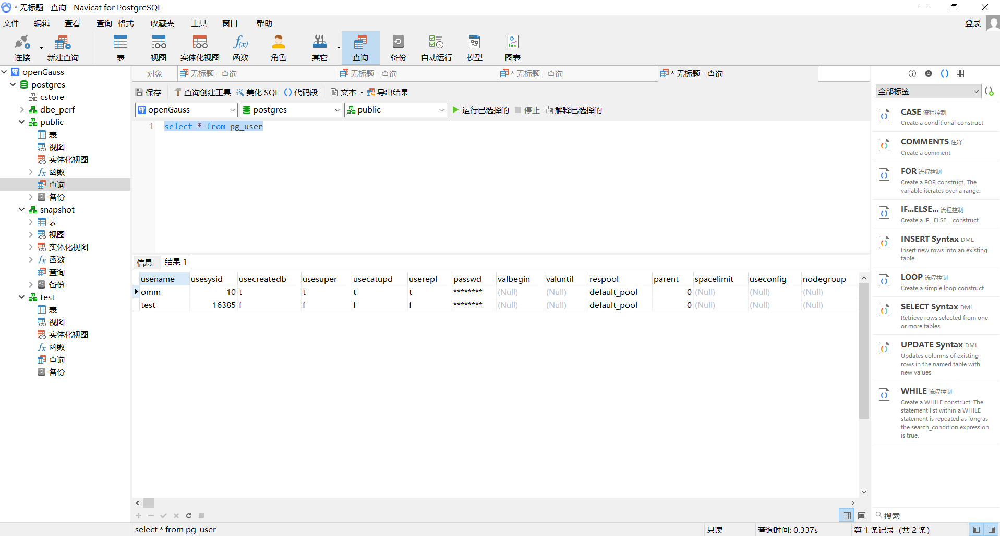

## DbVisualizer

**工具介绍**

- DbVisualizer is the ultimate database tool for developers, analysts and DBAs. It runs on all major OSes and connects to all major databases.
- DbVisualizer is the highest performer among the universal database tools in the G2 grid for universal database management systems.

DbVisualizer 下载链接：[https://www.dbvis.com/download/11.0](https://www.dbvis.com/download/11.0)

**配置连接串**

创建数据库类型时选择 pg 即可。

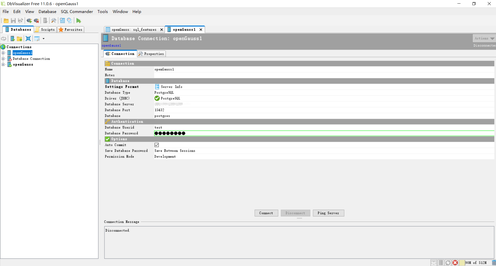

**界面展示**

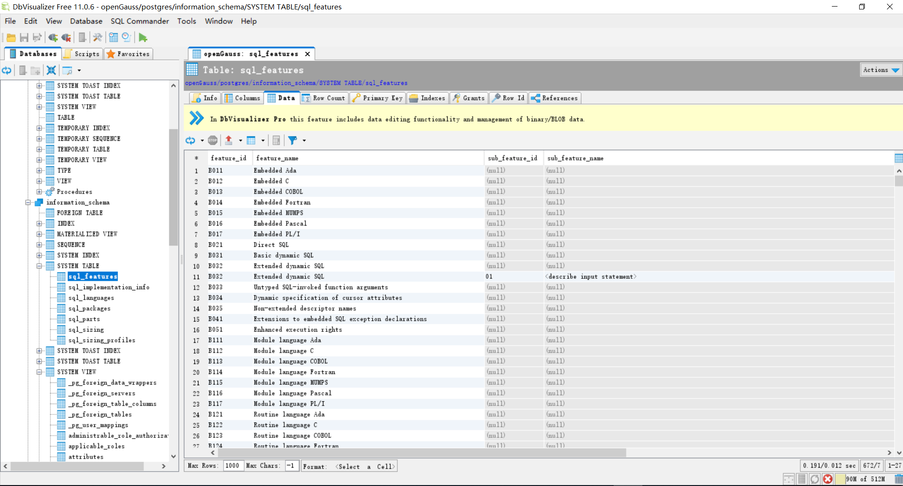

## Pgadmin4

**工具介绍**

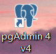

- pgAdmin 4 is a rewrite of pgAdmin III \(see below\) in Python/Javascript. It isable to be run either in it’s own C++ based Desktop Runtime, or as a webapplication for multiple users.

**配置连接串**

创建数据库类型时选择 pg 即可。

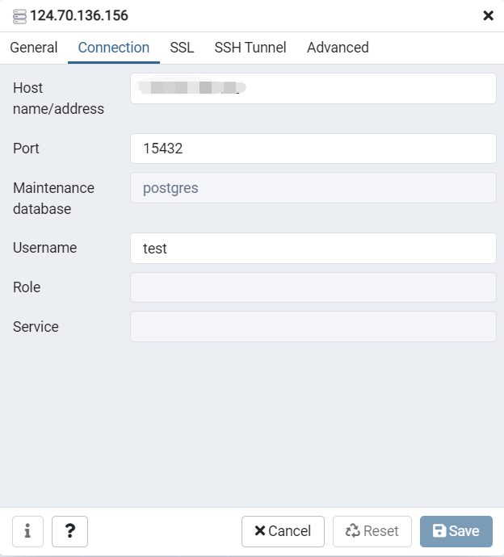

**界面展示**

可以看到客户端 Application name。

