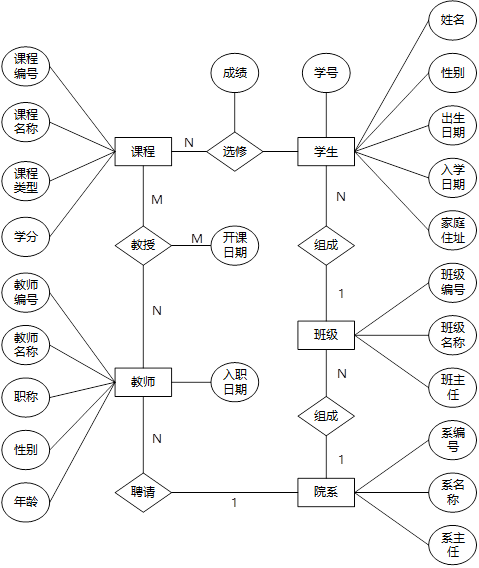
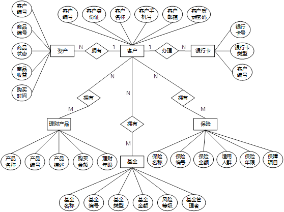

# 概述<a name="ZH-CN_TOPIC_0276663036"></a>

本章节主要介绍采用 openGauss 简化安装脚本（以下简称安装脚本），一键式安装 openGauss 数据库所必须的系统环境及安装步骤。

# 安装环境要求<a name="ZH-CN_TOPIC_0277918211"></a>

## openGauss 环境要求<a name="ZH-CN_TOPIC_0277919735"></a>

安装 openGauss 的具体环境要求，请参考《openGauss 安装指南》中的“2.3.1 节软硬件环境要求”章节。

## 安装脚本环境要求<a name="ZH-CN_TOPIC_0277919734"></a>

### 硬件环境要求<a name="section1362810339567"></a>

安装脚本对安装环境的操作系统及对应处理器架构进行了限制，目前支持的环境如[表 1 ](#table1424418)所示。

**表 1** 硬件环境要求

<a name="table1424418"></a>

<table><tbody><tr id="row2298077"><td class="cellrowborder"  width="49.96%"><p id="p51926520"><a name="p51926520"></a><a name="p51926520"></a>操作系统</p>
</td>
<td class="cellrowborder"  width="50.03999999999999%"><p id="p45298596"><a name="p45298596"></a><a name="p45298596"></a>处理器架构</p>
</td>
</tr>
<tr id="row5034184"><td class="cellrowborder"  width="49.96%"><p id="p5115727"><a name="p5115727"></a><a name="p5115727"></a>openEuler</p>
</td>
<td class="cellrowborder"  width="50.03999999999999%"><p id="p11720763"><a name="p11720763"></a><a name="p11720763"></a>aarch64</p>
</td>
</tr>
<tr id="row38378011"><td class="cellrowborder"  width="49.96%"><p id="p21611161"><a name="p21611161"></a><a name="p21611161"></a>CentOS</p>
</td>
<td class="cellrowborder"  width="50.03999999999999%"><p id="p5673583"><a name="p5673583"></a><a name="p5673583"></a>x86_64</p>
</td>
</tr>
<tr id="row9783413161212"><td class="cellrowborder"  width="49.96%"><p id="p205187296121"><a name="p205187296121"></a><a name="p205187296121"></a>openEuler</p>
</td>
<td class="cellrowborder"  width="50.03999999999999%"><p id="p4785121341217"><a name="p4785121341217"></a><a name="p4785121341217"></a>x86_64</p>
</td>
</tr>
</tbody>
</table>

### 软件依赖要求<a name="section6345181035619"></a>

安装脚本依赖于其它软件的支持，如[表 2 ](#table23052927)所示。

**表 2** 软件依赖要求

<a name="table23052927"></a>

<table><tbody><tr id="row40730901"><td class="cellrowborder"  width="50%"><p id="p10868702"><a name="p10868702"></a><a name="p10868702"></a>所需软件</p>
</td>
<td class="cellrowborder"  width="50%"><p id="p7949639"><a name="p7949639"></a><a name="p7949639"></a>建议版本</p>
</td>
</tr>
<tr id="row4437887"><td class="cellrowborder"  width="50%"><p id="p23924539"><a name="p23924539"></a><a name="p23924539"></a>firewalld</p>
</td>
<td class="cellrowborder"  width="50%"><p id="p58839532"><a name="p58839532"></a><a name="p58839532"></a>-</p>
</td>
</tr>
<tr id="row59793748"><td class="cellrowborder"  width="50%"><p id="p11455439"><a name="p11455439"></a><a name="p11455439"></a>python</p>
</td>
<td class="cellrowborder"  width="50%"><p id="p55475379"><a name="p55475379"></a><a name="p55475379"></a>3</p>
</td>
</tr>
</tbody>
</table>

# 安装 openGauss<a name="ZH-CN_TOPIC_0277918212"></a>

## 安装前准备<a name="ZH-CN_TOPIC_0277936930"></a>

### 导入安装脚本<a name="section182213591271"></a>

安装脚本包含了多个文件，其用途如[表 1 ](#table32787233)所示。导入安装脚本时，建议直接导入 tar 包至安装环境中，随后在安装环境中进行解压，否则可能出现 window 与 unix 风格不兼容的问题。若出现此类问题，可以使用 dos2unix 命令对安装脚本进行格式转换。

**表 1** 安装脚本清单

<a name="table32787233"></a>

<table><tbody><tr id="row27437792"><td class="cellrowborder"  width="50%"><p id="p7868661"><a name="p7868661"></a><a name="p7868661"></a>文件名称</p>
</td>
<td class="cellrowborder"  width="50%"><p id="p33381819"><a name="p33381819"></a><a name="p33381819"></a>用途</p>
</td>
</tr>
<tr id="row32000920"><td class="cellrowborder"  width="50%"><p id="p41937705"><a name="p41937705"></a><a name="p41937705"></a>install.sh</p>
</td>
<td class="cellrowborder"  width="50%"><p id="p41510976"><a name="p41510976"></a><a name="p41510976"></a>简化安装主程序</p>
</td>
</tr>
<tr id="row38054464"><td class="cellrowborder"  width="50%"><p id="p62512728"><a name="p62512728"></a><a name="p62512728"></a>common.sh</p>
</td>
<td class="cellrowborder"  width="50%"><p id="p30366184"><a name="p30366184"></a><a name="p30366184"></a>公共命令</p>
</td>
</tr>
<tr id="row4860205"><td class="cellrowborder"  width="50%"><p id="p58132325"><a name="p58132325"></a><a name="p58132325"></a>README.md</p>
</td>
<td class="cellrowborder"  width="50%"><p id="p11097898"><a name="p11097898"></a><a name="p11097898"></a>参考文档</p>
</td>
</tr>
<tr id="row32772220"><td class="cellrowborder"  width="50%"><p id="p37304191"><a name="p37304191"></a><a name="p37304191"></a>template.xml</p>
</td>
<td class="cellrowborder"  width="50%"><p id="p1740610"><a name="p1740610"></a><a name="p1740610"></a>xml模板</p>
</td>
</tr>
<tr id="row291714171543"><td class="cellrowborder"  width="50%"><p id="p191816171842"><a name="p191816171842"></a><a name="p191816171842"></a>finances.sql</p>
</td>
<td class="cellrowborder"  width="50%"><p id="p17918101718419"><a name="p17918101718419"></a><a name="p17918101718419"></a>金融数据模型展示数据库</p>
</td>
</tr>
<tr id="row991912174419"><td class="cellrowborder"  width="50%"><p id="p14919417648"><a name="p14919417648"></a><a name="p14919417648"></a>school.sql</p>
</td>
<td class="cellrowborder"  width="50%"><p id="p1591961715415"><a name="p1591961715415"></a><a name="p1591961715415"></a>学校数据模型展示数据库</p>
</td>
</tr>
</tbody>
</table>

### 导入 openGauss 数据库安装包<a name="section141819392288"></a>

安装脚本支持以下两种方式导入 openGauss 数据库安装包：

- 手动导入

在 openGauss 官网<https://opengauss.org/zh/download.html>下载对应版本安装包拷贝至安装环境中，存放路径为安装脚本的上层目录。

- 自动导入

配置安装环境外网访问，并确保安装脚本上层路径不存在 openGauss 数据库安装包。当运行安装脚本时，会自动下载对应版本安装包进行安装。

## 执行安装<a name="ZH-CN_TOPIC_0277936931"></a>

使用如下命令执行安装脚本。

```
sh install.sh user_name user_group host_ip host_port [install_path]
```

### 参数说明<a name="section1637551823711"></a>

- user_name 为 openGauss 数据库的安装用户。

- user_group 为 openGauss 数据库安装用户所属用户组。
- host_ip 为主机在后端存储网络中的 IP 地址（内网 IP）。
- host_port 为数据库节点的基础端口号。
- install_path 为 openGauss 数据库安装路径，该参数为可选参数。

以上参数的详细信息，请参考《openGauss 安装指南》中的 3.1 节创建 XML 配置文件。

### 注意事项<a name="section16195182183817"></a>

- 不指定 install_path 参数时，数据库默认安装在/opt/user_name 路径下。
- 无论采用何种方式导入 openGauss 安装包，安装脚本都会在/home/user_name/openGaussTar 路径下建立本地安装包文件。该路径支持修改，请在 install.sh 中修改 install_location 参数，但是需要与安装路径 install_path 不同。
- 安装脚本必须在 root 下执行，且同一时刻只有 1 个安装脚本正在运行。

# 导入展示数据库<a name="ZH-CN_TOPIC_0280480478"></a>

## 学校数据模型<a name="ZH-CN_TOPIC_0280483274"></a>

假设 A 市 B 学校为了加强对学校的管理，引入了 openGauss 数据库。在 B 学校里，主要涉及的对象有学生、教师、班级、院系和课程。本文假设在 B 学校数据库中，教师会教授课程，学生会选修课程，院系会聘请教师，班级会组成院系，学生会组成班级。因此，根据此关系，本文给出了相应的关系模式和 ER 图。在运行安装脚本时，会根据用户选择安装该展示模型。

### 关系模式<a name="section445618017239"></a>

对于 B 校中的 5 个对象，分别建立属于每个对象的属性集合，具体属性描述如下：

- 学生（学号，姓名，性别，出生日期，入学日期，家庭住址）
- 教师（教师编号，教师姓名，职称，性别，年龄，入职日期）
- 班级（班级编号，班级名称，班主任）
- 院系（系编号，系名称，系主任）
- 课程（课程编号，课程名称，课程类型，学分）

上述属性对应的编号为：

- student（std_id，std_name，std_sex，std_birth，std_in，std_address）
- teacher（tec_id，tec_name，tec_job，tec_sex，tec_age，tec_in）
- class（cla_id，cla_name，cla_teacher）
- school_department（depart_id，depart_name，depart_teacher）
- course（cor_id，cor_name，cor_type，credit）

对象之间的关系：

- 一位学生可以选择多门课程，一门课程可被多名学生选择
- 一位老师可以选择多门课程，一门课程可被多名老师教授
- 一个院系可由多个班级组成
- 一个院系可聘请多名老师
- 一个班级可由多名学生组成

### ER 图<a name="section17368147172312"></a>

**图 1** 学校数据模型<a name="fig1873416288536"></a>  


## 金融数据模型<a name="ZH-CN_TOPIC_0280483275"></a>

假设 A 市 C 银行为了方便对银行数据的管理和操作，引入了 openGauss 数据库。针对 C 银行的业务，本文主要将对象分为客户、银行卡、理财产品、保险、基金和资产。因此，针对这些数据库对象，本文假设 C 银行的金融数据库存在着以下关系：客户可以办理银行卡，同时客户可以购买不用的银行产品，如资产，理财产品，基金和保险。那么，根据 C 银行的对象关系，本文给出了相应的关系模式和 ER 图。在运行安装脚本时，会根据用户选择安装该展示模型。

### 关系模式<a name="section2050313157256"></a>

对于 C 银行中的 6 个对象，分别建立属于每个对象的属性集合，具体属性描述如下：

- 客户（客户编号、客户名称、客户邮箱，客户身份证，客户手机号，客户登录密码）
- 银行卡（银行卡号，银行卡类型，所属客户编号）
- 理财产品（产品名称，产品编号，产品描述，购买金额，理财年限）
- 保险（保险名称，保险编号，保险金额，适用人群，保险年限，保障项目）
- 基金（基金名称，基金编号，基金类型，基金金额，风险等级，基金管理者）
- 资产（客户编号，商品编号，商品状态，商品数量，商品收益，购买时间）

上述属性对应的编号为：

- client（c_id，c_name，c_mail，c_id_card，c_phone，c_password）
- bank_card（b_number，b_type，b_c_id）
- finances_product（p_name，p_id，p_description，p_amount，p_year）
- insurance（i_name，i_id，i_amount，i_person，i_year，i_project）
- fund（f_name，f_id，f_type，f_amount，risk_level，f_manager）
- property（pro_c_id，pro_id，pro_status，pro_quantity，pro_income，pro_purchase_time）

对象之间的关系：

- 一个客户可以办理多张银行卡
- 一个客户可有多笔资产
- 一个客户可以购买多个理财产品，同一类理财产品可由多个客户购买
- 一个客户可以购买多个基金，同一类基金可由多个客户购买
- 一个客户可以购买多个保险，同一类保险可由多个客户购买

### ER 图<a name="section2501423152711"></a>

**图 1** 金融数据模型<a name="fig148191616411"></a>  

