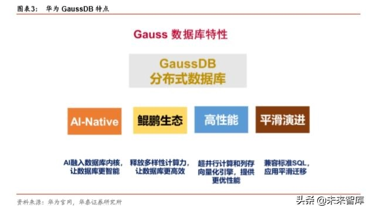
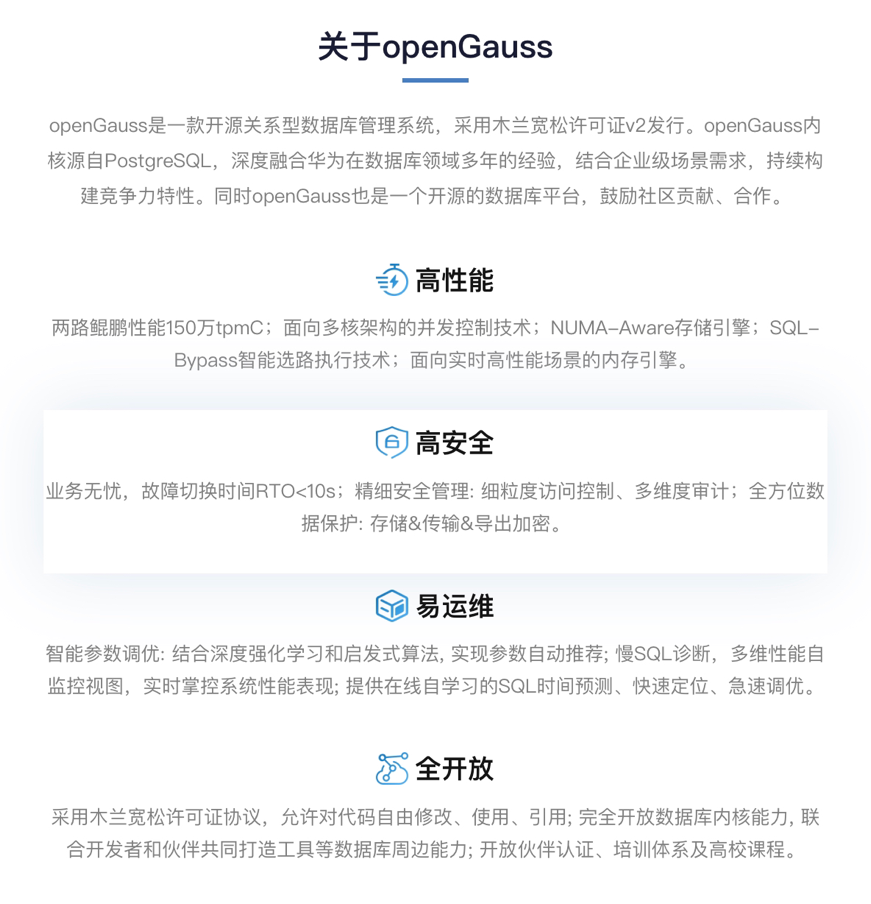

# 浅谈关于 openGauss 的相关理论

## 概述

openGauss 是一款开源的关系型数据库管理系统，它具有多核高性能、全链路安全性、智能运维等企业级特性。 openGauss 内核早期源自开源数据库 PostgreSQL9.2，融合了华为在数据库领域多年的内核经验，在架构、事务、存储引擎、优化器及 ARM 架构上进行了适配与优化。

现在的数据库市场中，除了老牌的数据库品牌，一些新开发的数据库产品，开源数据库占比很大。并且，华为 GaussDB 是个融入了 AI 原生技术的分布式系统，将 AI 能力植入到数据库内核的架构和算法中，为用户提供更高性能、更高可用、更多计算力支持的分布式数据库。

在 GaussDB 的产品线中，既有事务性数据库，又有分析型数据库，不同的面向对象满足了市面上的大部分数据库使用者的需求。目前已在招商银行等投入使用。

关于 GaussDB，有几大亮点值得我们关注。

1.  GaussDB 产品可以支持 x86、ARM、GPU、NPU 等异型架构。可以看出，不仅面向国产服务器市场，华为的目标市场还包括未来 5G 带来更多的计算应用场景。
2.  GaussDB 是业界首个 AI-Native（人工智能原生态）数据库，首次将人工智能技术融入分布式数据库的全生命周期，实现自运维、自管理、自调优、故障自诊断和自愈。首创基于深度强化学习的自调优算法，调优性能比业界提升 60%以上。
3.  GaussDB 可以完成建立在华为 IT 架构的底层生态之上，包括网络设备、芯片、操作系统、云计算、人工智能等，这些在华为 IT 体系内部是高度耦合的。这为以后华为市场的发展，形成一个完整的生态体系提供了基础。

## 模块

主要包含了 openGauss 服务器，客户端驱动，OM 等模块。

**图 1** openGauss 逻辑架构图  

**表 1** 架构说明

<table><thead ><tr id="zh-cn_topic_0237080634_zh-cn_topic_0231764167_row4411284819151"><th class="cellrowborder"  width="14.469999999999999%" id="mcps1.2.3.1.1">
名称

</th>
<th class="cellrowborder"  width="85.53%" id="mcps1.2.3.1.2">
描述

</th>
</tr>
</thead>
<tbody><tr id="zh-cn_topic_0237080634_zh-cn_topic_0231764167_row3200216592122"><td class="cellrowborder"  width="14.469999999999999%" headers="mcps1.2.3.1.1 ">
OM

</td>
<td class="cellrowborder"  width="85.53%" headers="mcps1.2.3.1.2 ">
运维管理模块（Operation Manager）。提供集群日常运维、配置管理的管理接口、工具。

</td>
</tr>
<tr id="zh-cn_topic_0237080634_zh-cn_topic_0231764167_row6476976919151"><td class="cellrowborder"  width="14.469999999999999%" headers="mcps1.2.3.1.1 ">
客户端驱动

</td>
<td class="cellrowborder"  width="85.53%" headers="mcps1.2.3.1.2 ">
客户端驱动（Client Driver）。负责接收来自应用的访问请求，并向应用返回执行结果。客户端驱动负责与openGauss实例通信，发送应用的SQL命令，接收openGauss实例的执行结果。

</td>
</tr>
<tr id="zh-cn_topic_0237080634_zh-cn_topic_0231764167_row5813821019151"><td class="cellrowborder"  width="14.469999999999999%" headers="mcps1.2.3.1.1 ">
openGauss（主备）

</td>
<td class="cellrowborder"  width="85.53%" headers="mcps1.2.3.1.2 ">
openGauss主备（Datanode）。负责存储业务数据、执行数据查询任务以及向客户端返回执行结果。

openGauss实例包含主、备两种类型，支持一主多备。建议将主、备openGauss实例分散部署在不同的物理节点中。

</td>
</tr>
<tr id="zh-cn_topic_0237080634_zh-cn_topic_0231764167_row4354812919183"><td class="cellrowborder"  width="14.469999999999999%" headers="mcps1.2.3.1.1 ">
Storage

</td>
<td class="cellrowborder"  width="85.53%" headers="mcps1.2.3.1.2 ">
服务器的本地存储资源，持久化存储数据。

</td>
</tr>
</tbody>
</table>

同时，为了保证整个应用数据的安全性，建议将 openGauss 的典型组网划分为两个独立网络：前端业务网络和数据管理存储网络。

**图 2** 典型组网

## 性能

关于 GaussDB 的性能方面，openGauss 社区用如下的一张图简要进行概括。

具体我们可以关注有以下几个部分。（此处不是重点不做详细介绍，感兴趣的朋友可以自行了解）

1.  数据分区
2.  NUMA 化内核数据结构
3.  绑核优化
4.  ARM 指令优化
5.  并行恢复
6.  MOT 引擎（Beta 发布）
7.  安全
8.  易运维

## 总结

**生态体系**

Oracle 的数据库成为全球第一数据库的地位，与上世纪 80 年代开始的全球 IT 生态体系的逐步确立有关。Oracle 数据库世界霸主地位，是随着 Windows 操作系统、Intel X86 芯片一起建立的 PC 时代的 IT 底层生态而逐步确立的。而 AWS 数据库则是适应了互联网时代（云计算时代）新的计算场景对数据库的新需求，再加上自身的云生态体系，逐步迎来的客户使用的推广。从华为 Gauss 数据库来看，华为 IT 架构的底层生态已经逐步建立起来，包括芯片、操作系统、 数据库等，这些在华为 IT 体系内部是高度耦合的。

**计算场景**

数据库也有其使用的计算场景。IT 发展的不同阶段， 在不同的计算场景、不同的数据类型环境下，对数据库的要求是不同的。需要数据库产品不断根据外界变化，而进行更新升级，甚至自我革新。

**产品的优化和升级**

所有好用的软件产品都不是短期开发出来的，而是靠时间堆出来的，都是经过无数客户的实用反馈， 反复修改 bug，优化到大部分用户都满意的水平。对于数据库产品更是如此，Oracle 的数据库之所以好用在于其在产品迭代中，不断收到客户的使用反馈，不断地对产品进行相应的修改和更新，这一过程进行了 41 年。对于 openGauss 数据库产品也是如此，不过我们现在已经看到，openGauss 数据库已经在跟银行大客户合作，这对于 openGauss 而言，是其数据库快速发展的一个重要因素。
