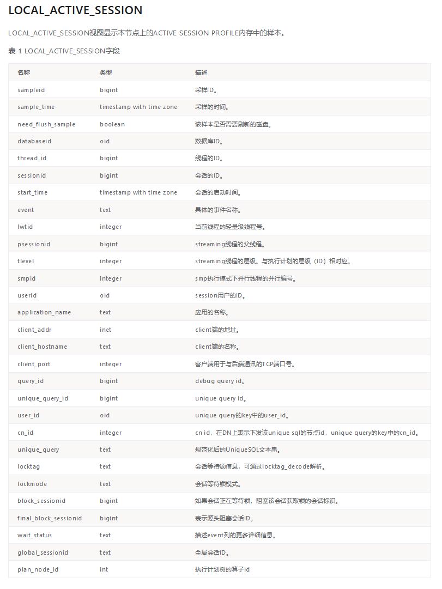

# MogDB ASH 机制浅析

# 什么是 ASH

ASH 实际上是 Oracle 数据库中的一个名字，全称是 Active Session History，这项功能会在数据库内存和持久化的系统表里都记录下每隔一定周期的活跃会话的信息，内存中的数据重启数据库以后会清空，但是持久化的系统表数据会长期保留。因为 ASH 的存在，所以当数据库发生故障或者经历性能问题，需要回溯定位问题原因的时候，非常有帮助。

在 MogDB 中，同样实现了 ASH 能力。

## MogDB 的 ASH 能力

分为两部分来阐述。社区开源版本 openGauss 的能力和 MogDB 企业版本增强的能力。

首先是社区开源版本 openGauss 本身具备的 ASH 能力，MogDB 是完全继承的。

数据库中提供了两个主要视图，分别是`dbe_perf.LOCAL_ACTIVE_SESSION`和`GS_ASP`，其中 LOCAL_ACTIVE_SESSION 是内存中的表，而 GS_ASP 则是持久化保存的表。在这两个视图中包含了当前活动会话的采样信息。

有以下几个主要参数，会对 ASH 功能产生影响：

[`enable_asp`](https://docs.mogdb.io/zh/mogdb/v3.0/27-system-performance-snapshot#enable_asp) 设置为 on 或者 off，表示是否开启 ASH 功能，默认为开启；

[`asp_sample_interval`](https://docs.mogdb.io/zh/mogdb/v3.0/27-system-performance-snapshot#asp_sample_interval) 指定每次采样的间隔，默认为 1s 采样一次，如果想减轻采样压力，可以将该参数设置为更长间隔，最长允许设置为 10s；

[`asp_sample_num`](https://docs.mogdb.io/zh/mogdb/v3.0/27-system-performance-snapshot#asp_sample_num) 指定在内存表 LOCAL_ACTIVE_SESSION 中保留的样本总数，超过该数，将会触发将内存中的样本刷盘记录到 GS_ASP 系统表中的行为，默认为 10 万条。当发生刷盘行为后，LOCAL_ACTIVE_SESSION 中的所有记录会被清空，重新开始采样；

[`asp_flush_rate`](https://docs.mogdb.io/zh/mogdb/v3.0/27-system-performance-snapshot#asp_flush_rate) 指定哪些内存中的样本数据会被刷盘记录到 GS_ASP 表中，判断时会计算 LOCAL_ACTIVE_SESSION 中记录的 sampleid 字段值，其中 sampleid%asp_flush_rate == 0 的记录会被标志为 need_flush_sample=true，这些记录都会被持久化保存（在内核函数 Asp::SubAspWorker 中定义）。可以简单地理解为，该参数默认值为 10，也就是 1/10 的样本会被持久化保存；

[`asp_retention_days`](https://docs.mogdb.io/zh/mogdb/v3.0/27-system-performance-snapshot#asp_retention_days) 指定在 GS_ASP 中保留的数据的时限，默认为 2 天，最多 7 天。

其次是 MogDB 企业版增强的 ASH 能力，称为“SQL 运行状态观测”，主要是通过在采样数据中增加 SQL 执行算子的采样来完成的。

MogDB 在上述视图中增加了 plan_node_id 字段来记录每次采样时，SQL 正在执行的算子情况，将该算子与其它性能视图中记录的 SQL 执行计划来关联，即可知道对于出现性能问题的 SQL 具体是慢在了执行计划的哪个步骤上。具体介绍可以参看文档：[SQL 运行状态观测](https://docs.mogdb.io/zh/mogdb/v3.0/22-sql-running-status-observation#sql运行状态观测)。

以下参数，会对企业版 ASH 功能产生影响：

[`resource_track_level`](https://docs.mogdb.io/zh/mogdb/v3.0/13-load-management#resource_track_level) 参数指定为 operator，则会开启算子采样能力，默认值是 query，只会记录 SQL 级别采样。

## LOCAL_ACTIVE_SESSION 视图

该视图中已经记录了大量信息，包括用户关心的会话 ID，等待事件，SQL query id （该值可以跟 dbe_perf.statement_history 表或者 dbe_perf.statement_complex_runtime 表进行关联，获取 SQL 的文本和执行计划）。



以上字段列表中，plan_node_id 只有在 MogDB 企业版数据库中才存在，openGauss 社区开源版本不存在该字段。

## 关于 SQL 执行计划的记录

查询已经运行过的，或者正在执行的 SQL 的执行计划，是数据库运维工作中经常会遇到的需求。在 MogDB 中，以下视图中记录了 SQL 的执行计划。

`dbe_perf.STATEMENT_HISTORY` 该视图中记录了已经运行结束的 SQL 的各种信息，同时包含了执行计划（query_plan 字段）。

`dbe_perf.STATEMENT_COMPLEX_RUNTIME` 该视图中记录了正在运行的 SQL 的各种信息，同时包含了执行计划（query_plan 字段）。

但是要注意，记录 SQL 的执行计划，受到以下参数影响。

`enable_resource_track` 该参数设置是否对资源进行监控，默认为 on，如果设置为 off，则不仅仅是执行计划，而是所有用户 SQL 的执行信息都不再追踪。包括在 ASH 视图 LOCAL_ACTIVE_SESSION 中也不再记录用户会话采样。

`resource_track_cost` 该参数设置对于 SQL 语句进行资源监控的最小执行代价，只有高于该参数值的成本的 SQL 才会记录执行计划。

## 一个综合各种视图的查询语句

我们可以使用以下语句来获取正在执行的 SQL 的包括历史采样的所有信息。

```
select
    las.sample_time,
    las.application_name,
    las.unique_query_id,
    las.event,
    scr.query ,
    scr.query_plan
from
    dbe_perf.local_active_session las,
    dbe_perf.statement_complex_runtime scr
where
    las.thread_id = scr.pid
    and scr.pid <> pg_backend_pid();
该SQL执行的结果示例如下。这个例子中有一个全表扫描的语句频繁执行，在多次采样中被记录下来，包含了SQL文本，执行计划，发起查询的客户端信息等，均可以查询到。这些信息将对性能诊断提供极大帮助。
```
