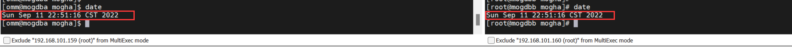
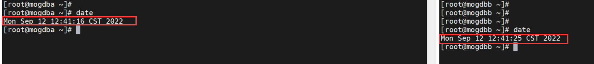

# MogHA：主备系统时间不同步对 RTO 的影响

# 1. MogHA 与 RTO

## 1.1 MogHA

MogHA 是云和恩墨基于 MogDB 同步异步流复制技术自研的一款保障数据库主备集群高可用的企业级软件系统

(适用于 MogDB 和 openGauss 数据库)

MogHA 能够自主探测故障实现故障转移，虚拟 IP 自动漂移等特性，使得数据库的故障持续时间从分钟级降到秒级（RPO=0，RTO<30s），确保数据库集群的高可用服务。

## 1.2 RTO

RTO(Recovery Time Objective，复原时间目标)是数据中心可容许服务中断的时间长度。比如说服务发生后半天内便需要恢复，RTO 数值就是十二小时。RTO 具体时间长短只是从故障发生后，从数据中心系统宕机导致应用停顿之刻开始，到数据中心系统恢复至可以支持各部门运作之时，此两点之间的时间段。RTO 是反映数据中心业务恢复的及时性指标，表示业务从中断到恢复正常所需的时间，RTO 数值越小，代表容灾系统的数据恢复能力越强

## 1.3 实验目的

在某个项目上，由于主备两台机器在配置了 MogHA 之后，并没有配置时间同步，最终高可用切换测试得到的 RTO 的值非常的高，所以此次实验旨在研究、重现：当主备系统时间有差异，主库出现故障宕库，高可用进行切换的时候对业务恢复时间的影响如何。

---

# 2. 实验环境

| 角色 | IP              | VIP             | 数据库       | 操作系统     | 高可用软件   |
| ---- | --------------- | --------------- | ------------ | ------------ | ------------ |
| 主   | 192.168.101.159 | 192.168.101.161 | MogDB v3.0.1 | CentOS 7 x86 | MogHA v2.3.5 |
| 备   | 192.168.101.160 | 192.168.101.161 | MogDB v3.0.1 | CentOS 7 x86 | MogHA v2.3.5 |

# 3. 主备状态检查

## 3.1 检查集群状态

由于此次主从库都是使用 ptk 安装的方式，所以可以使用以下命令进行集群状态检查：

```sql
由于此次主从库都是使用ptk安装的方式，所以可以使用以下命令进行集群状态检查：

[root@mogdba mogha]# ptk cluster status -n mogdb_cluster
[   Cluster State   ]
database_version                        : MogDB-3.0.1
cluster_name                            : mogdb_cluster
cluster_state                           : Normal
current_az                              : AZ_ALL

[  Datanode State   ]
   id  |       ip        | port  | user | instance | db_role | state
-------+-----------------+-------+------+----------+---------+---------
  6001 | 192.168.101.159 | 26000 | omm  | dn_6001  | primary | Normal
  6002 | 192.168.101.160 | 26000 | omm  | dn_6002  | standby | Normal
```

集群状态正常

## 3.2 MogHA 高可用服务状态检查

- 主：mogdba

```sql
[root@mogdba ~]# systemctl status mogha
● mogha.service - MogHA High Available Service
   Loaded: loaded (/usr/lib/systemd/system/mogha.service; disabled; vendor preset: disabled)
   Active: active (running) since Sun 2022-09-11 21:43:29 CST; 36min ago
     Docs: https://docs.mogdb.io/zh/mogha/v2.0/installation-and-depolyment
 Main PID: 5255 (mogha)
   CGroup: /system.slice/mogha.service
           ├─5255 /home/omm/mogha/mogha -c /home/omm/mogha/node.conf
           ├─5256 mogha: watchdog
           ├─5257 mogha: http-server
           └─5258 mogha: heartbeat

Sep 11 21:43:29 mogdba systemd[1]: Started MogHA High Available Service.
Sep 11 21:43:30 mogdba mogha[5255]: MogHA Version: Version: 2.3.5
Sep 11 21:43:30 mogdba mogha[5255]: GitHash: 7dfa158
Sep 11 21:43:30 mogdba mogha[5255]: config loaded successfully
Sep 11 21:43:39 mogdba sudo[5333]:      omm : TTY=unknown ; PWD=/home/omm/mogha ; USER=root ; CO...55.0
Hint: Some lines were ellipsized, use -l to show in full.

[root@mogdba mogha]# tailf /home/omm/mogha/mogha_heartbeat.log
2022-09-11 22:20:17,885 INFO [__init__.py:61]: ping result: {'192.168.101.255': False, '192.168.101.160': True}
2022-09-11 22:20:17,935 INFO [__init__.py:86]: local instance is alive Primary, state: Normal
2022-09-11 22:20:23,027 INFO [__init__.py:61]: ping result: {'192.168.101.255': False, '192.168.101.160': True}
2022-09-11 22:20:23,077 INFO [__init__.py:86]: local instance is alive Primary, state: Normal
2022-09-11 22:20:28,171 INFO [__init__.py:61]: ping result: {'192.168.101.255': False, '192.168.101.160': True}
2022-09-11 22:20:28,220 INFO [__init__.py:86]: local instance is alive Primary, state: Normal
2022-09-11 22:20:33,312 INFO [__init__.py:61]: ping result: {'192.168.101.255': False, '192.168.101.160': True}
```

- 从：mogdbb

```sql
[root@mogdbb ~]# systemctl status mogha
● mogha.service - MogHA High Available Service
   Loaded: loaded (/usr/lib/systemd/system/mogha.service; disabled; vendor preset: disabled)
   Active: active (running) since Sun 2022-09-11 21:43:35 CST; 36min ago
     Docs: https://docs.mogdb.io/zh/mogha/v2.0/installation-and-depolyment
 Main PID: 8598 (mogha)
   CGroup: /system.slice/mogha.service
           ├─8598 /home/omm/mogha/mogha -c /home/omm/mogha/node.conf
           ├─8599 mogha: watchdog
           ├─8600 mogha: http-server
           └─8601 mogha: heartbeat

Sep 11 21:43:35 mogdbb systemd[1]: Started MogHA High Available Service.
Sep 11 21:43:35 mogdbb mogha[8598]: MogHA Version: Version: 2.3.5
Sep 11 21:43:35 mogdbb mogha[8598]: GitHash: 7dfa158
Sep 11 21:43:35 mogdbb mogha[8598]: config loaded successfully

[root@mogdbb ~]# cd /home/omm/mogha
[root@mogdbb mogha]# tailf mogha_heartbeat.log
2022-09-11 22:20:38,771 INFO [__init__.py:61]: ping result: {'192.168.101.255': False, '192.168.101.159': True}
2022-09-11 22:20:38,823 INFO [__init__.py:86]: local instance is alive Standby, state: Normal
2022-09-11 22:20:43,907 INFO [__init__.py:61]: ping result: {'192.168.101.255': False, '192.168.101.159': True}
2022-09-11 22:20:43,960 INFO [__init__.py:86]: local instance is alive Standby, state: Normal
2022-09-11 22:20:49,040 INFO [__init__.py:61]: ping result: {'192.168.101.255': False, '192.168.101.159': True}
```

mogha 服务正常

## 3.3 查看 VIP 是否已绑定

```
[root@mogdba mogha]# ifconfig
ens33: flags=4163<UP,BROADCAST,RUNNING,MULTICAST>  mtu 1500
        inet 192.168.101.159  netmask 255.255.255.0  broadcast 192.168.101.255
        inet6 fe80::d894:ac81:4fba:2740  prefixlen 64  scopeid 0x20<link>
        ether 00:0c:29:3f:e3:e4  txqueuelen 1000  (Ethernet)
        RX packets 208899  bytes 226654097 (216.1 MiB)
        RX errors 0  dropped 0  overruns 0  frame 0
        TX packets 260860  bytes 559965572 (534.0 MiB)
        TX errors 0  dropped 0 overruns 0  carrier 0  collisions 0

ens33:1: flags=4163<UP,BROADCAST,RUNNING,MULTICAST>  mtu 1500
        inet 192.168.101.161  netmask 255.255.255.0  broadcast 192.168.101.255
        ether 00:0c:29:3f:e3:e4  txqueuelen 1000  (Ethernet)
```

看见 ens33:1 虚拟网卡已绑定

# 4. 实验准备

## 4.1 创建测试表

```sql
MogDB=# create table ha_test (time timestamp,ip varchar);
CREATE TABLE
MogDB=# CREATE USER ha_user identified by 'Enmo@123';
CREATE ROLE
MogDB=# alter table ha_test owner to ha_user;
ALTER TABLE
```

## 4.2 编写插入数据的脚本

这个插入数据的脚本模拟在线业务，连接到 VIP，插入数据到 ha_test 表中。

```sql
[omm@mogdba ~]$ cat ha.sh
#!/bin/bash

while true
do
gsql -d postgres -h 192.168.101.161 -U ha_user -W 'Enmo@123' -c "insert into ha_test select current_timestamp,setting from pg_settings where name='local_bind_address';"
sleep 1
done
```

## 4.3 修改配置文件参数（node.conf)

修改两项参数

```
# [2.1新增] 主库实例进程未启动时，如何处理
# 支持两种处理方式：
# - restart: 尝试重启，尝试次数在 restart_strategy 参数中设定
# - failover: 直接切换
primary_down_handle_method=failover

# 心跳间隔时间
heartbeat_interval=1
```

## 4.4 主备重启 mogha 服务

```
systemctl restart mogha
```

# 5. 实验过程

## 5.1 时间同步时的 RTO

### 5.1.1 查看时间是否同步



### 5.1.2 在主库上执行数据插入脚本

模拟在线业务

```
[omm@mogdba ~]$ . ha.sh
INSERT 0 1
INSERT 0 1
INSERT 0 1
INSERT 0 1
```

### 5.1.3 杀掉主库进程模拟故障

```
[omm@mogdba ~]$ ps -ef |grep mogdb
omm        4838      1  1 21:24 ?        00:01:57 /opt/mogdb/app/bin/mogdb -D /opt/mogdb/data -M primary
omm       67476  64006  0 23:05 pts/1    00:00:00 grep --color=auto mogdb
[omm@mogdba ~]$ kill -9 4838
```

### 5.1.4 查看业务恢复时间

之前是有数据插入脚本模拟在线业务，那么 ha_test 这张表记录的两列分别代表着插入数据的时间和当前 IP。经过 mogha 参数的设置，当发生了主库宕库的情况，mogha 会对主备进行切换。在宕库前，VIP 是漂移到主库 159 上，当主备发生切换，VIP 会漂移到 160 上。那么，我们就可以比对表中 IP 从 159 变成 160 之前相差的时间来表示 RTO 值。因为数据库从宕库到能够重新插入数据才能算是业务的恢复。

- 查看 ha_test 表

```
MogDB=# select * from ha_test;
            time            |       ip
----------------------------+-----------------
 2022-09-11 23:04:58.743228 | 192.168.101.159
 2022-09-11 23:04:59.774394 | 192.168.101.159
 2022-09-11 23:05:00.806935 | 192.168.101.159
 ............................................
 2022-09-11 23:05:49.239632 | 192.168.101.159
 2022-09-11 23:05:50.270707 | 192.168.101.159
 2022-09-11 23:05:51.300373 | 192.168.101.159
 2022-09-11 23:05:59.503423 | 192.168.101.160
 2022-09-11 23:11:36.580824 | 192.168.101.160
 2022-09-11 23:11:37.61244  | 192.168.101.160
 2022-09-11 23:11:38.643501 | 192.168.101.160
 2022-09-11 23:11:39.673735 | 192.168.101.160
```

根据原理，RTO 值大概在 8s 左右。

## 5.2 备库时间晚于主库的 RTO

### 5.2.1 设置备库时间晚于主库时间 9s 左右


### 5.2.2 查看结果

操作步骤如 5.1，直接查看最终结果

```
 2022-09-11 23:30:37.810103 | 192.168.101.159 2022-09-11 23:30:38.843325 | 192.168.101.160
```

这样的方法得出的 RTO 只有 1s，这显然是不对的。

### 5.2.3 分析原因

可以看到之前编写的数据插入脚本，插入的时间是 current_timestamp，其代表的是操作系统的时间。在主库 159 故障前记录当前操作系统的时间是 t1，业务恢复到新的主库 160 记录的是当前操作系统时间 t2，而两个操作系统时间本身就有差异，因为之前设置过备库服务器的时间晚与主库时间 9s，那么恢复业务后，相对于原主机 159 的插入时间应该为（t2+9），正确的 RTO 值为：t2+9s-t1=10s。

> RTO 指的是服务中断到恢复之间的用时，那么此时时间就应该以中断的那个服务器的时间作为基准。

## 5.3 备库时间快于主库的 RTO

为了验证上面 5.2.3 的分析，接下来将主库时间调整晚于备库 9s 左右。按照之前的分析，此次的测算出 t2-t1 的值必定大于 9s，且正确的 RTO 值应该为：t2-t1-9s


### 5.3.1 查看结果

操作步骤如 5.1，接下来直接看表中结果

```
 2022-09-12 12:45:41.501278 | 192.168.101.159
 2022-09-12 12:45:42.535259 | 192.168.101.159
 2022-09-12 12:45:58.489625 | 192.168.101.160
t2-t1=16s > 9s 验证成功
RTO= t2-9s-t1 = 7s
```

结论以上实验得出结论，当主备系统时间不一致的时候，不能只看测试表中切换 ip 的时间差，还需要考虑到两个系统之间本身的时间差，这样才能计算得出真正的 RTO 值。在此次实验中，查看实验结果，系统时间不同步对真实的 RTO 值几乎没有影响。当然，这样计算出的 RTO 值可能不太准确，仅供参考。使用 MogHA 在生产环境一定要使用 ntp 等工具对各个数据库节点进行时间同步，以免后续发生误判。
