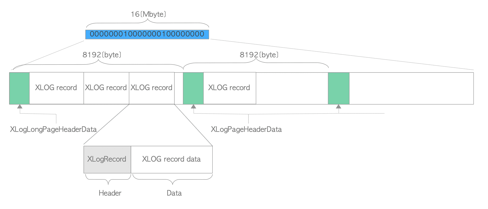

# checkpoint-segments 默认值过大故障处理<a name="ZH-CN_TOPIC_0000001070828243"></a>

## 适用版本<a name="section175831222201911"></a>

openGauss 1.0.1 build 或更早的版本。

## 故障现象<a name="section32035215196"></a>

在非归档模式、没有打开流了复制槽时，例如：

```
postgres=# show archive_mode;
 archive_mode
--------------
 off
(1 row)
postgres-# select * from pg_replication_slots;
 pg_xlog_location_diff | slot_name | plugin | slot_type | datoid | database | active | xmin | catalog_xmin | restart_lsn | dummy_standby
-----------------------+-----------+--------+-----------+--------+----------+--------+------+--------------+-------------+---------------
(0 rows)
```

openGauss 所产生的 WAL 日志会在 pg_xlog 目录下无限增长。

1.检查和 WAL 日志相关的参数。

```
postgres=# show checkpoint_segments;
 checkpoint_segments
---------------------
 64
(1 row)
postgres=# show checkpoint_completion_target;
 checkpoint_completion_target
------------------------------
 0.5
(1 row)
postgres=# show wal_keep_segments;
 wal_keep_segments
-------------------
 16(1 row)
```

- WAL 日志文件：

  openGauss 将 WAL 日志记录写入存储在 pg_xlog 子目录中的 WAL 段文件之一中，如果旧文件已被填充，则切换为新文件。WAL 文件的数量将根据以下几个配置参数以及服务器活动而变化。

- WAL 日志文件的数量主要由以下三个参数控制：

  checkpoint_segments，checkpoint_completion_target 和 wal_keep_segments。

  其数量通常大于 以下两种情形下会自动清理：

  - （2+checkpoint_completion_target）×checkpoint_segments+1
  - checkpoint_segments+wal_keep_segments+1

    2.当对数据库起启 1000 个（包含 insert）并发持续一段时间之后，pg_xlog 中日志文件会无限增多。

```
--并发的SQL：
begin;
select /*1*/c4,c8,c2,c3,c9,c1,c12 from gaussdb.T1 where c1 ='536e32a24bd6add28b7b2b0afa2dc071';
update /*2*/gaussdb.T1 set c8 = 1  where c1 = (select c1 from (select c1 from gaussdb.t1 where c1>'ABCDEFHIJKG' limit 600) order by random() limit 1);
insert /*3*/into gaussdb.T5 select TO_HEX((random()*(2*10^9))::integer)|| TO_HEX((random()*(2*10^9))::integer), rpad('*',4000,'*'),floor(random()*(2-0)+0),to_char(sysdate,'YYYYMMDDHH24Miss');
select /*4*/  c1,c2 from gaussdb.T9 where c2 = '649b6f83dd7c09802a4db01bf6f60e09';
select /*5*/  c3 from gaussdb.T4 where c2  = '936d8e56c15519f1311776e67afec6ad';
insert /*11*/into gaussdb.T6 select TO_HEX((random()*(2*10^9))::integer)|| TO_HEX((random()*(2*10^9))::integer),rpad('*',4000,'*'),floor(random()*(2-0)+0) ,to_char(sysdate,'YYYYMMDDHH24Miss');
select /*6*/  c2 from  gaussdb.T3 where c1= '69c24b9556de148b798a0be38b12f214bf2f95495be47f76a4dce485d8259ca4';
select /*7*/  c1,c4 from gaussdb.T8 where c7= '92a42e90cd73ad0ec5c51b57f20efb91';
select /*8*/  c2,c3 from gaussdb.T5 where c1 = '69d26e7833f5da78afc944407d68d58b';
select /*9*/c3,c4 from gaussdb.T4 where c1 = '577527b30a83d08ba4a95f2bf42add89b3ccc1fb0560e8e1a15f45dde8ff0879';
insert /*10*/into gaussdb.T2 select TO_HEX((random()*(2*10^9))::integer)|| TO_HEX((random()*(2*10^9))::integer),md5(random()::text),md5(random()::text),md5(random()::text),TO_HEX((random()*(2*10^9))::integer)|| TO_HEX((random()*(2*10^9))::integer),floor(random()*(19999999999-10000000001)+10000000001) ,floor(random()*(2-0)+0),floor(random()*(3-1)+1),floor(random()*(3-1)+1) ,to_char(sysdate,'YYYYMMDD'),floor(random()*(3-1)+1) ,to_char(sysdate,'YYYYMMDDHH24Miss'),to_char(sysdate,'YYYYMMDDHH24Miss') ;
end;

--查看pg_xlog目录及文件个数
[root@bms-f408-0001 dn1]# du -sm * | sort -nr|head
31360    pg_xlog
1173      base
418       pg_location
[omm@bms-f408-0001 ~]$ cd /opt/data/cluster/dn1/pg_xlog
[omm@bms-f408-0001 pg_xlog]$ ls -lR|grep "^-"|wc -l
1960
```

## 故障原因<a name="section378413518281"></a>

引用原文：

In version 9.4（Postgre） or earlier, the parameter _checkpoint_segments_ is a pain in the neck. If it is set at a small number, checkpoint occurs frequently, which causes a decrease in performance, whereas if set at a large number, the huge disk space is always required for the WAL files, some of which is not always necessary.

简单描述：

当前数据库如果使用或者基于内核开发（Postgre9.4 或者更早的版本），checkpoint_segments =64 的默认值会使得数据库在 pg_xlog 目录中无限生成 WAL 日志文件，从而会引发空间不足的问题。

## 解决方案<a name="section347116018318"></a>

1.  在线修改 checkpoint_segments 的默认参数（64）到更小\(16、8、4 都可以\)。例如：alter system set to checkpoint_segments = 8 ;
2.  或修改当前版本中 checkpoint_segments 的默认值到更小（16、8、4）。
3.  或使用或者基于内核开发（Postgre9.5 的版本）。

- Write Ahead Logging — WAL 概述：

在计算机科学领域，WAL 是 Write Ahead Logging 的首字母缩写，它是将更改和操作都写入事务日志的协议或规则。而在 openGauss 数据库中，WAL 是 Write Ahead Log 的首字母缩写也是用作事务日志的同义词，用于写入事务日志（WAL）有关的已实现机制。可以理解为 oracle 数据库中的 redolog。

- 关于 WAL Segment：

默认情况下，WAL Segment 是一个 16 MB 的文件，它在内部分成 8192 字节（8 KB）的页面。第一页具有由结构 XLogLongPageHeaderData 定义的标头数据，而所有其他页的标题具有由结构 XLogPageHeaderData 定义的页信息。在页面标题之后，XLOG 记录从头开始按降序写入每个页面。图例如下：



- WAL Segment 文件管理

openGauss 将 XLOG 记录写入存储在 pg_xlog 子目录中，如果旧文件已被填充，则切换为新文件。WAL 文件的数量将根据几个配置参数以及服务器活动而变化。WALSegment 文件的数量主要由以下三个参数控制：checkpoint_segments，checkpoint_completion_target 和 wal_keep_segments。
