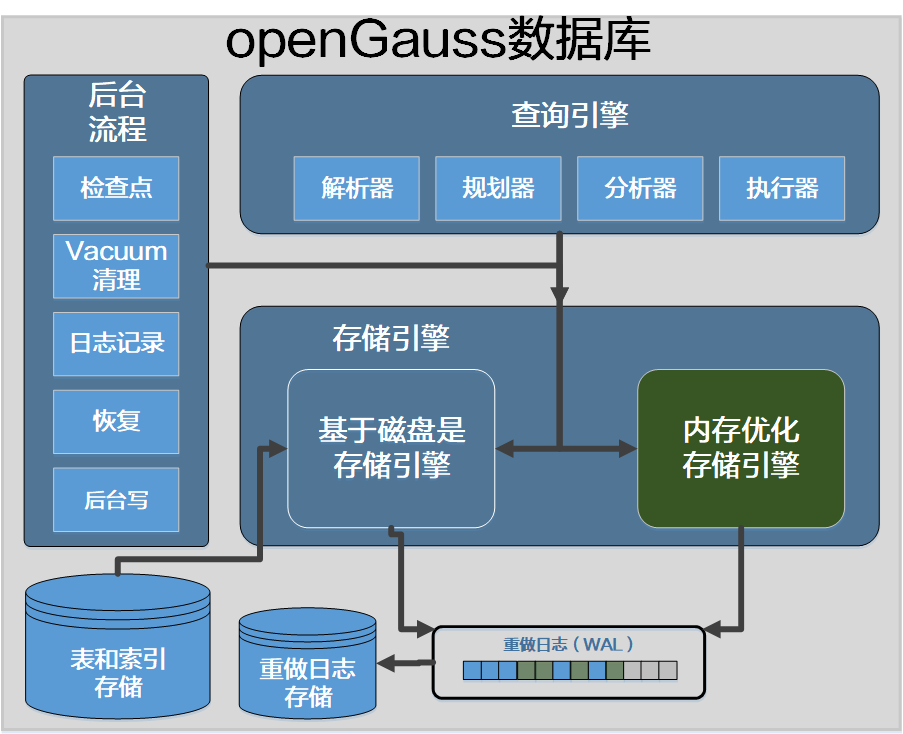

# openGauss 内存优化表最佳实践<a name="ZH-CN_TOPIC_0000001070180055"></a>

## 适用版本<a name="section164378545457"></a>

openGauss 1.0.1 build 和更高版本。

## 用途<a name="section178711410124713"></a>

概述 MOT（内存优化表）的特性，如何在 openGauss 数据库中创建和使用 MOT。

## MOT 概述<a name="section179624574617"></a>

openGauss 引入了 MOT 存储引擎，它是一种事务性行存储，针对多核和大内存服务器进行了优化。MOT 是 openGauss 数据库最先进的生产级特性（Beta 版本），它为事务性工作负载提供更高的性能。MOT 完全支持 ACID 特性，并包括严格的持久性和高可用性支持。企业可以在关键任务、性能敏感的在线事务处理（OLTP）中使用 MOT，以实现高性能、高吞吐、可预测低延迟以及多核服务器的高利用率。



**使用 MOT**

1.  授予用户权限

    ```
    postgres=# select usename,usesysid from pg_user;
    usename | usesysid
    ---------+----------
    omm     |       10
    (1 row)
    要使omm用户能够创建和访问MOT（DDL、DML、SELECT），以下语句只执行一次
    GRANT USAGE ON FOREIGN SERVER mot_server TO omm;
    ```

2.  创建/删除 MOT

    检查参数

    ```
    postgres=# show enable_incremental_checkpoint;
    enable_incremental_checkpoint
    ------------------------------
    on
    ```

    如果 enable_incremental_checkpoint 显示为 on，则修改为 off，并重启数据库

    ```
    alter system set enable_incremental_checkpoint='off';
    gs_om -t stop
    gs_om -t start
    postgres=# show enable_incremental_checkpoint;
    enable_incremental_checkpoint
    -------------------------------
    off
    (1 row)
    ```

    创建 MOT 表 mot_1，并创建索引

    ```
    postgres=# create FOREIGN table mot_1
    postgres-# (o_w_id       integer      not null,
    postgres(#  o_d_id       integer      not null,
    postgres(#  o_id         integer      not null,
    postgres(#  o_c_id       integer not null,
    postgres(#  o_carrier_id integer,
    postgres(#  o_ol_cnt     integer,
    postgres(#  o_all_local  integer,
    postgres(#  o_entry_d    timestamp,
    postgres(#  primary key (o_w_id, o_d_id, o_id));
    NOTICE:  CREATE FOREIGN TABLE / PRIMARY KEY will create constraint "mot_1_pkey" for foreign table "mot_1"
    CREATE FOREIGN TABLE

    postgres=# create index  mot_1_index1 on mot_1(o_w_id, o_d_id, o_c_id, o_id) ;
    CREATE INDEX
    ```

    插入 200000 随机数据。

    ```
    postgres=# insert into mot_1 select ceil(random()*(10000-1)+1),ceil(random()*(10000-10)+10),ceil(random()*(10000-100)+100),ceil(random()*(10000-1)+1),ceil(random()*(1000-1)+1),ceil(random()*(1000-1)+1),ceil(random()*(1000-1)+1),sysdate
    postgres-# FROM generate_series(1,200000);
    INSERT 0 200000
    Time: 4202.304 ms
    ```

    通过执行计划查看 MOT 表

    说明：执行计划中-\>Memory Engine 表示从内存中获取数据

    ```
    postgres=# explain select * from mot_1;
    QUERY PLAN
    -------------------------------------------------------------------
    Foreign Scan on mot_1  (cost=0.10..20000.00 rows=200000 width=36)
    ->  Memory Engine returned rows: 0
    (2 rows)
    ```

    select 所有列数据不包含 where 条件

    ```
    postgres=# select * from mot_1 limit 5;
    o_w_id | o_d_id | o_id | o_c_id | o_carrier_id | o_ol_cnt | o_all_local |      o_entry_d
    --------+--------+------+--------+--------------+----------+-------------+---------------------
    2 |    291 | 8858 |   4033 |          274 |      681 |         655 | 2020-11-26 11:03:34
    2 |    962 | 7972 |   1996 |          684 |      646 |         399 | 2020-11-26 11:03:34
    2 |   1750 | 1415 |   1597 |          758 |      508 |         163 | 2020-11-26 11:03:34
    2 |   2315 | 2449 |   1049 |          418 |      585 |          61 | 2020-11-26 11:03:34
    2 |   2444 | 4531 |    274 |          461 |      120 |         503 | 2020-11-26 11:03:34
    (5 rows)
    ```

    select 所有列数据包含索引列

    _说明：内存表可以通过索引访问数据\_\_ Index Scan on: mot_1_pkey1_

    ```
    postgres=# explain select * from mot_1 where o_w_id = 2 limit 4;
    QUERY PLAN
    --------------------------------------------------------------------
    Limit  (cost=0.00..4.00 rows=4 width=36)
    ->  Foreign Scan on mot_1  (cost=0.00..211.00 rows=211 width=36)
    ->  Memory Engine returned rows: 0
    ->  Index Scan on: mot_1_pkey1
    Index Cond: (mot_1.o_w_id = 2)

    postgres=#  select * from mot_1 where o_w_id = 2 limit 4;
    o_w_id | o_d_id | o_id | o_c_id | o_carrier_id | o_ol_cnt | o_all_local |      o_entry_d
    --------+--------+------+--------+--------------+----------+-------------+---------------------
    2 |    291 | 8858 |   4033 |          274 |      681 |         655 | 2020-11-26 11:03:34
    2 |    962 | 7972 |   1996 |          684 |      646 |         399 | 2020-11-26 11:03:34
    2 |   1750 | 1415 |   1597 |          758 |      508 |         163 | 2020-11-26 11:03:34
    2 |   2315 | 2449 |   1049 |          418 |      585 |          61 | 2020-11-26 11:03:34
    ```

    两张表关联查询

    新建 MOT 表 mot_2

    ```
    postgres=# create FOREIGN table mot_2
    postgres-# (o_w_id       integer      not null,
    postgres(#  o_d_id       integer      not null,
    postgres(#  o_id         integer      not null);
    CREATE FOREIGN TABLE
    Time: 3.359 ms
    ```

    查看执行计划（mot_2 表无索引），通过 Hash Join 的方式做表关联

    ```
    postgres=# explain select a.o_w_id,b.o_id from mot_2 a,mot_1 b where a.o_w_id = b.o_w_id;
    QUERY PLAN
    --------------------------------------------------------------------------------
    Hash Join  (cost=11250.10..1156750.00 rows=500 width=8)
    Hash Cond: (b.o_w_id = a.o_w_id)
    ->  Foreign Scan on mot_1 b  (cost=0.10..20000.00 rows=200000 width=8)
    ->  Memory Engine returned rows: 0
    ->  Hash  (cost=10000.00..10000.00 rows=100000 width=4)
    ->  Foreign Scan on mot_2 a  (cost=0.10..10000.00 rows=100000 width=4)
    ->  Memory Engine returned rows: 0
    (7 rows)
    ```

    查看执行计划（mot_2 有单列索引），通过访问索引 Nested Loop 的方式访问数据

    ```
    postgres=# create index  mot_2_index1 on mot_1(o_w_id) ;
    CREATE INDEX
    Time: 437.916 ms

    postgres=# explain select a.o_w_id,b.o_id from mot_2 a,mot_1 b where a.o_w_id = b.o_w_id;
    QUERY PLAN
    --------------------------------------------------------------------------
    Nested Loop  (cost=0.10..111000.00 rows=500 width=8)
    ->  Foreign Scan on mot_2 a  (cost=0.10..10000.00 rows=100000 width=4)
    ->  Memory Engine returned rows: 0
    ->  Foreign Scan on mot_1 b  (cost=0.00..1.00 rows=1 width=8)
    Filter: (a.o_w_id = o_w_id)
    ->  Memory Engine returned rows: 0
    ->  Index Scan on: mot_2_index1
    Index Cond: (b.o_w_id = $0)
    (8 rows)
    ```

    update 单表非索引字段

    将 update o_w_id=2 的非索引字段

    ```
    postgres=# select count(*) from mot_1 where o_w_id=2;
    count
    -------
    21
    (1 row)
    ```

    已更新 21 条

    ```
    postgres=# update mot_1 set o_all_local = 2020,o_ol_cnt=9090 where o_w_id=2;
    UPDATE 21
    Time: 0.672 ms
    ```

    update 单表索引字段

    将 update o_w_id=2 的索引字段

    ```
    postgres=# select count(*) from mot_1 where o_w_id=2;
    count
    -------
    21
    (1 row)
    ```

    无法更新

    ```
    postgres=# update mot_1 set o_w_id=2020 where o_w_id=2;
    ERROR:  Update of indexed column is not supported for memory table
    Time: 0.302 ms
    ```

    update 含有子查询

    mot_2 o_w_id = 2 的数据\(2000 条\)

    ```
    postgres=# select count(o_w_id) from mot_2;
    count
    -------
    2000
    (1 row)
    ```

    更新 mot_1 中 o_w_id in（select o_w_id from mot_2 where o_w_id = 2）的数据

    ```
    postgres=# update mot_1 set o_all_local = 2020,o_ol_cnt=9090 where o_w_id in (select o_w_id from mot_2 where o_w_id = 2);
    UPDATE 21
    Time: 13.429 ms
    ```

    查询 mot_1 中 o_all_local = 2020 and o_ol_cnt=9090 的数据

    ```
    postgres=# Select * from mot_1 where o_all_local = 2020 and o_ol_cnt=9090;
    o_w_id | o_d_id | o_id | o_c_id | o_carrier_id | o_ol_cnt | o_all_local |      o_entry_d
    --------+--------+------+--------+--------------+----------+-------------+---------------------
    2 |    291 | 8858 |   4033 |          274 |     9090 |        2020 | 2020-11-26 11:03:34
    2 |    962 | 7972 |   1996 |          684 |     9090 |        2020 | 2020-11-26 11:03:34
    2 |   1750 | 1415 |   1597 |          758 |     9090 |        2020 | 2020-11-26 11:03:34
    2 |   2315 | 2449 |   1049 |          418 |     9090 |        2020 | 2020-11-26 11:03:34
    2 |   2444 | 4531 |    274 |          461 |     9090 |        2020 | 2020-11-26 11:03:34
    2 |   2761 | 2627 |   7693 |          169 |     9090 |        2020 | 2020-11-26 11:03:34
    2 |   3300 | 3947 |    167 |          997 |     9090 |        2020 | 2020-11-26 11:03:34
    2 |   3921 |  424 |   4765 |          557 |     9090 |        2020 | 2020-11-26 11:03:34
    2 |   4216 | 2304 |   4065 |          829 |     9090 |        2020 | 2020-11-26 11:03:34
    2 |   5401 | 8904 |   8009 |          856 |     9090 |        2020 | 2020-11-26 11:03:34
    2 |   5416 | 9478 |   2939 |          959 |     9090 |        2020 | 2020-11-26 11:03:34
    2 |   5696 | 9749 |   7707 |          330 |     9090 |        2020 | 2020-11-26 11:03:34
    2 |   5935 | 2938 |    324 |          210 |     9090 |        2020 | 2020-11-26 11:03:34
    2 |   6680 | 4998 |   5906 |          439 |     9090 |        2020 | 2020-11-26 11:03:34
    2 |   6983 | 2343 |     18 |           87 |     9090 |        2020 | 2020-11-26 11:03:34
    2 |   7274 | 3141 |   6374 |          941 |     9090 |        2020 | 2020-11-26 11:03:34
    2 |   7292 | 6505 |   9174 |          989 |     9090 |        2020 | 2020-11-26 11:03:34
    2 |   7740 | 3702 |   8976 |          958 |     9090 |        2020 | 2020-11-26 11:03:34
    2 |   7828 | 7520 |   1161 |          387 |     9090 |        2020 | 2020-11-26 11:03:34
    2 |   8223 | 9573 |   7540 |          622 |     9090 |        2020 | 2020-11-26 11:03:34
    2 |   8327 | 4427 |   8846 |          519 |     9090 |        2020 | 2020-11-26 11:03:34
    (21 rows)

    Time: 110.945 ms
    ```

    delete 单表（删除 o_w_id = 3 的所有数据）

    ```
    postgres=# select count(*) from mot_1 where  o_w_id = 3;
    count
    -------
    26
    (1 row)

    postgres=# delete from mot_1 where o_w_id = 3;
    DELETE 26
    postgres=# commit;
    COMMIT
    postgres=#  select count(*) from mot_1 where  o_w_id = 3;
    count
    -------
    0
    (1 row)
    ```

    delete 带有子查询（删除在 mot_2 表中 o_w_id = 5 的 mot_1 表的所有数据）

    ```
    postgres=# delete from mot_1 where o_w_id in (select o_w_id from mot_2 where o_w_id = 5 );
    DELETE 15
    postgres=# commit;
    COMMIT
    ```

    truncate 操作（truncate mot_2 表）

    ```
    postgres=# truncate table mot_2;
    TRUNCATE TABLE
    ```

    事务的 commit 和 rollback

    truncate（commit）

    结论：

    1、truncate 操作可以 rollback。

    2、当会话 1 执行 truncate 之后（没有 commit），会话 2 对该表执行 select 操作处于等待状态。

    3、会话 1 执行 commit 或者 rollback 之后，其它会话可以正常 dml 操作。

    会话 1

    ```
    postgres=# truncate table mot_2;
    TRUNCATE TABLE
    postgres=# select count(*) from mot_2;
    count
    -------
    0
    (1 row)
    postgres=# commit;
    COMMIT
    postgres=#
    ```

    会话 2

    ```
    postgres=# select * from mot_2;
    等待状态…
    等待会话1 commit之后
    postgres=# select * from mot_2;
    o_w_id | o_d_id | o_id
    --------+--------+------
    (0 rows)
    ```

    truncate（rollback）

    insert mot_2 表 2000 条数据

    ```
    postgres=# insert into mot_2 select ceil(random()*(10000-1)+1),ceil(random()*(10000-10)+10),ceil(random()*(10000-100)+100) FROM generate_series(1,2000);

    INSERT 0 2000
    postgres=# postgres=# commit;
    COMMIT
    postgres=# select count(*) from mot_2;
    count
    -------
    2000
    (1 row)
    ```

    ```
    postgres=# truncate table mot_2;
    TRUNCATE TABLE
    postgres=# select count(*) from mot_2;
    count
    -------
    0
    (1 row)
    postgres=# rollback;
    ROLLBACK
    postgres=# select count(*) from mot_2;
    count
    -------
    2000
    (1 row)
    ```

    update\(commit 和 rollback\)

    结论：

    1、会话 1 做 update 操作（commit 之前），会话 2 依然可以对同一批数据做出不同的更改，不会出现悲观锁等待。

    2、最终的数据以最先 commit 的操作为准。

    会话 1

    ```
    select * from mot_2 where o_w_id = 5573;
    postgres=# select * from mot_2 where o_w_id = 5573;
    o_w_id | o_d_id | o_id
    --------+--------+------
    5573 |   8453 | 7777
    5573 |   2162 | 7777
    (2 rows)
    ```

    会话 2

    ```
    select * from mot_2 where o_w_id = 5573;
    postgres=# select * from mot_2 where o_w_id = 5573;
    o_w_id | o_d_id | o_id
    --------+--------+------
    5573 |   8453 | 7777
    5573 |   2162 | 7777
    (2 rows)
    ```

    会话 1

    ```
    postgres=# update mot_2 set o_id = 9999 where o_w_id = 5573;
    UPDATE 2
    ```

    会话 2

    ```
    postgres=# update mot_2 set o_id = 3333 where o_w_id = 5573;
    UPDATE 2
    ```

    --在会话 1 没有 commit 或者 rolllback 时，会话 2 可以修改同一批数据，修改成功

    会话 1 --看到的是当前会话已修改 o_id=9999 的数据

    ```
    select * from mot_2 where o_w_id = 5573;
    postgres=# select * from mot_2 where o_w_id = 5573;
    o_w_id | o_d_id | o_id
    --------+--------+------
    5573 |   8453 | 9999
    5573 |   2162 | 9999
    (2 rows)
    ```

    会话 2 --看到的是当前会话已修改 o_id=3333 的数据

    ```
    postgres=# select * from mot_2 where o_w_id = 5573;
    o_w_id | o_d_id | o_id
    --------+--------+------
    5573 |   8453 | 3333
    5573 |   2162 | 3333
    (2 rows)
    ```

    会话 1 --先提交

    ```
    postgres=# commit;
    COMMIT
    postgres=# select * from mot_2 where o_w_id = 5573;
    o_w_id | o_d_id | o_id
    --------+--------+------
    5573 |   8453 | 9999
    5573 |   2162 | 9999
    (2 rows)
    ```

    会话 2 --不提交，查询依然 o_id=3333 的数据

    ```
    postgres=# select * from mot_2 where o_w_id = 5573;
    o_w_id | o_d_id | o_id
    --------+--------+------
    5573 |   8453 | 3333
    5573 |   2162 | 3333
    (2 rows)
    ```

    会话 2 --后提交

    ```
    postgres=# commit;
    WARNING:  AbortTransaction while in COMMIT state
    ERROR:  Commit: could not serialize access due to concurrent update(0)
    postgres=# select * from mot_2 where o_w_id = 5573;
    o_w_id | o_d_id | o_id
    --------+--------+------
    5573 |   8453 | 9999
    5573 |   2162 | 9999
    (2 rows)
    ```

    insert\(commit 和 rollback\)

    结论：

    1、会话 1 做 insert 操作（commit 之前），会话 1 可以查看新插入的数据，会话 2 无法查看到新插入的数据。

    2、等会话 1 做了 commit 之后，会话 2 可以看见新插入的数据。

    会话 1

    ```
    postgres=# \set AUTOCOMMIT off
    postgres=# select count(*) from mot_2;
    count
    -------
    2000
    (1 row)
    postgres=# insert into mot_2 select ceil(random()*(10000-1)+1),ceil(random()*(10000-10)+10),ceil(random()*(10000-100)+100) FROM generate_series(1,2000);
    INSERT 0 2000
    postgres=# postgres=# select count(*) from mot_2;
    count
    -------
    4000
    (1 row)
    postgres=# commit;
    COMMIT
    ```

    会话 2

    ```
    postgres=# \set AUTOCOMMIT off
    postgres=# select count(*) from mot_2;
    count
    -------
    2000
    (1 row)

    postgres=# select count(*) from mot_2;
    count
    -------
    4000
    (1 row)
    ```

    update\(commit 和 rollback\)

    结论：和 insert 原理相同

    会话 1

    ```
    postgres=# select count(*) from mot_1 where o_w_id=2;
    count
    -------
    21
    (1 row)

    postgres=#
    postgres=# update mot_1 set o_all_local = 5555 where o_w_id=2;
    UPDATE 21
    postgres=# select count(*) from mot_1 where o_w_id=2 and o_all_local =5555;
    count
    -------
    21
    (1 row)

    postgres=# commit;
    COMMIT
    ```

    会话 2

    ```
    postgres=# select count(*) from mot_1 where o_w_id=2 and o_all_local =5555;
    count
    -------
    0
    (1 row)

    postgres=# select count(*) from mot_1 where o_w_id=2 and o_all_local =5555;
    count
    -------
    21
    (1 row)
    ```

    数据库 stop、start 之后 MOT 表的数据是否存在。

    结论：数据库 MOT 表的数据依然存在

    ```
    postgres=# select count(*) from mot_1;
    count
    --------
    199959
    (1 row)
    postgres=# select count(*) from mot_2;
    count
    -------
    4000
    (1 row)
    postgres-# \q
    [omm@bms-f408-0001 ~]$ gs_om -t stop
    Stopping cluster.
    =========================================
    Successfully stopped cluster.
    =========================================
    End stop cluster.
    [omm@bms-f408-0001 ~]$ gs_om -t start
    Starting cluster.
    =========================================
    =========================================
    Successfully started.
    [omm@bms-f408-0001 ~]$ gsql -d postgres -p26000
    gsql ((openGauss 1.0.1 build 3a33fded) compiled at 2020-11-04 15:58:51 commit 0 last mr  )
    Non-SSL connection (SSL connection is recommended when requiring high-security)
    Type "help" for help.

    postgres=# select count(*) from mot_1;
    count
    --------
    199959
    (1 row)

    postgres=# select count(*) from mot_2;
    count
    -------
    4000
    (1 row)
    ```

    通过 create table as 从实体表创建 MOT 表。

    结论：不支持

    ```
    postgres=# create table tbl_1(aid integer not null,bid integer);
    CREATE TABLE
    postgres=# insert into tbl_1 values(1001,9001);
    INSERT 0 1
    postgres=# create FOREIGN table mot_from_tbl_1 as select * from tbl_1;
    ERROR:  syntax error at or near "as"
    LINE 1: create FOREIGN table mot_from_tbl_1 as select * from tbl_1;
    ^
    postgres=# create table tbl_2 as select * from tbl_1;
    ```

    通过 create forrign table as 从 MOT 表创建 MOT 表

    结论：不支持

    ```
    postgres=# create FOREIGN table mot_3 as select * from mot_2;
    ERROR:  syntax error at or near "as"
    LINE 1: create FOREIGN table mot_3 as select * from mot_2;
    ^
    postgres=# create FOREIGN table mot_3 select * from mot_2;
    ERROR:  syntax error at or near "select"
    LINE 1: create FOREIGN table mot_3 select * from mot_2;
    ```

    MOT 表相互通过 insert into select 的方式插入数据。

    结论：支持

    ```
    postgres=# create FOREIGN table mot_3
    postgres-# (o_w_id       integer      not null,
    postgres(#  o_d_id       integer      not null,
    postgres(#  o_id         integer      not null);
    CREATE FOREIGN TABLE
    postgres=# insert into mot_3 select * from mot_2;
    INSERT 0 4000
    postgres=# commit;
    ```

    通过 insert into select 的方式从普通表向 MOT 表插入数据。

    结论：不支持

    ```
    postgres=# create table tbl_1(aid integer not null,bid integer);
    ERROR:  relation "tbl_1" already exists
    postgres=# insert into tbl_1 values(1001,9001);
    INSERT 0 1
    postgres=# create FOREIGN table mot_tbl_1(aid integer not null,bid integer);
    CREATE FOREIGN TABLE
    postgres=# select count(*) from mot_tbl_1;
     count
    -------
         0
    (1 row)

    postgres=# insert into mot_tbl_1 select * from tbl_1;
    ERROR:  Cross storage engine query is not supported
    ```

    openGauss MOT 和其它数据库相关特性对比

    <a name="table167790282200"></a>
    <table><tbody><tr id="row92998293205"><td class="cellrowborder"  width="8.48084808480848%"><p id="p1929952913208"><a name="p1929952913208"></a><a name="p1929952913208"></a><strong id="b52998297206"><a name="b52998297206"></a><a name="b52998297206"></a>序号</strong></p>
    </td>
    <td class="cellrowborder"  width="44.404440444044404%"><p id="p529992982010"><a name="p529992982010"></a><a name="p529992982010"></a><strong id="b7299162972010"><a name="b7299162972010"></a><a name="b7299162972010"></a>对比项</strong></p>
    </td>
    <td class="cellrowborder"  width="21.66216621662166%"><p id="p03001329192017"><a name="p03001329192017"></a><a name="p03001329192017"></a><strong id="b19300132918209"><a name="b19300132918209"></a><a name="b19300132918209"></a>MOT</strong></p>
    </td>
    <td class="cellrowborder"  width="25.452545254525454%"><p id="p2030082920204"><a name="p2030082920204"></a><a name="p2030082920204"></a><strong id="b83007298201"><a name="b83007298201"></a><a name="b83007298201"></a>In Memory</strong></p>
    </td>
    </tr>
    <tr id="row83009294200"><td class="cellrowborder"  width="8.48084808480848%"><p id="p0300192914201"><a name="p0300192914201"></a><a name="p0300192914201"></a>1</p>
    </td>
    <td class="cellrowborder"  width="44.404440444044404%"><p id="p530082910205"><a name="p530082910205"></a><a name="p530082910205"></a>数据存储方式</p>
    </td>
    <td class="cellrowborder"  width="21.66216621662166%"><p id="p1130019292201"><a name="p1130019292201"></a><a name="p1130019292201"></a>行</p>
    </td>
    <td class="cellrowborder"  width="25.452545254525454%"><p id="p123006296205"><a name="p123006296205"></a><a name="p123006296205"></a>行、列</p>
    </td>
    </tr>
    <tr id="row12300102972012"><td class="cellrowborder"  width="8.48084808480848%"><p id="p8300132992016"><a name="p8300132992016"></a><a name="p8300132992016"></a>2</p>
    </td>
    <td class="cellrowborder"  width="44.404440444044404%"><p id="p53007292202"><a name="p53007292202"></a><a name="p53007292202"></a>将磁盘表的数据直接转换到内存</p>
    </td>
    <td class="cellrowborder"  width="21.66216621662166%"><p id="p11300182952018"><a name="p11300182952018"></a><a name="p11300182952018"></a>&ucirc;</p>
    </td>
    <td class="cellrowborder"  width="25.452545254525454%"><p id="p7300929202011"><a name="p7300929202011"></a><a name="p7300929202011"></a>&uuml;</p>
    </td>
    </tr>
    <tr id="row7300629132016"><td class="cellrowborder"  width="8.48084808480848%"><p id="p2301929132018"><a name="p2301929132018"></a><a name="p2301929132018"></a>3</p>
    </td>
    <td class="cellrowborder"  width="44.404440444044404%"><p id="p63011429182012"><a name="p63011429182012"></a><a name="p63011429182012"></a>对内存表压缩</p>
    </td>
    <td class="cellrowborder"  width="21.66216621662166%"><p id="p4301102972015"><a name="p4301102972015"></a><a name="p4301102972015"></a>&ucirc;</p>
    </td>
    <td class="cellrowborder"  width="25.452545254525454%"><p id="p9301112915209"><a name="p9301112915209"></a><a name="p9301112915209"></a>&uuml;</p>
    </td>
    </tr>
    <tr id="row133011729102020"><td class="cellrowborder"  width="8.48084808480848%"><p id="p230114299209"><a name="p230114299209"></a><a name="p230114299209"></a>4</p>
    </td>
    <td class="cellrowborder"  width="44.404440444044404%"><p id="p8301172992015"><a name="p8301172992015"></a><a name="p8301172992015"></a>分区</p>
    </td>
    <td class="cellrowborder"  width="21.66216621662166%"><p id="p19301329122010"><a name="p19301329122010"></a><a name="p19301329122010"></a>&ucirc;</p>
    </td>
    <td class="cellrowborder"  width="25.452545254525454%"><p id="p0301132914207"><a name="p0301132914207"></a><a name="p0301132914207"></a>&uuml;</p>
    </td>
    </tr>
    <tr id="row133017297208"><td class="cellrowborder"  width="8.48084808480848%"><p id="p63021829122011"><a name="p63021829122011"></a><a name="p63021829122011"></a>5</p>
    </td>
    <td class="cellrowborder"  width="44.404440444044404%"><p id="p10302172962015"><a name="p10302172962015"></a><a name="p10302172962015"></a>truncate 支持rollback</p>
    </td>
    <td class="cellrowborder"  width="21.66216621662166%"><p id="p1830215296204"><a name="p1830215296204"></a><a name="p1830215296204"></a>&uuml;</p>
    </td>
    <td class="cellrowborder"  width="25.452545254525454%"><p id="p5302152942015"><a name="p5302152942015"></a><a name="p5302152942015"></a>未知</p>
    </td>
    </tr>
    <tr id="row730218295201"><td class="cellrowborder"  width="8.48084808480848%"><p id="p12302112942019"><a name="p12302112942019"></a><a name="p12302112942019"></a>6</p>
    </td>
    <td class="cellrowborder"  width="44.404440444044404%"><p id="p16302202919202"><a name="p16302202919202"></a><a name="p16302202919202"></a>乐观锁</p>
    </td>
    <td class="cellrowborder"  width="21.66216621662166%"><p id="p4302102972019"><a name="p4302102972019"></a><a name="p4302102972019"></a>&uuml;</p>
    </td>
    <td class="cellrowborder"  width="25.452545254525454%"><p id="p230242972018"><a name="p230242972018"></a><a name="p230242972018"></a>未知</p>
    </td>
    </tr>
    <tr id="row18302182902018"><td class="cellrowborder"  width="8.48084808480848%"><p id="p123021529192013"><a name="p123021529192013"></a><a name="p123021529192013"></a>7</p>
    </td>
    <td class="cellrowborder"  width="44.404440444044404%"><p id="p1230292992017"><a name="p1230292992017"></a><a name="p1230292992017"></a>支持多表关联查询</p>
    </td>
    <td class="cellrowborder"  width="21.66216621662166%"><p id="p19302629122012"><a name="p19302629122012"></a><a name="p19302629122012"></a>&uuml;</p>
    </td>
    <td class="cellrowborder"  width="25.452545254525454%"><p id="p20302182952014"><a name="p20302182952014"></a><a name="p20302182952014"></a>&uuml;</p>
    </td>
    </tr>
    <tr id="row123021329172010"><td class="cellrowborder"  width="8.48084808480848%"><p id="p5302192911208"><a name="p5302192911208"></a><a name="p5302192911208"></a>8</p>
    </td>
    <td class="cellrowborder"  width="44.404440444044404%"><p id="p193031329122016"><a name="p193031329122016"></a><a name="p193031329122016"></a>允许更新索引列</p>
    </td>
    <td class="cellrowborder"  width="21.66216621662166%"><p id="p19303112972014"><a name="p19303112972014"></a><a name="p19303112972014"></a>&ucirc;</p>
    </td>
    <td class="cellrowborder"  width="25.452545254525454%"><p id="p630312952018"><a name="p630312952018"></a><a name="p630312952018"></a>未知</p>
    </td>
    </tr>
    <tr id="row16303162918202"><td class="cellrowborder"  width="8.48084808480848%"><p id="p17303132915201"><a name="p17303132915201"></a><a name="p17303132915201"></a>9</p>
    </td>
    <td class="cellrowborder"  width="44.404440444044404%"><p id="p730312962010"><a name="p730312962010"></a><a name="p730312962010"></a>数据库重启后内存数据依然保留</p>
    </td>
    <td class="cellrowborder"  width="21.66216621662166%"><p id="p17303129122013"><a name="p17303129122013"></a><a name="p17303129122013"></a>&uuml;</p>
    </td>
    <td class="cellrowborder"  width="25.452545254525454%"><p id="p2303112972013"><a name="p2303112972013"></a><a name="p2303112972013"></a>&uuml;</p>
    </td>
    </tr>
    </tbody>
    </table>

    <!-- >   -->

    **说明：**

    > 在关系数据库管理系统里，乐观并发控制（又名“乐观锁”，Optimistic Concurrency Control，缩写“OCC”）是一种并发控制的方法。它假设多用户并发的事务在处理时不会彼此互相影响，各事务能够在不产生锁的情况下处理各自影响的那部分数据。在提交数据更新之前，每个事务会先检查在该事务读取数据后，有没有其他事务又修改了该数据。
