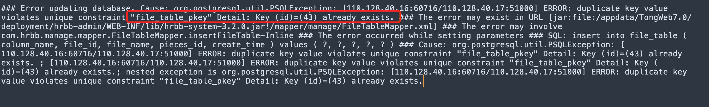
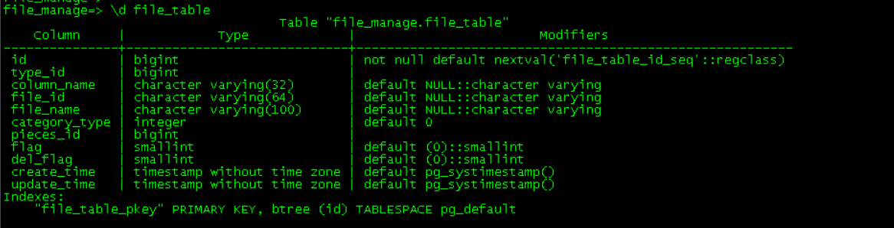

# 使用 MTK 迁移 Mysql 源库后主键自增列导致数据无法插入问题

## 故障背景

用户使用 Mogdb 2.0.1 版本进行业务上线测试，发现在插入数据时，应用日志中提示 primary key 冲突，用户自查业务 SQL 没有问题，接到通知后，招手处理故障。


## 故障描述及根源分析

通过对用户数据表的检查，发现在 id 列上有一个 primary key，并且制定了一个序列器作为自增主键的代替。初步怀疑是 id 中的值，已经超过了序列器的最大值，导致了故障的发生。
分别检查序列器和表.id 字段的最大值，发现果然 max(id)为 474，序列器最大值刚刚 44。

```sql
file_manage=> \d file_table
                                    Table "file_manage.file_table"
    Column     |            Type             |                        Modifiers
---------------+-----------------------------+---------------------------------------------------------
 id            | bigint                      | not null default nextval('file_table_id_seq'::regclass)
 type_id       | bigint                      |
 column_name   | character varying(32)       | default NULL::character varying
 file_id       | character varying(64)       | default NULL::character varying
 file_name     | character varying(100)      | default NULL::character varying
 category_type | integer                     | default 0
 pieces_id     | bigint                      |
 flag          | smallint                    | default (0)::smallint
 del_flag      | smallint                    | default (0)::smallint
 create_time   | timestamp without time zone | default pg_systimestamp()
 update_time   | timestamp without time zone | default pg_systimestamp()

file_manage=> \d file_table_id_seq
   Sequence "file_manage.file_table_id_seq"
    Column     |  Type   |        Value
---------------+---------+---------------------
 sequence_name | name    | file_table_id_seq
 last_value    | bigint  | 44
 start_value   | bigint  | 1
 increment_by  | bigint  | 1
 max_value     | bigint  | 9223372036854775807
 min_value     | bigint  | 1
 cache_value   | bigint  | 1
 log_cnt       | bigint  | 32
 is_cycled     | boolean | f
 is_called     | boolean | t
 uuid          | bigint  | 0
Owned by: file_manage.file_table.id

```




同时查看报错的 id 对应值是否在 file_table 表中是否存在：

```
file_manage=> select count(*) from file_table where id=43;
 count
-------
     1
(1 row)

file_manage=> select count(*) from file_table where id=44;
 count
-------
     1
(1 row)

```


由此，基本上可以确定故障原因在于表中主键列已经保存了一定数量的值，在操作过程中，序列器并没有进行累加，导致序列器 nextval 已经远远小于主节列值，从而引发主键冲突。咨询用户后，用户确实使用过 insert into 语句为数据表插入了部分测试数据库上的数据。

## 故障处理流程

使用语句重新为序列器重置 currval

```
file_manage=> select setval('file_table_id_seq',(select max(id) from file_table));
 setval
--------
    474
(1 row)

```

通知用户重新启动应用进行测试，故障现象消失。故障总结分析本次故障的成因是通过 MTK 进行数据数据迁移时，如果源库是 MySQL，MTK 会通过判断 MySQL 数据表是否存在自增主键，如果存在泽辉建立一个序列器模拟 MySQL 自增主键效果。
但是如果在此类表上进行手动 gs_dump 或者 insert into 操作时，由于在操作过程中指定了主键列的值，并不会推搞序列器的 currval，最会导致在正常的数据增删改之后，出现类似主键冲突的问题。
对应的处理办法是需要在数据插入后，手动进行序列器的 currval 的重置，指向当前主键最大值。
