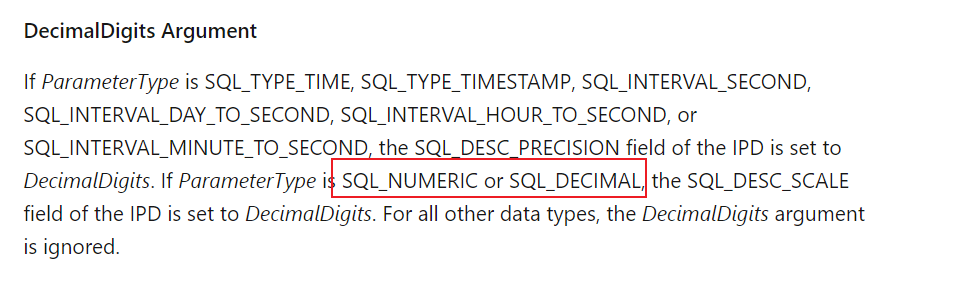
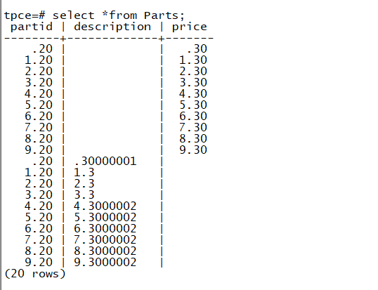
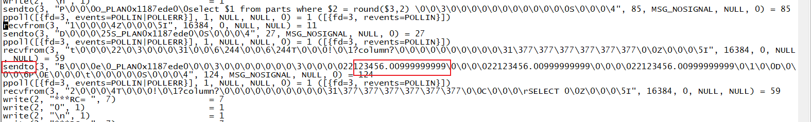

# ODBC 批量 merge 中出现主键冲突的分析

## 一、 文档概括

客户某个 merge 语句运行时，发生主键冲突报错。

经分析，其原因如下：

由于 merge 语句中，ON 里的判断条件（谓词）中存在带精度定义的数字字段，在绑定变量传递过程中，驱动将数值高精度数字传过去，而数据库内的数据已经做了精度限制，导致在符合条件的数据存在的情况下，ON 条件错误地判断为 false；数据库尝试进行插入，插入时，自动转换成限制精度的数字，此时，和数据库内已有的数据发生冲突。

该问题除了 merge 会发生，其他同时满足以下数个条件的 ODBC 程序均有可能出现谓词条件判断错误的问题。

- 数字类型字段在数据库中限定了精度
- 程序中使用绑定变量中将其和该字段进行比较
- 该变量小数部分不为 0
- 绑定变量未使用 SQL_NUMERIC_STRUCT 或者 SQL_CHAR 类型

包括:

```
Select … from … where col_with_precision = ?
Update … set … where col_with_precision = ?
Delete from … where col_with_precision = ?
Merge into .. on (col_with_precision = ?) …
```

对于作为更新数据的 insert/update, 则由于数据库侧会进行精度裁剪，不会出现问题。

如 `insert into .. (col_with_precision)values(?);`

但，无法从内核层面把`col_with_precision = ?`后面的数值进行强行的降精度后对比，不符合常规逻辑。

因此，此问题不适合定义为内核的 bug, 而是属于使用 ODBC 程序时，涉及带精度带小数的数字使用上的一个注意事项。

解决方法：

- 标准用法 A

  调整 SQL, 在 SQL 层面指定准确的数据类型，如：

  ```
  merge INTO Parts using  dual  on partid = $1::numeric(10,2)
  when matched then update set Price = $2
  when not matched then insert values($3,$4)
  ```

- 标准用法 B

  ODBC 绑定变量时使用 SQL_NUMERIC_STRUCT，保证精度信息正确传到数据库，其中精度部分使用数据库指定的精度或者数字本身的精度。

- 绕过的用法 A：

​ ODBC 绑定变量时使用 SQL_CHAR，转成 SQL_CHAR 时使用数据库指定的精度或者数字本身的精度

- 绕过的用法 B：

  在 SQL 中绑定变量部分添加 round 函数, 类似于 round( ? , <精度> )，其中精度部分使用数据库指定的精度或者数字本身的精度。

  ```
  merge INTO Parts using dual on partid = round ($1,2)
  when matched then update set Price = $2
  when not matched then insert values ($3, $4)
  ```

## 二、问题描述

某个 merge 语句运行时，发生主键冲突报错。

## 三、问题分析过程

为了保密，所有 SQL 语句、表结构、数据均作了替换：

### 3.1 报错信息

客户 C 程序通过 ODBC 驱动连接数据库，进行 merge 操作时，报了以下错误：

```
Duplicate key violentes unique constraint PK_tab
```

该错误代表发生主键冲突

### 3.2 SQL 及表结构

SQL 如下：

```
Merge Into test_tab using dual
On (id = $1 and price = $2)
when match then update set qty = $3
When not matched insert (id,price, qty) values($4,$5,$6);
```

其中传入变量 \$1/\$4, \$2/\$5, \$3/\$6 两两相同。

Id,qty 为整数，price 为带小数的数字。

对应表结构如下：

列：Id int, price(numeric(10,2)), qty (int)

主键：(id,price)

### 3.3 Merge 语句逻辑分析

Merge 语句是一个结合 update 和 insert 的 SQL 语句，其含义是，如果判断条件为 true,也就是数据存在， 则执行 update 部分，如果条件为 false, 则执行 insert 部分。

该语句中，判断条件的部分，正好和主键一致，正常情况下，主键对应数据存在，则进行更新，不存在才会 insert, 因此，正常情况下,merge 语句不会出现主键冲突的问题。

### 3.4 计算机处理带小数的精度问题

计算机内部使用二进制来代表数字，而日常中使用十进制来代表数字。由于十进制数字的小数点后部分转换成二进制，有一定可能出现除不尽的情况。因此，有时候会出现输入浮点数和实际保存浮点数（double/real/float 等类型）不一致的情况。

因此，怀疑本问题是传递给数据库的 price 变量中出现了类似的问题，导致虽然数据库中实际存在，但 merge 判断条件时却不一致的情况。

### 3.5 逻辑推测

如这个语句：

```
Merge Into test_tab using dual
On (id = $1 and price = $2)
when match then update set qty = $3
When not matched insert (id,price, qty) values($4,$5,$6);
```

假设：

表里面存在一条数据：

```
Id=1, price=4.30, cnt=90
```

当程序尝试 merge (Id=1, price=4.30, cnt=100)时，给驱动传入以下变量

```
$1/$4=1, $2/$5=4.30, $3/$6=100
```

程序内部保存\$2/\$5 的 4.30 数据，并不是 4.30,而是可能是类似于 4.300000001。

这时候，数据库收到的语句就类似于：

```
Merge Into test_tab using dual
On (id = 1 and price = 4.300000001)
when match then update set qty = 100
When not matched insert (id, price, qty) values (1, 4.300000001, 100);
```

数据库引擎首先对 ON 条件进行判断

```
On (id = 1 and price = 4.300000001)
```

由于表里存的是 1 和 4.30, 因此，这个表达式返回 false.

然后，数据库引擎根据 merge 的定义，决定进行 insert 操作

```
Insert into test_tab (id, price, qty) values (1, 4.300000001, 100);
```

而由于数据库中定义的 price 精度为 2，在插入的过程中，就会把 price 精度进行截断，等同于：

```
Insert into test_tab (id, price, qty) values (1, 4.30,100);
```

最终因为(id, price)为(1, 4.30)的记录已经存在，而报了主键冲突的错误。

### 3.6 SQL 模拟

尝试用纯 SQL 来验证这种情况：

初始化表结构及数据：

```
Create table test_tab (Id int, price numeric (10,2), qty int);
Alter table test_tab add constraint pk_test_tab primary key (id, price);
Insert into test_tab values (1,4.3,100);
```

尝试 merge 语句，其中 price 字段传入超出表定义中数据的精度。

```
Merge Into test_tab using dual
On (id = 1 and price = 4.300000001)
when matched then
update set qty = 100
When not matched then
insert (id, price, qty) values (1, 4.300000001,100);

ERROR:  duplicate key value violates unique constraint "pk_test_tab"
DETAIL:  Key (id, price) = (1, 4.30) already exists.
```

的确会报错

### 3.7 ODBC 官方文档查证

检查了 ODBC 的文档，当进行绑定变量时，如果使用 double/real/float 等类型，而不是 SQL_NUMERIC 或者 SQL_DECIMAL，精度信息并不会被使用。



因此，的确可能产生上述推测的问题。

1. 程序做 Bind（用 double/float/real 类型 4.30，设精度 2）

2. 驱动接收参数（精度信息丢失，double 二进制类型不精确,4.30 => 4.30000001）

3. 驱动把参数 convert 成字符串（精度发生改变 4.30000001）

4. 驱动把字符串传给数据库进程(数据库收到 4.30000001)

### 3.8 程序模拟

根据以上推测，写了个 C/ODBC 的程序，进行了一次模拟，模拟结果显示，如果是主键中使用 double/real/float 等类型，且使用了小数点后不为 0 的数据，merge 语句在值已经存在时，的确有一定几率会导致主键冲突。

```
#include <sql.h>
#include <sqlext.h>
#include <sqltypes.h>
#include <cstring>
#include <iostream>


#define DESC_LEN 51
#define RC_SUCCESSFUL(rc) ((rc)==SQL_SUCCESS||(rc)==SQL_SUCCESS_WITH_INFO)
    SQLRETURN rc;


    SQLCHAR err_info[100];
    SQLCHAR state[6];
    SQLINTEGER NativeError;
    SQLSMALLINT err_len;


    SQLHENV henv;
    SQLHDBC hdbc;
    SQLHSTMT hstmt;


void get_dmesg(SQLSMALLINT HandleType, SQLHANDLE Handle, const char *sourceSQL)
{
    std::cerr << "*** get_dmesg from pid:" << pthread_self() << " handle: " << Handle << " point:" << sourceSQL << std::endl;

    SQLRETURN rc3 = SQLGetDiagRec(HandleType, Handle, 1, state, &NativeError, err_info, sizeof(err_info), &err_len);
    //add log
    std::cerr << "*** get dmesg return " << pthread_self() << " " << rc3 << std::endl;

    if (RC_SUCCESSFUL(rc3))
    {
        std::cerr << "*** get dmesg ErrInfo:" << pthread_self() << " " << err_info << std::endl;
        std::cerr << "*** get dmesg SQLState:" << pthread_self() << " " << state << std::endl;
    }
    else
    {
        std::cerr << "*** get dmesg SQLGetDiagRec failed, SQLSTATE:" << pthread_self() << " " << state << std::endl;
    }
    // if (HandleType == SQL_HANDLE_STMT)
    // {
    //     cerr << "*** get dmesg Free handle, handle  " << pthread_self() << " " << std::endl;
    //     for (unsigned int i = 0; i <= SQL_MAX_LEN; i++)
    //     {
    //         if (STMT_ARRAY[i])
    //         {
    //             SQLFreeHandle(SQL_HANDLE_STMT, STMT_ARRAY[i]);
    //             STMT_ARRAY[i] = nullptr;
    //         }
    //     }
    //     reconnect();

}

int main(int argc, char* argv[]){
    SQLAllocHandle(SQL_HANDLE_ENV, NULL, &henv);
    if (henv == NULL)
    {
        std::cerr << "ERROR: ODBC ENV Handle Alloc failed " << std::endl;
        return -1;
    }
    SQLSetEnvAttr(henv, SQL_ATTR_ODBC_VERSION, (SQLPOINTER)SQL_OV_ODBC3, SQL_IS_UINTEGER);


    SQLAllocHandle(SQL_HANDLE_DBC, henv, &hdbc);
    if (hdbc == NULL)
    {
        std::cerr << "ERROR: ODBC DBC Handle Alloc failed " << std::endl;
        return -1;
    }
    char szConnectStr[100]="pg";

    rc = SQLConnect(hdbc, (SQLCHAR *)szConnectStr, SQL_NTS, NULL, SQL_NTS, NULL, SQL_NTS);
    if (RC_SUCCESSFUL(rc))
    {
        std::cerr << "DBConnection sucess" << std::endl;
        SQLAllocHandle(SQL_HANDLE_STMT, hdbc, &hstmt);
        if (hstmt == NULL)
        {
            std::cerr << "ERROR: ODBC STMT Handle Alloc failed " << std::endl;
        }
    }
    else
    {
        get_dmesg(SQL_HANDLE_DBC, hdbc, "CDBConnection::connect");
    }


#define ARRAY_SIZE 1
SQLCHAR *      Statement = (SQLCHAR*) "merge INTO Parts using  dual  on partid = ? when matched then update set Price = ? when not matched then insert values(?,?) ";
//SQLCHAR *      Statement = (SQLCHAR*) "merge INTO Parts using  dual  on partid = round(?,2) when matched then update set Price = ? when not matched then insert values(?,?) ";
//SQLCHAR *      Statement = (SQLCHAR*) "INSERT INTO Parts (PartID,   Price) VALUES (?,  ?)";
SQLREAL    PartIDArray[ARRAY_SIZE];
SQLREAL        DescArray[ARRAY_SIZE][DESC_LEN];
SQLREAL        PriceArray[ARRAY_SIZE];
SQLLEN     PartIDIndArray[ARRAY_SIZE], PartIDIndArray2[ARRAY_SIZE],  PriceIndArray[ARRAY_SIZE] ,  PriceIndArray2[ARRAY_SIZE];
SQLUSMALLINT   i, ParamStatusArray[ARRAY_SIZE];
SQLULEN ParamsProcessed;


std::memset(PartIDIndArray, 0, sizeof(PartIDIndArray));
std::memset(PriceIndArray, 0, sizeof(PriceIndArray));

// Set the SQL_ATTR_PARAM_BIND_TYPE statement attribute to use
// column-wise binding.
SQLSetStmtAttr(hstmt, SQL_ATTR_PARAM_BIND_TYPE, SQL_PARAM_BIND_BY_COLUMN, (SQLINTEGER)0);

// Specify the number of elements in each parameter array.
SQLSetStmtAttr(hstmt, SQL_ATTR_PARAMSET_SIZE, (SQLPOINTER)ARRAY_SIZE, SQL_NTS);

// Specify an array in which to return the status of each set of
// parameters.
SQLSetStmtAttr(hstmt, SQL_ATTR_PARAM_STATUS_PTR, ParamStatusArray, (SQLINTEGER)0);

// Specify an SQLUINTEGER value in which to return the number of sets of
// parameters processed.
SQLSetStmtAttr(hstmt, SQL_ATTR_PARAMS_PROCESSED_PTR, &ParamsProcessed, (SQLINTEGER)0);

// Bind the parameters in column-wise fashion.
SQLBindParameter(hstmt, 1, SQL_PARAM_INPUT, SQL_C_NUMERIC, SQL_NUMERIC, 12, 2,  PartIDArray, 0, PartIDIndArray);
SQLBindParameter(hstmt, 2, SQL_PARAM_INPUT, SQL_C_NUMERIC, SQL_NUMERIC, 12, 2,  PriceArray, 0, PriceIndArray);
SQLBindParameter(hstmt, 3, SQL_PARAM_INPUT, SQL_C_NUMERIC, SQL_NUMERIC, 12, 2,  PartIDArray, 0, PartIDIndArray);
SQLBindParameter(hstmt, 4, SQL_PARAM_INPUT, SQL_C_NUMERIC, SQL_NUMERIC, 12, 2,  PriceArray, 0, PriceIndArray);


// Set part ID, description, and price.
for (i = 0; i < ARRAY_SIZE; i++) {
   //GetNewValues(&PartIDArray[i], DescArray[i], &PriceArray[i]);
   PartIDArray[i]=4.30 ;
  PriceArray[i]=4.30 ;
   PartIDIndArray[i] = 0;
   PriceIndArray[i] = 0;
std::cerr << PartIDArray[i] <<std::endl;
}

// Execute the statement.
SQLExecDirect(hstmt, Statement, SQL_NTS);

// Check to see which sets of parameters were processed successfully.
for (i = 0; i < ParamsProcessed; i++) {
   printf("Parameter Set  Status\n");
   printf("-------------  -------------\n");
   switch (ParamStatusArray[i]) {
      case SQL_PARAM_SUCCESS:
      case SQL_PARAM_SUCCESS_WITH_INFO:
         printf("%13d  Success\n", i);
         break;

      case SQL_PARAM_ERROR:
         printf("%13d  Error\n", i);
         break;

      case SQL_PARAM_UNUSED:
         printf("%13d  Not processed\n", i);
         break;

      case SQL_PARAM_DIAG_UNAVAILABLE:
         printf("%13d  Unknown\n", i);
         break;

   }
}

}
```

运行前先在数据库创建对应用户密码，在`/etc/odbc.ini`中设置新的 dsn. 并创建表和主键：

```
create table Parts (PartID numeric(10,2) primary key, Description varchar(100),  Price numeric(10,2) );
```

然后 编译:

```
g++ -lodbc -o mergeTest a.cpp
```

运行：

```
./mergeTest
```

第一遍会成功，因为表内没有数据，运行第二遍会失败。

**篇幅原因，不对程序进行详细拆解**

且在结果，可以看到虽然传的是两位小数点，但数据库端却收到更高精度的数据：

如 4.3000002 等



用 strace 追踪客户端和数据库端的数据传输，也有同样发现：



传入 123456.01 时，被转换成 123456.00999999999

### 3.9 问题延伸

根据推测及模拟，merge 语句出现的这个问题，是一个特定的错误，正好因为主键冲突暴露了出来。而实际上，问题的核心在于 ODBC 绑定中，数据库精度和程序类型精度不一致才是关键。

其他同时满足以下数个条件的 ODBC 程序均有可能出现类似的问题。

- 数字类型字段在数据库中限定了精度
- 程序中使用绑定变量中将其和该字段进行比较
- 该变量小数部分不为 0
- 绑定变量未使用 SQL_NUMERIC_STRUCT 或者 SQL_CHAR 类型

包括:

- Select … from … where col_with_precision = ?
- Update … set … where col_with_precision = ?
- Delete from … where col_with_precision = ?
- Merge into .. on (col_with_precision = ?) when not matched …

## 四、解决方案建议

根据以上的分析和模拟，使用 double/real/float 等类型，的确会出现类似问题，其本质是 ODBC 进行绑定变量的时候，精度信息未能正确传递。

为了避免这类问题，需要对程序中出现类似状况的代码进行改造：

- 标准用法 A

  调整 SQL, 在 SQL 层面指定准确的数据类型，如：

  ```
  merge INTO Parts using  dual on partid = $1::numeric(10,2)
  when matched then update set Price = $2
  when not matched then insert values($3,$4)
  ```

- 标准用法 B

  ODBC 绑定变量时使用 SQL_NUMERIC_STRUCT，保证精度信息正确传到数据库，其中精度部分使用数据库指定的精度或者数字本身的精度。

  用数据库指定的精度或者数字本身的精度。

  ```
  /*
   * Convert a string representation of a numeric into SQL_NUMERIC_STRUCT.
   */
  static void
  parse_to_numeric_struct(const char *wv, SQL_NUMERIC_STRUCT *ns, BOOL *overflow)
  {
    int     i, nlen, dig;
    char     calv[SQL_MAX_NUMERIC_LEN * 3];
    BOOL     dot_exist;

    *overflow = FALSE;
    /* skip leading space */
    while (*wv && isspace((unsigned char) *wv))
     wv++;
    /* sign */
    ns->sign = 1;
    if (*wv == '-')
    {
     ns->sign = 0;
     wv++;
    }
    else if (*wv == '+')
     wv++;

    /* skip leading zeros */
    while (*wv == '0')
     wv++;

    /* read the digits into calv */
    ns->precision = 0;
    ns->scale = 0;
    for (nlen = 0, dot_exist = FALSE;; wv++)
    {
      if (*wv == '.')
     {
        if (dot_exist)
          break;
        dot_exist = TRUE;
      }
      else if (*wv == '\0' || !isdigit((unsigned char) *wv))
        break;
      else
      {
        if (nlen >= sizeof(calv))
        {
          if (dot_exist)
            break;
          else
          {
            ns->scale--;
           *overflow = TRUE;
            continue;
          }
        }
        if (dot_exist)
          ns->scale++;
        calv[nlen++] = *wv;
      }
    }
    ns->precision = nlen;

    /* Convert the decimal digits to binary */
    memset(ns->val, 0, sizeof(ns->val));
    for (dig = 0; dig < nlen; dig++)
    {
      UInt4 carry;
      /* multiply the current value by 10, and add the next digit */
      carry = calv[dig] - '0';
      for (i = 0; i < sizeof(ns->val); i++)
     {
       UInt4    t;
        t = ((UInt4) ns->val[i]) * 10 + carry;
        ns->val[i] = (unsigned char) (t & 0xFF);
        carry = (t >> 8);
      }
      if (carry != 0)
        *overflow = TRUE;
    }
  }
  ```

- 绕过的用法 A：

  ODBC 绑定变量时使用 SQL_CHAR，转成 SQL_CHAR 时使用数据库指定的精度或者数字本身的精度

- 绕过的用法 B

  在 SQL 中绑定变量部分添加 round 函数, 类似于 round( ? , <精度> )，其中精度部分使用数据库指定的精度或者数字本身的精度。

  ```
  merge INTO Parts using  dual  on partid = round($1,2)
  when matched then update set Price = $2
  when not matched then insert values($3,$4)
  ```
