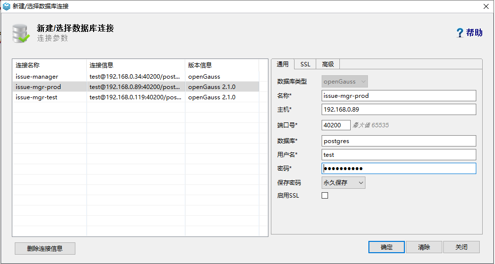
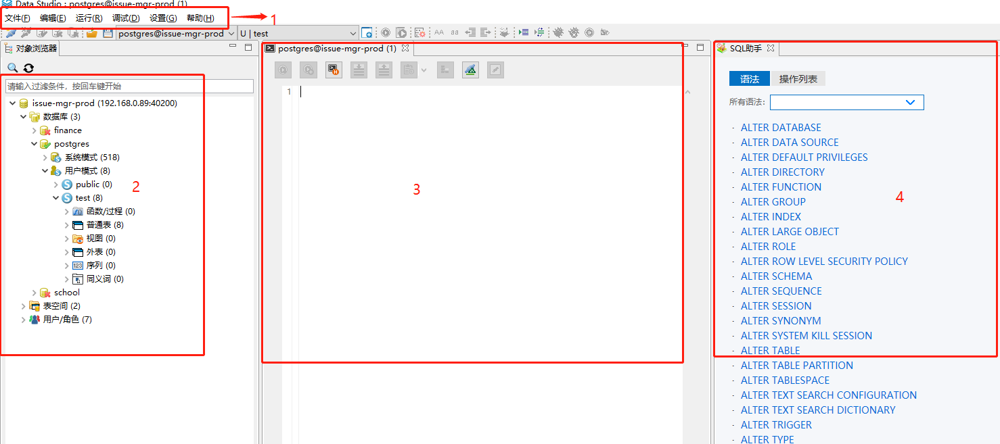

### 1.虚拟机的安装

#### 1.1 安装 virtualbox

1. 访问[https://www.virtualbox.org/wiki/Downloads](https://www.virtualbox.org/wiki/Downloads) 安装对应平台的版本
2. 按照提示步骤安装好 virtualbox 环境

#### 1.2 安装 vagrant

1. 访问[https://www.vagrantup.com/downloads](https://www.vagrantup.com/downloads) 安装对应平台的 vagrant

2. 按照提示步骤安装好 vagrant 环境

3. 执行`vagrant -v`,显示如下信息，则安装成功

   ```shell
   Vagrant 2.2.19
   ```

#### 1.3 安装 centos7

1. 建立一个文件夹创建虚拟机环境

2. 使用国内镜像源初始化 Vagrantfile 文件

   ```shell
   vagrant init centos7 https://mirrors.ustc.edu.cn/centos-cloud/centos/7/vagrant/x86_64/images/CentOS-7.box
   ```

3. 修改 Vagrantfile 文件，配置虚拟机

```ruby
Vagrant.configure("2") do |config|
  # 镜像名称
  config.vm.box = "centos7"
  # 国内镜像源
  config.vm.box_url = "https://mirrors.ustc.edu.cn/centos-cloud/centos/7/vagrant/x86_64/images/CentOS-7.box"
  # 使用公共网络
  config.vm.network "public_network"
  config.vm.provider "virtualbox" do |vb|
     # 配置虚拟机名称
     vb.name = "openGauss"
     # 配置虚拟机cpu个数
     vb.cpus = 2
     # 配置虚拟机内存
     vb.memory = 1024
  end
end
```

4.启动并进入虚拟机

```shell
# 启动虚拟机
vagrant up
# 进入虚拟机
vagrant ssh
# 关闭防火墙
systemctl disable firewalld.service
systemctl stop firewalld.service
# 关闭SELinux
sed -i s/SELINUX=.*/SELINUX=disabled/ /etc/selinux/config
# 将各数据库节点的字符集设置为相同的字符集，可以在/etc/profile文件中添加“export LANG=XXX”（XXX为Unicode编码）
vim /etc/profile
# 关闭交换内存
swapoff -a
# 更新yum
yum -y update
# 清除缓存
yum clean all
# 安装openjdk
yum install -y java-1.8.0-openjdk-1.8.0.212.b04-0.el7_6.x86_64
yum install -y java-1.8.0-openjdk-devel-1.8.0.212.b04-0.el7_6.x86_64
# 配置jdk环境变量
vi /etc/profile
export JAVA_HOME=/usr/lib/jvm/java-1.8.0-openjdk-1.8.0.212.b04-0.el7_6.x86_64
export CLASSPATH=.:$JAVA_HOME/jre/lib/rt.jar:$JAVA_HOME/lib/dt.jar:$JAVA_HOME/lib/tools.jar
export PATH=$PATH:$JAVA_HOME/bin
# 生效环境变量
source /etc/profile
# 重启虚拟机
vagrant reload
```

### 2.安装单机版 openGauss

1. 访问`https://opengauss.org/zh/download.html`下载`openGauss_2.1.0 极简版`
2. 使用 vagrant 用户安装 openGauss

```shell
# 将安装包放在Vagrantfile同级目录，并重启虚拟机
vagrant reload
#进入安装包所在目录
cd /vagrant
# 解压openGauss压缩包到安装目录
tar -jxf openGauss-2.1.0-CentOS-64bit.tar.bz2 -C /opt/openGauss
# 进入解压后目录下的simpleInstall
cd /opt/openGauss/simpleInstall
# 执行install.sh脚本安装openGauss
sh install.sh -w test@123 -p 40200
-w 初始化密码
-p 指定端口 默认5432
# 使用如下命令连接数据库
gs_ctl start|stop|restart -D $GAUSSHOME/data/single_node -Z single_node
```

> 执行时，如果出现报错“the maximum number of SEMMNI is not correct, the current SEMMNI is xxx. Please check it.”，请使用有 root 权限的用户执行如下命令 。

```shell
sysctl -w kernel.sem="250 85000 250 330"
```

3. 修改`/opt/openGauss/data/single_node/pg_hba.conf`文件

```shell
# 在文件末尾追加客户端host认证方式
host all all 0.0.0.0/0 sha256
```

4. 修改`/opt/openGauss/data/single_node/postgresql.conf`文件

```shell
# 将监听地址设置为*或者指定的客户端ip地址
listen_addresses = '*'
```

5. 重启数据库

```shell
cd /opt/openGauss/bin
#  重启数据库
./gs_ctl restart -D /opt/openGauss/data/single_node/ -Z single_node
```

6. 连接数据库，创建用户

```shell
# 连接数据库
/opt/openGauss/bin/gsql -d postgres -p 40200 -W 'test@123' -r
# 创建一个用户
create role test with createddb password "test@1234";
# 创建数据库
create database testdb owner test;
# 授予用户对数据库的全部权限
grant all privileges on database testdb to test;
# 授予该用户管理员权限
grant all privileges  to test;
```

7. 使用新用户连接数据库

```shell
/opt/openGauss/bin/gsql -d postgres -p 40200 -U test -W 'test@123' -r
```

### 3.下载安装 DataStudio

1. 访问[https://opengauss.org/zh/download.html](https://opengauss.org/zh/download.html) 下载 DataStudio_2.1.0
2. 打开 DataStudio 连接数据库
   
3. 连接上之后可以看见 DataStudio 的功能操作界面
   

- 1：工具栏菜单
- 2：数据库对象浏览器
- 3：数据库操作终端，书写业务 sql
- 4: sql 助手
