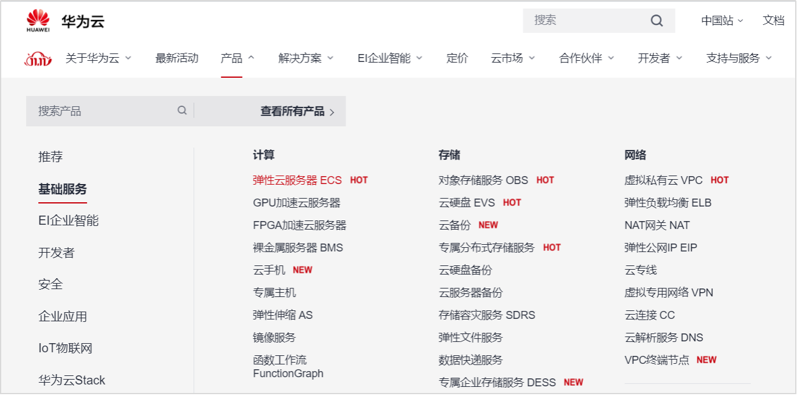
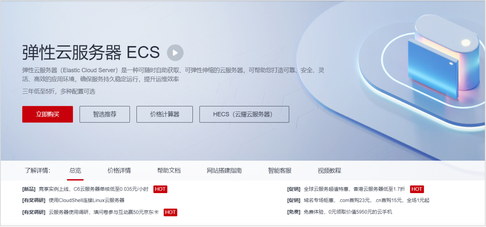
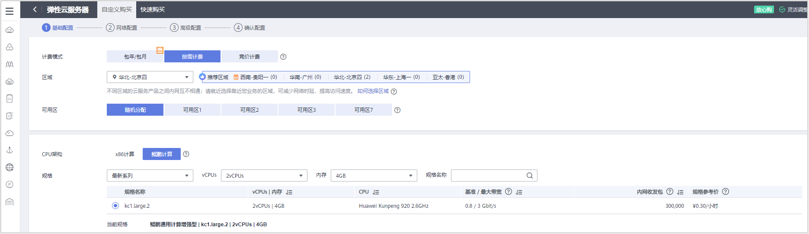
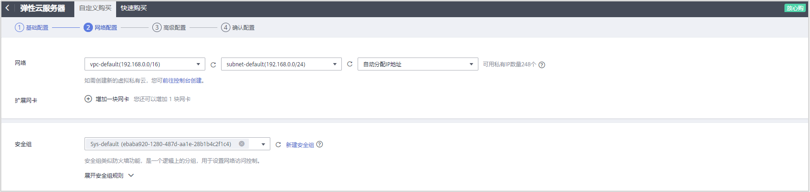
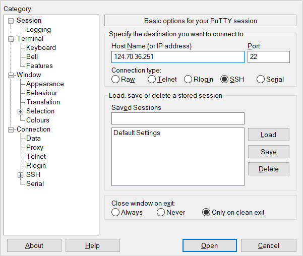
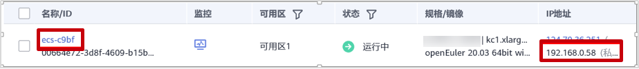

## 在 ECS 上安装部署 openGauss 数据库指导手册

文档下载：[在 ECS 上安装部署 openGauss 数据库指导手册.docx](../docs/在ECS上安装部署openGauss数据库指导手册.docx)

<!--

作者：CandyBullet
链接：https://www.imooc.com/article/23400
来源：慕课网
目录
前  言	3 \
简介	3 \
内容描述	3 \
前置条件	3 \
实验环境说明	3 \
实验概览	4 \
1 openGauss数据库安装	5 \
1.1 实验介绍	5 \
1.1.1 关于本实验	5 \
1.1.2 实验目的	5 \
1.2 购买弹性云服务器ECS（openEuler ARM 操作系统）	5 \
1.2.1 登录华为云	5 \
1.2.2 购买弹性云服务器ECS	6 \
1.3 修改操作系统配置	11 \
1.3.2 设置字符集参数	11  \
1.3.3 修改python版本	12 \
1.4 安装openGauss数据库	12 \
1.4.1 下载数据库安装包	12 \
1.4.2 创建XML配置文件	13 \
1.4.3 初始化安装环境	15 \
1.4.4 执行安装	18 \
1.4.1 安装生成的目录	19 \
2 数据库使用	21 \
2.1 前提条件	21 \
2.2 操作步骤	21 \
3 附录一：Linux操作系统相关命令	24 \
3.1 vi/vim	24 \
3.2 cd	25 \
3.3 mv	26 \
3.4 curl	26 \
3.5 yum	27 \
3.6 wget	28 \
3.7 ln	28 \
3.8 mkdir	29 \
3.9 chmod命令	30 \
3.10 chown	31 \
3.11 ls	31 \
3.12 cp	32 \
3.13 rm	33 \
3.14 cat	33 \
4 附录二：openGauss数据库基本操作	35 \
4.1 查看数据库对象	35 \
4.2 其他操作	36 \
-->

## 前 言

### 简介

openGauss 是关系型数据库，采用客户端/服务器，单进程多线程架构，支持单机和一主多备部署方式，备机可读，支持双机高可用和读扩展。
本实验主要描述 openGauss 数据库在弹性云服务器（openEuler）上的安装部署。

#### 内容描述

本实验主要内容为弹性云服务器（openEuler）上安装部署 openGauss 数据库，并进行简单的数据库相关操作。

#### 前置条件

由于本实验主要是在 openEuler 操作系统上进行 openGauss 数据库的部署，需要掌握 Linux 系统的基本操作和系统命令，详细请参见附录一。

#### 实验环境说明

1.  组网说明
    本实验环境为华为云环境，需要购买弹性云服务器。
2.  设备介绍
    为了满足 openGauss 安装部署实验需要，建议每套实验环境采用以下配置：
    软件类型和配置描述如下：

| 设备名称       | 设备型号         |
| -------------- | ---------------- |
| Linux 操作系统 | openEuler20.3LTS |
| Python         | Python 3.7.X     |

### 实验概览

本实验概览图


## 1 openGauss 数据库安装

### 1.1 实验介绍

1.1.1 关于本实验

本实验主要描述 openGauss 数据库在 openEuler 弹性云服务器上的安装部署。

1.1.2 实验目的

> 了解 openGauss 数据库部署方式；\
> 掌握 openGauss 数据库安装部署方法。

### 1.2 购买弹性云服务器 ECS（openEuler ARM 操作系统）

1.2.1 登录华为云 \
步骤 1 进入华为云官网。\
华为云官网：https://www.huaweicloud.com/，进入华为云官网，点击登录。\


步骤 2 输入账号名和密码，点击登录。


如果还没有注册，点击免费注册，按步骤进行注册后进行登录。

1.2.2 购买弹性云服务器 ECS \
步骤 1 在华为云主页(https://www.huaweicloud.com/)点击产品，选择基础服务，再选择弹性云服务器ECS。


步骤 2 进入弹性云服务器 ECS 购买界面。


步骤 3 自定义购买进行基础配置。
表 1-1ECS 基础配置

| 配置选项 | 配置值                                                             |
| -------- | ------------------------------------------------------------------ | --- |
| 计费     | 华北-北京四（推荐，其他区域可能会导致无法选择 openEuler 公共镜像） |
| CPU 架构 | 鲲鹏计算                                                           |
| 规格     | 最新系列 2vCPUs                                                    | 4GB |
| 镜像     | 公共镜像：openEuler openEuler 20.03 64bit with ARM(40GB)           |




其余默认即可，点击下一步网络配置。

步骤 4 自定义购买进行网路配置。
表 1-2ECS 网络配置

| 配置选项    | 配置值                                              |
| ----------- | --------------------------------------------------- |
| 网络        | Vpc-default（192.168.0.0/16）（选现有默认网络即可） |
| 弹性公网 IP | 现在购买                                            |
| 公网带宽    | 按流量计费                                          |
| 带宽大小    | 5                                                   |




其余默认即可，点击下一步高级配置。

步骤 5 自定义购买进行高级配置。\

记住用户名为 root，然后输入自定义密码和确认密码，其余默认即可。点击下一步确认设置。

步骤 6 确认配置购买成功。


确认设置信息，尤其是配置费用，然后勾选协议“我已经阅读并同意《华为镜像免责声明》”，点击立即购买。


查看云服务器列表


购买成功！
注意：本次购买鲲鹏服务器价格为公测价格，具体价格以华为云官网为准。

### 1.3 修改操作系统配置

为了操作方便，可以使用 SSH 工具（比如：PuTTY 等）从本地电脑通过配置弹性云服务器的弹性公网 IP 地址（如:124.70.36.251）来连接 ECS，并使用 ROOT 用户来登录。


1.3.2 设置字符集参数

将各数据库节点的字符集设置为相同的字符集，可以在/etc/profile 文件中添加"export LANG=XXX"（XXX 为 Unicode 编码）。
步骤 1 在/etc/profile 文件中添加"export LANG= en_US.UTF‐8"。

```
[root@ecs-c9bf ~]# cat >>/etc/profile<<EOF
export LANG=en_US.UTF‐8
EOF
```

步骤 2 输入如下命令，使修改生效。
`[root@ecs-c9bf ~]# source /etc/profile`

1.3.3 修改 python 版本

之后安装过程中 openGauss 用户互信，openEuler 服务器需要用到 Python-3.7.x 命令，但是 o 默认 Python 版本为 Python-2.7.x，所以需要切换 Python 版本。\
步骤 1 进入/usr/bin 文件，备份 python 文件。

[root@ecs-c9bf ~]# cd /usr/bin

备份 python 文件。
[root@ecs-c9bf bin] # mv python python.bak

步骤 2 建立 python3 软连接。\
[root@ecs-c9bf bin] # ln -s python3 /usr/bin/python

步骤 3 验证 python 版本。\
[root@ecs-c9bf bin] # python -V
显示如下，说明切换成功：
Python 3.7.4

步骤 4 python 版本切换成功，后续安装需要 libaio 包，下载进行安装。\
[root@ecs-c9bf ~]# yum install libaio\* -y

### 1.4 安装 openGauss 数据库

1.4.1 下载数据库安装包

步骤 1 以 root 用户登录待安装 openGauss 的主机，并按规划创建存放安装包的目录。

```
[root@ecs-c9bf bin]# mkdir -p /opt/software/openGauss
[root@ecs-c9bf bin]# chmod 755 -R /opt/software
```

注：
**_不建议把安装包的存放目录规划到 openGauss 用户的家目录或其子目录下，可能导致权限问题。_**
**_openGauss 用户须具有/opt/software/openGauss 目录的读写权限。_**

步骤 2 使用 wget 下载数据库安装包到安装包目录。

切换到安装目录：
[root@ecs-c9bf bin]# cd /opt/software/openGauss

使用 wget 下载安装包：
[root@ecs-c9bf openGauss]# wget https://opengauss.obs.cn-south-1.myhuaweicloud.com/1.1.0/arm/openGauss-1.1.0-openEuler-64bit-all.tar.gz

**_注： https://opengauss.obs.cn-south-1.myhuaweicloud.com/1.1.0/arm/openGauss-1.1.0-openEuler-64bit-all.tar.gz是数据库安装包下载网址，输入时不需要进行换行。_**

下载成功显示如下：
……
2020-09-14 13:57:23 (9.33 MB/s) - ‘openGauss-1.1.0-openEuler-64bit-all.tar.gz’ saved [58468915/58468915]

1.4.2 创建 XML 配置文件

- 安装 openGauss 前需要创建 XML 文件。XML 文件包含部署 openGauss 的服务器信息、安装路径、IP 地址以及端口号等。用于告知 openGauss 如何部署。用户需根据不同场合配置对应的 XML 文件。\
- 以单节点配置的方案为例，说明如何创建 XML 配置文件。
- 步骤 1 以 root 用户登录待安装 openGauss 的主机，切换到存放安装包的目录。
  `[root@ecs-c9bf bin]# cd /opt/software/openGauss`

步骤 2 创建 XML 配置文件，用于数据库安装。\
`[root@ecs-c9bf openGauss]# vi clusterconfig.xml`

步骤 3 输入”i”进入 INSERT 模式，添加文本如下，加粗字体内容为示例，可自行替换。其中“ecs-c9bf”是弹性云服务器的名称，“192.168.0.58”为弹性云服务器的 IP 地址（私有），其他 value 值可以不进行修改。

```
<?xml version="1.0" encoding="UTF-8"?>
<ROOT>
    <CLUSTER>
        <PARAM name="clusterName" value="dbCluster" />
        <PARAM name="nodeNames" value="ecs-c9bf" />
        <PARAM name="backIp1s" value="192.168.0.58"/>
        <PARAM name="gaussdbAppPath" value="/opt/gaussdb/app" />
        <PARAM name="gaussdbLogPath" value="/var/log/gaussdb" />
        <PARAM name="gaussdbToolPath" value="/opt/huawei/wisequery" />
        <PARAM name="corePath" value="/opt/opengauss/corefile"/>
        <PARAM name="clusterType" value="single-inst"/>
    </CLUSTER>

    <DEVICELIST>

        <DEVICE sn="1000001">
            <PARAM name="name" value="ecs-c9bf"/>
            <PARAM name="azName" value="AZ1"/>
            <PARAM name="azPriority" value="1"/>
            <PARAM name="backIp1" value="192.168.0.58"/>
            <PARAM name="sshIp1" value="192.168.0.58"/>

	    <!--dbnode-->
	    <PARAM name="dataNum" value="1"/>
	    <PARAM name="dataPortBase" value="26000"/>
	    <PARAM name="dataNode1" value="/gaussdb/data/db1"/>
        </DEVICE>
    </DEVICELIST>
</ROOT>
```

弹性云服务器名称及私有 IP 查看：


步骤 4 点击“ESC”退出 INSERT 模式，然后输入“:wq”后回车退出编辑并保存文本。\
表 1-3 配置文件参数附加说明

| 参数            | 说明                                                                                                                                                                                                                                                                                                        |
| --------------- | ----------------------------------------------------------------------------------------------------------------------------------------------------------------------------------------------------------------------------------------------------------------------------------------------------------- |
| clusterName     | openGauss 名称                                                                                                                                                                                                                                                                                              |
| nodeNames       | openGauss 中主机名称。                                                                                                                                                                                                                                                                                      |
| backIp1s        | 主机在后端存储网络中的 IP 地址（内网 IP）。所有 openGauss 主机使用后端存储网络通讯。                                                                                                                                                                                                                        |
| gaussdbAppPath  | openGauss 程序安装目录。此目录应满足如下要求：• 磁盘空间>1GB • 与数据库所需其它路径相互独立，没有包含关系。                                                                                                                                                                                                 |
| gaussdbLogPath  | openGauss 运行日志和操作日志存储目录。此目录应满足如下要求： •磁盘空间建议根据主机上的数据库节点数规划。数据库节点预留 1GB 空间的基础上，再适当预留冗余空间。 •与 openGauss 所需其它路径相互独立，没有包含关系。 此路径可选。不指定的情况下，openGauss 安装时会默认指定“$GAUSSLOG/安装用户名”作为日志目录。 |
| tmpdbPath       | 数据库临时文件存放目录。若不配置 tmpdbPath，默认存放在/opt/huawei/wisequery/perfadm_db 目录下。                                                                                                                                                                                                             |
| gaussdbToolPath | openGauss 系统工具目录，主要用于存放互信工具等。此目录应满足如下要求： • 磁盘空间>100MB • 固定目录，与数据库所需其它目录相互独立，没有包含关系。此目录可选。不指定的情况下，openGauss 安装时会默认指定“/opt/huawei/wisequery”作为数据库系统工具目录。                                                       |
| corePath        | openGauss core 文件的指定目录。                                                                                                                                                                                                                                                                             |

**_须知：_**

- “/opt/huawei/newsql/tools”存放互信等工具，避免权限问题，不要把实例数据目录放在此目录下。
- 安装目录和数据目录需为空或者不存在，否则可能导致安装失败。
- 在对数据库节点的实例进行具体配置时，需确保配置的目录之间不相互耦合。即各个配置目录不关联，删除其中任意一个目录，不会级联删除其它目录。如 gaussdbAppPath 为"/opt/gaussdb/app"，gaussdbLogPath 为"/opt/gaussdb/app/omm"。当 gaussdbAppPath 目录被删除时，会级联删除 gaussdbLogPath 目录，从而引起其它问题。
- 若需要安装脚本自动创建安装用户时各配置的目录需保证不与系统创建的默认用户目录耦合关联。
  _配置 openGauss 路径和实例路径时，路径中不能包含"|",";","&","$","<",">","`","\\","'","\"","{","}","(",")","[","]","~","_","?"特殊字符。

  1.4.3 初始化安装环境

为了保证 openGauss 的正确安装，请首先对主机环境进行配置。

1.4.3.1 准备安装用户及环境、
创建完 openGauss 配置文件后，在执行安装前，为了后续能以最小权限进行安装及 openGauss 管理操作，保证系统安全性，需要运行安装前置脚本 gs_preinstall 准备好安装用户及环境。

1.4.3.2 前提条件\

1.4.3.3 注意事项\

- 用户需要检查上层目录权限，保证安装用户对安装包和配置文件目录读写执行的权限；
- xml 文件中主机的名称与 IP 映射配置正确；
- 只能使用 root 用户执行 gs_preinstall 命令。
- 1.4.3.4 操作步骤\

步骤 1 修改 performance.sh 文件。\
使用 vi 打开文件“/etc/profile.d/performance.sh”，具体如下：\
[root@ecs-c9bf openGauss]# vi /etc/profile.d/performance.sh \
输入”i”，进入 INSERT 模式。用#注释 sysctl -w vm.min_free_kbytes=112640 &> /dev/null 这行。

```
CPUNO=`cat /proc/cpuinfo|grep processor|wc -l`
export GOMP_CPU_AFFINITY=0-$[CPUNO - 1]

#sysctl -w vm.min_free_kbytes=112640 &> /dev/null
sysctl -w vm.dirty_ratio=60 &> /dev/null
sysctl -w kernel.sched_autogroup_enabled=0 &> /dev/null
```

点击“ESC”退出 INSERT 模式。输入“:wq”后回车，保存退出。

步骤 2 为确保 openssl 版本正确，执行预安装前加载安装包中 lib 库。\
执行命令如下，其中 packagePath 为用户安装包放置的路径，本示例中为/opt/software/openGauss。\
`[root@ecs-c9bf openGauss]# vi /etc/profile`\

输入 i，进入 INSERT 模式，在文件的底部添加如下代码，加载安装包中 lib 库。按下“Esc”退出 INSERT 模式，输入”:wq”后回车，保存后退出。

```
export packagePath=/opt/software/openGauss
export LD_LIBRARY_PATH=$packagePath/script/gspylib/clib:$LD_LIBRARY_PATH
```

配置完成后，输入如下命令，使设置生效。

```
[root@ecs-c9bf openGauss]# source /etc/profile
```

步骤 3 在安装包所在的目录下，解压安装包。

```
[root@ecs-c9bf openGauss]# cd /opt/software/openGauss
```

解压缩安装包：\
先解压 openGauss-1.1.0-openEuler-64bit-all.tar.gz 包。\

```
[root@ecs-c9bf openGauss]# tar -zxvf  openGauss-1.1.0-openEuler-64bit-all.tar.gz
```

再先解压 openGauss-1.1.0-openEuler-64bit-om.tar.gz 包。

```
[root@ecs-c9bf openGauss]# tar -zxvf  openGauss-1.1.0-openEuler-64bit-om.tar.gz
```

解压后如下，用 ls 命令查看如下：

```
[root@ecs-c9bf openGauss]# ls
clusterconfig.xml                           openGauss-Package-bak_392c0438.tar.gz
lib                                         script
openGauss-1.1.0-openEuler-64bit-all.tar.gz  simpleInstall
openGauss-1.1.0-openEuler-64bit-om.sha256   upgrade_sql.sha256
openGauss-1.1.0-openEuler-64bit-om.tar.gz   upgrade_sql.tar.gz
openGauss-1.1.0-openEuler-64bit.sha256      version.cfg
openGauss-1.1.0-openEuler-64bit.tar.bz2
```

安装包解压后，会在/opt/software/openGauss 路径下自动生成 script 子目录，并且在 script 目录下生成 gs_preinstall 等各种 OM 工具脚本。

步骤 4 使用 gs_preinstall 准备好安装环境，切换到 gs_preinstall 命令所在目录。

```
[root@ecs-c9bf openGauss]# cd /opt/software/openGauss/script/
script中内容显示如下：
[root@ecs-c9bf script]# ls
gs_backup   gs_checkperf  gs_om             gspylib      gs_uninstall   __init__.py
gs_check    gs_collector  gs_postuninstall  gs_ssh       gs_upgradectl  killall
gs_checkos  gs_install    gs_preinstall     gs_sshexkey  impl           local
```

步骤 5 采用交互模式执行，并在执行过程中会创建 root 用户互信和 openGauss 用户互信：\

```
[root@ecs-c9bf script]# python gs_preinstall -U omm -G dbgrp -X /opt/software/openGauss/clusterconfig.xml
```

这里的 omm 为操作系统用户（注：同时 omm 也是 openGauss 的数据库管理员账号，在下面的 1.4.4 环节中会创建），dbgrp 为运行 openGauss 的操作系统用户的群组名称，/opt/software/openGauss/clusterconfig.xml 为 openGauss 配置文件路径。在执行过程中，用户根据提示选择是否创建互信，并输入 root 用户或 openGauss 用户的密码。

对 root 创建 trust，输入 root 的密码，购买弹性服务云时自定义的密码。

```
Are you sure you want to create trust for root (yes/no)? yes
Please enter password for root.
Password:  --说明：此处输入密码时，屏幕上不会有任何反馈，不用担心，这是LINUX操作系统对密码的保护.
Creating SSH trust for the root permission user.
创建操作系统omm用户，并对omm创建trust，并设置密码，设置为Admin@123(建议用户自定义设置密码)。
Are you sure you want to create the user[omm] and create trust for it (yes/no)? yes
Please enter password for cluster user.
Password:
Please enter password for cluster user again.
Password:
Successfully created [omm] user on all nodes.
成功后显示为：
……
Setting finish flag.
Successfully set finish flag.
Preinstallation succeeded.
```

1.4.4 执行安装\
执行前置脚本准备好 openGauss 安装环境之后，按照启动安装过程部署 openGauss。

1.4.4.1 前提条件\

- 已成功执行前置脚本 gs_preinstall；
- 服务器操作系统和网络均正常运行。
- 1.4.4.2 操作步骤

步骤 1 修改文件权限。

```
[root@ecs-c9bf script]# chmod -R 755 /opt/software/openGauss/script
```

步骤 2 登录到 openGauss 的主机，并切换到 omm 用户。\

```
[root@ecs-c9bf script]# su - omm
```

注：

- omm 指的是前置脚本 gs_preinstall 中-U 参数指定的用户。
- 安装脚本 gs_install 必须以前置脚本中指定的 omm 执行，否则，脚本执行会报错。
- 步骤 3 使用 gs_install 安装 openGauss。

执行以下命令进行安装

```
gs_install -X /opt/software/openGauss/clusterconfig.xml --gsinit-parameter="--encoding=UTF8"  --dn-guc="max_process_memory=4GB"  --dn-guc="shared_buffers=256MB" --dn-guc="bulk_write_ring_size=256MB" --dn-guc="cstore_buffers=16MB"
```

具体如下：

```
[omm@ecs-c9bf ~]$ gs_install -X /opt/software/openGauss/clusterconfig.xml --gsinit-parameter="--encoding=UTF8"  --dn-guc="max_process_memory=4GB"  --dn-guc="shared_buffers=256MB" --dn-guc="bulk_write_ring_size=256MB" --dn-guc="cstore_buffers=16MB"
/opt/software/ openGauss/clusterconfig.xml为openGauss配置文件的路径。在执行过程中，用户需根据提示输入数据库管理员omm用户的密码，密码具有一定的复杂度，为保证用户正常使用该数据库，请记住输入的数据库密码。
按照设置密码要求，设置密码为GaussDB@123（建议用户自定义设置密码）：
encrypt cipher and rand files for database.
Please enter password for database:
Please repeat for database:
begin to create CA cert files
设置的密码要符合复杂度要求：
最少包含8个字符；
不能和用户名和当前密码（ALTER）相同，或和当前密码反序；
至少包含大写字母（A-Z），小写字母（a-z），数字，非字母数字字符（限定为~!@#$%^&*()-_=+\|[{}];:,<.>/?）四类字符中的三类字符。
如果安装成功，显示如下：
……
Successfully deleted instances from all nodes.
Checking node configuration on all nodes.
Initializing instances on all nodes.
Updating instance configuration on all nodes.
Check consistence of memCheck and coresCheck on database nodes.
Configuring pg_hba on all nodes.
Configuration is completed.
Successfully started cluster.
Successfully installed application.
end deploy..
```

1.4.1 安装生成的目录 \
安装后的目录及各目录下的文件说明请参见错误!未找到引用源。\

表 1-4 安装后的目录及各目录下的文件说明

| 序号                                                                                                                                                                              | 项目目录说明                | 目录                                                                                                                                                                    | 子目录 | 说明 |
| --------------------------------------------------------------------------------------------------------------------------------------------------------------------------------- | --------------------------- | ----------------------------------------------------------------------------------------------------------------------------------------------------------------------- | ------ | ---- |
| 1                                                                                                                                                                                 | 集群 openGauss 安装目录     | /opt/gaussdb/app etc cgroup 工具配置文件。 include 存放数据库运行所需要的头文件。 lib 存放数据库的库文件的目录。 share 存放数据库运行所需要的公共文件，如配置文件模板。 |
| 2                                                                                                                                                                                 | 集群 openGauss 数据目录     | /gaussdb/data data_dnxxx DBnode 实例的数据目录，其中主实例的目录名为“data_dnxxx”，备实例的为 data_dnSxxx。xxx 代表 DBnode 编号。                                        |
| 3                                                                                                                                                                                 | 集群 openGauss 日志目录     | /var/log/gaussdb/用户名 bin 二进制程序的日志目录。 gs_profile 数据库内核性能日志目录。 om OM 的日志目录。例如：                                                         |
| 部分 local 脚本产生的日志，增删数据库节点接口的日志，gs_om 接口的日志，前置接口的日志，节点替换接口的日志等。 pg_audit 数据库审计日志目录。 pg_log 数据库节点实例的运行日志目录。 |
| 4                                                                                                                                                                                 | 集群 openGauss 系统工具目录 | /opt/huawei/wisequery                                                                                                                                                   |
| script 用于 openGauss 用户进行 openGauss 管理的脚本文件。 lib bin 目录下的二进制文件依赖的库文件。                                                                                |

## 2 数据库使用

本节描述使用数据库的基本操作。通过此节您可以完成创建数据库、创建表及向表中插入数据和查询表中数据等操作。

### 2.1 前提条件

- openGauss 正常运行。
- 由于本实验是对 openGauss 数据库的基本使用，需要掌握 openGauss 数据库的基本操作和 SQL 语法，openGauss 数据库支持 SQL2003 标准语法，数据库基本操作参见附录二。

### 2.2 操作步骤

步骤 1 在数据库主节点服务器上，切换至 omm 操作系统用户环境。
`[root@ecs-c9bf script]# su - omm `

若不确定数据库主节点部署在哪台服务器，请确认连接信息。

步骤 2 启动数据库服务（可选操作，如未启动，请按此步骤启动）。
启动服务命令：

```
[omm@ecs-c9bf ~]$ gs_om -t start
Starting cluster.
=========================================
=========================================
Successfully started.
```

查看服务是否启动：

```
[omm@ecs-9a68 ~]$ gs_om -t status
-----------------------------------------------------------------------

cluster_state   : Normal
redistributing  : No

-----------------------------------------------------------------------
```

步骤 3 连接数据库。

```
[omm@ecs-c9bf ~]$ gsql -d postgres -p 26000 -r
```

当结果显示为如下信息，则表示连接成功。

```
gsql ((openGauss 1.1.0 build 290d125f) compiled at 2020-05-08 02:59:43 commit 2143 last mr 131
Non-SSL connection (SSL connection is recommended when requiring high-security)
Type "help" for help.

postgres=#
```

其中，postgres 为 openGauss 安装完成后默认生成的数据库。初始可以连接到此数据库进行新数据库的创建。26000 为数据库主节点的端口号，需根据 openGauss 的实际情况做替换，请确认连接信息获取。\
引申信息：

- 使用数据库前，需先使用客户端程序或工具连接到数据库，然后就可以通过客户端程序或工具执行 SQL 来使用数据库了。
- gsql 是 openGauss 数据库提供的命令行方式的数据库连接工具。
- 步骤 4 第一次连接数据库时，需要先修改 omm 用户密码，新密码修改为 Bigdata@123（建议用户自定义密码）。

```
postgres=# alter role omm identified by 'Bigdata@123' replace 'GaussDB@123';
```

成功显示如下：

```
ALTER ROLE
```

步骤 5 创建数据库用户。\
默认只有 openGauss 安装时创建的管理员用户可以访问初始数据库，您还可以创建其他数据库用户帐号。

```
postgres=# CREATE USER joe WITH PASSWORD "Bigdata@123";
```

当结果显示为如下信息，则表示创建成功。

```
CREATE ROLE
```

如上创建了一个用户名为 joe，密码为 Bigdata@123 的用户。

步骤 6 创建数据库。

```
postgres=# CREATE DATABASE db_tpcc OWNER joe;
```

当结果显示为如下信息，则表示创建成功。

```
CREATE DATABASE
```

步骤 7 使用新用户连接到此数据库执行接下来的创建表等操作。当然，也可以选择继续在默认的 postgres 数据库下做后续的体验。
退出 postgres 数据库。

```
postgres=#  \q
```

使用新用户连接到此数据库。

```
[omm@ecs-c9bf ~]$ gsql -d db_tpcc -p 26000 -U joe -W Bigdata@123  -r
```

当结果显示为如下信息，则表示连接成功。

```
gsql ((openGauss 1.1.0 build 290d125f) compiled at 2020-05-08 02:59:43 commit 2143 last mr 131
Non-SSL connection (SSL connection is recommended when requiring high-security)
Type "help" for help.

db_tpcc=>
```

步骤 8 创建 SCHEMA。

```
db_tpcc=> CREATE SCHEMA joe AUTHORIZATION joe;
```

当结果显示为如下信息，则表示创建 SCHEMA 成功。

```
CREATE SCHEMA
```

步骤 9 创建表。

```
创建一个名称为mytable，只有一列的表。字段名为firstcol，字段类型为integer。
db_tpcc=>  CREATE TABLE mytable (firstcol int);
CREATE TABLE
```

步骤 10 向表中插入数据：

```
db_tpcc=> INSERT INTO mytable values (100);
```

当结果显示为如下信息，则表示插入数据成功。

```
INSERT 0 1
```

0：表示 OID，1：表示插入的条数。
查看表中数据：

```
db_tpcc=> SELECT * from mytable;
 firstcol
----------
      100
(1 row)
```

本实验结束。
