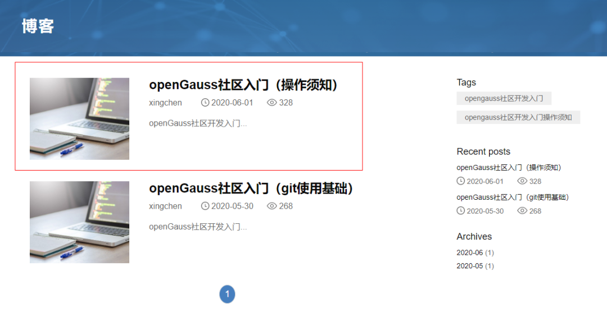
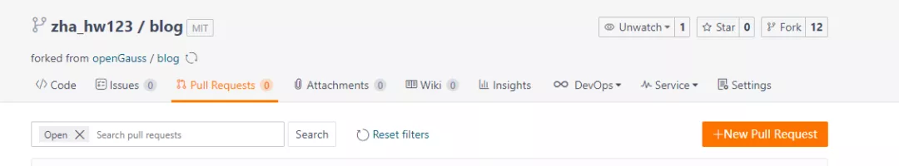

# 如何向 openGauss 社区提交你的第一篇博客<a name="ZH-CN_TOPIC_0000001070900122"></a>

openGauss 社区的博客板块对外完全开放，以方便参与者分享个人见解和技术经验。你可以将个人博客以 Pull Request 的方式提交到 openGauss 社区 blog 仓库， 在 Pull Request 合入 blog 仓库之后会自动同步到社区官网：https://opengauss.org/zh/blogs/blogs.html

以下内容将详细描述如何向 openGauss 社区提交你的第一篇博客：

## 注册 Gitee 账号<a name="section161292444617"></a>

openGauss 社区源代码以及官方网站和博客都托管在码云 Gitee 上面，组织仓库地址https://gitee.com/opengauss。

首先请参考https://gitee.com/help/articles/4113，完成Gitee账号的注册，然后需要前往http://gitee.com/profile/emails绑定你的主邮箱。

## 签署贡献者协议 CLA<a name="section7998165454612"></a>

在正式提交博客前，你还需要签署 openGauss 社区贡献者许可协议（CLA）。CLA 签署网址：https://opengauss.org/zh/cla.html

在该过程中，你需要填写一个表单，其中邮箱需要填写你之前在码云上设置的主邮箱地址。

)

## 提交你的博客<a name="section18740152218539"></a>

**Fork 主干仓库到个人仓库**

找到https://gitee.com/opengauss/blog仓库，点击右上角的Fork。


在弹窗中选择你的个人仓库，并点击 “确定（Confirm）”。


**将个人仓库 Clone 到本地**

访问你个人账号的 blog 仓库：https://gitee.com/\(user\)/blog，点击“克隆或下载”按钮，复制HTTPS地址。


在你本地机器上进入你想要存放 blog 的路径，输入

git clone https://gitee.com/\(user\)/blog.git （地址即刚才复制的 HTTPS 地址）

完成后即可在本地机器看到该仓库下的所有文件。

**完成你的博客**

进入到存放 blog 的路径下，输入以下命令创建你自己的文件夹

```
cd blog/content/zh/post
mkdir (Your author name)
```

进入到新建的文件夹 Your author name 中，新建你的博客。

```
cd (Your author name)
vi (title of your blog).md
```

其中\(title of your blog\).md 文件开头请参考如下模板。

```
---
title : "openGauss社区入门（git使用基础）"
date : "2020-05-30"
category: 'blog'
tags : ["openGauss社区开发入门"]
archives : "2020-05"
author : "xingchen"
summary : "openGauss社区开发入门"
img : "/zh/post/xingchen/title/title.jpg"
times : "17:30"
---
（你的博客正文内容）
```

参数说明

title：博客标题。

date：博客完成写作并提交的日期，如 2020-06-01。

tags：想给博客赋予的标签，这些标签会在官网博客界面中呈现，选择一个标签还可查看该标签下的所有博客。

archives：同一类博客的集合，目前我们按照年月来整理博客，例如输入 2020-06 即可。

author：对应你之前创建的文件夹 Your author name；

summary：这篇博客的简要概述。

img：博客的缩略图片，如/zh/post/xingchen/title/title.jpg。

times：完成时间，如“17:30”

官方网站效果如下：



**提交修改**

为了避免多个分支之间的不一致，我们建议签出到新分支：

```
git checkout -b new_branch_name
```

在添加完成博客文件后输入：

```
git add .
git commit –m “add my blog”
git push –f origin new_branch_name
```

**提交 Pull Request**



回到码云的\(user\)/blog 仓库中，在页签中找到 Pull Request，点击新建一个 Pull Request。


在创建界面将你的提交 Commit 的分支和 openGauss blog master 分支进行比较，完成创建 Pull Request。

以上全部流程可参照下图。


**完成合入**

Pull Request 创建完成后，blog 仓库的 Maintainer 会对提交的 Pull Request 进行检视，检视通过后会合入到 blog 的主干分支，后续会同步到 openGauss 的官方网站。https://opengauss.org/zh/blogs/blogs.html

以上就是在 openGauss 社区提交个人博客的全部过程。欢迎你加入 openGauss 社区中来，发表你的个人观点和见解。
