### 概述

本文描述了 openGauss 数据库内核基于 Taishan 服务器，在 openEuler 操作系统上，为了达到数据库的极致性能，所依赖的关键系统级调优配置。

**硬件规格：** \
CPU: Kunpen-920(1620) ARM aarch64 64 核 _ 2 \
内存: >=512G \
磁盘: Nvme SSD _ 4(每块大于 1TB) \
网卡: 1822 网卡 万兆网卡 Ethernet controller: Huawei Technologies Co., Ltd. Hi1822 Family (4\*25GE) (rev 45)

**软件规格：** \
操作系统: openEuler 20.03 (LTS) \
数据库: openGauss 1.0.0 \
Benchmark: benchmarksql-5.0 \
jdk: jdk1.8.0_212 \
ant: apache-ant-1.9.15

文章通过配置 BIOS、操作系统、文件系统、网络、绑核，构造 TPCC 测试数据等几个方面来对数据库进行调优。

- 依赖三方工具 `jdk ant benchmark`
- linux 工具 `htop iostat`

benchmark htop iostat 工具的安装使用请参照：[benchmark 使用](https://opengauss.org/zh/blogs/blogs.html?post/optimize/opengauss-tpcc/)

### BIOS 配置

登录服务器管理系统，重启服务器进入 BIOS 界面，修改 BIOS 相关配置并重启 (服务器管理系统以实际为准)。

**1.机器自检后，会提示启动选项**
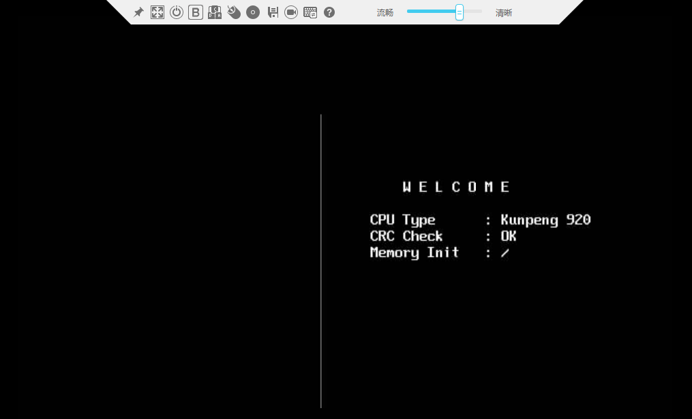

**2.按“Del”键，进入 BIOS**
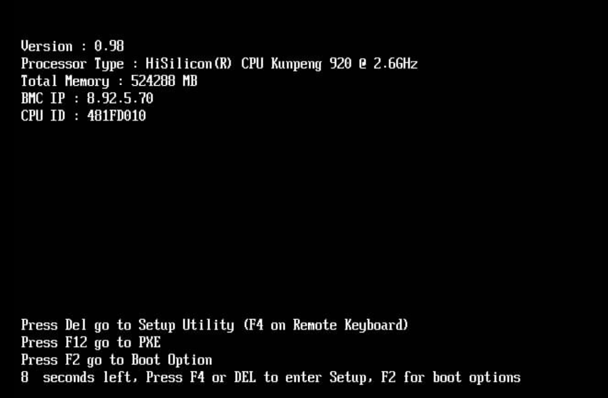

**3.输入 BIOS 密码**


**4.恢复出厂设置**

按下“F9”，恢复出厂设置  
_重要：因为现有的 BIOS 可能被改动过诸多默认设置，为保险起见，建议首先恢复出厂设置_

**5. 修改相关 BIOS 设置**

修改包括下面三项配置

```

# BIOS->Advanced->MISC Config，配置Support Smmu为Disabled
# BIOS->Advanced->MISC Config，配置CPU Prefetching Configuration为Disabled
# BIOS->Advanced->Memory Config，配置Die Interleaving为Disable

```

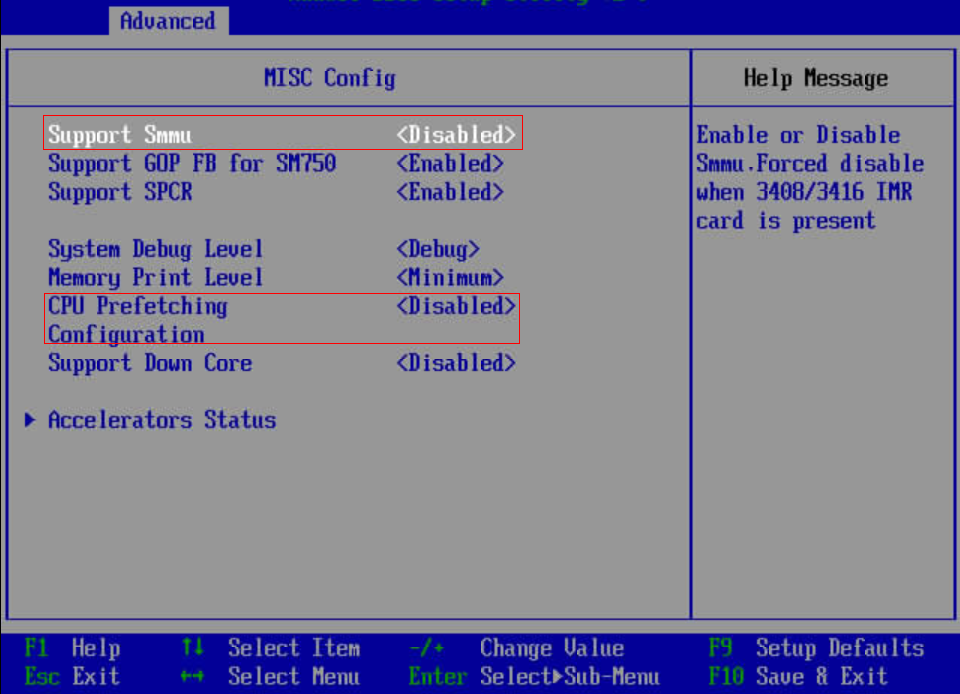
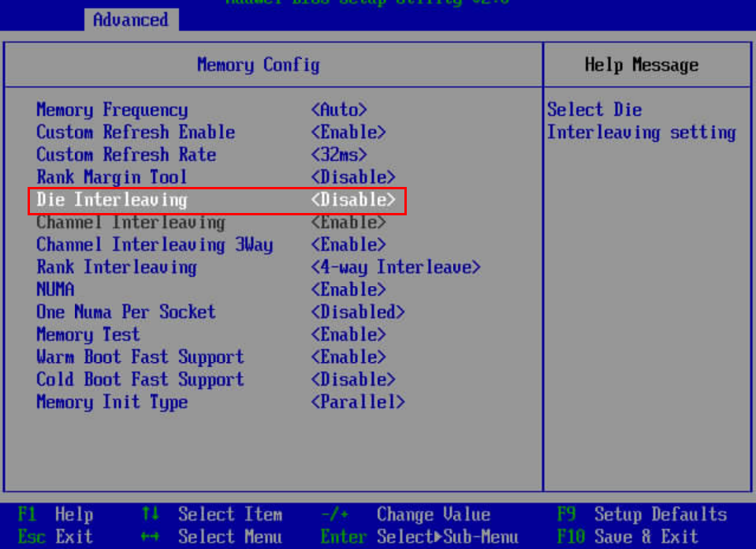

**6. 保存相关 BIOS 设置，并重启**

按“F10”保存并退出，重新启动系统


### 操作系统配置

**1. 优化操作系统相关配置**

Irq balance 关闭：为避免 gaussdb 与客户端抢用 CPU，导致 CPU 使用不均衡。
如果 htop 呈现出部分 CPU 压力很大，部分 CPU 很空闲时需要考虑是否关闭了 irqbalance。
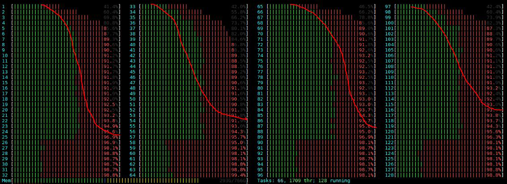

```shell

service irqbalance stop
echo 0 > /proc/sys/kernel/numa_balancing
echo 'never' > /sys/kernel/mm/transparent_hugepage/enabled
echo 'never' > /sys/kernel/mm/transparent_hugepage/defrag
echo none > /sys/block/nvme*n*/queue/scheduler  ## 针对nvme磁盘io队列调度机制设置

```

### 文件系统配置

**1. 修改 xfs 文件系统 blocksize 为 8K**

1. 确认 nvme 盘对应加载点的现有 blocksize
   下面命令查看当前挂载的 nvme 盘

```shell

df -h | grep nvme

```

```
/dev/nvme0n1                3.7T  2.6T  1.2T  69% /data1
/dev/nvme1n1                3.7T  1.9T  1.8T  51% /data2
/dev/nvme2n1                3.7T  2.2T  1.6T  59% /data3
/dev/nvme3n1                3.7T  1.4T  2.3T  39% /data4
```

`xfs_info`命令可以查看 nvme 盘的信息

```shell

xfs_info /data1

```

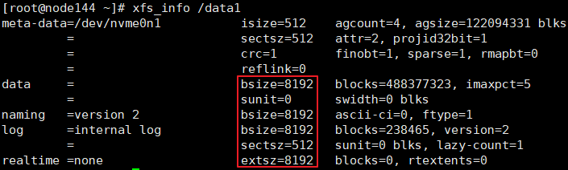

上图中 block 的大小正好为 8K, 不需要修改。若不满足 8k 块大小的要求, 需要重新格式, 格式化前注意数据的备份。

2. 针对需要格式化的磁盘，备份所需的数据

用户注意根据需要，将所需数据备份至其他磁盘或其他机器

3. 重新格式化磁盘，设置 block 大小 8k （X86 环境不需执行此步骤）

以/dev/nvme0n1 盘，加载点为/data1 为例，相关参考命令如下

```shell

umount /data1
mkfs.xfs -b size=8192 /dev/nvme0n1 -f
mount /dev/nvme0n1 /data1

```

4. 再次用`xfs_info`命令确认 blocksize 是否修改正确

### 网络配置

**1. 多中断队列设置** （X86 环境不需执行此步骤）

针对泰山服务器核数较多的特征，产品需要在服务器端和客户端设置网卡多队列。
当前推荐的配置为：服务器端网卡配置 16 中断队列，客户端网卡配置 48 中断队列。

多中断队列设置工具(1822-FW) \
Hi1822 网卡发布版本可以从如下链接获取，IN500 solution 5.1.0.SPC401 及之后正式支持设置多队列：
https://support.huawei.com/enterprise/zh/intelligent-accelerator-components/in500-solution-pid-23507369/software

1. 解压 Hi1822-NIC-FW.zip, 进入目录，在 root 用户下安装 hinicadm
   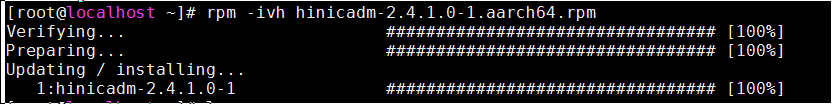

2. 确定当前连接的物理端口是哪个网卡的，不同硬件平台这个网口和网卡名有差别。以如下示例机器为例，当前使用 enp3s0 的小网网口，属于 hinic0 网卡
   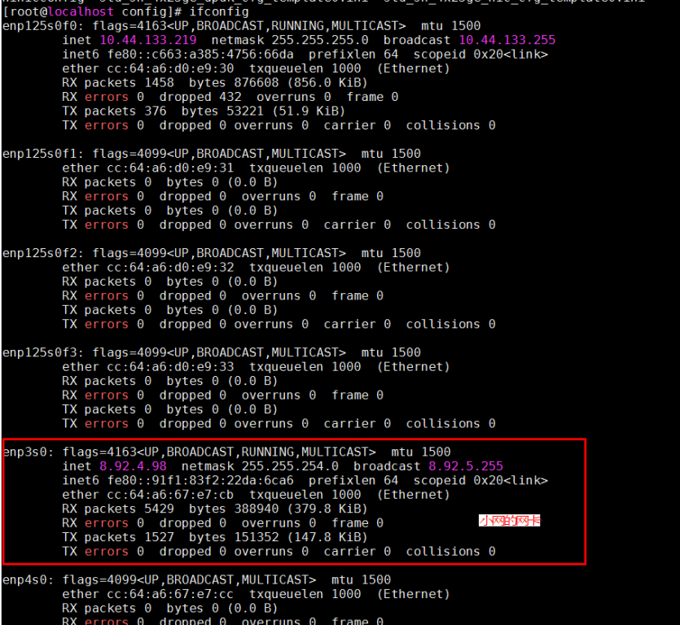
   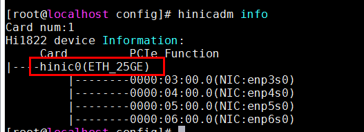

3. 进入 config 目录， 利用配置工具`hinicconfig`配置中断队列 FW 配置文件；

```
64队列配置文件：std_sh_4x25ge_dpdk_cfg_template0.ini；
16队列配置文件：std_sh_4x25ge_nic_cfg_template0.ini；
对hinic0卡配置为不同队列数（默认16队列，可以按需要调整）
```

```shell

./hinicconfig hinic0 -f std_sh_4x25ge_dpdk_cfg_template0.ini

```

重启操作系统生效，输入命令`ethtool -l enp3s0`查看（比如下图表示修改为 32）
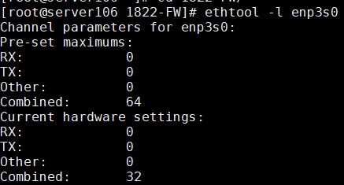

修改 combined 的值，输入命令`ethtool -L enp3s0 combined 48`（不同平台，不同应用的优化值可能不同，当前 128 核平台，服务器端调优值为 16，客户端调优值为 48）

**2. 中断调优**

在 openGauss 数据库满跑的情况下（CPU 占比 90%以上），CPU 成为瓶颈，开启 offloading，将网络分片 offloading 到网卡上

```shell

ethtool –K enp3s0 tso on
ethtool –K enp3s0 lro on
ethtool –K enp3s0 gro on
ethtool –K enp3s0 gso on

```

以 1620 平台为例，网卡中断绑定每个 numa node 中最后 4 个 core，每个 core 绑定 3 个中断。绑核中断脚本如下所示，此脚本将在 openGauss 安装的时候在 gs_preinstall 被调用，具体执行步骤请查看产品安装说明书：
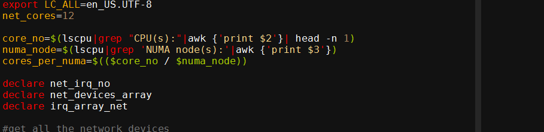

```shell

sh bind_net_irq.sh  16 （X86环境不需执行此步骤）

```

**3. 网卡固件确认与更新**

> 确认当前环境的小网网卡固件版本是否为 2.5.0.0

```shell

ethtool -i enp3s0

```

```
driver: hinic
version: 2.3.2.11
firmware-version: 2.5.0.0
expansion-rom-version:
bus-info: 0000:03:00.0
```

如果是 2.5.0.0，建议更换为 2.4.1.0，以获得更佳性能

> 网卡固件更新步骤

1. 上传网卡固件驱动至服务器
   Hi1822_nic_prd_1h_4x25G.bin

2. 使用 root 执行如下命令

```shell

hinicadm updatefw -i <物理网卡设备名> -f <固件文件路径>

```

其中，“物理网卡设备名”为网卡在系统中的名称，例如“hinic0”表示第一张网卡，“hinic1”表示第二张网卡，查找方法参见前文“多中断队列设置”。
例如：

```
# hinicadm updatefw -i <物理网卡设备名> -f <固件文件路径>
Please do not remove driver or network device
Loading...
[>>>>>>>>>>>>>>>>>>>>>>>>>>>>>>>>>>>>>>>>>>>>>>>>>>]  [100%] [\]
Loading firmware image succeed.
Please reboot OS to take firmware effect.

```

3. 重启服务器，再确认小网网卡固件版本成功更新为 2.4.1.0

```shell

ethtool -i enp3s0

```

```
driver: hinic
version: 2.3.2.11
firmware-version: 2.4.1.0
expansion-rom-version:
bus-info: 0000:03:00.0
```

确认小网网卡固件版本成功更新成功

### 数据库服务端及客户端绑核

安装数据库, 具体参考 openGauss 安装文档。

大概步骤如下：

1、停止数据库

2、修改 postgresql.conf 参数。

3、以绑核方式启动数据库：（X86 环境不需执行此步骤）
`numactl --interleave=all bin/gaussdb -D ${DATA_DIR} --single_node`

4、以绑核方式启动 benchmark：（X86 环境不需执行此步骤）
`numactl -C 0-19,32-51,64-83,96-115 ./runBenchmark.sh props.pg` \
按照自己的绑核配置和 benchmark 配置文件执行此命令。这里的绑核参数是在数据库绑核参数的空隙

**1. 服务器端绑核设置**

1. 业务进程在运行过程中，硬件上报的网络中断会导致频繁的上下文切换，严重影响效率，因此需要将网络中断和业务分开绑定在不同的核上运行，网络中断绑核请查看上一节

2. 当前 openGauss 中引入了线程池机制，即数据库启动时，线程池将创建指定数目的线程来服务，线程在创建时会进行绑核，因此需要将网卡的绑核信息通过 GUC 参数传入，方便运行期间绑核设置。以 128 核为例，对应参数如下图
   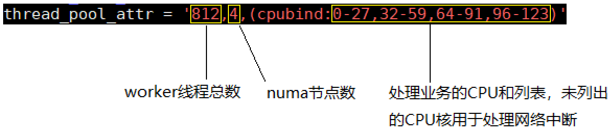
   其中线程总数为（cpu 总数 128 - 处理网络的 cpu 数目 16）* 每个核上线程数（经验值推荐 7.25） = (128-16)*7.25 = 812，numa 节点数为 4，处理中断的核数为 16。

如下为辅助分配绑定 CPU：

```shell

numactl -C 0-27,32-59,64-91,96-123 gaussdb --single_node -D {DATA_DIR} -p {PORT} &
或者：
numactl --interleave=all gaussdb --single_node -D {DATA_DIR} -p {PORT} &

```

**2. 服务器端参数设置**

postgresql.conf 中新增如下参数：

- `advance_xlog_file_num = 100` \
  此参数表示后台线程 BackgroundWALWriter 周期性地提前检测并初始化未来 100 个 XLog 文件，避免事务提交时才去执行 XLog 文件初始化，从而降低事务提交时延。只有在性能压力测试时作用才会体现出来，一般不用配置。默认为 0，即不进行提前初始化。
- `numa_distribute_mode = 'all'` \
  此参数目前有 all 和 none 两个取值。all 表示启用 NUMA 优化，将工作线程和对应的 PGPROC、WALInsertlock 进行统一分组，分别绑定到对应的 NUMA Node 下，以减少关键路径上的 CPU 远端访存。默认取值为 none，表示不启用 NUMA 分布特性。只有在涉及到多个 NUMA 节点，且远端访存代价明显高于本地访存时使用。当前建议在性能压力测试情况下开启。

thread_pool_attr 线程池配置 \
`thread_pool_attr = '812,4,(cpubind: 0-27,32-59,64-91,96-123)'`

相关参数：

```

max_connections = 4096
allow_concurrent_tuple_update = true
audit_enabled = off
cstore_buffers = 16MB
enable_alarm = off
enable_codegen = false
enable_data_replicate = off
full_page_writes = off
max_files_per_process = 100000
max_prepared_transactions = 2048
shared_buffers = 350GB
use_workload_manager = off
wal_buffers = 1GB
work_mem = 1MB
transaction_isolation = 'read committed'
default_transaction_isolation = 'read committed'
synchronous_commit = on
fsync = on
maintenance_work_mem = 2GB
vacuum_cost_limit = 10000
autovacuum = on
autovacuum_mode = vacuum
autovacuum_max_workers = 20
autovacuum_naptime = 5s
autovacuum_vacuum_cost_delay = 10
update_lockwait_timeout = 20min
enable_mergejoin = off
enable_nestloop = off
enable_hashjoin = off
enable_material = off
wal_log_hints = off
log_duration = off
checkpoint_timeout = 15min
autovacuum_vacuum_scale_factor = 0.1
autovacuum_analyze_scale_factor = 0.02
enable_save_datachanged_timestamp = false
enable_double_write = on
enable_incremental_checkpoint = on
enable_opfusion = on
advance_xlog_file_num = 100
numa_distribute_mode = 'all' （X86环境不需执行此步骤）
track_activities = off
enable_instr_track_wait = off
enable_instr_rt_percentile = off
track_counts = on
track_sql_count = off
enable_instr_cpu_timer = off
plog_merge_age = 0
session_timeout = 0
enable_instance_metric_persistent = off
enable_logical_io_statistics = off
enable_page_lsn_check = off
enable_user_metric_persistent = off
enable_xlog_prune = off
enable_resource_track = off
instr_unique_sql_count=0
remote_read_mode=non_authentication
wal_level = archive
hot_standby = off
hot_standby_feedback = off
client_min_messages = ERROR
log_min_messages = FATAL
enable_asp = off
enable_bbox_dump = off
bgwriter_flush_after = 32
minimum_pool_size = 200
wal_keep_segments = 1025
enable_bitmapscan = off
enable_seqscan = off
enable_beta_opfusion=on
enable_thread_pool = on   （X86环境不需执行此步骤）
checkpoint_segments=8000
enable_stmt_track=false
bgwriter_thread_num = 1
bgwriter_delay = 5s
incremental_checkpoint_timeout = 5min
thread_pool_attr = '464,4,(cpubind:1-27,32-59,64-91,96-123)' （X86环境不需执行此步骤）
xloginsert_locks = 16
wal_writer_cpu=0
wal_file_init_num = 20
xlog_idle_flushes_before_sleep = 500000000
pagewriter_sleep = 10ms

```

**3. TPCC 客户端绑核设置** （X86 环境不需执行此步骤）

客户端通过 numactl 将客户端绑定在除网卡外的核上，下图以 128 核环境举例，共 80 个核用于处理业务逻辑，剩余 48 个核处理网络中断。

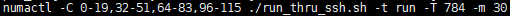

对应 tpmc 程序应该使用为：

```shell

numactl -C 0-19,32-51,64-83,96-115 ./runBenchmark.sh props.pg

```

其他核用来处理网络中断

### 构建 TPCC 初始数据

benchmark 的安装和使用参照文档：[benchmark 使用](https://opengauss.org/zh/blogs/blogs.html?post/optimize/opengauss-tpcc/)

**1. 修改 benchmark 配置**

复制 props.pg 并重命名为 props.opengauss.1000w，编辑该文件，将如下配置覆盖到文件里面

```shell

cp props.pg props.opengauss.1000w
vim props.opengauss.1000w

```

```

db=postgres
driver=org.postgresql.Driver
// 修改连接字符串, 包含ip, 端口号, 数据库
conn=jdbc:postgresql://ip:port/tpcc1000?prepareThreshold=1&batchMode=on&fetchsize=10
// 设置数据库登录用户和密码
user=user
password=******

warehouses=1000
loadWorkers=200

// 设置最大并发数量, 跟服务端最大work数对应
terminals=696
//To run specified transactions per terminal- runMins must equal zero
runTxnsPerTerminal=0
//To run for specified minutes- runTxnsPerTerminal must equal zero
runMins=60
//Number of total transactions per minute
limitTxnsPerMin=0

//Set to true to run in 4.x compatible mode. Set to false to use the
//entire configured database evenly.
terminalWarehouseFixed=false

//The following five values must add up to 100
//The default percentages of 45, 43, 4, 4 & 4 match the TPC-C spec
newOrderWeight=45
paymentWeight=43
orderStatusWeight=4
deliveryWeight=4
stockLevelWeight=4

// Directory name to create for collecting detailed result data.
// Comment this out to suppress.
resultDirectory=my_result_%tY-%tm-%td_%tH%tM%tS
osCollectorScript=./misc/os_collector_linux.py
osCollectorInterval=1
// 收集OS负载信息
//osCollectorSSHAddr=osuer@10.44.133.78
//osCollectorDevices=net_enp3s0 blk_nvme0n1 blk_nvme1n1 blk_nvme2n1 blk_nvme3n1

```

**2. TPCC 导入数据前准备**

1. 替换 tableCreats.sql 文件

下载文件 tableCreates.sql (https://blog.opengauss.org/zh/post/optimize/images/tableCreates.sql)。
使用该文件替换 benchmarkSQL 中路径 benchmarksql-5.0/run/sql.common/ 下的对应文件。\
该文件主要做了如下修改：\
1.增加了两个表空间

```
CREATE TABLESPACE example2 relative location 'tablespace2';
CREATE TABLESPACE example3 relative location 'tablespace3';
```

2.删除序列`bmsql_hist_id_seq`

3.给每一个表增加 FACTOR 属性，完整 tableCreate.sql 如下：

```
CREATE TABLESPACE example2 relative location 'tablespace2';
CREATE TABLESPACE example3 relative location 'tablespace3';
create table bmsql_config (
  cfg_name    varchar(30),
  cfg_value   varchar(50)
);-- DISTRIBUTE BY REPLICATION;

create table bmsql_warehouse (
  w_id        integer   not null,
  w_ytd       decimal(12,2),
  w_tax       decimal(4,4),
  w_name      varchar(10),
  w_street_1  varchar(20),
  w_street_2  varchar(20),
  w_city      varchar(20),
  w_state     char(2),
  w_zip       char(9)
)WITH (FILLFACTOR=80);-- DISTRIBUTE BY hash(w_id);

create table bmsql_district (
  d_w_id       integer       not null,
  d_id         integer       not null,
  d_ytd        decimal(12,2),
  d_tax        decimal(4,4),
  d_next_o_id  integer,
  d_name       varchar(10),
  d_street_1   varchar(20),
  d_street_2   varchar(20),
  d_city       varchar(20),
  d_state      char(2),
  d_zip        char(9)
 )WITH (FILLFACTOR=80);-- DISTRIBUTE BY hash(d_w_id);

create table bmsql_customer (
  c_w_id         integer        not null,
  c_d_id         integer        not null,
  c_id           integer        not null,
  c_discount     decimal(4,4),
  c_credit       char(2),
  c_last         varchar(16),
  c_first        varchar(16),
  c_credit_lim   decimal(12,2),
  c_balance      decimal(12,2),
  c_ytd_payment  decimal(12,2),
  c_payment_cnt  integer,
  c_delivery_cnt integer,
  c_street_1     varchar(20),
  c_street_2     varchar(20),
  c_city         varchar(20),
  c_state        char(2),
  c_zip          char(9),
  c_phone        char(16),
  c_since        timestamp,
  c_middle       char(2),
  c_data         varchar(500)
)WITH (FILLFACTOR=80)
tablespace example2;
--DISTRIBUTE BY hash(c_w_id);

-- create sequence bmsql_hist_id_seq;

create table bmsql_history (
  hist_id  integer,
  h_c_id   integer,
  h_c_d_id integer,
  h_c_w_id integer,
  h_d_id   integer,
  h_w_id   integer,
  h_date   timestamp,
  h_amount decimal(6,2),
  h_data   varchar(24)
)WITH (FILLFACTOR=80);-- DISTRIBUTE BY hash(h_w_id);

create table bmsql_new_order (
  no_w_id  integer   not null,
  no_d_id  integer   not null,
  no_o_id  integer   not null
)WITH (FILLFACTOR=80);-- DISTRIBUTE BY hash(no_w_id);

create table bmsql_oorder (
  o_w_id       integer      not null,
  o_d_id       integer      not null,
  o_id         integer      not null,
  o_c_id       integer,
  o_carrier_id integer,
  o_ol_cnt     integer,
  o_all_local  integer,
  o_entry_d    timestamp
)WITH (FILLFACTOR=80);-- DISTRIBUTE BY hash(o_w_id);

create table bmsql_order_line (
  ol_w_id         integer   not null,
  ol_d_id         integer   not null,
  ol_o_id         integer   not null,
  ol_number       integer   not null,
  ol_i_id         integer   not null,
  ol_delivery_d   timestamp,
  ol_amount       decimal(6,2),
  ol_supply_w_id  integer,
  ol_quantity     integer,
  ol_dist_info    char(24)
)WITH (FILLFACTOR=80);-- DISTRIBUTE BY hash(ol_w_id);

create table bmsql_item (
  i_id     integer      not null,
  i_name   varchar(24),
  i_price  decimal(5,2),
  i_data   varchar(50),
  i_im_id  integer
);-- DISTRIBUTE BY REPLICATION;

create table bmsql_stock (
  s_w_id       integer       not null,
  s_i_id       integer       not null,
  s_quantity   integer,
  s_ytd        integer,
  s_order_cnt  integer,
  s_remote_cnt integer,
  s_data       varchar(50),
  s_dist_01    char(24),
  s_dist_02    char(24),
  s_dist_03    char(24),
  s_dist_04    char(24),
  s_dist_05    char(24),
  s_dist_06    char(24),
  s_dist_07    char(24),
  s_dist_08    char(24),
  s_dist_09    char(24),
  s_dist_10    char(24)
)WITH (FILLFACTOR=80)
tablespace example3;
--DISTRIBUTE BY hash(s_w_id);
```

2. 修改索引 indexCreates.sql

修改 run/sql.common/indexCreates.sql 文件
 \
修改上图中红框中的内容如下： \
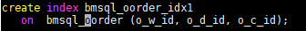

在该文件中添加下图中红色内容，可以在 benchmark 自动生成数据的时候自动生成到不同的数据表空间，如果未添加可以在 benchmark 生成数据之后再数据库端修改。用于分盘。
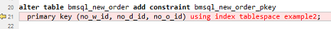
完整 insexCreate.sql 如下：

```
alter table bmsql_warehouse add constraint bmsql_warehouse_pkey
  primary key (w_id);

alter table bmsql_district add constraint bmsql_district_pkey
  primary key (d_w_id, d_id);

alter table bmsql_customer add constraint bmsql_customer_pkey
  primary key (c_w_id, c_d_id, c_id);

create index bmsql_customer_idx1
  on  bmsql_customer (c_w_id, c_d_id, c_last, c_first);

alter table bmsql_oorder add constraint bmsql_oorder_pkey
  primary key (o_w_id, o_d_id, o_id);

create index bmsql_oorder_idx1
   on  bmsql_oorder (o_w_id, o_d_id, o_c_id);

alter table bmsql_new_order add constraint bmsql_new_order_pkey
  primary key (no_w_id, no_d_id, no_o_id) using index tablespace example2;

alter table bmsql_order_line add constraint bmsql_order_line_pkey
  primary key (ol_w_id, ol_d_id, ol_o_id, ol_number);

alter table bmsql_stock add constraint bmsql_stock_pkey
  primary key (s_w_id, s_i_id);

alter table bmsql_item add constraint bmsql_item_pkey
  primary key (i_id);

```

3. 修改 runDatabaseBuild.sh 文件
   修改下图内容可避免生产数据时候的外键不支持错误
   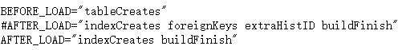
   ATTER_LOAD="indexCreates buildFinish"

**3. 导入数据**

运行 runDatabaseBuild.sh 导入数据

**4. 数据备份**

为了方便多次测试, 减少导数据的时间, 可以将导好的数据备份, 一种常用的做法是: 停止数据库, 将整个数据目录做一次拷贝。 恢复时参考脚本如下

```shell

#!/bin/bash
rm -rf /ssd/omm108/gaussdata
rm -rf /usr1/omm108dir/tablespace2
rm -rf /usr2/omm108dir/tablespace3
rm -rf /usr3/omm108dir/pg_xlog
cp -rf /ssd/omm108/gaussdatabf/gaussdata /ssd/omm108/ &
job0=$!
cp -rf /usr1/omm108dir/tablespace2bf/tablespace2 /usr1/omm108dir/ &
job1=$!
cp -rf /usr2/omm108dir/tablespace3bf/tablespace3 /usr2/omm108dir/ &
job2=$!
cp -rf /usr3/omm108dir/pg_xlogbf/pg_xlog /usr3/omm108dir/ &
job3=$!
wait $job1 $job2 $job3 $job0

```

**5. 数据分盘**

在性能测试过程中, 为了增加 IO 的吞吐量, 需要将数据分散到不同的存储介质上。
由于我们机器上有 4 块 NVME 盘, 可以将数据分散到不同的盘上。 我们主要将 pg_xlog, tablespace2, tablespace3 这三个目录放置在其他 3 个 NVME 盘上, 并在原有的位置给出指向真实位置的软连接. pg_xlog 位于数据库目录下, tablespace2, tablespace3 分别位于数据库目录 pg_location 下。 对 tablespace2 分盘的示例命令如下：

```shell

mv $DATA_DIR/pg_location/tablespace2 $TABSPACE2_DIR/tablespace2
cd $DATA_DIR/pg_location/
ln -svf $TABSPACE2_DIR/tablespace2 ./

```

**6. 运行 TPCC 程序** （X86 环境不需携带 numactl -C 0-19,32-51,64-83,96-115）

```shell

numactl –C 0-19,32-51,64-83,96-115 ./runBenchmark.sh props.opengauss.1000w

```

**7. 性能监控**

使用`htop`监控数据库服务端和 tpcc 客户端 CPU 利用情况, 极限性能测试情况下, 各个业务 CPU 的占用率都非常高(> 90%), 若有 CPU 占用率没有达标, 可能是绑核方式不对, 需要进行调整
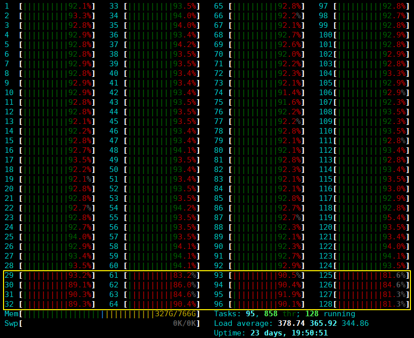
上图中黄线框中的是处理网络中断的 CPU

**8. 调优后的监控状态**

经过调优后的 htop 状态呈现这种状态是比较可靠的状态
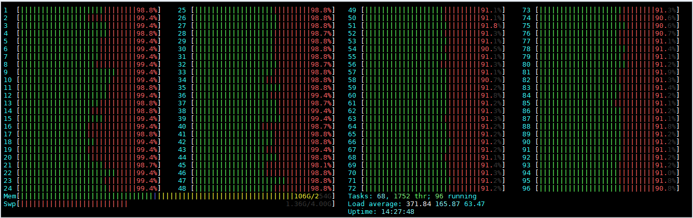

数据库调优是一个繁琐的工作，需要不断去修改配置，运行 TPCC，反复去调试以达到最优性能配置。

**TPCC 运行结果：**
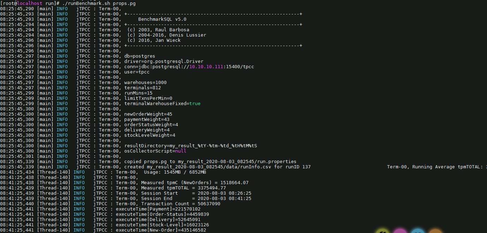
